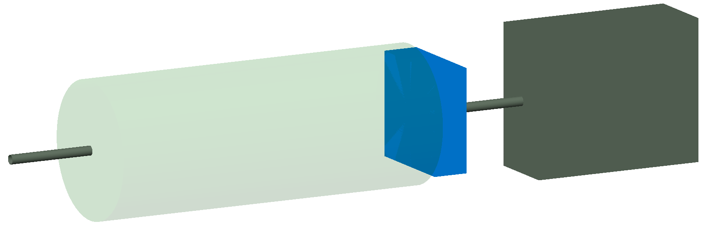

Air Water Target
================

This is a trivial example to show how to create a section of air between
beam line elements or at the end of a beam line.

The strategy is to create a drift without a surrounding beam pipe by using
the `apertureType="circularvacuum"` element parameter and to change
the `vaccumMaterial` parameter to the desired material such as air.

A second strategy is shown using a rectangular collimator. By not specifying
the `xsize` and `ysize` of the collimator opening, a collimator without
an opening is created, which is a block of material.

With the aperture type set to `circularvacuum` the drift is invisible as the
vacuum volumes are always invisible. To view these, the executable option
`--vis_debug` is used to show all volumes. With this option, invisible volumes
are displayed in transparent green.

How to run::

  bdsim --file=air.gmad --vis_debug

