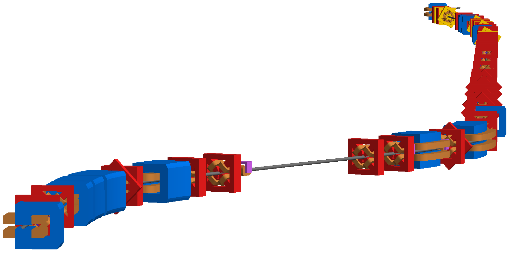
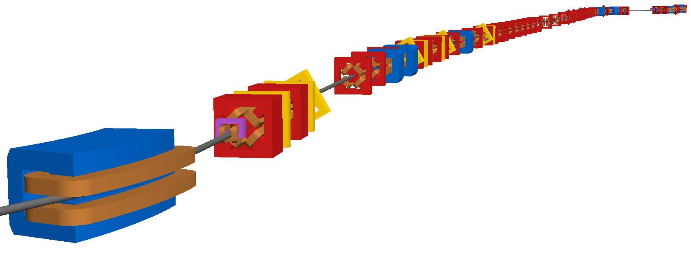

Accelerator Test Facility 2 - KEK, Japan
========================================

This is the 1.3GeV energy scaled test facility for the ILC final focus system.
The real machine consists of an approximately 70m normal conducting linac,
transfer line, racetrack damping ring and finally an extraction line. This
model represents only the ~100m extraction line.

The model was prepared in MADX and the Twiss output in MADX TFS format is
provided (with tar gzip). Two copies of this are provided with only the
energy spread in the header being different - in one case, the nominal
0.0008, and the other 0.

Three converted versions are provided. These are:

1) "linsige0" - linear optics, with fractional energy spread 0.
2) "linsige"  - linear optics, with nominal fractional energy spread 0.0008.
3) "nlsige"   - full nonlinear optics, with nominal fractional energy spread 0.0008.

How to run::

  bdsim --file=linsige.gmad --outfile=test1

.. figure:: atf2.png
	    :width: 100%
	    :align: center

The full machine as visualised by default in BDSIM.

The full machine looking from the beginning to the end.

The full machine looking from the end to the beginning with perspective.

.. figure:: atf2-sigma.pdf
	    :width: 100%
	    :align: center

Comparison of beam size as calculated by `rebdsimOptics` from tracking
1000 particles through the full machine.
