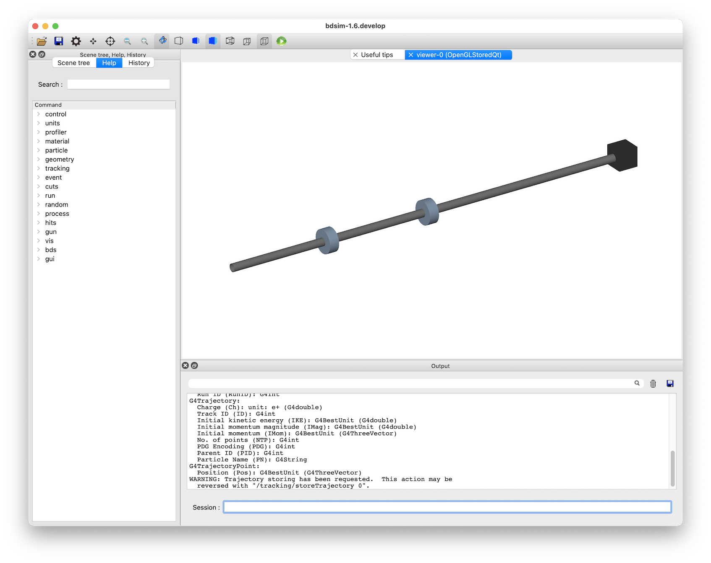
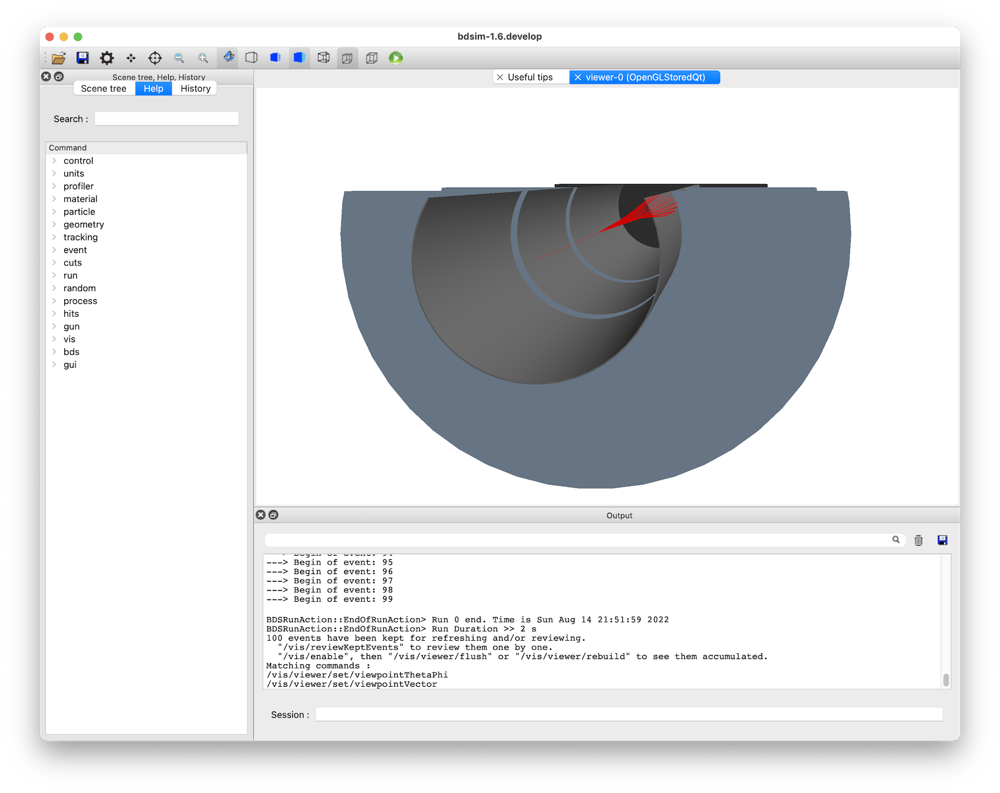
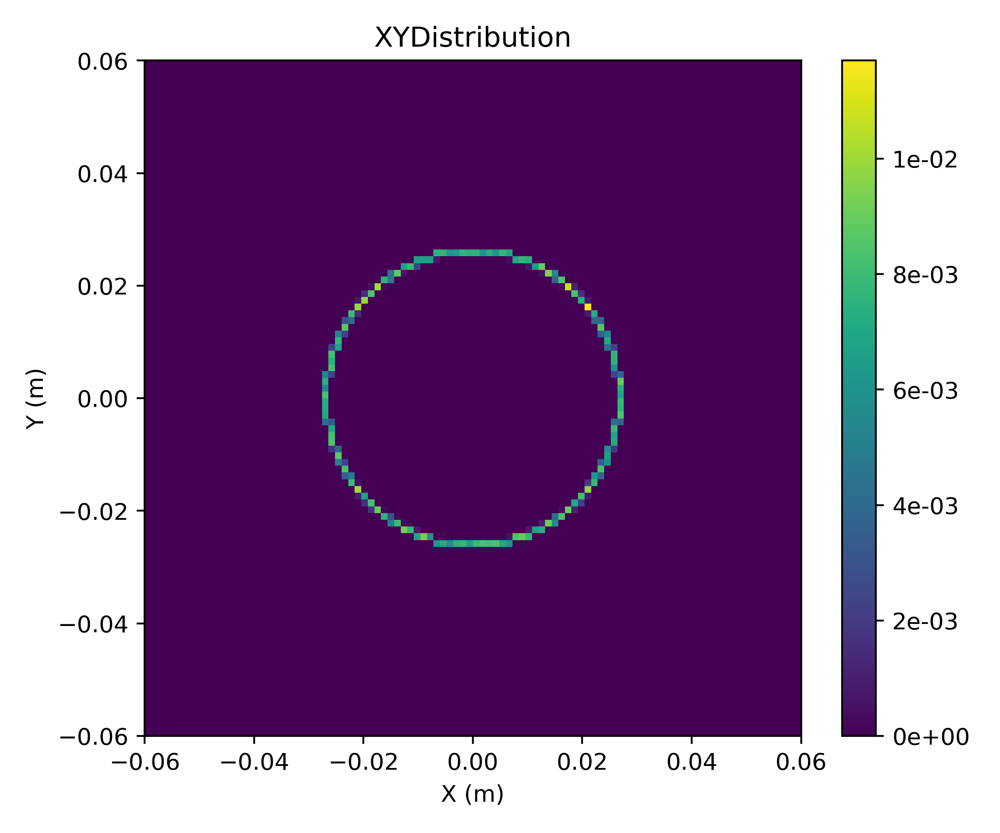

Beam Dump
=========

* Based on :code:`bdsim/examples/beamLoss/bd.gmad`

A simple example of a BDSIM model that sweeps a beam into a circle onto a dump.
It consists of a few drifts with 2x transverse RF cavities (an :code:`rfx` and
:code:`rfy`) that are :math:`pi/2` out of phase with each other. The beam is
a reference beam but with a uniform distribution in time covering 10 periods
of the frequency of the rfx and rfy (30 MHz).

No physics is turned on - only tracking is used. This makes the model relatively
quick to run and the dump kills all particles immediately upon entering it.

This is representative of how we might spread out a beam on a dump to avoid
damaging or overheating it.

How to run::
  
  bdsim --file=bd.gmad

Running 100 events with the following command in the visualiser session prompt, the
following visualisation is produced. ::

  /run/beamOn 100

	    In this view, a cut away plane was used as well as perspective. The cut away
	    plane can be added with :code:`/vis/viewer/addCutawayPlane 0 10 0 cm 0 -1 0`
	    and the perspective with the perspective icon at the top of the visualiser
	    window.

It takes about 25s on the developer's computer to run 10k events for a nice distribution.
Then using the included rebdsim analysis configuration file :code:`histogram.txt`:

::

   bdsim --file=bd.gmad --outfile=r1 --batch --ngenerate=10000
   rebdsim histogram.txt r1.root

We can see a 2D x-y distribution in :code:`r1_ana.root` (automatically named by rebdsim).
An included plotting script :code:`plotXY.py` can be used: ::

  python plotXY.py r1_ana.root

