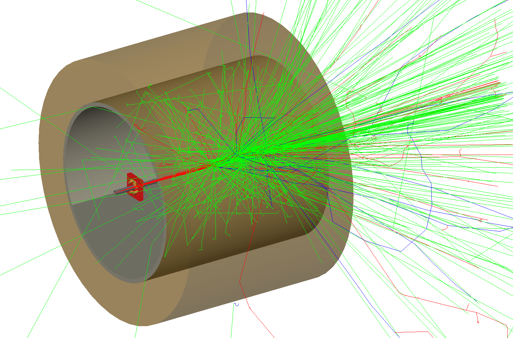

Beam Loss
=========

A simple example of a BDSIM model that sprays particles everywhere. It consists
of four quadrupole magnets that are on but not designed to contain the beam.
The beam is lost quickly creating a spray of secondary partilces in both the
machine components as well as the surrounding tunnel.

How to run::
  
  bdsim --file=bl.gmad

.. figure:: beamLoss.png
	    :width: 80%
	    :align: center

Running 10 events with the following command in the visualiser session prompt, the
following visualisation is produced. ::

  /run/beamOn 10

The default colour coding is described in :ref:`visualisation-default-colour-coding`.
