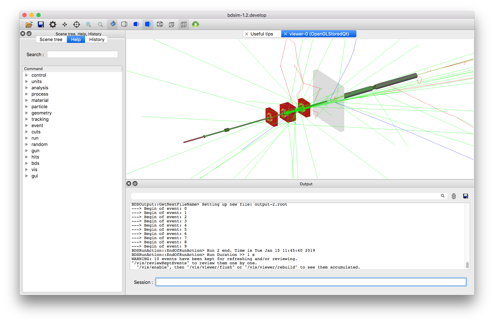
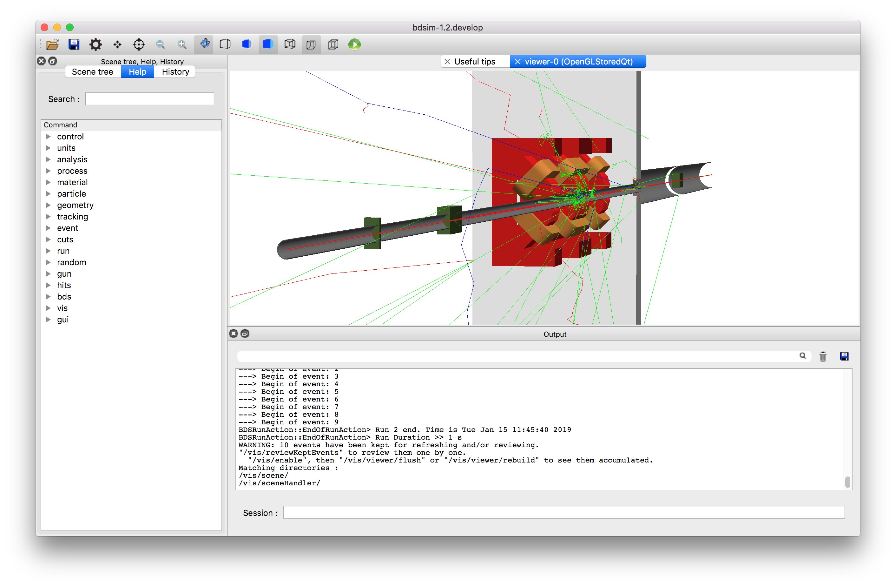
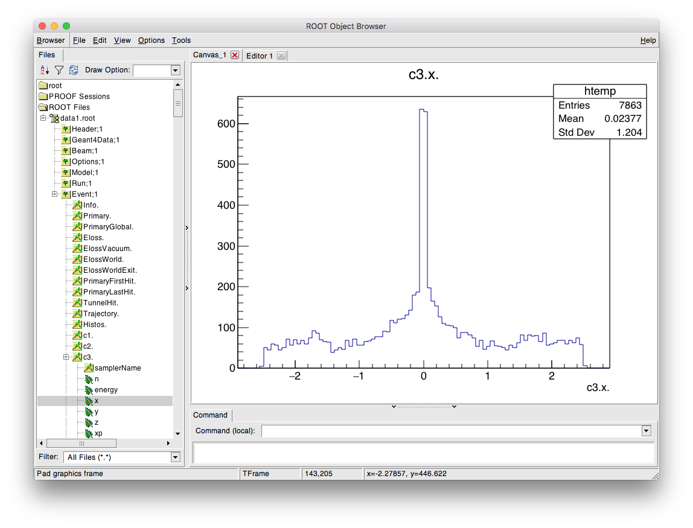
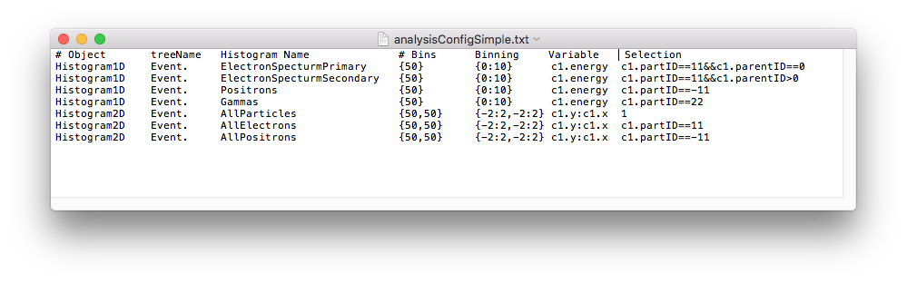
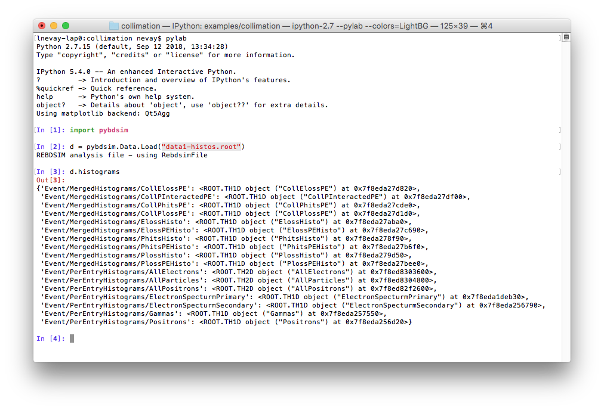

.. _example-collimation-simple:

Collimation
===========

This is an example to show how energy deposition and particle spectra
from a small collimation system. There is a more detailed version of
this example described in :ref:`example-collimation-advanced` with detailed
collimation-specific information.

The model consists of two collimators, followed by a triplet set of
quadrupoles, a shielding wall and a third collimator. The collimators
are made of successively denser material (carbon, copper and tungsten).

The first step is to prepare some data to analyse. 1000 events runs in
around 20s on the developer's computer. The files can be found in
:code:`bdsim/examples/collimation`. It can be run with the following command::

  bdsim --file=collimation.gmad --outfile=data1 --batch --ngenerate=1000

This will create an output file called `data1.root`.  We can run BDSIM with
the visualisation to get an idea of what happens in the model. This time, we run
without any data output.::

  bdsim --file=collimation.gmad --output=none

The following window (with Geant4 setup with the Qt visualiser) should appear.

.. figure:: collimation.png
	    :width: 90%
	    :align: center

If we type the following command in the terminal prompt at the bottom of this
window, we can visualise 10 events.::

  /run/beamOn 10

This looks like:

The particles are colour coded by charge by default (positive: blue, negative: red, and
neutral: green).
		    
The following view was created by adding a 'cut away plane' that makes part of
geometry on one side of a plane invisible. Also, the project was set from orthographic
to perspective based using the button on the toolbar (see :ref:`visualisation-control-buttons`).
The command for the cut away plane is::

  /vis/viewer/addCutawayPlane 0 0 0 m 1 0 0
  

We can take a look at the data with ROOT with the following command::

  root -l data1.root

The "-l" flag means no logo (slightly quicker), and specifying a file along with the command
means this file will come at the top of any browser windows in ROOT.

We start a TBrowser to inspect the data. The intention here is to inspect the data
and decide which histograms we might want to prepare from it.::

  root> TBrowser tb;

ROOT takes commands in C++, so here we construct an 'instance' of the TBrowser class
called "tb" (can be any name). The TBrowser brings up a window that allows graphical
exploration of the data. This looks like:

The most interesting information is the in the Event tree. Double-click on this to expand
it and look at the variables. A full explanation of the output here is described in
:ref:`output-event-tree`. This browser is most useful to get the exact names to prepare
the analysis configuration text file that's used for analysis.

To produce histograms, we prepare an input text file that describes which histograms
we want to prepare. This file is described in detail in
:ref:`analysis-preparing-analysis-config`.
Typically we start by copying an example from
:code:`bdsim/examples/features/analysis/perEntryHistograms/analysisConfig.txt`.

Below is an example analysis configuration called :code:`analysisConfigSimple.txt` that is
included in the same example directory.

The data can be analysed with the following command::

  rebdsim analysisConfigSimple.txt data1.root data1-histos.root

This will produce an output file called :code:`data1-histos.root` that contains
the requested histograms as well as a merged copy of any pre-made histograms
in the data file (such as energy deposition).

If we start another ROOT session, or click the refresh button (top left, near "Draw Option",
looks like a recycle symbol), the file view will refresh and we can browse the new output
file and view the histograms in ROOT.  We can also load the histograms in Python using the
`pybdsim` utility package and make some nicer plots.::

  ipython
  >>> import pybdsim
  >>> d = pybdsim.Data.Load("data1-histos.root")
  >>> d.histograms

This is described in the manual for `pybdsim` (see :ref:`python-utilities`) and the relevant
section is `<http://www.pp.rhul.ac.uk/bdsim/pybdsim/data.html>`_. This is what should
be seen:

The following commands can be used to make a few simple plots in Python::

  >>> pybdsim.Plot.EnergyDeposition("data1-histos.root")
  >>> pybdsim.Plot.LossAndEnergyDeposition("data1-histos.root")
  >>> d.histograms2dpy
  {'Event/PerEntryHistograms/AllElectrons': <pybdsim.Data.TH2 at 0x11e8f9590>,
  'Event/PerEntryHistograms/AllParticles': <pybdsim.Data.TH2 at 0x11e8f95d0>,
  'Event/PerEntryHistograms/AllPositrons': <pybdsim.Data.TH2 at 0x11e8f9550>}
  >>> pybdsim.Plot.Histogram2D(d.histograms2dpy['Event/PerEntryHistograms/AllParticles'], logNorm=True)

We leave it to the user to create their own plots, but the basic data exploration is
provided and the user should consult the `pybdsim` source code (see `pybdsim/pybdsim/Plot.py`)
for how we have made these plots using `matplotlib`.

The above commands create the following plots.

.. figure:: collimation-energy-deposition.pdf
	    :width: 100%
	    :align: center

.. figure:: collimation-losses.pdf
	    :width: 100%
	    :align: center
	    
.. figure:: collimation-allparticles.pdf
	    :width: 70%
	    :align: center
