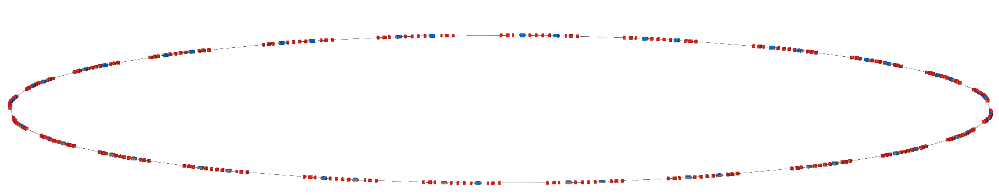
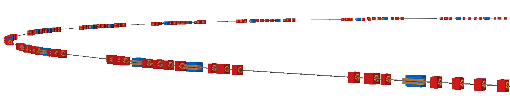

Diamond Light Soruce
====================

The Diamond Light Source at Rutherford Appleton laboratory in Oxford, UK. The
model is of the 560m storage ring. The model was prepared from a MADX job where
the sextupoles throughout the lattice were treated as thin sextupoles. The Twiss
table output in TFS format is included with this example and compressed for
convenience (`pybdsim` and `pymadx` both work with compressed files).

The BDSIM model provided was converted directly without modification.

.. note:: This is a cirular machine and should be executed with the
	  :code:`--circular` option to control the number of turns the
	  particls will take.

Example::

  bdsim --file=dia-nlsige.gmad --batch --circular --ngenerate=1000

This will run 1000 particles with a maximum of 1 turn. Below are sample
visualisations and the beam size and dispersion as calculated using
`rebdsimOptics` and comparison with `pybdsim`.

The full machine as visualised with BDSIM.
		    

Part of the machine visualised with perspective.
		    
.. figure:: diamond-sigma.pdf
	    :width: 100%
	    :align: center

The beam size in horizontal and vertical throughout a single turn of the
ring with 5000 particles. Particles tracked in BDSIM, sizes calculated
with `rebdsimOptics` and comparison with `pybdsim`.

.. figure:: diamond-dispersion.pdf
	    :width: 100%
	    :align: center

The dispersion in both horizontal and dispersion throughout a single turn
of the ring with 5000 particles. Particles tracked in BDSIM, sizes calcualted
with `rebdsimOptics` and comparison with `pybdsim`.
