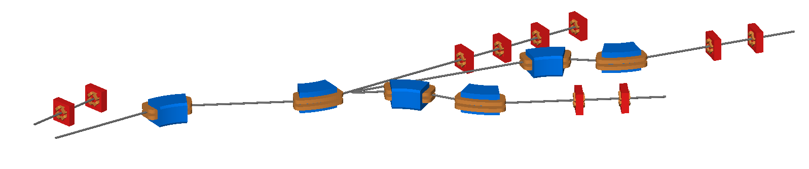

Multiple Beam Lines
===================

multiplebeamlines.gmad
----------------------

This example shows several beam lines placed in the same model. Currently only
one of these is suitable for tracking. This is mostly for display purposes and
current development will render each beam line suitable for tracking.

How to run::

  bdsim --file=multiplebeamlines.gmad

