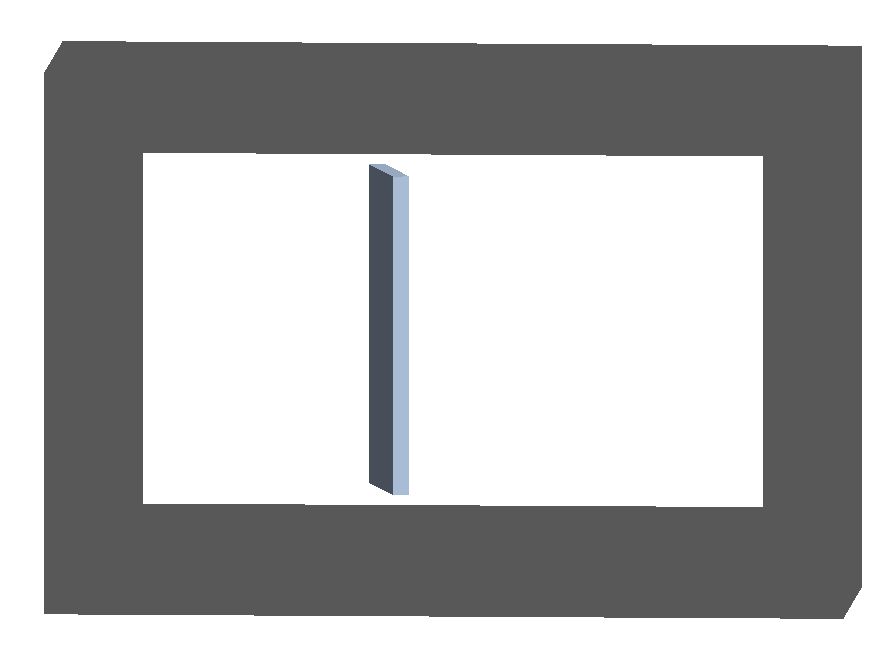
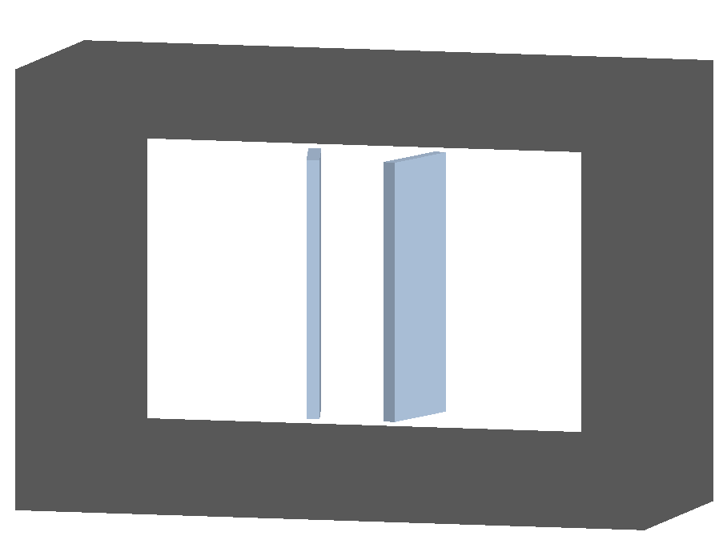
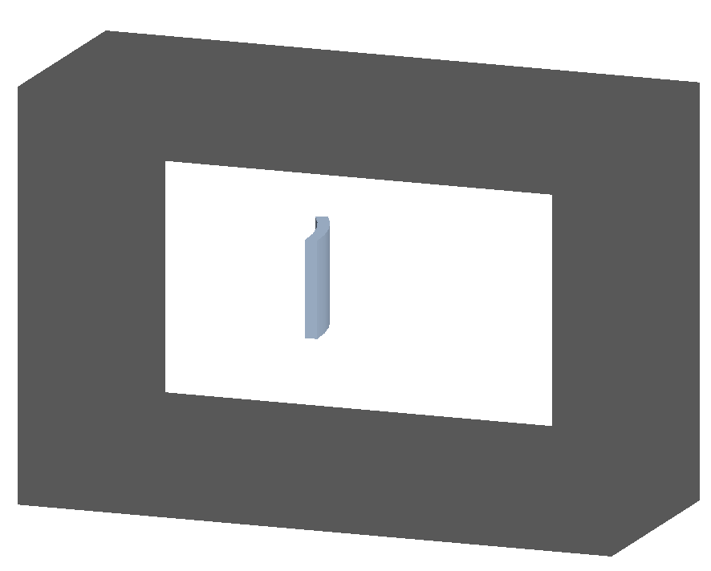
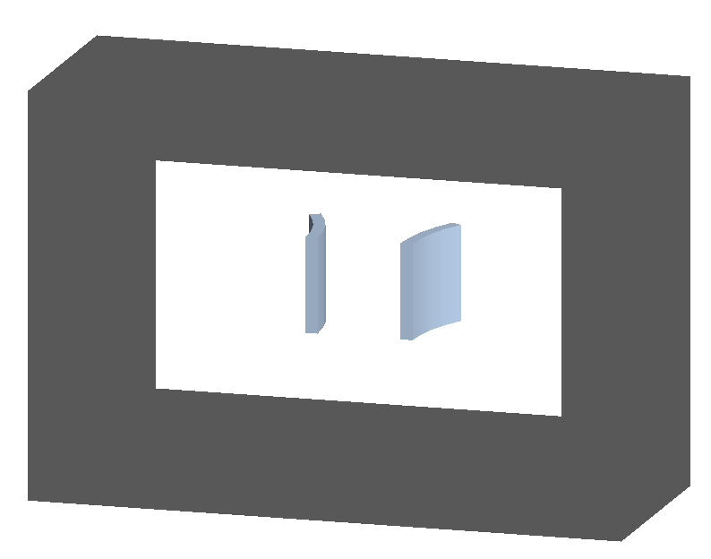
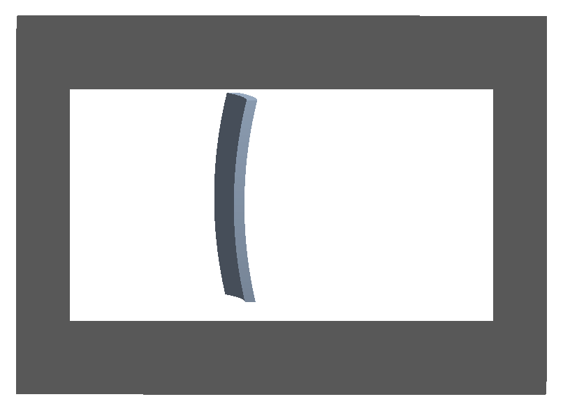
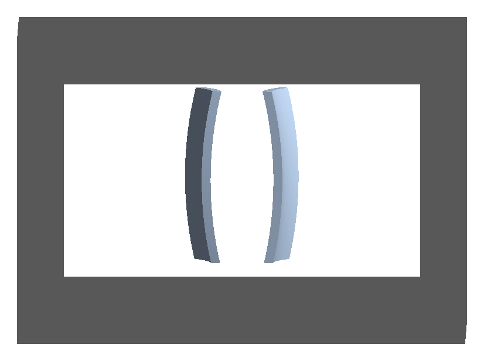
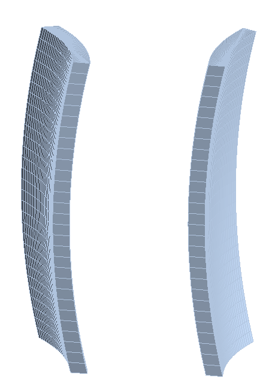

.. _crystal-examples:

Crystals
========

In each of the following examples one or more crystals are placed inside
a piece of beam pipe through the `crystalcol` beam line element.

As the typical angles for crystal channelling are very low (in the miliradian
to microradian regime), exaggerated examples are provided that are not
suitable for channelling studies but are however useful to visualise the
geometry involved. These exaggerated versions are suffixed with "strong".

There is the possibility of one or two crystals. Models with "1" in the name
have only 1 and with "2" in the name two.

.. note:: The crystal structure is independent of the geometry used and the
	  geometry merely acts as a shape where the crystal applies.

crystal-box
-----------

* crystal-box1-strong.gmad
* crystal-box1.gmad
* crystal-box2-strong.gmad

Crystals with the simple box geometry.

crystal-cylinder
----------------

* crystal-cylinder1-strong.gmad
* crystal-cylinder1.gmad
* crystal-cylinder2-strong.gmad

Crystals with geometry that's a section of a hollow cylinder.
  

crystal-cylinder
----------------

* crystal-cylinder1-strong.gmad
* crystal-cylinder1.gmad
* crystal-cylinder2-strong.gmad

Crystals with geometry that's bent in both axes. This would similar to a small
section of a hollow torus, hence the "torus" name. However, this is constructed
as a `G4ExtrudedSolid` as it's possible to choose angles that would result in
an unphysical torus.
		    

To construct the extruded solid, a cross-section is made at one (local, not machine
coordinate frame) `z` plane and extruded along the (local) `z` axis with different
offsets in `x`. Currently, 30 points are used along each dimension. The points are
shown in the following figure.
		    

