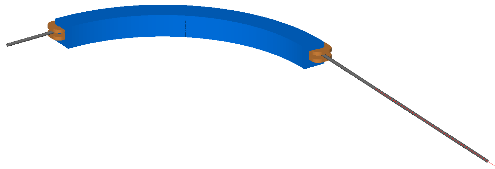
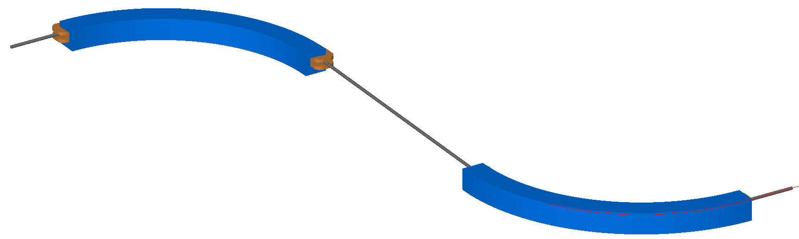

Curvilinear Coordinates
=======================

1_s_offset.gmad
---------------

This demonstrates starting the initial beam distribution from a finite
curvilinear S position along the line.  This example / test is placed in
a drift (ie straight section). The particle should finish at :math:`0,0`
in curvilinear coordinates.

To run::

  bdsim --file=1_s_offset.gmad

2_s_offset_in_strong_bend.gmad
------------------------------

Similar to 1_s_offset, but with the particle starting in the middle of
a strong bend.  Here, although the magnets are made from many short
straight sections, the curvilinear trajectory is interpolated.

