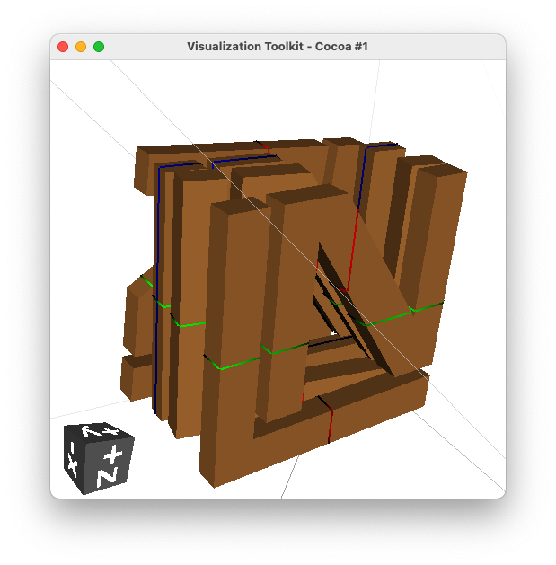
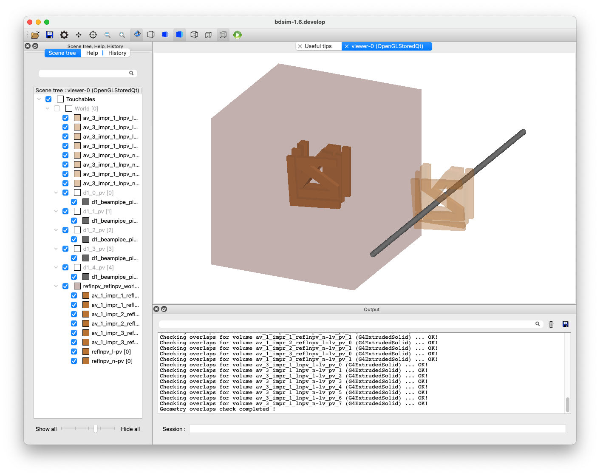

GDML
====

1_magnet_outer.gmad
-------------------

A quadrupole flanked by two drifts. The outer geomtery of the quadrupole
uses a gdml file of a Hitachi magnet at the ATF2.

How to run::

  bdsim --file=1_magnet_outer.gmad

.. figure:: 1_magnet_outer.png
	    :width: 40%

2_placement.gmad
----------------

A placement of a piece of geometry (in GDML format) into the world
in an arbitrary location with respect to the coordinate system
origin and not the beam line.

How to run::

  bdsim --file=2_placement.gmad

3_twogdmls.gmad
---------------

Example of using two different GDML files that contain objects of
the same name. The Geant4 GDML loader would normally not load these
correctly and use the already loaded geometry. BDSIM corrects this
behaviour.

How to run::

  bdsim --file=3_twogdmls.gmad

.. figure:: 3_twogdmls.png
	    :width: 60%

.. note:: Two shapes are visible alongside a beam pipe - a cuboid and
	  a sphere.

13_stripoutervolume.gmad
------------------------

Example of stripping the outer volume from a loaded piece of geometry. Firstly,
a piece of geometry is created in a Python script using pyg4ometry. This can be
seen below.

	    VTK visualisation in pyg4ometry of example geometry. Extruded solids
	    with the outline to make the letters L N.

This script can be run with: ::

  ipython
  >>> import makeLNGeometry
  >>> makeLNGeometry.MakeLNGeometry()

The visualiser will start. Close it to finish the script. This writes a file called
:code:`ln.gdml`.

A small model is provided in the file :code:`13_stripoutervolume.gmad` that places
this geometry twice. Firstly, with just an offset horizontally away from the beam line
and secondly, with an offset along Z only. This second placement would normally overlap
with the beam line, which in this case is a straight line of beam pipes. In the visualisation
above, we do not see the outermost volume, which is actually made of iron (very slightly visible
in light-grey wire-frame lines). In BDSIM, the outermost volume isn't made transparent and is
visualised, appearing dark red (for iron).

So, to prevent the overlap, we strip off the outer volume for the second placement by setting
the parameter :code:`stripOuterVolume=1;`.

::

   lnpv: placement, geometryFile="gdml:ln.gdml",
                    z=1.5*m, axisY=1, axisAngle=1,
		    angle=0.05, stripOuterVolume=1;

Normally, we would prepare some geometry such as shielding with a box of air as the 'world'
volume for that file, but here we use iron to make a point and so it doesn't appear transparent.

