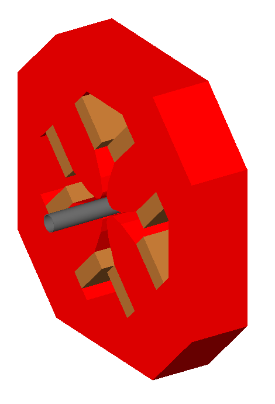
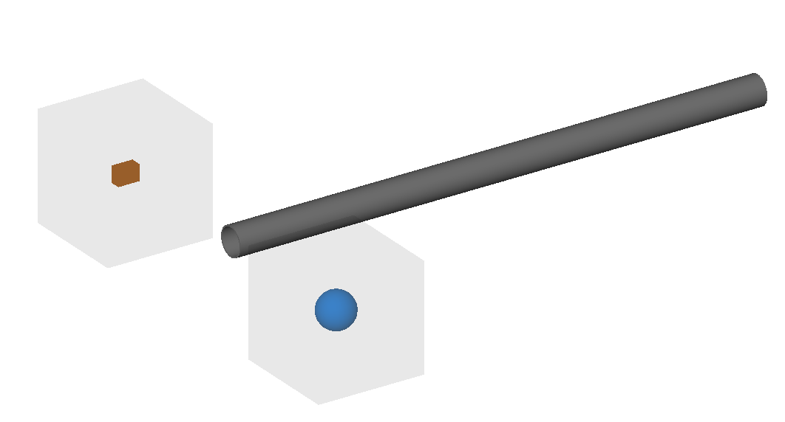

GDML
====

1_magnet_outer.gmad
-------------------

A quadrupole flanked by two drifts. The outer geomtery of the quadrupole
uses a gdml file of a Hitachi magnet at the ATF2.

How to run::

  bdsim --file=1_magnet_outer.gmad

2_placement.gmad
----------------

A placement of a piece of geometry (in GDML format) into the world
in an arbitrary location with respect to the coordinate system
origin and not the beam line.

How to run::

  bdsim --file=2_placement.gmad

3_twogdmls.gmad
---------------

Example of using two different GDML files that contain objects of
the same name. The Geant4 GDML loader would normally not load these
correctly and use the already loaded geometry. BDSIM corrects this
behaviour.

How to run::

  bdsim --file=3_twogdmls.gmad

.. note:: Two shapes are visible alongside a beam pipe - a cuboid and
	  a sphere.
