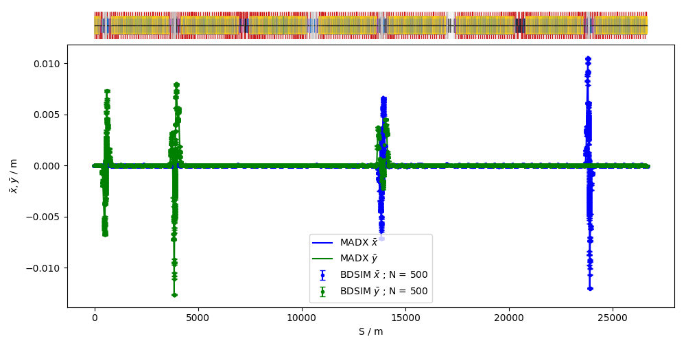
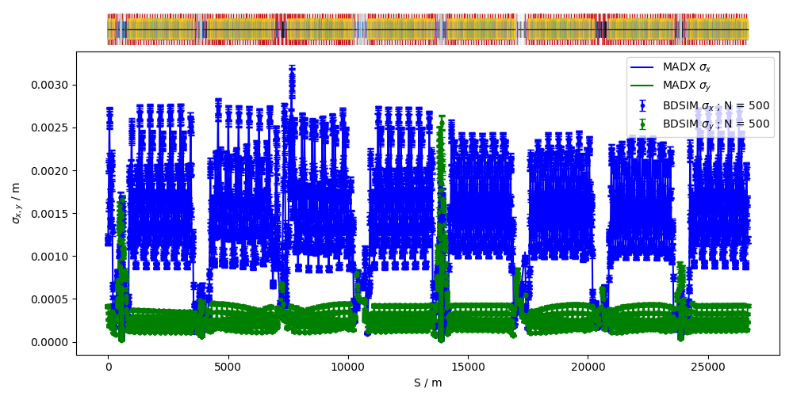
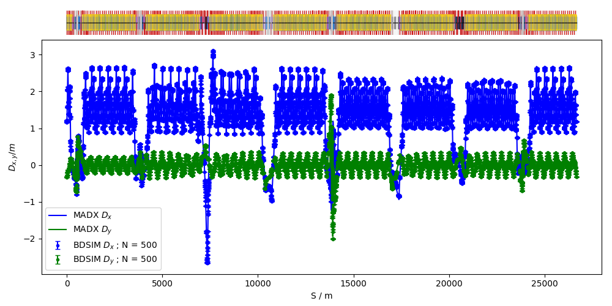

Large Hadron Collider
=====================

The Large Hadron Collider is a approximately 27km in circumference proton
proton collider at CERN, Gevena, Switzerland. It is the world's highest
energy particle accelerator and collider with a current centre of mass
energy of 13TeV (6.5TeV per beam).

This is one of the largest BDSIM models. The model provided is of the 2017
optics with finite dispersion throughout.

.. note:: This is a cirular machine and should be executed with the
	  :code:`--circular` option to control the number of turns the
	  particls will take.

Example::

  bdsim --file=lhc2017.gmad --batch --circular

This will run 5 particles with a maximum of 1 turn.

It is not useful to visualise
this model as the ring consists of 0.5m wide dipoles in a ringe approximately
8km across. Even if the visualiser resolution and computer display resolution
supported 8000 pixels across, the magnet would be only one pixel. The
viewpoint is automatically centred to the middle of the world so zooming
in does not reveal anything as you zoom into the empty part of the ring.

It is possible to visualise, but the visualisation takes ~10mins and
the visualiser commands should be used to move directly to a point of interest
in global coordinates. The slowness is due to the Geant4 visualisation
system.

Here, we show an examle optical comparison, In all cases, `rebdsimOptics` was
used to calculate the beam properties and `pybdsim` used to make the comparison plots.

Beam mean position (i.e. 'orbit') from 500 particles tracked for 1 turn.
		    

Beam size from 500 particles tracked for 1 turn.
		    

Dispersion from 500 particles tracked for 1 turn.
