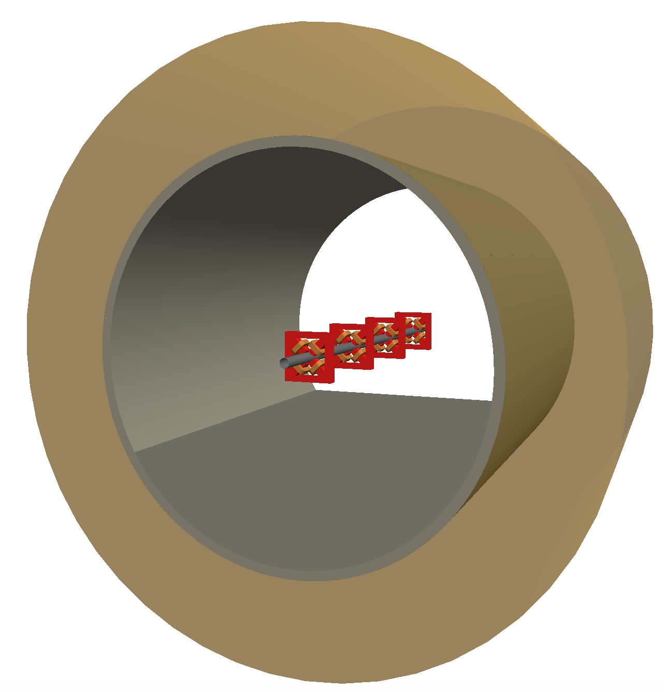

Simple Collimation
==================

A simple example of a BDSIM model that sprays particles everywhere. It consists
of four quadrupole magnets that are on but not designed to contain the beam.
The beam is lost quickly creating a spray of secondary partilces in both the
machine components as well as the surrounding tunnel.

How to run::
  
  bdsim --file=sc.gmad

