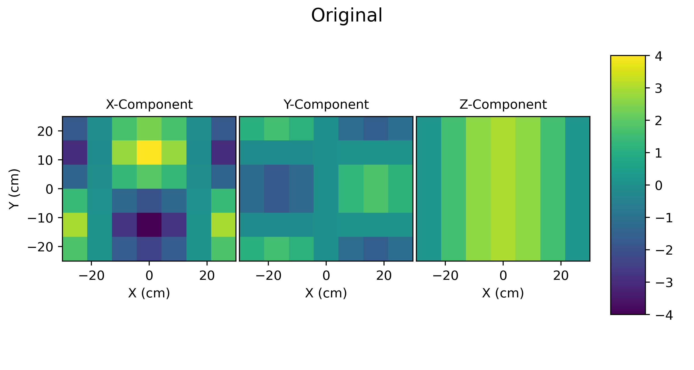
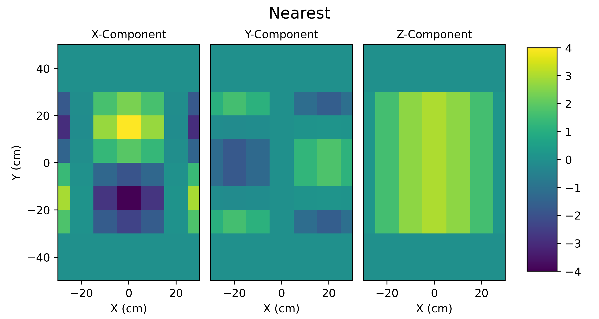
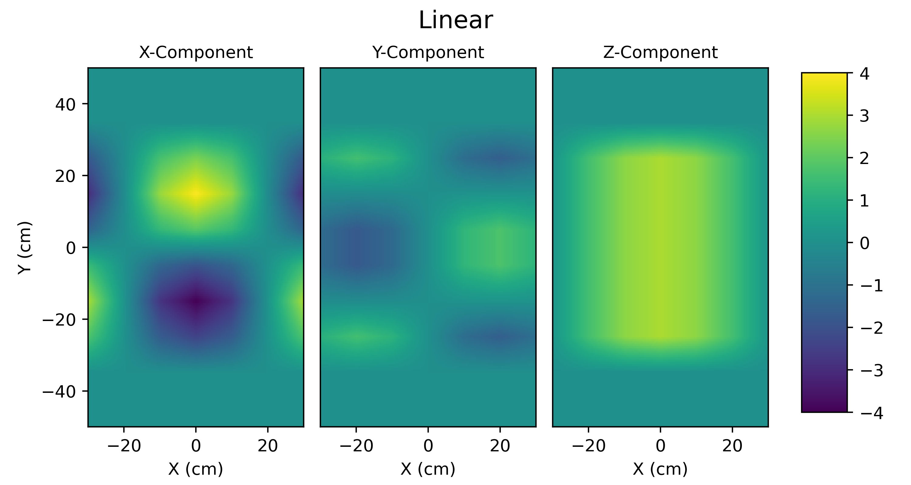
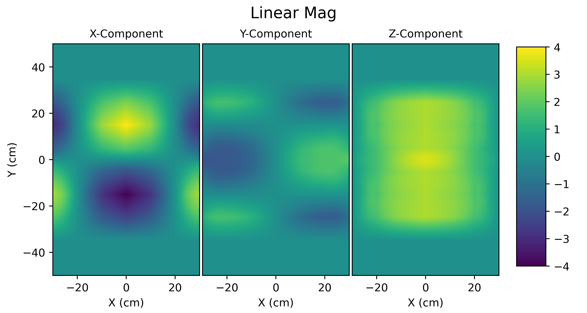
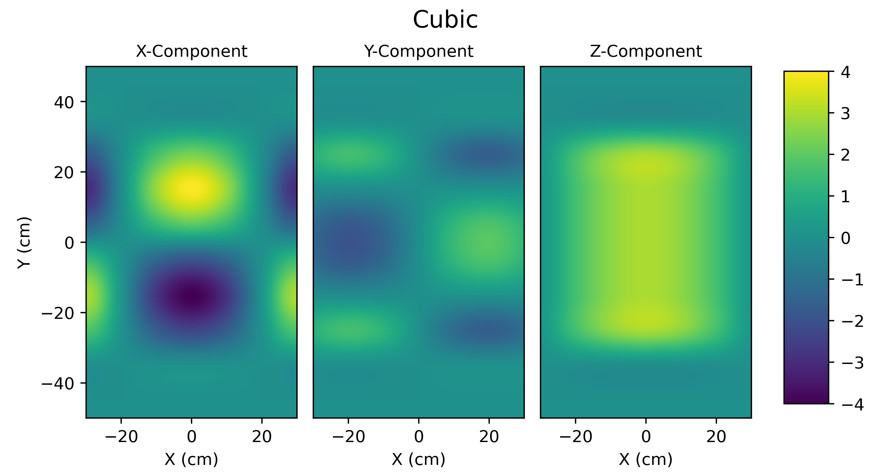
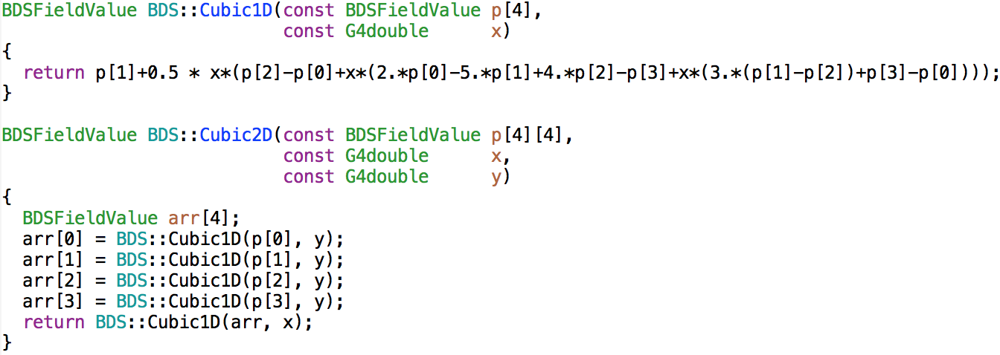

.. _dev-fields:

Fields
******

BDSIM provides the magnetic fields typical to an accelerator, as well as the ability
to import field maps and overlay them on geometry. Practically, this is accomplished
through several objects, but the main two that the user or developer must select are the
field and the integrator. The first describes the field itself; the latter how
the particle position and momentum is affected by the field.

The integrators are described in :ref:`dev-tracking`.

Coordinate System
=================

The accelerator is modelled, following convention, in curvilinear coordinates
that follow the beam line. However, in practice, Geant4 requires that the fields
and coordinates be supplied and calculated in global Cartesian coordinates.
The simplest solution
in Geant4 is to get the transformation from the global coordinates to the local
coordinates of the volume being queried for the field and tracking.  However, if
the field is 'attached' to not just a simple single shape or volume, but a nested set
of volumes, the local coordinates of that volume are not necessarily the same as
the accelerator curvilinear coordinates. To get around this, a parallel geometry
is built with simple shapes whose local coordinates are degenerate with the
curvilinear coordinate system.  This geometry is used to find the transforms so
that when their local coordinates are queried, they represent the curvilinear
coordinates of the beam line.

Generally, to query a point in the geometry, one should use a G4Navigator instance.
There is the singleton G4Navigator from Geant4 available to the developer, but this
must **never** be used. Querying a point
in the geometry with this navigator changes the state of the navigator and therefore
the perceived location in the geometry hierarchy of the particle in question from that
point on. To avoid this, an extra navigator is created and used. Whilst these are not
large objects in memory, a single static extra navigator (member of BDSAuxiliaryNavigator)
is used. An instance of a G4Navigator can perform a search relative to the last queried
point, which is usually significantly faster than a fresh query from the top of the
hierarchy. By using a static auxiliary navigator, we take advantage of the relative search,
because although many fields and integrators may have query separate BDSAuxiliaryNavigator
instances, the underlying static navigator is used. In practice, the queries are generated
by the progress of a particle, so they're likely to be close to each other in the geometry.

Utility methods for conversion are provided in BDSAuxiliaryNavigator. The developer should
design their class to inherit this one if they wish to convert to curvilinear coordinates.

Pure magnetic fields are provided that don't inherit BDSAuxiliaryNavigator to avoid the
requirement of 'closed' Geant4 geometry and a parallel curvilinear world. This greatly
simplifies things if the developer wants to simply make use of (or test alone for that
matter) a single field class.

Important Points
----------------

* Field classes don't use BDSAuxiliary navigator and therefore don't require a full Geant4 run.
* The fields constructed for the BDSIM model are wrapped in an instance of BDSFieldMagGlobal
  that provides the necessary local-to-global transforms.
* Using BDSAuxiliaryNavigator requires an accelerator to be built, i.e. it requires a world
  volume, read out world, contents in both, the geometry to be 'closed' by Geant4 and
  a valid run manager instantiated. One may generally use the field classes, but without the
  auxiliary navigator in this case.

Notes About Plots
-----------------

The plots provided here are generated by surveying each field class at various points in both
a uniform Cartesian grid and also in a radial grid. The vector field plots are generated
automatically using matplotlib. Whilst these look *pretty spiffy*, occasionally the vectors pass
through inflection points (such as the origin) that we know they should not. This is purely a
numerical artefact and the plots are only to give a rough impression of the field shape. The
fields are generated by the equations described and are correct even at inflection points.

.. _dev-fields-pure-field-names:

Field Names and Parameters
==========================

Any field can be queried in BDSIM, including the pure fields described below. However, these
must by queried by their type name exactly, and some parameters must also be specified that
would normally be associated with a beam line element. Below are all the fields and associated
parameters required.

* These are all defined in :code:`bdsim/include/BDSFieldType.hh`
* Only pure fields from equations are listed here as field maps are done by :code:`format:filepath`.
* Any parameters not specified will **default to zero**.

.. warning:: This is fairly advanced exposure of BDSIM-internals and to be used
	     with some care. You may have to look in the source code (.cc file)
	     to understand the appropriate use of the parameters. The units are
	     in the same input units as BDSIM.

.. tabularcolumns:: |p{0.30\textwidth}|p{0.60\textwidth}|
	     
+---------------------------------+--------------------------------------------+
| **Field Type Name**             | **Parameters**                             |
+=================================+============================================+
| solenoidsheet                   | length, field, poletipradius               |
+---------------------------------+--------------------------------------------+
| dipole, solenoid, dipole3d      | field, bx, by, bz                          |
+---------------------------------+--------------------------------------------+
| quadrupole                      | k1                                         |
+---------------------------------+--------------------------------------------+
| dipolequadrupole                | field, bx, by, bz, k1                      |
+---------------------------------+--------------------------------------------+
| sextupole                       | k2                                         |
+---------------------------------+--------------------------------------------+
| octupole                        | k3                                         |
+---------------------------------+--------------------------------------------+
| decapole                        | k4                                         |
+---------------------------------+--------------------------------------------+
| multipole                       | k1, k2, k3... k12, k1s, k2s, k3s... k12s   |
+---------------------------------+--------------------------------------------+
| muonspoiler                     | field                                      |
+---------------------------------+--------------------------------------------+
| skewquadrupole                  | k1                                         |
+---------------------------------+--------------------------------------------+
| skewsextupole                   | k2                                         |
+---------------------------------+--------------------------------------------+
| skewoctupole                    | k3                                         |
+---------------------------------+--------------------------------------------+
| skewdecapole                    | k4                                         |
+---------------------------------+--------------------------------------------+
| rfconstantinx, rfconstantiny,   | efield, frequency, phase                   |
| rfconstantinz                   |                                            |
+---------------------------------+--------------------------------------------+
| rfpillbox                       | equatoradius, efield, frequency, phase     |
+---------------------------------+--------------------------------------------+
| undulator                       | length, field                              |
+---------------------------------+--------------------------------------------+
| multipoleouterdipole            | field, bx, by, bz, poletipradius           |
+---------------------------------+--------------------------------------------+
| multipoleouterquadrupole        | k1, poletipradius                          |
+---------------------------------+--------------------------------------------+
| multipoleoutersextupole         | k2, poletipradius                          |
+---------------------------------+--------------------------------------------+
| multipoleouteroctupole          | k3, poletipradius                          |
+---------------------------------+--------------------------------------------+
| multipoleouterdecapole          | k4, poletipradius                          |
+---------------------------------+--------------------------------------------+
| skewmultipoleouterquadrupole    | k1, poletipradius                          |
+---------------------------------+--------------------------------------------+
| skewmultipoleoutersextupole     | k2, poletipradius                          |
+---------------------------------+--------------------------------------------+
| skewmultipoleouteroctupole      | k3, poletipradius                          |
+---------------------------------+--------------------------------------------+
| skewmultipoleouterdecapole      | k4, poletipradius                          |
+---------------------------------+--------------------------------------------+
| multipoleouterdipole3d          | field, bx, by, bz                          |
+---------------------------------+--------------------------------------------+
| multipoleouterdipolelhc         | field, bx, by, bz, poletipradius           |
+---------------------------------+--------------------------------------------+
| multipoleouterquadrupolelhc     | k1, poletipradius                          |
+---------------------------------+--------------------------------------------+
| multipoleoutersextupolelhc      | k2, poletipradius                          |
+---------------------------------+--------------------------------------------+

* "poletipradius" will default to "aper1" or the beam pipe radius from the options,
  unless otherwise specified

Example for a dipole field: ::

  fieldParameters="field=1.0, by=1";

Pure Magnetic Fields From Equations
===================================

Described here are a list of typical magnetic fields that are described by equations, rather
than an interpolated field map. These are used for the majority of the accelerator components.
Described here is the pure version without global to curvilinear transformations. These classes
are wrapped when used with general BDSAcceleratorComponent instances.

Dipole
------

The dipole field is constructed with a magnitude :math:`|B|` and a unit vector
:math:`\hat{\mathbf{b}}`. It is constant with position and the default unit vector
is :math:`(0,1,0)` - unit y.

.. math::
   \mathbf{B} = \hat{\mathbf{b}} \cdot |B|

.. figure:: dev_figures/dipole_radial.pdf
	    :width: 70%
	    :align: center

	    Example field map of a dipole with :math:`\mathbf{B} = 1.3~\mathrm{T}`, and :math:`B\rho = 4.333`.

Quadrupole
----------

The quadrupole field is constructed with strength parameter :math:`k_1` and with respect to
a nominal rigidity :math:`B\rho`. Although the rigidity is included in :math:`k_1`, it is
required to calculate the field gradient internally.

.. math::
   k_1 = \frac{1}{B\rho} \frac{\partial B_y}{\partial x}

The field is described by

.. math::
   B_x & = \frac{\partial B_y}{\partial x} y \\
   B_y & = \frac{\partial B_y}{\partial x} x \\
   B_z & = 0

.. figure:: dev_figures/quadrupole_radial.pdf
	    :width: 70%
	    :align: center

	    Example field map of a quadrupole with :math:`k_1 = 0.34`, and :math:`B\rho = 4.333`.

Sextupole
---------

The sextupole field is constructed with strength parameter :math:`k_2` and with respect
to a nominal rigidity :math:`B\rho`.

.. math::

   k_2 = \frac{1}{B\rho} \frac{\partial^2 B_y}{\partial x^2}

The field is described by

.. math::
   B_x & = \frac{1}{2!} \frac{\partial^2 B_y}{\partial x^2} \,2xy \\
   B_y & = \frac{1}{2!} \frac{\partial^2 B_y}{\partial x^2} \, (x^2 - y^2) \\
   B_z & = 0

.. figure:: dev_figures/sextupole_radial.pdf
	    :width: 70%
	    :align: center

	    Example field map of a sextupole with :math:`k_2 = 3.91`, and :math:`B\rho = 4.333`.

Octupole
--------

The octupole field is constructed with strength parameter :math:`k_3` and with respect to
a nominal rigidity :math:`B\rho`.

.. math::

   k_3 = \frac{1}{B\rho} \frac{\partial^3 B_y}{\partial x^3}

The field is described by

.. math::
   B_x & = \frac{1}{3!} \frac{\partial^3 B_y}{\partial x^3} \,(3x^2 y - y^3) \\
   B_y & = \frac{1}{3!} \frac{\partial^3 B_y}{\partial x^3} \, (x^3 - 3xy^2) \\
   B_z & = 0

.. figure:: dev_figures/octupole_radial.pdf
	    :width: 70%
	    :align: center

	    Example field map of a octupole with :math:`k_3 = 12.56`, and :math:`B\rho = 4.333`.

Decapole
--------

The decapole field is constructed with strength parameter :math:`k_4` and with respect to
a nominal rigidity :math:`B\rho`.

.. math::

   k_4 = \frac{1}{B\rho} \frac{\partial^4 B_y}{\partial x^4}

The field is described by

.. math::
   B_x & = \frac{1}{4!} \frac{\partial^4 B_y}{\partial x^4} \, 4xy(x^2 - y^2) \\
   B_y & = \frac{1}{4!} \frac{\partial^4 B_y}{\partial x^4} \, (x^4 - 6x^2y^2 + y^4) \\
   B_z & = 0

.. figure:: dev_figures/decapole_radial.pdf
	    :width: 70%
	    :align: center

	    Example field map of a decapole with :math:`k_4 = 45567.32`, and :math:`B\rho = 4.333`.

Skewed Versions
---------------

All of the above magnets (dipole, quadrupole, sextupole, octupole and decapole) are also
available as their skew counterparts. With BDSIM, it is trivial to create a skew component
by simply creating a normal component and applying the appropriate tilt to it. However,
should one want the field skewed but not the component - say, the correct upright square
aperture - these fields can be used.

A wrapper class is provided that is instantiated with an angle (hard coded in BDSFieldFactory).
When the field is queried, the coordinates being queried are rotated by the angle. The
returned field vector is then anti-rotated to give the correct skew field at the original
location.

.. math::
   \mathbf{B}_{skew}(x,y) = R(-\theta) \mathbf{B}(x',y')

.. math::

   \begin{bmatrix}
   x' \\
   y' \\
   z' \\
   \end{bmatrix}
   =
   R(\theta)
   \begin{bmatrix}
   x \\
   y \\
   z \\
   \end{bmatrix}
   =
   \begin{bmatrix}
   \cos \theta & - \sin \theta & 0\\
   \sin \theta & \cos \theta   & 0\\
   0 & 0 & 0 \\
   \end{bmatrix}
   \begin{bmatrix}
   x \\
   y \\
   z \\
   \end{bmatrix}

Example field maps are shown below.

Skew Quadrupole
---------------

.. figure:: dev_figures/skewquadrupole_radial.pdf
	    :width: 70%
	    :align: center

	    Example field map of a skew quadrupole with :math:`k_1 = 0.34`, and :math:`B\rho = 4.333`.

Skew Sextupole
--------------

.. figure:: dev_figures/skewsextupole_radial.pdf
	    :width: 70%
	    :align: center

	    Example field map of a skew sextupole with :math:`k_2 = 3.92`, and :math:`B\rho = 4.333`.

Skew Octupole
-------------

.. figure:: dev_figures/skewoctupole_radial.pdf
	    :width: 70%
	    :align: center

	    Example field map of a skew octupole with :math:`k_3 = 12.56`, and :math:`B\rho = 4.333`.

Skew Decapole
-------------

.. figure:: dev_figures/skewdecapole_radial.pdf
	    :width: 70%
	    :align: center

	    Example field map of a skew decapole with :math:`k_4 = 45567.32`, and :math:`B\rho = 4.333`.

Multipole
---------

A general multipole field is also provided. The field is calculated in cylindrical coordinates, then converted
to Cartesian. The field is calculated using an array of strength parameters :math:`k_1,k_2,\dotsc k_{12}` and
the skewed strength parameters :math:`ks_1,ks_2,\dotsc ks_{12}` with respect to a nominal rigidity :math:`B\rho`.

.. note:: Currently the dipole component is not implemented. :math:`k_1` is the quadrupole strength,
	  :math:`k_2` is the sextupole strength, *etc*.

.. math::

   r                          & = \sqrt{x^2 + y^2} \\
   B_r      (\mathrm{normal}) & = \frac{1}{B\rho} \displaystyle\sum_{i=1}^{12} \frac{k_i}{i!} \,r^i \sin(i \phi) \\
   B_{\phi} (\mathrm{normal}) & = \frac{1}{B\rho} \displaystyle\sum_{i=1}^{12} \frac{k_i}{i!} \, r^i \cos(i \phi) \\
   B_r      (\mathrm{skewed}) & = \frac{1}{B\rho} \displaystyle\sum_{i=1}^{12} \frac{ks_i}{i!} \, r^i \cos(i \phi) \\
   B_{\phi} (\mathrm{skewed}) & = \frac{1}{B\rho} \displaystyle\sum_{i=1}^{12} -\frac{ks_i}{i!} \, r^i \sin(i \phi)

.. math::
   B_x & = B_r \cos \phi - B_{\phi} \sin \phi \\
   B_y & = B_r \sin \phi + B_{\phi} \cos \phi \\

.. figure:: dev_figures/multipole_radial.pdf
	    :width: 70%
	    :align: center

	    Example field map of a multipole with :math:`\{k_1, k_2, k_3, k_4, k_5\} = \{0.12,0.02,-0.003,0.0004,-0.00005\}`,
	    and :math:`B\rho = 4.333`.

Undulator
---------

The undulator field is constructed with the peak field strength :math:`B` and the undulator period :math:`\lambda`.
The field, according to Wiedemann pg. 103, is described by

.. math::
   B_{x} ~ &= ~ 0 \\
   B_{y} ~ &= ~ B \cdot \cos\big(z \frac{2\pi}{\lambda}\big) \cosh\big(y \frac{2\pi}{\lambda}\big)\\
   B_{z} ~ &= ~ -B \cdot \sin\big(z \frac{2\pi}{\lambda}\big) \sinh\big(y \frac{2\pi}{\lambda}\big)

Muon Spoiler
------------

A muon spoiler field is provided that gives a constant toroidal field. It is constructed with field strength
:math:`B~(\mathrm{T})`. The field is calculated
according to

.. math::

   r   & = \sqrt{x^2 + y^2} \\
   B_x & = \frac{y}{r} B \\
   B_y & = \frac{-x}{r} B \\
   B_z & = 0

.. figure:: dev_figures/muonspoiler_radial.pdf
	    :width: 70%
	    :align: center

	    Example field map of a muon spoiler with field :math:`B = 1.3~(\mathrm{T})`. Note, the
	    variation shown in the graph is only numerical differences. The field is constant and this
	    is purely due to the plotting vector field algorithm.

Dipole Yoke Field 3D
--------------------

For the outer part of a dipole, as described by a uniform field in 3D :math:`\mathbf{B}`, a pure
dipole field at position :math:`\mathbf{r}` from the origin is provided according to

.. math::

   \mathbf{B}_{\mathrm{dipole}}(\mathbf{r}) = \frac{3\mathbf{r}(\mathbf{m}\cdot\mathbf{r})}{r^5} - \frac{\mathbf{m}}{r^3}

where :math:`\mathbf{m}` is a unit vector along the pure dipole field direction. The field value
is scaled to the field at the pole tip. For positions within a radial distance of the origin of
pole tip radius, the uniform field vector is used. At the transition, a sigmoid function is used
to smoothly vary (weight :math:`\mathrm{w}`) between the uniform field vector (:math:`\mathbf{B}_{u}`)
according to

.. math::

   \mathrm{w} = \frac{1}{2} \left[ \tanh \left ( \frac{3 r - \| 0.5\,r_{\mathrm{pole tip}} \|}{1 \mathrm{cm}} \right) + 1 \right]

.. math::
   \mathbf{B}(\mathbf{r}) = \mathrm{w}\,\mathbf{B}_{dipole}(\mathbf{r}) + (1 - \mathrm{w}) \mathbf{B}_{u}

An example is shown below for :math:`\mathbf{B} = (0.23,0.56,0)\,\mathrm{T}` and a pole tip radius of 40mm.

.. figure:: dev_figures/outerdipole3d_radial.pdf
	    :width: 70%
	    :align: center

.. _yoke-multipole-field:

General Yoke Multipole
----------------------

For the outside of magnets, a generalised multipolar field is provided. This is an approximate field
for outside the beam pipe and does not take into account the permeability of the iron. We suggest
overlaying a field map for your own magnets if greater accuracy is desired.

The field is described by the linear sum of infinitely long current sources along :math:`\pm z`
(in curvilinear coordinates). Each current source is placed exactly in between each pole at
a distance of pole tip radius (:math:`r_{\mathrm{pole tip}}`). The field is normalised to the
field sampled from the interior field at a pole tip.

Wire locations:

.. math::

   \begin{bmatrix}
   x \\
   y \\
   \end{bmatrix}_i
   =
   \begin{bmatrix}
   0  \\
   r_{\mathrm{pole tip}} \\
   \end{bmatrix}
   \begin{bmatrix}
   \cos \theta_i & - \sin \theta_i \\
   \sin \theta_i & \cos \theta_i   \\
   \end{bmatrix}

.. math::

   \theta_i = \left \{ \frac{i\,2\pi}{n_{\mathrm{poles}}} \right \} \quad \mathrm{for} \quad i = \{0 \ldots n_{\mathrm{poles}} \}

The field value as a function of position :math:`\mathbf{r} = (x,y)` is

.. math::

   \mathbf{B}(\mathbf{r}) = \sum_{i = 1}^{i = n_{\mathrm{poles}}} (-1)^{i} \, \frac{(\mathbf{r} - \mathbf{c}_i)_{\perp}}{\|\mathbf{r} - \mathbf{c}_i\|}

These are provided for dipole through to decapole- including their skew counterparts. A few examples are presented below.

Multipole Yoke - Dipole
+++++++++++++++++++++++

.. figure:: dev_figures/multipoleouterdipole_radial.pdf
   :width: 70%
   :align: center

Multipole Yoke - Quadrupole
+++++++++++++++++++++++++++

.. figure:: dev_figures/multipoleouterquadrupole_radial.pdf
   :width: 70%
   :align: center

Multipole Yoke - Sextupole
++++++++++++++++++++++++++

.. figure:: dev_figures/multipoleoutersextupole_radial.pdf
   :width: 70%
   :align: center

Multipole Yoke - Octupole
+++++++++++++++++++++++++

.. figure:: dev_figures/multipoleouteroctupole_radial.pdf
   :width: 70%
   :align: center

Multipole Yoke - Decapole
+++++++++++++++++++++++++

.. figure:: dev_figures/multipoleouterdecapole_radial.pdf
   :width: 70%
   :align: center

Multipole Yoke - Skew Quadrupole
++++++++++++++++++++++++++++++++

.. figure:: dev_figures/skewmultipoleouterquadrupole_radial.pdf
   :width: 70%
   :align: center

.. _fields-multipole-outer-lhc:
	   
Multipole Yoke - Dual
+++++++++++++++++++++

This field is the addition of two multipole yoke fields at a specified separation. The field is built
with one of the fields at the centre of the coordinate system (x,y = 0,0) with the second field either
to the left or the right. Like the other multipole yoke fields, a pole tip radius is required to normalise
the field against a perfect one of the same type.

This field can be used as an approximate field for joint two beam magnets such as those of the LHC. In
the case of the LHC, the separation is 194 mm. If `lhcright` or `lhcleft` magnet geometry types are used
these fields are automatically applied to rbends, sbends, quadrupoles and sextupoles.

.. figure:: dev_figures/multipoleouterdipolelhc_radial.pdf
   :width: 70%
   :align: center

.. figure:: dev_figures/multipoleouterquadrupolelhc_radial.pdf
   :width: 70%
   :align: center

Solenoid Sheet or Cylinder
--------------------------

For the outside of a solenoid, we have a solenoid "sheet" or "cylinder" model. This is
modelled on the magnetic field due to symmetric cylinder of current of full length
:math:`2 b` and of radius :math:`a`. The field is calculated in cylindrical coordinates
and translted into Cartesian. The normalisation is to some nominal field :math:`B_0`.

This follows the parameterisation and uses the algorithm for the generalised complete
elliptical integral as described in:

* Cylindrical Magnets and ideal Solenoids, N. Derby and S. Olbert, American Journal of
  Physics **78**, 229 (2010); https://doi.org/10.1119/1.3256157 and also at
  https://arxiv.org/abs/0909.3880.

The cylindrical B field components are given by:

.. math::

   B_{rho} &= B_0 \left[ \alpha_+ C(k_+,1,1,-1) - \alpha_- C(k_-,1,1,-1) \right],

   B_z &= \frac{B_0 a}{a + \rho} \left[ \beta_+ C(k_+,\gamma^2,1,\gamma) - \beta_- C(k_-,\gamma^2,1,\gamma) \right]

where:

.. math::

   B_0 &= \frac{\mu_0 n I}{\pi},

   z_{\pm} &= z \pm b,

   \alpha_{\pm} &= \frac{a}{\sqrt{z_{\pm}^{2} + (\rho + a)^2}},
   
   \beta_{\pm} &= \frac{z_{\pm}}{ \sqrt{z_{\pm}^{2} + (\rho + a)^2}},
   
   \gamma &= \frac{a - \rho}{a + \rho},

   k_{\pm} &= \sqrt{ \frac{z_{\pm}^{2} + (\rho - a)^2}{z_{\pm}^{2} + (\rho + a)^2} }.

The implementation defines a *spatial tolerance* of :math:`10^{-5} \times \textrm{min}(a,2h)`. If a coordinate
is requested within this distance of the cylinder radius (i.e. :math:`|\rho - a| < tol.` and :math:`|z| < b`) or on
the end of the cylinder face (i.e. :math:`|\,|z| - h\,| < tol.` and :math:`\rho < a + tol.`) then no field is returned as the
function is unstable at these points.

The coordinates are transformed as:

.. math::

   z, \rho, \phi = z,\: \sqrt{x^2 + y^2},\: \arctan \left( \frac{y}{x} \right).

Here, :code:`std::atan2(y,x)` is used for :math:`\arctan` to give the correct sign throughout. The final field
is constructed as:

.. math::

   B_{x,y,z} = \{ B_{\rho}, 0, B_z \},

then rotated about the :math:`z` axis by angle :math:`\phi`.

If the field is queried close to the axis (i.e. :math:`|\rho| < tol.`), then a reduced formula is
used:

.. math::

   B_{\rho} &= 0,

   B_{z} &= \frac{B_{0}}{2} \left[  \frac{z+b}{ \sqrt{(z+b)^2 + a^2} } - \frac{z-b} { \sqrt{(z-b)^2 + a^2} } \right].

Below is an example of the field.

.. figure:: dev_figures/solenoidsheet.pdf
   :width: 70%
   :align: center

   Solenoidal field for 2T solenoid.
   

Electric Fields From Equations
==============================

.. _field-sinusoid-efield:

Sinusoidal Electric Field
-------------------------

This field provides an electric field along local unit `u` direction (e.g. unit `z` or unit `x`)
with an amplitude `E` that **does not vary** with position (`x`, `y`, `z`), but only varies sinusoidally
with time (`t`). Therefore, this field does not represent a realistic cavity with no variation in say
`z` in the strength of electric field, but is useful nonetheless.

A cosine is used so when the default phase is zero, a maximum acceleration
is provided for a synchronous particle at the centre of the object. An rf cavity using this
field can be constructed with `E` as peak voltage (subsequently divided by length), or the
field itself as `gradient`.

The field is given by the combination of the peak field `E`, the frequency `f` (Hz) along
with the phase :math:`\phi`. Typically, the synchronous time at the centre of the element
it is attached to as well as the frequency are used to calculate a global phase for the
arrival time of the synchronous particle to the centre of the object.

.. math::

   E_z = E\,\cos(2\,\pi\,f\,t + \phi)

The 3D Cartesian field vectors are therefore:

.. math::

   \mathbf{B} & = (0, \,0, \,0) \\
   \mathbf{E} & = (0, \,0, \,E_z)

In the case where frequency is not set, the field reduces to a constant in the local `z` direction:

.. math::

   E_z = E\,\cos(\phi)

Electromagnetic Fields From Equations
======================================

.. _field-pill-box:

Pill-Box Cavity
---------------

The pill-box cavity field is constructed with a peak electric field :math:`E`, a
frequency :math:`f`, phase :math:`\psi` and a cavity radius. It represents the
TM010 mode of a simple pill-box cavity.

Geant4 queries the field in (local) Cartesian coordinates and we require cylindrical
coordinates for the field description. These are converted as:

.. math::

     \phi & = \tan^{-1} ( \frac{y}{x} ) \\
     r    & = \sqrt{x^2 + y^2}

The cavity radius is used to
normalise the Bessel function so that the field drops to zero at this point. The field
is time-dependent and the :math:`E_z` and :math:`B_{\phi}` components are calculated
and then returned in 3D Cartesian coordinates. The cavity radius is used to calculate
a normalised radius :math:`r_n` with respect to the first zero of the zeroth Bessel:

.. math::

   r_n = r \, \frac{2.404825557695772768622} { \mathrm{cavity\,radius}}

The electric field is calculated as:

.. math::

   E_z(r_n, z ,t) & = E \, J_{0}(r_n) \cos(2\,\pi\,f\,t + \psi)\,\cos(\frac{2\,\pi\,f\,z}{c})\\

The radial B-field amplitude is calculated from the E-field amplitude.

.. math::

   H_{\phi}(r_n, z, t) & = \frac{E}{Z_{0}} \, J_{1}(r_n) \sin(2\,\pi\,f\,t + \psi)\,\cos(\frac{2\,\pi\,f\,z}{c})\\
   B_{\phi}(r_n, z, t) & = \mu_{0} H_{\phi}

where :math:`Z_{0}` is the impedance of free space. To calculate B, a vacuum is assumed
and therefore only the vacuum permeability is used to calculate B from H.

The 3D Cartesian field vectors are therefore:

.. math::

   \begin{bmatrix}
   B_x \\
   B_y \\
   \end{bmatrix}
   =
   \begin{bmatrix}
   0  \\
   B_{\phi} \\
   \end{bmatrix}
   \begin{bmatrix}
   \cos \phi & - \sin \phi \\
   \sin \phi & \cos \phi   \\
   \end{bmatrix}

The final 3-vectors are constructed as:

.. math::

   \mathbf{B} & = (B_x,\, B_y \,0) \\
   \mathbf{E} & = (0, \,0, \,E_z)

.. _field-map-formats:

Field Map File Formats
======================

BDSIM Field Format
------------------

The field should be in an ASCII text file with the extension :code:`.dat`. Below is an
example of the required format in each 1D, 2D, 3D and 4D case.

* A compressed file using *gzip* may also be used (".gz" extension).

.. note:: It is recommended to use **pybdsim** to write field maps as it is guaranteed to write the
	  correct syntax exactly. It is **not** recommended to write field maps by hand.

The `pybdsim` utility package may be used to prepare fields in the correct format in Python if a
Python numpy array is provided.  If the user has a custom field format, it would be
advisable to write a script to load this data into a Python numpy array and use the
provided file writers in pybdsim.

Generally:

 * A series of keys define the dimensions of the grid.
 * The keys must not have any whitespace before them nor any between the key and the '>'
 * The keys at the beginning do not have to be in any order.
 * Empty lines will be skipped.
 * A line starting with :code:`!` denotes the column name definition row (there can be only one of these).
 * The order in the file must be 1) keys, 2) column name definition row, 3) data.
 * A line starting with :code:`#` will be ignored as a comment line.
 * The default order of the data loop is the **lowest** dimension first and then the upper,
   so the order should be :math:`x`, then :math:`y`, then :math:`z`, then :math:`t`. If
   we look in a file, we should see the first coordinate column change first.
 * :code:`loopOrder > tzyx` may optionally be defined in the header to indicate the
   the **opposite** order of looping of variables in the file to the loader. The default is xyzt.
   It can only be **either** 'xyzt' or 'tzyx'. In this case, the coordinate columns must still
   be in x,y,z,t order but the right most column coordinate will change first.
 * Python classes are provided to write numpy arrays to this format.
 * Any lines beyond the amount of data specified by the dimensions will be ignored.
 * One **cannot** put a comment after the data in the line.

.. note:: The units are :math:`cm` for spatial coordinates and :math:`s` for temporal.

.. note:: If a 1,2 or 3D field is required that is not along :math:`x, x:y, x:y:z` respectively,
	  the user should label the columns appropriately (i.e. 'X' and 'Z') and use the
	  correct key names in the file (i.e. 'xmin' and 'zmin') and the field will be
	  automatically constructed along the desired direction. It is assumed the field
	  is constant in the other dimensions.
	  
There are python scripts in :code:`bdsim/examples/features/fields/4_bdsimformat` called
:code:`Generate1D.py` etc., that were used to create the example data sets there that
have sinusoidally oscillating data.

.. warning:: The dimension parameters (:math:`x,y,z,t`) are used in order here for 1,2,3 and 4D
	     fields, but other combinations are possible. See :ref:`fields-different-dimensions`.

BDSIM Field Format 1D
---------------------

For a field that varies in :math:`x`.

+--------------------+-------------------------------------------------------------------+
| **Parameter**      | **Description**                                                   |
+--------------------+-------------------------------------------------------------------+
| xmin               | The lower spatial coordinate in x associated with the field map   |
+--------------------+-------------------------------------------------------------------+
| xmax               | The upper spatial coordinate in x associated with the field map   |
+--------------------+-------------------------------------------------------------------+
| nx                 | Number of elements in x (1 counting)                              |
+--------------------+-------------------------------------------------------------------+

Example syntax is shown below and there is an example in
:code:`bdsim/examples/features/fields/4_bdsimformat/1dexample.tar.gz`. The complete example
field is specified here: ::

   xmin> -30.0
   nx> 8
   xmax> 22.5
   ! X	            Fx	            Fy	            Fz
   -3.00000000E+01	-2.94957486E+00	-2.82240016E-01	-1.16825503E+00
   -2.25000000E+01	-9.08808379E-01	-1.55614639E+00	-7.42211878E-01
   -1.50000000E+01	1.44943102E+00	-1.99498997E+00	-2.99500250E-01
   -7.50000000E+00	3.30134246E+00	-1.36327752E+00	1.49937508E-01
   0.00000000E+00	4.00000000E+00	0.00000000E+00	5.96007992E-01
   7.50000000E+00	3.30134246E+00	1.36327752E+00	1.02869342E+00
   1.50000000E+01	1.44943102E+00	1.99498997E+00	1.43827662E+00
   2.25000000E+01	-9.08808379E-01	1.55614639E+00	1.81555922E+00

The same field could be specified along :math:`z` with the following start::

   zmin> -30.0
   nz> 8
   zmax> 22.5
   ! Z	            Fx	            Fy	            Fz
   

BDSIM Field Format 2D
---------------------

All of the 1D parameters, plus:

+--------------------+---------------------------------------------------------------------------+
| **Parameter**      | **Description**                                                           |
+--------------------+---------------------------------------------------------------------------+
| ymin               | The lower spatial coordinate in :math:`y` associated with the field map   |
+--------------------+---------------------------------------------------------------------------+
| ymax               | The upper spatial coordinate in :math:`y` associated with the field map   |
+--------------------+---------------------------------------------------------------------------+
| ny                 | Number of elements in y (1 counting)                                      |
+--------------------+---------------------------------------------------------------------------+

Example syntax is shown below and there is an example in
:code:`bdsim/examples/features/fields/4_bdsimformat/2dexample.tar.gz`.  Only the first
small part of the file is reproduced here: ::

  ymax> 22.6
  nx> 8
  ny> 11
  xmax> 26.0
  xmin> -30.0
  ymin> -25.0
  ! X	             Y	            Fx	            Fy	            Fz
  -3.00000000E+01	-2.50000000E+01	1.76523839E+00	1.08228603E+00	2.12211605E-01
  -2.44000000E+01	-2.50000000E+01	8.90617540E-01	1.48727104E+00	1.03093724E+00
  -1.88000000E+01	-2.50000000E+01	-1.59784082E-01	1.59871406E+00	1.76936408E+00
  -1.32000000E+01	-2.50000000E+01	-1.17864919E+00	1.39461962E+00	2.36997669E+00
  -7.60000000E+00	-2.50000000E+01	-1.96488486E+00	9.15269759E-01	2.78599391E+00
  -2.00000000E+00	-2.50000000E+01	-2.36331212E+00	2.55273528E-01	2.98501250E+00
  3.60000000E+00	-2.50000000E+01	-2.29529355E+00	-4.55105921E-01	2.95153108E+00
  9.20000000E+00	-2.50000000E+01	-1.77425397E+00	-1.07566133E+00	2.68815749E+00
  1.48000000E+01	-2.50000000E+01	-9.03030699E-01	-1.48391395E+00	2.21540568E+00
  2.04000000E+01	-2.50000000E+01	1.46423320E-01	-1.59928717E+00	1.57009785E+00
  2.60000000E+01	-2.50000000E+01	1.16697784E+00	-1.39900982E+00	8.02496486E-01
  -3.00000000E+01	-1.82000000E+01	2.85845993E+00	3.33182089E-01	2.12211605E-01
  -2.44000000E+01	-1.82000000E+01	1.44218172E+00	4.57856850E-01	1.03093724E+00
  -1.88000000E+01	-1.82000000E+01	-2.58739215E-01	4.92164617E-01	1.76936408E+00
  -1.32000000E+01	-1.82000000E+01	-1.90859292E+00	4.29334082E-01	2.36997669E+00
  -7.60000000E+00	-1.82000000E+01	-3.18174852E+00	2.81766079E-01	2.78599391E+00
  -2.00000000E+00	-1.82000000E+01	-3.82692389E+00	7.85860346E-02	2.98501250E+00
  3.60000000E+00	-1.82000000E+01	-3.71678107E+00	-1.40104499E-01	2.95153108E+00
  9.20000000E+00	-1.82000000E+01	-2.87305889E+00	-3.31142672E-01	2.68815749E+00
  1.48000000E+01	-1.82000000E+01	-1.46228242E+00	-4.56823370E-01	2.21540568E+00
  2.04000000E+01	-1.82000000E+01	2.37104061E-01	-4.92341051E-01	1.57009785E+00
  2.60000000E+01	-1.82000000E+01	1.88969342E+00	-4.30685607E-01	8.02496486E-01
  -3.00000000E+01	-1.14000000E+01	2.68008252E+00	-5.64139424E-01	2.12211605E-01
  -2.44000000E+01	-1.14000000E+01	1.35218479E+00	-7.75237050E-01	1.03093724E+00
  -1.88000000E+01	-1.14000000E+01	-2.42593028E-01	-8.33326499E-01	1.76936408E+00

BDSIM Field Format 3D
---------------------

All of the 1D and 2D parameters, plus:

+--------------------+---------------------------------------------------------------------------+
| **Parameter**      | **Description**                                                           |
+--------------------+---------------------------------------------------------------------------+
| zmin               | The lower spatial coordinate in :math:`z` associated with the field map   |
+--------------------+---------------------------------------------------------------------------+
| zmax               | The upper spatial coordinate in :math:`z` associated with the field map   |
+--------------------+---------------------------------------------------------------------------+
| nz                 | Number of elements in z (1 counting)                                      |
+--------------------+---------------------------------------------------------------------------+

Example syntax is shown below and there is an example in
:code:`bdsim/examples/features/fields/4_bdsimformat/3dexample.tar.gz`.  Only the first
small part of the file is reproduced here: ::

  zmax> 29.0
  ymax> 18.2
  zmin> -35.0
  nx> 9
  ny> 7
  nz> 10
  xmax> 24.9
  xmin> -30.0
  ymin> -25.0
  ! X	             Y	             Z	            Fx	            Fy	            Fz
  -3.00000000E+01	-2.50000000E+01	-3.50000000E+01	-3.32347616E+01	7.10822860E+01	-2.97096247E+00
  -2.39000000E+01	-2.50000000E+01	-3.50000000E+01	-3.41989531E+01	7.15099195E+01	-1.54145628E+01
  -1.78000000E+01	-2.50000000E+01	-3.50000000E+01	-3.53501533E+01	7.15850542E+01	-2.64353051E+01
  -1.17000000E+01	-2.50000000E+01	-3.50000000E+01	-3.64196083E+01	7.12901497E+01	-3.50159076E+01
  -5.60000000E+00	-2.50000000E+01	-3.50000000E+01	-3.71576482E+01	7.06940528E+01	-4.03643284E+01
  5.00000000E-01	-2.50000000E+01	-3.50000000E+01	-3.73919737E+01	6.99359256E+01	-4.19868757E+01
  6.60000000E+00	-2.50000000E+01	-3.50000000E+01	-3.70678802E+01	6.91927569E+01	-3.97337784E+01
  1.27000000E+01	-2.50000000E+01	-3.50000000E+01	-3.62610291E+01	6.86380434E+01	-3.38130113E+01
  1.88000000E+01	-2.50000000E+01	-3.50000000E+01	-3.51597841E+01	6.84012859E+01	-2.47710971E+01
  2.49000000E+01	-2.50000000E+01	-3.50000000E+01	-3.40212366E+01	6.85377567E+01	-1.34426596E+01
  -3.00000000E+01	-1.78000000E+01	-3.50000000E+01	-3.21147359E+01	7.02805617E+01	-2.97096247E+00
  -2.39000000E+01	-1.78000000E+01	-3.50000000E+01	-3.36906971E+01	7.03914175E+01	-1.54145628E+01
  -1.78000000E+01	-1.78000000E+01	-3.50000000E+01	-3.55723220E+01	7.04108947E+01	-2.64353051E+01
  -1.17000000E+01	-1.78000000E+01	-3.50000000E+01	-3.73203353E+01	7.03344464E+01	-3.50159076E+01
  -5.60000000E+00	-1.78000000E+01	-3.50000000E+01	-3.85266540E+01	7.01799198E+01	-4.03643284E+01
  5.00000000E-01	-1.78000000E+01	-3.50000000E+01	-3.89096566E+01	6.99833900E+01	-4.19868757E+01
  6.60000000E+00	-1.78000000E+01	-3.50000000E+01	-3.83799291E+01	6.97907378E+01	-3.97337784E+01
  1.27000000E+01	-1.78000000E+01	-3.50000000E+01	-3.70611392E+01	6.96469391E+01	-3.38130113E+01
  1.88000000E+01	-1.78000000E+01	-3.50000000E+01	-3.52611655E+01	6.95855643E+01	-2.47710971E+01
  2.49000000E+01	-1.78000000E+01	-3.50000000E+01	-3.34002212E+01	6.96209417E+01	-1.34426596E+01
  -3.00000000E+01	-1.06000000E+01	-3.50000000E+01	-3.24269222E+01	6.93395698E+01	-2.97096247E+00
  -2.39000000E+01	-1.06000000E+01	-3.50000000E+01	-3.38323640E+01	6.90786203E+01	-1.54145628E+01
  -1.78000000E+01	-1.06000000E+01	-3.50000000E+01	-3.55103966E+01	6.90327717E+01	-2.64353051E+01
  -1.17000000E+01	-1.06000000E+01	-3.50000000E+01	-3.70692744E+01	6.92127277E+01	-3.50159076E+01
  -5.60000000E+00	-1.06000000E+01	-3.50000000E+01	-3.81450691E+01	6.95764767E+01	-4.03643284E+01
  5.00000000E-01	-1.06000000E+01	-3.50000000E+01	-3.84866308E+01	7.00390993E+01	-4.19868757E+01
  6.60000000E+00	-1.06000000E+01	-3.50000000E+01	-3.80142199E+01	7.04925941E+01	-3.97337784E+01
  1.27000000E+01	-1.06000000E+01	-3.50000000E+01	-3.68381234E+01	7.08310901E+01	-3.38130113E+01
  1.88000000E+01	-1.06000000E+01	-3.50000000E+01	-3.52329073E+01	7.09755637E+01	-2.47710971E+01
  .
  .
  .
  .
  .
  1.27000000E+01	1.10000000E+01	-2.70000000E+01	-2.51221541E+01	5.47711204E+01	-2.60843230E+01
  1.88000000E+01	1.10000000E+01	-2.70000000E+01	-2.67620595E+01	5.49051692E+01	-1.91091320E+01
  2.49000000E+01	1.10000000E+01	-2.70000000E+01	-2.84575134E+01	5.48279013E+01	-1.03700517E+01
  -3.00000000E+01	1.82000000E+01	-2.70000000E+01	-2.98584599E+01	5.43331821E+01	-2.29188533E+00
  -2.39000000E+01	1.82000000E+01	-2.70000000E+01	-2.82971395E+01	5.44648292E+01	-1.18912342E+01
  -1.78000000E+01	1.82000000E+01	-2.70000000E+01	-2.64329949E+01	5.44879594E+01	-2.03929497E+01
  -1.17000000E+01	1.82000000E+01	-2.70000000E+01	-2.47012207E+01	5.43971730E+01	-2.70122716E+01
  -5.60000000E+00	1.82000000E+01	-2.70000000E+01	-2.35061087E+01	5.42136644E+01	-3.11381962E+01
  5.00000000E-01	1.82000000E+01	-2.70000000E+01	-2.31266642E+01	5.39802747E+01	-3.23898755E+01
  6.60000000E+00	1.82000000E+01	-2.70000000E+01	-2.36514705E+01	5.37514900E+01	-3.06517719E+01
  1.27000000E+01	1.82000000E+01	-2.70000000E+01	-2.49580088E+01	5.35807213E+01	-2.60843230E+01
  1.88000000E+01	1.82000000E+01	-2.70000000E+01	-2.67412608E+01	5.35078354E+01	-1.91091320E+01
  2.49000000E+01	1.82000000E+01	-2.70000000E+01	-2.85849168E+01	5.35498480E+01	-1.03700517E+01
  -3.00000000E+01	-2.50000000E+01	-1.90000000E+01	-1.72347616E+01	3.90822860E+01	-1.61280820E+00
  -2.39000000E+01	-2.50000000E+01	-1.90000000E+01	-1.81989531E+01	3.95099195E+01	-8.36790554E+00
  -1.78000000E+01	-2.50000000E+01	-1.90000000E+01	-1.93501533E+01	3.95850542E+01	-1.43505942E+01
  -1.17000000E+01	-2.50000000E+01	-1.90000000E+01	-2.04196083E+01	3.92901497E+01	-1.90086356E+01
  -5.60000000E+00	-2.50000000E+01	-1.90000000E+01	-2.11576482E+01	3.86940528E+01	-2.19120640E+01
  5.00000000E-01	-2.50000000E+01	-1.90000000E+01	-2.13919737E+01	3.79359256E+01	-2.27928754E+01
  6.60000000E+00	-2.50000000E+01	-1.90000000E+01	-2.10678802E+01	3.71927569E+01	-2.15697654E+01
  1.27000000E+01	-2.50000000E+01	-1.90000000E+01	-2.02610291E+01	3.66380434E+01	-1.83556347E+01
  1.88000000E+01	-2.50000000E+01	-1.90000000E+01	-1.91597841E+01	3.64012859E+01	-1.34471670E+01
  2.49000000E+01	-2.50000000E+01	-1.90000000E+01	-1.80212366E+01	3.65377567E+01	-7.29744379E+00
  -3.00000000E+01	-1.78000000E+01	-1.90000000E+01	-1.61147359E+01	3.82805617E+01	-1.61280820E+00
  -2.39000000E+01	-1.78000000E+01	-1.90000000E+01	-1.76906971E+01	3.83914175E+01	-8.36790554E+00
  -1.78000000E+01	-1.78000000E+01	-1.90000000E+01	-1.95723220E+01	3.84108947E+01	-1.43505942E+01

BDSIM Field Format 4D
---------------------

All of the 1D, 2D and 3D parameters, plus:

+--------------------+---------------------------------------------------------------------------+
| **Parameter**      | **Description**                                                           |
+--------------------+---------------------------------------------------------------------------+
| tmin               | The lower spatial coordinate in :math:`t` associated with the field map   |
+--------------------+---------------------------------------------------------------------------+
| tmax               | The upper spatial coordinate in :math:`t` associated with the field map   |
+--------------------+---------------------------------------------------------------------------+
| nt                 | Number of elements in t (1 counting)                                      |
+--------------------+---------------------------------------------------------------------------+

There is an example in :code:`bdsim/examples/features/fields/4_bdsimformat/tdexample.tar.gz`.

.. _fields-different-dimensions:

BDSIM Field Format Different Dimensions
---------------------------------------

.. warning:: Only for BDSIM format field map files.

Different dimensions can be used but they must be in order. Below is a list of the allowable
alternate dimensions for various field maps.

* The dimensions are detected automatically by the column label row.
* The reverse order of all the possible combinations is also possible with the :code:`loopOrder`
  header parameter set to the reverse (either :code:`xyzt` or :code:`tzyx`) for the general order
  even if not all those dimensions are present. The default order is :code:`xyzt` with the more
  left column appearing to change first in value. Even if the order of the looping in the file
  is different, the columns themselves must still be in x,y,z,t order left to right.

* 4D field::

    x,y,z,t
    
* 3D field::

    x,y,z
    x,y,t
    x,z,t
    y,z,t

* 2D field::

    x,y
    x,z
    x,t
    y,z
    y,t
    z,t

* 1D field::

    x
    y
    z
    t

See examples in :code:`bdsim/examples/features/fields/maps_bdsim/*.py`.

.. _field-map-file-preparation:

BDSIM Field Map File Preparation
================================

The Python BDSIM utility *pybdsim* may be used to prepare a BDSIM format field map file
from a Python numpy array.

The pybdsim field classes are fully documented in the pybdsim documentation `<http://www.pp.rhul.ac.uk/bdsim/pybdsim/>`_.

Field Map Transforms and Reflections
====================================

To implement transforms such as reflections and flips, the implementation introduces
two types of class. These are index operators and value operators. A combination of these
produces the relevant field map. Typically, a reflection and flip operator are provided
for each that operates on x,y,z,t independently.

For this to work, the extraction of a small section of the array for interpolation
is done inside the array class (e.g. :code:`BDSArray3DCoordsTransformed`) and not inside
the interpolator. The interpolator simply asks for a section of the array (e.g. 2x2x2).

If a reflection is required, only then will the field loader wrap the resultant loaded
field map array (e.g. :code:`BDSArray2DCoords`) in with a transform and a set of operators.

If more than one operator is specified, they are appended to a vector of operators that
are applied sequentially.

Index Operator
--------------

An index operator takes any real array coordinate (i.e. not spatial coordinate, but array
index space coordinate) including negative values (not possible in an array indexed from 0)
and therefore including points outside its range. The operator maps this query index onto
a different index - most likely in available data (although it doesn't have to be).

This new index is the one used to access the array.

* These inherit :code:`BDSArrayOperatorIndex`.

Value Operator
--------------

Based on the queried (i.e. before the index operator) array space coordinate, the field
value components may be altered.

* These inherit :code:`BDSArrayOperatorValue`.

.. _field-interpolators:

Field Map Interpolators
=======================

A variety of interpolators are provided with BDSIM.  Example data sets in 1D and 2D were generated
with simple :math:`x,y,z` field vector components that have different amplitudes and phased
sinusoids shown below.

.. figure:: dev_figures/field_raw.pdf
	    :width: 80%
	    :align: center

	    Example 1D field value components.

	    Example 2D field value components.

Nearest Neighbour
------------------

The nearest neighbour algorithm returns the field value of the closest defined point in
the map and returns that value. Therefore, the interpolated map contains only the values
of the original map. This only serves the purpose of being able to query the map at any
set of coordinates and provides a 'pixelated' appearance and sharp discontinuities
halfway between points in the map.  This is intended only for completeness and debugging.

.. figure:: dev_figures/field_nearest.pdf
	    :width: 80%
	    :align: center

	    Example 1D field value components with nearest neighbour interpolation.

	    Example 2D field value components with nearest neighbour interpolation.

Linear
------

In this case, the interpolated value lies on a straight line between two given points.
The field value :math:`f` at point :math:`x_i` lying between :math:`x_a` and :math:`x_b`
is given by

.. math::

   xd     &= \frac{(x_i - x_a)}{(x_b - x_a)}\\
   f(x_i) &= f(x_a)\,(1-xd) + f(x_b)\,xd

Here, :math:`xd` will lie in the range :math:`[0,1]`. This is, of course, a 1D equation and
a version of linear interpolation. See _`Linear & Cubic Higher Dimension Interpolation` for
further details for 2,3 and 4D interpolation.

.. figure:: dev_figures/field_linear.pdf
	    :width: 80%
	    :align: center

	    Example 1D field value components with linear interpolation.

	    Example 2D field value components with linear interpolation.

Linear Magnitude
----------------

in this case, the interpolation is also linear. However, additionally, the magnitude of
the field vector is also linearly interpolated. Imagine linear interpolation between two
vectors pointing up and right with magnitude 1. The linearly interpolated vector exactly
half way between would be at 45 degrees point to the top right. As the components of the
vector are linearly interpolated separately, (0,1) to (1,0), then the components would be (0.5,0.5).
This would result in a magnitude of :math:`\sqrt{2 \times 0.5^2} = 0.707`. This is
shown in the figure below.

However, with this 'linear-magnitude' interpolator, the magnitude would be also linearly
interpolated between 1 and 1, so would remain 1.

This interpolator is most useful when linear interpolation is desired, but the field map
is relatively sparse.

.. figure:: dev_figures/linear-mag.pdf
	    :width: 80%
	    :align: center

	    Schematic of linear interpolation and linear + magnitude interpolation.

.. figure:: dev_figures/field_linear_mag.pdf
	    :width: 80%
	    :align: center

	    Example 1D field value components with linear mag interpolation.

	    Example 2D field value components with linear mag interpolation.

Cubic
-----

In this case, the surrounding four map entries of any given point are used in combination
to give a small section of a cubic polynomial.  For a given point :math:`x_i`, the closest
point which is on the lower-valued side is called :math:`m_1` (m for map), and the
closest point which is on the higher-valued side is called :math:`m_2`. Points further
outside these (in a 1D case) are called :math:`m_0` and :math:`m_3` respectively. (On a
linear number scale from low to high they would be :math:`m_0, m_1, m_2, m_3`.) The
field value :math:`f(x_i)` is given by

.. math::
   xd = \frac{(x_i - x_a)}{(x_b - x_a)}

.. math::
   f(x_i) = m_1 + \frac{1}{2}\,xd\,(m_2 - m_0 + xd\,(\,2m_0 - 5 m_1 + 4 m_2 - m_3 + xd\,(\,3\,(m_1 - m_2) + m_3 - m_0)))

Here, :math:`xd` will lie in the range :math:`[0,1]`.

This is, of course, a 1D equation and version of cubic interpolation.
See :ref:`higher-dim-interpolation` for further details for 2,3 and 4D interpolation.
One could of course cache the gradient at each point, but here it is calculated dynamically.
This allows the 1D interpolation case to be used in different dimensions for different gradients
and is not prohibitively slow.

.. figure:: dev_figures/field_cubic.pdf
	    :width: 80%
	    :align: center

	    Example 1D field value components with cubic interpolation.

	    Example 2D field value components with cubic interpolation.

.. Note:: Although the :math:`x,y,z` components are shown individually, they are in fact part of
	  a 3-vector class that is used for interpolation, i.e. the components are not interpolated
	  individually.

.. _higher-dim-interpolation:

Linear & Cubic Higher Dimension Interpolation
---------------------------------------------

To interpolate both in a cubic polynomial and linear at greater than one dimension, the
1D interpolator can be used iteratively. In the case of 2D interpolation this would be called
*bilinear* and *bicubic*, and in the case of 3D, *trilinear* and *tricubic* interpolation.
Below is a diagram of a cube representing a point :math:`C` at an arbitrary point inside the
eight corners that represent the closest values of the regular field map. The diagram shows this
approximately in the centre of the cube, but it could lie anywhere inside the eight points.

.. figure:: dev_figures/interpolation_cube.pdf
	    :width: 50%
	    :align: center

	    Field map value coordinates for 3D interpolation. [#f1]_.

.. [#f1] `Marmelad Cubic Diagram Wikipedia <https://commons.wikimedia.org/wiki/File:3D_interpolation2.svg>`_.

:math:`C_{00}` can be found by interpolating between :math:`C_{000}` and :math:`C_{100}`.
:math:`C_{10}, C_{01}, C_{11}` can be found in a similar manner with each of their edges.
:math:`C_0` and :math:`C_1` can be found by then interpolating between :math:`C_{00}` and
:math:`C_{10}` for example (in the case of :math:`C_0`).  :math:`C` can then be found by
interpolating between :math:`C_0` and :math:`C_1` , giving the desired value.

One may interpolate the dimensions in any order and arrive at the same result. By doing
it in such a way, the 2D interpolator can use the 1D interpolator; the 3D interpolator
can use the 2D interpolator etc. By ensuring the 1D case is correct, there is a much
lower likelihood of implementation faults occurring for higher dimensional interpolators.

Implementation Specifics
------------------------

To implement this iterative algorithm, *C* arrays are used, as sub-arrays can be easily
passed around, due to their underlying pointer nature in *C*. A small section of
code from :code:`bdsim/src/BDSInterpolatorRoutines.cc` is shown below:

