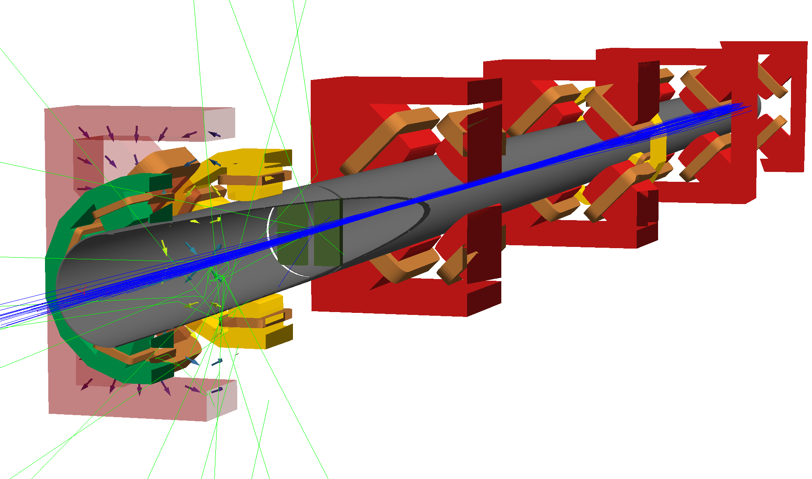

#################################
Welcome to BDSIM's documentation!
#################################

BDSIM is a code to make 3D models of particle accelerators using Geant4.

* https://bitbucket.org/jairhul/bdsim/
* http://www.pp.rhul.ac.uk/twiki/bin/view/JAI/BdSim

.. toctree::
   :maxdepth: 2
   :caption: User Guide

   licence
   authorship
   introduction
   installation
   running
   input_syntax
   model_construction
   model_control
   model_customisation
   model_conversion
   externalgeometry
   output
   output_analysis
   python_utilities
   visualisation
   interfacing
   examples
   support

.. toctree::
   :maxdepth: 1
   :caption: Developer Guide
   
   history
   developer
   model_description

Indices and tables
==================

* :ref:`genindex`
* :ref:`modindex`
* :ref:`search`

