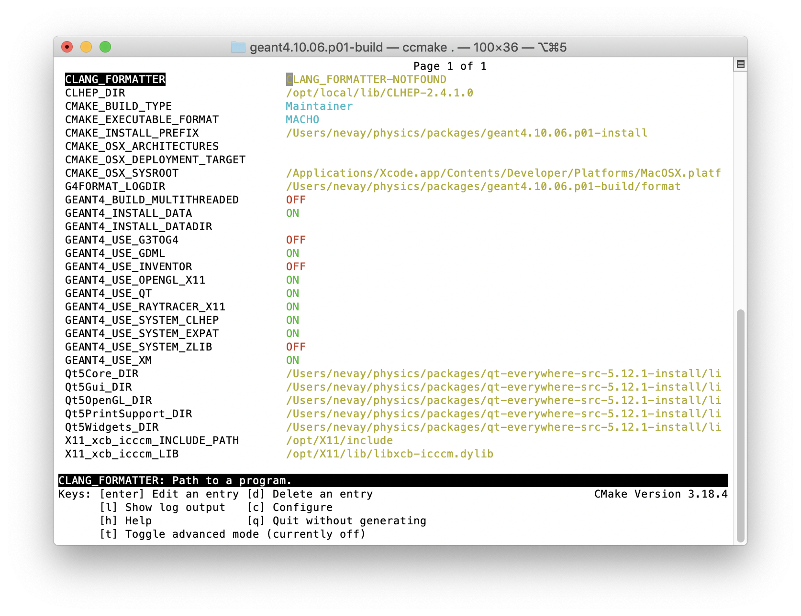
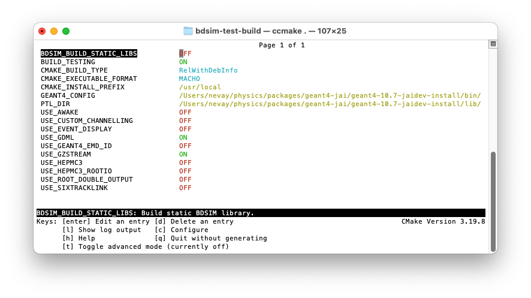
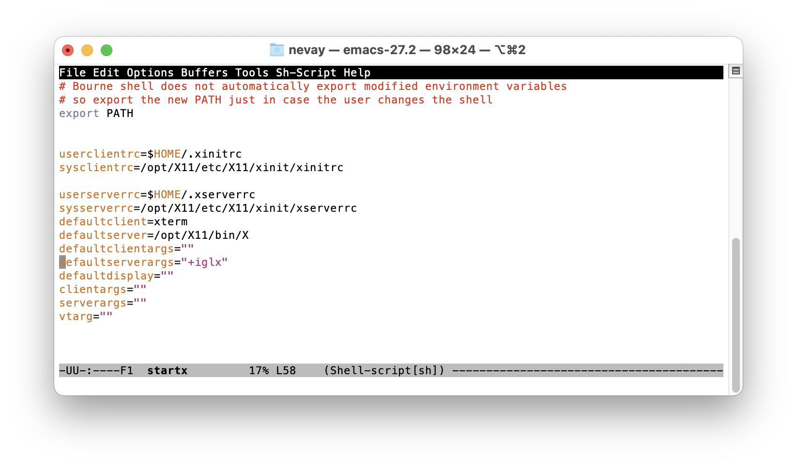

************
Installation
************

Supported Systems
=================

BDSIM is developed and used on Mac OSX and (Scientific) Linux. It can be used
on Windows through some virtualisation technology (e.g. a virtual machine, docker,
or Cygwin, X11 and CVMFS access). See :ref:`solution-windows` for Windows setup.

Tested systems: Mac OS 11, 12, both Intel & M1 (ARM64); Centos7, SLC6. A full list
can be found in :ref:`tested-platforms`.

Solutions
=========

* :ref:`solution-precompiled`
* :ref:`solution-cvmfs`
* :ref:`solution-from-source`
* :ref:`solution-windows`
* :ref:`docker`
* :ref:`apptainer`

.. _solution-precompiled:

Pre-Compiled Libraries
----------------------

These are not yet provided but will be shortly.

.. _solution-cvmfs:

Public Installation on CVMFS
----------------------------

If you have access to CVMFS (CERN Virtual Machine File System) as your university or lab
is linked in some way with CERN or makes use of CVMFS, you can find builds of BDSIM there.
CVMFS is a file system accessible over the internet, and in a certain folder we have some
pre-made BDSIM libraries. These use CERN software for the all the dependencies also available
on CVMFS. Currently, only Centos7 (CC7) builds are provided.

.. _cvmfs-build:

CentOS 7 with CVMFS Access
**************************

If you have a machine running CERN CentOS 7 and with access to the CVMFS file system (CERN Virtual Machine
File System), you can access an installation of bdsim at: ::

  /cvmfs/beam-physics.cern.ch/bdsim/x86_64-centos7-gcc11-opt

You can source a script for a specific version of Geant4 + BDSIM. e.g. ::

  source /cvmfs/beam-physics.cern.ch/bdsim/x86_64-centos7-gcc11-opt/bdsim-env-v1.7.2-g4v10.7.2.3-ftfp-boost.sh

* Tagged versions (e.g. v1.7.2) will remain even when newer versions of BDSIM are provided.
* "develop" versions can change without notice.
* The scripts require BASH (not ZSH) and currently only work on Centos7 as per the name of the directory.
* Each provides: BDSIM, ROOT, Geant4, CLHEP, Python3, IPython, pybdsim, pymadx, pymad8 and pytransport.

Each setup script includes Geant4, ROOT, CLHEP, IPython, Python, and all dependencies. This is based
on CERN's LCG software release (currently #100 for BDSIM). Each build is in a directory with the
naming convention: ::

  bdsim-<version>-g4<g4version>.sh

Optional BDSIM-group patches to Geant4 are represented by an extra patch number (e.g. 10.7.1.1 for our patch
#1 on 10.7.1). The contents of the patches are documented in the build directory in a directory called
"patches" as patch files. These are the patches that were applied to the public source code. Each directory
has a text file in it named with the time of the build and contains any options used to configure the software
so that anyone could reproduce the build.

This may take some time the first time it is used (up to a minute or two), but CVMFS is highly efficient
at caching files and it will subsequently be much faster.

.. note:: When browsing CVMFS, you may not see the directory :code:`beam-physics.cern.ch`. It is there though.
	  Type the full path and it will be accessible.  Once inside this directory (:code:`beam-physics.cern.ch`)
	  you will be able to browse normally. CVMFS doesn't show directories the local computer has
	  never visited before even though they are accessible.

.. note:: MacOS and X11 and 3D visualisation. If using the visualiser on a Centos7 machine remotely (e.g. CERN's
	  lxplus) over X-windows from a Mac, you may find that the whilst the visualiser window generally works,
	  the actual visualisation itself is missing. This is because MacOS, by default, blocks OpenGL over X11.
	  This should be re-enabled. See :ref:`mac-xwindows`.

.. _solution-from-source:
	  
Compilation From Source
-----------------------

BDSIM source code can be downloaded and then compiled. For this, you need a compiler to be
available as well as several other libraries. Most of these can be found through a package
manager such as YUM, APT, MacPorts or HomeBrew. However, for Geant4, we recommend compiling
it yourself for the best options compatible with BDSIM. See:

#. :ref:`required-packages`
#. :ref:`build-setup`
   
   *  :ref:`geant4-installation-guide`
      
#. :ref:`installation-building`

.. _solution-windows:

BDSIM on Windows
----------------

BDSIM is available on Windows 10 through installation on the Windows Subsystem for Linux (WSL) which is downloadable
from the Windows store. We currently advise that you should only install BDSIM on WSL 1 as difficulties have been
encountered in installing BDSIM's dependencies and visualising GUIs with X servers on WSL 2.

An alternative is to use DockerDesktop and build a docker image - instructions below - see :ref:`docker`.

A number of Linux distributions are available, however BDSIM installation has only been tested
on the Ubuntu distribution at present. Please note that we do not regularly test BDSIM on the Windows subsystems.
Follow the guide on the Microsoft website for installing the subsystem.

To install BDSIM on the subsystem, follow the standard installation guide below. An X server is required to view the
BDSIM visualiser from the Linux subsystem. We recommend installing the XMing display server to your Windows 10 machine;
to view windows with XMing you will need to run the command :code:`export DISPLAY=:0` in the Linux Bash environment.
The command should be added to your ``.bashrc`` or profile so that it's loaded automatically every time.	  

.. _docker:
	  
Docker
------

Docker is a virtualisation tool that puts software in a 'container'. This can be run
independently on an operating system and requires fewer resources than a virtual machine. It therefore
allows us to use say BDSIM a Centos7 container on a Mac or Windows machine.

The initial setup takes about 30 minutes, but after that it is nearly instantaneous to start.

A prebuilt image can be downloaded and run on your computer. First, donwload and install

Docker Local Build
******************

Included with BDSIM we have a 'docker file' that docker can follow to build an image on your computer.
This contains instructions about getting Centos, installing various packages and compiling Geant4 and
BDSIM. The docker file is a text file that one can read and use as a set of instructions to follow
on your own system should you wish - of course not a literal set of copy-and-paste instructions as it
uses some docker commands.

To use this, do the following:

1) Download the DockerDesktop application (e.g. `<https://www.docker.com/products/docker-desktop>`_).
2) Clone the BDSIM git repository: :code:`git clone https://bitbucket.org/jairhul/bdsim`.
3) In a terminal (unix or Cygwin), go to :code:`bdsim/building/docker`.
4) Use the docker build script :code:`source build-centos-bdsim.sh` - this may take 20 mins. (\*)
5) Adapt and use the run script :code:`run-centos-bdsim.sh` which is made for Mac / unix.

The last step can commonly be made into an alias in your profile. On the developer's Mac, this is: ::

  alias bdsimdocker="docker run -t -i -v `pwd`:/hostfs -e DISPLAY=`ipconfig getifaddr en0`:0 --rm bdsim bash

This will start a terminal prompt that is a BASH shell 'inside' the container, so Centos7, with
everything ready to go and the command :code:`bdsim` available.

.. note:: (\*) The command in this script is a docker command and can be used in Windows.

Some explanation of the contents of the run script. For a Mac, this reduces (removing the comments) to: ::

  DV=`ipconfig getifaddr en0`
  docker run -t -i -v `pwd`:/hostfs -e DISPLAY=$DV:0 --rm bdsim bash

For docker to send an X-window to the host operating system, it uses the IP address of the computer. The
first command gets this (on a Mac). The second command runs docker and links the display. The image is
called "bdsim" here as per the build script, but it may also be referred to by its docker hexadecimal
image name.

The :code:`-v` syntax work as :code:`-v <host_dir_abs_path>:<container_dir_abs_path>`.

Basic Docker Commands
*********************

* :code:`docker image ls`
* :code:`docker container ls`
* :code:`docker run -t -i --rm <image_name> bash`

   
X11 Notes
*********

Whilst the docker image will almost certainly work without problem, it is more common to have
some issues with the visualiser, which requires sending the window by X11 ('xwindows'). A few
notes:

* On a Mac, you may have to do :code:`xhost +` to allow X11 connections over the network.
* On a Mac, you may have to set once :code:`defaults write org.xquartz.X11 enable_iglx -bool true`.
* See :ref:`mac-xwindows`.

.. _apptainer:
  
Apptainer (formerly Singularity)
--------------------------------

Apptainer (formerly known as singularity) is a container system similar to Docker. A key difference
is that apptainer does not need administrator (root) access to run and therefore can be used on
institute-provided machines such as `lxplus` at CERN for example.

Currently, the apptainer containers are built from the docker images. BDSIM can be run as follows: ::

  apptainer run docker://jairhul/centos7-geant4v10.7.4-environment bash

Initially, this will take some time to download and convert to the apptainer format (e.g. 1-2 hours).
After this initial step, it will run nearly instantly.

Download BDSIM Source Code
==========================

BDSIM may be obtained either from the BDSIM website or the git repository may be cloned.
The user must compile it on their system and must have Geant4, CLHEP and ROOT already present.

Obtaining via the git repository allows easier updates in future as the
user can 'pull' the latest version and then recompile without having to
create a separate copy.

..  _from-git-repository:

GIT Repository
--------------

To download the source from the git repository, use the command::

  git clone --recursive https://bitbucket.org/jairhul/bdsim

This will create a directory called ``bdsim``, inside which all the code, examples
and documentation is provided. Also, the Python utilities that come with BDSIM will be present
when the :code:`--recursive` option is used.

Archive
-------

BDSIM source code versions can be downloaded as zipped archives from the git repository website:

https://bitbucket.org/jairhul/bdsim/downloads/?tab=tags

.. note:: If you download a branch such as develop.tar.gz then it is not a git repository but just
	  a copy of the files. In the case of the develop branch, the BDSIM version recorded in the
	  output will just be "develop" and not the specific git SHA1 commit ID. Therefore, if
	  dealing with the develop branch, it's recommended to clone the repository.
	  
.. _required-packages:
   
Requirements \& Environment
===========================

1) A recent compiler with full C++11 support. Proven compiler versions are GCC 4.9 or higher,
   or clang 6 or higher.
2) `CMake`_ 3.5 or higher (Geant4.10.2 onward requires `CMake`_ 3.3 or higher).
3) `CLHEP`_ 2.1.3.1 or higher, see also `CLHEP Installation Guide`_. Latest recommended but must be compatible with Geant4 version.
4) *Optional* - Python (>=3.6) for Python utilities and easy data loading with ROOT.
5) `ROOT`_ 6.0 or higher, for output & analysis compiled **with** Python3 support.
6) *Optional* - Qt5 libraries for the best Geant4 visualiser (Qt6 not supported in Geant4)
7) *Optional* - Xerces-C++ 3.2 XML library for GDML geometry file loading in Geant4.
8) `Geant4`_  - version 4.10 or higher (latest patch of that release). **Recommend 10.7.p04** or **10.4.p03** (for LHC energies). See `Geant4 Installation Guide`_
9) Flex 2.5.37 or higher.
10) Bison 2.3 or higher.
11) *Optional* - HepMC3 for loading event generator output.

.. note:: These are listed in the correct order of installation / requirement.

For nice analysis and use of `pybdsim` for model conversion, we recommend Python 3 series with
matplotlib and numpy. ROOT should be installed with Python support in this case and with the
**same** Python installation as will be used with the Python utilities.

Geant4, CLHEP and ROOT Versions
-------------------------------

We have found some problems with certain versions of software and these should be
avoided. Generally, we recommend the latest patch version of Geant4. These are the
problems we have found:

* Geant4 10.3.0  - excessively long overlap checking - 15 mins per solid vs normal 40ms.
* Geant4 10.3.pX - generic biasing has no effect - same code works in every other version.
* Geant4 10.4.0  - crash within constructor of G4ExtrudedSolid used extensively in BDSIM.
* Geant4 10.5.0  - the cashkarp integrator for fields will always crash. Events are not independent in rare occasions because of the magnetic field handling.
* Geant4 10.5.pX - bug in G4Extruded solid may occasionally lead to crashes depending on the geometry involved.
* Geant4 10.5 onwards - diffractive proton physics on light target nuclei is disabled by default (on going fix).
* Geant4 11.0 - Bragg peaks are wrong from carbon ions in water.

The authors typically use Geant4 10.4.p03 or Geant4.10.7.p01 for physics results production.

.. note:: CLHEP 2.4.4.1 is required for Geant4 10.7 onwards as the SI units were updated to SI2019. Therefore,
	  we should also be careful about using earlier versions of Geant4 with this version of CLHEP depending
	  on how sensitive your simulation is. Nominally, it should make a negligible difference.

Geant4 Environment
------------------

Note: even though installed, the Geant4 environmental variables must be
available. You can test this in a terminal with::

  echo $G4 <tab>
   $G4ABLADATA         $G4NEUTRONHPDATA    $G4RADIOACTIVEDATA
   $G4LEDATA           $G4NEUTRONXSDATA    $G4REALSURFACEDATA
   $G4LEVELGAMMADATA   $G4PIIDATA          $G4SAIDXSDATA

If these do not exist, please source the Geant4 environmental script
before installing BDSIM and each time before using BDSIM. It is common
to add this to your ``.bashrc`` or profile so that it's loaded automatically
every time::

  source path/to/geant4/installation/bin/geant4.sh

.. _build-setup:

Compilation Environment Setup
=============================

The following sections detail the setup process for different operating systems.

Mac OSX Generally
-----------------

In this order:

#. XCode should be installed.
#. XCode command line tools should be installed (:code:`xcode-select --install`).
#. XCode should be opened at least once and the license terms accepted.
#. XQuartz should be installed - see `<https://www.xquartz.org>`_.
#. The `make` command is available in the terminal.

We recommend obtaining :ref:`required-packages` using either **HomeBrew** or `MacPorts`_
package managesr, although they can be obtained both through other package managers and by
manually downloading, compiling and installing the source for each.

For Homebrew you can do: ::

  brew install root6
  brew install xerces-c flex bison clhep qt@5

For **HomeBrew**, you should use a virtual env for python and then should install any Python packages
through pip: ::

  pip install matplotlib numpy

To setup a virutal environment for Python, you can do: ::

  python3 -m venv /path/to/new/virtual/environment
  source <venv>/bin/activate

Explicitly: ::

  python3 -m venv ~/venv/py311

Edit :code:`.profile` and add: ::

  source ~/venv/py311/bin/activate

For **MacPorts** you can do: ::

  sudo port install root6 +python39
  sudo port install xercesc3 flex bison clhep qt5
  sudo port install py39-matplotlib py39-numpy

* It is best to install Geant4 manually to ensure you use the system CLHEP option (required
  by BDSIM for strong reproducibility) as well as visualiser choices and GDML geometry
  loading.
* As of May 2021, CLHEP on macports is not 2.4.4.1, therefore if **Geant4 10.7** is used,
  CLHEP should be setup manually.

Linux Generally
---------------

Install the :ref:`required-packages` preferably with a package manager.

Older versions of Geant4 can be downloaded from their
`archive <http://geant4.web.cern.ch/geant4/support/source_archive.shtml>`_ .
For Scientific Linux 6 or modern Linux versions, we recommend the latest version of Geant4.
Note: the required compiler version (GCC 4.9) is more modern than the default one (GCC 4.4) on SL6. You
can check the compiler version with::

  gcc --version

CLHEP Installation Guide
------------------------

If not installed with a package manager (MacPorts, HomeBrew, yum), download CLHEP from the `CLHEP`_ website.

Move and unpack to a suitable place::

   tar -xzf clhep-2.3.1.1.tgz
   cd 2.3.1.1

Make build directory::

   mkdir build
   cd build
   cmake ../CLHEP

Adapt parameters if needed with::

   ccmake .

Make and install::

   make
   sudo make install

.. _geant4-installation-guide:

Geant4 Installation Guide
-------------------------

* **Recommend** using Geant4.10.4.p03, or 10.6.p03, or 10.7
* Do not recommend using Geant4.10.5 and Geant4.10.5.p01

BDSIM builds with most recent versions of Geant4 (version 4.10 onwards). You can usually
get Geant4 through a package manager such as MacPorts or HomeBrew, but often a manual installation
is more flexible to allow choice of visualiser and use of GDML (necessary for external
geometry). For manual installation, download the latest patch version from the
Geant website. Move and unpack to a suitable place ::

  tar -xzf geant4.10.6.p03.tar.gz
  ls
   geant4.10.6.p03

Make a build and installation directory **outside** that directory ::

  mkdir geant4.10.6.p03-build
  mkdir geant4.10.6.p03-install

Configure Geant4 using CMake ::

  cd geant4.10.6.p03-build
  cmake ../geant4.10.6.p03

At this point it's useful to define the installation directory for Geant4 by
modifying the CMake configuration as generally described in :ref:`configuring-bdsim`. ::

  ccmake .

It is useful to change a few options with Geant4 for practical purposes.

.. tabularcolumns:: |p{7cm}|p{8cm}|

+---------------------------------+-------------------------------------------------------------+
| **Option**                      | **Description**                                             |
+---------------------------------+-------------------------------------------------------------+
| **CMAKE_INSTALL_PREFIX**        | Useful to specify a known folder to install to.             |
+---------------------------------+-------------------------------------------------------------+
| **GEANT4_BUILD_MULTITHREADED**  | OFF - BDSIM does not support this yet.                      |
+---------------------------------+-------------------------------------------------------------+
| **GEANT4_INSTALL_DATA**         | ON - otherwise Geant will try to download data dynamically, |
|                                 | as it's required during the simulation and it may not be    |
|                                 | possible to run offline.                                    |
+---------------------------------+-------------------------------------------------------------+
| **GEANT4_USE_GDML**             | ON - for external geometry import.                          |
+---------------------------------+-------------------------------------------------------------+
| **GEANT4_USE_OPENGL_X11**       | ON - basic visualiser.                                      |
+---------------------------------+-------------------------------------------------------------+
| **GEANT4_USE_QT**               | ON - the best and most interactive visualiser.              |
|                                 | Needs Qt to be installed                                    |
+---------------------------------+-------------------------------------------------------------+
| **GEANT4_USE_SYSTEM_CLHEP**     | ON - must be on so both Geant4 and BDSIM use the same CLHEP |
|                                 | library. Therefore, there's only one random number          |
|                                 | generator and simulations have strong reproducibility.      |
+---------------------------------+-------------------------------------------------------------+
| **GEANT4_USE_SYSTEM_ZLIB**      | OFF - easier if we use the Geant4 internal version.         |
+---------------------------------+-------------------------------------------------------------+
| **GEANT4_USE_RAYTRACER_X11**    | ON - The most accurate visualiser, but relatively slow and  |
|                                 | not interactive. Useful for promotional materials.          |
+---------------------------------+-------------------------------------------------------------+
| **GEANT4_USE_XM**               | ON - similar to Qt and the one to use if Qt isn't           |
|                                 | available. Needs motif to be installed.                     |
+---------------------------------+-------------------------------------------------------------+

.. warning:: Make sure **GEANT4_BUILD_MULTITHREADED** is off since this is currently not supported.

.. note:: The CLHEP option is required. The GDML and QT options are strongly recommended. Others
	  are to the user's preference.

Once the installation directory is set, press ``c`` to run the configuration
process, and when complete, press ``g`` to generate the build. If ``g`` is not an
available option, then continue to press ``c`` until it becomes available. This
typically takes two or three times - it is due to dependencies being dependent on
other dependencies. Geant4 can then
be compiled ::

  make

Note: Geant4 can take around 20 minutes to compile on a typical computer. If your
computer has multiple cores, you can significantly decrease the time required to
compile by using extra cores ::

  make -jN

where ``N`` is the number of cores on your computer [#ncoresnote]_. Geant4 should
then be installed ::

  make install

Note: if you've specified the directory to install, you will not need the ``sudo``
command. However, if you've left the settings as default, it'll be installed
in a folder that requires ``sudo`` permissions such as ``/usr/local/``.

**IMPORTANT** - you should source the Geant4 environment each time before running
BDSIM, as this is required for the physics models of Geant4.  This can be done using ::

  source path/to/geant4.10.6.p03-install/bin/geant4.sh

It may be useful to add this command to your ``.bashrc`` or profile script.

.. _installation-building:
   
Compiling BDSIM
===============

Once ready, make a directory **outside** the BDSIM source directory to build
BDSIM in::

  ls
   bdsim
  mkdir bdsim-build
  ls
   bdsim bdsim-build

It is important that the build directory be outside the source directory, otherwise
trouble may be encountered when receiving further updates from the git repository.
From this directory use the following CMake command to configure the BDSIM
installation::

  cd bdsim-build
  cmake ../bdsim

This typically produces the following output, which is slightly different on each computer::

  -- The C compiler identification is AppleClang 12.0.5.12050022
  -- The CXX compiler identification is AppleClang 12.0.5.12050022
  -- Detecting C compiler ABI info
  -- Detecting C compiler ABI info - done
  -- Check for working C compiler: /Applications/Xcode.app/Contents/Developer/Toolchains/XcodeDefault.xctoolchain/usr/bin/cc - skipped
  -- Detecting C compile features
  -- Detecting C compile features - done
  -- Detecting CXX compiler ABI info
  -- Detecting CXX compiler ABI info - done
  -- Check for working CXX compiler: /Applications/Xcode.app/Contents/Developer/Toolchains/XcodeDefault.xctoolchain/usr/bin/c++ - skipped
  -- Detecting CXX compile features
  -- Detecting CXX compile features - done
  -- Configuring BDSIM 1.6.0
  -- Installation prefix: /usr/local
  -- Build Type RelWithDebInfo
  -- Compiler fully supports C++17 and prior versions
  -- Looking for CLHEP
  -- Found CLHEP 2.4.4.1 in /Users/nevay/physics/packages/clhep-2.4.4.1-install/lib/CLHEP-2.4.4.1/../../include
  -- Looking for ROOT...
  -- ROOT search hint from $ROOTSYS: /opt/local
  -- Using root-config: /opt/local/bin/root-config
  -- Found ROOT 6.24/00 in /opt/local/libexec/root6
  -- ROOT compiled with cxx17 feature -> changing to C++17 for BDSIM
  -- GDML support ON
  -- Looking for pthread.h
  -- Looking for pthread.h - found
  -- Performing Test CMAKE_HAVE_LIBC_PTHREAD
  -- Performing Test CMAKE_HAVE_LIBC_PTHREAD - Success
  -- Found Threads: TRUE  
  -- Geant4 Use File: /Users/nevay/physics/packages/geant4-jai/geant4-10.7-jaidev-install/lib/Geant4-10.7.1/UseGeant4.cmake
  -- Geant4 Definitions: -DG4UI_USE_TCSH;-DG4INTY_USE_XT;-DG4VIS_USE_RAYTRACERX;-DG4INTY_USE_QT;-DG4UI_USE_QT;-DG4VIS_USE_OPENGLQT;-DG4VIS_USE_OPENGLX;-DG4VIS_USE_OPENGL;-DG4VIS_USE_QT3D
  -- G4_VERSION: 10.7.1
  -- Found Doxygen: /opt/local/bin/doxygen (found version "1.9.1") found components: doxygen dot 
  -- Found BISON: /opt/local/bin/bison (found suitable version "3.7.6", minimum required is "2.4") 
  -- Found FLEX: /opt/local/bin/flex (found version "2.6.4") 
  -- Performing Test COMPILER_HAS_HIDDEN_VISIBILITY
  -- Performing Test COMPILER_HAS_HIDDEN_VISIBILITY - Success
  -- Performing Test COMPILER_HAS_HIDDEN_INLINE_VISIBILITY
  -- Performing Test COMPILER_HAS_HIDDEN_INLINE_VISIBILITY - Success
  -- Performing Test COMPILER_HAS_DEPRECATED_ATTR
  -- Performing Test COMPILER_HAS_DEPRECATED_ATTR - Success
  -- Looking for zlib
  -- Using Geant4 built in zlib
  -- Copying example directory
  -- Found Sphinx: /opt/local/bin/sphinx-build  
  -- Found PY_sphinx_rtd_theme: /opt/local/Library/Frameworks/Python.framework/Versions/3.9/lib/python3.9/site-packages/sphinx_rtd_theme  
  -- Configuring done
  -- Generating done
  -- Build files have been written to: /Users/nevay/physics/reps/bdsim-test-build

CMake will search your system for the required dependencies. In the above example, this
proceeded without any errors. In the case where a required dependency cannot be found,
an error will be shown and CMake will stop. Please see :ref:`configuring-bdsim` for
further details on how to fix this and further configure the BDSIM installation.

You can then compile BDSIM with::

  make

BDSIM can then be installed (default directory /usr/local) for access from anywhere
on the system with::

  sudo make install

To change the installation directory, see :ref:`configuring-bdsim`.
From any directory on your computer, ``bdsim`` should be available.

At this point, BDSIM itself will work, but more environmental variables must be
set to use the analysis tools (this is a requirement of ROOT). These can be set
by sourcing the bdsim.sh shell script in the installation directory: ::

  source <bdsim-install-dir>/bin/bdsim.sh

This can be added to your :code:`.profile` or :code:`.bashrc` file. The user
should adapt this if they use a C-shell.

* Re-source your profile (or restart the terminal).
* You should be able to execute :code:`bdsim --help` or :code:`rebdsim`

.. figure:: figures/rebdsim_execution.png
	    :width: 100%
	    :align: center

If the analysis will be regularly used interactively, it is worth automating the library
loading in root by finding and editing the :code:`rootlogon.C` in your
:code:`<root-install-dir>/macros/` directory.  Example text would be::

  cout << "Loading rebdsim libraries" << endl;
  gSystem->Load("librebdsimLib");
  gSystem->Load("libbdsimRootEvent");

.. note:: The file extension is omitted on purpose.

The absolute path is not necessary, as the above environmental variables are used by ROOT
to find the library.

From the build directory you can verify your installation using a series of tests
included with BDSIM (excluding long running tests)::

  ctest -LE LONG

.. _configuring-bdsim:

Configuring the Build
---------------------

To either enter paths to dependencies manually, or edit the configuration, the following
command will give you and interface to CMake (from the :code:`bdsim-build` directory)::

  ccmake .

You can then use **up** and **down** arrows to select the desired parameter and
**enter** to edit it. If the parameter is a path, press **enter** again after
entering the path to confirm.

Once the parameter has been edited, you can proceed by pressing **c** to run
the configuration and if successful, follow this by **g** to generate the
build. After configuring the installation, you should run::

  make
  make install

.. note:: If the default installation directory is used, you may need to use :code:`sudo` before
	  this command. You can change the installation directory in the above **ccmake**
	  configuration to one that won't require the :code:`sudo` command. The variable
	  :code:`CMAKE_INSTALL_PREFIX` should be changed.
  
.. _installation-bdsim-config-options:

Optional Configuration Options
******************************

BDSIM has a few optional configuration options. These can be specified with a value when
running CMake by prefixing them with "-D". The following options are available.

.. tabularcolumns:: |p{7cm}|p{8cm}|

+-------------------------------+-------------------------------------------------------------+
| **Option**                    | **Description**                                             |
+===============================+=============================================================+
| **USE_AWAKE**                 | Use AWAKE model components. (default OFF)                   |
+-------------------------------+-------------------------------------------------------------+
| **USE_BOOST**                 | Whether to link againt Boost library. (default OFF)         |
|                               | This options enables the differential flux scoring feature  |
|                               | available using the scorer type cellflux4d.                 |
+-------------------------------+-------------------------------------------------------------+
| **USE_CUSTOM_CHANNELLING**    | Use RHUL custom crystal channelling package in Geant4. Only |
|                               | if you have this package patched onto Geant4.               |
+-------------------------------+-------------------------------------------------------------+
| **USE_EVENT_DISPLAY**         | Turn on or off event display. Requires ROOT EVE libraries   |
|                               | and is an unmaintained work in progress. (default OFF)      |
+-------------------------------+-------------------------------------------------------------+
| **USE_GDML**                  | Control over use of GDML. On if Geant4 has GDML support.    |
+-------------------------------+-------------------------------------------------------------+
| **USE_GEANT4_EMD_ID**         | If using RHUL Geant4 with EMD process with its own ID turn  |
|                               | this on to uniquely identify that process in cross-section  |
|                               | biasing. (default OFF)                                      |
+-------------------------------+-------------------------------------------------------------+
| **USE_GZSTREAM**              | Control over using GZip library. (default ON)               |
+-------------------------------+-------------------------------------------------------------+
| **USE_HEPMC3**                | Whether to link against HepMC3. (default OFF)               |
+-------------------------------+-------------------------------------------------------------+
| **USE_HEPMC3_ROOTIO**         | Whether HEPMC3 was built with ROOTIO on. (default OFF)      |
+-------------------------------+-------------------------------------------------------------+
| **USE_ROOT_DOUBLE_OUTPUT**    | Whether to use double precision for all output. Note this   |
|                               | will roughly double the size of the output files. Useful    |
|                               | only for precision tracking tests using samplers. Note,     |
|                               | data generated with this build cannot be used with a        |
|                               | normal build with this turned off. (default OFF)            |
+-------------------------------+-------------------------------------------------------------+
| **BDSIM_BUILD_STATIC_LIBS**   | Whether to build the static library in addition to the main |
|                               | shared one. Note, currently the executables will only ever  |
|                               | be linked to the shared libraries - work in progress.       |
|                               | (default OFF)                                               |
+-------------------------------+-------------------------------------------------------------+

* Booleans can be specified with OFF or ON.

Examples: ::

  cmake ../bdsim -DUSE_HEPMC3=ON

* With HepMC 3.1.1 we find a compiler warning about an unused variable. This is harmless and on the
  HepMC3 side that we can't change.

Giving CMake Hints for Packages
*******************************

When configuring BDSIM, or any CMake package, we can give CMake hints on where to look for
packages. These can be given through the command line options at configuration time with
the general syntax :code:`-D<package-name>_DIR=/path/to/package/install-prefix`. For example,
the following ones may be useful with BDSIM.

* :code:`-DHepMC3_DIR`
* :code:`-DGeant4_DIR`
* :code:`-DCLHEP_DIR`

Example: ::

  cmake ../bdsim -DUSE_HEPMC3=ON -DHepMC3_DIR=/opt/local/share/HepMC3/cmake

Specifying a ROOT Installation
******************************

To specify a ROOT installation it is best to have source the :code:`<root-install-prefix>/bin/thisroot.sh`.
This will set the environmental variable ROOTSYS. BDSIM will look for the program :code:`root-config`
in the prefix given by ROOTSYS in the environment then use the ROOT installation according to that
root-config.

This can be overridden by specifying :code:`-DROOT_CONFIG_EXECUTABLE=/path/to/root-config` when configuring
BDSIM.  For example: ::

  mkdir bdsim-build
  cd bdsim-build
  cmake ../bdsim -DROOT_CONFIG_EXECUTABLE=/Users/nevay/physics/packages/root-6.18.04-install/bin/root-config

The CMake configuration print out will show which ROOT installation is being used.
  
  
Advanced Configuration Options
******************************

These options are for developers of BDSIM. These may change without notice or cause unintended
effects.

.. tabularcolumns:: |p{7cm}|p{8cm}|

+------------------------------------+-------------------------------------------------------------+
| **Option**                         | **Description**                                             |
+====================================+=============================================================+
| **BDSIM_BUILD_TEST_PROGRAMS**      | Whether to build a set of test executable programs. For     |
|                                    | developers. Also defines extra CTest tests. Default off.    |
+------------------------------------+-------------------------------------------------------------+
| **BDSIM_FINAL_INSTALL_DIR**        | This path if set will used as the first vis macro path to   |
|                                    | be searched. Should be up to and including "bdsim". Used in |
|                                    | the case of a CVMFS build where the build is relocated.     |
+------------------------------------+-------------------------------------------------------------+
| **BDSIM_GENERATE_REGRESSION_DATA** | Whether to generate regression test data from the tests.    |
+------------------------------------+-------------------------------------------------------------+
| **BDSIM_REGRESSION_PREFIX**        | Name prefix for all output files from regression test data. |
+------------------------------------+-------------------------------------------------------------+
| **USE_DEBUG_NAVIGATION**           | Extra print out (a lot) to understand navigation through    |
|                                    | the geometry.                                               |
+------------------------------------+-------------------------------------------------------------+
| **USE_FIELD_DOUBLE_PRECISION**     | Use double precision for all field maps.                    |
+------------------------------------+-------------------------------------------------------------+
| **USE_SIXTRACK_LINK**              | Use experimental sixtrack link interface. Affects output.   |
|                                    | (default OFF)                                               |
+------------------------------------+-------------------------------------------------------------+

.. _installation-environmental-variables:
  
Environmental Variables
***********************

Some variables are required by ROOT to access the BDSIM classes but not by BDSIM itself.
These variables are set in the :code:`<bdsim-install-dir>/bin/bdsim.sh` provided shell script.

* We recommend adding this to your terminal profile: :code:`source <bdsim-install-dir>/bin/bdsim.sh`

.. _setup-python-utilities:
  
Python Utilities
================

* Quick setup: simply run ``source pyutils.sh`` from the ``bdsim/utils`` directory.
  
The BDSIM Python utilities (`pytransport`, `pymad8`, `pymadx`, and `pybdsim`) all exist in
separate git repositories in the following locations:

* https://bitbucket.org/jairhul/pybdsim
* https://bitbucket.org/jairhul/pymadx
* https://bitbucket.org/jairhul/pymad8
* https://bitbucket.org/jairhul/pytransport

These should be downloaded and installed **using pip** by default for users.
  
If it is intended to edit these packages or add to them (always welcome!), then it
is preferable to clone the git repository and use the commands in the Makefile in each
one, such as :code:`pip install --editable .` that allows the package to be registered
to your Python installation but it gets the files freshly each time from the git
repository folder upon restarting Python.

To switch between these modes, simply uninstall the utilities, then reinstall. ::

  pip uninstall pybdsim
  pip uninstall pymadx
  pip uninstall pymad8
  pip uninstall pytransport

.. note:: `pybdsim` depends on `pymadx`, `pymad8`, and `pytransport`, so if these are
          not already available it will get them from PyPi on the internet. To use
          multiple develop versions of these from local git repositories, install in
          the order: `pytransport`, `pymad8`, `pymadx`, then `pybdsim`.

Updating the Python Utilities
-----------------------------

With pip you can see if packages are outdated with: ::

  pip list -o

If you see pybdsim as an outdated package, you can do the following to update it: ::

  pip install --upgrade pybdsim

Upgrading BDSIM
===============

To update BDSIM when a new release is made, we recommend receiving updates through the
git repository. To receive the latest version of the software, the user must 'pull' the
changes from the git repository and then update the build.

.. note::  Assuming you have a BDSIM source directory ("bdsim") that is a clone of the git repository
  and a separate build directory ("bdsim-build") that is *outside* the source directory.

.. code::

   cd bdsim
   git pull

You then have two options: 1) make a clean build or 2) update the current build. The first option
is generally more robust and we recommend that. Both are described for completeness.

Clean Build
-----------

.. code::
   
   cd ../bdsim-build
   rm -rf *
   cmake ../bdsim
   # do any configuration steps in ccmake .
   make -j4
   make install

If custom locations for various dependencies had to be specified with CMake for the initial
configuration and compilation of BDSIM, these will have to be repeated (see
:ref:`configuring-bdsim` for details on using ccmake to do this).

Updated Existing Build
----------------------

.. code::

   cd ../bdsim-build
   cmake ../bdsim
   make -j4
   make install

.. _Troubleshooting:

Troubleshooting
===============

Below is a list of possible encountered problems. If you experience problems beyond these,
please contact us (see :ref:`support-section`).
    
1) Mac OSX Mojave - OpenGL visualisations in Geant4 appear to be missing in a grey
   screen or worse, bits of the interface double size. The user must use Qt 5.12.1
   or greater for these issues to be resolved. This issue is documented here:
   https://bugzilla-geant4.kek.jp/show_bug.cgi?id=2104

2) Visualisation does not work::

     "parameter value is not listed in the candidate List."

   Check which graphics systems BDSIM has available. This is shown in the terminal when
   you run BDSIM ::

     You have successfully registered the following graphics systems.
     Current available graphics systems are:
     ASCIITree (ATree)
     DAWNFILE (DAWNFILE)
     G4HepRep (HepRepXML)
     G4HepRepFile (HepRepFile)
     OpenGLImmediateQt (OGLI, OGLIQt)
     OpenGLImmediateX (OGLIX)
     OpenGLImmediateXm (OGLIXm, OGLI_FALLBACK, OGLIQt_FALLBACK)
     OpenGLStoredQt (OGL, OGLS, OGLSQt)
     OpenGLStoredX (OGLSX)
     OpenGLStoredXm (OGLSXm, OGL_FALLBACK, OGLS_FALLBACK, OGLSQt_FALLBACK)
     RayTracer (RayTracer)
     RayTracerX (RayTracerX)
     VRML1FILE (VRML1FILE)
     VRML2FILE (VRML2FILE)
     gMocrenFile (gMocrenFile)

   If your favourite is not there check that Geant4 is correctly compiled with that graphics system.
   You will have to reconfigure Geant4 and install any necessary libraries (such as Qt or XMotif), then
   recompile Geant4, then recompile bdsim.

3) Huge print out and failure when trying to load data in Python: ::

     In [1]: import pybdsim
     d =

     In [2]: d = pybdsim.Data.Load("run1.root")

     Error in cling::AutoloadingVisitor::InsertIntoAutoloadingState:
     Missing FileEntry for ../parser/beamBase.h
     requested to autoload type GMAD::BeamBase
     Error in cling::AutoloadingVisitor::InsertIntoAutoloadingState:
     Missing FileEntry for ../parser/optionsBase.h
     requested to autoload type GMAD::OptionsBase
     HeaderDict dictionary payload:33:10: fatal error: 'BDSOutputROOTEventHeader.hh' file not found
     #include "BDSOutputROOTEventHeader.hh"
               ^~~~~~~~~~~~~~~~~~~~~~~~~~~~~
     Error in <TInterpreter::AutoParse>: Error parsing payload code for class Header with content:
     
     #line 1 "HeaderDict dictionary payload"
     
     #ifndef G__VECTOR_HAS_CLASS_ITERATOR
       #define G__VECTOR_HAS_CLASS_ITERATOR 1
     #endif
     #ifndef __ROOTBUILD__
       #define __ROOTBUILD__ 1
     #endif
     
     #define _BACKWARD_BACKWARD_WARNING_H
     /* 
     Beam Delivery Simulation (BDSIM) Copyright (C) Royal Holloway, 
     University of London 2001 - 2020.
     
     This file is part of BDSIM.
     
     BDSIM is free software: you can redistribute it and/or modify 
     it under the terms of the GNU General Public License as published 
     by the Free Software Foundation version 3 of the License.
     
     BDSIM is distributed in the hope that it will be useful, but 
     WITHOUT ANY WARRANTY; without even the implied warranty of
     MERCHANTABILITY or FITNESS FOR A PARTICULAR PURPOSE.  See the
     GNU General Public License for more details.
     
     You should have received a copy of the GNU General Public License
     along with BDSIM.  If not, see <http://www.gnu.org/licenses/>.
     */
     #ifndef ANALYSISHEADER_H
     #define ANALYSISHEADER_H
     
     #include "TROOT.h"
     
     #include "BDSOutputROOTEventHeader.hh"
     
     #include "RebdsimTypes.hh"
     
     class TTree;
     
     /**
      * @brief Options loader.
      *
      * @author Laurie Nevay.
      */
     
     class Header
     {
     public:
       Header();
       Header(bool debugIn);
       virtual ~Header();
     
       /// Set the branch addresses to address the contents of the file.
       void SetBranchAddress(TTree* t);
     
       /// Member that ROOT can map file data to locally.
       BDSOutputROOTEventHeader* header;
     
     private:
       bool debug;
       
       ClassDef(Header,1);
     };
     
     #endif
     
     #undef  _BACKWARD_BACKWARD_WARNING_H
     
     Error in <TClass::LoadClassInfo>: no interpreter information for class Header is available even though it has a TClass initialization routine.
     Error in <TClass::LoadClassInfo>: no interpreter information for class Header is available even though it has a TClass initialization routine.
     ---------------------------------------------------------------------------
     RuntimeError                              Traceback (most recent call last)
     <ipython-input-2-ab00b7718588> in <module>()
     ----> 1 d = pybdsim.Data.Load("run1.root")
     
     /Users/nevay/physics/reps/pybdsim/pybdsim/Data.pyc in Load(filepath)
          60         return _LoadAscii(filepath)
          61     elif extension == 'root':
     ---> 62         return _LoadRoot(filepath)
          63         try:
          64             return _LoadRoot(filepath)
     
     /Users/nevay/physics/reps/pybdsim/pybdsim/Data.pyc in _LoadRoot(filepath)
         149     LoadROOTLibraries()
         150 
     --> 151     fileType = _ROOTFileType(filepath) #throws warning if not a bdsim file
         152 
         153     if fileType == "BDSIM":
     
     /Users/nevay/physics/reps/pybdsim/pybdsim/Data.pyc in _ROOTFileType(filepath)
         133     if not htree:
         134         raise Warning("ROOT file \"{}\" is not a BDSIM one".format(fileToCheck))
     --> 135     h = _ROOT.Header()
         136     h.SetBranchAddress(htree)
         137     htree.GetEntry(0)
     
     RuntimeError: Header::Header() =>
         could not resolve ::()
     
     In [3]:

In this case, neither ROOT_INCLUDE_PATH or (DY)LD_LIBRARY_PATH environmental variables have been
set. See :ref:`installation-building` and :ref:`installation-environmental-variables`.
        	
4) Error from OpenGL::

     G4OpenGLImmediateX::CreateViewer: error flagged by negative view id in
     G4OpenGLImmediateXViewer creation.

   Check that your graphics card driver is installed correctly for your memory card
   and possibly reinstall them. For Ubuntu for example, run::

     fglrxinfo

   If fglrx is installed and working well you should see an output similar to::

     > fglrxinfo
     display: :0  screen: 0
     OpenGL vendor string: Advanced Micro Devices, Inc.
     OpenGL renderer string: ATI Radeon HD 4300/4500 Series
     OpenGL version string: 3.3.11399 Compatibility Profile Context

   For more info see https://help.ubuntu.com/community/BinaryDriverHowto/AMD

5) Build does not work - GLIBCXX errors, where a message similar to this is shown ::

     Linking CXX executable bdsim
     /afs/cern.ch/sw/lcg/external/geant4/9.6.p02/x86_64-slc6-gcc46-opt
     /lib64/libG4analysis.so: undefined reference to
     'std::__detail::_List_node_base::_M_unhook()@GLIBCXX_3.4.15'

   This means that the compiler version for BDSIM is different from the one used to compile Geant4.
   Make sure it is the same compiler version. Remember to start from a clean build directory, otherwise
   CMake does **NOT** update the compiler version.

6) Build does not work - linker errors with xml and zlib like ::

     /usr/lib/../lib64/libxml2.so: undefined reference to `gzdirect@ZLIB_1.2.2.3'
     collect2: error: ld returned 1 exit status

   This probably means that the xml library is not properly installed. The easiest option may be not to use this part of BDSIM by switching off the CMake variable USE_GDML (in ccmake).

7) The visualiser starts but there is no 3D model present (BDSIM on CVMFS).

This problem is encountered when using BDSIM over X11 / XWindows such as from lxplus at CERN
and using the CVMFS installation and using it from a Mac computer. This is due to the X-server
not allowing OpenGL by default (the 3D bit). See :ref:`mac-xwindows` for the solution.

.. rubric:: Footnotes

.. [#ncoresnote] If your computer supports hyper-threading, you can use twice the number of
		 cores with the ``make -jN`` command (i.e. a computer has 4 cores and supports
		 hyper-threading, can support up to ``make -j8``). Exceeding this number will
		 result in slower than normal compilation.

.. Links

.. _CMake: http://www.cmake.org/
.. _CLHEP: http://proj-clhep.web.cern.ch/
.. _CLHEP-2.3.1.1: http://proj-clhep.web.cern.ch/proj-clhep/DISTRIBUTION/tarFiles/clhep-2.3.1.1.tgz
.. _Geant4: http://geant4.cern.ch/
.. _Macports: http://www.macports.org/
.. _ROOT: http://root.cern.ch/

.. _mac-xwindows:

XWindows With MacOS
===================

If using a Mac computer and intending to use BDSIM via SSH / X-Windows, which may include
using BDSIM via a Docker image, it is possible the display will appear but there will be
no model present and just a **blank white screen**. This is due to the default settings
of XQuartz (the most common Mac X-Windows server) not allowing 3D content (specifically openGL)
over X-Windows by default. This was done for security reasons but since we typically connect
to a 'window' via SSH, this is irrelevant.

To fix this, we must change the settings.

.. note:: These settings apply only for MacOS with XQuartz.

1) In a terminal, do the following: ::

     defaults write org.macosforge.xquartz.X11 enable_iglx -bool true
     defaults write org.xquartz.X11 enable_iglx -bool true

   which enables *indirect openGL over X*.

2) Edit the X11 startup script to include the :code:`defaultserverargs="+iglx"`. ::

     sudo emacs -nw /opt/X11/bin/startx

Around line 58 we find the argument and edit it.

	    Example of editing the X11 configuration in a terminal.

If emacs is use, save and close with :code:`Ctrl X Ctrl S`, then :code:`Ctrl X Ctrl C`.

3) Restart the mac to force a restart of X11.

A test is to use the small utility program :code:`glxgears`, which when started will
bring up a small window with 3 animated interlocking cogs that rotate.

This is based on advice found at: https://www.visitusers.org/index.php?title=Re-enabling_INdirect_GLX_on_your_X_server .

Programs Included
=================

BDSIM is a program but it is accompanied by other programs for various tasks. Here is a complete
list of all executable programs included.

.. tabularcolumns:: |p{3cm}|p{7cm}|

+--------------------+-----------------------------------------------------------+
| **Program**        | **Description**                                           |
+====================+===========================================================+
| bdsim              | The main tool to generate Monte Carlo simulation data.    |
+--------------------+-----------------------------------------------------------+
| rebdsim            | Analysis tool to make histograms and calcualte optics.    |
+--------------------+-----------------------------------------------------------+
| rebdsimCombine     | Combine multiple rebdsim output files into 1 file.        |
+--------------------+-----------------------------------------------------------+
| rebdsimHistoMerge  | Operate on a bdsim output file and average the per-event  |
|                    | pre-made histograms only.                                 |
+--------------------+-----------------------------------------------------------+
| rebdsimOptics      | Operate on a bdsim output file and calculate optical      |
|                    | functions from the sampler data - the 'optics'.           |
+--------------------+-----------------------------------------------------------+
| rebdsimOrbit       | Operate on a bdsim output file and extrac the first       |
|                    | entry in each sampler - assuming 1 primary this is the    |
|                    | 'orbit' of that particle.                                 |
+--------------------+-----------------------------------------------------------+
| bdskim             | Create a copy of a bdsim output file keeping only select  |
|                    | events according to a selection - skim the data.          |
+--------------------+-----------------------------------------------------------+
| bdsimCombine       | Combine bdsim output files together into a bigger file.   |
+--------------------+-----------------------------------------------------------+
| bdsinterpolator    | Load a field map and query it by inteprolation.           |
+--------------------+-----------------------------------------------------------+
| comparator         | Utility for numerically and statistically comparing bdsim |
|                    | and rebdsim output files for regression testing.          |
+--------------------+-----------------------------------------------------------+
| makematerialfile   | Export 2 files with materials and elements from NIST as   |
|                    | required by pyg4ometry.                                   |
+--------------------+-----------------------------------------------------------+
| ptc2bdsim          | Convert a PTC inrays file to one useable by bdsim.        |
+--------------------+-----------------------------------------------------------+
| gmad               | The parser on its own as a program - no model is built.   |
+--------------------+-----------------------------------------------------------+

.. _tested-platforms:

Tested Platforms
================

* Mac OS 11.6.1 M1 (Big Sur), XCode 13.0 (Apple clang version 13.0.0 (clang-1300.0.29.3)), Geant4 11.0.0, ROOT 6.24/06, CLHEP, 2.4.4.2, Qt 5.15.2
* Mac OS 11.6.1 M1 (Big Sur), XCode 13.0 (Apple clang version 13.0.0 (clang-1300.0.29.3)), Geant4 10.7.3, ROOT 6.24/06, CLHEP, 2.4.4.2, Qt 5.15.2
* Mac OS 11.6.1 Intel (Big Sur), XCode 13.0 (Apple clang version 13.0.0 (clang-1300.0.29.3)), Geant4 11.0.0, ROOT 6.24/06, CLHEP, 2.4.4.2, Qt 5.15.2
* Mac OS 11.6.1 Intel (Big Sur), XCode 13.0 (Apple clang version 13.0.0 (clang-1300.0.29.3)), Geant4 10.7.3, ROOT 6.24/06, CLHEP, 2.4.4.2, Qt 5.15.2
* CERN CentOS 7, GCC 9.2.0, Geant4 10.7.2, 10.6, 10.4.3, ROOT 6.24.00, CLHEP 2.4.4.0 (i.e. lxplus at CERN with LCG100)
* SLC6, GCC 4.9.3, Geant4 10.5.1, ROOT 6.10/08, CLHEP 2.3.3.0, Qt 5.7.0
* SLC6 as above with Geant4 10.4.p02, Geant4 10.3.p03, Geant4 10.2.p03, Geant4 10.1.p03

Recently tested:

* Mac OS 11.6.1 (Big Sur), XCode 12.5 (Apple clang version 12.0.5 (clang-1205.0.22.9)), Geant4 10.7.1, ROOT 6.24/00, CLHEP 2.4.4.1, Qt 5.15.2
* Mac OSX 10.14.6 (Mojave), XCode 10.3 (Apple LLVM version 10.0.1 (clang-1001.0.46.4)), Geant4 10.7, ROOT 6.18/04, CLHEP 2.4.4.0, Qt 5.14.2
* Mac OSX 10.14.6 (Mojave), XCode 10.3 (Apple LLVM version 10.0.1 (clang-1001.0.46.4)), Geant4 10.6.p02, ROOT 6.18/04, CLHEP 2.4.1.0, Qt 5.14.2
* Mac OSX 10.14.3 (Mojave), XCode 10.1, Geant4 10.5, ROOT 6.16/00, CLHEP 2.4.1.0, Qt 5.12.0
* Mac OSX 10.13.3 (High Sierra), XCode 10.1, Geant4 10.4.p02, ROOT 6.12/06, CLHEP 2.3.4.4, Qt 5.12.0
