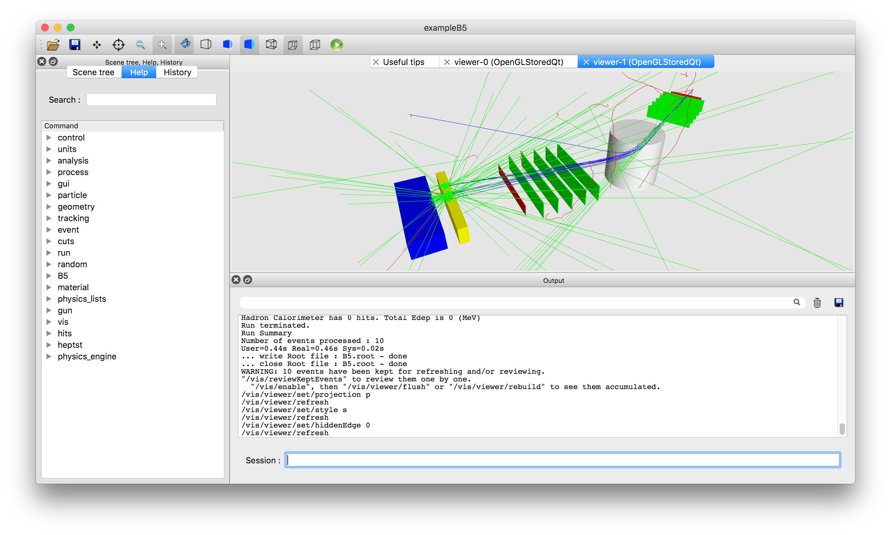
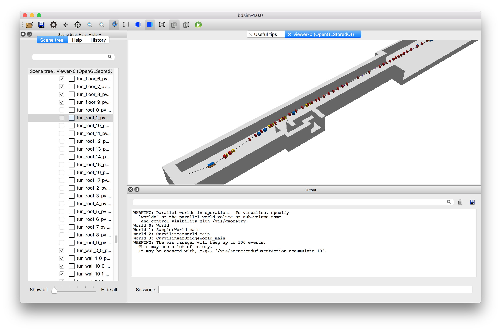
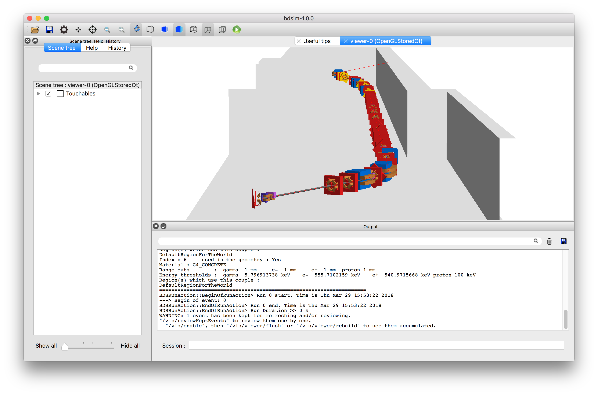

************
Introduction
************

Purpose of BDSIM
================

Beam Delivery Simulation (BDSIM) is a C++ program that utilises the Geant4
toolkit to simulate both the transport of particles in an accelerator and
their interaction with the accelerator material. BDSIM is capable of
simulating a wide variety of accelerator components and magnets with Geant4
geometry dynamically built based on a text input file. Thick lens accelerator
tracking routines are provided for fast accurate tracking in vacuum.

What BDSIM is suitable for
--------------------------

* Single particle Monte-Carlo simulations of particle accelerators
* Simulating beam loss in a particle accelerator
* Simulating detector backgrounds from halo and machine background sources

What BDSIM is not intended for
------------------------------

* Long term tracking studies
* Simulating collective effects
* Lattice optical design and optimisation
* A replacement for tracking codes like SixTrack or PTC

Example Applications
--------------------

* Detector background from the accelerator.
* Beam transport in air.
* Beam interaction with vacuum gas.
* Losses in extraction kick.
* LHC beam loss and energy deposition.
* CLIC muon background from accelerator.
* Laserwire detector signal to background ratio.
* ILC collimator efficiency study and detector backgrounds

Capabilities
============

* BDSIM uses **ASCII** text input with a syntax designed to be very similar to
  **MAD8** / **MADX**.
* Convert MADX / MAD8 / TRANSPORT model to a 3D model in minutes.
* Generate beam distribution according to Twiss parameters of a beam.
* Track beam distribution and record particle distribution after each component.
* Simulate energy deposition in all components along beam line.
* Calculate beam distribution and Twiss optical functions from particle distribution.
* Use the full set of physics processes available in Geant4.
* Adjust cross-sections of processes of interest.
* Use externally provided geometry and field maps for a fully customised model.
* Interactively visualise model in 3D as well as particle tracks.
* Analyse history and origin of radiation produced in accelerator with analysis suite.
* Strong reproducibility - recreate any event again exactly.

Simulation Procedure
====================

1) Create a text input **.gmad** lattice for BDSIM by converting a **MADX** or **MAD8** Twiss file or writing your own.
2) Run BDSIM with core beam distribution for validation of optics and therefore model preparation.
3) Run BDSIM with desired input distribution and physics processes with low statistics to verify desired application.
4) Repeat 3) with greater statistics either as a single instance or on a computing cluster.
5) Analyse output data as desired.

How BDSIM Works
===============

 * BDSIM builds a complete Geant4 model and runs it as a Geant4 model.
 * BDSIM does not link to another particle tracking code.
 * BDSIM does not pass information back and forth between two codes.
 * Thick lens tracking routines are used in place of normal 4th order Runge-Kutta integrators.
 * BDSIM provides the required transforms between Cartesian and Curvilinear coordinate systems for accelerator tracking routines.

In a Geant4 program, code is written in C++ to construct a 3D model of the object
to be simulated. A Geant4 example is shown below being interactively visualised.

	    Example Geant4 program being visualised with events displayed.

This is labour intensive and inflexible for different accelerator models or optics. As
accelerators typically consist of a standard set of components these can be made
reasonably generic. BDSIM provides a library of geometry and fields that allow
simple optical descriptions to be made into 3D models. Example screen shots are shown
below.

.. figure:: figures/example-simpleCollimation.png
	    :width: 90%
	    :align: center

	    "simpleCollimation" example of four quadrupoles in a small tunnel section.

	    Accelerator Test Facility 2 in KEK, Japan with tunnel model.

	    Accelerator Test Facility 2 in KEK, Japan with tunnel model.

Apart from the 3D geometry, a crucial component of a model are the electromagnetic
fields. Fields in Geant4 may be specified through a developer-provided C++ class that returns
the field vector as a function of global Cartesian `x`, `y`, `z` and `t`. BDSIM provides
classes to describe the magnetic fields found for each type of accelerator magnet as well
as the transforms so that they can be described *locally* with respect to a particular magnet.

To calculate the motion of charged particle in a field, Geant4 uses a numerical integrator
such as a 4th Order Runge-Kutta algorithm. This are the most general solution for a varying
field but in an accelerator the specific fields have specific analytical solutions that
can be used for improved accuracy and computational efficiency. BDSIM provides these tracking
routines for "thick lens" tracking.

These 'integrators' are typically constructed with a strength that represents the field
(such as `k1` for a quadrupole) and the field vector :math:`\vec{B}` is ignored. Of course,
in a full radiation transport simulation, there can be many different types of particles
in all directions (even backwards). The thick lens tracking routines do not work for
particles travelling backwards or perpendicular, so we resort back to a numerical
integrator (typically 4th order Runge-Kutta) in these cases. The thick lens routines
are used for paraxial particle only.

Thick lens tracking routines typically work in a **curvilinear coordinate system**
that follows the reference trajectory, whereas Geant4 must work in global Cartesian
coordinates. BDSIM bridges these two systems with an automatically created parallel
geometry of simple cylinders that follow the beam line. Transforms between coordinate
systems are created by using the coordinate system of this parallel geometry.

.. _tracking-introduction:

Tracking
========

There are a variety of particle tracking routines and BDSIM provides several sets. The one
provided *out-of-the-box* called "bdsimmatrix" uses thick lens tracking and provides
agreement with MADX and PTC tracking codes.

A second set of routines called "bdsimtwo" is similar but differs in the way dipoles magnets
are treated. In this cases, a constant pure dipole field is used to calculate the motion
of the particle (using a Rodrigues rotation in global Cartesian coordinates). The field
is a 'hard-edge' field - it exists inside the volume at the same strength everywhere and is
zero outside. Whilst the tracking algorithm is accurate, such a model does not agree with
MADX or PTC when the dipoles have angled pole faces. This integrator set is computationally
more efficient than the "bdsimmatrix" set as no transforms between Cartesian and curvilinear
coordinate systems are required for dipoles. In the case of a high energy accelerator with
no pole face angles or low angle bends, "bdsimtwo" may safely be used for accurate results
and increased performance.

.. note:: With the "bdsimmatrix" routines, the tracking associated with the pole face angle is
	  handled not by the physical shape of the magnet but by the thick lens matrix. Therefore,
	  no pole face angles are physically constructed. The tracking however does represent the
	  pole faces. Developments underway will allow both correct tracking with the thick lens
	  matrix and the physical angled pole face.

Limits
======

Energy
------

The user must understand the validity of the Geant4 models used and the applicability of the
physics processes / models at their energy regime. Most Geant4 high eneryg processes will not
work above (an including) 50 TeV for a single particle.

Model Physical Size
-------------------

BDSIM uses a small padding distance between all surfaces and in addition, Geant4 treats the
intersection with every surface of every solid with a certain tolerance. Specifying a tolerance
like this avoids infinte recursion (or at least costly recursion) to ascertain the intersection
of a curved track with a surface. This tolerance is by default :math:`10^{-9}` mm. BDSIM and Geant4
use double floating point precision throughout providing approximately 15 to 16 significant figures.
Therefore, a maximum size of a model while still maintaining tracking precision is :math:`10^7` mm.
This leads us to conclude that a model of order the size of the LHC is a practical maximum.
Developments are underway to dynamically adjust this tolerance so as to increase this size. Please
contact us for advice (see :ref:`feature-request`). However, Geant4 and CLHEP are not fully templated
(yet) to allow the use of higher precision numbers.
