.. macro for non breaking white space useful or units:
.. |nbsp| unicode:: 0xA0
   :trim:

.. _model-construction:

==================
Model Construction
==================

The following sections describe the basics of how to prepare a BDSIM model.

* :ref:`lattice-description`
* :ref:`circular-machines`
* :ref:`beamline-starting-point`
* :ref:`magnet-strength-polarity`
* :ref:`synchronous-time-and-phase`
* :ref:`lattice-elements`
* :ref:`offsets-and-tilts`
* :ref:`lattice-sequence`
* :ref:`multiple-beamlines`
* :ref:`detectors`

.. _lattice-description:

Lattice Description
-------------------

A model of the accelerator is given to BDSIM via input text files in the :ref:`gmad-syntax`.
The overall program structure should follow:

1) Component definition (see :ref:`lattice-elements`)
2) Sequence definition using defined components (see :ref:`lattice-sequence`)
3) Which sequence to use (see :ref:`the-use-command`)
4) Where to record output (see :ref:`sampler-output`)
5) Options, including which physics lists, number to simulate etc. (see :ref:`bdsim-options`)
6) A beam definition (see :ref:`beam-parameters`)

* Specifying and option or definition again, will overwrite the previous value.
* The only **order specific** part is the **use** command (see :ref:`the-use-command`) as this
  copied whatever sequence is *used* at that point, so any further updates to the component
  definitions will not be observed.
* Apart from this, all other parts can be defined or redefined in any order in the input.
* A beam line (using a sequence / line and the :code:`use` command are optional.
   
These are described in the following sections. Aside from these standard parameters, more
detail may be added to the model through customisation - see :ref:`model-customisation`.
  
.. _circular-machines:

Circular Machines
-----------------

To simulate circular machines, BDSIM should be executed with the :code:`--circular` executable option
(see :ref:`executable-options`), or with the :code:`option, circular=1;` in the input GMAD file. This
installs special beam line elements called the `teleporter` and `terminator` at the end of the lattice
that are described below.

.. note:: There must be a minimum :math:`0.2 \mu m` gap between the last element and the beginning
	  of the sequence to accommodate these elements. This has a minimal impact on tracking.

Both the terminator and teleporter are invisible and very thin elements that are not normally
shown in the visualiser. These can be visualised by executing BDSIM with the :code:`--vis_debug`
executable option.

The turn number is automatically stored in the energy loss output in the data when the
circular option is used.

Terminator
^^^^^^^^^^

In a Geant4 / BDSIM model, all particles are tracked down to zero energy or until they leave the world
volume. In the case of a circular accelerator, the particles may circulate indefinitely as they lose
no energy traversing the magnetic fields. To control this behaviour and limit the number of turns
taken in the circular machine, the terminator is inserted. This is a very thin disk that has
dynamic limits attached to it. It is normally transparent to all particles and composed of vacuum.
After the desired number of turns of the primary particle has elapsed, it switches to being
an infinite absorber. It achieves this by setting limits (G4UserLimits) with a maximum allowed energy
of 0eV.

The user should set the option `nturns` (default 1) (see :ref:`options-common`). ::

  option, nturns=56;

Teleporter
^^^^^^^^^^

Not all optical models close perfectly in Cartesian coordinates, i.e. the ends don't perfectly
align. Some small offsets may be tolerable, as most tracking codes use curvilinear coordinates.
To account for this, the teleporter is a small disk volume inserted to make up the space
and shift particles transversely as if the ends matched up perfectly. This is automatically
calculated and constructed when using the :code:`--circular` executable option.

Although the teleporter may not be required in a well-formed model that closes, the minimum
gap of :math:`0.2 \mu m` is required for the terminator.

.. _beamline-starting-point:

Beamline Starting Point
-----------------------

The main beamline, by default, starts at :code:`(X,Y,Z) = (0,0,0)` and points in the
positive unit `Z` direction.

The initial position and direction of the baemline may be change with the options described
in :ref:`beamline-offset`.

.. note:: It should be noted that the beam or 'bunch' definition will move along with the
	  beamline and the offset of the beam is with respect to this.

.. _magnet-strength-polarity:

Magnet Strength Polarity
------------------------

.. note:: BDSIM strictly follows the MAD-X definition of magnet strength parameter
	  `k` - a **positive** `k` corresponds to **horizontal focussing** for a
	  **positively** charged particle. This therefore indicates a positive `k`
	  corresponds to horizontal defocussing for a negatively charged particle.
	  However, MAD-X treats all particles as positively charged for tracking purposes.

.. warning:: BDSIM currently treats k absolutely, so to convert a MAD-X lattice for
	     negatively particles, the MAD-X k values must be multiplied by -1. The
	     pybdsim converter provides an option called `flipmagnets` for this
	     purpose. This may be revised in future releases depending on changes
	     to MAD-X.

.. _synchronous-time-and-phase:
	     
Synchronous Time and Phase
--------------------------

Some components have time dependent fields, such as an `rf` cavity element. By default, these
are given a synchronous global time in their construction so that local time is zero at the
centre of the component for a synchronous particle. The time is calculated from the integration
of the design particle throughout the beamline as it is constructed including acceleration
and deceleration. See :ref:`fields-beamline-integration`.

If the element is reused several times in a machine, it is constructed uniquely for
each instance so that the fields are unique with their own synchronous time or phase.

.. _acceleration:
	     
Acceleration
------------

BDSIM includes acceleration of particles. Along a beamline the nominal momentum of the
beam may change. Up until BDSIM v1.8.0 it was the user's responsibility to recalculate
normalised magnet strengths (such as k1 for a quadrupole) and scaling factors for
dipoles externally to the program. Since v1.8.0, BDSIM calculates the change in kinetic
energy and therefore momentum and rigidity of the nominal 'design' beam particle along
the beamline and adjusts the rigidity used to calculate real field gradients from normalised
strengths.

The old behaviour (i.e. no rolling rigidity adjustment) can be restored by turning off the option: ::

  option, integrateKineticEnergyInBeamline=0;

which is turned on by default.

If a change in energy is detected by any component along the beamline, the design particle
properties will be printed out once more at the end of construction of the beamline, even
if it ends up being similar (e.g. through the input parameters) to the starting ones.

.. _lattice-elements:

Beamline Elements
-----------------

BDSIM provides a variety of different elements each with their own function, geometry and
potential fields. Any element in BDSIM is described with the following pattern ::

  name: type, parameter=value, parameter="string";

.. note:: Note the colon ':' between name and type. The double (not single) inverted commas
	  for a string parameter and that each functional line must end with a semi-colon.
	  Spaces will be ignored.

The following elements may be defined

* `drift`_
* `rbend`_
* `sbend`_
* `quadrupole`_
* `sextupole`_
* `octupole`_
* `decapole`_
* `multipole`_
* `thinmultipole`_
* `vkicker`_
* `hkicker`_
* `kicker`_
* `tkicker`_
* `rf`_
* :ref:`component-rfx-rfy`
* `target`_
* `rcol`_
* `jcol`_
* `ecol`_
* `degrader`_
* `muspoiler`_
* `shield`_
* `dump`_
* `solenoid`_
* `laser`_
* `gap`_
* `crystalcol`_
* `undulator`_
* `gaborlens`_
* `transform3d`_
* `rmatrix`_
* `thinrmatrix`_
* `element`_
* `marker`_
* `wirescanner`_
* `ct`_

.. TODO add screen, awakescreen

These are detailed in the following sections.

Simple example, extend and copy
^^^^^^^^^^^^^^^^^^^^^^^^^^^^^^^

Example: ::

  d1: drift, l=5*m;

This defines a drift element with name `d1` and a length of 5 metres. The definition can later be changed or extended with ::

  d1: l=3*m, aper=0.1*m;

Note the omission of the type `drift`. This will change the length of `d1` to 3 metres and set the aperture size to 10 centimetres.

.. Warning:: This only works for beam line elements and not other objects in GMAD syntax (such as a placement).

An element can also be defined by copying an existing element ::

  d2: d1, l=2*m;

Element `d2` is a drift with the properties of `d1` and a length of 2 metres. Note that if `d1` is changed again, `d2` will **not** change.

Component Strength Scaling
^^^^^^^^^^^^^^^^^^^^^^^^^^

In the case of acceleration or energy degradation, the central energy of the beam may
change. However, BDSIM constructs all fields with respect to the rigidity calculated
from the particle species and the :code:`energy` parameter in the beam definition (i.e. not the
central or mean energy of the beam :code:`E0`, but the design energy given by :code:`energy`).
To easily scale the strengths, every beam line element has the parameter `scaling` that enables
its strength to be directly scaled.

In the case of a dipole, this scales the field but not the angle (the field may be calculated
from the angle if none is specified). For example ::

  beam, particle="e-",
        energy=10*GeV;

  sb1: sbend, l=2.5*m, angle=0.1;
  d1: drift, l=1*m;
  cav1: rf, l=1*m, gradient=50*MV/m, frequency=0;
  sb2: sbend, l=2.5*m, angle=0.1, scaling=1.005;

  l1: line=(sb1,d1,cav1,d1,sb2,d1);

In this example an rf cavity is used to accelerate the beam by 50 MeV (50 MV / m for 1 m).
The particle passes through one bend, the cavity and then another. As the second bend is
scaled (by a factor of (10 GeV + 50 MeV) / 10 GeV) = 1.005) a particle starting at (0,0) with
perfect energy will appear at (0,0) after this lattice.

In the case of a quadrupole or other magnet, the scaling is internally applied to the `k1`
or appropriate parameter that is used along with the design rigidity to calculate a field
gradient.

An example is included in `examples/features/components/scaling.gmad`.

.. note:: The user should take care to use this linear scaling parameter wisely- particularly
	  in sub-relativistic regimes. The fields should typically be scaled with momentum and
	  not total energy of the particle.

Magnet Yoke Field Scaling
^^^^^^^^^^^^^^^^^^^^^^^^^

As described in :ref:`yoke-multipole-field`, BDSIM uses by default an approximate magnetic
field for the yoke or "outer" part of each magnet. This is a sum of infinite (in :math:`z`)
current sources placed in the :math:`x, y` plane half way between each pole. This field is
only approximate and field maps should be used if a very accurate model is desired.

These fields are normalised to match the vacuum field at the pole tip, so the transition
is smooth.

However, to control this, an arbitrary scaling factor can be applied to all elements with
a yoke field (i.e. all magnets). This can be applied individually, or as an option to all
components. Individually specified parameters will take precedence.

In both cases the parameter and option is :code:`scalingFieldOuter` and should be a numerical
factor (e.g. 1.0 is the default).

An example model is: ::

  d1: drift, l=1*m;
  q1: quadrupole, l=20*cm, k1=0.2, scalingFieldOuter=1.5;
  q2: quadrupole, l=20*cm, k1=0.2;
  l1: line=(d1,q1,d1,q2,d1);
  use, l1;

  beam, particle="proton", kineticEnergy=100*GeV;

  option, scalingFieldOuter=2.0;

Here, the "q1" element will have an arbitrary scaling factor of the 1.5 over the normal field inside
the pole tip radius. For "q2", the default is picked up from the option with a value of 2.0.

This is recommended only for systematic error studies.

drift
^^^^^

.. figure:: figures/drift.png
	    :width: 50%
	    :align: center

`drift` defines a straight beam pipe with no field.

================  ===================  ==========  =========
Parameter         Description          Default     Required
`l`               Length [m]           0           Yes
`vacuumMaterial`  The vacuum material  vacuum      No
                  to use, can be user
		  defined
================  ===================  ==========  =========

Notes:

* The :ref:`aperture-parameters` may also be specified.
* The default beam pipe material is "stainlessSteel". This applies to all BDSIM elements that have a beam pipe.

Examples: ::

   l203b: drift, l=1*m;
   l204c: drift, l=3*cm, beampipeRadius=10*cm;

.. _component-rbend:

rbend
^^^^^

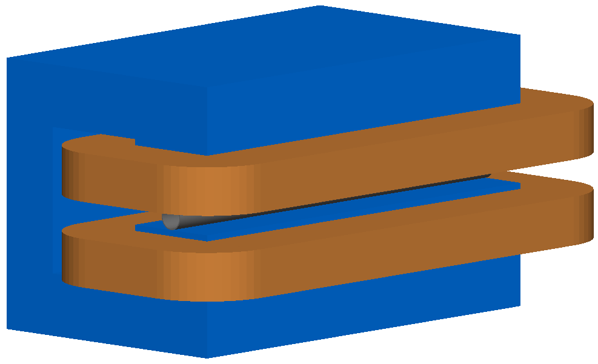

.. |angleFieldComment| replace:: Either the total bending angle, `angle`, or the magnetic field, `B`, (in Tesla)
				 for the nominal beam energy can be specified.
				 If both are defined the magnet is under or over-powered.

`rbend` defines a rectangular bend magnet. |angleFieldComment|
The faces of the magnet are normal to the chord of the
input and output points. It can be specified using:

1) `angle` only - `B` calculated from the angle and the beam design rigidity.
2) `B` only - the angle is calculated from the beam design rigidity.
3) `angle` & `B`  - physically constructed using the angle, and field strength as `B`
   (see also `Component Strength Scaling`_).

Pole face rotations can be applied to both the input and output faces of the
magnet, based upon the reference system shown in the figure below. A pure dipole
field is provided in the beam pipe and a more general dipole (as
described by :ref:`yoke-multipole-field`) is provided for the yoke. A
quadrupolar component can be specified using the `k1` parameter that is given by:

.. math::

   k_{1} = \frac{1}{B \rho}\,\frac{dB_{y}}{dx}\,[m^{-2}]

If `k1` is specified, the integrator from the `bdsimmatrix` integrator set is used. This
results in no physical pole face angle being constructed for tracking purposes. The
tracking still includes the pole face effects.

.. note:: See :ref:`bend-tracking-behaviour` for important notes about dipole tracking.

+-----------------+-----------------------------------+-----------+-----------------+
| Parameter       | Description                       | Default   | Required        |
+=================+===================================+===========+=================+
| `l`             | Chord Length [m]                  | 0         | Yes             |
+-----------------+-----------------------------------+-----------+-----------------+
| `angle`         | Angle [rad]                       | 0         | Yes, and or `B` |
+-----------------+-----------------------------------+-----------+-----------------+
| `B`             | Magnetic field [T]                | 0         | Yes             |
+-----------------+-----------------------------------+-----------+-----------------+
| `e1`            | Input pole face angle [rad]       | 0         | No              |
+-----------------+-----------------------------------+-----------+-----------------+
| `e2`            | Output pole face angle [rad]      | 0         | No              |
+-----------------+-----------------------------------+-----------+-----------------+
| `material`      | Magnet outer material             | Iron      | No              |
+-----------------+-----------------------------------+-----------+-----------------+
| `yokeOnInside`  | Yoke on inside of bend            | 0         | No              |
+-----------------+-----------------------------------+-----------+-----------------+
| `hStyle`        | H style poled geometry            | 0         | No              |
+-----------------+-----------------------------------+-----------+-----------------+
| `k1`            | Quadrupole coefficient for        | 0         | No              |
|                 | function magnet                   |           |                 |
+-----------------+-----------------------------------+-----------+-----------------+
| `fint`          | Fringe field integral for the     | 0         | No              |
|                 | entrance face of the rbend        |           |                 |
+-----------------+-----------------------------------+-----------+-----------------+
| `fintx`         | Fringe field integral for the     | -1        | No              |
|                 | exit face of the rbend. -1 means  |           |                 |
|                 | default to the same as fint. 0    |           |                 |
|                 | there will be no effect.          |           |                 |
+-----------------+-----------------------------------+-----------+-----------------+
| `fintK2`        | Second fringe field integral for  | 0         | No              |
|                 | the entrance face of the rbend    |           |                 |
+-----------------+-----------------------------------+-----------+-----------------+
| `fintxK2`       | Second fringe field integral for  | 0         | No              |
|                 | the exit face of the rbend        |           |                 |
+-----------------+-----------------------------------+-----------+-----------------+
| `hgap`          | The half gap of the poles for     | 0         | No              |
|                 | **fringe field purposes only**    |           |                 |
+-----------------+-----------------------------------+-----------+-----------------+
| `h1`            | Input poleface curvature          | 0         | no              |
|                 | :math:`[m^{-1}]`                  |           |                 |
+-----------------+-----------------------------------+-----------+-----------------+
| `h2`            | Output poleface curvature         | 0         | no              |
|                 | :math:`[m^{-1}]`                  |           |                 |
+-----------------+-----------------------------------+-----------+-----------------+
| `tilt`          | Tilt of magnet [rad]              | 0         | no              |
+-----------------+-----------------------------------+-----------+-----------------+

Notes:

* The :ref:`aperture-parameters` may also be specified.
* The :ref:`magnet-geometry-parameters` may also be specified.

.. note:: In the case that the `lhcleft` or `lhcright` magnet geometry types are used,
	  the yoke field will be a sum of two regular yoke fields at the LHC beam pipe
	  separation. The option :code:`yokeFieldsMatchLHCGeometry` can be used to control
	  this. On by default.

.. figure:: figures/poleface_notation_rbend.pdf
	    :width: 75%
	    :align: center

	    Pole face notation for an rbend.

A few points about rbends:

1) For large angles (> 100 mrad), particles may hit the aperture, as the beam pipe is
   represented by a straight (chord) section and even nominal energy particles
   may hit the aperture, depending on the degree of tracking accuracy specified. In this
   case, consider splitting the `rbend` into multiple ones.
2) The pole face rotation angle is limited to :math:`\pm \pi /4` radians.
3) If a non-zero pole face rotation angle is specified, the element preceding / succeeding
   the rotated magnet face must either be a drift or an rbend with opposite rotation (e.g. an rbend with
   :math:`e2 = 0.1` can be followed by an rbend with :math:`e1 = -0.1`). The preceding / succeeding
   element must be longer than the projected length from the rotation, given by
   :math:`2 \tan(\mathrm{eX})`.
4) Fringe field kicks are applied in a thin fringe field magnet (0.1 micron thick by default) at the beginning
   or at the end of the rbend. The length of the fringe field element can be
   set by the option `thinElementLength` (see :ref:`bdsim-options`) but is an advanced option.
5) In the case of finite `fint` or `fintx` and `hgap`, a fringe field is used even
   if `e1` and `e2` have no angle.
6) The `fintK2` and `fintxK2` parameters are for a second fringe field correction term that are included to
   enable optics comparisons with TRANSPORT. Whilst this term is not available in MAD-X, the default values
   of 0 mean this second fringe field correction will not be applied unless `fintK2` or `fintxK2` are
   explicitly specified as non-zero.
7) The effect of pole face rotations and fringe field kicks can be turned off for all dipoles by setting
   the option `includeFringeFields=0` (see :ref:`bdsim-options`).
8) The poleface curvature does not construct the curved geometry. The effect is instead applied in the thin
   fringefield magnet.
9) rbends are limited in angle to less than :math:`\pi/2`.
10) A positive `tilt` angle corresponds to a clockwise rotation when looking along the beam direction as
    we use a right-handed coordinate system. A positive tilt angle of :math:`\pi/2` for an rbend with a
    positive bending angle will produce a vertical bend where the beam is bent downwards.
11) The sign of the pole face rotations do not change when flipping the sign of the magnet bending angle. This
    is to match the behaviour of MAD-X; i.e. a positive pole face angle reduces the length of the outer side of
    the bend (the side furthest from the centre of curvature).

Examples: ::

   MRB20: rbend, l=3*m, angle=0.003;
   r1: rbend, l=5.43m, beampipeRadius=10*cm, B=2*Tesla;
   RB04: rbend, l=1.8*m, angle=0.05, e1=0.1, e2=-0.1

sbend
^^^^^

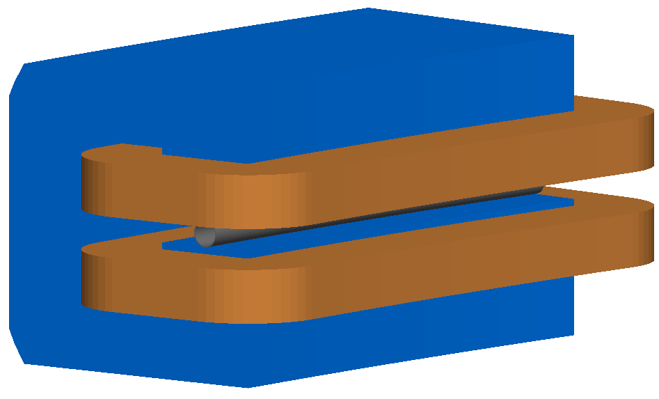

`sbend` defines a sector bend magnet. |angleFieldComment|
The faces of the magnet are normal to the curvilinear coordinate
system. It can be specified using:

1) `angle` only - `B` calculated from the angle and the beam design rigidity.
2) `B` only - the angle is calculated from the beam design rigidity.
3) `angle` & `B`  - physically constructed using the angle, and field strength as `B`
   (see also `Component Strength Scaling`_).

Pole face rotations can be applied to both the input and output faces of the magnet,
based upon the reference system shown in the figure below. A pure dipole field is
provided in the beam pipe and a more general dipole (as described by
:ref:`yoke-multipole-field`) is provided for the yoke. A quadrupolar component can
be specified using the `k1` parameter that is given by:

.. math::

   k_{1} = \frac{1}{B \rho}\,\frac{dB_{y}}{dx}\,[m^{-2}]

If `k1` is specified, the integrator from `bdsimmatrix` integrator set is used. This
results in no physical pole face angle being constructed for tracking purposes. The
tracking still includes the pole face effects.

The `sbend` geometry is constructed as many small straight sections with angled faces. This
makes no effect on tracking, but allows a much higher variety of apertures and magnet
geometry to be used given the Geant4 geometry. The number of segments is computed such
that the maximum tangential error in the aperture is 1 mm.

With the default integrator set, the pole face rotations are not built into the geometry
such that the tracking will match MADX. If you use the :code:`geant4` integrator set,
the pole face geometry will be built fully.

.. note:: See :ref:`bend-tracking-behaviour` for important notes about dipole tracking.

+-----------------+-----------------------------------+-----------+-----------------+
| Parameter       | Description                       | Default   | Required        |
+=================+===================================+===========+=================+
| `l`             | Arc length [m]                    | 0         | Yes             |
+-----------------+-----------------------------------+-----------+-----------------+
| `angle`         | Angle [rad]                       | 0         | Yes, and or `B` |
+-----------------+-----------------------------------+-----------+-----------------+
| `B`             | Magnetic field [T]                | 0         | Yes             |
+-----------------+-----------------------------------+-----------+-----------------+
| `e1`            | Input pole face angle [rad]       | 0         | No              |
+-----------------+-----------------------------------+-----------+-----------------+
| `e2`            | Output pole face angle [rad]      | 0         | No              |
+-----------------+-----------------------------------+-----------+-----------------+
| `material`      | Magnet outer material             | Iron      | No              |
+-----------------+-----------------------------------+-----------+-----------------+
| `yokeOnInside`  | Yoke on inside of bend            | 0         | No              |
+-----------------+-----------------------------------+-----------+-----------------+
| `hStyle`        | H style poled geometry            | 0         | No              |
+-----------------+-----------------------------------+-----------+-----------------+
| `k1`            | Quadrupole coefficient for        | 0         | No              |
|                 | function magnet                   |           |                 |
+-----------------+-----------------------------------+-----------+-----------------+
| `fint`          | Fringe field integral for the     | 0         | No              |
|                 | entrance face of the sbend        |           |                 |
+-----------------+-----------------------------------+-----------+-----------------+
| `fintx`         | Fringe field integral for the     | -1        | No              |
|                 | exit face of the sbend. -1 means  |           |                 |
|                 | default to the same as fint. 0    |           |                 |
|                 | there will be no effect.          |           |                 |
+-----------------+-----------------------------------+-----------+-----------------+
| `fintK2`        | Second fringe field integral for  | 0         | No              |
|                 | the entrance face of the sbend    |           |                 |
+-----------------+-----------------------------------+-----------+-----------------+
| `fintxK2`       | Second fringe field integral for  | 0         | No              |
|                 | the exit face of the sbend        |           |                 |
+-----------------+-----------------------------------+-----------+-----------------+
| `hgap`          | The half gap of the poles for     | 0         | No              |
|                 | **fringe field purposes only**    |           |                 |
+-----------------+-----------------------------------+-----------+-----------------+
| `h1`            | Input poleface curvature          | 0         | no              |
|                 | :math:`[m^{-1}]`                  |           |                 |
+-----------------+-----------------------------------+-----------+-----------------+
| `h2`            | Output poleface curvature         | 0         | no              |
|                 | :math:`[m^{-1}]`                  |           |                 |
+-----------------+-----------------------------------+-----------+-----------------+
| `tilt`          | Tilt of magnet [rad]              | 0         | no              |
+-----------------+-----------------------------------+-----------+-----------------+

Notes:

* The :ref:`aperture-parameters` may also be specified.
* The :ref:`magnet-geometry-parameters` may also be specified.

.. note:: In the case that the `lhcleft` or `lhcright` magnet geometry types are used,
	  the yoke field will be a sum of two regular yoke fields at the LHC beam pipe
	  separation. The option :code:`yokeFieldsMatchLHCGeometry` can be used to control
	  this. On by default.

.. figure:: figures/poleface_notation_sbend.pdf
	    :width: 75%
	    :align: center

	    Pole face notation for an sbend.

A few points about sbends:

1) The pole face rotation angle is limited to :math:`\pm \pi /4` radians.
2) If a non-zero pole face rotation angle is specified, the element preceding / succeeding
   the rotated magnet face must either be a drift or an sbend with the opposite rotation
   (e.g. an sbend with :math:`e2 = 0.1` can be followed by an sbend with
   :math:`e1 = -0.1`). The preceding / succeeding element must be longer than
   the projected length from the rotation, given by :math:`2 \tan(\mathrm{eX})`.
3) Fringe field kicks are applied in a thin fringe field magnet (0.1 micron thick by default) at the beginning
   or at the end of the sbend. The length of the fringe field magnet can be
   set by the option `thinElementLength` (see :ref:`bdsim-options`).
4) In the case of finite `fint` or `fintx` and `hgap` a fringe field is used even
   if `e1` and `e2` have no angle.
5) The `fintK2` and `fintxK2` parameters are for a second fringe field correction term that are included to
   enable optics comparisons with TRANSPORT. Whilst this term is not available in MAD-X, the default values
   of 0 mean this second fringe field correction will not be applied unless `fintK2` or `fintxK2` are
   explicitly specified as non-zero.
6) The effect of pole face rotations and fringe field kicks can be turned off for all dipoles by setting
   the option `includeFringeFields=0` (see :ref:`bdsim-options`).
7) The poleface curvature does not construct the curved geometry. The effect is instead applied in the thin
   fringefield magnet.
8) Sbends are limited in angle to less than :math:`2\pi`. If the sbends are not split with the
   option :code:`dontSplitSBends`, an sbend will be limited in angle to a maximum of :math:`\pi/2`.
9) A positive `tilt` angle corresponds to a clockwise rotation when looking along the beam direction as
   we use a right-handed coordinate system. A positive tilt angle of :math:`\pi/2` for an sbend with a
   positive bending angle will produce a vertical bend where the beam is bent downwards.
10) The sign of the pole face rotations do not change when flipping the sign of the magnet bending angle. This
    is to match the behaviour of MAD-X; i.e. a positive pole face angle reduces the length of the outer side of
    the bend (the side furthest from the centre of curvature).

Examples: ::

   s1: sbend, l=14.5*m, angle=0.005, magnetGeometryType="lhcright";
   mb201x: sbend, l=304.2*cm, b=1.5*Tesla;
   SB17A: sbend, l=0.61*m, angle=0.016, e1=-0.05, e2=0.09

quadrupole
^^^^^^^^^^

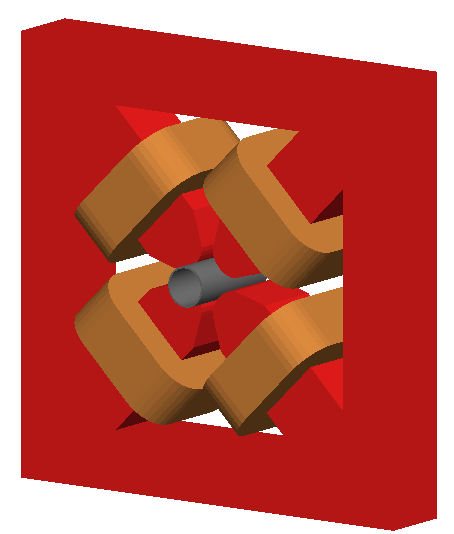

`quadrupole` defines a quadrupole magnet. The strength parameter :math:`k_1` is defined as

.. math::

   k_{1} = \frac{1}{B \rho}\,\frac{dB_{y}}{dx}\,[m^{-2}]

================  ===========================  ==========  ===========
Parameter         Description                  Default     Required
`l`               Length [m]                   0           Yes
`k1`              Quadrupole coefficient       0           Yes
`material`        Magnet outer material        Iron        No
================  ===========================  ==========  ===========

Notes:

* The :ref:`aperture-parameters` may also be specified.
* The :ref:`magnet-geometry-parameters` may also be specified.
* See `Magnet Strength Polarity`_ for polarity notes.
* If `lhcright` or `lhcleft` magnet geometry types are used the yoke field is a sum of two
  as described in :ref:`fields-multipole-outer-lhc`.

A pure quadrupolar field is provided in the beam pipe and a more general multipole (as
described by :ref:`yoke-multipole-field`) is provided for the yoke.

Examples: ::

   q1: quadrupole, l=0.3*m, k1=45.23;
   qm15ff: quadrupole, l=20*cm, k1=95.2;

sextupole
^^^^^^^^^

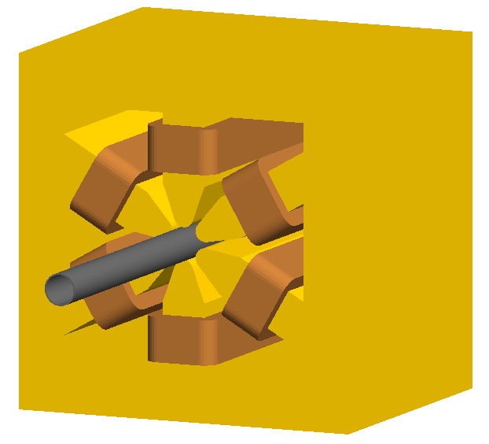

`sextupole` defines a sextupole magnet. The strength parameter :math:`k_2` is defined as

.. math::

   k_{2} = \frac{1}{B \rho}\,\frac{d^{2}B_{y}}{dx^{2}}\,[m^{-3}]

================  ===========================  ==========  ===========
Parameter         Description                  Default     Required
`l`               Length [m]                   0           Yes
`k2`              Sextupole coefficient        0           Yes
`material`        Magnet outer material        Iron        No
================  ===========================  ==========  ===========

Notes:

* The :ref:`aperture-parameters` may also be specified.
* The :ref:`magnet-geometry-parameters` may also be specified.
* See `Magnet Strength Polarity`_ for polarity notes.
* If `lhcright` or `lhcleft` magnet geometry types are used the yoke field is a sum of two
  as described in ref:`fields-multipole-outer-lhc`.

A pure sextupolar field is provided in the beam pipe and a more general multipole (as
described by :ref:`yoke-multipole-field`) is provided for the yoke.

Examples: ::

   sx1: sextupole, l=0.5*m, k2=4.678;
   sx2: sextupole, l=20*cm, k2=45.32;

octupole
^^^^^^^^

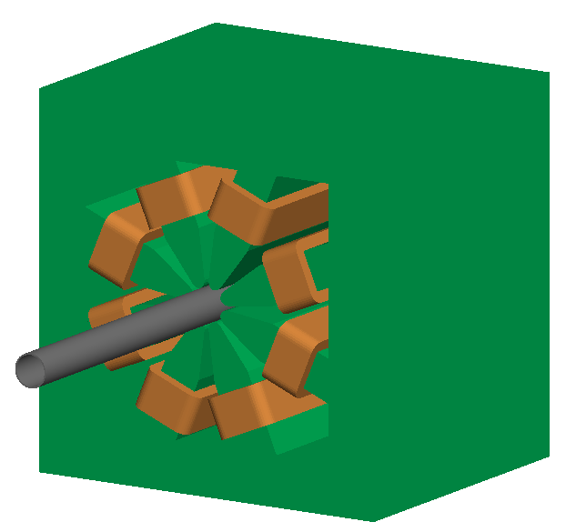

`octupole` defines an octupole magnet. The strength parameter :math:`k_3` is defined as

.. math::

   k_{3} = \frac{1}{B \rho}\,\frac{d^{3}B_{y}}{dx^{3}}\,[m^{-4}]

================  ===========================  ==========  ===========
Parameter         Description                  Default     Required
`l`               Length [m]                   0           Yes
`k3`              Octupole coefficient         0           Yes
`material`        Magnet outer material        Iron        No
================  ===========================  ==========  ===========

Notes:

* The :ref:`aperture-parameters` may also be specified.
* The :ref:`magnet-geometry-parameters` may also be specified.
* See `Magnet Strength Polarity`_ for polarity notes.

A pure octupolar field is provided in the beam pipe and a more general multipole (as
described by :ref:`yoke-multipole-field`) is provided for the yoke.

Examples: ::

   oct4b: octupole, l=0.3*m, k3=32.9;

decapole
^^^^^^^^

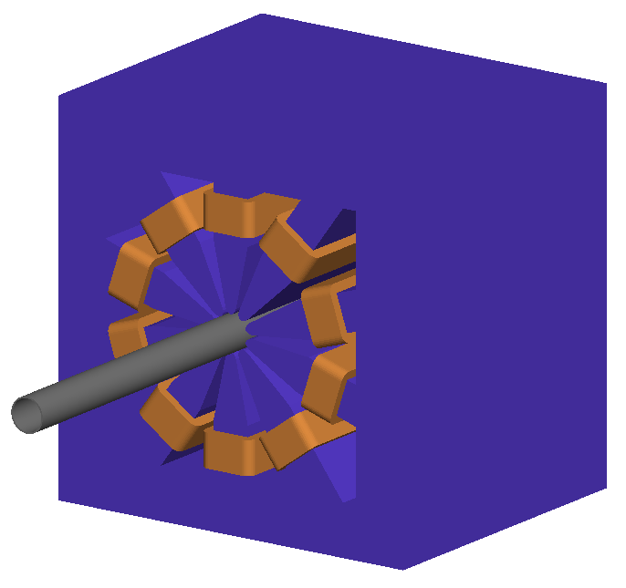

`decapole` defines a decapole magnet. The strength parameter :math:`k_4` is defined as

.. math::

   k_{4} = \frac{1}{B \rho}\,\frac{d^{4}B_{y}}{dx^{4}}\,[m^{-5}]

================  ===========================  ==========  ===========
Parameter         Description                  Default     Required
`l`               Length [m]                   0           Yes
`k4`              Decapole coefficient         0           Yes
`material`        Magnet outer material        Iron        No
================  ===========================  ==========  ===========

A pure decapolar field is provided in the beam pipe and a more general multipole (as
described by :ref:`yoke-multipole-field`) is provided for the yoke.

* The :ref:`aperture-parameters` may also be specified.
* The :ref:`magnet-geometry-parameters` may also be specified.
* See `Magnet Strength Polarity`_ for polarity notes.

Examples: ::

   MXDEC3: decapole, l=0.3*m, k4=32.9;

multipole
^^^^^^^^^

`multipole` defines a general multipole magnet. The strength parameter
:math:`knl` is a list defined as

.. math::

   knl[n] = \frac{1}{B \rho} \frac{d^{n}B_{y}}{dx^{n}}\,[m^{-(n+1)}]

starting with the **quadrupole** component. The skew strength parameter :math:`ksl`
is a list representing the skew coefficients.

================  ===========================  ==========  ===========
Parameter         Description                  Default     Required
`l`               Length [m]                   0           Yes
`knl`             List of normal coefficients  0           No
`ksl`             List of skew coefficients    0           No
`material`        Magnet outer material        Iron        No
================  ===========================  ==========  ===========

Notes:

* The values for `knl` and `ksl` are 1-counting, i.e. the first number is the order 1 component,
  which is the quadrupole coefficient.
* The :ref:`aperture-parameters` may also be specified.
* The :ref:`magnet-geometry-parameters` may also be specified.
* See `Magnet Strength Polarity`_ for polarity notes.
* No yoke field is provided.

Examples: ::

   OCTUPOLE1 : multipole, l=0.5*m , knl={ 0,0,1 } , ksl={ 0,0,0 };
   QUADRUPOLE1: multipole, l=20*cm, knl={2.3};

.. note:: If a multipole has a length equal to zero, it will be converted in a `thinmultipole`_.

thinmultipole
^^^^^^^^^^^^^

`thinmultipole` is the same as multipole, but is set to have a default length of 0.1 micron.
For thin multipoles, the length parameter is not required. The element will appear as a thin length of drift
tube. A thin multipole can be placed next to a bending magnet with finite pole face rotation angles.

* `knl` and `ksl` are the same as the thick multiple documented above.  See `multipole`_.

Examples: ::

   THINOCTUPOLE1 : thinmultipole , knl={ 0,0,1 } , ksl={ 0,0,0 };

.. note:: The length of the thin multipole can be changed by setting `thinElementLength` (see :ref:`bdsim-options`).

vkicker
^^^^^^^

`vkicker` can either be a thin or thick vertical dipole magnet. If specified
with a finite length :code:`l`, it will be constructed as a thick dipole. However, if no length (or
a length of exactly 0 is specified), a thin kicker will be built. In practice, the thin version is
constructed as a 0.1um slice with only the aperture geometry and no surrounding geometry and is not
visible with the default visualisation settings.

The strength is specified by the parameter :code:`vkick`, which is the fractional momentum kick
in the vertical direction. A positive value corresponds to an increase in :math:`p_y`. In the
case of the thin kicker the position is not affected, whereas with the thick kicker, the position
will change.

The strength may also be specified by the magnetic field :code:`B`. A positive field value corresponds
to an increase in :math:`p_y` for a positively charged particle.

.. warning:: :code:`vkick` will supersede the strength even if :code:`B` is specified. Therefore, the
	     user should specify only :code:`vkick` or :code:`B`.

In the case of a thick vertical kicker, the resulting bending angle is calculated using:

.. math::

   \theta = \sin^{-1}(\,p_y),

where :math:`p_y` is the fractional change in vertical momentum. The dipole field strength is
then calculated with respect to the chord length:

.. math::

   \mathbf{B} = B\rho\, \frac{\theta}{\mathrm{chord\,length}}

For thin kickers, the magnetic field :code:`B` is ignored and the element is treated as a drift.

* The :ref:`aperture-parameters` may also be specified.
* For a vkicker with a finite length, the :ref:`magnet-geometry-parameters` may also be specified.

.. note:: Pole face rotations and fringe fields can be applied to vkickers by supplying the same
      parameters that would be applied to an `rbend`_ or `sbend`_ . If the vkicker is zero length,
      the B field value must be supplied in order to calculate the bending radius which required
      to apply the effects correctly.

* Fringe field kicks are applied in a thin fringe field magnet (0.1 micron thick by default) at the
  beginning or at the end of the vkicker. The length of the fringe field element can be set by the
  option `thinElementLength` (see :ref:`bdsim-options`).
* For zero length vkickers, the pole face and fringe field kicks are applied in the same thin element
  as the vkick.
* In the case of finite fint or fintx and hgap, a fringe field is used even if e1 and e2 have no angle.
* The effect of pole face rotations and fringe field kicks can be turned off for all magnets by setting
  the option `includeFringeFields=0` (see :ref:`bdsim-options`).
* No pole face geometry is constructed.

A pure dipole field is provided in the beam pipe and a more general multipole (as
described by :ref:`yoke-multipole-field`) is provided for the yoke.

Examples: ::

   KX15v: vkicker, vkick=1.3e-5;
   KX17v: vkicker, vkick=-2.4e-2, l=0.5*m;
   KX18v: vkicker, B=0.04*T;

hkicker
^^^^^^^

`hkicker` can either be a thin horizontal kicker or a thick horizontal dipole magnet. If
specified with a finite length :code:`l`, it will be constructed as a dipole. However, if no length (or
a length of exactly 0) is specified, a thin kicker will be built. This is typically a 0.1um slice
with only the shape of the aperture and no surrounding geometry. It is also typically not
visible with the default visualisation settings.

The strength is specified by the parameter :code:`hkick`, which is the fractional momentum kick
in the vertical direction. A positive value corresponds to an increase in :math:`p_x`. In the
case of the thin kicker the position is not affected, whereas with the thick kicker, the position
will change.

The strength may also be specified by the magnetic field :code:`B`. A positive field value corresponds
to an decrease in :math:`p_x` (note right-handed coordinate frame) for a positively charged particle.

.. warning:: :code:`hkick` will supersede the strength even if :code:`B` is specified. Therefore, the
	     user should specify only :code:`hkick` or :code:`B`.

.. note:: A positive value of `hkick` causes an increase in horizontal momentum, so the particle
	  will bend to the left looking along the beam line, i.e. in positive `x`. This is
	  the opposite of a bend where a positive *angle* causes a deflection in negative
	  `x`.

For thin kickers, the magnetic field :code:`B` is ignored and the element is treated as a drift.

* The :ref:`aperture-parameters` may also be specified.
* For a hkicker with a finite length, the :ref:`magnet-geometry-parameters` may also be specified.

.. note:: Pole face rotations and fringe fields can be applied to hkickers by supplying the same
      parameters that would be applied to an `rbend`_ or `sbend`_ . If the hkicker is zero length,
      the B field value must be supplied in order to calculate the bending radius which required
      to apply the effects correctly.

* Fringe field kicks are applied in a thin fringe field magnet (0.1 micron thick by default) at the
  beginning or at the end of the hkicker. The length of the fringe field element can be set by the
  option `thinElementLength` (see :ref:`bdsim-options`).
* For zero length hkickers, the pole face and fringe field kicks are applied in the same thin element
  as the hkick.
* In the case of finite fint or fintx and hgap, a fringe field is used even if e1 and e2 have no angle.
* The effect of pole face rotations and fringe field kicks can be turned off for all magnets by setting
  the option `includeFringeFields=0` (see :ref:`bdsim-options`).
* No pole face geometry is constructed.

A pure dipole field is provided in the beam pipe and a more general multipole (as
described by :ref:`yoke-multipole-field`) is provided for the yoke.

Examples: ::

   KX17h: hkicker, hkick=0.01;
   KX19h: hkicker, hkick=-1.3e-5, l=0.2*m;
   KX21h: hkicker, B=0.03*T;

kicker
^^^^^^

`kicker` defines a combined horizontal and vertical kicker.  Either both or one of the
parameters `hkick` and `vkick` may be specified. Like the `hkicker` and `vkicker`, this
may also be thin or thick. In the case of the thick kicker, the field is the linear
sum of two independently calculated fields.

.. note:: Pole face rotation and fringe fields kicks are unavailable for plain kickers

Example::

  kick1: kicker, l=0.45*m, hkick=1.23e-4, vkick=0.3e-4;

tkicker
^^^^^^^

BDSIM, like MAD-X, provides a `tkicker` element. This is an alias in BDSIM for a `kicker`_,
however MAD-X differentiates the two on the basis of fitting parameters. BDSIM does
not make this distinction. See `kicker`_ for more details.

In the case of a `tkicker`, the field :code:`B` cannot be used and only `hkick` and `vkick`
can be used.

.. note:: Pole face rotation and fringe fields kicks are unavailable for tkickers

.. _component-rf:
	  
rf
^^^^

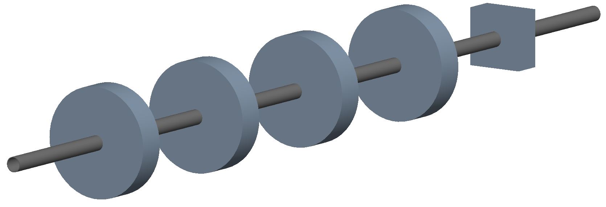

`rf` or `rfcavity` defines an RF cavity with a time varying electric or electromagnetic field.
There are several geometry and field options as well as ways to specify the strength.
The default field is a uniform (in space) electric-only field that is time varying
according to a cosine (see :ref:`field-sinusoid-efield`).  Optionally, the electromagnetic
field for a pill-box cavity may be used (see :ref:`field-pill-box`). The `G4ClassicalRK4`
numerical integrator is used to calculate the motion of particles in both cases. Fringes for
the edge effects are provided by default and are controllable with the option `includeFringeFieldsCavities`.

.. tabularcolumns:: |p{4cm}|p{4cm}|p{2cm}|p{2cm}|

+----------------+-------------------------------+--------------+---------------------+
| **Parameter**  | **Description**               | **Default**  | **Required**        |
+================+===============================+==============+=====================+
| `l`            | Length [m]                    | 0            | Yes                 |
+----------------+-------------------------------+--------------+---------------------+
| `E`            | Voltage [V] that will be      | 0            | Yes (or `gradient`) |
|                | across the length `l`         |              |                     |
+----------------+-------------------------------+--------------+---------------------+
| `gradient`     | Electric field [V/m]          | 0            | Yes (or `E`)        |
+----------------+-------------------------------+--------------+---------------------+
| `frequency`    | Frequency of oscillation (Hz) | 0            | Yes                 |
+----------------+-------------------------------+--------------+---------------------+
| `phase`        | Phase offset (rad)            | 0            | No                  |
+----------------+-------------------------------+--------------+---------------------+
| `tOffset`      | Offset in global time (s)     | 0            | No                  |
+----------------+-------------------------------+--------------+---------------------+
| `material`     | Outer material                | ""           | Yes                 |
+----------------+-------------------------------+--------------+---------------------+
| `cavityModel`  | Name of cavity model object   | ""           | No                  |
+----------------+-------------------------------+--------------+---------------------+

Either :code:`gradient` or :code:`E` should be specified. :code:`E` (the *voltage*) is given in Volts,
and internally is divided by the length of the element (:code:`l`) to give the electric
field in Volts/m. If :code:`gradient` is specified, this is already Volts/m and the length
is not involved. The slight misnomer of `E` instead of say `voltage` is historical.

**Units** Since the value of `m` as a unit in GMAD is 1.0, it doesn't practically make a
difference whether you write :code:`gradient=10*MV/m` or :code:`gradient=10*MV`. However,
it is best to be explicit in units or none at all and assume the default ones.

.. note:: The design energy of the machine is affected by the accelerator (or decceleration)
          and the nominal rigidity used to calculate fields from normalised strenghts
          such as :code:`k1` for a quadrupole will be updated accordingly. This is the
          default behaviour since v1.8.0 and can be turned off with
          :code:`option, integrateKineticEnergyAlongBeamline=0;`.

.. warning:: The elliptical cavity geometry may not render or appear in the Geant4
	     QT visualiser.  The geometry exists and is valid, but this is due to
	     deficiencies of the Geant4 visualisation system. The geometry exists
	     and is fully functional.

* The field is such that a positive E-field results in acceleration of the primary particle
  (depending on the primary particle charge).
* The global synchronous time at the centre of the element is calculated automatically
  such that zero phase results in the peak E-field at the centre of the component
  for its position in the lattice.
* Either `tOffset` or `phase` may be used to specify the phase of the oscillator.
* If `phase` is specified, this is added to the calculated synchronous (global) phase from
  either the lattice position or `tOffset`.
* The material must be specified in the `rf` gmad element or in the attached cavity model
  by name. The cavity model will override the element material.
* The entrance / exit cavity fringes are not constructed if the previous / next element
  is also an rf cavity.
* The cavity fringe element is by default the same radius as the beam pipe radius. If a cavity
  model is supplied, the cavity fringes are built with the same radius as the model iris radius.
* The step length in the cavity is limited for all particles to be 2.5% of the minimum
  of the element length and the wavelength (given the frequency). In the case of 0 frequency,
  only the length is considered. This is to ensure accurate numerical integration of the
  motion through the varying field.
* If `tOffset` is specified, a phase offset is calculated from this and the frequency provided.
* In the case where `frequency` is not set and therefore 0, the field is multiplied by the
  cosine of the phase. See the developer documentation :ref:`field-sinusoid-efield` for a
  description of the field.

Simple examples: ::

   rf1: rf, l=10*cm, E=10*MV, frequency=90*MHz, phase=0.02;
   rf2: rf, l=10*cm, gradient=14*MV/m, frequency=450*MHz;
   rf3: rf, l=10*cm, E=10*MV, frequency=90*MHz, tOffset=3.2*ns;

Rather than just a simple E-field, an electromagnetic field that is the solution to
a cylindrical pill-box cavity may be used. A cavity object (described in more detail
below) is used to specify the field type. All other cavity parameters may be safely ignored
and only the field type will be used. The field is described in :ref:`field-pill-box`.

Pill-box field example::

  rffield: field, type="rfcavity";
  rf4: rf, l=10*cm, E=2*kV, frequency=1.2*GHz, fieldVacuum="rffield";

Elliptical SRF cavity geometry is also provided and may be specified by use of another
'cavity' object in the parser. This cavity object can then be attached to an `rf`
object by name. Details can be found in :ref:`cavity-geometry-parameters`.

.. _component-rfx-rfy:

rfx \& rfy
^^^^^^^^^^

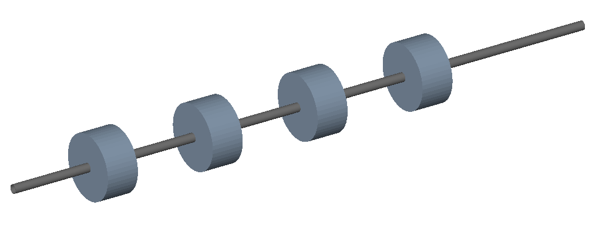

`rfx` or `rfy` define an RF cavity with a time varying electric (only) field that is transverse
to the S direction the accelerator is built along. Particularly, for `rfx` it is in the local
`x` direction and for `rfy` it is in the local `y` direction. The cavity will look like a cylindrical
pillbox cavity much the same way as `rf`.

* A positive `gradient` or field value causes a positive deflection in that direction.
* Only `gradient` can be specified because if we specify voltage only, we need the length
  to calculate a gradient for the electric field and the exact width of the cavity can be
  ambiguous given a combination of parameters.

.. tabularcolumns:: |p{4cm}|p{4cm}|p{2cm}|p{2cm}|
  
+----------------+-------------------------------+--------------+---------------------+
| **Parameter**  | **Description**               | **Default**  | **Required**        |
+================+===============================+==============+=====================+
| `l`            | Length [m]                    | 0            | Yes                 |
+----------------+-------------------------------+--------------+---------------------+
| `gradient`     | Electric field [V/m]          | 0            | Yes                 |
+----------------+-------------------------------+--------------+---------------------+
| `frequency`    | Frequency of oscillation (Hz) | 0            | Yes                 |
+----------------+-------------------------------+--------------+---------------------+
| `phase`        | Phase offset (rad)            | 0            | No                  |
+----------------+-------------------------------+--------------+---------------------+
| `tOffset`      | Offset in time (s)            | 0            | No                  |
+----------------+-------------------------------+--------------+---------------------+
| `material`     | Outer material                | ""           | Yes                 |
+----------------+-------------------------------+--------------+---------------------+

See :ref:`component-rf` for details about `phase` and `tOffset`. The field is the same
as :ref:`field-sinusoid-efield`, but pointing transversely.

Examples: ::

  rf1: rfx, l=20*cm, gradient=12*MV / m, frequency=450*MHz;

target
^^^^^^

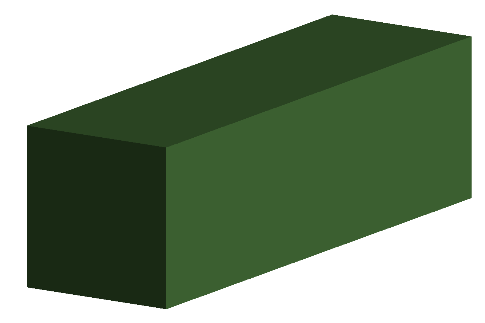

A `target` defines a block of 1 material. By default, a square shape is used but a
circular one can also be used. A target can be achieved similarly with an `rcol`
with no `xsize` or `ysize` specified.

.. tabularcolumns:: |p{4cm}|p{4cm}|p{2cm}|p{2cm}|

+------------------------+-----------------------------------+----------------+---------------+
| **Parameter**          | **Description**                   | **Default**    | **Required**  |
+========================+===================================+================+===============+
| `l`                    | Length [m]                        | 0              | Yes           |
+------------------------+-----------------------------------+----------------+---------------+
| `material`             | Outer material                    | None           | Yes           |
+------------------------+-----------------------------------+----------------+---------------+
| `horizontalWidth`      | Outer full width [m]              | 0.5 m          | No            |
+------------------------+-----------------------------------+----------------+---------------+
| `colour`               | Name of colour desired for block  | ""             | No            |
|                        | See :ref:`colours`                |                |               |
+------------------------+-----------------------------------+----------------+---------------+
| `minimumKineticEnergy` | Minimum kinetic energy below      | 0              | No            |
|                        | which to artificially kill        |                |               |
|                        | particles in this target only     |                |               |
+------------------------+-----------------------------------+----------------+---------------+
| `apertureType`         | Temporarily used to describe the  | "rectangular"  | No            |
|                        | outer shape - only "circular" or  |                |               |
|                        | "rectangular" are accepted        |                |               |
+------------------------+-----------------------------------+----------------+---------------+

* In future, `apertureType` will not be used to control the outer shape and any
  shape will be possible.

rcol
^^^^

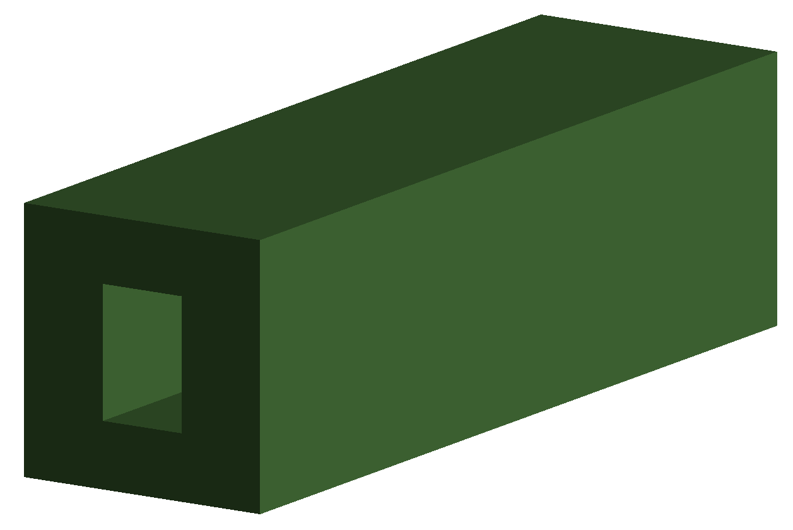

An `rcol` defines a rectangular collimator. The aperture is rectangular and the external
volume is square.

* If no `xsize` or `ysize` are provided, they are assumed to be 0 and **a solid block** is made.

.. tabularcolumns:: |p{4cm}|p{4cm}|p{2cm}|p{2cm}|

+------------------------+-----------------------------------+----------------+---------------+
| **Parameter**          | **Description**                   | **Default**    | **Required**  |
+========================+===================================+================+===============+
| `l`                    | Length [m]                        | 0              | Yes           |
+------------------------+-----------------------------------+----------------+---------------+
| `xsize`                | Horizontal half aperture [m]      | 0              | Yes           |
+------------------------+-----------------------------------+----------------+---------------+
| `ysize`                | Vertical half aperture [m]        | 0              | Yes           |
+------------------------+-----------------------------------+----------------+---------------+
| `material`             | Outer material                    | None           | Yes           |
+------------------------+-----------------------------------+----------------+---------------+
| `horizontalWidth`      | Outer full width [m]              | 0.5 m          | No            |
+------------------------+-----------------------------------+----------------+---------------+
| `xsizeOut`             | Horizontal exit half aperture [m] | `xsize` value  | No            |
+------------------------+-----------------------------------+----------------+---------------+
| `ysizeOut`             | Vertical exit half aperture [m]   | `ysize` value  | No            |
+------------------------+-----------------------------------+----------------+---------------+
| `colour`               | Name of colour desired for block  | ""             | No            |
|                        | See :ref:`colours`                |                |               |
+------------------------+-----------------------------------+----------------+---------------+
| `minimumKineticEnergy` | Minimum kinetic energy below      | 0              | No            |
|                        | which to artificially kill        |                |               |
|                        | particles in this collimator only |                |               |
+------------------------+-----------------------------------+----------------+---------------+

Notes: 

* `horizontalWidth` should be big enough to encompass the xsize and ysize.
* The parameter `minimumKineticEnergy` (in GeV by default) may be specified to artificially kill
  particles below this kinetic energy in the collimator. This is useful to match other simulations
  where collimators can be assumed to be infinite absorbers. If this behaviour is required, the
  user should specify an energy greater than the total beam energy.
* The collimator can be tapered by specifying an exit aperture size with `xsizeOut` and
  `ysizeOut`, with the `xsize` and `ysize` parameters defining the entrance aperture.
* All collimators can be made infinite absorbers with the general option
  :code:`collimatorsAreInfiniteAbsorbers` (see :ref:`options-tracking`).

Examples: ::

   ! Standard
   TCP15: rcol, l=1.22*m, material="graphite", xsize=104*um, ysize=5*cm;

   ! Tapered
   TCP16: rcol, l=1.22*m, material="graphite", xsize=104*um, ysize=5*cm, xsizeOut=208*um, ysizeOut=10*cm;
   ! with kinetic energy limit
   TCP6CD: rcol, l=0.6*m, material="C", xsize=200*um, ysize=5*cm, minimumKineticEnergy=10*MeV;

.. note:: The outer shape of an rcol can be made circular by defining :code:`apertureType="circular"` for
	  that specific element. This is a temporary facility and may cause overlaps if the
	  :code:`horizontalWidth` parameter is smaller than the radius from the `xsize` and `ysize`
	  parameters. In future this will be improved and generalised for any inner and outer shape. No
	  other outer shapes are supported just now.

Example: ::

  r1: rcol, l=1*m, material="Cu", xsize=10*mm, ysize=3*mm, apertureType="circular", horizontalWidth=10*cm;
   

ecol
^^^^

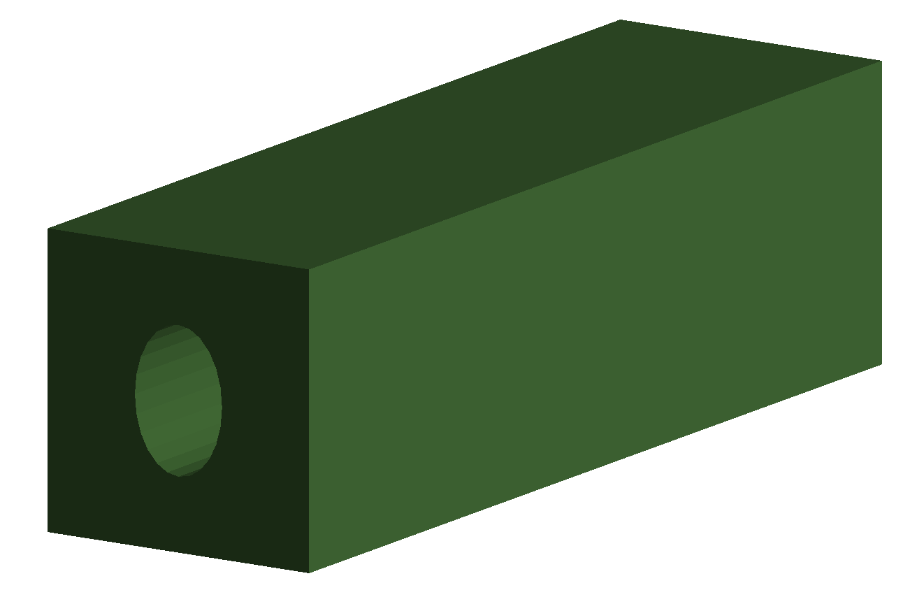

`ecol` defines an elliptical collimator. This is exactly the same as `rcol` except that
the aperture is elliptical and the `xsize` and `ysize` define the horizontal and vertical
**half-axes** respectively.

* A circular aperture collimator can be achieved by setting `xsize` and `ysize` to the
  same value.
* When tapered, the ratio between the horizontal and vertical half-axes of the entrance
  aperture (`xsize` and `ysize`) **must** be the same ratio for the exit aperture (`xsizeOut` and `ysizeOut`).
* All the same conditions for `rcol` apply for `ecol`.

jcol
^^^^

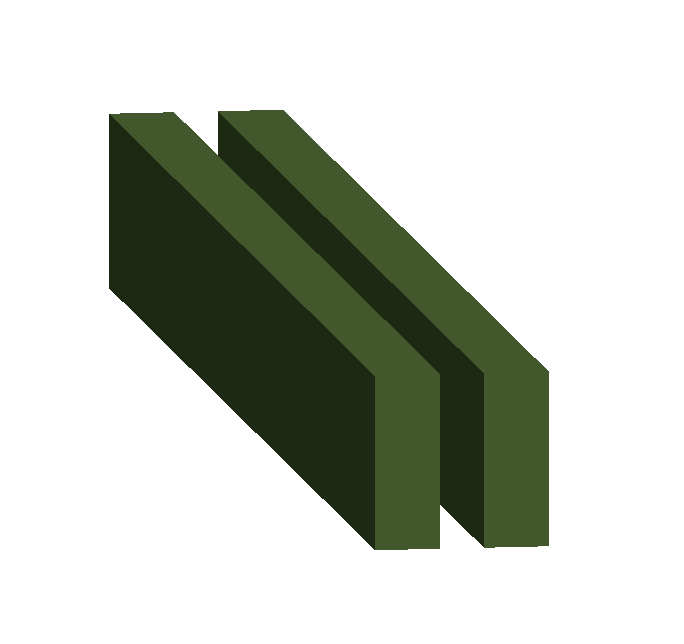

`jcol` defines a jaw collimator with two square blocks on either side in the horizontal plane.
If a vertical `jcol` is required, the `tilt` parameter should be used to rotate it by :math:`\pi/2`.
The horizontal position of each jaw can be set separately with the `xsizeLeft` and `xsizeRight`
apertures which are the distances from the centre of element to the left and right jaws respectively.
The collimator jaws can be individually tilted in a plane perpendicular to the jaw opening plane with the
`jawTiltLeft` and `jawTiltRight` arguments. In this case, the set aperture is in the middle of the collimator.
This feature can be useful for example in aligning the jaws to the beam envelope.

.. tabularcolumns:: |p{4cm}|p{4cm}|p{2cm}|p{2cm}|

+------------------------+-----------------------------------+----------------+---------------+
| **Parameter**          | **Description**                   | **Default**    | **Required**  |
+========================+===================================+================+===============+
| `l`                    | Length [m]                        | 0              | Yes           |
+------------------------+-----------------------------------+----------------+---------------+
| `xsize`                | Horizontal half aperture [m]      | 0              | Yes           |
+------------------------+-----------------------------------+----------------+---------------+
| `ysize`                | Half height of jaws [m]           | 0              | Yes           |
+------------------------+-----------------------------------+----------------+---------------+
| `material`             | Outer material                    | None           | Yes           |
+------------------------+-----------------------------------+----------------+---------------+
| `xsizeLeft`            | Left jaw aperture [m]             | 0              | No            |
+------------------------+-----------------------------------+----------------+---------------+
| `xsizeRight`           | Right jaw aperture [m]            | 0              | No            |
+------------------------+-----------------------------------+----------------+---------------+
| `jawTiltLeft`          | Left jaw tilt angle [rad]         | 0              | No            |
+------------------------+-----------------------------------+----------------+---------------+
| `jawTiltRight`         | Right jaw tilt angle [rad]        | 0              | No            |
+------------------------+-----------------------------------+----------------+---------------+
| `horizontalWidth`      | Outer full width [m]              | 0.5 m          | No            |
+------------------------+-----------------------------------+----------------+---------------+
| `colour`               | Name of colour desired for        | ""             | No            |
|                        | block. See :ref:`colours`.        |                |               |
+------------------------+-----------------------------------+----------------+---------------+
| `minimumKineticEnergy` | Minimum kinetic energy below      | 0              | No            |
|                        | which to artificially kill        |                |               |
|                        | particles in this collimator only |                |               |
+------------------------+-----------------------------------+----------------+---------------+

Notes: 

* The `horizontalWidth` must be greater than 2x `xsize`.
* To prevent the jaws overlapping with one another, a jaw cannot be constructed that crosses the
  X axis of the element (i.e supplying a negative `xsizeLeft` or `xsizeRight` will not work). Should
  you require this, please offset the element using the element parameters `offsetX` and `offsetY` instead.
* To construct a collimator jaws with one jaw closed (i.e. an offset of 0), the horizontal half aperture
  must be set to 0, with the other jaws half aperture set as appropriate.
* If `xsize`, `xsizeLeft` and `xsizeRight` are not specified, the collimator will be constructed
  as a box with no aperture.
* For **only one jaw**, specifying a jaw aperture which is larger than half the `horizontalWidth` value
  will result in that jaw not being constructed. If both jaw apertures are greater than
  half the `horizontalWidth`, no jaws will be built and BDSIM will exit.
* To preserve the longitudinal dimensions, jaw tilt specified with `jawTiltLeft` or `jawTiltRight` and `xsizeRight`
  uses parallelepipeds instead of boxes for the collimator jaws. Relative to using angled boxes, this can introduce and
  error in the material traversed by incident particles, which scales as $b\tan(\alpha)$, where b is
  the impact parameter (depth of impact) and $\alpha$ is the jaw tilt angle.
* The parameter `minimumKineticEnergy` (GeV by default) may be specified to artificially kill
  particles below this kinetic energy in the collimator. This is useful to match other simulations
  where collimators can be assumed to be infinite absorbers. If this behaviour is required, the
  user should specify an energy greater than the total beam energy.
* All collimators can be made infinite absorbers with the general option
  :code:`collimatorsAreInfiniteAbsorbers` (see :ref:`options-tracking`).

Examples: ::

   ! standard
   TCP15: jcol, l=1.22*m, material="graphite", xsize=0.1*cm, ysize=5*cm;

   ! two separately specified jaws
   j1: jcol, l=1*m, horizontalWidth=1*m, material="Cu", xsizeLeft=1*cm, xsizeRight=1.5*cm;

   ! only left jaw
   j2: jcol, l=0.9*m, horizontalWidth=1*m, material="Cu", xsizeLeft=1*cm, xsizeRight=2*m;

degrader
^^^^^^^^

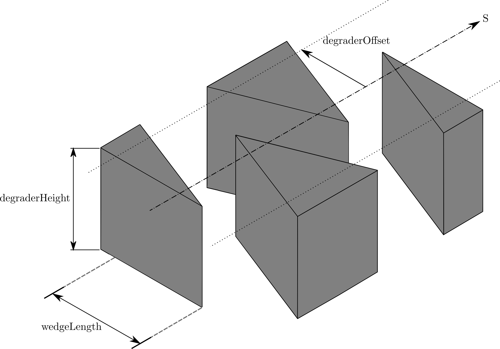

`degrader` defines interleaved pyramidal pieces of material. Depending on the physics list
used, this is capable of reducing the beam energy. This happens only through interaction
and the use of a physics list. Note, the default physics list in BDSIM is no physics and
only magnetic tracking, in which case this component will have no effect.

* If 1 wedge is specified, the degrader will be composed of 1 half wedge on each side.
* If 2 wedges are specified, the degrader will be a half, a whole then a half wedge.
* The above diagram shows a degrader with 3 wedges specified.

.. warning:: The nominal beam energy of each magnet after the degrader is unchanged and
	     is still the design energy of the machine. It is not possible to accurately
	     calculate the degradation in kinetic energy for all materials and particles
	     analytically. The user should use the :code:`scaling` parameter for any
	     magnet placed after the degrader to linearly scale the field strength. Or in
	     the case where there are no magnets before the degrader, set the design energy
	     of using the beam command as the energy afterwards and the :code:`E0` to the
	     higher input energy.

.. tabularcolumns:: |p{4cm}|p{4cm}|p{2cm}|p{2cm}|

===================    =======================================  ==========  ===========
Parameter              Description                              Default     Required
`l`                    Length [m]                               0           Yes
`numberWedges`         Number of degrader wedges                1           Yes
`wedgeLength`          Degrader wedge length [m]                0           Yes
`degraderHeight`       Degrader height [m]                      0           Yes
`materialThickness`    Amount of material seen by the beam [m]  0           Yes/No*
`degraderOffset`       Horizontal offset of both wedge sets     0           Yes/No*
`material`             Degrader material                        Carbon      Yes
`horizontalWidth`      Outer full width [m]                     global      No
`colour`               Colour of block. See :ref:`colours`      ""          No
===================    =======================================  ==========  ===========

.. note:: Either `materialThickness` or `degraderOffset` can be specified to adjust the horizontal
	  lateral wedge position, and consequently the total material thickness the beam can propagate
	  through. An offset of zero will corresponds to a full closed degrader, and is equivalent to a
	  materialThickness being the degrader length. If both are specified, `degraderOffset` will be ignored.
.. note:: When numberWedges is specified to be n, the degrader will consist of n-1 `full` wedges and
      two `half` wedges. When viewed from above, a `full` wedge appears as an isosceles triangle, and
      a `half` wedge appears as a right-angled triangle.
.. note:: A base is included with each wedge. Without it, if the materialThickness were to be set to
      the same as the degrader length, only half the beam would be degraded when passing through a wedge.
      The base provides material such that the whole width of the beam pipe would see material when the
      degrader is fully closed. As such, the degrader offset must be greater than or equal to zero.
      Negative offsets causes BDSIM to exit.
.. note:: If the user wants a fully open degrader, the degrader offset should be set to a value larger
      than the wedgeLength.

Examples: ::

    DEG1: degrader, l=0.25*m, material="carbon", numberWedges=5, wedgeLength=100*mm, degraderHeight=100*mm, materialThickness=200*mm;
    DEG2: degrader, l=0.25*m, material="carbon", numberWedges=5, wedgeLength=100*mm, degraderHeight=100*mm, degraderOffset=50*mm;

muspoiler
^^^^^^^^^

.. figure:: figures/muspoiler.png
	    :width: 40%
	    :align: center

`muspoiler` defines a muon spoiler, which is a rotationally magnetised iron cylinder with
a beam pipe in the middle. There is no magnetic field in the beam pipe.

=================  ============================  ==========  ===========
Parameter          Description                   Default     Required
`l`                Length [m]                    0           Yes
`B`                Magnetic field [T]            0           No
`material`         Outer material                Iron        No
`horizontalWidth`  Outer full width [m]          global      No
=================  ============================  ==========  ===========

Notes:

* The :ref:`aperture-parameters` may also be specified.
* No field is constructed if B is the default 0.

shield
^^^^^^

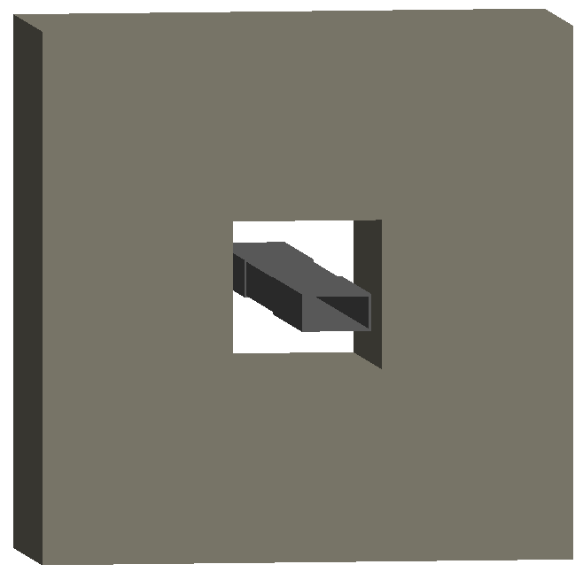

`shield` defines a square block of material with a square aperture. The user may choose
the outer width and inner horizontal and vertical apertures of the block. A beam pipe
is also placed inside the aperture.  If the beam pipe dimensions (including thickness)
are greater than the aperture, the beam pipe will not be created.

=================  ===================================  ==========  ===========
Parameter          Description                          Default     Required
`l`                Length [m]                           0           Yes
`material`         Outer material                       Iron        No
`horizontalWidth`  Outer full width [m]                 global      No
`xsize`            Horizontal inner half aperture [m]   0           Yes
`ysize`            Vertical inner half aperture [m]     0           No
`colour`           Colour of block. See :ref:`colours`  ""          No
=================  ===================================  ==========  ===========

Notes:

* The :ref:`aperture-parameters` may also be specified.

dump
^^^^

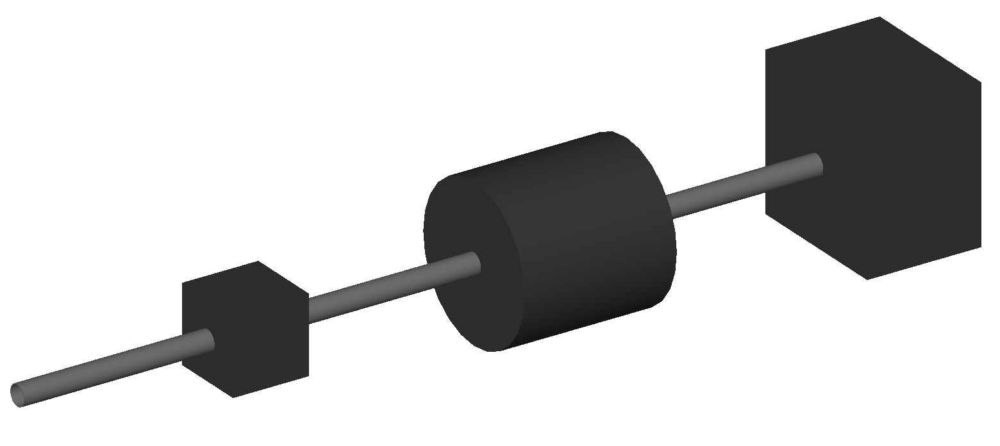

`dump` defines a square or circular block of material that is an infinite absorber. All
particles impacting the dump will be absorbed irrespective of the particle and physics
processes.

This is intended as a useful way to absorb a beam with no computational time. Normally,
the world volume is filled with air. If the beam reaches the end of the beam line it will
hit the air and likely create a shower of particles that will take some time to simulate.
In this case, when this isn't required, it is recommended to use a dump object to absorb
the beam.

=================  ==================================  ===========  ===========
Parameter          Description                         Default      Required
`l`                Length [m]                          1 mm         No
`horizontalWidth`  Outer full width [m]                global       No
`apertureType`     Which shape                         rectangular  No
=================  ==================================  ===========  ===========

How this works: the material of the dump is actually vacuum, but G4UserLimits are used to
kill particles. This requires the cuts and limits physics process that is included automatically.
In the case of using a Geant4 reference physics list (see :ref:`physics-geant4-lists`), the
necessary process is added automatically to enforce this.

The dump may accept `apertureType` with the value of either `circular` or `rectangular` for
the shape of the dump. By default it is rectangular.

.. note:: Although the syntax is "rectangular", the shape for the dump will be square. This
	  will be improved in future when any shape can be used.

Examples: ::

  d1: dump, horizontalWidth=20*cm;
  d2: dump, horizontalWidth=30*cm, apertureType="circular";
  d3: dump, l=0.3*m, horizontalWidth=40*cm, apertureType="rectangular";

Here, `d1` is a rectangular block 20 cm wide (full width) and 1 mm long in z. `d2` is a
circular disk with diameter 30 cm and length of 1 mm in z. `d3` is 30 cm long in z and
40 cm width (full width) in x and y with a square shape.

  
solenoid
^^^^^^^^

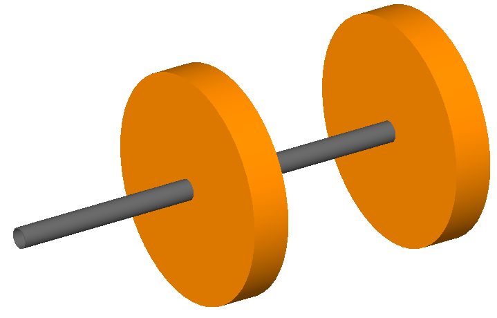

`solenoid` defines a solenoid magnet. This utilises a thick lens transfer map with a
hard edge field profile. Fringes for the edge effects are provided by default and
are controllable with the option `includeFringeFields`. A field is supplied that is
used in the case a particle cannot be tracked using the integrator. In this case, it
is a perfect dipole field along the local :math:`z` axis inside the beam pipe with
no spatial variation. Outside the beam pipe, in the *'yoke'*, a solenoidal field
according to a cylindrical current source is constructed.

.. math::

   ks = \frac{B_0}{B \rho}\,[m^{-1}]

=================  ============================  ==========  ===========
Parameter          Description                   Default     Required
`l`                Length [m]                    0           Yes
`ks`               Solenoid strength             0           No
`B`                Magnetic field                0           No
`material`         Outer material                Iron        No
`horizontalWidth`  Outer full width [m]          global      No
=================  ============================  ==========  ===========

* A positive field corresponds to a field in along the direction of positive S.
* The entrance / exit solenoid fringes are not constructed if the previous / next element is also a solenoid.
* See `Magnet Strength Polarity`_ for polarity notes.

A thin sheet cylinder is place also inside the yoke but of the same material. The
colour is copper colour to indicate this is the shape used to calculate the solenoidal
field for the yoke. This is of the same material so it has no effect on physics results.
The 'current' cylinder is chosen to be :math:`0.8 \times l` and the radius is
:math:`\frac{1}{3}` of the distance between the beam pipe radius and the outer radius.

Examples: ::

   atlassol: solenoid, l=20*m, ks=0.004;

Another visualisation:

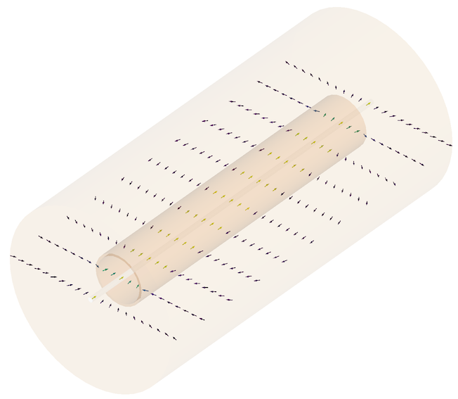

   A partially transparent visualiation of a solenoid showing the interior current
   cylinder sheet - made of the same material as the yoke. The field is shown in the
   :math:`x-z` plane.

wirescanner
^^^^^^^^^^^

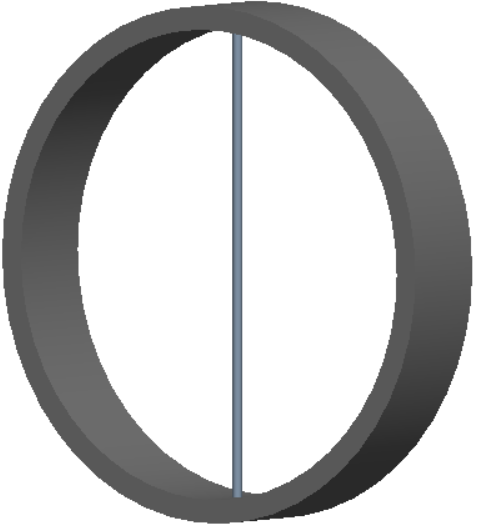

`wirescanner` defines a cylindrical object within a beam pipe to represent a wire
scanner typically use in an accelerator.

=====================  ===============================================  ==========  ==========
parameter              description                                      default     required
`l`                    length of drift section around wire              0           yes
`wireDiameter`         diameter of wire [m]                             0           yes
`wireLength`           length of wirescanner [m]                        0           yes
`material`             material of wire                                 none        yes
`wireAngle`            angle of the wire w.r.t. vertical                0           no
`wireOffsetX`          x offset of the wire from the center [m]         0           no
`wireOffsetY`          y offset of the wire from the center [m]         0           no
`wireOffsetZ`          z offset of the wire from the center [m]         0           no
=====================  ===============================================  ==========  ==========

Notes:

* The angle is the rotation from vertical in the clock-wise direction looping in the
  positive S direction (the usually direction of the beam).

.. warning:: After BDSIM V1.3.2 :code:`wireAngle` is used for the angle instead of
	     :code:`angle` as :code:`angle` is used specifically for angles of bends
	     and this could result in the curvilinear world being made very small.

The offsets are with respect to the centre of the beam pipe section the wire is placed inside.
This should therefore be less than half the element length `l`. The usual beam pipe parameters
can be specified and apply the to the beam pipe. For example, `material` is used for the beam
pipe material whereas `wireMaterial` is used for the material of the wire.

The user should take care to define a wire long enough to intercept the beam but be sufficiently
short to fit inside the beam pipe given the offsets in x, y and z. Checks are made on the end
points of the wire.

Examples: ::

    ws45Deg: wirescanner, l=4*cm, wireDiameter=0.1*mm, wireLength=5*cm,
                          wireOffsetX=1*cm, angle=pi/4, wireMaterial="C",
			  aper1=5*cm;

    wsVertical: wirescanner, l=4*cm, wireDiameter=0.1*mm, wireLength=5*cm,
                             wireOffsetX=1*cm, wireOffsetZ=1.6*cm, wireMaterial="C";

laser
^^^^^

`laser` defines a drift section with a laser beam inside. The laser acts as a static target
of photons.

================  =================================================  ==========  ===========
Parameter         Description                                        Default     Required
`l`               Length of drift section [m]                        0           Yes
`x`, `y`, `z`     Components of laser direction vector (normalised)  (1,0,0)     yes
`waveLength`      Laser wavelength [m]                               532*nm      Yes
================  =================================================  ==========  ===========

Examples: ::

   laserwire: laser, l=1*um, x=1, y=0, z=0, wavelength=532*nm;

gap
^^^

`gap` defines a gap where no physical geometry is placed. It will be a region of the world,
composed of the same material as the world volume.

.. tabularcolumns:: |p{4cm}|p{4cm}|p{2cm}|p{2cm}|

===================    =======================================  ==========  ===========
Parameter              Description                              Default     Required
`l`                    Length [m]                               0           Yes
`angle`                Angle [rad]                              0           No
===================    =======================================  ==========  ===========

Examples: ::

    GAP1: gap, l=0.25*m, angle=0.01*rad;

.. _element-crystal-col:
    
crystalcol
^^^^^^^^^^

`crystalcol` defines a crystal collimator that uses crystals to channel particles. It is
composed of a beam pipe with one or two crystals inside it. The crystals can be the same
(but placed at different angles) or different. The crystals are placed +- `xsize` away
from the centre.

The crystal is defined in a separate object in the parser and referred to by the name of
that object. At least one of `crystalBoth`, `crystalLeft` and `crystalRight` must be
specified.

.. warning:: This requires the user to use the "completechannelling" or "channelling" physics list
	     for channelling to take place.

==========================  ======================================================  ===========  =========
Parameter                   Description                                             Default      Required
`l`                         Length [m]                                              0            Yes
`xsize`                     Half-gap distance of each crystal from centre [m]       0            Yes
`material`                  Material                                                ""           Yes
`crystalBoth`               Name of crystal object for both crystals                ""           No
`crystalLeft`               Name of crystal object for right crystal                ""           No
`crystalRight`              Name of crystal object for left crystal                 ""           No
`crystalAngleYAxisLeft`     Rotation angle of left crystal [rad]                    0            No
`crystalAngleYAxisRight`    Rotation angle of right crystal [rad]                   0            No
==========================  ======================================================  ===========  =========

Notes:

* A positive crystalAngleYAxisLeft will result in the crystal being rotated away from the z axis of the
  collimator. Therefore, a positive angle for both a left and right crystal will result in diverging
  crystals.
* The bending angle of the left crystal is reversed from the definition. Therefore a positive bending angle
  will result in the crystal bending away from the z axis of the collimator for both left and right crystals.
* Crystal channelling potential files are required for this - see :ref:`crystals` for more details.
* If only `crystalLeft` or `crystalRight` is specified, only one crystal will be placed.
* If both `crystalLeft` and `crystalRight` are specified, both will be constructed uniquely and placed.
* If `crystalBoth` is specified, `crystalLeft` and `crystalRight` will be ignored and the `crystalBoth`
  definition will be used for both crystals. The angles will be unique.

.. note:: Crystal channelling is only available in Geant4.10.4 onwards. If BDSIM is compiled with a Geant4
	  version below this, the geometry will be constructed correctly but the channelling physics process
	  will not be used and the crystal will not channel particles.

* See :ref:`crystals` for the definition of a crystal object.

Examples: ::

  lovelycrystal: crystal, material = "G4_Si",
	       		data = "data/Si220pl",
			shape = "box",
			lengthY = 5*cm,
			lengthX = 0.5*mm,
			lengthZ = 4*mm,
			sizeA = 5.43*ang,
			sizeB = 5.43*ang,
			sizeC = 5.43*ang,
			alpha = 1,
			beta  = 1,
			gamma = 1,
			spaceGroup = 227,
			bendingAngleYAxis = 0.1*rad,
			bendingAngleZAxis = 0;

   col1 : crystalcol, l=6*mm, apertureType="rectangular", aper1=0.25*cm, aper2=5*cm,
                      crystalBoth="lovelycrystal", crystalAngleYAxisLeft=-0.1*rad,
		      crystalAngleYAxisRight=-0.1*rad, xsize=2*mm;

More examples can be found in :code:`bdsim/examples/components` and are described in :ref:`crystal-examples`.

undulator
^^^^^^^^^

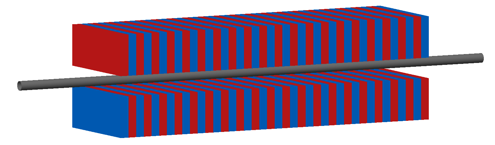

`undulator` defines an undulator magnet which has a sinusoidally varying field along the element with
field components:

.. math::

   B_{x} ~ &= ~ 0 \\
   B_{y} ~ &= ~ B \cdot \cos\big(z \frac{2\pi}{\lambda}\big) \cosh\big(y \frac{2\pi}{\lambda}\big)\\
   B_{z} ~ &= ~ -B \cdot \sin\big(z \frac{2\pi}{\lambda}\big) \sinh\big(y \frac{2\pi}{\lambda}\big)

where :math:`\lambda` is the undulator period.

=======================  =============================  ==========  ===========
Parameter                Description                    Default     Required
`l`                      Length [m]                     0           Yes
`B`                      Magnetic field [T]             0           Yes
`undulatorPeriod`        Undulator magnetic period [m]  1           Yes
`undulatorGap`           Undulator gap [m]              0           No
`undulatorMagnetHeight`  Undulator magnet height [m]    0           No
`material`               Magnet outer material          Iron        No
=======================  =============================  ==========  ===========

Notes:

* The undulator period must be an integer factor of the undulator length. If not, BDSIM will exit.
* The undulator gap is the total distance between the upper and lower sets of magnets. If not supplied,
  it is set to twice the beam pipe diameter.
* The undulator magnet height is the vertical height of the sets of magnets. If not supplied, it is set
  to the 0.5*horizontalWidth - undulator gap.
* The :ref:`aperture-parameters` may also be specified.
* See `Magnet Strength Polarity`_ for polarity notes.
* To generate radiation from particles propagating through the undulator field, synchrotron radiation
  physics must be included in the model's physicsList. See :ref:`physics-processes` for further details.

Examples: ::

 u1: undulator, l=2.0*m, B=0.1*T, undulatorPeriod=0.2*m;
 u2: undulator, l=3.2*m, B=0.02*T, undulatorPeriod=0.16*m, undulatorGap=15*cm, undulatorMagnetHeight=10*cm;

gaborlens
^^^^^^^^^

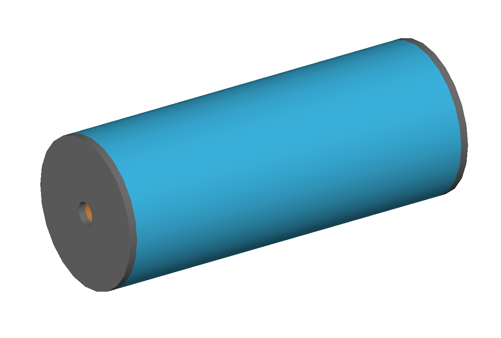

`gaborlens` defines a Gabor lens that provides a radially focusing electric field from a confined electron plasma in
a Penning-Malmberg trap configuration. The lens' radial electric field along the element has field components:

.. math::

   E_{x} ~ &= ~ - \frac{B^2 c^2}{4\ m_p} x \\
   E_{y} ~ &= ~ - \frac{B^2 c^2}{4\ m_p} y \\
   E_{z} ~ &= ~ 0 \\

where :math:`B` is the magnetic field of an equivalent strength solenoid, and :math:`m_p` is the beam particle
mass. The field is internally calculated from the Gabor lens focusing parameter `Kg`, defined as

.. math::

   k_{G} = \frac{e}{2 \epsilon_0} \frac{m_p\ \gamma}{p^2} n_e

where :math:`e` is the electron charge, :math:`\epsilon_0` is the permittivity of free space, :math:`m_p` is the beam
particle mass, :math:`\gamma` is the beam particle Lorentz factor, :math:`p` is the beam particle momentum, and
:math:`n_e` is the electron plasma density. It is assumed that the electron density in uniform. The Gabor lens plasma
density depends on the strength of the electric and magnetic confinement fields that confine the plasma axially and
radially respectively. The nominal electron density :math:`n_e` is achieved assuming the maximum axial and radial
densities are in equilibrium. It is assumed in the `gaborlens` element that this equilibrium condition is met.

.. note:: The electric and magnetic confinement fields are not constructed in the `gaborlens` element at present.

The Gabor lens geometry is based upon a prototype design by Imperial College. The details of the lens are described
in `<https://doi.org/10.3390/app11104357>`_. The internal structure of a Gabor lens is shown below. The main components
are:

1) The outer tube
2) Solenoid coils (copper)
3) Vacuum tube
4) A cylindrical central copper anode
5) End electrodes (copper)
6) Grounding end caps (stainless steel)

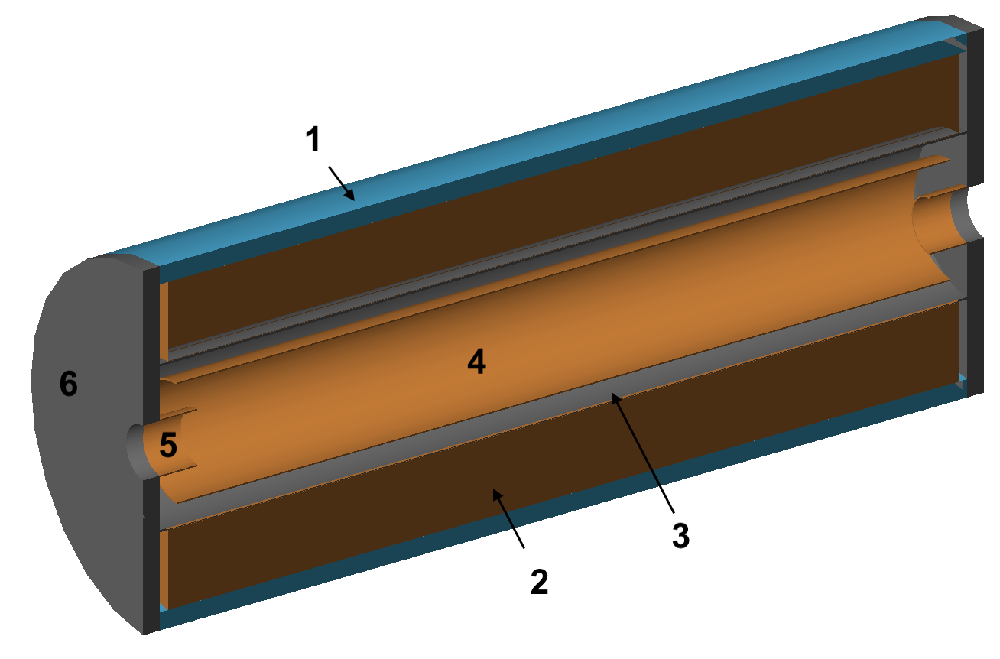

.. note:: The transverse extent of the electric field from the plasma is limited to the radius of the
  cylindrical anode.

.. note:: The Gabor lens element contains 2 end caps that are crucial for grounding and vacuum in such
  physical devices. In the BDSIM Gabor lenses, both of these are 1cm long. The plasma field does NOT extend
  to within these volumes, and is limited to the length of the vacuum volume. The field length in Z is therefore
  the total element length minus 2cm. This should be accounted for by the user when defining the
  total element length.

.. note:: The end cap aperture is set equal to the electrode radius as both the anode and electrode must be within
  the beam pipe aperture.

=======================  ================================  ==========  ===========
Parameter                Description                       Default     Required
`l`                      Length [m]                        0           Yes
`Kg`                     Gabor Lens focusing parameter     0           Yes/No*
`B`                      Solenoid-equivalent B field [T]   0           Yes/No*
`anodeLength`            Anode length [m]                  0           Yes
`anodeRadius`            Anode radius [m]                  0           Yes
`anodeThickness`         Anode thickness [m]               0           Yes
`electrodeLength`        Electrode length [m]              0           Yes
`electrodeRadius`        Electrode radius [m]              0           Yes
`electrodeThickness`     Electrode thickness [m]           0           Yes
`material`               Gabor lens outer material         Iron        No
=======================  ================================  ==========  ===========

.. note:: Either `Kg` or `B` can be specified to set the Gabor Lens field strength with `Kg` being the main
    parameter. `B` will only be used if `Kg` is not specifed (0). If both are unspecified, no field will be constructed.

Notes:

* The anode length must be shorter than the vacuum volume length (total element length minus 20 cm).
* The anode radius + anode thickness must be smaller than the smallest aperture inner extent.
* The transverse extent of the electric field from the plasma is limited to the radius of the cylindrical anode.
* The :ref:`aperture-parameters` control the vacuum volume.
* The electrode length must be smaller than half the vacuum volume length.
* The electrode radius + thickness must be smaller than the anode radius.

Examples: ::

 g1: gaborlens, l=1.0*m, kg=0.289643, material="copper", anodeRadius=65*mm, anodeLength=0.920, anodeThickness=1.6*mm,
     electrodeRadius=30*mm, electrodeLength=45*mm, electrodeThickness=1.6*mm;

 g2: gaborlens, l=1.0*m, B=0.6*T, material="copper", anodeRadius=65*mm, anodeLength=0.920, anodeThickness=1.6*mm,
     electrodeRadius=30*mm, electrodeLength=45*mm, electrodeThickness=1.6*mm;

transform3d
^^^^^^^^^^^

`transform3d` defines an arbitrary three-dimensional transformation of the curvilinear coordinate
system at that point in the beam line sequence. The user is responsible for ensuring no overlaps
in geometry are introduced. The drifts on either side currently will not have matching angular faces.

Two representations of rotation can be used. Either Euler angles or Axis Angle where unit vector
components are supplied to create an axis to rotate around by an angle. Euler is the default.
To select the axis angle representation, set :code:`axisAngle=1`.

================  ============================  ==========  ===========
Parameter         Description                   Default     Required
`x`               x offset                      0           No
`y`               y offset                      0           No
`z`               z offset                      0           No
`phi`             phi Euler angle               0           No
`theta`           theta Euler angle             0           No
`psi`             psi Euler angle               0           No
`axisAngle`       whether to use axis angle     0           No
`axisX`           x component of axis vector    0           No
`axisY`           y component of axis vector    0           No
`axisZ`           z component of axis vector    0           No
`angle`           angle to rotate about axis    0           No
================  ============================  ==========  ===========

.. note:: this permanently changes the coordinate frame, so care must be taken to undo any rotation
	  if intended for only one component.

Examples: ::

   rcolrot: transform3d, psi=pi/2;

   tr1: transform3d, x=2*mm, axisAngle=1, axisY=1, angle=pi/10;

.. _element-rmatrix:

rmatrix
^^^^^^^

`rmatrix` defines an arbitrary 4 :math:`\times` 4 R matrix which represents a physical effect on the beam for
an element of finite length. The effect of an rmatrix describes the total effect through the full length of
the element, but is applied in a single instantaneous kick. As BDSIM is designed to track particles in a 3D model,
to apply this rmatrix in finite length geometry, BDSIM uses a parallel transporter to simply advance the particles
along S but without changing the particles transverse coordinates. The transverse effect from the matrix is applied
once in the middle of the element, whereafter particles are once again parallel transported to the end of the
element. This way, the correct transverse effect is applied, the recorded tracking time is correct as the particle
has tracked through a finite length element, and the model is constructed with the correct physical length.

The mathematical effect of the matrix on a particle is:

.. math::

   \begin{pmatrix}
   x_1    \\
   x'_1   \\
   y_1    \\
   y'_1   \\
   \end{pmatrix}
   =
    \begin{pmatrix}
    R_{11} & R_{12} & R_{13} & R_{14} \\
    R_{21} & R_{22} & R_{23} & R_{24} \\
    R_{31} & R_{32} & R_{33} & R_{34} \\
    R_{41} & R_{42} & R_{43} & R_{44} \\
   \end{pmatrix}
   \begin{pmatrix}
   x_0    \\
   x'_0   \\
   y_0    \\
   y'_0   \\
   \end{pmatrix}

The geometry of an rmatrix element is simply that of a drift tube of the same length.

================  =============================  ==========  ==========
Parameter         Description                     Default     Required
`l`               Length [m]                         0           Yes
`rmat11`          matrix element :math:`R_{11}`      1           No
`rmat12`          matrix element :math:`R_{12}`      0           No
`rmat13`          matrix element :math:`R_{13}`      0           No
`rmat14`          matrix element :math:`R_{14}`      0           No
`rmat21`          matrix element :math:`R_{21}`      0           No
`rmat22`          matrix element :math:`R_{22}`      1           No
`rmat23`          matrix element :math:`R_{23}`      0           No
`rmat24`          matrix element :math:`R_{24}`      0           No
`rmat31`          matrix element :math:`R_{31}`      0           No
`rmat32`          matrix element :math:`R_{32}`      0           No
`rmat33`          matrix element :math:`R_{33}`      1           No
`rmat34`          matrix element :math:`R_{34}`      0           No
`rmat41`          matrix element :math:`R_{41}`      0           No
`rmat42`          matrix element :math:`R_{42}`      0           No
`rmat43`          matrix element :math:`R_{43}`      0           No
`rmat44`          matrix element :math:`R_{44}`      1           No
================  =============================  ==========  ==========

Examples: ::

   rm1: rmatrix, rmat12=0.997, rmat21=-0.924;

thinrmatrix
^^^^^^^^^^^

`thinrmatrix` defines an arbitrary 4 :math:`\times` 4 R matrix which represents a physical effect on the beam
within a thin element. Unlike the rmatrix, a thinrmatrix is an instantaneous effect in a thin element, therefore
no geometry is constructed. The parameters for a thinmatrix are the same as those for an :ref:`element-rmatrix` except
for the length, `l`, which is not required.

.. note:: The length of the thinrmatrix can be changed by setting `thinElementLength` (see :ref:`bdsim-options`).

Examples: ::

   rm1: thinrmatrix, rmat12=0.997, rmat21=-0.924;

.. _element:

element
^^^^^^^

`element` defines an arbitrary beam line element that's defined by externally provided geometry.
It includes the possibility of overlaying a field as well. Several geometry formats are supported
but GDML is the recommended and tested format.

The user must supply the length of the geometry accurately to ensure a tight fit in the beamline.
BDSIM will leave a gap of this length, then place the geometry at the centre of that location. If
the geometry is suspected to be too long, a warning will be printed but the model still created
and visualisable.

The outermost volume of the loaded geometry is simply placed in the beam line. There is no placement
offset other than the :code:`offsetX`, :code:`offsetY` and :code:`tilt` of that element in the beam line.
Therefore, the user must prepare geometry with the placement of the contents in the outermost volume
as required.

An alternative strategy is to use the `gap`_ beam line element and make a placement at the appropriate
point in global coordinates. Again, the user should take care to avoid overlaps and check
for them purposively.

.. tabularcolumns:: |p{4cm}|p{5cm}|p{2cm}|p{2cm}|

+----------------------+----------------------------------+--------------+---------------+
| **Parameter**        | **Description**                  | **Default**  | **Required**  |
+======================+==================================+==============+===============+
| `geometryFile`       | Filename of geometry             | NA           | Yes           |
+----------------------+----------------------------------+--------------+---------------+
| `l`                  | Length - chord length in case of | NA           | Yes           |
|                      | a finite angle [m]               |              |               |
+----------------------+----------------------------------+--------------+---------------+
| `fieldAll`           | Name of field object to use      | NA           | No            |
+----------------------+----------------------------------+--------------+---------------+
| `angle`              | Angle the component bends the    | 0            | No            |
|                      | beam line. A positive value      |              |               |
|                      | results in a deflection in       |              |               |
|                      | negative `x`.                    |              |               |
+----------------------+----------------------------------+--------------+---------------+
| `tilt`               | Tilt of the whole component.     | 0            | No            |
+----------------------+----------------------------------+--------------+---------------+
| `namedVacuumVolumes` | String with space separated list | ""           | No            |
|                      | of **logical** volume names in   |              |               |
|                      | the geometry file that should be |              |               |
|                      | considered 'vacuum' for biasing  |              |               |
|                      | purposes                         |              |               |
+----------------------+----------------------------------+--------------+---------------+
| `autoColour`         | 1 or 0. Whether the geometry     | 1            | No            |
|                      | should be automatically coloured |              |               |
|                      | according to density.            |              |               |
+----------------------+----------------------------------+--------------+---------------+
| `markAsCollimator`   | Label this element as a          | 0            | No            |
|                      | collimator so it appears in the  |              |               |
|                      | collimator histograms and hits.  |              |               |
+----------------------+----------------------------------+--------------+---------------+
| `stripOuterVolume`   | 1 or 0. Whether to strip the     | 0            | No            |
|                      | outermost volume from the loaded |              |               |
|                      | geometry and make it an assembly |              |               |
+----------------------+----------------------------------+--------------+---------------+
| `horizontalWidth`    | Diameter of component [m] Only   | NA           | No            |
|                      | required for SQL geometry        |              |               |
+----------------------+----------------------------------+--------------+---------------+
| `e1`                 | Assumed incoming face angle of   | 0            | No            |
|                      | the provided geometry [rad]      |              |               |
+----------------------+----------------------------------+--------------+---------------+
| `e2`                 | Assumed outgoing face angle of   | 0            | No            |
|                      | the provided geometry [rad]      |              |               |
+----------------------+----------------------------------+--------------+---------------+

* `geometryFile` should be of the format `format:filename`, where `format` is the geometry
  format being used (`gdml` | `gmad` | `mokka`) and filename is the path to the geometry
  file. See :ref:`externally-provided-geometry` for more details.
* `fieldAll` should refer to the name of a field object the user has defined in the input
  gmad file. The syntax for this is described in :ref:`field-maps`.
* The field map will also be tilted with the component if it is tilted.
* The angle has the same sign convention as sbends and rbends in that a positive angle
  corresponds to a deflection in negative x in a right-handed coordinate system with the
  `element` built along positive `z`.
* `e1` and `e2` follow the convention of the sbend and rbend components and therefore
  depend on the sign of the angle of the `element`. See :ref:`component-rbend`. These
  angles are used to make the preceding and proceeding drifts (if they are drifts) match
  the angled face of the geometry so there are no overlaps or gaps. This only works for
  drifts on either side of the `element`.
* If marked as a collimator, the element will also appear in the collimator histograms
  and also have a collimator-specific branch made for it in the Event tree of the output
  as per the other collimators. The type in the output will be "element-collimator".
* The outer volume can be stripped away and the geometry is made into an assembly volume
  in Geant4 and placed in the world. Use the parameter :code:`stripOuterVolume=1` for this.
* `elementLengthIsArcLength` is also available as a Boolean parameter. If set true (:code:`=1`),
  then the `l` will be interpreted as the arc length. Caution - it is most likely that the
  container volume of the piece of geometry loaded is truly straight with angled faces and
  should therefore be given as the chord length - the default interpretation.

.. warning:: If you strip the outer volume, any field supplied will be applied to all
	     daughter volumes, but note that the (now from the world) air that may
	     appear as part of that element will not have field. No field is attached
	     to the world volume. Therefore, if using say a magnet geometry with yoke,
	     the user should take care to acknowledge where there is and is not field.

.. note:: The length must be larger than the geometry so that it is contained within it and
	  no overlapping geometry will be produced. However, care must be taken, as the length
	  will be the length of the component inserted in the beamline.  If this is much larger
	  than the size required for the geometry, the beam may be mismatched into the rest of
	  the accelerator. A common practice is to add a nanometer to the length of the geometry.

Simple example::

  detector: element, geometryFile="gdml:atlasreduced.gdml", l=44*m;

Example with field: ::

  detectorfield: field, type="bmap2d",
                        bScaling = 0.5,
			magneticFile = "bdsim2d:/Path/To/File.dat";

  detec: element, geometryFile="gdml:twoboxes.gdml",
                  fieldAll="detectorfield",
		  l=5*m,
		  horizontalWidth=0.76*m;

Here, in the field definition, cubic interpolation (2D to match the field type) by default and
the integrator (for the particle motion) will be the default "g4classicalrk4" (4th order Runge Kutta).

Or: ::

  specialbend: element, geometryFile="gdml:MBR_dipole.gdml",
                        fieldAll="f1",
                        angle=pi/10,
                        e1=-pi/20,
                        e2=-pi/20,
                        l=4.5*m;

.. note:: For GDML geometry, we preprocess the input file prepending all names with the name
	  of the element. This is to compensate for the fact that the Geant4 GDML loader does
	  not handle unique file names. However, in the case of very large files with  many
	  vertices, the preprocessing can dominate. In this case, the option `preprocessGDML`
	  should be turned off. The loading will only work with one file in this case.

marker
^^^^^^
`marker` defines a point in the lattice. This element has no physical length and is only
used as a reference. For example, a `sampler` (see :ref:`sampler-output`)
is used to record particle passage at the
front of a component, but how would you record particles exiting a particular component?
The intended method is to use a `marker` and place it in the sequence after that element,
then attach a sampler to the marker.

Examples: ::

   m1: marker;

ct
^^^^

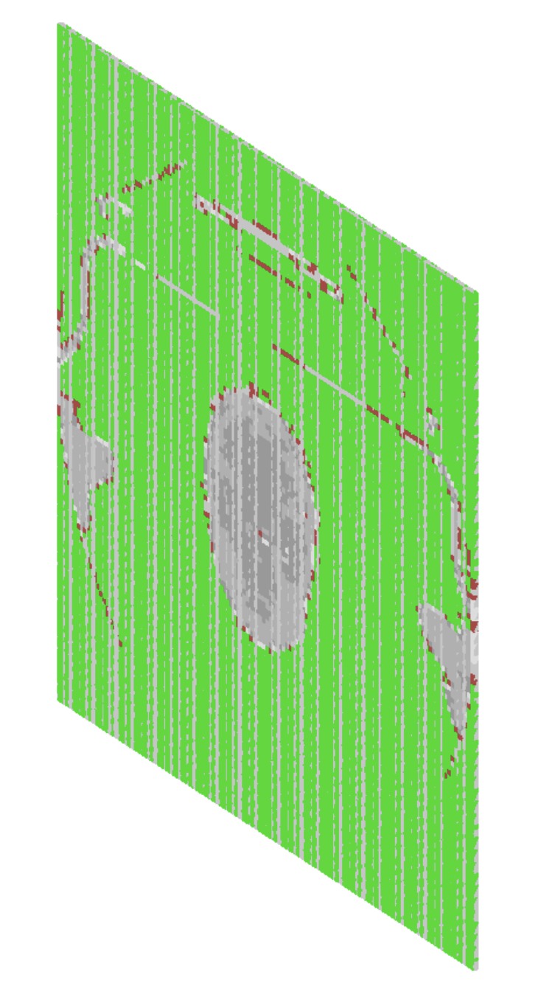

`ct` defines a Computed Tomographic (CT) image, saved in the international standard DICOM format. The DICOM module of
BDSIM enables the conversion of CT images into Geant4 voxelized geometries. This conversion results in a regular mesh of
voxels. In order to correctly allow the materials and densities to each individual voxel, a HUs-to-density (HUs stands
for Hounsfield Units) table and a HUs-to-materials table must be provided. The data of this two tables must be provided
into a single, two columns `data.dat` file. The required format for this file is illustrated below:

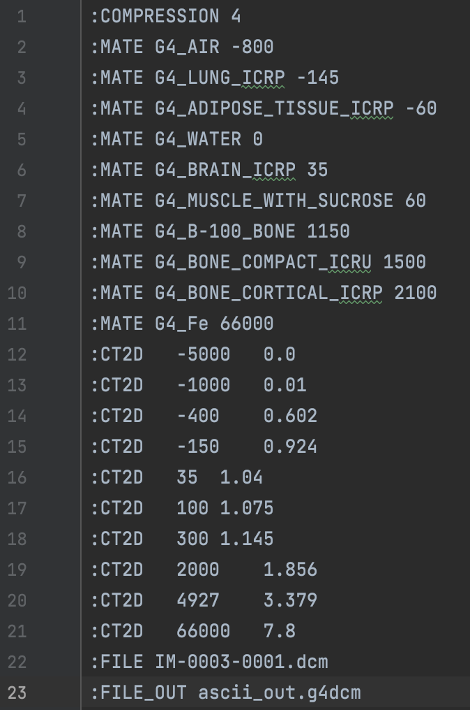

The first line gives the level of compression of the image. For example :code:`:COMPRESSION 4` means that only one slice
over four will be converted into the final voxelized geometry. The lines which start with :code:`:MATE` give data
points for the HUs-to-materials curve, while the lines which start with :code:`:CT2D` give data points for the
HUs-to-density curve. For each curve, a linear interpolation is done based on the data points to find the most
appropriate density and material for each voxel. The user must give the path to this file in the definition of the `ct`
element, as the parameter `dicomDataFile`. The user must also give the name of the dicom (.dcm) file to be converted.
This must be done with the flag :code:`:FILE`, followed by the name of the file, which needs to be in the same folder
as the interpolation data file. The last flag :code:`:FILE_OUT` is optional, and can be used to give a specific name to
the temporary output file which is generated during the conversion CT image.

An example of such a data file is provided in `bdsim/examples/features/dicom/data.dat` and can be used as a
starting point.

.. note:: For a correct visualization of the DICOM image, a path to a colourMap.dat file must also be given,
    as the parameter `dicomDataPath`. This file will allow the mapping of each material to a specific color in the
    viewer. Its first line should bethe number of materials used in the simulation. Each material given in the
    `data.dat` file should then have a colour scheme which the user defines via four numbers with the syntax
    :code:`:1MAT X Y Z A` where X, Y, Z and A are numbers between 0 and 1 respectively setting the amount of red, green,
    blue and opacity of the colour defined for the material MAT. An example of such a colourMap.dat file is provided in
    `bdsim/examples/features/dicom/colourMap.dat`.

.. note:: To be able to load CT images, BDSIM must be compiled with the `USE_DICOM` variable set to ON. Moreover, the
    conversion of the images requires the installation of the `DCMTK` package. This package is needed to easily extract
    the HUs data from the images. Information to download and install DCMTK can be found
    here: https://dicom.offis.de/dcmtk.php.en.

Examples: ::

    DICOM: ct, l=1*m, dicomDataPath="./", dicomDataFile="data.dat";

+-------------------------+--------------------------------------------------------------------+
| **Parameter**           |  **Description**                                                   |
+-------------------------+--------------------------------------------------------------------+
| `l`                     | Length of the CT element along the beamline.                       |
+-------------------------+--------------------------------------------------------------------+
| `dicomDataFile`         | Name of the file which contains the conversion material-to-density |
|                         | and material-to-HU tables.                                         |
+-------------------------+--------------------------------------------------------------------+
| `dicomDataPath`         | Path to the colourMap.dat file. During the conversion of the CT    |
|                         | image, the temporary .g4dcm file will also be stored in this path. |
+-------------------------+--------------------------------------------------------------------+

.. _offsets-and-tilts:

Offsets & Tilts - Component Misalignment
----------------------------------------

To simulate a real accelerator it may be necessary to introduce measured placement offsets or misalignments
and rotations. Every component can be displaced transversely and rotated along the axis of the beam propagation.

.. note:: Components that have a finite angle (rbend and sbend) will only respond to tilt and not vertical or
	  horizontal offsets. This is because these would change the length of the bend about its central axis.
	  This is not currently handled but may be implemented in future releases.

.. note:: A tilt on a component with a finite angle causes the axis the angle is induced in (typically the y-
	  axis) to be rotated without rotating the reference frame of the beam, i.e. a dipole with a :math:`\pi/2`
	  tilt will become a vertical bend without flipping x and y in the sampler or subsequent components. This
	  matches the behaviour of MAD8 and MAD-X.

.. note:: A right-handed coordinate system is used and the beamline is built along the `z` direction.

.. note:: Tilts and offsets are independent of one another, that is to
          say, a tilt of :math:`\pi/2` combined with a non-zero
          offsetX will not result in a vertical displacement.

The misalignments can be controlled through the following parameters.

+--------------+------------------------------------------------------------------------------------+
| Parameter    | Default value                                                                      |
+==============+====================================================================================+
| `offsetX`    | Horizontal displacement of the component [m]                                       |
+--------------+------------------------------------------------------------------------------------+
| `offsetY`    | Vertical displacement of the component [m]                                         |
+--------------+------------------------------------------------------------------------------------+
| `tilt`       | Clockwise rotation of the component, facing in the direction of the beamline       |
|              | `z` [rad]. In the case of an rbend or sbend, this rotates the axis about which the |
|	       | beam bends.                                                                        |
+--------------+------------------------------------------------------------------------------------+

Examples: ::

  d1: drift, l=1*m, offsetX=1*cm;
  d2: drift, l=0.5*m, offsetY = 0.3*cm, tilt=0.003;

.. _lattice-sequence:

Lattice Sequence
----------------

Once all the necessary components have been defined, they must be placed in a sequence to make
a lattice. Elements can be repeated. A sequence of elements is defined by
a `line`_. Lines of lines can be made to describe the accelerator sequence programmatically, i.e.
::

   d1: drift, l=3*m;
   q1: quadrupole, l=0.1*m, k1=0.684;
   q2: quadrupole, l=0.1*m, k1=-0.684;
   fodo: line = (q1,d1,q2,d1);
   transportline: line(fodo, fodo, fodo, fodo);

Line
^^^^

`line` defines a sequence of elements. ::

  name: line=(element1, element2, element3, ... );

Here, `element` can be any element or line. Lines can also be reversed using ::

  line_name : line=-(line_2)

or within another line by::

  line=(line_1,-line_2)

Reversing a line also reverses all nested lines within.

.. _the-use-command:

use - Defining which Line to Use
^^^^^^^^^^^^^^^^^^^^^^^^^^^^^^^^

Once all elements and at least one `line` is defined, the main sequence of the
beam line can be defined. This is defined using the following syntax::

  use, period=<line_name>

Examples: ::

   d1: drift, l=3.2*m;
   q1: quadrupole, l=20*cm, k1=4.5;
   q2: quadrupole, l=20*cm, k1=-4.5;
   fodo: line=(d1,q1,d1,q2,d1);
   use, period=fodo;

The beam line is placed in the world volume (the outermost coordinate system) starting
at position (0,0,0) with direction (0,0,1) - i.e. pointing in positive `z`. The user
may specify an initial offset and rotation for the beam line with respect to the world
volume using the options described in :ref:`beamline-offset`.

.. warning:: When the :code:`use` command is called, the elements are copied internally,
	     so their definition is fixed. Any element parameter adjustments or redefinitions
	     after the :code:`use` command will therefore not be observed.

Multiple beam lines may also be visualised - but only visualised (not suitable for
simulations currently).  Details are provided in :ref:`multiple-beamlines`.

.. _multiple-beamlines:

Multiple Beam Lines
-------------------

BDSIM has the ability to use multiple beam lines.  This feature is still in development and
is currently only for visualisation purposes. Secondary beam lines are placed either with
respect to the world coordinate system or with respect to a particular element in the main
beam line. A few caveats:

* Only for visualisation purposes
* Beam lines cannot be placed with respect to an element in another secondary beam line.
* Secondary beam lines are not suitable for tracking.
* Secondary beam lines are not sensitive to energy deposition, nor do they produce output.
* The user is entirely responsible for overlapping geometry. The visualiser will render
  the geometry, but of course it will not be suitable for simulations, as overlaps lead
  to volume navigation problems and incorrect tracking.

The user may use any sequence defined in the parser before the `use` command. The secondary
beam line is produced by declaring a placement. The placement definition (see
:ref:`placements`) is augmented with the following parameters:

.. tabularcolumns:: |p{5cm}|p{10cm}|

+------------------------+---------------------------------------------------------------+
| **Parameter**          |  **Description**                                              |
+========================+===============================================================+
| sequence               | Name of the sequence (with `line`) to use for the secondary   |
|                        | beam line                                                     |
+------------------------+---------------------------------------------------------------+
| referenceElement       | The element in the sequence with respect to which the beam    |
|                        | line will be placed                                           |
+------------------------+---------------------------------------------------------------+
| referenceElementNumber | The *i* th instance of the element in the sequence (zero      |
|                        | counting) ( i.e. 2 -> the 3rd instance of `referenceElement`  |
|                        | in the `sequence`).                                           |
+------------------------+---------------------------------------------------------------+

Examples
^^^^^^^^

This example is shown in bdsim/examples/features/geometry/10_multiple_beamlines.  It defines
a simple beam line and two other sequences that are placed alongside it. Further explanation
is given below the example.

::

   d1: drift, l=1*m;
   d2: drift, l=3*m;
   d3: drift, l=5*m;
   sb1: sbend, l=1*m, angle=0.5;
   sb2: sbend, l=1*m, angle=-0.5;
   q1: quadrupole, l=0.2*m, k1=4.166666;
   q2: quadrupole, l=0.2*m, k1=-4.166666;

   fodo: line=(d1,q1,d1,q2);
   mainLine: line=(d2,sb1,d2,sb2,d2,fodo,fodo);

   auxLine1: line=(d3,sb1,d1,sb2,d1,fodo,d1);
   auxLine2: line=(d1,sb1,d1,sb2,d1,fodo,d1);
   auxLine3: line=(fodo);

   use, mainLine;

   beam, particle="e-",
         energy=3*GeV;

   auxLine1Place: placement, sequence = "auxLine1",
                             referenceElement = "d2" ,
			     referenceElementNumber = 2,
			     x = -5*cm,
			     z = -1*m,
			     axisAngle = 1,
			     axisY = 1,
			     angle = -0.2;

   auxLine2Place: placement, sequence = "auxLine2",
                             referenceElement = "d2",
			     referenceElementNumber = 2,
			     x = -10*cm,
			     z = -1*m,
			     axisAngle = 1,
			     axisY = 1,
			     angle = -0.5;

   auxLine3Place: placement, sequence = "auxLine3",
                             x = 1*m,
			     axisAngle = 1,
			     axisY = 1,
			     angle = 0.2;

Firstly, a series of simple elements are defined (drifts, quadrupoles and bends). A simple
sequence called `fodo` is defined and also the main beam line, called `mainLine`. After this,
extra sequences are defined that we will use for secondary beam lines.  The `use` command
selects which beam line the simulation will be based on. ::

  use, mainLine;

After this, the beam is defined (required for any simulation for rigidity calculations),
then the placement of secondary beam lines.

The first placement `auxLine1Place` is a placement that will place the sequence named
`auxLine1` with respect to the third instance of the element `d2` in the primary sequence
(`mainLine`). ::

  auxLine1Place: placement, sequence="auxLine1",
                            referenceElement="d2" ,
			    referenceElementNumber=2,

The placement is generally with respect to the centre of the element described in the primary
beam line and along the direction it's pointing. Without any displacement, the geometry
would therefore overlap.  Here, an offset and rotation are specified for this particular placement.
An offset in `x` of -5 cm and -1 m in `z` is specified. The coordinate system is right-handed
with positive-z pointing along the direction of travel in the beam line. A negative-x
displacement is therefore to the right, looking along the direction of travel and 1 m in
`z` is towards the beginning of the element from the centre.  Rotations are described
in :ref:`placements`. Here, an axis angle rotation is used. The beam line is rotated about
the unit Y-axis (local to that element) by -0.2 rad.

The second placement uses a different sequence, but in a similar fashion.

The third placement doesn't specify a `referenceElement`, so the placement is with respect
to the beginning of the beam line.

The model is shown below.

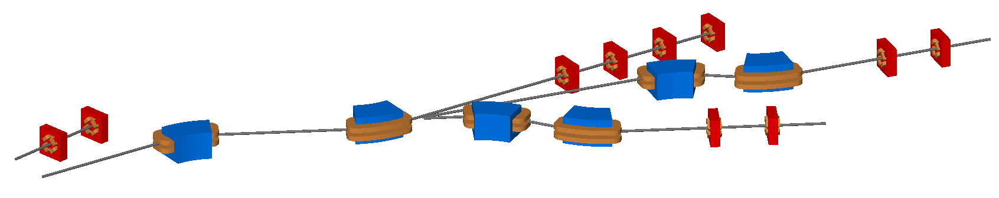

The drift segments do not of course connect but are merely placed close to each other.
In future, continuous vacuum points will be provided.

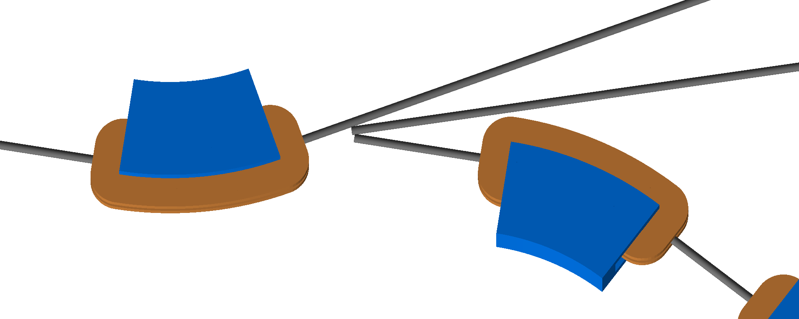

.. _detectors:

Detectors
---------

BDSIM allows the definition of detectors in the simulation. These are objects to represent
real detectors or measure a quantity at some place in the model including the effect of the
mass of (and therefore interaction with) the detector. Currently, there is one type of detector
that is a beam loss monitor.

.. _detectors-blms:

Beam Loss Monitors
^^^^^^^^^^^^^^^^^^

Beam loss monitors (BLMs) are simple detectors that give one integrated value per event. The
quantity to be generated can be chosen and the shape and location of the BLM can also be chosen.
Below are the available parameters. A BLM is created using the `blm` command.::

  detectorname, blm, parameter=value...

Either a simple geometric shape can be used, which is a single volume of one material, or a
user supplied geometry file can be used.

The quantity produced by the BLM per event is defined using a scorer (see :ref:`scorer`) and
attached to the BLM with the `scoreQuantity` parameter. If this is not defined, it is simply
passive material.

The BLM signals are put in a 1D histogram for each scorer used with any BLM where each bin
is a BLM in order it appears in construction. If a certain scorer isn't attached to a BLM, the
corresponding bin in that scorer histogram will always be 0. The best way to view the BLM signals
from a run is to use `rebdsimHistoMerge` as described in :ref:`output-analysis-quick-recipes`. See
also :ref:`detectors-blm-output`.

The placement parameters are the same as the general placements (see :ref:`placements`). So the
BLM can be placed with respect to a beam line element or generally in curvilinear coordinates, or
in global Cartesian coordinates.

Bias objects may be attached to a BLM via the :code:`bias` attribute. This names a defined
bias object (see :ref:`physics-bias-cross-section-biasing`). This is applied to all logical
volumes in the BLM.

.. note:: If multiple BLMs use the same external geometry file, the biasing
	  will be applied to all of them as there is only one copy of the geometry in memory.
  
+-------------------------+--------------------------------------------------------------------+
| **Parameter**           |  **Description**                                                   |
+-------------------------+--------------------------------------------------------------------+
| geometryType            | Name of simple geometry to use ("cylinder", "cube", "sphere")      |
+-------------------------+--------------------------------------------------------------------+
| blmMaterial             | Name of material to use for simple geometry                        |
+-------------------------+--------------------------------------------------------------------+
| blm1                    | BLM shape parameter 1 - different depending on the shape used      |
+-------------------------+--------------------------------------------------------------------+
| blm2                    | BLM shape parameter 2                                              |
+-------------------------+--------------------------------------------------------------------+
| blm3                    | BLM shape parameter 2                                              |
+-------------------------+--------------------------------------------------------------------+
| blm4                    | BLM shape parameter 2                                              |
+-------------------------+--------------------------------------------------------------------+
| scoreQuantity           | Name of a scorer object that should be used for record a quantity  |
|                         | in the BLM. See :ref:`scorer`.                                     |
+-------------------------+--------------------------------------------------------------------+
| x                       | Offset in global x                                                 |
+-------------------------+--------------------------------------------------------------------+
| y                       | Offset in global y                                                 |
+-------------------------+--------------------------------------------------------------------+
| z                       | Offset in global z                                                 |
+-------------------------+--------------------------------------------------------------------+
| s                       | Curvilinear s coordinate (global | local depending on parameters)  |
+-------------------------+--------------------------------------------------------------------+
| phi                     | Euler angle phi for rotation                                       |
+-------------------------+--------------------------------------------------------------------+
| theta                   | Euler angle theta for rotation                                     |
+-------------------------+--------------------------------------------------------------------+
| psi                     | Euler angle psi for rotation                                       |
+-------------------------+--------------------------------------------------------------------+
| axisX                   | Axis angle rotation x-component of unit vector                     |
+-------------------------+--------------------------------------------------------------------+
| axisY                   | Axis angle rotation y-component of unit vector                     |
+-------------------------+--------------------------------------------------------------------+
| axisZ                   | Axis angle rotation z-component of unit vector                     |
+-------------------------+--------------------------------------------------------------------+
| angle                   | Axis angle, angle to rotate about unit vector                      |
+-------------------------+--------------------------------------------------------------------+
| axisAngle               | Boolean whether to use axis angle rotation scheme (default false)  |
+-------------------------+--------------------------------------------------------------------+
| referenceElement        | Name of element to place geometry with respect to (string)         |
+-------------------------+--------------------------------------------------------------------+
| referenceElementNumber  | Occurrence of `referenceElement` to place with respect to if it    |
|                         | is used more than once in the sequence. Zero counting.             |
+-------------------------+--------------------------------------------------------------------+
| geometryFile            | Optional file to use for geometry of BLM including format          |
+-------------------------+--------------------------------------------------------------------+
| side                    | Optional which side of `referenceElement` the BLM is placed with   |
|                         | respect to. One of :code:`left`, :code:`right`, :code:`top` and    |
|                         | :code:`bottom`.                                                    |
+-------------------------+--------------------------------------------------------------------+
| sideOffset              | Distance from the (square) extent of an object the BLM is placed.  |
+-------------------------+--------------------------------------------------------------------+
| bias                    | Name of bias object to apply to all volumes in the BLM.            |
+-------------------------+--------------------------------------------------------------------+

BLM Shapes
**********

For each shape, the shape parameters ("blm1", "blm2", "blm3", "blm4") have different meanings. These
are described below. NA means non-applicable to this shape.

+-----------------+--------------------------+-----------------------+-----------------------+---------------+
| **Shape**       | **blm1**                 | **blm2**              | **blm3**              | **blm4**      |
+=================+==========================+=======================+=======================+===============+
| cylinder        | half length along axis   | radius                | NA                    | NA            |
+-----------------+--------------------------+-----------------------+-----------------------+---------------+
| cube            | half length in x         | half length in y      | half length in z      | NA            |
+-----------------+--------------------------+-----------------------+-----------------------+---------------+
| sphere          | radius                   | NA                    | NA                    | NA            |
+-----------------+--------------------------+-----------------------+-----------------------+---------------+

.. _detectors-blm-output:

BLM Output
**********

BLM signals (integrals / scores per event per BLM) are stored in 1D histograms alongside other 1D
histograms such as the usual energy deposition histogram. There is 1 histogram per scorer used in any
BLM. All BLM histograms have the same number of bins which is the total number of BLMs in the model and
they are in the order they are constructed in the input. Here is an example that will clarify. This
example can be found in :code:`bdsim/examples/features/detectors/blms/blm-output-example.gmad`.

::

  r1: rcol, l=10*m, horizontalWidth=1*cm, material="Al";
  l1: line=(r1);
  use, l1;

  beam, particle="e-",
        energy=10*GeV;

  option, physicsList="em";

  chrg: scorer, type="cellcharge";
  dose: scorer, type="depositeddose";
  eDep: scorer, type="depositedenergy";

  BLM_t1: blm, s=10*cm,
               side="top",
	       geometryType="cylinder",
	       blmMaterial="Al",
	       blm1=2*cm,
	       blm2=1*cm,
	       scoreQuantity="eDep dose chrg";

  BLM_t2: blm, s=5*cm,
               side="left",
	       geometryType="cylinder",
	       blmMaterial="Al",
	       blm1=2*cm,
	       blm2=1*cm,
	       scoreQuantity="dose eDep";

  BLM_t3: blm, s=30*cm,
               side="top",
	       geometryType="cylinder",
	       blmMaterial="Al",
	       blm1=2*cm,
	       blm2=1*cm,
	       scoreQuantity="chrg dose";

This model creates a scene with 1x 10m long block of aluminium (a closed rcol) and a beam of 10 GeV
electrons fired into it. 3 different scorers are used ("chrg", "dose" and "eDep"). However, only 1 BLM
("BLM_t1") uses all 3.

The output will contain 3 histograms (1 for each scorer used with a BLM) containing 3 bins (1 for each BLM).
The histograms will be called "BLM_chrg", "BLM_dose" and "BLM_eDep". The second bin of the BLM_chrg histogram
(bin index #1) will always be 0 as the 2nd BLM (in order of construction) "BLM_t2" does not use the "chrg"
scorer. This is done so that a given BLM is always in the same bin in all BLM histograms.

.. note:: The 2nd bin in each output histogram (bin index #1) will be for "BLM_t2" as it is the second
	  to be constructed, even though it is placed geometrically before "BLM_t1" with respect to the
	  beam line (s = 5cm vs s = 10cm).

The model was run with 10 events and the output summarised using `rebdsimHistoMerge`. ::

  bdsim --file=blm-output-example.gmad --outfile=t1 --batch --ngenerate=10
  rebdsimHistoMerge t1.root t1-histos.root
  root -l t1-histos.root
  > TBrowser tb;

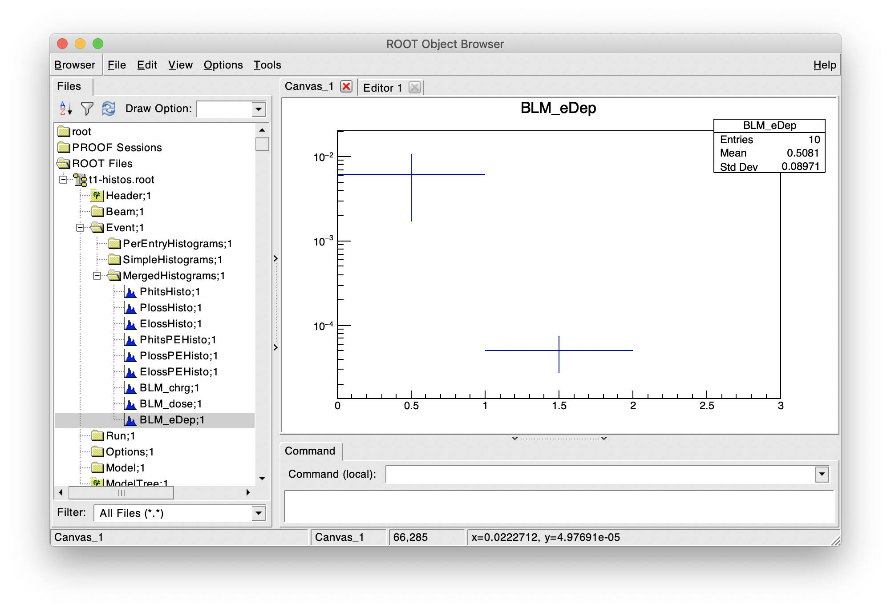

            Preview of "eDep" scorer histogram for all BLMs from above example. 3rd bin is empty
            as the 3rd BLM doesn't use this scorer.

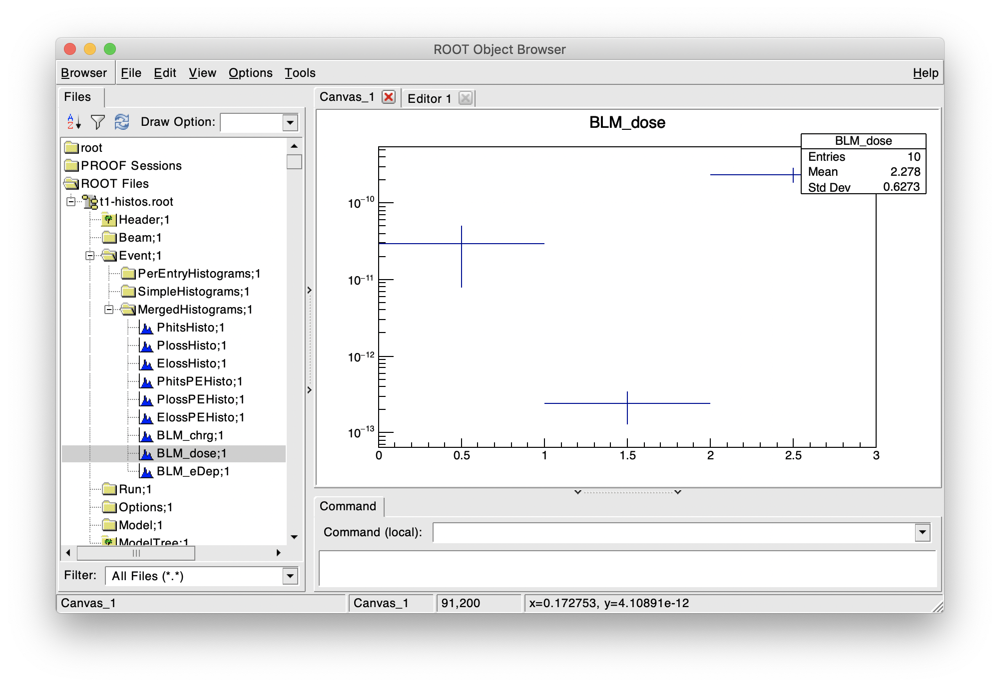

            Preview of "dose" scorer histogram for all BLMs from above example. All bins are filled
            as all BLMs use this scorer.

Examples
********

1) A simple sphere made of nitrogen. It's placed at 2.3 metres along the beam line with a transverse offset
   (in curvilinear coordinates) of 40 cm horizontally and 25 cm vertically. The sphere radius is 20 cm.

   ::

      minidetector: blm, s=2.3*m, x=0.4*m, y=0.25*m,
	      	    geometryType="sphere",
		    blmMaterial="N",
		    blm1=20*cm;

2) A simple cylinder made of silicon. It's placed globally with an offset in x of 3.2 m and y of 25 cm.

   ::
      
      minidetector: blm, x=3.2*m, y=0.25*m,
	      	    geometryType="cylinder",
		    blmMaterial="Si",
		    blm1=20*cm,
		    blm2=5*cm;

3) User defined geometry in a GDML file.

   ::
      
      blmdose: scorer, type="depositedenery";
      minidetector: blm, x=0.4*m, y=0.25*m,
                    geometryFile="gdml:simpleshape.gdml",
		    blmMaterial="N",
		    blm1=20*cm,
		    blm2=5*cm,
		    scorerQuantity="blmdose";
