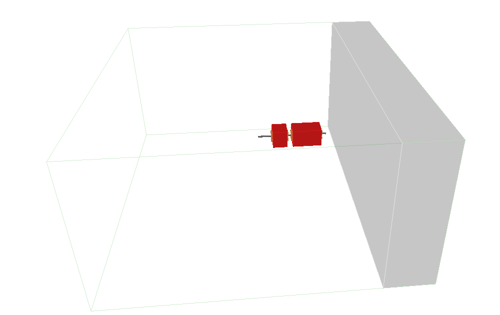
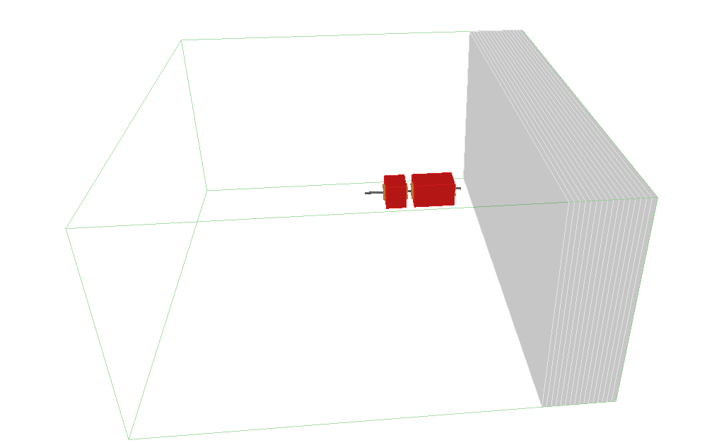
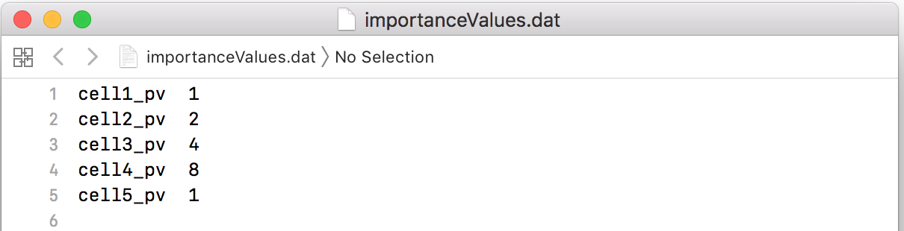
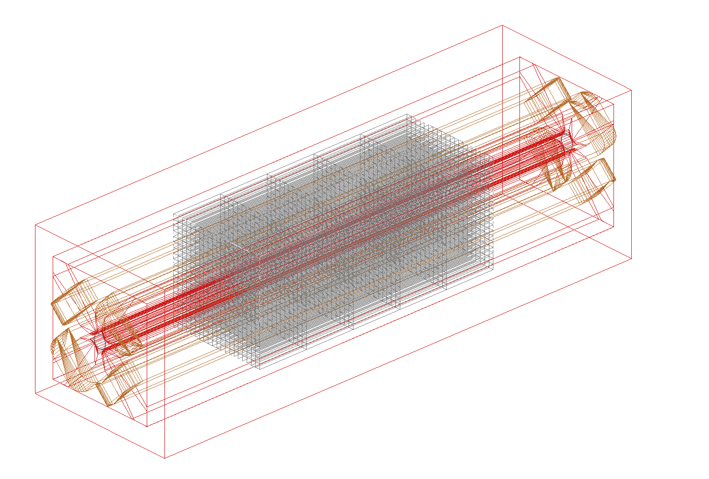
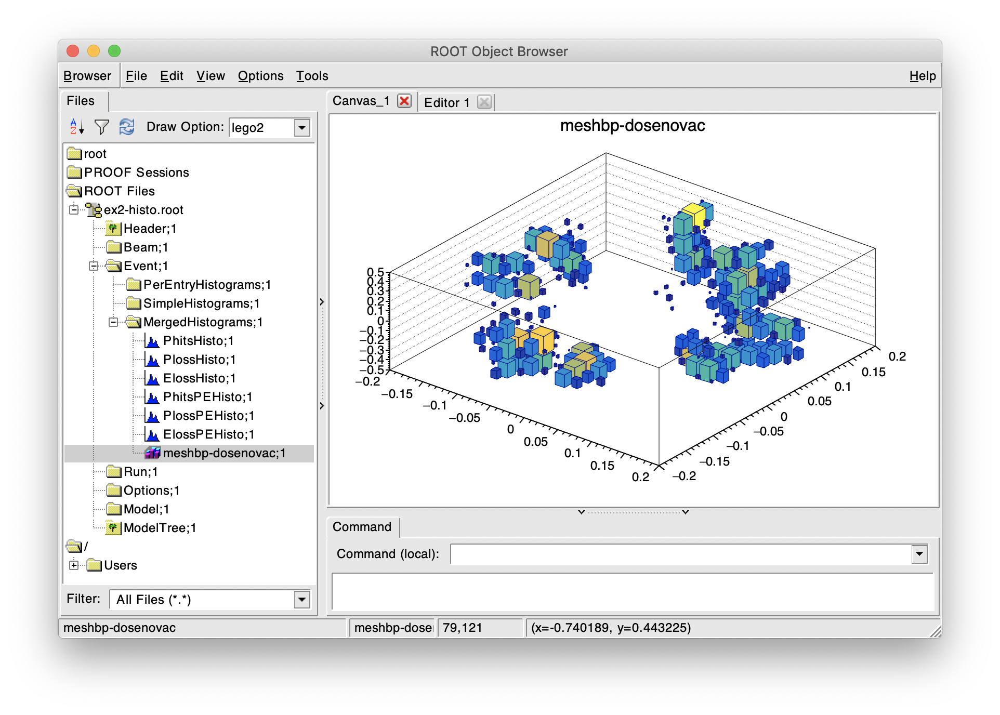

.. macro for non breaking white space useful or units:
.. |nbsp| unicode:: 0xA0
   :trim:
      
.. _model-control:

=============
Model Control
=============

* :ref:`random-engine`
* :ref:`beam-parameters`

  - :ref:`beam-distributions`
  - :ref:`beam-distributions-file-based`
    
* :ref:`physics-processes`

  - :ref:`physics-modular-physics-lists`
  - :ref:`physics-geant4-lists`
  - :ref:`physics-complete-lists`

* :ref:`physics-biasing`

  - :ref:`physics-bias-cross-section-biasing`
  - :ref:`physics-bias-importance-sampling`
  - :ref:`physics-bias-muon-splitting`
    
* :ref:`bdsim-options`
  - including :ref:`beamline-offset`
    
* :ref:`sampler-output`

  - :ref:`sampler-syntax`
  - :ref:`sampler-dimensions`
  - :ref:`sampler-visualisation`
  - :ref:`user-sampler-placement`

* :ref:`scoring`

  - :ref:`scoring-mesh`
  - :ref:`scorer`
  - :ref:`scorer-types`
  - :ref:`scorer-conversion-factor-file`

* :ref:`controlling-simulation-speed`
* More details about :ref:`bend-tracking-behaviour`

.. _random-engine:

Random Engine
-------------

BDSIM, like Geant4 uses CLHEP for pseudo-random number generation. BDSIM requires Geant4 to be
compiled with respect to a system installation of CLHEP and not the partially included one inside
Geant4. This is because we require the full set of classes from CLHEP for beam coordinate generation
but these classes aren't available in the limited version in Geant4. If we permit Geant4 to use its
own internal CLHEP and BDSIM to use the system CLHEP, we can end up with two random number generators
and the simulation is not reproducible. Therefore we prevent this behaviour at compilation.

BDSIM uses the HepJamesRandom CLHEP engine by default. This was traditionally the default pseudo-random
number engine used in Geant4 until recently. Now, Geant4 uses CLHEP's MixMax engine. BDSIM explicitly
sets the engine to HepJamesRandom so the same engine is used by Geant4 and BDSIM.

This behaviour can be controlled by the option :code:`randomEngine`. ::

  option, randomEngine="hepjames";
  option, randomEngine="mixmax";

Examples are included in :code:`bdsim/examples/features/beam/random-engine*`.
  
.. _beam-parameters:

Beam Parameters
---------------

BDSIM starts each event in one of the following ways:

#) Particles coordinates for one particle are generated from a chosen beam distribution,
   which is specified in the input GMAD file. In most cases, the particle coordinates
   are randomly generated according to a distribution. But this also includes reading
   from a **text file**.

#) A primary vertex is loaded from an event generator file. This currently requires compiling
   BDSIM with HepMC3 to load such files. In this case, each event may start with 1 or more particles.
   (see `eventgeneratorfile`_).

#) Hits are loaded from a sampler in BDSIM output file and launched at any location in the
   simulation - not necessarily in the same position or same model as they were generated in.
   See :ref:`beam-bdsimsampler`.

To specify the input particle distribution, the :code:`beam` command is
used. This also specifies the particle species and **reference total energy**, which is the
design total energy of the machine. This is used along with the particle species to calculate
the momentum of the reference particle and therefore the magnetic rigidity that normalised magnetic
field strengths are calculated with respect to. For example, the field of dipole magnets
is calculated using this if only the `angle` parameter has been specified.

Apart from the design particle and energy, a beam of particles of a different species and total
energy may be specified. By default, if only one particle is specified this is assumed to be
both the design particle and the particle used for the beam distribution.

.. note:: `energy` here is the **total energy** of the particle. This must be greater than
	  the rest mass of the particle.

* The user **must** specify at least one of [:code:`energy`, :code:`kineticEnergy`,
  :code:`momentum`] as well as :code:`particle`. 
* The central energy of the distribution can be specified (if different) with :code:`E0`.
* If no distribution is specified, the `reference`_ distribution is the default.

A few minimal examples of beam definition are::

  beam, particle="proton",
        energy=34.2*GeV;

  beam, particle="2212",
        kineticEnergy=230*MeV;

  beam, particle="e-",
        momentum=600*MeV;

Other parameters, such as the beam distribution type, :code:`distrType`, are optional and can
be specified as described in the following sections.

.. _beam-particle-type:

Beam Particle Type
^^^^^^^^^^^^^^^^^^

The beam particle may be specified by name
as it is in Geant4 (exactly) or by its PDG ID. The follow are available by default:

* `e-` or `e+`
* `proton` or `anti_proton`
* `gamma`
* `neutron`
* `mu-` or `mu+`
* `pi-` or `pi+` or `pi0`
* `photon` or `gamma`
* `kaon-`, `kaon+`, `kaon0L`, `kaon0S`, `kaon0` (a `kaon0` immediately 'decay's into either `kaon0S` or `kaon0L` in Geant4)
* `nu_e`, `nu_mu`, `nu_tau`, `anti_nu_e`, `anti_nu_mu`, `anti_nu_tau`

In fact, the user may specify any particle that is available through the physics list
used. If given by name, the particle must be given by the Geant4 name exactly (case sensitive).
The particle names above are always defined and so can always safely be used irrespective of the physics
list used. If the particle definition is not found, BDSIM will print a warning and exit.

If more exotic particles are desired but no corresponding physics processes are desired, then
the special physics list **"all_particles"** can be used to only load the particle definitions.

The Geant4 particle names can be found by executing BDSIM with the following command: ::

  bdsim --file=yourmodel.gmad --batch --printPhysicsProcesses

This will print each particle available in the model by the Geant4 name as well as the
physics processes registered to that particle.

The PDG IDs can be found at the PDG website; reviews and tables; Monte Carlo Numbering Scheme.

* `<https://pdg.lbl.gov/2020/reviews/rpp2020-rev-monte-carlo-numbering.pdf>`_

Ion Beams
*********

The user may also specify any ion with the following syntax::

  beam, particle="ion A Z";

or::

  beam, particle="ion A Z Q";

where `A`, `Z` and `Q` should be replaced by the atomic mass number (an integer),
the number of protons in the nucleus, and the charge respectively. The charge is
optional and by default is Z (i.e. a fully ionised ion).  For example: ::

  beam, particle="ion 12 6",
        energy = 52 * GeV;

* The user should take care to use a physics list that includes ion physics processes.

Available input distributions and their associated parameters are described in the following
section.

Different Beam and Design Particles
^^^^^^^^^^^^^^^^^^^^^^^^^^^^^^^^^^^

The model may use one particle for design and one for the beam distribution. The "design" particle
is used to calculate the rigidity that is used along with normalised field strengths (such as
:code:`k1` for quadrupoles) to calculate an absolute field or field gradient. However, it is
often useful to simulate a beam of other particles.  To specify a different particle, the parameter
:code:`beamParticleName` should be used. For a different energy or kinetic energy or momentum, (only)
one of :code:`E0`, :code:`Ek0`, :code:`P0` should be used.

Examples: ::

   beam, particle="e-",
         energy=100*GeV,
	 beamParticleName="e+";

This (above) specifies that the magnet field strengths are calculated with respect to a 100 GeV electron
but the beam fired into the model is a 100 GeV positron beam (along with any other relevant distribution
parameters). ::

   beam, particle="e-",
         energy=100*GeV,
	 beamParticleName="e+",
	 E0=20*GeV;

This (above) specifies that the magnet field strengths are calculated with respect to a 100 GeV electron
and the beam fired into the model is a 20 GeV positron beam. ::

  beam, particle="e-",
        momentum=20.3*GeV,
	beamParticleName="proton";

This (above) defines a machine designed with respect to an electron beam with 20.3 GeV of momentum but
uses a beam of protons with the exact same momentum (kinetic energy and total energy are calculated
from this value given the proton's mass).

* If no :code:`beamParticleName` variable is specified, it's assumed to be the same as :code:`particle`.
* If no :code:`E0` variable is specified, it's assumed to be the same as :code:`energy`.
* If no :code:`beamParticleName` is given but one of :code:`E0`, :code:`Ek0`, :code:`P0` are given,
  the same particle is assumed as :code:`particle` but with a different energy.

Beam Energy From the Command Line
^^^^^^^^^^^^^^^^^^^^^^^^^^^^^^^^^

The energy of the beam can also be controlled using executable options to override what is provided
in the input GMAD files. The following executable options can be used (with example value of 123.456 GeV):

* :code:`--E0=123.456`
* :code:`--Ek0=123.456`
* :code:`--P0=123.456`

This makes it easy to run many instances of BDSIM with different energies. These update the central
energy / kinetic energy / momentum values of the beam and not the design energy / kinetic energy / momentum
so as not to affect the strength of magnetic fields. ::

  bdsim --file=target.gmad --outfile=r1 --batch --ngenerate=100 --Ek0=400

.. note:: These executable options do not accept units - only the raw number should be provided
	  and it must be in GeV.

Generate Only the Input Distribution
^^^^^^^^^^^^^^^^^^^^^^^^^^^^^^^^^^^^

BDSIM can generate only the input distribution and store it to file without creating a model or
running any physics simulation. This is very fast and can be used to verify the input distribution
with a large number of particles (for example, 10k to 100k in under one minute).

BDSIM should be executed with the option :code:`--generatePrimariesOnly` as described in
:ref:`executable-options`.

This **does not** work for `eventgeneratorfile` and `bdsimsampler` distributions.

* The exact coordinates generated will not be the same as those generated in a run, even
  with the same seed. This is because the physics models will also advanced the random
  number generator, where as with :code:`--generatePrimariesOnly`, only the bunch distribution
  generator will. For a large number of primaries (at least 100), the option
  :code:`offsetSampleMean` can be used with Gaussian distributions to pre-generate the coordinates
  before the run. In this case, they would be consistent.
* This will not work when using an event generator file. Using an event generator
  file requires the particle table in Geant4 be loaded and this can only be done
  in a full run where we construct the model. By default, the generate primaries
  only option only generates coordinates and does not build a Geant4 model.

.. warning:: In a conventional run of BDSIM, after a set of coordinates are generated, a check
	     is made to ensure the total energy chosen is greater than the rest mass of the
	     particle. This check is **not** done in the case of :code:`--generatePrimariesOnly`.
	     Therefore, it's possible to generate values of total energy below the rest mass of
	     the beam particle.

Beam in Output
^^^^^^^^^^^^^^

All of the beam parameters are stored in the output, as described in :ref:`output-beam-tree`. The
particle coordinates used in the simulation are stored directly in the Primary branch of the
Event Tree, as described in :ref:`output-event-tree`.

.. note:: These are the exact coordinates supplied to Geant4 at the beginning of the event.
	  Conceptually, these are 'local' coordinates with respect to the start of the beam
	  line. However, if a finite `S0` is specified, the bunch distribution is transformed
	  to that location in the World, therefore the coordinates are the **global** ones used.

.. warning:: For large `S0` in a large model, the particles may be displaced by a large
	     distance as compared to the size of the beam, e.g. 1km offset for 1um beam.
	     In this case, the limited precision of the `float` used to store the coordinates
	     in the output may not show the beam distribution as expected. Internally, double
	     precision numbers are used so that the beam distribution is accurate. A float typically
	     has seven significant figures and a double 15.

.. _beam-bunches:

Bunches and Time Offset
^^^^^^^^^^^^^^^^^^^^^^^

* This does not apply to :code:`eventgeneratorfile` and :code:`bdsimsampler` distributions.

BDSIM offers the feature to simulate multiple bunches at a fixed frequency. This is done as
a final step after generating the coordinates for a single particle from a bunch distribution.
The user specifies how many particles to generate for one bunch before moving on to the next.
For a given bunch, a global time offset is calculated that is added to the T coordinate of each
particle. The 'bunches' all start in the same location. The time added can be expressed as:
::

   T = T0 + t*floor(EI / eventsPerBunch)

where :code:`T0` is the offset specified in the beam distribution, :code:`t` is the
period of the bunches, :code:`floor` is the mathematical floor function, :code:`EI` is the
event index (zero counting) and `eventsPerBunch` is the beam parameter specified in the input.

This does not affect the 'local' time of the coordinates (i.e. the lower case t in the
Primary coordinates in the output), but it does affect the 'global' time (i.e. the upper
case T in the PrimaryGlobal coordinates in the output), which is the one used to place
the particle in the model at the start of an event.

.. note:: For BDSIM-generated distributions, 1 event = 1 primary particle.

Relevant beam parameters:

.. tabularcolumns:: |p{5cm}|p{6cm}|p{2cm}|
		      
+----------------------------------+-------------------------------------------------------+----------+
| Option                           | Description                                           | Default  |
+==================================+=======================================================+==========+
| `bunchFrequency`                 | Frequency in Hz of bunches                            | 0 \*     |
+----------------------------------+-------------------------------------------------------+----------+
| `bunchPeriod`                    | Separation in time (s) of bunches                     | 0 \*     |
+----------------------------------+-------------------------------------------------------+----------+
| `eventsPerBunch`                 | Number of events to simulate with each bunch index    | 0        |
+----------------------------------+-------------------------------------------------------+----------+

* \* One and only one of :code:`bunchFrequency` and :code:`bunchPeriod` must be specified if
  :code:`eventsPerBunch` is greater than 0 which implies we want bunches.

Example:
::

   beam, particle="e-",
         kineticEnergy=1*GeV,
	 distrType="gauss",
	 sigmaX=10*um,
	 sigmaY=10*um,
	 sigmaT=5*ps,
	 bunchFrequency=357*MHz,
	 eventsPerBunch=100;

This will generate particles in a Gaussian distribution with a sigma in time of 5 picoseconds
and therefore a correlated position in z (e.g. sigma z is around 1.5 mm at the speed of light).
The first 100 particles will be centred on T0, which is 0 s by default. The next hundred will have
a similar x,y,z but will have a time centred on 2.8 ns (1 period of 357 MHz). The local time with
respect to the bunch (and therefore z) will still be randomly generated.

An example can be found in :code:`bdsim/examples/features/beam/bunch-frequency.gmad`.

.. note:: For :code:`--generatePrimariesOnly` the "event number" will be advanced even though
	  no events are actually simulated and therefore the time coordinate will be consistent
	  with a full run of BDSIM.

Beam Tilt
^^^^^^^^^

The possibility exists to rotate the beam after the local curvilinear coordinates are calculated
from one of the following bunch distributions. This is an angle about the local unit Z axis, i.e.
the direction of the beam by default. This is applied **after** the local coordinates are generated
by the bunch distribution and rotates, the x,y and xp,yp coordinates by an angle in radians. The
rotation is in a right-handed coordinate system.

Looking along the direction of the beam, a particle at positive X0 and zero Y0 with a tilt of
positive pi/2 will become zero X0 and finite Y0. Looking along the beam direction, the rotation
is clockwise. This is irrespective of particle charge.

The parameter that controls this is `tilt` in the beam command and is in radians. For example: ::

  beam, particle="e-",
        energy=10*GeV,
	distrType="gauss",
	sigmaX=100*um,
	sigmaY=1*um,
	sigmaXp=1e-8,
	sigmaYp=1e-10,
	tilt=0.01;

Here a beam 100 x 1 um is generated as a Gaussian and then rotated by 0.01 radians.

.. _beam-distributions:

Beam Distributions
^^^^^^^^^^^^^^^^^^
The following beam distributions are available in BDSIM

**No Variation**
- `reference`_ (a 'pencil' beam)

**Gaussian**
- `gaussmatrix`_
- `gauss`_
- `gausstwiss`_

**Uniform Type**
- `circle`_
- `square`_
- `ring`_
- `eshell`_
- `sphere`_
- `box`_
- `halo`_
- `halosigma`_

**Composite**
- `composite`_
- `compositespacedirectionenergy`_

**File-Based** (see :ref:`beam-distributions-file-based`)

- `userfile`_
- `ptc`_
- `eventgeneratorfile`_
- `bdsimsampler`_

.. note:: For `gauss`_, `gaussmatrix`_ and `gausstwiss`_, the beam option `beam, offsetSampleMean=1`
	  documented in :ref:`developer-options` can be used to pre-generate all particle coordinates and
	  subtract the sample mean from these, effectively removing any small systematic offset in
	  the bunch at the beginning of the line. This is used only for optical comparisons currently.

reference
*********

This is a single particle with the same position and angle defined by the following parameters. The
coordinates are the same for every particle fired using the reference distribution. It is therefore
not likely to be useful to generate a large number of repeated events with this distribution unless
the user wishes to explore the different outcome from the physics processes, which will be different
each time should the particle interact. This distribution may be referred to as a 'pencil' distribution
by other codes.

These parameters also act as **central** parameters for all other distributions. For example, a Gaussian
distribution may be defined with the `gauss`_ parameters, but with `X0` set to offset the centroid of the
Gaussian with respect to the reference trajectory. Note: **energy** is **total energy** of the
particle - including the rest mass.

  .. tabularcolumns:: |p{5cm}|p{6cm}|p{2cm}|

+----------------------------------+-------------------------------------------------------+----------+
| Option                           | Description                                           | Default  |
+==================================+=======================================================+==========+
| `X0`                             | Horizontal position [m]                               | 0        |
+----------------------------------+-------------------------------------------------------+----------+
| `Y0`                             | Vertical position [m]                                 | 0        |
+----------------------------------+-------------------------------------------------------+----------+
| `Z0`                             | Longitudinal position [m]                             | 0        |
+----------------------------------+-------------------------------------------------------+----------+
| `S0`                             | Curvilinear S offset [m]                              | 0        |
+----------------------------------+-------------------------------------------------------+----------+
| `T0`                             | Longitudinal position [s]                             | 0        |
+----------------------------------+-------------------------------------------------------+----------+
| `Xp0`                            | Horizontal component momentum of unit vector          | 0        |
+----------------------------------+-------------------------------------------------------+----------+
| `Yp0`                            | Vertical component momentum of unit vector            | 0        |
+----------------------------------+-------------------------------------------------------+----------+
| `E0`                             | Central total energy of bunch distribution (GeV)      | 'energy' |
+----------------------------------+-------------------------------------------------------+----------+
| `Ek0`                            | Central kinetic energy of bunch distribution (GeV)    | \*       |
+----------------------------------+-------------------------------------------------------+----------+
| `P0`                             | Central momentum of bunch distribution (GeV)          | \*       |
+----------------------------------+-------------------------------------------------------+----------+

* \* Only one of :code:`E0`, :code:`Ek0` and :code:`P0` can be set. The others are calculated from
  that value.
* `S0` allows the beam to be translated to a certain point in the beam line, where the beam
  coordinates are with respect to the curvilinear frame at that point in the beam line.
* `S0` and `Z0` cannot both be set - BDSIM will exit with a warning if this conflicting input is given.
* If `S0` is used, the local coordinates are generated and then transformed to that point in the beam line.
  Each set of coordinates will be stored in the output under `Primary` (local) and `PrimaryGlobal` (global).

Examples: ::

  beam, particle = "e-",
        energy = 10*GeV,
	distrType = "reference";

Generates a beam with all coordinates=0 at the nominal energy. ::

  beam, particle = "e-",
        energy = 10*GeV,
	distrType = "reference",
	X0 = 100*um,
	Y0 = 3.5*um;

Generates a particle with an offset of 100 :math:`\mu\mathrm{m}` horizontally and 3.5
:math:`\mu\mathrm{m}` vertically.

gaussmatrix
***********

Uses the :math:`N` dimensional Gaussian generator from `CLHEP`, `CLHEP::RandMultiGauss`. The generator
is initialised by a :math:`6\times1` means vector and :math:`6\times 6` sigma matrix.

* All parameters from `reference`_ distribution are used as centroids.

.. tabularcolumns:: |p{5cm}|p{10cm}|

+------------------+-----------------------------------+
| Option           | Description                       |
+==================+===================================+
| `sigmaNM`        | Sigma matrix element (N,M)        |
+------------------+-----------------------------------+

* Only the upper-right half of the matrix and diagonal should be populated, as the
  elements are symmetric across the diagonal.
* The coordinates are in order 1:`x` (m), 2:`xp`, 3:`y` (m), 4:`yp`, 5:`t` (s), 6:`E` (GeV).

The user should take care to ensure they specify a positive definite matrix. BDSIM will
emit an error and stop running if this is not the case.

Examples: ::

   beam, particle = "e-",
         energy = 10*GeV,
	 distrType = "gaussmatrix",
	 sigma11 = 100*um,
	 sigma22 = 3*um,
	 sigma33 = 50*um,
	 sigma44 = 1.4*um,
	 sigma55 = 1e-12
	 sigma66 = 1e-4,
	 sigma12 = 1e-2,
	 sigma34 = 1.4e-3;

.. note:: One should take care in defining, say, sigma16, as this is the covariance of the `x` position
	  and energy. However, this may be proportional to momentum and not total energy. Note, for such
	  a *correlation* between `x` and `E`, other off-diagonal terms in the covariance matrix should
	  be finite also.

gauss
*****

Uses the `gaussmatrix`_ beam generator but with simplified input parameters, as opposed to a complete
beam sigma matrix. This beam distribution has a diagonal :math:`\sigma`-matrix and does not allow for
correlations between phase space coordinates, so:

.. math::
   \sigma_{11} & =  \sigma_x^2   \\
   \sigma_{22} & =  \sigma_x^{\prime 2}  \\
   \sigma_{33} & =  \sigma_y^2   \\
   \sigma_{44} & =  \sigma_y^{\prime 2}  \\
   \sigma_{55} & =  \sigma_{T}^2 \\
   \sigma_{66} & =  \sigma_{E}^2.

* The coordinates are in order 1:`x` (m), 2:`xp`, 3:`y` (m), 4:`yp`, 5:`t` (s), 6:`E` (GeV).
* All parameters from `reference`_ distribution are used as centroids.
* Either :code:`sigmaE`, :code:`sigmaEk` or :code:`sigmaP` can be specified, but not more than one.

In the case :code:`sigmaP` is specified, :code:`sigmaE` is calculated as follows:

.. math::
   \frac{dE}{E} = (\beta_{Lorentz}^2) \frac{dP}{P}

for the beam particle. In the case :code:`sigmaEk` is specified, :code:`sigmaE` is calculated
as follows:

.. math::
   \frac{dEk}{Ek} = \frac{E}{Ek} \frac{dE}{E}

and :code:`sigmaP` is subsequently calculated as above from this.

.. tabularcolumns:: |p{5cm}|p{10cm}|

+------------------+----------------------------------------------------+
| Option           | Description                                        |
+==================+====================================================+
| `sigmaX`         | Horizontal Gaussian sigma [m]                      |
+------------------+----------------------------------------------------+
| `sigmaY`         | Vertical Gaussian sigma [m]                        |
+------------------+----------------------------------------------------+
| `sigmaXp`        | Sigma of the horizontal component of unit momentum |
+------------------+----------------------------------------------------+
| `sigmaYp`        | Sigma of the vertical component of unit momentum   |
+------------------+----------------------------------------------------+
| `sigmaE`         | **Relative** energy spread :math:`\sigma_{E}/E`    |
+------------------+----------------------------------------------------+
| `sigmaEk`        | **Relative** energy spread :math:`\sigma_{Ek}/Ek`  |
+------------------+----------------------------------------------------+
| `sigmaP`         | **Relative** momentum spread :math:`\sigma_{P}/P`  |
+------------------+----------------------------------------------------+
| `sigmaT`         | Sigma of the temporal distribution [s]             |
+------------------+----------------------------------------------------+

gausstwiss
**********

The beam parameters are defined by the usual Twiss parameters (listed below in full)
:math:`\alpha`, :math:`\beta` and :math:`\gamma`, plus dispersion :math:`\eta`, from
which the beam :math:`\sigma` -matrix is calculated, using the following equations:

.. math::
   \sigma_{11} & =  \epsilon_x \beta_x + \eta_{x}^{2}\sigma_{P}^{2} \\
   \sigma_{12} & = -\epsilon_x \alpha_x + \eta_{x}\eta_{xp}\sigma_{P}^{2}\\
   \sigma_{21} & = -\epsilon_x \alpha_x + \eta_{x}\eta_{xp}\sigma_{P}^{2}\\
   \sigma_{22} & =  \epsilon_x \gamma_x + \eta_{xp}^{2}\sigma_{P}^{2}\\
   \sigma_{33} & =  \epsilon_y \beta_y + \eta_{y}^{2}\sigma_{P}^{2}\\
   \sigma_{34} & = -\epsilon_y \alpha_y + \eta_{y}\eta_{yp}\sigma_{P}^{2}\\
   \sigma_{43} & = -\epsilon_y \alpha_y + \eta_{y}\eta_{yp}\sigma_{P}^{2}\\
   \sigma_{44} & =  \epsilon_y \gamma_y + \eta_{yp}^{2}\sigma_{P}^{2}\\
   \sigma_{13} & = \eta_{x}\eta_{y}\sigma_{P}^{2}\\
   \sigma_{31} & = \eta_{x}\eta_{y}\sigma_{P}^{2}\\
   \sigma_{23} & = \eta_{xp}\eta_{y}\sigma_{P}^{2}\\
   \sigma_{32} & = \eta_{xp}\eta_{y}\sigma_{P}^{2}\\
   \sigma_{14} & = \eta_{x}\eta_{yp}\sigma_{P}^{2}\\
   \sigma_{41} & = \eta_{x}\eta_{yp}\sigma_{P}^{2}\\
   \sigma_{24} & = \eta_{xp}\eta_{yp}\sigma_{P}^{2}\\
   \sigma_{42} & = \eta_{xp}\eta_{yp}\sigma_{P}^{2}\\
   \sigma_{16} & = \eta_{x}\sigma_{P}^{2}\\
   \sigma_{61} & = \eta_{x}\sigma_{P}^{2}\\
   \sigma_{26} & = \eta_{xp}\sigma_{P}^{2}\\
   \sigma_{62} & = \eta_{xp}\sigma_{P}^{2}\\
   \sigma_{36} & = \eta_{y}\sigma_{P}^{2}\\
   \sigma_{63} & = \eta_{y}\sigma_{P}^{2}\\
   \sigma_{46} & = \eta_{yp}\sigma_{P}^{2}\\
   \sigma_{64} & = \eta_{yp}\sigma_{P}^{2}\\
   \sigma_{55} & = \sigma_{T}^2 \\
   \sigma_{66} & = \sigma_{P}^2

* All parameters from `reference`_ distribution are used as centroids.
* `sigmaE` or `sigmaP` may be specified in the beam command and
  one is calculated from the other.

.. tabularcolumns:: |p{5cm}|p{10cm}|

+----------------------------------+-------------------------------------------------------+
| Option                           | Description                                           |
+==================================+=======================================================+
| `emitx`                          | Horizontal beam core geometric emittance [m rad]      |
+----------------------------------+-------------------------------------------------------+
| `emity`                          | Vertical beam core geometric emittance [m rad]        |
+----------------------------------+-------------------------------------------------------+
| `emitnx`                         | Horizontal beam core normalised emittance [m rad] \*  |
+----------------------------------+-------------------------------------------------------+
| `emitny`                         | Vertical beam core normalised emittance [m rad] \*    |
+----------------------------------+-------------------------------------------------------+
| `betx`                           | Horizontal beta function [m]                          |
+----------------------------------+-------------------------------------------------------+
| `bety`                           | Vertical beta function [m]                            |
+----------------------------------+-------------------------------------------------------+
| `alfx`                           | Horizontal alpha function                             |
+----------------------------------+-------------------------------------------------------+
| `alfy`                           | Vertical alpha function                               |
+----------------------------------+-------------------------------------------------------+
| `dispx`                          | Horizontal dispersion function [m]                    |
+----------------------------------+-------------------------------------------------------+
| `dispy`                          | Vertical dispersion function [m]                      |
+----------------------------------+-------------------------------------------------------+
| `dispxp`                         | Horizontal angular dispersion function                |
+----------------------------------+-------------------------------------------------------+
| `dispyp`                         | Vertical angular dispersion function                  |
+----------------------------------+-------------------------------------------------------+
| `sigmaE`                         | Normalised energy spread                              |
+----------------------------------+-------------------------------------------------------+
| `sigmaP`                         | Normalised momentum spread                            |
+----------------------------------+-------------------------------------------------------+

* (\*) Only one of :code:`emitx` or :code:`emitnx` (similarly in y) can be set.

circle
******

Beam of randomly distributed particles with a uniform distribution within a circle in each
dimension of phase space - `x` & `xp`; `y` & `yp`, `T` & `E` with each uncorrelated.
Each parameter defines the maximum absolute extent in that dimension, i.e. the possible values
`x` values range from `-envelopeR` to `envelopeR` for example. Total
energy is also uniformly distributed between :math:`\pm` `envelopeE`. No distribution in `z`.

* All parameters from `reference`_ distribution are used as centroids.

.. tabularcolumns:: |p{5cm}|p{10cm}|

+----------------------------------+-------------------------------------------------------+
| Option                           | Description                                           |
+==================================+=======================================================+
| `envelopeR`                      | Maximum radial position from central value            |
+----------------------------------+-------------------------------------------------------+
| `envelopeRp`                     | Maximum radial component of unit momentum vector      |
+----------------------------------+-------------------------------------------------------+
| `envelopeT`                      | Maximum time offset [s]                               |
+----------------------------------+-------------------------------------------------------+
| `envelopeE`                      | Maximum energy offset [GeV]                           |
+----------------------------------+-------------------------------------------------------+

square
******

Particles are randomly uniformly distributed within a square in each phase space dimension,
i.e. (x,xp) and (y,yp). Each parameter defines the maximum absolute extent in that dimension,
i.e. the possible values `x` values range from `-envelopeX` to `+envelopeX`. The total
energy is also uniformly distributed between :math:`\pm` `envelopeE`.

* All parameters from `reference`_ distribution are used as centroids.
* All dimensions are uncorrelated.
* Default values of envelopes are 0.

.. tabularcolumns:: |p{5cm}|p{10cm}|

+----------------------------------+-------------------------------------------------------+
| Option                           | Description                                           |
+==================================+=======================================================+
| `envelopeX`                      | Maximum position in X [m]                             |
+----------------------------------+-------------------------------------------------------+
| `envelopeXp`                     | Maximum component in X of unit momentum vector        |
+----------------------------------+-------------------------------------------------------+
| `envelopeY`                      | Maximum position in Y [m]                             |
+----------------------------------+-------------------------------------------------------+
| `envelopeYp`                     | Maximum component in Y of unit momentum vector        |
+----------------------------------+-------------------------------------------------------+
| `envelopeT`                      | Maximum time offset [s]                               |
+----------------------------------+-------------------------------------------------------+
| `envelopeE`                      | Maximum energy offset [GeV]                           |
+----------------------------------+-------------------------------------------------------+
| `envelopeZ`                      | (Optional) maximum position in Z [m]                  |
+----------------------------------+-------------------------------------------------------+

Since BDSIM v1.7.0, the behaviour changed so that `z` is uncorrelated with `t`. In the previous
behaviour, `t` was sampled uniformly, then `z` calculated from :math:`c * t`. To restore this
behaviour, the parameter `zFromT` can be used. e.g. :code:`beam, zFromT=1;`.

Examples: ::

  beam, particle="e-",
        kineticEnergy=1*GeV,
	distrType="square",
	envelopeX=1*cm,
	envelopeXp=1e-3,
	envelopeY=1*cm,
	envelopeYp=1e-3,
	envelopeT=10*ns;

ring
****

The ring distribution randomly and uniformly distributes particles around a circle in `x` and `y`. Then,
for a given x,y the radius is randomly and uniformly in density distributed in that annulus. For
all other parameters, the `reference`_ coordinates are used, i.e. `xp`, `yp` etc.

* All parameters from `reference`_ distribution are used as centroids.

.. tabularcolumns:: |p{5cm}|p{10cm}|

+----------------------------------+-------------------------------------------------------+
| Option                           | Description                                           |
+==================================+=======================================================+
| `Rmin`                           | Minimum radius in `x` and `y` [m]                     |
+----------------------------------+-------------------------------------------------------+
| `Rmax`                           | Maximum radius in `x` and `y` [m]                     |
+----------------------------------+-------------------------------------------------------+

* No variation in `z`, `xp`, `yp`, `t`, `s` and total energy. Only central values.

eshell
******

Defines an elliptical annulus in phase space in each dimension that's uncorrelated.

* All parameters from `reference`_ distribution are used as centroids.

.. tabularcolumns:: |p{5cm}|p{10cm}|

+----------------------------------+--------------------------------------------------------------------+
| Option                           | Description                                                        |
+==================================+====================================================================+
| `shellX`                         | Ellipse semi-axis in phase space in horizontal position [m]        |
+----------------------------------+--------------------------------------------------------------------+
| `shellXp`                        | Ellipse semi-axis in phase space in horizontal component of unit   |
|                                  | momentum vector                                                    |
+----------------------------------+--------------------------------------------------------------------+
| `shellY`                         | Ellipse semi-axis in phase space in vertical position [m]          |
+----------------------------------+--------------------------------------------------------------------+
| `shellYp`                        | Ellipse semi-axis in phase space in vertical momentum              |
+----------------------------------+--------------------------------------------------------------------+
| `shellXWidth`                    | Spread of ellipse in phase space in horizontal position [m]        |
+----------------------------------+--------------------------------------------------------------------+
| `shellXpWidth`                   | Spread of ellipse in phase space in horizontal component of unit   |
|                                  | momentum vector                                                    |
+----------------------------------+--------------------------------------------------------------------+
| `shellYWidth`                    | Spread of ellipse in phase space in vertical position [m]          |
+----------------------------------+--------------------------------------------------------------------+
| `shellYpWidth`                   | Spread of ellipse in phase space in vertical momentum              |
+----------------------------------+--------------------------------------------------------------------+
| `sigmaE`                         | Extent of **relative** energy spread in total energy. Uniformly    |
|                                  | distributed between :math:`\pm` `sigmaE`.                          |
+----------------------------------+--------------------------------------------------------------------+
| `sigmaEk`                        | Extent of **relative** energy spread in kinetic energy. Uniformly  |
|                                  | distributed between :math:`\pm` `sigmaEk`.                         |
+----------------------------------+--------------------------------------------------------------------+
| `sigmaP`                         | Extent of **relative** energy spread in momentum.                  |
|                                  | Uniformly distributed between :math:`\pm` `sigmaP`.                |
+----------------------------------+--------------------------------------------------------------------+

* Note, 'relative' energy spread means normalised (e.g. :code:`sigmaE` = :math:`\sigma_{E}/E`)
* Only one of :code:`sigmaE`, :code:`sigmaEk` or :code:`sigmaP` can be used.
* No variation in `t`, `z`, `s`. Only central values.

	
sphere
******

The `sphere` distribution generates a distribution with a uniform random direction at one location.
Points are randomly and uniformly generated on a sphere that are used in a unit vector for the
momentum direction. This is implemented using `G4RandomDirection`, which in turn uses the
Marsaglia (1972) method.

* `Xp0`, `Yp0`, `Zp0` are ignored.
* `X0`, `Y0`, `Z0`, `S0`, `T0` can be used for the position of the source.
* No energy spread.

If an energy spread is desired, please use a :ref:`beam-composite` distribution.

An example can be found in `bdsim/examples/features/beam/sphere.gmad`. Below is an example: ::

  beam, particle = "proton",
        energy = 1.2*GeV,
	distrType = "sphere",
	X0 = 9*cm,
	Z0 = 0.5*m;

box
***

The `box` distribution generates a uniform random uncorrelated distribution in each variable.
Ultimatley, the 3-vector making the direction `xp`, `yp`, and `zp` is normalised (i.e. unit 1).
This results in an uneven distribution in these variables over the range (cube projected onto sphere).

* The values will vary from -envelope to +envelope.
* `Xp0`, `Yp0`, and `Zp0` are ignored from the reference distribution.

.. tabularcolumns:: |p{5cm}|p{9cm}|

+----------------------------------+-------------------------------------------------------+
| Option                           | Description                                           |
+==================================+=======================================================+
| `envelopeX`                      | Maximum position in X [m]                             |
+----------------------------------+-------------------------------------------------------+
| `envelopeXp`                     | Maximum component in X of unit momentum vector        |
+----------------------------------+-------------------------------------------------------+
| `envelopeY`                      | Maximum position in Y [m]                             |
+----------------------------------+-------------------------------------------------------+
| `envelopeYp`                     | Maximum component in Y of unit momentum vector        |
+----------------------------------+-------------------------------------------------------+
| `envelopeZ`                      | Maximum position in Z [m]                             |
+----------------------------------+-------------------------------------------------------+
| `envelopeZp`                     | Maximum component in Z of unit momentum vector        |
+----------------------------------+-------------------------------------------------------+
| `envelopeT`                      | Maximum time offset [s]                               |
+----------------------------------+-------------------------------------------------------+
| `envelopeE`                      | Maximum energy offset [GeV]                           |
+----------------------------------+-------------------------------------------------------+

.. _beam-halo-distribution:

halo
****

The halo distribution is effectively a flat phase space with the central beam core removed at
:math:`\epsilon_{\rm core}`. The beam core is defined using the standard Twiss parameters described
previously. The implicit general form of a rotated ellipse is

.. math::

   \gamma x^2 + 2\alpha\;x\;x^{\prime} + \beta x^{\prime 2} = \epsilon

where the parameters have their usual meanings. A phase space point can be rejected or weighted
depending on the single particle emittance, which is calculated as

.. math::
   \epsilon_{\rm SP} = \gamma x^2 + 2\alpha\;x\;x^{\prime} + \beta x^{\prime 2}

if the single particle emittance is less than beam emittance, such that :math:`\epsilon_{\rm SP} < \epsilon_{\rm core}`
the particle is rejected. `haloPSWeightFunction` is a string that selects the function
:math:`f_{\rm haloWeight}(\epsilon_{\rm SP})` which is 1 at the ellipse defined by :math:`\epsilon_{\rm core}`. The
weighting functions are either `flat`, one over emittance `oneoverr` or exponential `exp`.

.. math::
   f_{\rm haloWeight}(\epsilon_{\rm SP}) & = 1 \\
   f_{\rm haloWeight}(\epsilon_{\rm SP}) & = \left(\frac{\epsilon_{\rm core}}{\epsilon_{\rm SP}}\right)^p \\
   f_{\rm haloWeight}(\epsilon_{\rm SP}) & = \exp\left(-\frac{\epsilon_{SP}-\epsilon_{\rm core}}{p \epsilon_{\rm core}}\right)

* All parameters from `reference`_ distribution are used as centroids.

.. tabularcolumns:: |p{5cm}|p{10cm}|

+----------------------------------+-----------------------------------------------------------------------------+
| Option                           | Description                                                                 |
+==================================+=============================================================================+
| `emitx`                          | Horizontal beam core geometric emittance [m rad]                            |
|                                  | :math:`\epsilon_{{\rm core},x}`                                             |
+----------------------------------+-----------------------------------------------------------------------------+
| `emity`                          | Vertical beam core geometric emittance [m rad]                              |
|                                  | :math:`\epsilon_{{\rm core},y}`                                             |
+----------------------------------+-----------------------------------------------------------------------------+
| `emitnx`                         | Horizontal beam core geometric emittance [m rad] \*                         |
+----------------------------------+-----------------------------------------------------------------------------+
| `emitny`                         | Vertical beam core geometric emittance [m rad] \*                           |
+----------------------------------+-----------------------------------------------------------------------------+
| `betx`                           | Horizontal beta function [m]                                                |
+----------------------------------+-----------------------------------------------------------------------------+
| `bety`                           | Vertical beta function [m]                                                  |
+----------------------------------+-----------------------------------------------------------------------------+
| `alfx`                           | Horizontal alpha function                                                   |
+----------------------------------+-----------------------------------------------------------------------------+
| `alfy`                           | Vertical alpha function                                                     |
+----------------------------------+-----------------------------------------------------------------------------+
| `haloNSigmaXInner`               | Inner radius of halo in x (multiples of sigma)                              |
+----------------------------------+-----------------------------------------------------------------------------+
| `haloNSigmaXOuter`               | Outer radius of halo in x (multiples of sigma)                              |
+----------------------------------+-----------------------------------------------------------------------------+
| `haloNSigmaYInner`               | Inner radius of halo in y (multiples of sigma)                              |
+----------------------------------+-----------------------------------------------------------------------------+
| `haloNSigmaYOuter`               | Outer radius of halo in y (multiples of sigma)                              |
+----------------------------------+-----------------------------------------------------------------------------+
| `haloPSWeightFunction`           | Phase space weight function [string]                                        |
+----------------------------------+-----------------------------------------------------------------------------+
| `haloPSWeightParameter`          | Phase space weight function parameters []                                   |
+----------------------------------+-----------------------------------------------------------------------------+
| `haloXCutInner`                  | X position inner cut in halo (multiples of sigma)                           |
+----------------------------------+-----------------------------------------------------------------------------+
| `haloYCutInner`                  | Y position inner cut in halo (multiples of sigma)                           |
+----------------------------------+-----------------------------------------------------------------------------+
| `haloXCutOuter`                  | X position outer cut in halo (multiples of sigma)                           |
+----------------------------------+-----------------------------------------------------------------------------+
| `haloYCutOuter`                  | Y position outer cut in halo (multiples of sigma)                           |
+----------------------------------+-----------------------------------------------------------------------------+
| `haloXpCutInner`                 | X momentum inner cut in halo (multiples of sigma)                           |
+----------------------------------+-----------------------------------------------------------------------------+
| `haloYpCutInner`                 | Y momentum inner cut in halo (multiples of sigma)                           |
+----------------------------------+-----------------------------------------------------------------------------+
| `haloXpCutOuter`                 | X momentum outer cut in halo (multiples of sigma)                           |
+----------------------------------+-----------------------------------------------------------------------------+
| `haloYpCutOuter`                 | Y momentum outer cut in halo (multiples of sigma)                           |
+----------------------------------+-----------------------------------------------------------------------------+

* \* Only one of :code:`emitx` or :code:`emitnx` (similarly in y) can be set.
* No variation in `t`, total energy, `z` and `s`. Only central values.

Example::

  beam, particle              = "e-",
        energy                = 1.0*GeV,
        distrType             = "halo",
        betx                  = 0.6,
        bety                  = 1.2,
        alfx                  = -0.023,
        alfy                  = 1.3054,
        emitx                 = 5e-9,
        emity                 = 4e-9,
        haloNSigmaXInner      = 0.1,
        haloNSigmaXOuter      = 2,
        haloNSigmaYInner      = 0.1,
        haloNSigmaYOuter      = 2,
        haloPSWeightParameter = 1,
        haloPSWeightFunction  = "oneoverr";

halosigma
*********

Similar to type `halo` except instead of uniformly sampling :math:`J`, the single
particle emittance (action), the particle's :math:`n\sigma` is sampled uniformly
instead. The particle action :math:`J` is expressed in terms of the multiple of
sigma, :math:`n`, the one-sigma transverse beam size :math:`\sigma` and the Twiss
beta function :math:`\beta` using

.. math::
   J = (n \sigma)^2 / \beta.

This randomly generated action variable, combined with the Twiss parameters
:math:`\alpha` and :math:`\beta` define an ellipse in phase space.  A point is then
randomly generated on this ellipse to get the position and momentum pair for the
given transverse dimension.  This is useful for situations where beam halo intensity
distributions are expressed in terms of :math:`\sigma`, allowing for easier
re-weighting in post-processing.

.. tabularcolumns:: |p{5cm}|p{10cm}|

+----------------------------------+-----------------------------------------------------------------------------+
| Option                           | Description                                                                 |
+==================================+=============================================================================+
| `emitx`                          | Horizontal beam core geometric emittance [m rad]                            |
|                                  | :math:`\epsilon_{{\rm core},x}`                                             |
+----------------------------------+-----------------------------------------------------------------------------+
| `emity`                          | Vertical beam core geometric emittance [m rad]                              |
|                                  | :math:`\epsilon_{{\rm core},y}`                                             |
+----------------------------------+-----------------------------------------------------------------------------+
| `emitnx`                         | Horizontal beam core geometric emittance [m rad] \*                         |
+----------------------------------+-----------------------------------------------------------------------------+
| `emitny`                         | Vertical beam core geometric emittance [m rad] \*                           |
+----------------------------------+-----------------------------------------------------------------------------+
| `betx`                           | Horizontal beta function [m]                                                |
+----------------------------------+-----------------------------------------------------------------------------+
| `bety`                           | Vertical beta function [m]                                                  |
+----------------------------------+-----------------------------------------------------------------------------+
| `alfx`                           | Horizontal alpha function                                                   |
+----------------------------------+-----------------------------------------------------------------------------+
| `alfy`                           | Vertical alpha function                                                     |
+----------------------------------+-----------------------------------------------------------------------------+
| `haloNSigmaXInner`               | Inner radius of halo in x (multiples of sigma)                              |
+----------------------------------+-----------------------------------------------------------------------------+
| `haloNSigmaXOuter`               | Outer radius of halo in x (multiples of sigma)                              |
+----------------------------------+-----------------------------------------------------------------------------+
| `haloNSigmaYInner`               | Inner radius of halo in y (multiples of sigma)                              |
+----------------------------------+-----------------------------------------------------------------------------+
| `haloNSigmaYOuter`               | Outer radius of halo in y (multiples of sigma)                              |
+----------------------------------+-----------------------------------------------------------------------------+

* (\*) :code:`emitx(y)` and :code:`emitnx(y)` are provided for the user's convenience and should not both be set.
* No variation in `t`, total energy, `z` and `s`. Only central values.
* Generating a beam in a dispersive region will result in incorrect optics.

Example: ::

  beam, particle              = "e-",
	energy                = 1.0*GeV,
	distrType             = "halosigma",
	betx                  = 9.701136465,
	bety                  = 46.95602673,
	alfx                  = -0.5542165316,
	alfy                  = 2.310858304,
	emitx                 = 5e-9,
	emity                 = 5e-9,
	haloNSigmaXInner      = 1.0,
	haloNSigmaXOuter      = 5.0,
	haloNSigmaYInner      = 2.0,
	haloNSigmaYOuter      = 3.0;

.. _beam-composite:

composite
*********

The horizontal, vertical and longitudinal phase spaces can be defined independently. The `xDistrType`,
`yDistrType` and `zDistrType` can be selected from all the other beam distribution types. All of the
appropriate parameters need to be defined for each individual distribution.

* All parameters from `reference`_ distribution are used as centroids.
* The default for `xDistrType`, `yDistrType` and `zDistrType` are `reference`.

.. tabularcolumns:: |p{3cm}|p{4cm}|p{4cm}|

+---------------+--------------------------------+------------------------+
| **Variable**  | **Description**                | **Coordinates Used**   |
+===============+================================+========================+
| `xDistrType`  | Horizontal distribution type   | x,xp,weight            |
+---------------+--------------------------------+------------------------+
| `yDistrType`  | Vertical distribution type     | y,yp                   |
+---------------+--------------------------------+------------------------+
| `zDistrType`  | Longitudinal distribution type | z,zp,s,T,totalEnergy   |
+---------------+--------------------------------+------------------------+
 
.. note:: It is currently not possible to use two differently specified versions of the same
 	  distribution within the composite distribution, i.e. gaussTwiss (parameter set 1) for x
	  and gaussTwiss (parameter set 2) for y. They will have the same settings as (for example)
	  only one betx can be specified.

Examples: ::

  beam, particle="proton",
        energy=3500*GeV,
        distrType="composite",
        xDistrType="eshell",
        yDistrType="gausstwiss",
        zDistrType="gausstwiss",
        betx = 0.5*m,
        bety = 0.5*m,
        alfx = 0.00001234,
        alfy = -0.0005425,
        emitx = 1e-9,
        emity = 1e-9,
        sigmaE = 0.00008836,
        sigmaT = 0.00000000001,
        shellX  = 150*um,
        shellY  = 103*um,
        shellXp = 1.456e-6,
        shellYp = 2.4e-5,
        shellXWidth = 10*um,
        shellYWidth = 15*um,
        shellXpWidth = 1e-9,
        shellYpWidth = 1d-9;

compositespacedirectionenergy
*****************************

* Also accepted :code:`compositesde`.

The distribution allows 3 different distributions to be mixed together. One for spatial coordinates,
one for directional, and one for energy & time.

* All parameters from `reference`_ distribution are used as centroids.
* The default for `spaceDistrType`, `directionDistrType` and `energyDistrType` are `reference`.

.. tabularcolumns:: |p{3cm}|p{4cm}|p{4cm}|

+----------------------+--------------------------------+------------------------+
| **Variable**         | **Description**                | **Coordinates Used**   |
+======================+================================+========================+
| `spaceDistrType`     | Spatial distribution type      | x,y,z                  |
+----------------------+--------------------------------+------------------------+
| `directionDistrType` | Directional distribution type  | xp,yp,zp               |
+----------------------+--------------------------------+------------------------+
| `energyDistrType`    | Energy distribution type       | T,totalEnergy          |
+----------------------+--------------------------------+------------------------+

.. note:: It is currently not possible to use two differently specified versions of the same
 	  distribution within the composite distribution, i.e. box (parameter set 1) for x
	  and box (parameter set 2) for y. They will have the same settings as (for example)
	  only one betx can be specified.

Examples: ::

  beam, particle = "e-",
        kineticEnergy = 30*MeV,
	distrType = "compositespacedirectionenergy",
	spaceDistrType = "box",
	directionDistrType = "sphere",
	envelopeX = 2*cm,
	envelopeY = 3*cm,
	envelopeZ = 4*cm;

.. _beam-distributions-file-based:

Beam Distributions - File-Based
^^^^^^^^^^^^^^^^^^^^^^^^^^^^^^^

There are two classes of file-based distributions. Firstly, text file ones - `userfile`
and `ptc` that load one line of coordinates per event. Secondly, there are more complex
ones that can have multiple primaries per event - `eventgeneratorfile` and `bdsimsampler`.

* :ref:`beam-userfile`
* :ref:`beam-ptc`
* :ref:`beam-eventgenerator`
* :ref:`beam-bdsimsampler`

The later two have a set of particle filters that can be used to load only certain particles.

Behaviour
*********

The default behaviour since BDSIM V1.7 is to 'match' the file length - i.e. simulate the
number of events as there would be in the file. The default is **not to loop** (i.e. repeat) the file.
However, the user can explicitly request a certain number of events, or that the file is
looped (knowingly introducing potential correlations).

For all the file-based distributions, the following beam options apply.

+------------------------------+---------------+-----------------------------------------------+
| **Option**                   |  **Default**  | **Description**                               |
+==============================+===============+===============================================+
| `distrFileMatchLength`       | 1 (true)      | Whether to simulate the number of events      |
|                              |               | that match the number of entries in the file  |
+------------------------------+---------------+-----------------------------------------------+
| `distrFileLoop`              | 0 (false)     | Whether to loop back to the start of the file |
+------------------------------+---------------+-----------------------------------------------+
| `distrFileLoopNTimes`        | 1             | Number of times to go through the             |
|                              |               | distribution file in its entirety - a value   |
|                              |               | greater than 1 is required to repeat the file |
+------------------------------+---------------+-----------------------------------------------+

.. warning:: `option, ngenerate=N` in input GMAD text will be ignored when a distribution file
             is used and the default file matching is turned on. The executable option `--ngenerate=N`
             must therefore be used, or file length matching turned off.

**Normal Behaviour - No Looping**

::

   beam, distrType="somedistributionhere...",
         distrFile="somefile.dat";

The number of events will be generate as matches number of entries in the file.

**NGenerate**

To simulate fewer events, we must specify ngenerate as an **executable** option. ::

  bdsim --file=mymodel_w_generator.gmad --outfile=r1 --batch --ngenerate=3

This will generate 3 events, no matter how many are in the file. But it will complain
if the number requested is greater than the number in the file and looping is not turned
on in the input GMAD beam definition.

**Loop as Needed up to N Events**

We must explicitly turn off file length matching and turn on looping. ::

  beam, distrType="somedistributionhere...",
        distrFile="somefile.dat",
        distrFileMatchLength=0,
        distrFileLoop=1;

  beam, ngenerate=100;

This will generate 100 events and if we assume `somefile.dat` has only say 20 events,
it will be replayed (with different event seeds) 5x.

.. warning:: Looping a file is fine if each event is simulated with a different seed,
             which would be the default behaviour. However, if you only loop part of
             a file, you may 'enhance' the statistics of one set of input coordinates
             and may bias the final result.

**Looping the Whole File N Times**

We can repeat the same file `N` times. The random engine seed will continue to advance
for the physics so even with the same initial particles or coordinates, a different
outcome will happen according to the physics processes. Therefore, it is useful to
sometimes repeat the same distribution multiple times. ::

  beam, distrType="somedistributionhere...",
        distrFile="somefile.dat",
        distrFileLoopNTimes=3;

This will match the file length and repeat the file 3 times. This is the number of times
the file is 'played' through, so a value **greater than 1** is typically required to
repeat the file.

**Filtering**

With the `eventgenerator` and `bdsimsampler` distributions, we can filter which particles
we load. It is therefore possible to exclude all particles from an event or indeed a file.

* If all particles from a file are excluded and looping is requested, the file will not loop.
* The number of completely skipped events is recorded in the `Run.Summary.nEventsInFileSkipped`
  in the output. See :ref:`output-structure-run-info`.
* The number of events in total in the input file is written both to `Run.Summary.nEventsInFile`
  and to `Header.nOriginalEvents`.
* If :math:`nEventsInFileSkiipe > 0`, then the file will be marked as a "skimmed" file as the
  number of output events is less than the number of input events. This is recorded in
  `Header.skimmedFile`.
* The header variables described here, will only be recorded in the second entry of the header tree.
  The first entry is when the file is opened, and the second at the end of a run. ROOT prevents us
  from overwriting the first entry.

.. _beam-userfile:
        
userfile
********

The `userfile` distribution allows the user to supply an ASCII text file with particle
coordinates that are white-space separated (i.e. spaces, or tabs). The column names and
the units are specified in an input string in the beam definition.

The file may also be compressed using gzip. Any file with the extension `.gz`
will be automatically decompressed during the run without creating any temporary
files. This is recommended, as compressed ASCII is significantly smaller in size.

Any coordinate not specified is taken from the `reference`_ distribution parameters.
For example, if only `x` and `xp` are supplied as columns, the energy will be the
central energy of the design beam particle, `y` will be `Y0`, which is by default 0.

If the number of particles to be generated with ngenerate is greater than the number of
particles defined in the file, the bunch generation will reload the file and read the
particle coordinates from the beginning. A warning will be printed out in this case.

.. note:: For gzip support, BDSIM must be compiled with GZIP. This is normally sourced
	  from Geant4 and is on by default.

* The lines counted by `nlinesIgnore` are truly ignored whether they are a comment or not.
* `nlinesSkip` will skip a number of valid lines (excluding comments or empty lines).
* When the file is looped, the `nlinesIgnore` and `nlinesSkip` are done again.
* **tar + gz** will not work. The file must be a single file compressed through gzip only.
* Coordinates not specified are taken from the default `reference`_ distribution parameters.
* Lines starting with `#` or `!` will be ignored.
* Comments must be on their own line and are not tolerated after numerical values (i.e. at
  the end of a line).
* Empty lines will also be ignored.
* A warning will be printed if the line is shorter than the number of variables specified
  in `distrFileFormat` and the event aborted - the simulation safely proceeds to the next event.
* In the beam command, `X0`, `Y0`, `Z0`, `Xp0`, `Yp0`, `S0` may be used for offsets.
  In the case of `Xp0` and `Yp0`, these must be relatively small such that
  :math:`((Xp0 + xp)^2 + (Yp0 + yp)^2) < 1)`.
* **Conflicting** parameters cannot be set. Exclusive column sets are `E`, `Ek`, `P`, and also
  `z` and `S`. The skip column symbol `-` can be used in `distrFileFormat` to skip the others.
* Ion PDG IDs can be used but only fully ionised ions can currently be used.

.. warning:: If the `pdgid` column is specified and the file contains exotic particles, the
	     **"all_particles"** physics list should be included in the physicsList (see `Beam Parameters`_
	     and `Modular Physics Lists`_) otherwise exotic events will be aborted. By default,
	     the particles available without any physics list are those listed in `Beam Particle Type`_.
	     Aside from the basic particles listed there, other particle definitions are only
	     available through a relevant physics list. The `all_particles` "physics list"
	     is a proxy to load their definitions. Note, without decay physics used, unstable
	     particles will be tracked beyond their normal lifetime.

.. tabularcolumns:: |p{3cm}|p{7cm}|p{3cm}|

+----------------------------------+-------------------------------------------------------+---------------+
| Option                           | Description                                           | **Required**  |
+==================================+=======================================================+===============+
| `distrFile`                      | File path to ASCII data file                          | Yes           |
+----------------------------------+-------------------------------------------------------+---------------+
| `distrFileFormat`                | A string that details the column names and units. A   | Yes           |
|                                  | list of token[unit] separated by white space where    |               |
|                                  | unit is optional. See below for tokens and units.     |               |
+----------------------------------+-------------------------------------------------------+---------------+
| `nlinesIgnore`                   | Number of lines to ignore when reading user bunch     | No            |
|                                  | input files (e.g. header lines)                       |               |
+----------------------------------+-------------------------------------------------------+---------------+
| `nlinesSkip`                     | Number of lines to skip into the file. This is for    | No            |
|                                  | number of coordinate lines to skip. This does not     |               |
|                                  | comment or empty lines.                               |               |
+----------------------------------+-------------------------------------------------------+---------------+

Skipping and Ignoring Lines:

* `nlinesIgnore` is intended for header lines to ignore at the start of the file.
* `nlinesSkip` is intended for the number of particle coordinate lines to skip after `nlinesIgnore`.
* `nlinesSkip` is available as the executable option :code:`--distrFileNLinesSkip`.
* If more events are generated than are lines in the file, the file is read again including the
  ignored and skipped lines.

Examples:

1) `nlinesIgnore=1` and `nlinesSkip=3`. The first line and then the next three non-blank or comment
   lines are ignored always in the file.
2) `nlinesIgnore=1` in the input gmad and `--distrFileNLinesSkip=3` is used as an executable option.
   The first line and then the next three non-blank or comment lines are skipped.

Acceptable tokens for the columns are:

.. tabularcolumns:: |p{2cm}|p{4cm}|

+------------+----------------------------------------+
| **Token**  |  **Description**                       |
+============+========================================+
| "E"        | Total energy                           |
+------------+----------------------------------------+
| "Ek"       | Kinetic energy                         |
+------------+----------------------------------------+
| "P"        | Momentum                               |
+------------+----------------------------------------+
| "t"        | Time                                   |
+------------+----------------------------------------+
| "x"        | Horizontal position                    |
+------------+----------------------------------------+
| "y"        | Vertical position                      |
+------------+----------------------------------------+
| "z"        | Longitudinal position                  |
+------------+----------------------------------------+
| "xp"       | Horizontal angle                       |
+------------+----------------------------------------+
| "yp"       | Vertical angle                         |
+------------+----------------------------------------+
| "zp"       | Longitudinal angle                     |
+------------+----------------------------------------+
| "S"        | Global path length displacement,       |
|            | not to be used in conjunction with "z".|
+------------+----------------------------------------+
| "pdgid"    | PDG particle ID                        |
+------------+----------------------------------------+
| "w"        | Weight                                 |
+------------+----------------------------------------+
| "-"        | Skip this column                       |
+------------+----------------------------------------+

**Energy Units**
"eV", "KeV", "MeV", "GeV", "TeV"

**Length Units**
"m, "cm", "mm", "mum", "um", "nm"

**Angle Units**
"rad", "mrad", "murad", "urad"

**Time Units**
"s", "ms", "mus", "us", "ns", "mm/c", "nm/c"

Examples: ::

  beam, particle = "e-",
        energy = 1*GeV,
        distrType  = "userfile",
        distrFile  = "Userbeamdata.dat",
        distrFileFormat = "x[mum]:xp[mrad]:y[mum]:yp[mrad]:z[cm]:E[MeV]";

  beam, particle = "e-",
        energy = 1*GeV,
        distrType  = "userfile",
        distrFile  = "Userbeamdata.dat",
        distrFileFormat = "x[mum]:xp[mrad]:y[mum]:yp[mrad]:z[cm]:E[MeV]",
        distrMatchFileLength = 0,
        distrFileLoop = 1;
  option, ngenerate=100;

The corresponding `userbeamdata.dat` file looks like::

  0 1 2 1 0 1000
  0 1 0 1 0 1002
  0 1 0 0 0 1003
  0 0 2 0 0 1010
  0 0 0 2 0 1100
  0 0 0 4 0 1010
  0 0 0 3 0 1010
  0 0 0 4 0 1020
  0 0 0 2 0 1000

.. _beam-ptc:

ptc
***

Output from MAD-X PTC used as input for BDSIM.

.. tabularcolumns:: |p{2cm}|p{3cm}|

+----------------------------------+-------------------------------------------------------+
| Option                           | Description                                           |
+==================================+=======================================================+
| `distrFile`                      | PTC output file                                       |
+----------------------------------+-------------------------------------------------------+
| `nlinesSkip`                     | number of lines to skip into the file irrespective of |
|                                  | their contents                                        |
+----------------------------------+-------------------------------------------------------+

* Reference offsets specified in the gmad file such as `X0` are added to each coordinate.
* The number of raw input lines (without interpretation) skipped is `nlinesIgnore` + `nlinesSkip`.

.. _beam-eventgenerator:

eventgeneratorfile
******************

To use a file from an event generator, the HepMC3 library must be used and BDSIM must be
compiled with respect to it.  See :ref:`installation-bdsim-config-options` for more details.

When using an event generator file, the **design** particle and total energy must still be
specified. These are used to calculate the magnetic field strengths.

Per-event weights are not yet supported in BDSIM or rebdsim (the analysis tool) and are
set to 1.0.

The following parameters are used to control the use of an event generator file. These are
implemented as :math:`>=` and :math:`<=` for `Min` and `Max` respectively. i.e.

.. math::

   [MinW, MaxW] \implies \{ W \in \mathbb{R} : MinW \leq W \leq MaxW \}

where `W` is some coordinate.

.. tabularcolumns:: |p{5cm}|p{9cm}|

+----------------------------+-----------------------------------------------------------+
| Option                     | Description                                               |
+============================+===========================================================+
| distrType                  | This should be "eventgeneratorfile:format" where format   |
|                            | one of the acceptable formats listed below.               |
+----------------------------+-----------------------------------------------------------+
| distrFile                  | The path to the input file desired                        |
+----------------------------+-----------------------------------------------------------+
| eventGeneratorNEventsSkip  | Number of events to skip in the file                      |
+----------------------------+-----------------------------------------------------------+
| eventGeneratorMinX         | Minimum x coordinate accepted (m)                         |
+----------------------------+-----------------------------------------------------------+
| eventGeneratorMaxX         | Maximum x coordinate accepted (m)                         |
+----------------------------+-----------------------------------------------------------+
| eventGeneratorMinY         | Minimum y coordinate accepted (m)                         |
+----------------------------+-----------------------------------------------------------+
| eventGeneratorMaxY         | Maximum y coordinate accepted (m)                         |
+----------------------------+-----------------------------------------------------------+
| eventGeneratorMinZ         | Minimum z coordinate accepted (m)                         |
+----------------------------+-----------------------------------------------------------+
| eventGeneratorMaxZ         | Maximum z coordinate accepted (m)                         |
+----------------------------+-----------------------------------------------------------+
| eventGeneratorMinXp        | Minimum xp coordinate accepted (unit momentum -1 : 1)     |
+----------------------------+-----------------------------------------------------------+
| eventGeneratorMaxXp        | Maximum xp coordinate accepted (unit momentum -1 : 1)     |
+----------------------------+-----------------------------------------------------------+
| eventGeneratorMinYp        | Minimum yp coordinate accepted (unit momentum -1 : 1)     |
+----------------------------+-----------------------------------------------------------+
| eventGeneratorMaxYp        | Maximum yp coordinate accepted (unit momentum -1 : 1)     |
+----------------------------+-----------------------------------------------------------+
| eventGeneratorMinZp        | Minimum zp coordinate accepted (unit momentum -1 : 1)     |
+----------------------------+-----------------------------------------------------------+
| eventGeneratorMaxZp        | Maximum zp coordinate accepted (unit momentum -1 : 1)     |
+----------------------------+-----------------------------------------------------------+
| eventGeneratorMinT         | Minimum T coordinate accepted (s)                         |
+----------------------------+-----------------------------------------------------------+
| eventGeneratorMaxT         | Maximum T coordinate accepted (s)                         |
+----------------------------+-----------------------------------------------------------+
| eventGeneratorMinEk        | Minimum kinetic energy accepted (GeV)                     |
+----------------------------+-----------------------------------------------------------+
| eventGeneratorMaxEk        | Maximum kinetic energy accepted (GeV)                     |
+----------------------------+-----------------------------------------------------------+
| eventGeneratorParticles    | PDG IDs or names (as per Geant4 exactly) for accepted     |
|                            | particles. White space delimited. If empty all particles  |
|                            | will be accepted, else only the ones specified will.      |
+----------------------------+-----------------------------------------------------------+
| removeUnstableWithoutDecay | Boolean of whether to remove particles that are unstable  |
|                            | as per their PDG definition but also don't have a decay   |
|                            | table by default in Geant4. Default on. These particles   |
|                            | would eventually be killed by Geant4 when they decay but  |
|                            | without producing any secondaries.                        |
+----------------------------+-----------------------------------------------------------+

+-------------------------------------+------------------------------------------------------+
| eventGeneratorWarnSkippedParticles  | 1 (true) by default. Print a small warning for each  |
|                                     | event if any particles loaded were skipped or there  |
|                                     | were none suitable at all and the event was skipped. |
+-------------------------------------+------------------------------------------------------+

* The filters are applied **before** any offset is added from the reference distribution, i.e.
  in the original coordinates of the event generator file.

.. warning:: Only particles available through the chosen physics list can be used otherwise they will
	     not have the correct properties and will **not be** added to the primary vertex and are
	     simply skipped. The number (if any) that are skipped will be printed out for every event.
	     We recommend using the physics list :code:`option, physicsList="all_particles";` to
	     define all particles without any relevant physics list. This can be used in combination
	     with other physics lists safely.

.. warning:: If the executable option `-\\-generatePrimariesOnly` is used, the coordinates will
	     not reflect the loaded event and will only be the reference coordinates. This is
	     because when this option is used, no Geant4 model is built. The event generator
	     file loader is significantly different from the other distributions and effectively
	     replaces the primary generator action. In this case, a small model of only a
	     drift with `option, worldMaterial="vacuum";` is the quickest way to achieve the
	     same thing.

* Compressed ASCII files (such as gzipped) cannot be used as HepMC3 does not support this.

The following formats are available:

* `hepmc2` - HepMC2 data format
* `hepmc3` - HepMC3 data format
* `hpe` - HEP EVT format (fortran format)
* `root` - HepMC ROOT format (not BDSIM's)
* `treeroot` - HepMC ROOT tree format (not BDSIM's)
* `lhef` - LHEF format files

These are put together with "eventgeneratorfile" for the `distrType` parameter. e.g.
:code:`distrType="eventgeneratorfile:hepmc2";`.

Examples can be found in `bdsim/examples/features/beam/eventgeneratorfile`. Below are some
examples: ::

  option, physicsList="g4FTFP_BERT";
  beam, particle = "proton",
        energy = 6.5*TeV,
	distrType = "eventgeneratorfile:hepmc3",
	distrFile = "/Users/nevay/physics/lhcip1/sample1.dat";

For only forward particles:  ::

  beam, particle = "proton",
        energy = 6.5*TeV,
	distrType = "eventgeneratorfile:hepmc3",
	distrFile = "/Users/nevay/physics/lhcip1/sample1.dat",
	eventGeneratorMinZp=0;

For only pions: ::

  beam, particle = "proton",
        energy = 6.5*TeV,
	distrType = "eventgeneratorfile:hepmc3",
	distrFile = "/Users/nevay/physics/lhcip1/sample1.dat",
	eventGeneratorParticles="111 211 -211";
  

.. _beam-bdsimsampler:
	
bdsimsampler
************

Recorded hits in a sampler in a BDSIM ROOT output file can be loaded back into BDSIM
and launched through a model. This does not have to be the same model and the starting
position does not need to be the same.

.. warning:: By default, the 'local' hits in the frame of the sampler are loaded and launched
	     from wherever the beam central coordinates start (e.g. 0,0,0 with direction 0,0,1).
	     If you want to continue hits from a sampler, you must include the `S` of that sampler
	     in the original model as a beam offset.

+----------------------------+-----------------------------------------------------------+
| Option                     | Description                                               |
+============================+===========================================================+
| `distrType`                | This should be "bdsimsampler:samplername".                |
+----------------------------+-----------------------------------------------------------+
| `distrFile`                | The path to the input file desired.                       |
+----------------------------+-----------------------------------------------------------+
| `distrFileMatchLength`     | (1 or 0) Whether to run the number of events as is in the |
|                            | file. On by default, but ignored if --ngenerate used      |
+----------------------------+-----------------------------------------------------------+

* Specify `S` in the beam command to offset the loaded data to the desired position in the beam
  line. i.e. the sampler data is not played back globally where it was recorded.
* **All** of the parameters of `eventgeneratorfile`_ apply - i.e. all of the cuts and filters
  apply to this distribution as well, including **skipping**.
* By default, the length of the file is matched. If some events contain no particles of
  interest according to the cuts these events will be skipped. Therefore you might have
  fewer events afterwards. Turn off `distrFileMatchLength` to allow looping on the file
  to generate more.
* Examples can be found in :code:`bdsim/examples/features/beam/bdsimsampler/*gmad`.
* Remember, a design particle must still be specified in the beam command for the magnets.

Examples: ::

  beam, particle="proton",
        kineticEnergy=10*GeV,
	distrType="bdsimsampler:d1_1",
	distrFile="../../data/sample1.root";

  beam, particle="proton",
        kineticEnergy=10*GeV,
	distrType="bdsimsampler:d1_1",
	distrFile="../../data/sample1.root",
	eventGeneratorMinZp=0.9,
	eventGeneratorMinEK=1.5*GeV,
	eventGeneratorMaxEK=1*TeV,
	eventGeneratorParticles="111 211 -211 12 -12 proton";

.. warning:: The number of events may not match the number in the original file. Any events
	     in the loaded file with 0 hits in that sampler will be skipped as we are not
	     permitted (nor do we want to) simulate an empty event with no starting particles.
	     Events are read until at least 1 particle is found in an event. If an event loaded
	     has more than one particle, that event will also match 1:1 to the output event.

.. _physics-processes:

Physics Processes
-----------------

BDSIM can exploit all the physics processes that come with Geant4. It is advantageous to
define **only** the processes required so that the simulation covers the desired outcome
want but is also efficient. Geant4 says, "There is no one model that covers all physics
at all energy ranges."

By default, only tracking in magnetic fields is provided (e.g. **no** physics) and other
processes must be specified to be used.

Rather than specify each individual particle physics process on a per-particle basis,
a series of "physics lists" are provided that are a predetermined set of physics processes
suitable for a certain application. BDSIM follows the Geant4 ethos in this regard and the
majority of those in BDSIM are simple shortcuts to the Geant4 ones.

There are 3 ways to specify physics lists in BDSIM:

1) BDSIM's modular physics lists as described in :ref:`physics-modular-physics-lists`: ::

     option, physicsList = "em qgsp_bert";
     
These are modular and can be added independently. BDSIM provides a 'physics list' for
a few discrete processes that aren't covered inside Geant4 reference physics lists such as
crystal channelling and cherenkov radiation. It is possible to create a physics list similar
to a Geant4 reference physics list using BDSIM's modular approach as internally Geant4 does
the same thing.

2) Geant4's reference physics lists as described in :ref:`physics-geant4-lists`: ::

     option, physicsList = "g4FTFP_BERT";

These are more complete "reference physics lists" that use several modular physics lists from Geant4
like BDSIM but in a predefined way that Geant4 quote for references results. These have rather confusingly
similar names. :code:`ftfp_bert` causes BDSIM to use :code:`G4HadronPhysicsFTFP_BERT` whereas
:code:`g4FTFP_BERT` uses :code:`FTFP_BERT` in Geant4. We refer the pattern 1) as 'modular physics lists'
and pattern 2) as Geant4 reference physics lists.

3) A *complete* physics list. This is a custom solution for a particular application that is
   hard coded in BDSIM. These all start with 'complete'. See :ref:`physics-complete-lists`. ::

     option, physicsList = "completechannelling";

For general high energy hadron physics it is recommended to use::

  option, physicsList = "g4FTFP_BERT";

For similar high-energy studies, but concerned with muons it is recommended to use a :ref:`physics-marco-file`
with the following options: ::

  /physics_lists/em/GammaToMuons true
  /physics_lists/em/PositronToMuons true
  /physics_lists/em/PositronToHadrons true
  /physics_lists/em/MuonNuclear true
  /physics_lists/em/GammaNuclear true

Some physics lists are only available in later versions of Geant4. These are filtered at compile
time for BDSIM and it will not recognise a physics list that requires a later version of Geant4
than BDSIM was compiled with respect to.

A summary of the available physics lists in BDSIM is provided below (others can be easily added
by contacting the developers - see :ref:`feature-request`).

See the Geant4 documentation for a more complete explanation of the physics lists.

* `Physics List Guide <http://geant4-userdoc.web.cern.ch/geant4-userdoc/UsersGuides/PhysicsListGuide/html/physicslistguide.html>`_
* `User Case Guide <http://geant4-userdoc.web.cern.ch/geant4-userdoc/UsersGuides/PhysicsListGuide/html/reference_PL/index.html>`_

.. _physics-macro-file:
  
Physics Macro File
^^^^^^^^^^^^^^^^^^

Using the option :code:`geant4PhysicsMacroFileName` a macro file can be specified that will be executed
and interpreted by Geant4 **after** the construction of the physics list but before the start of the run
(in the INIT state). From :code:`examples/features/processes/macros/physics-em-geant4-macro.gmad`: ::

  option, geant4PhysicsMacroFileName="emextraphysics.mac";

Inside this file, the following commands were used: ::

  /physics_lists/em/GammaToMuons true
  /physics_lists/em/PositronToMuons true
  /physics_lists/em/PositronToHadrons true
  /physics_lists/em/MuonNuclear true
  /physics_lists/em/GammaNuclear true

We recommend using the visualiser and interactively exploring the commands there to find suitable ones.

.. warning:: If this option is defined in a GMAD file that is included in another GMAD file,
	     it may not be found if BDSIM is executed from a different directory. By default,
	     BDSIM and Geant4 look for the macro relative to the current working directory. This
	     may occur when executing BDSIM on a computer cluster for example with a relatively
	     complex model with many includes. In this case, you should use the executable option
	     :code:`--geant4PhysicsMacroFileName=<filename>` as described in :ref:`running-bdsim`.

.. _physics-modular-physics-lists:
  
Modular Physics Lists
^^^^^^^^^^^^^^^^^^^^^

A modular physics list can be made by specifying several physics lists separated by spaces. These
are independent.

* The strings for the modular physics list are case-insensitive.

Examples: ::

  option, physicsList="em ftfp_bert";

  option, physicsList="em_low decay ion hadron_elastic qgsp_bert em_extra;
  

.. warning:: Not all physics lists can be used with all other physics lists. BDSIM will print
	     a warning and exit if this is the case. Generally, lists suffixed with "hp" should
	     not be used along with the un-suffixed ones (e.g. "qgsp_bert" and "qgsp_bert_hp" should
	     not be used together). Similarly, the standard electromagnetic variants should not
	     be used with the regular "em".

.. tabularcolumns:: |p{5cm}|p{10cm}|

+------------------------------+------------------------------------------------------------------------+
| **String to use**            | **Description**                                                        |
+==============================+========================================================================+
|                              | Transportation of primary particles only - no scattering in material   |
+------------------------------+------------------------------------------------------------------------+
| all_particles                | All particles definitions are constructed but no physics processes are |
|                              | created and attached to them. Useful for exotic beams. Note by default |
|                              | we only construct the necessary particles. It is more efficient to     |
|                              | keep the particle set to the minimum. This uses G4LeptonConstructor,   |
|                              | G4ShortLivedConstructor, G4MesonConstructor, G4BaryonConstructor and   |
|                              | G4IonConstructor.                                                      |
+------------------------------+------------------------------------------------------------------------+
| annihi_to_mumu               | Only annihilation to a muon pair for positrons is registered.          |
+------------------------------+------------------------------------------------------------------------+
| charge_exchange              | `G4ChargeExchangePhysics`                                              |
+------------------------------+------------------------------------------------------------------------+
| channelling                  | This constructs the `G4Channelling` and attaches it to all charged     |
|                              | particles. Note this physics process will only work in crystals. This  |
|                              | alone will not give an accurate representation of the distribution     |
|                              | after a crystal as EM physics is required. Multiple scattering should  |
|                              | not be used in combination with this however to achieve the correct    |
|                              | results. Only available for Geant4 V10.4 onwards.                      |
+------------------------------+------------------------------------------------------------------------+
| cherenkov                    | Provides Cherenkov radiation for all charged particles. Issued by the  |
|                              | BDSIM physics builder `BDSPhysicsCherenkov` that provides the process  |
|                              | `G4CherenkovProcess`.                                                  |
+------------------------------+------------------------------------------------------------------------+
| decay                        | Provides radioactive decay processes using `G4DecayPhysics`. Crucial   |
|                              | for pion decay for example.                                            |
+------------------------------+------------------------------------------------------------------------+
| decay_radioactive            | Radioactive decay of long-lived nuclei. Uses                           |
|                              | `G4RadioactiveDecayPhysics`.                                           |
+------------------------------+------------------------------------------------------------------------+
| decay_muonic_atom            | `G4MuonicAtomDecayPhysics`. Available from Geant4.10.3 onwards.        |
+------------------------------+------------------------------------------------------------------------+
| decay_spin                   | Decay physics, but with spin correctly implemented. Note: only the     |
|                              | Geant4 tracking integrators track spin correctly. Uses                 |
|                              | `G4SpinDecayPhysics`. Available from Geant4.10.2.p01 onwards.          |
+------------------------------+------------------------------------------------------------------------+
| dna                          | G4EmDNAPhysics list.  Only applies to G4_WATER material.               |
+------------------------------+------------------------------------------------------------------------+
| dna_1                        | Variant 1 of G4EmDNAPhysics list. Uses G4EmDNAPhysics_option1.         |
+------------------------------+------------------------------------------------------------------------+
| dna_X                        | Variant X of G4EmDNAPhysics list, where X is one of 1,2,3,4,5,6,7.     |
+------------------------------+------------------------------------------------------------------------+
| em                           | Transportation of primary particles, ionisation, Bremsstrahlung,       |
|                              | Cherenkov, multiple scattering. Uses `G4EmStandardPhysics`.            |
+------------------------------+------------------------------------------------------------------------+
| em_extra                     | This provides extra electromagnetic models, including muon-nuclear     |
|                              | processes and the Bertini electro-nuclear model. Provided by           |
|                              | `G4EmPhysicsExtra`. Responds to the  option `useLENDGammaNuclear` that |
|                              | requires the `G4LENDDATA` environmental variable to be set for the     |
|                              | optional LEND data set (see ** below). Additional options described    |
|                              | below also allow different parts of this model to be turned on or off. |
+------------------------------+------------------------------------------------------------------------+
| em_gs                        | `G4EmStandardPhysicsGS`. Available from Geant4.10.2 onwards.           |
+------------------------------+------------------------------------------------------------------------+
| em_livermore                 | `G4EmLivermorePhysics`                                                 |
+------------------------------+------------------------------------------------------------------------+
| em_livermore_polarised       | `G4EmLivermorePolarizedPhysics`                                        |
+------------------------------+------------------------------------------------------------------------+
| em_low_ep                    | `G4EmLowEPPhysics`                                                     |
+------------------------------+------------------------------------------------------------------------+
| em_penelope                  | The same as `em`, but using low-energy electromagnetic models. Uses    |
|                              | `G4EmPenelopePhysics`                                                  |
+------------------------------+------------------------------------------------------------------------+
| em_ss                        | `G4EmStandardPhysicsSS`                                                |
+------------------------------+------------------------------------------------------------------------+
| em_wvi                       | `G4EmStandardPhysicsWVI`                                               |
+------------------------------+------------------------------------------------------------------------+
| em_1                         | `G4EmStandardPhysics_option1`                                          |
+------------------------------+------------------------------------------------------------------------+
| em_2                         | `G4EmStandardPhysics_option2`                                          |
+------------------------------+------------------------------------------------------------------------+
| em_3                         | `G4EmStandardPhysics_option3`                                          |
+------------------------------+------------------------------------------------------------------------+
| em_4                         | `G4EmStandardPhysics_option4`                                          |
+------------------------------+------------------------------------------------------------------------+
| ftfp_bert                    | Fritiof Precompound Model with Bertini Cascade Model. The FTF model    |
|                              | is based on the FRITIOF description of string excitation and           |
|                              | fragmentation. This is provided by `G4HadronPhysicsFTFP_BERT`. All     |
|                              | FTF physics lists require `G4HadronElasticPhysics` to work correctly.  |
+------------------------------+------------------------------------------------------------------------+
| ftfp_bert_hp                 | Similar to `FTFP_BERT`, but with the high precision neutron package.   |
|                              | This is provided by `G4HadronPhysicsFTFP_BERT_HP`.                     |
+------------------------------+------------------------------------------------------------------------+
| gamma_to_mumu                | Only gamma to a muon pair for gammas is registered.                    |
+------------------------------+------------------------------------------------------------------------+
| hadronic_elastic             | Elastic hadronic processes. This is provided by                        |
|                              | `G4HadronElasticPhysics.`                                              |
+------------------------------+------------------------------------------------------------------------+
| hadronic_elastic_d           | `G4HadronDElasticPhysics`                                              |
+------------------------------+------------------------------------------------------------------------+
| hadronic_elastic_h           | `G4HadronHElasticPhysics`                                              |
+------------------------------+------------------------------------------------------------------------+
| hadronic_elastic_hp          | `G4HadronElasticPhysicsHP`                                             |
+------------------------------+------------------------------------------------------------------------+
| hadronic_elastic_lend (`**`) | `G4HadronElasticPhysicsLEND`                                           |
+------------------------------+------------------------------------------------------------------------+
| hadronic_elastic_xs          | `G4HadronElasticPhysicsXS`                                             |
+------------------------------+------------------------------------------------------------------------+
| ion                          | `G4IonPhysics`                                                         |
+------------------------------+------------------------------------------------------------------------+
| ion_binary (`*`)             | `G4IonBinaryCascadePhysics`                                            |
+------------------------------+------------------------------------------------------------------------+
| ion_elastic                  | `G4IonElasticPhysics`                                                  |
+------------------------------+------------------------------------------------------------------------+
| ion_elastic_qmd              | `G4IonQMDPhysics`                                                      |
+------------------------------+------------------------------------------------------------------------+
| ion_em_dissociation          | Electromagnetic dissociation for ions. Uses `G4EMDissociation`. May    |
|                              | produce warnings. Experimental.                                        |
+------------------------------+------------------------------------------------------------------------+
| ion_inclxx (`*`)             | `G4IonINCLXXPhysics`                                                   |
+------------------------------+------------------------------------------------------------------------+
| ion_php (`*`)                | `G4IonPhysicsPHP`. Available from Geant4.10.3 onwards.                 |
+------------------------------+------------------------------------------------------------------------+
| lw                           | Laserwire photon producing process as if the laserwire had scattered   |
|                              | photons from the beam. Not actively developed, but will register       |
|                              | process.                                                               |
+------------------------------+------------------------------------------------------------------------+
| muon                         | Provides muon production and scattering processes. Be careful if using |
|                              | with `em_extra` as processes may be double registered. Includes Gamma  |
|                              | to muons, annihilation to muon pair, 'ee' to hadrons, pion decay to    |
|                              | muons, multiple scattering for muons, muon Bremsstrahlung, pair        |
|                              | production and Cherenkov light are all provided. Given by BDSIM        |
|                              | physics builder (a la Geant4) `BDSPhysicsMuon`.                        |
+------------------------------+------------------------------------------------------------------------+
| muon_inelastic               | Only hadronic interactions for both muons. Incompatible with           |
|                              | `em_extra` and `muon` physics lists.                                   |
+------------------------------+------------------------------------------------------------------------+
| neutron_tracking_cut         | `G4NeutronTrackingCut` allows neutrons to be killed via their tracking |
|                              | time (i.e. time of flight) and minimum kinetic energy. These options   |
|                              | are set via the option command, `neutronTimeLimit` (s) and             |
|                              | `neutronKineticEnergyLimit` (GeV).                                     |
+------------------------------+------------------------------------------------------------------------+
| optical                      | Optical physics processes including absorption, Rayleigh scattering,   |
|                              | Mie scattering, optical boundary processes, scintillation and          |
|                              | Cherenkov. This uses `G4OpticalPhysics` class.                         |
+------------------------------+------------------------------------------------------------------------+
| qgsp_bert                    | Quark-Gluon String Precompound Model with Bertini Cascade model.       |
|                              | This is based on the `G4HadronPhysicsQGSP_BERT` class and includes     |
|                              | hadronic elastic and inelastic processes. Suitable for high energy     |
|                              | (>10 GeV).                                                             |
+------------------------------+------------------------------------------------------------------------+
| qgsp_bert_hp                 | Similar to `QGSP_BERT`, but with the addition of data-driven high      |
|                              | precision neutron models to transport neutrons below 20 MeV down to    |
|                              | thermal energies. This is provided by `G4HadronPhysicsQGSP_BERT_HP`.   |
+------------------------------+------------------------------------------------------------------------+
| qgsp_bic                     | Like `QGSP`, but using Geant4 Binary cascade for primary protons and   |
|                              | neutrons with energies below ~10GeV, thus replacing the use of the LEP |
|                              | model for protons and neutrons. In comparison to the LEP model, Binary |
|                              | cascade better describes production of secondary particles produced    |
|                              | from interactions of protons and neutrons with nuclei. This is         |
|                              | provided by `G4HadronPhysicsQGSP_BIC`.                                 |
+------------------------------+------------------------------------------------------------------------+
| qgsp_bic_hp                  | Similar to `QGSP_BIC`, but with the high precision neutron package.    |
|                              | This is provided by `G4HadronPhysicsQGSP_BIC_HP`.                      |
+------------------------------+------------------------------------------------------------------------+
| radioactivation              | Use G4Radioactivation process. Atomic de-excitation disabled for now.  |
|                              | Only available for Geant4 V10.4 onwards.                               |
+------------------------------+------------------------------------------------------------------------+
| shielding                    | `G4HadronPhysicsShielding`. Inelastic hadron physics suitable for      |
|                              | shielding applications.                                                |
+------------------------------+------------------------------------------------------------------------+
| shielding_lend  (`**`)       | `G4HadronPhysicsShieldingLEND`. Similar to `shielding`, but requires   |
|                              | LEND data set for low-energy neutrons. Available from Geant4.10.4      |
|                              | onwards.                                                               |
+------------------------------+------------------------------------------------------------------------+
| stopping                     | `G4StoppingPhysics`. Hadronic physics for stopping particles.          |
+------------------------------+------------------------------------------------------------------------+
| synch_rad                    | Provides synchrotron radiation for all charged particles. Provided by  |
|                              | BDSIM physics builder `BDSPhysicsSynchRad` that provides the process   |
|                              | `G4SynchrotronRadiation`.                                              |
+------------------------------+------------------------------------------------------------------------+
| xray_reflection              | X-ray reflection for most materials. Available from Geant4.11.2        |
|                              | onwards.                                                               |
+------------------------------+------------------------------------------------------------------------+

The following are also accepted as aliases to current physics lists. These are typically previously
used names.

.. tabularcolumns:: |p{5cm}|p{10cm}|

+---------------------------+--------------------------+
| **Physics List**          | **Alias To**             |
+===========================+==========================+
| cerenkov                  | cherenkov                |
+---------------------------+--------------------------+
| em_low                    | em_penelope              |
+---------------------------+--------------------------+
| hadronic                  | ftfp_bert                |
+---------------------------+--------------------------+
| hadronic_hp               | ftfp_bert_hp             |
+---------------------------+--------------------------+
| ionbinary                 | ion_binary               |
+---------------------------+--------------------------+
| ioninclxx                 | ion_inclxx               |
+---------------------------+--------------------------+
| ionphp                    | ion_php                  |
+---------------------------+--------------------------+
| spindecay                 | decay_spin               |
+---------------------------+--------------------------+
| synchrad                  | synch_rad                |
+---------------------------+--------------------------+

.. warning:: (*) These physics lists require the optional high-precision data from Geant4. The user should
	     download this data from the Geant4 website and install it (for example: extract to
	     <install-dir>/share/Geant4-10.3.3/data/ beside the other data) and export the environmental
	     variable `G4PARTICLEHPDATA` to point to this directory.

.. warning:: (**) These physics lists require the optional LEND data set that can be downloaded
	     from the Geant4 website. It should be extracted and the environmental variable
	     `G4LENDDATA` set to the directory containing it.

.. _physics-em-extra-notes:
	     
em_extra Physics Notes
^^^^^^^^^^^^^^^^^^^^^^

The em_extra model is an interface to `G4EmExtraPhysics` that collects a variety of extra electromagnetic models
together. Not all of these are activated by default. BDSIM provides options to turn these components on and off.
See :ref:`physics-process-options` for more details on the specific options.

.. tabularcolumns:: |p{4cm}|p{6cm}|p{2cm}|

+------------------------+-----------------------------+--------------+
| **Option**             | **Minimum Geant4 Version**  | **Default**  |
+========================+=============================+==============+
| useLENDGammaNuclear    | 10.4                        | Off          |
+------------------------+-----------------------------+--------------+
| useElectroNuclear      | 10.4                        | On           |
+------------------------+-----------------------------+--------------+
| useMuonNuclear         | 10.2                        | On           |
+------------------------+-----------------------------+--------------+
| useGammaToMuMu         | 10.3                        | Off          |
+------------------------+-----------------------------+--------------+
| usePositronToMuMu      | 10.3                        | Off          |
+------------------------+-----------------------------+--------------+
| usePositronToHadrons   | 10.3                        | Off          |
+------------------------+-----------------------------+--------------+

Example::

  option, physicsList="em em_extra",
          useMuonNuclear=1,
          useGammaToMuMu=1;

The options will always be accepted by BDSIM if an earlier version of Geant4 is used than supported, however,
these will have no effect.

`G4EmExtraPhysics` provides a simple interface to increase the cross-section of some processes. This interface
is not used in BDSIM, as it does not propagate the associated weights correctly. Biasing should be done through
the generic biasing interface with the name of the process (described in the following section), as this will
propagate the weights correctly.

.. warning:: If you used :code:`em_extra` and :code:`muon` modular physics list, extreme care should be
	     taken in combination with the above options that certain processes are not doubly registered,
	     which would result in double the rates of those processes.

.. note:: If you use the reference physics list :code:`g4FTFP_BERT`, this will contain the EM extra physics
	  but this interface to turn on the extra parts is not applicable. In this case, a physics macro
	  file should be used (see :ref:`physics-macro-file`).

.. _physics-geant4-lists:

Geant4 Reference Physics Lists
^^^^^^^^^^^^^^^^^^^^^^^^^^^^^^

BDSIM allows use of the Geant4 reference physics lists directly and more details can be found in the Geant4
documentation:

* `Physics List Guide`_
* `User Case Guide <http://geant4-userdoc.web.cern.ch/geant4-userdoc/UsersGuides/PhysicsListGuide/html/reference_PL/index.html>`_

Notes:

* Only one Geant4 reference physics list can be used and it cannot be used in combination
  with any modular physics list.
* The range cuts specified with BDSIM options apply by default and the option
  :code:`g4PhysicsUseBDSIMRangeCuts` should be set to 0 ('off') to avoid this
  if required. The defaults are 1 mm, the same as Geant4.
* If the option :code:`minimumKineticEnergy` is set to a value greater than 0 (the default), a
  physics process will be attached to the Geant4 reference physics list to enforce this cut. This
  must be 0 **and** the :code:`g4PhysicsUseBDSIMCutsAndLimits` option off to **not** use the physics
  processes to enforce cuts and limits and therefore achieve the exact reference physics list.
  The default is that the :code:`minimumKineticEnergy` option is 0 and therefore not applied.
  Also, by default, :code:`g4PhysicsUseBDSIMCutsAndLimits` is on (1).

.. warning:: Turning off all limits (:code:`option, g4PhysicsUseBDSIMCutsAndLimits=0;`) may result
	     in tracking warnings. The events should still proceed
	     as normal, but Geant4 by default requests step lengths of 10 km or more, which often
	     break the validity of the accelerator tracking routines. This is unavoidable, hence
	     why we use the limits by default. BDSIM, by default applies step length limits of 110%
	     the length of each volume. This should make nominally no difference to our results.

.. warning:: Turning off all limits will break the control required to stop primary particles after
	     a certain number of turns in circular machines. BDSIM will print out a warning about this
	     with a short pause in running. Note, by default synchrotron radiation is not included
	     (too many low energy photons to track) so charged particles never lose energy and can
	     proceed indefinitely in a circular stable accelerator. Each event terminates when all
	     particles have left the world or have been tracked down to zero energy. In this case,
	     this never happens and the simulation will continue indefinitely. Hence, why we introduce
	     a special terminator volume with dynamic user limits to kill all particles of any energy
	     after the primary particle has completed the desired number of turns.
  
The following reference physics lists are included as of Geant4.10.4.p02. These **must** be
prefixed with "g4" in order to work in BDSIM.

* FTFP_BERT
* FTFP_BERT_TRV
* FTFP_BERT_ATL
* FTFP_BERT_HP
* FTFQGSP_BERT
* FTFP_INCLXX
* FTFP_INCLXX_HP
* FTF_BIC
* LBE
* QBBC
* QGSP_BERT
* QGSP_BERT_HP
* QGSP_BIC
* QGSP_BIC_HP
* QGSP_BIC_AllHP
* QGSP_FTFP_BERT
* QGSP_INCLXX
* QGSP_INCLXX_HP
* QGS_BIC
* Shielding
* ShieldingLEND
* ShieldingM
* NuBeam

The **optional** following suffixes may be added to specify the electromagnetic physics variant:

* _EMV
* _EMX
* _EMY
* _EMZ
* _LIV
* _PEN
* __GS
* __LE
* _WVI
* __SS

Examples: ::

  option, physicsList="g4QBBC";

  option, physicsList="g4QBBC_EMV";

  option, physicsList="g4FTFP_BERT_PEN",
          g4PhysicsUseBDSIMCutsAndLimits=0;

This last example turns off the minimum kinetic energy and also the maximum step length
limit which is by default 110% the length of the element. If bad tracking behaviour
is experienced (stuck particles etc.) this should be considered. ::
	  
  option, physicsList="g4FTFP_BERT";

This following example will enforce a minimum kinetic energy but also limit the maximum step length
(consequently) to 110% the length of the component and provide more robust tracking. ::

  option, physicsList="g4FTFP_BERT",
          minimumKineticEnergy=20*GeV;

.. note:: "g4" is not case sensitive but the remainder of the string is. The remainder is passed
	  to the Geant4 physics list that constructs the appropriate physics list and this is
	  case sensitive.

.. _physics-complete-lists:
   
Complete Physics Lists
^^^^^^^^^^^^^^^^^^^^^^

These are complete physics lists provided for specialist applications. Currently, only one is provided
for crystal channelling physics. These all begin with "complete".

These cannot be used in combination with any other physics processes.

.. tabularcolumns:: |p{5cm}|p{10cm}|

+---------------------------+---------------------------------------------------------------------------+
| **Physics List**          | **Description**                                                           |
+===========================+===========================================================================+
| completechannelling       | Modified em option 4 plus channelling as per the Geant4 example           |
|                           | for crystal channelling. The exact same physics as used in their example. |
+---------------------------+---------------------------------------------------------------------------+

.. note:: The range cuts specified with BDSIM options to not apply and cannot be used with a 'complete'
	  physics list.

.. _physics-proton-diffraction:
          
Proton Diffraction
^^^^^^^^^^^^^^^^^^

Since Geant4.10.5, target and projectile diffractive outcomes from hadronic interactions have been turned
off if one of the participants has A > 10. This has the effect that the spectra of high energy protons
passing through targets of materials above Beryllium in the periodic table have a significantly different
spectrum. This is particularly important for particle accelerator applications where diffractive protons
may go some way through an accelerator due to their very small momentum deviation and cause large energy
deposits far from the target.

In the default Geant4, this is therefore quite wrong. Since v11.1 (inclusive) an option has been added
to :code:`G4HadronicParameters::Instance()` in Geant4 that allows us to turn back on diffraction. BDSIM
provides the option :code:`restoreFTPFDiffractionForAGreater10` to use this. In versions of Geant4 earlier
than v11.1, this will have no effect and the original Geant4 code must be patched.

Example syntax: ::

  option, restoreFTPFDiffractionForAGreater10=1;

This only has an effect when the FTFP hadronic model is used. i.e. with: ::

  ! the complete reference physics list from Geant4 including em and decay etc.
  option, physicsList="g4FTFP_BERT";

  ! the modular hadronic only physics as turned on by BDSIM
  option, physicsList="ftfp_bert";

 

A comparison is shown below with this option on and off for a 7TeV proton incident on a 40cm
target of carbon. This example can be found in :code:`bdsim/examples/features/processes/protonDiffraction`.

.. figure:: figures/proton-diffraction-comparison.pdf
            :width: 80%
            :align: center

            The relative change in the momentum of protons immmediately after the target.

.. figure:: figures/proton-diffraction-comparison-zoom.pdf
            :width: 80%
            :align: center

            The relative change in the momentum of protons immmediately after the target. For a
            narrow range close to the nominal momentum (:math:`\Delta P / P = 0`).

.. note:: Although, this is referred to proton diffraction this applies to all nucleons
          and therefore will affect ion-ion collisions too.

.. _physics-biasing:

Physics Biasing
---------------

BDSIM currently provides a few ways to artificially interfere with the physics processes
to make the desired outcome happen more often. In these cases, the goal is to simulate
the correct physical outcome, but more efficiently in the parameters of interest,
i.e. variance reduction.

.. note:: If any biasing schemes are used, the :code:`weight` variable in the output
	  associated with the variable you are using (e.g. :code:`<sampler_name>.x` and
	  :code:`<sampler_name>.weight`) must be used to regain the correct physical result.

Schemes are:

* :ref:`physics-bias-cross-section-biasing`
* :ref:`physics-bias-importance-sampling`
* :ref:`physics-bias-muon-splitting`

.. _physics-bias-cross-section-biasing:

Cross-Section Biasing
^^^^^^^^^^^^^^^^^^^^^

The cross-section for a physics process for a specific particle can be artificially altered
by a numerical scaling factor using cross-section biasing (up or down scaling it). This is
done on a per-particle and per-physics-process basis.  The biasing is defined with the
keyword **xsecbias**, to define a bias 'object'. This can then be attached to various bits
of the geometry or all of it. This is provided with the Geant4 generic biasing feature.

Geant4 automatically includes the reciprocal of the factor as a weighting, which is
recorded in the BDSIM output as "weight" in each relevant piece of data. Any data
used should be multiplied by the weight to achieve the correct physical result.

Generally, one should understand that Geant4 has particle definitions and physics processes
are attached to these. e.g. "protonElastic" is a physics process that's attached to the
(unique) definition of a proton. There can be many individual proton tracks, but there is
only one proton definition.

.. note:: This only works with Geant4 version 10.1 or higher. It does not work Geant4.10.3.X series.

1) Define a bias object with parameters in following table.
2) Use :code:`bias`, :code:`biasMaterial` or :code:`biasVacuum` in an element definition naming the bias object.

.. tabularcolumns:: |p{3cm}|p{10cm}|
   
+------------------+------------------------------------------------------+
| **Parameter**    | **Description**                                      |
+==================+======================================================+
| name             | Biasing process name                                 |
+------------------+------------------------------------------------------+
| particle         | Particle that will be biased                         |
+------------------+------------------------------------------------------+
| proc             | Process(es) to be biased                             |
+------------------+------------------------------------------------------+
| xsecfact         | Biasing factor(s) for the process(es)                |
+------------------+------------------------------------------------------+
| flag             | Flag which particles are biased for the process(es)  |
|                  | (1=all, 2=primaries, 3=secondaries)                  |
+------------------+------------------------------------------------------+

* Particle names should be exactly as they are in Geant4 (case-sensitive). The
  best way to find these out is to the run a single event with the desired physics
  list and the executable option :code:`--printPhysicsProcesses`. Also the input option
  :code:`option, physicsVerbose=1;` will show the primary particle and all physics processes
  registered to it by name.
* The process name should be exactly as they are in Geant4 (case-sensitive). Similarly,
  the best way to find these names is to run a single event with the desired physics
  list using the input option :code:`option, physicsVerbose=1;` to see all the names of the
  physics processes.
* A special particle name "all" will bias all defined particles. (case-sensitive).
* In the case of an **ion** beam, the particle name should be "GenericIon". The
  biasing will apply to all ions, so the flag should be used to carefully select primary
  or secondary or all particles. This is because Geant4 uses the concept of a
  generic ion as there are so many possible ions.
* Examples can be found in :code:`bdsim/examples/features/processes/5_biasing`.
* The option :code:`option, printPhysicsProcesses=1;` or executable option
  :code:`--printPhysicsProcesses` will print out all particle names and all
  the physics processes registered for each particle. This is useful to get
  the exact particle names and process names. We recommend running one event
  with the desired physics list, or a complete Geant4 one such as
  :code:`option, physicsList="g4FTFP_BERT";` to see all particles and processes.

Example::

  biasDef1: xsecBias, particle="e-", proc="all", xsecfact=10, flag=3;
  biasDef2: xsecBias, particle="e+", proc="eBrem eIoni msc", xsecfact={10,1,5}, flag={1,1,2};

The process can also be attached to a specific element using the keywords :code:`biasVacuum` or
:code:`biasMaterial` for the biasing to be attached the vacuum volume or everything outside the
vacuum respectively::

  q1: quadrupole, l=1*m, material="Iron", biasVacuum="biasDef1 biasDef2"; ! uses the process biasDef1 and biasDef2
  q2: quadrupole, l=0.5*m, biasMaterial="biasDef2";
  q3: quadrupole, l=20*cm, k1=0.25, bias="biasDef1";

* :code:`biasVacuum` applies to "vacuum" parts of beam line elements, i.e. the
  inner volume of a beam pipe only in each component.
* :code:`biasMaterial` applies to all volumes that are not the vacuum. This includes
  the beam pipe itself.
* :code:`bias` applies to both the bias vacuum and material parts.
* If both :code:`bias` and one or both of :code:`biasVacuum` and :code:`biasMaterial` are used
  then the effect is cumulative. :code:`bias` is just a way to add to both vacuum and material.
* The "vacuum" here is conceptual, it is not labelled based on material, e.g. you
  could set `beampipeMaterial` to "G4_WATER" to have a water filled beam pipe,
  but :code:`biasVaccum` would apply to this volume.
* If externally provided geometry is used with an `element` beam line element, the 'vacuum'
  **logical** volumes can be labelled as such with :code:`namedVacuumVolumes` in the individual beam
  line element definition. See :ref:`element` for more detail.

Defaults can be set with the options :code:`defaultBiasVacuum` and :code:`defaultBiasMaterial`. Only
in the case where a beam line element has no biasing specified will these bias objects be applied.
They will not be mixed with per-element definitions.

* The world logical volume (only, i.e. excluding any daughters) can be biased with the option
  :code:`biasForWorldVolume`.
* The world daughter volumes that are not beam line components in the case of an externally provided
  world geometry file can be biased with the option :code:`biasForWorldContents`.

.. _physics-bias-importance-sampling:
  
Geometric Importance Sampling
^^^^^^^^^^^^^^^^^^^^^^^^^^^^^

To enable importance sampling, the user must provide both a mass world and a separate importance
sampling world as external geometry files. The mass world file should contain the appropriate
volumes as if you were conducting a standard simulation without importance sampling. The
importance world file should contain the volumes that will be the importance cells only. A
third text file must also be provided which contains a map of the physical volumes that form
the importance cells and their corresponding importance volumes.

.. tabularcolumns:: |p{5cm}|p{10cm}|

+------------------------------+-------------------------------------------------------------+
| **Parameter**                | **Description**                                             |
+==============================+=============================================================+
| worldGeometryFile            | Geometry file containing the mass world                     |
+------------------------------+-------------------------------------------------------------+
| importanceWorldGeometryFile  | Geometry file containing the importance sampling world      |
+------------------------------+-------------------------------------------------------------+
| importanceVolumeMap          | ASCII file containing a map of the importance world         |
|                              | physical volumes and their corresponding importance values  |
+------------------------------+-------------------------------------------------------------+

Example: ::

  option, worldGeometryFile="gdml:shielding-world.gdml",
          importanceWorldGeometryFile="gdml:importance-cell-world.gdml",
          importanceVolumeMap="importanceValues.dat";

An example of the world volume geometry (top), the importance sampling world geometry (middle), and
an importance volume map (bottom) are shown below with an example beamline.

In the output a new branch in the event tree calls "ElossWorldContents" is automatically added
when using importance sampling. This is the global energy deposition hits from any volumes
that were in the externally supplied world - such as shielding blocks. This distinguishes
the energy deposition in the world volume itself (i.e. the air).

		    
* Both the mass world and importance sampling world must be the same size.
* Both the mass world and importance sampling world must be large enough to encompass the machine
  beamline. If not, BDSIM will exit.
* It is down to the user to ensure the importance cells are correctly positioned.
* If a importance cell volume exists in the importance world geometry and is not listed
  in the ASCII map file with a importance value, BDSIM will exit.
* The importance sampling world volume has an importance value of 1.

.. _physics-bias-muon-splitting:
  
Muon Splitting
^^^^^^^^^^^^^^

Muon splitting offers the possibility to understand muon distributions throughout a 3D model a
little better. It works by wrapping several physics processes for several particles. If they
produce a muon in their "post step change", the splitting is invoked. In this case, the following happens:

#) Any original secondaries (excluding muons) are kept from the original physics process to one side.
#) The original muon(s) is/are kept separately.
#) The physics process is resampled and asked to do its action again. After each invocation,
   any muons produced are kept and the other *new* secondaries discarded. This continues until
   we have the desired number of muons minus 1.
#) The original muon(s) plus the new ones are added to the final "post step change", each with
   a weight of original weight / N muons.

Schematically, this would look like:

.. figure:: figures/muonsplitting.pdf
            :width: 70%
            :align: center

            Schematic of a :math:`\pi^+` decay to a muon and a muon neutrino.

   
.. note:: This can safely be used in combination with BDSIM's cross-section biasing. The weights
	  are compounded and no special action needs to be taken.

This is controlled by the option: ::

  option, muonSplittingFactor=N

where N is a positive integer (1 = no splitting). This is the factor multiplying the number of
muons normally produced.

* :code:`muonSplittingFactor` can range from 1 to 206. The limit of 206 is imposed by the
  compiled constant :code:`G4TrackFastVectorSize` in :code:`G4TrackFastVector.hh`, which
  is Geant4's expected maximum number of secondary tracks per interaction, which is fair.
  If more than this are generated, they will be dumped by Geant4 and not tracked. We have
  a factor of 2, because theoretically AnnihiToMuPair could produce 2x muons per occurrence.

The following full set of options control the splitting:

.. tabularcolumns:: |p{5cm}|p{10cm}|

+----------------------------------+--------------------------------------------------------+
| **Option**                       | **Description**                                        |
+==================================+========================================================+
| muonSplittingFactor              | The multiplication factor of muons if split. Postive   |
|                                  | integer between 1 and 206.                             |
+----------------------------------+--------------------------------------------------------+
| muonSplittingThresholdParentEk   | The minimum kinetic energy of the parent particle to   |
|                                  | qualify for splitting. Default 0 GeV.                  |
+----------------------------------+--------------------------------------------------------+
| muonSplittingFactor2             | A second multiplication factor of muons if split for   |
|                                  | a second higher energy band as defined by the next     |
|                                  | option. Positive integer between 1 and 206, and should |
|                                  | be greater or equal to `muonSplittingFactor`.          |
+----------------------------------+--------------------------------------------------------+
| muonSplittingThresholdParentEk2  | The minimum kinetic energy of the parent particle for  |
|                                  | the second splitting factor to take effect. Should be  |
|                                  | greater or equal to `muonSplittingThresholdParentEk`.  |
+----------------------------------+--------------------------------------------------------+

The splitting can be used with 1 or 2 factors. In the case of 1 factor, only the first one
is used. In the case of `muonSplittingThresholdParentEk` is set, the 1 factor applies above
this energy and the factor is 'faded-in' from 0.8 x this value. The factor is linearly
interpolated as a function of kinetic energy and rounded to the nearest integer.

In the case of a second splitting factor and therefore also `muonSplittingThresholdParentEk2`,
a similar linear interpolation procedure is used along with rounding.

.. figure:: figures/splittingfactor1.pdf
	    :width: 70%
	    :align: center

	    Muon splitting factor as a function of kinetic energy with only 1 factor specified
	    and no kinetic energy threshold used.

.. figure:: figures/splittingfactor1b.pdf
	    :width: 70%
	    :align: center

	    Muon splitting factor as a function of kinetic energy with only 1 factor specified
	    and a kinetic energy threshold specified.

.. figure:: figures/splittingfactor2.pdf
	    :width: 70%
	    :align: center

	    Muon splitting factor as a function of kinetic energy with 2 factors specified as
	    well as 2 kinetic energy thresholds.

**Examples:**

::

   option, muonSplittingFactor=10;

::
   
   option, muonSplittingFactor=10,
           muonSplittingThresholdParentEk=50*GeV,

::

   option, muonSplittingFactor=10,
           muonSplittingThresholdParentEk=50*GeV,
	   muonSplittingFactor=30,
	   muonSplittingThresholdParentEk=150*GeV;

More examples can be found (including cross-section biasing) in :code:`bdsim/examples/features/processes/6_muon`.

The following processes are wrapped for the following
particles (Geant4 names).

+---------------+-----------------+
| **Particle**  | **Process**     |
+===============+=================+
| e+            | AnnihiToMuPair  |
+---------------+-----------------+
| pi+           | Decay           |
+---------------+-----------------+
| pi-           | Decay           |
+---------------+-----------------+
| kaon+         | Decay           |
+---------------+-----------------+
| kaon-         | Decay           |
+---------------+-----------------+
| kaon0L        | Decay           |
+---------------+-----------------+

**Motivation**

We want to estimate the muon flux including spectra at a location, probably far from the original
source of beam losses or particles on a target. Muons are comparatively rare, but the numbers
present with real beams (e.g. :math:`10^9` particles in a bunch) may produce a non-negligible
muon flux. We want to precisely estimate this through Monte Carlo, but practically, very few
events produce muons. We can enhance muon numbers in our simulation by for example, biasing
the cross-section of the decay process for pions and kaons (to balance hadronic inelastic
interactions), but we still see too few muons.

If we increase the decay cross-section too much, the decays happen over a short distance.
While this produces a lot of muons, it means we only *sample* muons close spatially to the
upstream part. The particles (e.g. pions, kaons, muons) may travel through material and
magnetic fields before producing muons and ultimately contribute to a different *phase space*
or distribution in the far away plane.

Therefore, we choose splitting. When a given muon is produced at a location, we resample
the process and repeat it. In the case of 2-body decay, the decay products are produced
back-to-back in the frame of the parent and have a fixed momenta based on their relative
masses. The direction of this back-to-back decay is random. Then, the decay products are
boosted to the lab frame, which can give them different momenta and directions.

Some muons may pass through different material and fields on their way to the point of
interest. With more muons, we sample this better.

We cannot use a factor of say, 1 million and only sample 1 event, because we would only
sample 1 (e.g.) decay in 1 location. We must still sample many locations well to properly
estimate the muon flux.

.. figure:: figures/muon_splitting_comparison_with_divsym.png
	    :width: 70%
	    :align: center
                    
            Comparison of the muon spectrum for the same model with activated muon splitting
            and without muon splitting [F. Metzger, `Examination of the RF separated beam
            technique at CERN's M2 beam line`, PhD thesis (in progress)].

**Notes:**

* A factor of 1 means no splitting is done.
* Examples in :code:`bdsim/examples/features/processes/6_muon`.
* The biasing happens *everywhere* and is not attached to any particle shapes or volumes.
* The biasing happens to all particles that are wrapped, irrespective of their energy or direction.
* A factor of 5-30 is recommended.
* The factor must be an **integer**.
* If no suitable particles or processes are found, no action will be taken. Only the ones
  available from the table above are wrapped.
* Decay must be present in the physics list to occur and be wrapped.
* The extra EM physics must be used for positron annihilation ("em_extra") or as part of a
  Geant4 reference physics list (e.g. :code:`g4FTPF_BERT`).
* A muon might not be produced every time in the final state of the wrapped process. The
  wrapper will try up to 10 x muonSplittingFactor to generate the required number. Ultimately,
  if it can't, it will continue with the number it has produced and normalise the weights accordingly.

.. note::  For positron **AnnihiToMuPair** to work, "EmExtra" physics must be included in the physics
	   list, but this process must also generally be turned on. This can be done in BDSIM with
	   the option :code:`usePositronToMuMu` in the case of a BDSIM modular physics list, or with
	   a Geant4 physics macro in the case of a Geant4 reference physics list. See
	   :ref:`physics-em-extra-notes` for the former, and :ref:`physics-macro-file` for the later.
	   The relevant command is :code:`/physics_lists/em/PositronToMuons true` for the Geant4 physics
	   macro.

**Pion Decay**

.. math::

   \pi^+ \to \mu^+ + \nu_{\mu}

Here, the neutrino is kept as it would be originally, but the muon is 'split' into N muons. e.g. with a
splitting factor of 100, there would be 100 muons and 1 neutrino. Each of the 100 muons would have a new
weight of 1/100. The produces will be 1x neutrino, 100x muons.

**Positron Annihilation**

One possible outcome of a high energy positron hitting a solid target is:

.. math::

   e^+ + e^- \mathrm{(in~material)} \to \gamma \mathrm{ (virtual) } \to \mu^+ \mu^-

With a splitting factor of 100, this would produce 100x the 2 muons, resulting in 100 :math:`\mu^+`
and 100 :math:`\mu^-`, each with a weight of 1/100.

   
.. _bdsim-options:

Options
-------

Various simulation details can be controlled through the `option` command. Options are defined
using the following syntax::

  option, <option_name>=<value>;

Values accepted can be:

* a **number** (integer, floating point or scientific notation)
* a **string** with the value enclosed in "double inverted commas"
* a **Boolean** (described as on or off, or true or false): must be 1 or 0.

Examples (of fictional options): ::

  option, numericalOption = 123;
  option, numericalOption = 1.23e2;
  option, stringOption = "value";
  option, booleanOptionOn = 1;
  option, booleanOptionOff = 0;

Multiple options can be defined at once separated by commans and new lines are tolerated. The declaration
should end in a semi-colon. For example: ::

  option, anOption = 123, anotherOption = "bananas";

  option, anOption = 123,
          anotherOption = "bananas";

.. note:: No options are required to be specified to run a BDSIM model. Defaults will be used in
	  all cases.  However, we do recommend you select an appropriate physics list and beam pipe
	  radius, as these will have a large impact on the outcome of the simulation.

Below is a full list of all options in BDSIM. Please also see :ref:`executable-options` for options
that are used on the command line when executing BDSIM. The executable options override whatever
options are specified in the input gmad files.

Common options are duplicated below for convenience as these are the most useful ones. All options
are described in the following sub-sections:

* `General Run Options`_
* `Geometry Options`_
* `Tracking Options`_
* :ref:`physics-process-options`
* `Visualisation`_
* `Output Options`_
* :ref:`one-turn-map`
* :ref:`bdsim-options-verbosity`
* `Offset for Main Beam Line`_
* `Scoring Map`_
* `Developer Options`_

.. _options-common:

Common Options
^^^^^^^^^^^^^^

.. tabularcolumns:: |p{5cm}|p{10cm}|

+----------------------------------+-------------------------------------------------------+
| **Option**                       | **Function**                                          |
+==================================+=======================================================+
| beampipeRadius                   | Default beam pipe inner radius [m]                    |
+----------------------------------+-------------------------------------------------------+
| beampipeThickness                | Default beam pipe thickness [m]                       |
+----------------------------------+-------------------------------------------------------+
| beampipeMaterial                 | Default beam pipe material. Default "stainlessSteel"  |
+----------------------------------+-------------------------------------------------------+
| elossHistoBinWidth               | The width of the default energy deposition and        |
|                                  | particle loss histogram bins made as BDSIM runs [m]   |
|                                  | Default 1.0 m                                         |
+----------------------------------+-------------------------------------------------------+
| eventNumberOffset                | Event that the recreation should start from           |
+----------------------------------+-------------------------------------------------------+
| hStyle                           | Whether default dipole style is H-style vs. C-style   |
|                                  | (default false)                                       |
+----------------------------------+-------------------------------------------------------+
| ngenerate                        | Number of primary particles to simulate               |
+----------------------------------+-------------------------------------------------------+
| nturns                           | The number of revolutions that the particles are      |
|                                  | allowed to complete in a circular accelerator.        |
|                                  | Requires --circular executable option to work.        |
+----------------------------------+-------------------------------------------------------+
| horizontalWidth                  | Default accelerator component full width [m] Default  |
|                                  | is 0.5 m.                                             |
+----------------------------------+-------------------------------------------------------+
| physicsList                      | The physics list to use                               |
+----------------------------------+-------------------------------------------------------+
| printFractionEvents              | How often to print out the event number as a fraction |
|                                  | of the total number of events to simulation (default  |
|                                  | is 0.1 (i.e. 10%).  Varies from 0 to 1. -1 for all.   |
+----------------------------------+-------------------------------------------------------+
| printFractionTurns               | How often to print out the turn number as a fraction  |
|                                  | of the total number of turns to simulation (default   |
|                                  | is 0.2 (i.e. 20%).  Varies from 0 to 1. -1 for all.   |
|                                  | Will only print out in an event that also prints out. |
+----------------------------------+-------------------------------------------------------+
| printPhysicsProcesses            | (Boolean) Print out every particle registered         |
|                                  | according to the physics list and for each particle,  |
|                                  | print out the name of every physics process           |
|                                  | registered to it. Done at the start of a run. Run 1   |
|                                  | particle for minimal job to see this output.          |
+----------------------------------+-------------------------------------------------------+
| prodCutPhotons                   | Standard overall production cuts for photons          |
|                                  | (default 1e-3) [m]                                    |
+----------------------------------+-------------------------------------------------------+
| prodCutElectrons                 | Standard overall production cuts for electrons        |
|                                  | (default 1e-3) [m]                                    |
+----------------------------------+-------------------------------------------------------+
| prodCutPositrons                 | Standard overall production cuts for positrons        |
|                                  | (default 1e-3) [m]                                    |
+----------------------------------+-------------------------------------------------------+
| prodCutProtons                   | Standard overall production cuts for protons          |
|                                  | (default 1e-3) [m]                                    |
+----------------------------------+-------------------------------------------------------+
| removeTemporaryFiles             | Whether to delete temporary files (typically gdml)    |
|                                  | when BDSIM exits. Default true.                       |
+----------------------------------+-------------------------------------------------------+
| seed                             | The integer seed value for the random number          |
|                                  | generator                                             |
+----------------------------------+-------------------------------------------------------+
| stopSecondaries                  | Whether to stop secondaries or not (default = false)  |
+----------------------------------+-------------------------------------------------------+
| worldMaterial                    | The default material surrounding the model. This is   |
|                                  | by default "G4_AIR".                                  |
+----------------------------------+-------------------------------------------------------+

.. _options-general-run:

General Run Options
^^^^^^^^^^^^^^^^^^^

For a description of recreating events, see :ref:`running-recreation`.

.. tabularcolumns:: |p{5cm}|p{10cm}|

+----------------------------------+-------------------------------------------------------+
| **Option**                       | **Function**                                          |
+==================================+=======================================================+
| ngenerate                        | Number of primary particles to simulate               |
+----------------------------------+-------------------------------------------------------+
| nturns                           | The number of revolutions particles are allowed to    |
|                                  | complete in a circular accelerator - requires         |
|                                  | --circular executable option to work.                 |
+----------------------------------+-------------------------------------------------------+
| printFractionEvents              | How often to print out the event number as a fraction |
|                                  | of the total number of events to simulation (default  |
|                                  | is 0.1 i.e. 10%.  Varies from 0 to 1. -1 for all.     |
+----------------------------------+-------------------------------------------------------+
| printFractionTurns               | How often to print out the turn number as a fraction  |
|                                  | of the total number of turns to simulation (default   |
|                                  | is 0.2 i.e. 20%.  Varies from 0 to 1. -1 for all.     |
|                                  | Will only print out in an event that also prints out. |
+----------------------------------+-------------------------------------------------------+
| randomEngine                     | Name of which random engine ("hepjames", "mixmax").   |
|                                  | Default is "hepjames".                                |
+----------------------------------+-------------------------------------------------------+
| recreate                         | Whether to use recreation mode or not (default 0). If |
|                                  | used as an executable option, this should be a string |
|                                  | with a path to the :code:`recreateFileName`.          |
+----------------------------------+-------------------------------------------------------+
| recreateFileName                 | Path to BDSIM output file to use for recreation.      |
+----------------------------------+-------------------------------------------------------+
| removeTemporaryFiles             | Whether to delete temporary files (typically gdml)    |
|                                  | when BDSIM exits. Default true.                       |
+----------------------------------+-------------------------------------------------------+
| seed                             | The integer seed value for the random number          |
|                                  | generator                                             |
+----------------------------------+-------------------------------------------------------+
| startFromEvent                   | Number of event to start from when recreating. 0      |
|                                  | counting.                                             |
+----------------------------------+-------------------------------------------------------+
| temporaryDirectory               | By default, BDSIM tries :code:`/tmp`, :code:`/temp`,  |
|                                  | and the current working directory in that order to    |
|                                  | create a new temporary directory in. Specify this     |
|                                  | option with a path (e.g. "./" for cwd) to override    |
|                                  | this behaviour.                                       |
+----------------------------------+-------------------------------------------------------+
| writeSeedState                   | Writes the seed state of the last event start in a    |
|                                  | text file                                             |
+----------------------------------+-------------------------------------------------------+

.. _options-geometry:

Geometry Options
^^^^^^^^^^^^^^^^

These affect the construction of the 3D model in BDSIM. Tunnel parameters are also
described in :ref:`tunnel-geometry`.

.. tabularcolumns:: |p{5cm}|p{10cm}|

+----------------------------------+-------------------------------------------------------+
| **Option**                       | **Function**                                          |
+==================================+=======================================================+
| apertureType                     | Default aperture type for all elements.               |
+----------------------------------+-------------------------------------------------------+
| aper1                            | Default aper1 parameter (default = 2.5 cm)            |
+----------------------------------+-------------------------------------------------------+
| aper2                            | Default aper2 parameter (default = 2.5 cm)            |
+----------------------------------+-------------------------------------------------------+
| aper3                            | Default aper3 parameter (default = 2.5 cm)            |
+----------------------------------+-------------------------------------------------------+
| aper4                            | Default aper4 parameter (default = 2.5 cm)            |
+----------------------------------+-------------------------------------------------------+
| beampipeRadius                   | Default beam pipe inner radius - alias for aper1 [m]  |
+----------------------------------+-------------------------------------------------------+
| beampipeThickness                | Default beam pipe thickness [m] (default 2.5 mm)      |
+----------------------------------+-------------------------------------------------------+
| beampipeMaterial                 | Default beam pipe material (default "stainlesssteel"  |
+----------------------------------+-------------------------------------------------------+
| buildTunnel                      | Whether to build a tunnel (default = false)           |
+----------------------------------+-------------------------------------------------------+
| buildTunnelStraight              | Whether to build a tunnel, ignoring the beamline and  |
|                                  | just in a straight line (default = false).            |
+----------------------------------+-------------------------------------------------------+
| buildTunnelFloor                 | Whether to add a floor to the tunnel                  |
+----------------------------------+-------------------------------------------------------+
| checkOverlaps                    | Whether to run Geant4's geometry overlap checker      |
|                                  | during geometry construction (slower)                 |
+----------------------------------+-------------------------------------------------------+
| coilWidthFraction                | 0.05 - 0.98 - fraction of available horizontal space  |
|                                  | between pole and yoke that coil will occupy           |
+----------------------------------+-------------------------------------------------------+
| coilHeightFraction               | 0.05 - 0.98 - fraction of available vertical space    |
|                                  | between pole tip and yoke that coil will occupy       |
+----------------------------------+-------------------------------------------------------+
| dontSplitSBends                  | If true, do not split sbends into multiple segments   |
|                                  | (default = false).                                    |
+----------------------------------+-------------------------------------------------------+
| emptyMaterial                    | This is 'vacuum' material where no material is        |
|                                  | required. Note: this is not 'vacuum' in the beam pipe,|
|                                  | but the lowest density material (G4_GALACTIC) Geant4  |
|                                  | can muster, as all materials must have a finite       |
|                                  | density. This is used for the gap between             |
|                                  | tight-fitting container volumes and objects.          |
+----------------------------------+-------------------------------------------------------+
| horizontalWidth                  | The default full width of a magnet                    |
+----------------------------------+-------------------------------------------------------+
| hStyle                           | Whether default dipole style is H-style vs. C-style   |
|                                  | (default false)                                       |
+----------------------------------+-------------------------------------------------------+
| ignoreLocalAperture              | If this is true (1), any per-element aperture         |
|                                  | definitions will be ignored and the ones specified    |
|                                  | in Options will be used.                              |
+----------------------------------+-------------------------------------------------------+
| ignoreLocalMagnetGeometry        | If this is true (1), any per-element magnet geometry  |
|                                  | definitions will be ignored and the ones specified    |
|                                  | in Options will be used.                              |
+----------------------------------+-------------------------------------------------------+
| includeIronMagFields             | Whether to include magnetic fields in the magnet      |
|                                  | poles                                                 |
+----------------------------------+-------------------------------------------------------+
| magnetGeometryType               | The default magnet geometry style to use              |
+----------------------------------+-------------------------------------------------------+
| outerMaterial                    | The default material to use for the yoke of magnet    |
|                                  | geometry (default = "iron")                           |
+----------------------------------+-------------------------------------------------------+
| preprocessGDML                   | Whether to prepend the element name at the front of   |
|                                  | every tag in a temporary copy of the GDML file.       |
|                                  | loaded. This is to compensate for the Geant4 GDML     |
|                                  | loader that cannot load multiple files correctly. On  |
|                                  | by default. See `temporaryDirectory` option also.     |
+----------------------------------+-------------------------------------------------------+
| preprocessGDMLSchema             | Whether to preprocess a copy of the GDML file where   |
|                                  | the URL of the GDML schema is changed to a local copy |
|                                  | provided in BDSIM so geometry can be loaded without   |
|                                  | internet access. On by default.                       |
+----------------------------------+-------------------------------------------------------+
| removeTemporaryFiles             | Whether to delete temporary files (typically gdml)    |
|                                  | when BDSIM exits (default = true)                     |
+----------------------------------+-------------------------------------------------------+
| samplerDiameter                  | Diameter of all samplers [m]. (default = 5 m)         |
+----------------------------------+-------------------------------------------------------+
| scalingFieldOuter                | Numerical scaling factor that will be applied to all  |
|                                  | magnet outer (i.e. yoke) fields unless they have      |
|                                  | their own scalingFieldOuter factor specified in their |
|                                  | element definition. Default 1.0 (no effect).          |
+----------------------------------+-------------------------------------------------------+
| sensitiveBeamPipe                | Whether the beam pipe records energy loss. This       |
|                                  | includes cavities. (default = true)                   |
+----------------------------------+-------------------------------------------------------+
| sensitiveOuter                   | Whether the outer part of each component (other than  |
|                                  | the beam pipe records energy loss (default = true)    |
+----------------------------------+-------------------------------------------------------+
| soilMaterial                     | Material for outside tunnel wall (default = "soil")   |
+----------------------------------+-------------------------------------------------------+
| temporaryDirectory               | By default, BDSIM tries :code:`/tmp`, :code:`/temp`,  |
|                                  | and the current working directory in that order to    |
|                                  | create a new temporary directory in. Specify this     |
|                                  | option with a path (e.g. "./" for cwd) to override    |
|                                  | this behaviour.                                       |
+----------------------------------+-------------------------------------------------------+
| thinElementLength                | The length of all thinmultipoles and dipole           |
|                                  | fringefields in a lattice (default 1e-7) [m]          |
+----------------------------------+-------------------------------------------------------+
| tunnelIsInfiniteAbsorber         | Whether all particles entering the tunnel material    |
|                                  | should be killed or not (default = false)             |
+----------------------------------+-------------------------------------------------------+
| tunnelType                       | Which style of tunnel to use - one of:                |
|                                  | `circular`, `elliptical`, `square`, `rectangular`,    |
|                                  | `ilc`, or `rectaboveground`.                          |
+----------------------------------+-------------------------------------------------------+
| tunnelAper1                      | Tunnel aperture parameter #1 - typically              |
|                                  | horizontal [m]                                        |
+----------------------------------+-------------------------------------------------------+
| tunnelAper2                      | Tunnel aperture parameter #2 - typically              |
|                                  | vertical [m]                                          |
+----------------------------------+-------------------------------------------------------+
| tunnelFloorOffset                | The offset of the tunnel floor from the centre of the |
|                                  | tunnel (**not** the beam line)                        |
+----------------------------------+-------------------------------------------------------+
| tunnelMaterial                   | Material for tunnel wall                              |
+----------------------------------+-------------------------------------------------------+
| tunnelMaxSegmentLength           | Maximum permitted length of an automatic tunnel       |
|                                  | segment to be built (m). Default 50 m. Min 1 m.       |
+----------------------------------+-------------------------------------------------------+
| tunnelOffsetX                    | Horizontal offset of the tunnel with respect to the   |
|                                  | beam line reference trajectory                        |
+----------------------------------+-------------------------------------------------------+
| tunnelOffsetY                    | Vertical offset of the tunnel with respect to the     |
|                                  | beam line reference trajectory                        |
+----------------------------------+-------------------------------------------------------+
| tunnelSoilThickness              | Soil thickness outside tunnel wall [m]                |
+----------------------------------+-------------------------------------------------------+
| tunnelThickness                  | Thickness of tunnel wall [m]                          |
+----------------------------------+-------------------------------------------------------+
| vacuumMaterial                   | The material to use for the beam pipe vacuum          |
|                                  | (default = "Vacuum")                                  |
+----------------------------------+-------------------------------------------------------+
| vacuumPressure                   | The pressure of the vacuum gas [bar]                  |
+----------------------------------+-------------------------------------------------------+
| vhRatio                          | Default vertical to horizontal ratio for dipoles      |
+----------------------------------+-------------------------------------------------------+
| worldVolumeMargin                | The margin added in all directions to the world       |
|                                  | volume [m]. Default 5m, minimum 2m.                   |
+----------------------------------+-------------------------------------------------------+
| worldMaterial                    | The default material surrounding the model. This is   |
|                                  | by default air.                                       |
+----------------------------------+-------------------------------------------------------+
| worldGeometryFile                | The filename of the world geometry file. See          |
|                                  | :ref:`external-world-geometry` for more details.      |
|                                  | Default = "".                                         |
+----------------------------------+-------------------------------------------------------+
| worldVacuumVolumeNames           | White space separated list of names as a string of    |
|                                  | logical volume names for volumes to be labelled as    |
|                                  | `vacuum` for the purpose of biasing.                  |
+----------------------------------+-------------------------------------------------------+
| autoColourWorldGeometryFile      | Boolean whether to automatically colour geometry      |
|                                  | loaded from the worldGeometryFile. Default true.      |
+----------------------------------+-------------------------------------------------------+
| useOldMultipoleOuterFields       | Boolean whether to use the multipolar yoke fields for |
|                                  | all elements according to pre-V1.7.0 behaviour. Off   |
|                                  | by default but here to allow comparison.              |
+----------------------------------+-------------------------------------------------------+
| yokeFields                       | Whether to include a general multipolar field for     |
|                                  | the yoke of each magnet (using a fourth order         |
|                                  | Runge-Kutta integrator). Default true. See also       |
|                                  | `scalingFieldOuter` option.                           |
+----------------------------------+-------------------------------------------------------+
| yokeFieldsMatchLHCGeometry       | Boolean whether to use yoke fields that are the sum   |
|                                  | of two multipole yoke fields with the LHC separation  |
|                                  | of 194 mm. Default true. Applies to rbend, sbend,     |
|                                  | quadrupole and sextupole.                             |
+----------------------------------+-------------------------------------------------------+

.. _options-tracking:

Tracking Options
^^^^^^^^^^^^^^^^

These control over the tracking routines used, as well as roughly the speed of the simulation
with various options.

Tracking integrator sets are described in detail in :ref:`integrator-sets` and
:ref:`integrator_algorithms_section`.

.. tabularcolumns:: |p{5cm}|p{10cm}|

+----------------------------------+-------------------------------------------------------+
| **Option**                       | **Function**                                          |
+==================================+=======================================================+
| beamPipeIsInfiniteAbsorber       | When turned on, all particles that hit the material   |
|                                  | of the beam pipe are killed and the energy recorded as|
|                                  | being deposited there.                                |
+----------------------------------+-------------------------------------------------------+
| collimatorsAreInfiniteAbsorbers  | When turned on, all particles that enter the material |
|                                  | of a collimator (`rcol`, `ecol` and `jcol`) are       |
|                                  | killed and the energy recorded as deposited there.    |
+----------------------------------+-------------------------------------------------------+
| dEThresholdForScattering         | The energy deposition in GeV treated as the threshold |
|                                  | for a step to be considered a scattering point.       |
|                                  | Along step processes such as multiple scattering may  |
|                                  | degrade the energy but not be the process that        |
|                                  | defined the step, so may not register. Default        |
|                                  | 1e-11 GeV.                                            |
+----------------------------------+-------------------------------------------------------+
| includeFringeFields              | Places thin fringefield elements on the end of bending|
|                                  | magnets with finite poleface angles, and solenoids.   |
|                                  | The length of the total element is conserved.         |
|                                  | (default = true).                                     |
+----------------------------------+-------------------------------------------------------+
| includeFringeFieldsCavities      | Include thin fringe fields for RF cavities only.      |
|                                  | Cavity fringes are not affected by the                |
|                                  | includeFringeFields option,                           |
|                                  | includeFringeFieldsCavities must be explicitly turned |
|                                  | off if no fringes are to be built at all in the model.|
|                                  | (default = true).                                     |
+----------------------------------+-------------------------------------------------------+
| integratorSet                    | Set of tracking routines to use ("bdsimmatrix",       |
|                                  | "bdsimtwo", "bdsimmatrixfringescaling", "geant4", or  |
|                                  | "geant4dp")                                           |
+----------------------------------+-------------------------------------------------------+
| killNeutrinos                    | Whether to always stop tracking neutrinos for         |
|                                  | increased efficiency (default = false)                |
+----------------------------------+-------------------------------------------------------+
| killedParticlesMassAddedToEloss  | Default 0 (off). When a particle is killed its rest   |
|                                  | mass will be included in the energy deposition hit.   |
|                                  | Relevant when minimumKineticEnergy option or          |
|                                  | stopSecondaries is used. This option applies to all   |
|                                  | Eloss hits including world, vacuum, global, tunnel.   |
+----------------------------------+-------------------------------------------------------+
| maximumStepLength                | Maximum step length [m] (default = 20 m)              |
+----------------------------------+-------------------------------------------------------+
| maximumTrackingTime              | The maximum time of flight allowed for any particle   |
|                                  | before it is killed [s]                               |
+----------------------------------+-------------------------------------------------------+
| maximumTrackLength               | The maximum length in metres of any track passing     |
|                                  | through any geometry in the model (not including the  |
|                                  | world volume)                                         |
+----------------------------------+-------------------------------------------------------+
| maximumTracksPerEvent            | Any tracks beyond this number will be killed without  |
|                                  | regard to their species or kinematics. Ultimately,    |
|                                  | this can be used to limit the size of an event. Very  |
|                                  | artificial, and should only be used with care.        |
+----------------------------------+-------------------------------------------------------+
| minimumKineticEnergy             | A particle below this energy will be killed and the   |
|                                  | energy deposition recorded at that location [GeV]     |
+----------------------------------+-------------------------------------------------------+
| minimumKineticEnergyTunnel       | A particle below this energy in any BDSIM-generated   |
|                                  | tunnel sections will be killed and the energy         |
|                                  | deposition recorded at that location [GeV]            |
+----------------------------------+-------------------------------------------------------+
| minimumRadiusOfCurvature         | Minimum tolerable radius of curvature of a particle,  |
|                                  | below which, the energy will be decreased by 2% on    |
|                                  | each use of the integrators to prevent infinite       |
|                                  | loops - should be just greater than width of beam     |
|                                  | pipe [m].                                             |
+----------------------------------+-------------------------------------------------------+
| minimumRange                     | A particle that would not travel this range           |
|                                  | (a distance) in the current material will be cut [m]  |
+----------------------------------+-------------------------------------------------------+
| particlesToExcludeFromCuts       | A white space separated string containing PDG IDs for |
|                                  | particles to be excluded from `minimumKineticEnergy`, |
|                                  | `minimumRange`, `maximumTrackingTime`, and            |
|                                  | `maximumTrackLength`. e.g. `"13 -13"`.                |
+----------------------------------+-------------------------------------------------------+
| ptcOneTurnMapFileName            | File name for a one turn map prepared in PTC that is  |
|                                  | used in the teleporter to improve the accuracy of     |
|                                  | circular tracking. See :ref:`one-turn-map`.           |
+----------------------------------+-------------------------------------------------------+
| scalingFieldOuter                | Numerical scaling factor that will be applied to all  |
|                                  | magnet outer (i.e. yoke) fields unless they have      |
|                                  | their own scalingFieldOuter factor specified in their |
|                                  | element definition. Default 1.0 (no effect).          |
+----------------------------------+-------------------------------------------------------+
| stopSecondaries                  | Whether to stop secondaries or not (default = false)  |
+----------------------------------+-------------------------------------------------------+
| tunnelIsInfiniteAbsorber         | Whether all particles entering the tunnel material    |
|                                  | should be killed or not (default = false)             |
+----------------------------------+-------------------------------------------------------+

.. _physics-process-options:

Physics Processes
^^^^^^^^^^^^^^^^^

.. tabularcolumns:: |p{5cm}|p{10cm}|

+-------------------------------------+-------------------------------------------------------+
| **Option**                          | **Function**                                          |
+=====================================+=======================================================+
| biasForWorldVacuum                  | In the case of externally provided world geometry and |
|                                     | 'vacuum' volumes are named using the option           |
|                                     | `worldVacuumVolumeNames`, name(s) of bias object(s)   |
|                                     | can be given for these volumes.                       |
+-------------------------------------+-------------------------------------------------------+
| biasForWorldVolume                  | Name(s) of bias objects to be attached to the world   |
|                                     | logical volume only (i.e. not the daughters). White   |
|                                     | space separate list in a string.                      |
+-------------------------------------+-------------------------------------------------------+
| biasForWorldContents                | Exclusively in the case of externally provided world  |
|                                     | geometry, the daughter volumes in the loaded world    |
|                                     | volume can be biased with this option. White space    |
|                                     | separated list in a string. Does not apply to world   |
|                                     | volume itself.                                        |
+-------------------------------------+-------------------------------------------------------+
| defaultBiasVacuum                   | Name of bias object(s) to be attached to vacuum       |
|                                     | volumes by default. White space separate list in a    |
|                                     | string, such as "bias1 bias2".                        |
+-------------------------------------+-------------------------------------------------------+
| defaultBiasMaterial                 | Name of bias object to be attached to general         |
|                                     | material of components outside the vacuum by default  |
+-------------------------------------+-------------------------------------------------------+
| defaultRangeCut                     | The default predicted range at which a particle is    |
|                                     | cut. Overwrites other production cuts unless these    |
|                                     | are explicitly set (default 1e-3) [m].                |
+-------------------------------------+-------------------------------------------------------+
| geant4PhysicsMacroFileName          | The name of a text macro file with commands that are  |
|                                     | suitable for the Geant4 interpreter that will be      |
|                                     | executed after the physics list is constructed but    |
|                                     | before a run.                                         |
+-------------------------------------+-------------------------------------------------------+
| g4PhysicsUseBDSIMCutsAndLimits      | If on, the maximum step length will be limited to     |
|                                     | 110% of the component length - this makes the         |
|                                     | tracking more robust and is the default with a        |
|                                     | regular BDSIM physics list. The minimum kinetic       |
|                                     | option is also obeyed. Default off.                   |
+-------------------------------------+-------------------------------------------------------+
| g4PhysicsUseBDSIMRangeCuts          | If on, this will apply the BDSIM range cut lengths    |
|                                     | to the Geant4 physics list used. This is off by       |
|                                     | default.                                              |
+-------------------------------------+-------------------------------------------------------+
| minimumKineticEnergy                | A particle below this energy will be killed and the   |
|                                     | energy deposition recorded at that location. [GeV]    |
|                                     | See also, `particlesToExcludeFromCuts`.               |
+-------------------------------------+-------------------------------------------------------+
| minimumKineticEnergyTunnel          | A particle below this energy in any BDSIM-generated   |
|                                     | tunnel sections will be killed and the energy         |
|                                     | deposition recorded at that location [GeV]            |
+-------------------------------------+-------------------------------------------------------+
| minimumRange                        | A particle that would not travel this range           |
|                                     | (a distance) in the current material will be cut [m]  |
+-------------------------------------+-------------------------------------------------------+
| muonSplittingFactor                 | An integer of 1 or greater. Number of muons to split  |
|                                     | a muon into (biasing) for select processes. See       |
|                                     | physics biasing for an explanation. 1 = no effect.    |
|                                     | 1-206 (depends on Geant4) is acceptable.              |
+-------------------------------------+-------------------------------------------------------+
| neutronTimeLimit                    | Maximum allowed tracking time for a neutron when      |
|                                     | using the `neutron_tracking_cut` physics list [s]     |
+-------------------------------------+-------------------------------------------------------+
| neutronKineticEnergyLimit           | Minimum allowed energy for neutrons when using the    |
|                                     | `neutron_tracking_cut` physics list [GeV]             |
+-------------------------------------+-------------------------------------------------------+
| particlesToExcludeFromCuts          | A white space separated string containing PDG IDs for |
|                                     | particles to be excluded from `minimumKineticEnergy`, |
|                                     | `minimumRange`, `maximumTrackingTime`, and            |
|                                     | `maximumTrackLength`. e.g. `"13 -13"`.                |
+-------------------------------------+-------------------------------------------------------+
| physicsEnergyLimitLow               | Optional lower energy level for all physics models.   |
|                                     | This is usually 990 eV by default in Geant4. The user |
|                                     | may change this if required. Warning, this must       |
|                                     | be used only if the user understands how this will    |
|                                     | affect the running of Geant4. [GeV]                   |
+-------------------------------------+-------------------------------------------------------+
| physicsEnergyLimitHigh (\*)         | Optional upper energy level for all physics models.   |
|                                     | This is usually 100 TeV by default in Geant4. The     |
|                                     | user may change this if required. Warning, this must  |
|                                     | be used only if the user understands how this will    |
|                                     | affect the running of Geant4. [GeV]                   |
+-------------------------------------+-------------------------------------------------------+
| physicsList                         | Which physics lists to use - default tracking only    |
+-------------------------------------+-------------------------------------------------------+
| physicsVerbose                      | Prints out all processes linked to primary particle   |
|                                     | and all physics processes registered in general       |
+-------------------------------------+-------------------------------------------------------+
| physicsVerbosity                    | Set the physics verbosity for Geant4 (0,1,2).         |
+-------------------------------------+-------------------------------------------------------+
| prodCutPhotons                      | Standard overall production cuts for photons          |
|                                     | (default 1e-3) [m]                                    |
+-------------------------------------+-------------------------------------------------------+
| prodCutElectrons                    | Standard overall production cuts for electrons        |
|                                     | (default 1e-3) [m]                                    |
+-------------------------------------+-------------------------------------------------------+
| prodCutPositrons                    | Standard overall production cuts for positrons        |
|                                     | (default 1e-3) [m]                                    |
+-------------------------------------+-------------------------------------------------------+
| prodCutProtons                      | Standard overall production cuts for protons          |
|                                     | (default 1e-3) [m]                                    |
+-------------------------------------+-------------------------------------------------------+
| restoreFTPFDiffractionForAGreater10 | Turn back on diffractive outcomes of hadronic         |
|                                     | models. Default is **on**.                            |
+-------------------------------------+-------------------------------------------------------+
| stopSecondaries                     | Whether to stop secondaries or not (default = false)  |
+-------------------------------------+-------------------------------------------------------+
| synchRadOn                          | Whether to use synchrotron radiation processes        |
+-------------------------------------+-------------------------------------------------------+
| tunnelIsInfiniteAbsorber            | Whether all particles entering the tunnel material    |
|                                     | should be killed or not (default = false)             |
+-------------------------------------+-------------------------------------------------------+
| turnOnCerenkov                      | Whether to produce Cherenkov radiation                |
+-------------------------------------+-------------------------------------------------------+
| useElectroNuclear                   | Uses electro-nuclear processes when `em_extra` physics|
|                                     | list is used. Default On. Requires Geant4.10.4 or     |
|                                     | greater.                                              |
+-------------------------------------+-------------------------------------------------------+
| useGammaToMuMu                      | Uses gamma to muon pair production process when using |
|                                     | `em_extra` physics list is used. Default Off.         |
|                                     | Requires Geant4.10.3 onwards.                         |
+-------------------------------------+-------------------------------------------------------+
| useLENDGammaNuclear                 | Uses the low-energy neutron data set, as provided by  |
|                                     | the environmental variable `G4LENDDATA` when using    |
|                                     | the `em_extra` physics list. Boolean. Available in    |
|                                     | Geant4.10.4 onwards.                                  |
+-------------------------------------+-------------------------------------------------------+
| useMuonNuclear                      | Uses muon-nuclear interaction processes when using    |
|                                     | `em_extra` physics list. Default On. Requires         |
|                                     | Geant4.10.2 onwards.                                  |
+-------------------------------------+-------------------------------------------------------+
| usePositronToMuMu                   | Uses muon pair production from positron annihilation  |
|                                     | when using `em_extra` physics list. Default Off.      |
|                                     | Requires Geant4.10.3 onwards.                         |
+-------------------------------------+-------------------------------------------------------+
| usePositronToHadrons                | Uses hadron production from positron-electron         |
|                                     | annihilation process when using `em_extra` physics    |
|                                     | list. Default Off.  Requires Geant4.10.3 onwards.     |
+-------------------------------------+-------------------------------------------------------+
| xrayAllSurfaceRoughness             | The length scale of roughness features for the X-ray  |
|                                     | reflection model (from the `xray_reflection` physics  |
|                                     | modular list). Default 0, units metres. A typical     |
|                                     | value would be 5 nm. This applies to all surfaces.    |
+-------------------------------------+-------------------------------------------------------+

* (\*) If using Geant4.10.7 or upwards, this will also set the high energy limit for the
  hadronic physics too. For previous versions of Geant4 it is required to edit the Geant4
  source code (G4HadronicParameters.cc).

Visualisation
^^^^^^^^^^^^^

.. tabularcolumns:: |p{5cm}|p{10cm}|

+----------------------------------+-------------------------------------------------------+
| **Option**                       | **Function**                                          |
+==================================+=======================================================+
| nSegmentsPerCircle               | the number of facets per 2 :math:`\pi` in the         |
|                                  | visualiser. Note, this does not affect the accuracy   |
|                                  | of the geometry - only the visualisation (default =   |
|                                  | 50).                                                  |
+----------------------------------+-------------------------------------------------------+
| visVerbosity                     | (0-5 inclusive) the verbosity level passed into the   |
|                                  | Geant4 visualisation system. 0 is the default.        |
+----------------------------------+-------------------------------------------------------+

.. _bdsim-options-output:

Output Options
^^^^^^^^^^^^^^

The particle physics simulation in BDSIM can produce an impressive quantity of output
information. The data describing a full record of every particle and their interaction
would prove too difficult to manage or analyse sensibly. BDSIM records the most useful
information, but provides options to record less or even more data. This is controlled
with the following options.

.. note:: These options may increase the output file size by a large amount. Use only the
	  ones you need.

.. tabularcolumns:: |p{5cm}|p{10cm}|

+------------------------------------+--------------------------------------------------------------------+
| **Option**                         | **Function**                                                       |
+====================================+====================================================================+
| apertureImpactsMinimumKE           | Minimum kinetic energy for an aperture impact to be generated (GeV)|
+------------------------------------+--------------------------------------------------------------------+
| collimatorHitsminimumKE            | Minimum kinetic energy for a collimator hit to be generated (GeV)  |
+------------------------------------+--------------------------------------------------------------------+
| elossHistoBinWidth                 | The width of the histogram bins [m]                                |
+------------------------------------+--------------------------------------------------------------------+
| nperfile                           | Number of events to record per output file                         |
+------------------------------------+--------------------------------------------------------------------+
| outputCompressionLevel             | Number that is 0-9. Compression level that is passed to ROOT's     |
|                                    | TFile. Higher equals more compression but slower writing. 0 is no  |
|                                    | compression and 1 minimal. 5 is the default.                       |
+------------------------------------+--------------------------------------------------------------------+
| sensitiveOuter                     | Whether the outer part of each component (other than the beam      |
|                                    | pipe) records energy loss. `storeELoss` is required to be on for   |
|                                    | this to work. The user may turn off energy loss from the           |
|                                    | beam pipe and retain losses from the magnet outer in combination   |
|                                    | with the next option `sensitiveBeamPipe`. Both are stored together |
|                                    | in `Eloss` branch of the Event Tree in the output. Default on.     |
+------------------------------------+--------------------------------------------------------------------+
| sensitiveBeamPipe                  | Whether the beam pipe records energy loss. This includes cavities. |
|                                    | This can be used in combination with the above option              |
|                                    | `sensitiveOuter`, to control which energy loss is recorded.        |
|                                    | Energy loss from this option is recorded in the `Eloss` branch     |
|                                    | of the Event Tree in the output. Default on.                       |
+------------------------------------+--------------------------------------------------------------------+
| storeApertureImpacts               | Create an optional branch called "ApertureImpacts" in the Event    |
|                                    | tree in the output that contains coordinates of where the primary  |
|                                    | particle exists the beam pipe. Note this could be multiple times.  |
+------------------------------------+--------------------------------------------------------------------+
| storeApertureImpactsIons           | If `storeApertureImpacts` is on, the information will be generated |
|                                    | for all secondary ions as well as the primary. No information will |
|                                    | be generated for other particles.                                  |
+------------------------------------+--------------------------------------------------------------------+
| storeApertureImpactsAll            | If `storeApertureImpacts` is on, the information will be generated |
|                                    | for all particles leaving the beam pipe when this option is turned |
|                                    | on.                                                                |
+------------------------------------+--------------------------------------------------------------------+
| storeApertureImpactsHistograms     | Whether to store the primary first aperture impact histogram       |
|                                    | `PFirstAI`.  This will automatically be on if                      |
|                                    | `storeApertureImpacts` is on, and is on by default otherwise.      |
|                                    | If both this and `storeApertureImpacts` is off, no aperture        |
|                                    | impact hits will be generated and will save memory during the run. |
+------------------------------------+--------------------------------------------------------------------+
| storeCavityInfo                    | With this option on, summary information in the Model Tree about   |
|                                    | cavities is stored, including both field and geometry parameters.  |
|                                    | Default on.                                                        |
+------------------------------------+--------------------------------------------------------------------+
| storeCollimatorHits                | Store hits in per-collimator structures with hits for only primary |
|                                    | particles. With only `storeCollimatorInfo` on, only the            |
|                                    | `primaryInteracted` and `primaryStopped` Booleans are stored.      |
+------------------------------------+--------------------------------------------------------------------+
| storeCollimatorHitsIons            | If `storeCollimatorInfo` is on and collimator hits are generated,  |
|                                    | `isIon`, `ionA` and `ionZ` variables are filled. Collimator hits   |
|                                    | will now also be generated for all ions whether primary or         |
|                                    | secondary. Default off.                                            |
+------------------------------------+--------------------------------------------------------------------+
| storeCollimatorHitsAll             | If `storeCollimatorInfo` is on and collimator hits are generated,  |
|                                    | hits will be generated for all particles interacting with the      |
|                                    | collimators whether primary or secondary and whether ion or not.   |
|                                    | Default off.                                                       |
+------------------------------------+--------------------------------------------------------------------+
| storeCollimatorHitsLinks           | If `storeCollimatorHits` is on and collimator hits are generated,  |
|                                    | `charge`, `mass`, `rigidity` and `kineticEnergy` variables are     |
|                                    | also stored for each collimator hit.                               |
+------------------------------------+--------------------------------------------------------------------+
| storeCollimatorInfo                | With this option on, summary information in the Model Tree about   |
|                                    | only collimators is filled. Collimator structures are created in   |
|                                    | the Event Tree of the output for each collimator and prefixed with |
|                                    | "COLL\_" and contain hits from (only) primary particles.           |
|                                    | Collimator summary histograms are also created and stored. Default |
|                                    | off.                                                               |
+------------------------------------+--------------------------------------------------------------------+
| storeEloss                         | Whether to store the energy deposition hits. Default on. By        |
|                                    | turning off, `sensitiveBeamPipe` and `sensitiveOuter` have no      |
|                                    | effect. Saves run time memory and output file size. See next       |
|                                    | option `storeEloss` for combination.                               |
+------------------------------------+--------------------------------------------------------------------+
| storeElossHistograms               | Whether to store energy deposition histograms `Eloss` and          |
|                                    | `ElossPE`. This will automatically be on if `storeEloss` is on.    |
|                                    | With `storeEloss` off, this option can be turned on to retain the  |
|                                    | energy deposition histograms. If both this and `storeEloss` are    |
|                                    | off, no energy deposition hits will be generated saving memory.    |
+------------------------------------+--------------------------------------------------------------------+
| storeElossVacuum                   | Whether to store energy deposition from the vacuum volumes as hits |
|                                    | in the `ElossVacuum` branch and the corresponding summary          |
|                                    | histograms. Default off.                                           |
+------------------------------------+--------------------------------------------------------------------+
| storeElossVacuumHistograms         | Whether to generate summary histograms of energy deposition in the |
|                                    | vacuum volumes. If `storeElossVacuum` is on, this will be on. The  |
|                                    | user may turn off `storeElossVacuum` but turn this on to store     |
|                                    | the energy deposition histograms.                                  |
+------------------------------------+--------------------------------------------------------------------+
| storeElossTunnel                   | Whether to store energy deposition hits from the tunnel geometry   |
|                                    | in the `ElossTunnel` branch of the Event Tree. Default off.        |
+------------------------------------+--------------------------------------------------------------------+
| storeElossTunnelHistograms         | Whether to generate summary histograms of energy deposition in the |
|                                    | tunnel volumes. If `storeElossTunnel` is on, this will be on. The  |
|                                    | user may turn off `storeElossTunnel` but turn this on to store     |
|                                    | the energy deposition histograms.                                  |
+------------------------------------+--------------------------------------------------------------------+
| storeElossWorld                    | Whether to record energy deposition in the world volume and, in    |
|                                    | the case of using Geant4.10.3 or newer, the energy leaving the     |
|                                    | world volume as well. Default off.                                 |
+------------------------------------+--------------------------------------------------------------------+
| storeElossWorldIntegral            | Store the total energy deposited in the world in the event summary |
|                                    | for when the hits aren't wanted but the integral is. Default off.  |
+------------------------------------+--------------------------------------------------------------------+
| storeElossWorldContents            | Whether to record energy deposition in the daughter volumes within |
|                                    | the world volume when supplied as external world geometry.         |
|                                    | Default off.                                                       |
+------------------------------------+--------------------------------------------------------------------+
| storeElossWorldContentsIntegral    | Store the total energy deposited in the daughter volumes within    |
|                                    | the world volume when supplied as external world geometry. For     |
|                                    | when the hits aren't wanted but the integral is. Default off.      |
+------------------------------------+--------------------------------------------------------------------+
| storeElossGlobal                   | Global coordinates will be stored for each energy deposition hit   |
|                                    | and for each trajectory point. Default off.                        |
+------------------------------------+--------------------------------------------------------------------+
| storeElossLinks                    | For each energy deposition hit, the particle ID, track ID, parent  |
|                                    | ID and beam line index will be stored - this is intended to help   |
|                                    | 'link' the energy deposition back to other information. Default    |
|                                    | off.                                                               |
+------------------------------------+--------------------------------------------------------------------+
| storeElossLocal                    | Local coordinates will be stored for each energy deposition hit    |
|                                    | and for each trajectory point. Default off.                        |
+------------------------------------+--------------------------------------------------------------------+
| storeElossModelID                  | Store the beam line index of the object the energy deposition hit  |
|                                    | was in. If `storeElossLinks` is on, this will be on irrespective   |
|                                    | of this option.                                                    |
+------------------------------------+--------------------------------------------------------------------+
| storeElossPhysicsProcesses         | Store the post step process ID and sub-ID for the step.            |
+------------------------------------+--------------------------------------------------------------------+
| storeElossTime                     | The time since the start of the event will be stored for each point|
|                                    | of energy deposition and trajectory. Default off.                  |
+------------------------------------+--------------------------------------------------------------------+
| storeElossTurn                     | Store the turn number of each energy deposition hit. Default off,  |
|                                    | but automatically on when using a circular machine with the        |
|                                    | (also executable) option :code:`circular`.                         |
+------------------------------------+--------------------------------------------------------------------+
| storeElossStepLength               | Stores the step length for each energy deposition hit or not.      |
|                                    | Default off.                                                       |
+------------------------------------+--------------------------------------------------------------------+
| storeElossPreStepKineticEnergy     | Stores the kinetic energy of the particle causing energy deposition|
|                                    | as taken from the beginning of the step before it made it. Default |
|                                    | off.                                                               |
+------------------------------------+--------------------------------------------------------------------+
| storeMinimalData                   | When used, all optional parts of the data are turned off. Any bits |
|                                    | specifically turned on with other options will be respected.       |
+------------------------------------+--------------------------------------------------------------------+
| storeModel                         | Whether to store the model information in the output. Default on.  |
+------------------------------------+--------------------------------------------------------------------+
| storeParticleData                  | Whether to store basic particle information for all particles used |
|                                    | in the simulation under ParticleData in the output. This can be    |
|                                    | relatively large when ions are used as there are many thousands    |
|                                    | of ion definitions. Default on.                                    |
+------------------------------------+--------------------------------------------------------------------+
| storePrimaries                     | Boolean, true by default. If false, don't fill the Primary branch  |
|                                    | of the Event tree in the output. Useful to minimise file size.     |
+------------------------------------+--------------------------------------------------------------------+
| storePrimaryHistograms             | Whether to generate summary histograms of the primary first hit    |
|                                    | and loss point versus S coordinate per event. On by default.       |
+------------------------------------+--------------------------------------------------------------------+
| storeSamplerAll                    | Convenience option to turn on all optional sampler output.         |
|                                    | Equivalent to turning on `storeSamplerCharge`,                     |
|                                    | `storeSamplerKineticEnergy`, `storeSamplerMass`,                   |
|                                    | `storeSamplerRigidity`, `storeSamplerIon`. Overrides these         |
|                                    | options even if they are explicitly set to off (0).                |
+------------------------------------+--------------------------------------------------------------------+
| storeSamplerCharge                 | Stores corresponding charge of particle for every entry in sampler |
+------------------------------------+--------------------------------------------------------------------+
| storeSamplerKineticEnergy          | Stores corresponding kinetic energy of particle for every entry in |
|                                    | sampler.                                                           |
+------------------------------------+--------------------------------------------------------------------+
| storeSamplerMass                   | Stores corresponding mass (in GeV) of particle for every entry in  |
|                                    | the sampler.                                                       |
+------------------------------------+--------------------------------------------------------------------+
| storeSamplerPolarCoords            | Calculate and store the polar coordinates (r, phi) and (rp, phip)  |
|                                    | for the sampler data.                                              |
+------------------------------------+--------------------------------------------------------------------+
| storeSamplerRigidity               | Stores the rigidity (in Tm) of particle for every entry in sampler |
+------------------------------------+--------------------------------------------------------------------+
| storeSamplerIon                    | Stores A, Z and Boolean whether the entry is an ion or not as well |
|                                    | as the `nElectrons` variable for possible number of electrons.     |
+------------------------------------+--------------------------------------------------------------------+
| samplersSplitLevel                 | The ROOT split-level of the branch. Default 0 (unsplit). Set to 1  |
|                                    | or 2 to allow columnar access (e.g. with `uproot`).                |
+------------------------------------+--------------------------------------------------------------------+
| modelSplitLevel                    | The ROOT split-level of the branch. Default 1. Set to 2            |
|                                    | to allow columnar access (e.g. with `uproot`).                     |
+------------------------------------+--------------------------------------------------------------------+
| uprootCompatible                   | The ROOT split-level for the branches samplers and model.          |
|                                    | Default 0. Set to 1 will set samplersSplitLevel = 1 and            |
|                                    | ModelSplitLevel = 1.                                               |
+------------------------------------+--------------------------------------------------------------------+
| storeTrajectory                    | Whether to store trajectories. If turned on, only the primary      |
|                                    | particle(s) trajectory(ies) are stored by default. This is         |
|                                    | required for the storage of any other trajectories at all. Note    |
|                                    | the combination of all filters along with this is logical OR.      |
+------------------------------------+--------------------------------------------------------------------+
| storeTrajectories                  | An alias to `storeTrajectory`                                      |
+------------------------------------+--------------------------------------------------------------------+
| writeSeedState                     | Writes the seed state of the last event start in a text file       |
+------------------------------------+--------------------------------------------------------------------+

.. note:: Using :code:`samplersSplitLevel` > 0 could lead to increasing simulation time in the case of many samplers
          and, therefore the optics computation.

.. _options-trajectory-filtering:

Trajectory Filtering Options
^^^^^^^^^^^^^^^^^^^^^^^^^^^^

These options control, if :code:`storeTrajectory=1;`, which tracks trajectories should be prepared for.

.. tabularcolumns:: |p{5cm}|p{10cm}|

+------------------------------------+--------------------------------------------------------------------+
| **Option**                         | **Function**                                                       |
+====================================+====================================================================+
| storeTrajectoryDepth               | The depth of the particle tree to store the trajectories to. 0 is  |
|                                    | the primary, 1 is the first generation of secondaries, etc. -1     |
|                                    | can be used to store all (i.e. to infinite depth).                 |
+------------------------------------+--------------------------------------------------------------------+
| storeTrajectoryELossSRange         | Ranges in curvilinear S coordinate that if a particular track      |
|                                    | causes energy deposition in this range, its trajectory will be     |
|                                    | stored. The value should be a string inside which are pairs of     |
|                                    | numbers separated by a colon and ranges separated by whitespace    |
|                                    | such as "0.3:1.23 45.6:47.6". (m)                                  |
+------------------------------------+--------------------------------------------------------------------+
| storeTrajectoryEnergyThreshold     | The threshold **kinetic** energy for storing trajectories.         |
|                                    | Only particles starting with a kinetic energy greater than this    |
|                                    | will have trajectories stored for them. (GeV)                      |
+------------------------------------+--------------------------------------------------------------------+
| storeTrajectoryParticle            | The Geant4 name of particle(s) to only store trajectories for.     |
|                                    | This is case sensitive. Multiple particle names can be used with   |
|                                    | a space between them. e.g. "proton pi-".                           |
+------------------------------------+--------------------------------------------------------------------+
| storeTrajectoryParticleID          | The PDG ID of the particle(s) to only store trajectories for.      |
|                                    | Multiple particle IDs can be supplied with a space between them.   |
|                                    | e.g. "11 12 22 13". Note, the anti-particles must be individually  |
|                                    | specified.                                                         |
+------------------------------------+--------------------------------------------------------------------+
| storeTrajectorySecondaryParticles  | Mark a trajectory for storage if it is not a primary particle.     |
+------------------------------------+--------------------------------------------------------------------+
| storeTrajectorySamplerID           | If a trajectory reaches the name of these samplers, store that     |
|                                    | trajectory. This value supplied should be a whitespace separated   |
|                                    | string such as "cd1 qf32x". If the same element exists multiple    |
|                                    | times, all matches will be stored.                                 |
+------------------------------------+--------------------------------------------------------------------+
| storeTrajectoryTransportationSteps | On by default. If true, include steps in the trajectories that     |
|                                    | are created by transportation only. When a particle crosses a      |
|                                    | boundary, this forces a step in geant4 and therefore another       |
|                                    | trajectory point. Legacy option is :code:`trajNoTransportation`    |
|                                    | that is opposite to this option.                                   |
+------------------------------------+--------------------------------------------------------------------+
| trajectoryConnect (\*)             | Stores all the trajectories that connect a trajectory to be        |
|                                    | stored all the way to the primary particle. For example, if the    |
|                                    | filters from other trajectory options are to store only muons      |
|                                    | with an energy greater than 10 GeV, the few trajectories stored    |
|                                    | would appear unrelated. This option forces the storage of only     |
|                                    | the trajectories of any particles (irrespective of filters) that   |
|                                    | lead to the muon in question.                                      |
+------------------------------------+--------------------------------------------------------------------+
| trajectoryFilterLogicAND           | False by default. If set to true (=1) only particles that match    |
|                                    | all of the specified filters will be stored. This is opposite to   |
|                                    | the more inclusive OR logic used where a trajectory will be stored |
|                                    | if matches any of the specified filters.                           |
+------------------------------------+--------------------------------------------------------------------+
| trajCutGTZ                         | Only stores trajectories whose *global* z-coordinate is greater    |
|                                    | than this value in metres [m].                                     |
+------------------------------------+--------------------------------------------------------------------+
| trajCutLTR                         | Only stores trajectories whose *global* radius is from the start   |
|                                    | position (sqrt(x^2, y^2)).                                         |
+------------------------------------+--------------------------------------------------------------------+

.. _options-trajectory-storage:

Trajectory Storage Options
^^^^^^^^^^^^^^^^^^^^^^^^^^

These options control what information or variables are written to file **for** a given trajectory
that has passed the filters above.

.. tabularcolumns:: |p{5cm}|p{10cm}|

+------------------------------------+--------------------------------------------------------------------+
| **Option**                         | **Function**                                                       |
+====================================+====================================================================+
| storeTrajectoryAllVariables        | Override and turn on `storeTrajectoryIon`, `storeTrajectoryLocal`, |
|                                    | `storeTrajectoryKineticEnergy`, `storeTrajectoryMomentumVector`,   |
|                                    | `storeTrajectoryProcesses`, `storeTrajectoryTime`, and             |
|                                    | `storeTrajectoryLinks`.                                            |
+------------------------------------+--------------------------------------------------------------------+
| storeTrajectoryIon                 | Store `isIon`, `ionA`, `ionZ` and `nElectrons` variables.          |
+------------------------------------+--------------------------------------------------------------------+
| storeTrajectoryKineticEnergy       | Store `kineticEnergy` for each step. Default True.                 |
+------------------------------------+--------------------------------------------------------------------+
| storeTrajectoryLocal               | Store `xyz` and `pxpypz` local coordinate variables.               |
+------------------------------------+--------------------------------------------------------------------+
| storeTrajectoryLinks               | Store `charge`, `kineticEnergy`, `turnsTaken`, `mass` and          |
|                                    | `rigidity` variables for each step.                                |
+------------------------------------+--------------------------------------------------------------------+
| storeTrajectoryMaterial            | Store an integer ID for the material of the material at that point |
|                                    | in the trajectory. The ID can be looked up in the Model tree to    |
|                                    | get the name of the material.                                      |
+------------------------------------+--------------------------------------------------------------------+
| storeTrajectoryMomentumVector      | Store `PXPYPZ`, momentum (not unit) 3-vector in GeV for each step. |
|                                    | Default False.                                                     |
+------------------------------------+--------------------------------------------------------------------+
| storeTrajectoryProcesses           | Store `preProcessTypes`, `preProcessSubTypes`, `postProcessTypes`, |
|                                    | `postProcessSubTypes`, the Geant4 integer process IDs for pre and  |
|                                    | post step points. Default False.                                   |
+------------------------------------+--------------------------------------------------------------------+
| storeTrajectoryStepPoints (\*)     | Integer number of step points to store for each trajectory that is |
|                                    | chosen to be stored. Should be greater than or equal to 1. -1 can  |
|                                    | be used to mean 'all' step points. Storing                         |
|                                    | 1 will mean only the first creation point is stored. Caution, this |
|                                    | will break any references to step index such as parentStepIndex in |
|                                    | other trajectories. It is purely a last storage filtering step.    |
+------------------------------------+--------------------------------------------------------------------+
| storeTrajectoryStepPointLast (\*)  | Boolean. If true, and used in combination with the option          |
|                                    | `storeTrajectoryStepPoints`, the end point of the trajectory is    |
|                                    | also stored.                                                       |
+------------------------------------+--------------------------------------------------------------------+
| storeTrajectoryTime                | Store `T`, time in ns for each step. Default False.                |
+------------------------------------+--------------------------------------------------------------------+

.. note:: (\*) If the option :code:`storeTrajectoryStepPoints` (as well as possibly
	  :code:`storeTrajectoryStepPointLast`) are used, then the :code:`trajectoryConnect` option may
	  not work as intended. Although the correct trajectories for connection will be prepared, they
	  will be cut short by when writing to the output according to the number of step points desired.
	  Therefore, the connection point (and trajectory point index) may not be valid.

.. _bdsim-options-verbosity:

Print Out Options
^^^^^^^^^^^^^^^^^

The following options control the level of print out both from BDSIM and from Geant4. Note, excessive
amounts of output will cause a simulation to run slowly and should only be used for understanding a
particular physics outcome if really desired or not understood. It is recommended to print out as little
as possible and then work 'up' to more print out as required.

BDSIM generally prints out the most minimal information for its purpose. The physics tables printed out can be
lengthy, but are an important set of information for a given simulation.

Some of the following options are available through executable options (with different names). See
:ref:`executable-options` for more details.

Recommendations:

* `-\-verboseSteppingLevel=2` to see one line per entry / exit of a volume to see where a particle is going.
* "Tracking" refers to a particle track which is essentially one particle being put through the simulation.
* Stepping is the incremental step of each particle trajectory through the simulation.
* Event is the minimal unit of simulation - usually in BDSIM this is the propagation of 1 primary particle.
* Run is a group of events where the physics and geometry remained the same.

The options listed below are list roughly in terms of the simulation hierarchy.

.. tabularcolumns:: |p{4.5cm}|p{2cm}|p{7.5cm}|

+----------------------------------+----------+-------------------------------------------------------------------+
| **Option**                       | **Type** | **Description**                                                   |
+==================================+==========+===================================================================+
| verbose                          | Boolean  | Whether general verbosity is on - some extra print out.           |
|                                  |          | This highlights general construction steps of the                 |
|                                  |          | geometry; print out any field definitions defined in the          |
|                                  |          | parser; a summary of all modular physics lists activated          |
|                                  |          | or not.                                                           |
+----------------------------------+----------+-------------------------------------------------------------------+
| verboseRunLevel                  | integer  | (0-5) level of Geant4 run level print out. The same as            |
|                                  |          | `-\\-verboseRun=X` executable option.                             |
+----------------------------------+----------+-------------------------------------------------------------------+
| verboseEventBDSIM                | Boolean  | Extra print out identifying the start and end of event            |
|                                  |          | action as well as the allocator pool sizes. Print out             |
|                                  |          | the size of each hits collection if it exists at all. The         |
|                                  |          | same as `-\\-verboseEventBDSIM` executable option.                |
+----------------------------------+----------+-------------------------------------------------------------------+
| verboseEventStart                | integer  | Event index to start print out according to                       |
|                                  |          | `verboseEventBDSIM`. Zero counting.                               |
+----------------------------------+----------+-------------------------------------------------------------------+
| verboseEventContinueFor          | integer  | Number of events to continue print out event information          |
|                                  |          | according to `verboseEventBDSIM`. -1 means all subsequent         |
|                                  |          | events.                                                           |
+----------------------------------+----------+-------------------------------------------------------------------+
| verboseEventLevel                | integer  | (0-5) level of Geant4 event level print out for all               |
|                                  |          | events.                                                           |
+----------------------------------+----------+-------------------------------------------------------------------+
| verboseSteppingBDSIM             | Boolean  | Extra print out for all steps of all particles from BDSIM         |
|                                  |          | for events in the range according to `verboseSteppingEventStart`  |
|                                  |          | and `verboseSteppingEventContinueFor`. Default is all events.     |
+----------------------------------+----------+-------------------------------------------------------------------+
| verboseSteppingLevel             | integer  | (0-5) level of Geant4 print out per step of each particle. This   |
|                                  |          | done according to the range of `verboseSteppingEventStart, and    |
|                                  |          | `verboseSteppingEventContinueFor`. Default is all events and all  |
|                                  |          | particles.                                                        |
+----------------------------------+----------+-------------------------------------------------------------------+
| verboseSteppingEventStart        | integer  | Event offset (zero counting) to start stepping print out          |
|                                  |          | according to `verboseSteppingLevel`.                              |
+----------------------------------+----------+-------------------------------------------------------------------+
| verboseSteppingEventContinueFor  | integer  | Number of events to continue print out stepping information for   |
|                                  |          | according to `verboseSteppingLevel`.                              |
+----------------------------------+----------+-------------------------------------------------------------------+
| verboseSteppingPrimaryOnly       | Boolean  | If true, only print out stepping information for the primary.     |
+----------------------------------+----------+-------------------------------------------------------------------+
| verboseImportanceSampling        | integer  | (0-5) level of importance sampling related print out.             |
+----------------------------------+----------+-------------------------------------------------------------------+
| verboseStep                      | Boolean  | Whether to use the verbose stepping action for every              |
|                                  |          | step. Note, this is a lot of output.                              |
+----------------------------------+----------+-------------------------------------------------------------------+
| verboseSteppingLevel             | integer  | (0-5) level of Geant4 stepping level print out. The same          |
|                                  |          | as `-\\-verbose_G4stepping=X` executable option.                  |
+----------------------------------+----------+-------------------------------------------------------------------+
| verboseTrackingLevel             | integer  | (0-5) level of Geant4 tracking level print out. The same          |
|                                  |          | as `-\\-verbose_G4tracking=X` executable option.                  |
+----------------------------------+----------+-------------------------------------------------------------------+
| verboseSensitivity               | Boolean  | If true, print out the name of the sensitivte detector attached   |
|                                  |          | to every single volume in the model once fully constructed.       |
+----------------------------------+----------+-------------------------------------------------------------------+

Examples: ::

  option, verboseEventStart=3,
          verboseEventLevel=2;

This will print out verbose stepping information for the primary particle (default is only the primary)
for the 4th event onwards (3 in 0 counting) with a verbose stepping level of 2 showing individual volumes. This
example is in :code:`bdsim/examples/features/options/verboseEvent-primaries.gmad`. This will print out for
every event after this.  Another example is: ::

  option, verboseSteppingEventStart=3,
          verboseSteppingLevel=2,
	  verboseSteppingEventContinueFor=1,
	  verboseSteppingPrimaryOnly=0;

This will print out verbose stepping information for all particles starting from the 4th event for 1 event.

::

   bdsim --file=sm.gmad --batch --ngenerate=10 --verboseSteppingLevel=2 --verboseSteppingEventStart=3 \\
         --verboseSteppingEventContinueFor=1 --verboseSteppingPrimaryOnly

This will print out the volume name for each step of the primary particle (only) for event #3 (the 4th event).
	 
.. _beamline-offset:

Offset for Main Beam Line
^^^^^^^^^^^^^^^^^^^^^^^^^

The following options may be used to offset the main beam line with respect to the world
volume, which is the outermost coordinate system.

.. tabularcolumns:: |p{5cm}|p{10cm}|

+----------------------+--------------------------------------------------------------------+
| **Option**           | **Function**                                                       |
+======================+====================================================================+
| beamlineX            | Offset in x                                                        |
+----------------------+--------------------------------------------------------------------+
| beamlineY            | Offset in y                                                        |
+----------------------+--------------------------------------------------------------------+
| beamlineZ            | Offset in z                                                        |
+----------------------+--------------------------------------------------------------------+
| beamlinePhi          | Euler angle phi for rotation                                       |
+----------------------+--------------------------------------------------------------------+
| beamlineTheta        | Euler angle theta for rotation                                     |
+----------------------+--------------------------------------------------------------------+
| beamlinePsi          | Euler angle psi for rotation                                       |
+----------------------+--------------------------------------------------------------------+
| beamlineAxisX        | Axis angle rotation x-component of unit vector                     |
+----------------------+--------------------------------------------------------------------+
| beamlineAxisY        | Axis angle rotation y-component of unit vector                     |
+----------------------+--------------------------------------------------------------------+
| beamlineAxisZ        | Axis angle rotation z-component of unit vector                     |
+----------------------+--------------------------------------------------------------------+
| beamlineAngle        | Axis angle to rotate about unit vector.                            |
+----------------------+--------------------------------------------------------------------+
| beamlineAxisAngle    | Boolean whether to use axis angle rotation scheme (default false)  |
+----------------------+--------------------------------------------------------------------+
| beamlineS            | S offset of start of beamline (default 0)                          |
+----------------------+--------------------------------------------------------------------+

Two styles of rotation can be used: either a set of three Euler angles, or the axis angle
rotation scheme where a **unit** vector is provided in :math:`x,y,z` and an angle to
rotate about it. These variables are used to construct a :code:`G4RotationMatrix`
directly, which is also the same as a :code:`CLHEP::HepRotation`.

.. Note:: Geant4 uses a right-handed coordinate system and :math:`m` and :math:`rad` are
	  the default units for offsets and angles in BDSIM.

Example::

  option, beamlineX = 3*m,
          beamlineY = 20*cm,
	  beamlineZ = -30*m,
	  beamlineAxisAngle = 1,
	  beamlineAxisY = 1,
	  beamlineAngle = 0.2;

This offsets the beam line by (3,0.2,-30) m and rotates about the unit vector (0,1,0) (i.e. in the
horizontal plane - x,z) by 0.2 rad.

.. _scoring-map-description:

Scoring Map
^^^^^^^^^^^

BDSIM provides the capability to create one 3D histogram of energy deposition hits irrespective
of the geometry. The hits are only created where the geometry exists and are sensitive.
The histogram is independent of the geometry.

* The user should ideally set all parameters to specify the desire ranges, otherwise be
  aware of the default values.
* BDSIM will exit with a warning if zero range is found in any dimension as this means
  nothing will be histogrammed and there is no point in continuing.

An example can be found in :code:`bdsim/examples/features/io/1_rootevent/sc_scoringmap.gmad`.

.. note:: This is called a scoring map for historical reasons but it does not limit the step
	  length in the way a typical Geant4 scoring map would. This only histograms energy
	  deposition data.

.. tabularcolumns:: |p{3cm}|p{2cm}|p{7cm}|

+----------------+-----------------+-------------------------------------------------------+
| **Option**     | **Default**     | **Function**                                          |
+================+=================+=======================================================+
| useScoringMap  | 0               | Whether to create a scoring map                       |
+----------------+-----------------+-------------------------------------------------------+
| nbinsx         | 1               | Number of bins in global X                            |
+----------------+-----------------+-------------------------------------------------------+
| nbinsy         | 1               | Number of bins in global Y                            |
+----------------+-----------------+-------------------------------------------------------+
| nbinsz         | 1               | Number of bins in global Z                            |
+----------------+-----------------+-------------------------------------------------------+
| nbinse         | 1               | Number of bins in Energy                              |
+----------------+-----------------+-------------------------------------------------------+
| xmin           | -0.5            | Lower global X limit (m)                              |
+----------------+-----------------+-------------------------------------------------------+
| xmax           | 0.5             | Upper global X limit (m)                              |
+----------------+-----------------+-------------------------------------------------------+
| ymin           | -0.5            | Lower global Y limit (m)                              |
+----------------+-----------------+-------------------------------------------------------+
| ymax           | 0.5             | Upper global Y limit (m)                              |
+----------------+-----------------+-------------------------------------------------------+
| zmin           | 0               | Lower global Z limit (m)                              |
+----------------+-----------------+-------------------------------------------------------+
| zmax           | 1               | Upper global Z limit (m)                              |
+----------------+-----------------+-------------------------------------------------------+
| emin           | 1e-12           | Lower Energy limit (GeV)                              |
+----------------+-----------------+-------------------------------------------------------+
| emax           | 1e4             | Upper Energy limit (GeV)                              |
+----------------+-----------------+-------------------------------------------------------+

.. _developer-options:

Developer Options
^^^^^^^^^^^^^^^^^

These are documented here, but use with caution, as they lead to undesirable behaviour and
should only be used with understanding.

.. tabularcolumns:: |p{5cm}|p{10cm}|

+-----------------------------------+--------------------------------------------------------------------+
| **Option**                        | **Description**                                                    |
+===================================+====================================================================+
| chordStepMinimum                  | Minimum step size                                                  |
+-----------------------------------+--------------------------------------------------------------------+
| deltaChord                        | Chord finder precision                                             |
+-----------------------------------+--------------------------------------------------------------------+
| deltaIntersection                 | Boundary intersection precision                                    |
+-----------------------------------+--------------------------------------------------------------------+
| deltaOneStep                      | Set position error acceptable in an integration step               |
+-----------------------------------+--------------------------------------------------------------------+
| lengthSafety                      | Element overlap safety (caution!)                                  |
+-----------------------------------+--------------------------------------------------------------------+
| maximumEpsilonStep                | Maximum relative error acceptable in stepping                      |
+-----------------------------------+--------------------------------------------------------------------+
| minimumEpsilonStep                | Minimum relative error acceptable in stepping                      |
+-----------------------------------+--------------------------------------------------------------------+
| sampleElementsWithPoleface        | Default false. Samplers are not to be attached to elements with    |
|                                   | poleface rotations, as the sampler will overlap with the mass world|
|                                   | geometry, resulting in incorrect tracking. This only occurs in     |
|                                   | integrator sets which construct the poleface geometry, namely      |
|                                   | :code:`bdsimtwo`, :code:`geant4`, and :code:`geant4dp`. This option|
|                                   | overrides this, allowing samplers to be attached. This option will |
|                                   | not affect the default integrator set, :code:`bdsimmatrix`.        |
+-----------------------------------+--------------------------------------------------------------------+
| teleporterFullTransform           | Default true. Whether to use the newer teleporter offset method    |
|                                   | that uses a G4Transform3D to apply both an offset and a rotation.  |
|                                   | The newer method works in any 3D orientation whereas the old one   |
|                                   | only works with the beam line starting along unit Z (i.e. no       |
|                                   | beam line offset or rotation.                                      |
+-----------------------------------+--------------------------------------------------------------------+
| beam, offsetSampleMean=1          | Default false. If true, this will remove the sample mean from the  |
|                                   | bunch distribution to match the central values. This is useful for |
|                                   | optical function calculation. BDSIM is not currently able to       |
|                                   | reproduce results when this option is used and coordinates will    |
|                                   | be different for each run, or even when using -\\-recreate.  Only  |
|                                   | suitable for large (>100) numbers of particles. Note: this isn't   |
|                                   | an option, but part of the beam command. This cannot be used with  |
|                                   | the visualiser.                                                    |
+-----------------------------------+--------------------------------------------------------------------+
| backupStepperMomLimit             | Default = 0.1. Fractional unit momentum limit beyond which the     |
|                                   | matrix integrator reverts back to a backup stepper, generally RK4. |
|                                   | Every bdsim integrator that applies matrix-style stepping will     |
|                                   | check Zp < (1-limit), and often (Xp > limit) & (Yp > limit).       |
|                                   | Changing this limit will affect tracking of large angle particles. |
+-----------------------------------+--------------------------------------------------------------------+
| buildPoleFaceGeometry             | Default = true. Build bending magnet pole face geometry when using |
|                                   | the geant4 integrator sets. This option doesn't affect the         |
|                                   | behaviour of matrix integrator sets where angled face geometry is  |
|                                   | never constructed.                                                 |
+-----------------------------------+--------------------------------------------------------------------+

.. _sampler-output:

Output at a Surface - Samplers
------------------------------

BDSIM provides a 'sampler' as a means to record the particle distribution at a
point in the model as defined by a plane, the surface of a cylinder, or the
surface of a sphere.

* A **sampler** records the kinematic variables of a single particle passing through a surface
* **Scoring** refers to the accumulation of a quantity (e.g. dose) for a volume (see :ref:`scoring`)

Samplers may have the following forms:

#) a **plane**
#) a **cylinder**
#) a **sphere**.

The plane is the most commonly used and can be 'attached' to an already defined beam line
element and records all the particles passing through a plane at the **exit** face of
that element. The cylinder can be attached to a beam line element also. A spherer sampler
can only be placed through a samplerplacement.

A sampler will record **any particles** passing through that plane in **any direction**.
The plane sampler is practically defined in the Geant4 model built by BDSIM as a box
5 x 5 m that is 1 nm thick. The user may consider it an infinitely thin plane.

Samplers are built in a parallel world and are normally invisible. They can 'overlap'
existing geometry but we should avoid having faces of shapes coincident as this may
affect tracking ('coplanar' faces).

.. _sampler-coordinate-systems:

Sampler Coordinate Systems
^^^^^^^^^^^^^^^^^^^^^^^^^^

**plane**

* `x`, `y`, `z`

**cylindrical**

* `z`, `r`, :math:`\phi`
* :math:`\phi` : :math:`[0 \to 2\pi]`

**spherical**

* `r`, :math:`\theta`, :math:`\phi`
* :math:`\theta` : polar angle :math:`[0 \to \pi]`
* :math:`\phi` : azimuthal angle :math:`[0 \to 2\pi]`

Generally:

* In cylindrical coordinates `z` and `phi` are recorded as well as `rp`, `zp` and `phip`.
* `r` is not recorded for either cylindrical or spherical coordinates because it is the
  same for every hit. This information is recorded in the Model part of the output with
  the sampler name as it is a constant.
* Positive `z` is along the direction of the beam by default.
* For cylindrical coordinates, `phi` = 0 corresponds to a point at positive
  :math:`x = r, y = 0` and increases clockwise looking along the direction of the beam.

.. _sampler-syntax:

Attaching a Plane Sampler to a Beamline Element
^^^^^^^^^^^^^^^^^^^^^^^^^^^^^^^^^^^^^^^^^^^^^^^

They are defined using the following syntax::

  sample, range=<element_name>;

where `element_name` is the name of the element you wish to sample. Depending on the
output format chosen, the element name may be recorded in the output ('rootevent' output only).

.. note:: Samplers **can only** be defined **after** the main sequence has been defined
	  using the **use** command (see :ref:`the-use-command`). Failure to do
	  so will result in an error and BDSIM will exit.

.. note:: Samplers record **all** particles impinging on them (i.e. both forwards and
	  backwards). Even secondary particles that may originate from further along the
	  lattice are recorded. They have no material so they do not absorb or affect
	  particles, only witness them.

To place a sampler before an item, attach it to the previous item. If however,
you wish to record the coordinates with another name rather than the name of the
element before, you can define a marker; place it in the sequence; and then define
a sampler that uses that marker::

  d1: drift, l=2.4*m;
  d2: drift, l=1*m;
  interestingplane: marker;
  l1: line=(d1,d1,interestingplane,d2,d1);
  use,period=l1;

  sample, range = interestingplane;

.. note:: If an element with an attached sampler is followed by a marker with an attached sampler,
      the BDSIM output will not contain sampler data for the element as it would be identical to
      that of the marker.

When an element is defined multiple times in the line (such as "d1" in the above example),
samplers will be attached to all instances. If you wish to sample only one specific
instance, the following syntax can be used::

  sample, range=<element_name>[index];

To attach samplers after all elements: ::

  sample, all;

And to attach samplers after all elements of a specific type::

  sample, <type>;

e.g. ::

  sample, quadrupole;

.. note:: If a sampler is placed at the very beginning of the lattice, it may appear
	  that only approximately half of the primary particles seem to pass through it. This
	  is the correct behaviour, as unlike an optics program such as MAD-X, the sampler
	  represents a thin plane in 3D space in BDSIM. If the beam distribution has some
	  finite extent in *z* or *t*, particles may start beyond this first sampler and
	  never pass through it.

.. warning:: The record of the primary particle coordinates in the output ("Primary") may
	     resemble a sampler but it is just a record of the initial coordinates. It is
	     not a sampler and cannot record other secondary particles.

.. _sampler-dimensions:
	  
Plane Sampler Dimensions
************************

The sampler is represented by a box solid that is 1 nm thick along z and 5m wide
transversely in x and y. If a smaller or larger capture area for the samplers is required,
the option *samplerDiameter* may be specified in the input gmad. ::

  option, samplerDiameter=3*m;

This affects all plane samplers.

.. note:: For a very low energy lattice with large angle bends, the default samplerDiameter
	  may cause geometrical overlap warnings from Geant4. This situation is difficult to
	  avoid automatically, but easy to remedy by setting the samplerDiameter to a lower
	  value. We recommend reducing :code:`samplerDiameter` for low energy or strongly
	  curving accelerators.

Attaching a Cylindrical Sampler to a Beamline Element
^^^^^^^^^^^^^^^^^^^^^^^^^^^^^^^^^^^^^^^^^^^^^^^^^^^^^

A cylindrical sampler places a thin cylinder around a beamline element that records hits
in a cylindrical coordinate system about the z axis of that component. The syntax is the
same as a plane sampler except for the command :code:`csample`. ::

  csample, range=<element_name>[index];

e.g. ::

  d1: drift, l=1*m;
  l1: line=(d1);
  use, l1;

  csample, range=d1;

Details:

* The radius of the sampler is set automatically to fit the component and **cannot**
  be controlled. If control is required, it is better to use a `samplerplacement` and
  make it with respect to the beamline element.
* A cylindrical sampler does not match pole-face rotations of magnets.
* Particle filters can similarly be used as with a plane sampler.
* The output sampler structure uses cylindrical coordinates.

See :ref:`sampler-coordinate-systems` for details about the coordinates.
  
	     
.. _sampler-filtering:

Filtering Particles To Record
^^^^^^^^^^^^^^^^^^^^^^^^^^^^^

It is possible to only record certain particles in a sampler. These are specified via their
Particle Data Group ("PDG") integer ID number. PDG IDs are discussed here :ref:`beam-particle-type`. An
example is: ::

  sample, range=<element_name>, partID={11,12,13,14};
  csample, range=<element_name>, partID={11,12,13,14};

Anti-particles must be explicitly specified: ::

  sample, range=<element_name>, partID={11,-11};

This can be applied to all samplers as well (csample alternative shown). ::

  sample, all, partID={13,-13};
  csample, all, partID={13,-13};

Any sampler specified after this will be overwritten. ::

  sample, all, partID={13,-13};
  sample, range=d1, partID={11,-11};

Here, all samplers apart from the one attached to "d1" would record only particles
with PDG ID 13 and -13. The sampler attached to "d1" would record only 11 and -11 PDG ID
particles.

.. _sampler-visualisation:
	  
Sampler Visualisation
^^^^^^^^^^^^^^^^^^^^^

The samplers are normally invisible and are built in a parallel world geometry in Geant4. To
visualise them, the following command should be used in the visualiser::

  /bds/samplers/view

The samplers will appear in semi-transparent green, as well as the curvilinear geometry used
for coordinate transforms (cylinders).

.. _user-sampler-placement:

Output at an Arbitrary Plane - User Placed Sampler
^^^^^^^^^^^^^^^^^^^^^^^^^^^^^^^^^^^^^^^^^^^^^^^^^^

The user may place a sampler anywhere in the model with any orientation. This is called a
`samplerplacement`. The sampler may have the following forms:

* A **plane** sampler (circular or rectangular shape)
* A **cylinder** sampler
* A **sphere** sampler

A `samplerplacement` will record all particles travelling in **any direction** through it.
A branch in the Event output will be created with the name of the `samplerplacement`. The
user may define an arbitrary number of `samplerplacement` s.  A `samplerplacement` is defined
with the following syntax::

  s1: samplerplacement, referenceElement="d1",
                        referenceElementNumber=1,
			x=20*cm, y=-1*cm, s=30*cm,
			axisAngle=1, axisY=1, angle=pi/4,
			aper1=10*cm;

This defines a circular (by default) plane sampler with radius 10 cm positioned with respect to
the 2nd instance of the d1 element (zero counting) in the main beam line with a rotation
about the unit Y axis of :math:`\pi / 4`.

.. note:: samplerplacements have no S coordinate, so the S variable will always be -1 m in
	  the output (the default un-physical value for easy filtering).

.. _sampler-types-and-shapes:
	  
Types and Shapes
****************

* The default is a plane sampler.

The following types (exact name to be used in the :code:`type` parameter) of sampler can be used:

+--------------------+------------------------------------------------------------------+
| **samplerType**    | **Description**                                                  |
+====================+==================================================================+
| plane              | A flat plane (circular[default] or rectangular) for recording    |
|                    | in local Cartesian coordinates.                                  |
+--------------------+------------------------------------------------------------------+
| cylinder           | A thin cylinder for recording in cylindrical coordinates the     |
|                    | same as a csampler.                                              |
+--------------------+------------------------------------------------------------------+
| cylinderforward    | Similar to a cylinder but rotated so `z` is by default aligned   |
|                    | with Cartesian `y` and `phi` = 0  is aligned with Cartesian `z`. |
|                    | It only responds to `sweepAnglePhi`.                             |
+--------------------+------------------------------------------------------------------+
| sphere             | A thin sphere for recording in spherical coordinates.            |
+--------------------+------------------------------------------------------------------+
| sphereforward      | Similar to sphere but rotated so that `theta`, `phi` = 0         |
|                    | corresponds to `z` in Cartesian coordinates. It only responds    |
|                    | to `sweepAnglePhi` and `sweepAngleTheta`.                        |
+--------------------+------------------------------------------------------------------+

* `cylinderforward`: is also a full cylinder by default, but in the case of control over
  the range in angle of the cylinder, only the sweep angle is specified and it is expanded
  symmetrically about the forward point.
* `sphereforward`: is also a full sphere by default, but in the case of control over
  the range in angles of the sphere, only the sweep angles are specified and they are expanded
  symmetrically about the forward point.

Plane Shape
***********

* Default `circular`. Control the radius with :code:`aper1`.

To control the plane sampler shape, the variable :code:`shape` should be specified. Currently,
either `circular` or `rectangular` are accepted. The parameters `aper1` and `aper2` can
be used to control the shape with the same meaning as beam pipe apertures.

* :code:`aper1` and :code:`aper2` are the **half** dimensions of a rectangle - horizontal
  and vertical respectively.

Example: ::

  s2: samplerplacement, z=40*m,
                        shape="rectangular",
			aper1=40*m, aper2=40*m;

.. warning:: In the case of `rectangular` **both** `aper1` and `aper2` must be specified.

Cylinder Shape
**************

There are two types of cylindrical sampler: a `cylinder` and `cylinderforward`. The later
is orientated more conveniently so `z` is by default aligned with Cartesian `y` and `phi` = 0
is aligned with Cartesian `z`. In both cases, the default is to make a complete cylinder of
:math:`2\pi`. Optionally, parameters can be specified to reduce this to a fraction of that.

Geometry parameters for :code:`samplerType="cylinder"`:

+-----------------+-----------------------------------------------+
| **Parameter**   | **Description**                               |
+=================+===============================================+
| `aper1`         | radius of the cylinder (m)                    |
+-----------------+-----------------------------------------------+
| `aper2`         | half length in z of the cylinder (m)          |
+-----------------+-----------------------------------------------+
| `startAnglePhi` | Optional start angle for cylinder shape (rad) |
+-----------------+-----------------------------------------------+
| `sweepAnglePhi` | Optional sweep angle for cylinder shape (rad) |
+-----------------+-----------------------------------------------+

Geometry parameters for :code:`samplerType="cylinderforward"`:

+-----------------+-----------------------------------------------+
| **Parameter**   | **Description**                               |
+=================+===============================================+
| `aper1`         | radius of the cylinder (m)                    |
+-----------------+-----------------------------------------------+
| `aper2`         | half length in z of the cylinder (m)          |
+-----------------+-----------------------------------------------+
| `sweepAnglePhi` | Optional sweep angle for cylinder shape (rad) |
+-----------------+-----------------------------------------------+

This only responds to `sweepAnglePhi` and it spread out symmetrically from the forward direction.

Examples: ::

  s3: samplerplacement, samplerType="cylinder", aper1=20*cm, aper2=2*m;
  s4: samplerplacement, samplerType="cylinder", aper1=20*cm, aper2=2*m, startAnglePhi=-pi/6, sweepAnglePhi=pi/3;
  s5: samplerplacement, samplerType="cylinderforward", aper1=20*cm, aper2=2*m, sweepAnglePhi=pi/3;

* More examples can be found in :code:`bdsim/examples/features/sampler/*gmad`.

Sphere Shape
************

There are two types of spherical sampler: a `sphere` and `sphereforward`. The later
is orientated more conveniently so Cartesian `z` is by default aligned with `phi` = 0
and `theta` = 0. In both cases, the default is to make a complete sphere. Optionally,
parameters can be specified to reduce this to a fraction of that.

Geometry parameters for :code:`samplerType="sphere"`:

+-------------------+---------------------------------------------------------+
| **Parameter**     | **Description**                                         |
+===================+=========================================================+
| `aper1`           | radius of the sphere (m)                                |
+-------------------+---------------------------------------------------------+
| `startAngleTheta` | Optional polar start angle for sphere shape (rad)       |
+-------------------+---------------------------------------------------------+
| `sweepAngleTheta` | Optional polar sweep angel for sphere shape (rad)       |
+-------------------+---------------------------------------------------------+
| `startAnglePhi`   | Optional azimuthal start angle for cylinder shape (rad) |
+-------------------+---------------------------------------------------------+
| `sweepAnglePhi`   | Optional azimuthal sweep angle for cylinder shape (rad) |
+-------------------+---------------------------------------------------------+

Geometry parameters for :code:`samplerType="sphereforward"`:

+-------------------+---------------------------------------------------------+
| **Parameter**     | **Description**                                         |
+===================+=========================================================+
| `aper1`           | radius of the sphere (m)                                |
+-------------------+---------------------------------------------------------+
| `sweepAngleTheta` | Optional polar sweep angel for sphere shape (rad)       |
+-------------------+---------------------------------------------------------+
| `sweepAnglePhi`   | Optional azimuthal sweep angle for cylinder shape (rad) |
+-------------------+---------------------------------------------------------+

This only responds to `sweepAnglePhi` and it spread out symmetrically from the forward direction.

Examples: ::

  s6: samplerplacement, samplerType="sphere", aper1=20*cm, aper2=2*m;
  s7: samplerplacement, samplerType="sphere", aper1=20*cm, aper2=2*m,
                        startAnglePhi=-pi/6, sweepAnglePhi=pi/3,
			startAngleTheta=pi/2-pi/6, sweepAngleTheta=pi/3;
  s8: samplerplacement, samplerType="sphereforward", aper1=20*cm, aper2=2*m,
                        sweepAnglePhi=pi/3, sweepAngleTheta=pi/6;

* More examples can be found in :code:`bdsim/examples/features/sampler/*gmad`.

Placement
*********

A `samplerplacement` may be placed in 3 ways.

1) In global Cartesian coordinates (x,y,z + rotation).
2) In curvilinear coordinates (s,x,y + rotation).
3) In curvilinear coordinates with respect to a beam line element by name (s,x,y + rotation).

The strategy is automatically determined based on the parameters set. The full list of
parameters is described below, but the required ones for each scenario are described in
:ref:`placements`.

.. warning:: This sampler can nominally overlap with any geometry. However, the user
	     should **avoid** co-planar overlaps with other geometry. e.g. do not place
	     one just at the end of an element or perfectly aligned with the face of an
	     object. This will cause bad tracking and overlaps. This is a limitation of
	     Geant4. The user placed samplers are slightly thicker than normal ones
	     to help avoid this problem.

Parameters
**********
			
The `samplerplacement` object accepts a number of parameters similar to other parts of BDSIM.
These include a subset of the aperture parameters (see :ref:`aperture-parameters`) and the position
information from the `placements`. The full list of accepted parameters is given below.

.. tabularcolumns:: |p{4cm}|p{10cm}|

+-------------------------+--------------------------------------------------------------------+
| **Parameter**           |  **Description**                                                   |
+=========================+====================================================================+
| samplerType             | One of 'plane' (default), 'cylinder', 'cylinderforward', 'sphere', |
|                         | 'sphereforward' (see :ref:`sampler-types-and-shapes`)              |
+-------------------------+--------------------------------------------------------------------+
| x                       | Offset in global x                                                 |
+-------------------------+--------------------------------------------------------------------+
| y                       | Offset in global y                                                 |
+-------------------------+--------------------------------------------------------------------+
| z                       | Offset in global z                                                 |
+-------------------------+--------------------------------------------------------------------+
| s                       | Curvilinear s coordinate (global | local depending on parameters)  |
+-------------------------+--------------------------------------------------------------------+
| phi                     | Euler angle phi for rotation                                       |
+-------------------------+--------------------------------------------------------------------+
| theta                   | Euler angle theta for rotation                                     |
+-------------------------+--------------------------------------------------------------------+
| psi                     | Euler angle psi for rotation                                       |
+-------------------------+--------------------------------------------------------------------+
| axisX                   | Axis angle rotation x-component of unit vector                     |
+-------------------------+--------------------------------------------------------------------+
| axisY                   | Axis angle rotation y-component of unit vector                     |
+-------------------------+--------------------------------------------------------------------+
| axisZ                   | Axis angle rotation z-component of unit vector                     |
+-------------------------+--------------------------------------------------------------------+
| angle                   | Axis angle, angle to rotate about unit vector                      |
+-------------------------+--------------------------------------------------------------------+
| axisAngle               | Boolean whether to use axis angle rotation scheme (default false)  |
+-------------------------+--------------------------------------------------------------------+
| sensitive               | Whether the geometry records energy deposition (default true)      |
+-------------------------+--------------------------------------------------------------------+
| referenceElement        | Name of element to place geometry with respect to (string)         |
+-------------------------+--------------------------------------------------------------------+
| referenceElementNumber  | Occurrence of `referenceElement` to place with respect to if it    |
|                         | is used more than once in the sequence. Zero counting.             |
+-------------------------+--------------------------------------------------------------------+
| apertureType            | The shape for a plane sampler desired as described using the       |
|                         | aperture syntax of BDSIM. Currently, only `circular` and           |
|                         | `rectangular` are supported. `circular` is the default.            |
+-------------------------+--------------------------------------------------------------------+
| shape                   | An intuitive alias to `apertureType` for plane sampler shape.      |
+-------------------------+--------------------------------------------------------------------+
| aper1                   | Aperture parameter #1.                                             |
+-------------------------+--------------------------------------------------------------------+
| aper2                   | Aperture parameter #2.                                             |
+-------------------------+--------------------------------------------------------------------+
| aper3                   | Aperture parameter #3.                                             |
+-------------------------+--------------------------------------------------------------------+
| aper4                   | Aperture parameter #4.                                             |
+-------------------------+--------------------------------------------------------------------+
| startAnglePhi           | The starting angle in :math:`\phi` for the cylinder or sphere      |
|                         | surface. Can range from :math:`[-2\pi \to 2\pi]`.                  |
+-------------------------+--------------------------------------------------------------------+
| sweepAnglePhi           | The distance in :math:`\phi` to go from the start point. Can range |
|                         | from :math:`(0 \to 2\pi]`.                                         |
+-------------------------+--------------------------------------------------------------------+
| startAngleTheta         | The starting angle in :math:`\theta` for the sphere surface. Can   |
|                         | range from :math:`[0 \to \pi]`.                                    |
+-------------------------+--------------------------------------------------------------------+
| sweepAngleTheta         | The distance in :math:`\theta` to go from the start point. Can     |
|                         | range from :math:`(0 \to \pi]`.                                    |
+-------------------------+--------------------------------------------------------------------+
| partID                  | List of integers for PDG IDs for which particles to record only.   |
+-------------------------+--------------------------------------------------------------------+

Examples
********

The following are examples of `samplerplacement`::

   s1: samplerplacement, referenceElement="d1",
                         referenceElementNumber=1,
			 x=20*cm, y=-1*cm, s=30*cm,
    			 axisAngle=1, axisY=1, angle=pi/4,
			 aper1=10*cm;

This places a circular sampler called "s1" with respect to the 2nd instance of the beam line
element "d1". The x,y,s are offsets from the centre of this element along the direction of
travel of the beam. The sampler is rotated about the unit Y axis (again with respect to the
centre of the beam line element rotation) by an angle of :math:`\pi / 4`. The sampler will
be circular (by default) with a radius of 10 cm. ::

   s2: samplerplacement, x=0.2*m, y=-1*cm, z=30.123*m,
    			 axisAngle=1, axisY=1, angle=-pi/6,
			 aper1=10*cm, aper2=5*cm, shape="rectangular";

This will place a sampler called "s2" in global Cartesian coordinates approximately 30 m
forward from the centre of model. The placement rotation is done in the global coordinate
system. The sampler shape is rectangular and is 20 cm wide and 10 cm tall.

User Sampler Visualisation
**************************

Samplers are by default invisible. To visualise the samplerplacement, all samplers should be
visualised as described in :ref:`sampler-visualisation`. It is recommended to tick and untick
the desired element to see it appear and disappear repeatedly.

.. _scoring:

Scoring
-------

Scoring is the ability to record integrals (or 'scores') of certain information such as the
dose or flux in a 3D histogram for some part of the 3D model. This is done as it is much less
information than storing all the 'hits' from each step of each particle in each event as well
as a useful way to measure a given quantity per unit volume. 

A scoring mesh is a 3D grid (mesh) created in a parallel geometry that can safely overlap with other
geometry in the model. Although in a parallel world, the steps of a particle through the 3D geometry
are limited by the boundary of the mesh. This means that no step covers more than one cell or
bin in the mesh and therefore there's no ambiguity over proportioning some quantity (like
energy deposition) in one step or another. The figure below shows the regular "mass world"
view of a quadrupole, and also a wireframe view of the same quadrupole with the normally invisible
scoring mesh in a parallel world.

.. figure:: figures/scoring-mass-world.png
	    :width: 50%
	    :align: center

	    "Mass world" view of a quadrupole.

	    Wireframe view of the same quadrupole but with a scoring mesh visualised (grey).

Conceptually creating a scoring mesh is split into two key definitions in the input:

#) A :ref:`scorer` to define what information is recorded
#) A :ref:`scoring-mesh` to define the 3D grid and histogram where information is recorded.

e.g. ::

  allParticleDose: scorer, type="depositeddose";
  collimatorDose: scorermesh, scoreQuantity="allParticleDose",
                  nx=10, ny=10, nz=5, xsize=50*cm, ysize=50*cm, zsize=2*m,
		  referenceElement="col1";

* The mesh does not affect the physics of the simulation but is used to record or
  'score' one or more quantities.
* Because the steps are limited by the boundaries and all the physics processes are
  checked for each step, the presence of a scoring mesh will make the simulation
  a little bit slower.
* Each mesh creates a 3D histogram in the output for each quantity for each event.
* Each mesh is a 3D mesh of cuboids where each has the same dimensions. 
* All scorers include the weight associated with the particle, which is only different from
  1 if biasing is used. This ensures the correct physical result is always obtained.
* As the histogram is per-event, the quantity stored is per-event also. So, if there
  is one proton fired per-event, then the quantity for deposited dose is J / kg / proton.
* Examples can be found in :code:`bdsim/examples/features/scoring`.

.. _scorer:
  
Scorer
^^^^^^

A `scorer` defines a quantity to be recorded. The syntax is: ::

  name: scorer, parameter=value, parameter2=value;

.. tabularcolumns:: |p{4cm}|p{2cm}|p{7cm}|
		    
+-------------------------+---------------+------------------------------------------------+
| **Parameter**           | **Required**  | **Description**                                |
+=========================+===============+================================================+
| type                    | Yes           | Which quantity to score - see below            |
+-------------------------+---------------+------------------------------------------------+
| particleName            | No            | Name of particle in Geant4 to only apply       |
|                         |               | scoring to (only one)                          |
+-------------------------+---------------+------------------------------------------------+
| particlePDGID           | No            | PDG ID of particle to only apply scoring to    |
|                         |               | (only one)                                     |
+-------------------------+---------------+------------------------------------------------+
| minimumKineticEnergy    | No            | Minimum kinetic energy of particles to be      |
|                         |               | included in scoring (GeV)                      |
+-------------------------+---------------+------------------------------------------------+
| maximumKineticEnergy    | No            | Maximum kinetic energy of particles to be      |
|                         |               | included in scoring (GeV)                      |
+-------------------------+---------------+------------------------------------------------+
| minimumTime             | No            | Minimum time coordinate of particles to be     |
|                         |               | included in scoring (s)                        |
+-------------------------+---------------+------------------------------------------------+
| maximumTime             | No            | Maximum time coordinate of particles to be     |
|                         |               | included in scoring (s)                        |
+-------------------------+---------------+------------------------------------------------+
| conversionFactorFile    | No            | File name of conversion factor file to be used |
|                         |               | in calculation                                 |
+-------------------------+---------------+------------------------------------------------+
| conversionFactorPath    | No            | Path to set of files per particle to be used   |
|                         |               | in calculation                                 |
+-------------------------+---------------+------------------------------------------------+
| materialToInclude       | No            | A space separated list of materials to be      |
|                         |               | scored. Any materials not matching this will   |
|                         |               | be ignored. (string, case sensitive).          |
+-------------------------+---------------+------------------------------------------------+
| materialToExclude       | No            | A space separated list of materials to be      |
|                         |               | excluded from scoring. (string, case           |
|                         |               | sensitive).                                    |
+-------------------------+---------------+------------------------------------------------+
| scoreWorldVolumeOnly    | No            | Whether to only record information from the    |
|                         |               | world volume only. This means that a mesh can  |
|                         |               | overlap a piece of geometry but not score from |
|                         |               | that specific geometry allowing tight fitting  |
|                         |               | scoring.                                       |
+-------------------------+---------------+------------------------------------------------+
| scorePrimariesOnly      | No            | If true, only score the quantity for the       |
|                         |               | the primary particle(s) with Parent ID == 0.   |
+-------------------------+---------------+------------------------------------------------+

.. _scorer-types:

Scorer Types
************

The following are accepted scorer types.

* As the histogram is per-event, the quantity stored is per-event also. So, if there
  is one proton fired per-event, then the quantity for depositeddose is J / kg / proton.

.. tabularcolumns:: |p{4cm}|p{2cm}|p{7cm}|

+---------------------------+-----------------+--------------------------------------------------+
| **Scorer Type**           | **Units**       | **Description**                                  |
+===========================+=================+==================================================+
| cellcharge                | e-              |The charge deposited in the cell                  |
+---------------------------+-----------------+--------------------------------------------------+
| cellflux(*)               | :math:`cm^{-2}` | The flux (step length / cell volume)             |
+---------------------------+-----------------+--------------------------------------------------+
| cellfluxscaled            | :math:`cm^{-2}` | The flux (step length / cell volume) multiplied  |
|                           |                 | a factor as a function of kinetic energy as      |
|                           |                 | specified in the :code:`conversionFactorFile`.   |
|                           |                 | Default factor is 1.0.                           |
+---------------------------+-----------------+--------------------------------------------------+
| cellfluxscaledperparticle | :math:`cm^{-2}` | Similar to `cellfluxscaled` but per particle     |
|                           |                 | species. Specify :code:`conversionFilePath` to   |
|                           |                 | files (see below). Default factor is 0 for all   |
|                           |                 | particles and energies.                          |
+---------------------------+-----------------+--------------------------------------------------+
| depositeddose             | Gray (J/kg)     |The dose (energy deposited per unit mass)         |
+---------------------------+-----------------+--------------------------------------------------+
| depositedenergy           | GeV             |The deposited energy in the cell                  |
+---------------------------+-----------------+--------------------------------------------------+
| population                | NA              |The number of particles passing through the cell  |
+---------------------------+-----------------+--------------------------------------------------+

.. note:: (\*) It is possible to score the differential flux by using the scorer type cellflux4D which adds a binning along the energy axis.
.. note:: (\*) To score quantities such as the ambient dose equivalent, the scorer type `cellfluxscaledperparticle`
               should be used, however conversion factors must be supplied (see :ref:`scorer-conversion-factor-file`)
               to ensure the ambient dose is calculated correctly and in the correct units.

.. _scorer-conversion-factor-file:

Conversion Factor File
**********************

The conversion factor file is a text file (optionally compressed with gzip, but not tar)
that contains two columns separated by white space. Currently, linear interpolation is
used between points in kinetic energy using the Geant4 `G4PhysicsOrderedFreeVector` class.

Columns are:

1) Kinetic energy in **MeV**
2) Numerical factor

Below is an example contents: ::

  5.0e-02	2.97e-09
  1.0e-01	1.52e-09
  2.0e-01	9.99e-10
  5.0e-01	7.86e-10
  1.0e+00	6.41e-10
  5.0e+00	7.65e-10
  1.0e+01	8.39e-10
  1.0e+02	8.22e-10
  1.0e+03	9.96e-10
  1.0e+04	1.20e-09

Here, a quantity in the scorer will be multiplied by 2.97e-9 for a particle with an energy
of 0.05 MeV.

Conversion factor files for :code:`cellfluxscaledperparticle` can be one of:

* :code:`protons.dat`
* :code:`neutrons.dat`
* :code:`photons.dat`
* :code:`electrons.dat`
* :code:`positrons.dat`

At least 1 must be specified.  Any particles without a conversion factor are scored as 0.

.. _scoring-mesh:
  
Scorer Mesh
^^^^^^^^^^^
  
For :code:`scorermesh`, the syntax is: ::

  name: scorermesh, parameter=value, ... ; 

Where :code:`name` is the name of the mesh desired and :code:`parameter` and :code:`value` are
example parameter and value pairs. The following parameters may be specified.

.. tabularcolumns:: |p{4cm}|p{2cm}|p{7cm}|

+-------------------------+---------------+------------------------------------------------+
| **Parameter**           | **Required**  | **Description**                                |
+=========================+===============+================================================+
| scoreQuantity           | Yes           | The name of the scorer object(s) to be used    |
+-------------------------+---------------+------------------------------------------------+
| geometryType            | No            | Scorer mesh geometry type (box or cylindrical) |
|                         |               | (default box)                                  |
+-------------------------+---------------+------------------------------------------------+
| nx                      | Yes           | Number of cells in local x dimension           |
+-------------------------+---------------+------------------------------------------------+
| ny                      | Yes           | Number of cells in local y dimension           |
+-------------------------+---------------+------------------------------------------------+
| nz                      | Yes           | Number of cells in local z dimension           |
+-------------------------+---------------+------------------------------------------------+
| nr                      | Yes(*)        | Number of cells in local r                     |
+-------------------------+---------------+------------------------------------------------+
| nphi                    | Yes(*)        | Number of cells in local phi                   |
+-------------------------+---------------+------------------------------------------------+
| ne                      | Yes(\*\*)     | Number of cells in energy dimension            |
+-------------------------+---------------+------------------------------------------------+
| xsize                   | Yes           | Full width in local x dimension (m)            |
+-------------------------+---------------+------------------------------------------------+
| ysize                   | Yes           | Full width in local y dimension (m)            |
+-------------------------+---------------+------------------------------------------------+
| zsize                   | Yes           | Full width in local z dimension (m)            |
+-------------------------+---------------+------------------------------------------------+
| rsize                   | Yes(*)        | Full width in local r dimension (m)            |
+-------------------------+---------------+------------------------------------------------+
| eScale                  | Yes(\*\*)     | Energy axis scoring type (linear, log, user)   |
+-------------------------+---------------+------------------------------------------------+
| eLow                    | Yes(\*\*)     | Low limit value for the energy axis binning    |
+-------------------------+---------------+------------------------------------------------+
| eHigh                   | Yes(\*\*)     | High limit value for the energy axis binning   |
+-------------------------+---------------+------------------------------------------------+
| eBinsEdgesFilenamePath  | Yes(\*\*)     | Path to the energy bin edges .txt file(\*\*\*) |
+-------------------------+---------------+------------------------------------------------+
| referenceElement        | No            | Name of beam line element to place with        |
|                         |               | respect to                                     |
+-------------------------+---------------+------------------------------------------------+
| referenceElementNumber  | No            | Occurrence of `referenceElement` to place      |
|                         |               | with respect to if it used more than once in   |
|                         |               | sequence - zero counting                       |
+-------------------------+---------------+------------------------------------------------+
| s                       | No            | curvilinear s coordinate (global | local       |
|                         |               | depending on parameters used                   |
+-------------------------+---------------+------------------------------------------------+
| x                       | No            | Offset in (global or local) x                  |
+-------------------------+---------------+------------------------------------------------+
| y                       | No            | Offset in (global or local) y                  |
+-------------------------+---------------+------------------------------------------------+
| z                       | No            | Offset in global z                             |
+-------------------------+---------------+------------------------------------------------+
| phi                     | No            | Euler angle phi for rotation                   |
+-------------------------+---------------+------------------------------------------------+
| theta                   | No            | Euler angle theta for rotation                 |
+-------------------------+---------------+------------------------------------------------+
| psi                     | No            | Euler angle psi for rotation                   |
+-------------------------+---------------+------------------------------------------------+
| axisX                   | No            | Axis angle rotation x-component of unit vector |
+-------------------------+---------------+------------------------------------------------+
| axisY                   | No            | Axis angle rotation y-component of unit vector |
+-------------------------+---------------+------------------------------------------------+
| axisZ                   | No            | Axis angle rotation z-component of unit vector |
+-------------------------+---------------+------------------------------------------------+
| angle                   | No            | Axis angle, angle to rotate about unit vector  |
+-------------------------+---------------+------------------------------------------------+
| axisAngle               | No            | Boolean whether to use the axis angle rotation |
|                         |               | scheme (default false)                         |
+-------------------------+---------------+------------------------------------------------+

.. note:: (\*) Those options are required if the geometryType "cylindrical" has been chosen.

.. note:: (\**) The option eScale is required when defining a scorermesh for a cellflux4d scorer.
                If the eScale types "linear" or "log" are used, the options ne, eLow and eHigh are required.
                If the eScale type "user" is used, the option eBinsEdgesFilenamePath is required.

.. note:: (\***) Each energy bin edge value must be written on a separate line in a .txt file in GeV.
                An example can be found in :code:`bdsim/examples/features/scoring`.

The placement parameters are the exact same as those used in general geometry placements -
see :ref:`placements` for the 3 possible ways to make placements easily in BDSIM.

* Multiple quantities may be specified in `scoreQuantity` if the names are separated by a space
  inside the string.

Scoring Examples
^^^^^^^^^^^^^^^^

* Examples can be found in :code:`bdsim/examples/features/scoring`.

Example 1: ::

  neutronPopulation: scorer, type="population", particleName="neutron";
	  
  meshAir: scorermesh, nx=40, ny=20, nz=20, xsize=40*cm, ysize=20*cm, zsize=20*cm,
                       scoreQuantity="neutronPopulation", z=20.75*m;

This defines a scoring mesh that counts the population of neutrons in a 40 x 20 x 20 cm mesh
with 40 x 20 x 20 cells (so each cell is 1 x 1 x 1 cm) that is aligned to global Cartesian
x, y, z and displaced in z by 20.75 m.

Example 2: ::

  neutronPopulation: scorer, type="population", particleName="neutron";

  protonAmbient: scorer, type="cellfluxscaledperparticle",
	    	         particleName="proton",
		         minimumKineticEnergy=20*MeV,
		         maximumKineticEnergy=1*GeV,
		         minimumTime=0*s,
		         maximumTime=1*s,
		         conversionFactorFile="h10protons.txt";
	  
  meshAir: scorermesh, nx=40, ny=20, nz=20, xsize=40*cm, ysize=20*cm, zsize=20*cm,
                       scoreQuantity="neutronPopulation protonAmbient", z=20.75*m;

In this example, a similar mesh as Example 1 is used, but two 3D histograms are made. One for
the neutron population and one for the ambient dose (using the "h10protons.txt" conversion
file) for protons between 20 MeV and 1 GeV in kinetic energy and that exist between 0 s
(the start of the simulation) and 1 s in time of flight.

Example 3: ::

  neutron_flux_4D: scorer, type="cellflux4d",
                         particleName="neutron";

  meshAir_4D_linear: scorermesh, nx=40, ny=20, nz=20, ne= 100, xsize=40*cm, ysize=20*cm, zsize=20*cm, eScale="linear",
                     eLow=1e-12*GeV,eHigh=1*GeV,
                     scoreQuantity="neutron_flux_4D",
                     z=20.75*m;

  meshAir_4D_log: scorermesh, nx=40, ny=20, nz=20, ne= 100, xsize=40*cm, ysize=20*cm, zsize=20*cm, eScale="log",
                  eLow=1e-3*GeV,eHigh=1*GeV,
                  scoreQuantity="neutron_flux_4D",
                  z=20.75*m;

  meshAir_4d_variable: scorermesh, nx=40, ny=20, nz=20, xsize=40*cm, ysize=20*cm, zsize=20*cm, eScale="user",
                       eBinsEdgesFilenamePath="./eBins.txt",
                       scoreQuantity="neutron_flux_4D",
                       z=20.75*m;

In this example, three 4D meshes similar to the mesh of the Example 1 are used with each of them using a different scaling type for the energy axis.
They respectively use the "linear", "log" and "user" type. The file "eBins.txt" is required by the "user" scaling type for the energy bin edges definition.

Column of the eBins.txt file is:

1) Kinetic energy in **GeV**

Below is an example contents : ::

    0.001
    0.02
    0.2
    0.5
    1.0

Visualising a Scoring Mesh
^^^^^^^^^^^^^^^^^^^^^^^^^^

Scoring meshes are by default invisible because 1) they are not constructed by Geant4 until the
start of a run and 2) they are in a parallel world and have to be explicitly viewed. To visualise
a mesh:

1) Start BDSIM interactively (without :code:`--batch`)
2) Run 1 event :code:`/run/beamOn 1`
3) Draw parallel worlds :code:`/vis/drawVolume worlds`
4) Use the tick boxes in the scene tree to turn off other parallel worlds such as the
   curvilinear ones, and also ideally set the view to wireframe with the wireframe button
   on the top row of icons.

Visualising Scoring Data
^^^^^^^^^^^^^^^^^^^^^^^^

Quantities from a scoring mesh are stored per-event in the output (in the default ROOT event output
this is in the vector :code:`Event.Histos.histograms3D`). Each histogram can of course be accessed
individually by loading the data in ROOT or Python (see :ref:`output-user-analysis`). However, the
best way is to merge the histograms per-event into an average. This can be done with rebdsimHistoMerge.

::

   bdsim --file=scoring-filter-material-include.gmad --outfile=d1 --batch --ngenerate=100
   rebdsimHistoMerge d1.root d1-histos.root
   root -l d1-histos.root
   > TBrowser tb;

* ROOT's TBrowser does not show 3D histograms by default. In the top left, the "Draw Option" drop
  down menu should be set to "lego2" for example, then re-click on the 3D histogram as shown below.

	    View of a ROOT TBrowser showing an average 3D histogram from a scoring mesh using
	    the "lego2" visualisation option. This is based on 100 events from the example
	    `scoring-filter-material-include.gmad`. Here a material filter is used to score only
	    the coils of a quadrupole - the 8 coils can be seen lying in 8 clusters in an
	    x,y plane with z (along the beam line) being vertically.

	     
.. _controlling-simulation-speed:

Controlling Simulation Speed
----------------------------

The particle showers created in high energy particle interactions with matter can lead to a
very large number of particles being produced in an event. These in turn each take time to
track through the model and the computational time per event increases. When simulating a
very high-energy scale, the user may not be interested in very low-energy particles, however
these may dominate the simulation time.

To improve efficiency, there are several options the user can adjust. These however may reduce
the accuracy of the results obtained and must be used cautiously and only where required.

Range Cuts
^^^^^^^^^^

The production range cuts are the recommended method from Geant4, who strongly advocate
these over energy-based tracking cuts. These produce the most accurate results while
reducing simulation time. Approximately, these are the length a secondary must travel
before interacting. If the secondary would not travel further than this (depending on
the secondary species, physics lists, material and energy), the secondary will not
be produced. These can be set globally or for a *region* (see :ref:`regions`) that is attached
to individual volumes through the "region" parameter for that accelerator element. In
fact, a range cut always exists in Geant4 (to prevent infrared divergence) and is by
default 0.7 mm.
::

   rangecut=3*cm;
   option, prodCutPhotons   = rangecut,
           prodCutElectrons = rangecut,
           prodCutPositrons = rangecut,
           defaultRangeCut  = rangecut;

.. warning:: The range cut should **not** be longer than the typical dimension of the objects
	     (i.e. a range cut of 1 km is likely to produce very rough energy deposition
	     around boundaries).

Minimum Kinetic Energy
^^^^^^^^^^^^^^^^^^^^^^

The user may specify a minimum kinetic energy, below which any particle will be killed.
This may break conservation of energy if used aggressively. The default is 0 eV, as all
particles are tracked to zero energy (allowing for the above range cuts). ::

   option, minimumKineticEnergy=10*MeV;

.. warning:: This will affect the location of energy deposition - i.e. the curve of
	     energy deposition of a particle showering in a material will be different.

Certain particles can be excluded from this using :code:`option, particlesToExcludeFromCuts="1 2 3";`
where 1, 2, 3 are the PDG IDs of the particles to be excluded separated by white space in a string.
For example: ::

  option, minimumKineticEnergy=1*GeV,
          particlesToExcludeFromCuts="13 -13";

This will remove all particles below 1 GeV kinetic energy apart from muons (both charges) which will
be tracked down to zero energy.

.. note:: The option `particlesToExcludeFromCuts` applies to the options `minimumKineticEnergy`,
	  `minimumRange`, `maximumTrackingTime`, and `maximumTrackLength`.

Minimum Range
^^^^^^^^^^^^^

The user may specify a minimum range for a particle to travel. Any particles with step
sizes proposed below this will be killed. Again, this can break energy conservation
if used aggressively. ::

  option, minimumRange=2*cm;

.. warning:: This will affect the location of energy deposition - i.e. the curve of
	     energy deposition of a particle showering in a material will be different.

	     
.. _bend-tracking-behaviour:
	    
Dipole Behaviour
----------------

Fringe Field Integral Behaviour
^^^^^^^^^^^^^^^^^^^^^^^^^^^^^^^

Fringe fields can be specified for dipole magnets through the parameters `hgap`, `fint` and `fintx`.
`fint` is the fringe field integral, as described in :ref:`dipole-fringe-integrator` for the entrance
face of the dipole. `fintx` is for the same, but for the exit face. Even when there is no pole face
rotation, there is still a small fringe field effect.

If `fint` is specified but `fintx` is not, `fintx` will default to the same value as `fint`. If,
however, `fintx` is set to 0, it will in fact be 0 and will not take the value of `fint`. This is
the same default behaviour as MAD-X. MAD-X will write out a value of `fintx` as -1 in this case in
any output. BDSIM will write out the value used, even if it's equal to 0.

Pole Face Rotations
^^^^^^^^^^^^^^^^^^^

The `bdsimtwo` integrator set (see :ref:`integrator-sets`) provides tracking through a uniform
magnetic field in a dipole. The field exists wherever the magnet exists; in the case of pole
face rotations on the end of a dipole, the magnet is constructed with the appropriate angled face.
The field therefore also has a hard edge with exactly no field immediately outside the magnet volume.

The tracking routine for dipoles in the `bdsimtwo` integrator set (see :ref:`bdsim-dipole-rodrigues2`)
tracks the particle using the analytical helical solution in a pure magnetic field in Cartesian
coordinates. This however does not agree with the tracking provided by MAD-X. We therefore provide
an equivalent to MAD-X in `bdsimmatrix` integrator set (the default). The vertical focussing provided
by the fringe field is the same in both cases.

The difference between the two is negligible for small pole face angles - for example, the LHC lattice
shows no difference between the integrator sets (~14mrad bending angle and very low pole face angles).
However, with higher angle bends and stronger pole face angles (maximum is up to 45 degrees), the
difference is non-negligible.

The integrator for dipoles in `bdsimtwo` is computationally faster and should be used for lattices
like the LHC, where speed matters and the pole faces are not a strong feature.

.. note:: To provide equivalent tracking to MAD-X with the `bdsimmatrix` integrator set, the
	  magnet geometry is constructed with flat ends (i.e. always an sbend). Rbends are constructed
	  as sbends with additional poleface rotation angles equal to half the bend angle. Instead of
	  constructing the poleface geometry, the effect of a poleface rotation is applied in a thin
	  fringefield magnet (1 micron thick by default) at the beginning (for non-zero e1) or at the
	  end (for non-zero e2) of the dipole. In future, this will be decoupled to allow both the
	  physical angled faces in the model as well as accurate tracking, using the MAD-X style matrix
	  integrators.

.. note:: The dipole fringe matrix used for poleface rotations and fringe field tracking
      (see :ref:`dipole-fringe-integrator`) has no terms that are momentum dependent, therefore to match
      MAD-X, the dipole fringe integrator in the `bdsimmatrix` set does not normalise the fringe kick to
      the particle's momentum. This of course means that the fringe's effect on the beam optics is independent
      of energy spread. As a particle's bending radius should depend on its momentum, the user can instead
      use the `bdsimmatrixfringescaling` integrator set which is identical to the `bdsimmatrix` set except
      for the dipole fringe integrator which does normalises to momentum on a per-particle basis. This integrator
      set would therefore produce a slightly different optic performance if the beam has an energy spread and may
      not match MAD-X.

Large Angle Bends
^^^^^^^^^^^^^^^^^
For a model that includes large angle bends (for example > 0.1rad), the user should consider reducing
the sampler diameter (see :ref:`sampler-dimensions` and :ref:`options-geometry`). This is because
the default 5m width of a sampler may cause overlaps between samplers, or each sampler may record
particles from multiple positions in the beam line.

One other point is that the parallel geometry used for curvilinear transforms (the "curvilinear world")
may overlap with other curvilinear elements earlier in the beam line. The size of the curvilinear
world `cylinders` is based on the samplerDiameter and reducing the samplerDiameter will reduce its size.
There is some automatic provision for this in BDSIM where the sampler diameter is automatically reduced
when large angle bends are present in the lattice, but this is based on a heuristic, rather than direct
overlap checks.

In short, we recommend running with :code:`option, checkOverlaps=1;` once to verify there are no
problems for a machine with large angle bends. If there are any overlaps, reduce the sampler diameter
to the typical full width of a magnet.

Dipole Scaling
^^^^^^^^^^^^^^
When scaling a dipole, BDSIM internally scales the dipole field and therefore scales the bending radius as the
machine's nominal rigidity remains unchanged. This same field is also used in the dipole fringes for particle
transport through the element, therefore the magnitude of the fringe kick should also scale due to its dependence
on the bending radius.

The default integrator set, `bdsimmatrix`, however, is designed to match the behaviour of MAD-X and MAD-8 where
the standard fringe matrix has no energy dependent terms (see :ref:`dipole-fringe-integrator`). The same kick is
therefore applied to every charged particle irrespective of its momentum.

As the kick would be calculated from the scaled bending radius, whilst it would be physically accurate for the
particle, it would not match MAD which would apply the kick as if the particle were nominal. In the `bdsimmatrix`
integrator set we therefore undo any scaling in the fringes and apply the nominal kick that MAD would.

Should the user need or wish to scale the fringes then they should user the `bdsimmatrixfringescaling` integrator
set which is identical to the default `bdsimmatrix` set except for the fringe integrator. This integrator calculates
the bending radius on a per particle basis, accounting for both scaled field and any energy deviation.

Should the model be designed to scale a field by a factor `N` to account for a factor `N` change in central momentum,
then the behaviour of the fringe kick would be the same as the `bdsimmatrix` fringe integrator, as the field scaling
would counteract the momentum deviation and the bending radius should be calculated as nominal for that magnet. The
result may not entirely match that if using the `bdsimmatrix` set due to the aforementioned effect of energy spread.

