.. macro for non breaking white space useful or units:
.. |nbsp| unicode:: 0xA0
   :trim:

.. _model-customisation:

===================
Model Customisation
===================

* :ref:`field-maps`
* :ref:`materials-and-atoms`
* :ref:`aperture-parameters`
* :ref:`magnet-geometry-parameters`
* :ref:`cavity-geometry-parameters`
* :ref:`externally-provided-geometry` Formats
* :ref:`placements` of Geometry
* :ref:`tunnel-geometry`  
* :ref:`crystals`
* :ref:`colours`
* :ref:`regions`
* :ref:`one-turn-map`

.. _field-maps:

Fields
------

BDSIM provides the facility to overlay magnetic, electric, or combined electromagnetic fields
on an element, as defined either by an externally provided field map or by a 'pure' field from
an equation already included in BDSIM. A field map is an array of evenly space points in **Cartesian**
coordinates that define the field as a 3-vector at that point.

A field can be applied to an element or a piece of geometry for:

#) only the "vacuum" volume(s) ("fieldVacuum")
#) only the "outer" volume(s) outside the vacuum (i.e. the yoke) ("fieldOuter")
#) or one full map for the whole element. ("fieldAll")

BDSIM allows any Geant4 integrator to be used to calculate the motion of the particle, which
can be chosen given knowledge of the smoothness of the field or the application (default is
a 4th order Runge Kutta). BDSIM also provides a selection of 1-4D interpolators that are used
to provide the field value in between the data points in the supplied field map.

To overlay a field, one must define a field 'object' in the parser and then 'attach' it to an element. ::

  f1: field, type="bmap3d", magneticFile="bdsim3d:fieldmap.dat.gz";
  e1: element, geometryFile="gdml:aPieceOfGeometry.gdml", fieldAll="f1";
  q1: quadrupole, l=20*cm, k1=0.1, fieldOuter="f1";
  h1: hkicker, l=1*m, fieldVacuum="f1";

These are all different uses of the same field map. `e1` uses a generic element with externally
provided geometry with a field map for all of the geometry. `q1` uses a BDSIM-generated quadrupole
with a perfect quadrupolar field in the beam pipe and vacuum and the field map for the yoke and surrounding
air in between the yoke and beam pipe. `h1` uses a BDSIM-generated horizontal kicker magnet and
BDSIM multipolar yoke field (the default) but with a custom field map for inside the vacuum only.
The field map is a 3D field map in BDSIM file format and uses cubic interpolation by default.

* :code:`field` objects are described below at: :ref:`field-map-definition`.
* Pure fields are described at: :ref:`fields-pure-field-types`.
* Accepted file formats for a field object are described below at: :ref:`field-map-file-formats`.
* Specific field map file format descriptions are described here: :ref:`field-map-formats`.
* Allowable different combinations of dimension are described here: :ref:`fields-different-dimensions`.

Field General Notes
^^^^^^^^^^^^^^^^^^^

Some notes on field maps in BDSIM:

* Fields are in a local Cartesian coordinate system with respect to the origin of the
  element they are attached to.
* The field may be attached to everything **"fieldAll"**; the vacuum volume **"fieldVacuum"**, or the
  yoke **"fieldOuter"**.
* Magnetic and electric field maps are specified in separate files and may have different interpolators.
* Fields may have up to four dimensions.
* The dimensions are (by default) in order :math:`x,y,z,t`. For example, specifying a 3D field will be
  :math:`x,y,z` and a 2D field :math:`x,y`.
* Fields with different dimensions (e.g. :math:`x,z` and constant :math:`y`) can be used.
* Cubic interpolation is used by default unless otherwise specified.
* Geant4's classical 4th order Runge Kutta is used as the default numerical integrator.

For BDSIM format fields, the user can specify different dimension with the other dimensions
being assumed constant. For example, a field that varies in :math:`x,z` is possible
(assumed constant in :math:`y`). For BDSIM format fields, this is detected automatically by
the column labelling and the keys in the header of the file that specify the ranges in each
dimension. The dimensions must however be in ascending or descending order.

.. Note:: Currently only **regular** (evenly spaced) grids are supported with field maps. It would
	  require significant development to extend this to irregular grids. It's strongly
	  recommended the user re-sample any existing field map into a regular grid. A regular
	  grid is also much faster for tracking purposes.

.. warning:: The maximum step length of a particle through an element is by default 10km in Geant4.
	     BDSIM reduces this to 110% the length of an element. In the case of a field map, the
	     step limit is not dynamically derived (in Geant4) from the variation in the field.
	     Too large a step may mean that the numerical integration along the step may not
	     'see' the variations in the field and therefore calculate the wrong motion. For
	     example, imagine a wiggler or undulator field map and only a few select points
	     along it's length being queried - it may appear as a dipole field!
	     Therefore, when we use a field map in BDSIM, the step length is limited to the
	     minimum distance between points in any dimension of the field map. Depending on
	     how much the field map varies from point to point (density of samples) then the
	     user may wish to reduce this further with the parameter :code:`maximumStepLength`
	     below in the field definition. You may also wish to visualise the individual points
	     as described in :ref:`visualisation-step-points`.

Minimal Example
^^^^^^^^^^^^^^^
	     
Here is a minimal example of a magnetic field in BDSIM format::

  detfield: field, type="bmap3d",
                   magneticFile="bdsim3d:fieldmap.dat.gz";

This will use the "g4classicalrk4" integrator for the particle motion and the "cubic" (in 3D) interpolation
by default.
	  
Here is example syntax to define a field object named 'somefield' in the parser and overlay it onto
a drift pipe where it covers the full volume of the drift (not outside it though)::

  somefield: field, type="ebmap2d",
		    eScaling = 3.0,
		    bScaling = 0.4,
		    integrator = "g4classicalrk4",
		    magneticFile = "poisson2d:/Path/To/File.TXT",
		    magneticInterpolator = "nearest",
		    electricFile = "poisson2d:/Another/File.TXT",
		    electricInterpolator = "linear";

  d1: drift, l=0.5*m, aper1=4*cm, fieldAll="somefield";

Each beam line element will allow "fieldAll", "fieldVacuum" and "fieldOuter" to be specified.

.. _field-map-definition:

Field Map Definition
^^^^^^^^^^^^^^^^^^^^

When defining a :code:`field` object, the following parameters can be specified. Usually,
only a small number of these possible parameters are needed. An example is given below.

.. tabularcolumns:: |p{0.2\textwidth}|p{0.5\textwidth}|

+----------------------+-----------------------------------------------------------------+
| **Parameter**        | **Description**                                                 |
+======================+=================================================================+
| type                 | See type table below.                                           |
+----------------------+-----------------------------------------------------------------+
| eScaling             | A numerical scaling factor that all electric field vectors'     |
|                      | amplitudes will be multiplied by                                |
+----------------------+-----------------------------------------------------------------+
| bScaling             | A numerical scaling factor that all magnetic field vectors'     |
|                      | amplitudes will be multiplied by                                |
+----------------------+-----------------------------------------------------------------+
| integrator           | The integrator used to calculate the motion of the particle     |
|                      | in the field. See below for full list of supported integrators. |
+----------------------+-----------------------------------------------------------------+
| globalTransform      | Boolean. Whether a transform from local curvilinear coordinates |
|                      | to global coordinates should be provided (default true).        |
+----------------------+-----------------------------------------------------------------+
| magneticFile         | "format:filePath" - see formats below.                          |
+----------------------+-----------------------------------------------------------------+
| magneticInterpolator | Which interpolator to use - see below for a full list.          |
+----------------------+-----------------------------------------------------------------+
| electricFile         | "format:filePath" - see formats below.                          |
+----------------------+-----------------------------------------------------------------+
| electricInterpolator | Which interpolator to use - see below for a full list.          |
+----------------------+-----------------------------------------------------------------+
| magneticReflection   | String of white-space separate relfection names to use.         |
+----------------------+-----------------------------------------------------------------+
| electricReflection   | String of white-space separate relfection names to use.         |
+----------------------+-----------------------------------------------------------------+
| fieldModulator       | Name of modulator object to apply to the field definition.      |
+----------------------+-----------------------------------------------------------------+
| x                    | x-offset from element it's attached to                          |
+----------------------+-----------------------------------------------------------------+
| y                    | y-offset from element it's attached to                          |
+----------------------+-----------------------------------------------------------------+
| z                    | z-offset from element it's attached to                          |
+----------------------+-----------------------------------------------------------------+
| t                    | t-offset from **Global** t in seconds                           |
+----------------------+-----------------------------------------------------------------+
| phi                  | Euler phi rotation from the element the field is attached to    |
+----------------------+-----------------------------------------------------------------+
| theta                | Euler theta rotation from the element the field is attached to  |
+----------------------+-----------------------------------------------------------------+
| psi                  | Euler psi rotation from the element the field is attached to    |
+----------------------+-----------------------------------------------------------------+
| axisAngle            | (Boolean) Use axis angle rotation variables. Default 0 (Euler). |
+----------------------+-----------------------------------------------------------------+
| axisX                | x-component of axis defining axis / angle rotation              |
+----------------------+-----------------------------------------------------------------+
| axisY                | y-component of axis defining axis / angle rotation              |
+----------------------+-----------------------------------------------------------------+
| axisZ                | z-component of axis defining axis / angle rotation              |
+----------------------+-----------------------------------------------------------------+
| angle                | angle (rad) of defining axis / angle rotation                   |
+----------------------+-----------------------------------------------------------------+
| autoScale            | This automatically calculates the field gradient at the origin  |
|                      | and the field magnitude will be automatically scaled according  |
|                      | to the normalised `k` strength (such as `k1` for a quadrupole)  |
|                      | for the magnet it's attached to. Only applicable for when       |
|                      | attached to `fieldOuter` of aa magnet.                          |
+----------------------+-----------------------------------------------------------------+
| maximumStepLength    | The maximum permitted step length through the field. (m) No     |
|                      | length smaller than 1 micron is permitted currently.            |
+----------------------+-----------------------------------------------------------------+
| electricSubField     | Name of another field object like this one that will be used as |
|                      | a electric 'sub' field that overlays this one.                  |
+----------------------+-----------------------------------------------------------------+
| magneticSubField     | Name of another field object like this one that will be used as |
|                      | a magnetic 'sub' field that overlays this one.                  |
+----------------------+-----------------------------------------------------------------+
| fieldParameters      | A string containing a white-space separated list of             |
|                      | :code:`parameter=value` when using a pure field type. See       |
|                      | :ref:`fields-pure-field-types`.                                 |
+----------------------+-----------------------------------------------------------------+
| frequency            | Frequency (Hz) of the time-varying modulation of the field .    |
+----------------------+-----------------------------------------------------------------+
| phase                | Phase offset (rad) of the time-dependent modulation. It is      |
|                      | connected to tOffset and can be converted into it.              |
+----------------------+-----------------------------------------------------------------+
| tOffset              | **Global** time offset (s) of the time-dependent modulation.    |
|                      | It is internally translated into the phase offset.              |
+----------------------+-----------------------------------------------------------------+
| modulator            | Function that describes the time-variation of the field.        |
|                      | Currently, sin/SIN/Sin and cos/COS/Cos can be used.             |
+----------------------+-----------------------------------------------------------------+

Advanced parameter to be used with caution:

+---------------------------+--------------------------------------------------------------+
| maximumStepLengthOverride | Maximum step length (m) in the field that will override the  |
|                           | length calcualted from the minimal field map grid spacing.   |
|                           | This overrides `maximumStepLength` and the one calculated.   |
+---------------------------+--------------------------------------------------------------+

Simple example: ::

  detectorField: field, type="bmap2d",
                        magneticFile="bdsim2d:fieldmap.dat";

This will use a BDSIM format magnetic (only) field map. By default it will have cubic
interpolation and use a 4th order Runge Kutta integrator.

The maximum step length will be the **minimum** of:

* :code:`maximumStepLength` specified in the field definition
* 110% of the element length that the field is attached to
* the global maximum step length
* the minimum spacing in any dimension of the field map

In the case of a 4D field, the velocity is assume to be :code:`c`, the speed of light,
for the spatial distance calculated from this.

Notes:

* See :ref:`fields-sub-fields` below for more details on overlaying two field maps in one.
* Either axis angle (with unit axis 3-vector) or Euler angles can be used to provide
  the rotation between the element the field maps are attached to and the coordinates
  of the field map. Use `axisAngle=1` to use the axis angle rotation scheme.
* A right-handed coordinate system is used in Geant4, so positive x is out of a ring.
* The time-modulation of the fields is off by default. It is implemented for field maps
  (E, B and EM) in up to all three spatial dimensions. It is not necessary to define both,
  phase and tOffset, as they have the same physical meaning. The modulation is calculated
  according to :math:`\sin(2\pi ft-\varphi)` or :math:`\cos(2\pi ft-\varphi)` with :math:`f`
  being the frequency of the modulation, :math:`t` the global time of the particle and
  :math:`\varphi` the shift wrt. the beginning of the oscillation.

AutoScaling
***********

BDSIM includes a feature called "autoScale" that allows the gradient to be calculated of a field
map when attached to the yoke of a magnet. The field map is then scaled by the required factor to
match the (normalised) strength of the magnet, e.g. `k1` for a quadrupole.

This only works when `autoScale=1` is used in the field definition and when the field is specified
for the `fieldOuter` parameter of a magnet such as a quadrupole, sextupole, or octupole.

For example: ::

  f1: field, type="bmap2d", magnetifFile="bdsim:fieldmap.dat";
  q1: quadrupole, l=2.99*m, fieldOuter="f1", k1=-0.03571027562065992;

Example print out when running BDSIM would be: ::

  BDSIM Field Format> Loading "/Users/lnevay/Desktop/gradient/QNRX0610005_-192.59A.map"
  BDSIM Field Format> Loaded 2099 lines from file
  BDSIM Field Format> (Min | Max) field magnitudes in loaded file (before scaling): (0 | 4.12849187851)
  autoScale> Calculated k1 = -0.0430970787713
  autoScale> Ratio of supplied strength to calculated map strength: 0.828600838822
  autoScale> New overall scaling factor: 0.828600838822

Field Types
***********

* These are not case sensitive.

.. tabularcolumns:: |p{4cm}|p{6cm}|
		    
+------------------+----------------------------------+
| **Type String**  | **Description**                  |
+==================+==================================+
| bmap1d           | 1D magnetic only field map       |
+------------------+----------------------------------+
| bmap2d           | 2D magnetic only field map       |
+------------------+----------------------------------+
| bmap3d           | 3D magnetic only field map       |
+------------------+----------------------------------+
| bmap4d           | 4D magnetic only field map       |
+------------------+----------------------------------+
| emap1d           | 1D electric only field map       |
+------------------+----------------------------------+
| emap2d           | 2D electric only field map       |
+------------------+----------------------------------+
| emap3d           | 3D electric only field map       |
+------------------+----------------------------------+
| emap4d           | 4D electric only field map       |
+------------------+----------------------------------+
| ebmap1d          | 1D electric-magnetic field map   |
+------------------+----------------------------------+
| ebmap2d          | 2D electric-magnetic field map   |
+------------------+----------------------------------+
| ebmap3d          | 3D electric-magnetic field map   |
+------------------+----------------------------------+
| ebmap4d          | 4D electric-magnetic field map   |
+------------------+----------------------------------+

.. note:: Some "pure" fields can be used also. Their names for the "type" are listed
	  in :ref:`dev-fields-pure-field-names`.

.. _fields-pure-field-types:
   
Pure Fields Types
*****************

"Pure" fields are ones that are described by equations in BDSIM. These are used
for all the generic accelerator components. Note, we may use custom numerical
integrators for tracking in accelerator components that *ignore* the field
that is required to be there for Geant4. However, these integrators often *fall-back*
to this field when tracking a particle in a direction they can't handle.

The pure fields can be used as a field object in BDSIM. The :code:`type` in the
field definition must be exactly one of the internal names used for the field name.

* See field types here: :ref:`dev-fields-pure-field-names`.
* No units or commas may be used inside the :code:`fieldParameters` string.
* The :code:`fieldParameters` string should have parameter=value pairs white-space separated.
* Normalised field strengths are used with respect to the beam particle and design energy.

Example: ::

  f1: field, type="dipole", fieldParameters="field=1.2 by=1.0";

For a dipole field with value 1.2 T and along the unit Y axis (local). The other
components of the unit vector associated with it will default to 0.

.. _fields-transforms:

Field Reflections and Transforms
********************************

It is possible to exploit symmetry in a field map and use a field map with only
some fraction of the complete expected map. This speeds up start up time as there
is less to load and saves memory at run-time as there is less to store in memory.

Several operations are available and may be combined arbitrarily. These are specified
in the field definition in either :code:`magneticReflection` or :code:`electricReflection`.

* The reflection string must be a white-space separated list (if more than one) of
  the below names.
* For arrays to be reflected it is recommended that they run from 0 in that dimension
  in a positive direction. e.g. a 1D map in :math:`z` to be reflected would ideally
  run from :math:`z = 0 cm` to for example, :math:`z = 20 cm`, i.e. a positive value.
  However, the code will tolerate it going in a positive direction but from a negative
  value towards 0.
* The values exactly on the axis of reflection come from the original field map.

.. warning:: Any partial field map used for a reflection must either have its
	     first data point on the axis of reflection or an integer number
	     of array steps from it. e.g. A 1D array in z to be reflected
	     runs from 0 cm to 20 cm - this OK. Another array in z runs from 1 cm
	     to 21 cm with 5 points - this is not OK. This is because the step size
	     is (21-1 / 5 = 4 cm). The distance from the reflection axis is 1 cm.
	     This would cause an irregularly spaced grid which there is no provision
	     for in BDSIM for interpolation. The tolerance for this calculation is
	     5% of the step size. The code will proceed, but the map may be
	     distorted at the boundaries.

.. note:: It is strongly recommended to visualise a reflected  (or indeed any) field map
	  before using it for a physics study to ensure it is correctly prepared. See
	  :ref:`field-map-validation` and :ref:`fields-visualisation-queries`.

.. tabularcolumns:: |p{3cm}|p{7cm}|
	       
+-----------------------+------------------------------------------+
| **Reflection Name**   | **Description**                          |
+=======================+==========================================+
| flipx                 | :math:`\pm x \mapsto \mp x`              |
+-----------------------+------------------------------------------+
| flipy                 | :math:`\pm y \mapsto \mp y`              |
+-----------------------+------------------------------------------+
| flipz                 | :math:`\pm z \mapsto \mp z`              |
+-----------------------+------------------------------------------+
| flipt                 | :math:`\pm t \mapsto \mp t`              |
+-----------------------+------------------------------------------+
| reflectx              | :math:`x \mapsto |x|`                    |
+-----------------------+------------------------------------------+
| reflecty              | :math:`y \mapsto |y|`                    |
+-----------------------+------------------------------------------+
| reflectz              | :math:`z \mapsto |z|`                    |
+-----------------------+------------------------------------------+
| reflectt              | :math:`t \mapsto |t|`                    |
+-----------------------+------------------------------------------+
| reflectxydipole (\*)  | Reflect a positive x and y quadrant to   |
|                       | all four quadrants with appropriate      |
|                       | flips to make a dipolar field            |
+-----------------------+------------------------------------------+
| reflectxzdipole (\*)  | Reflect a dipole field about the x-z     |
|                       | plane but don't reflect the y component  |
|                       | of the field to make a dipolar field     |
+-----------------------+------------------------------------------+
| reflectyzdipole       | equivalent to `reflectx`                 |
+-----------------------+------------------------------------------+
| reflectzsolenoid      | Reflect about :math:`z = 0`. Also, for   |
|                       | :math:`z < 0`, flip the x and y          |
|                       | components of the field                  |
+-----------------------+------------------------------------------+
| reflectxyquadrupole   | Reflect a positive x and y quadrant to   |
|                       | all four quadrants with appropriate      |
|                       | flips to make a quadrupolar field        |
+-----------------------+------------------------------------------+

* (\*) See pictorial representation below

For :code:`reflectxydipole`, :math:`x \mapsto |x|` and :math:`y \mapsto |y|`
for the array look up. Then the value found at that location if changed as follows:

* if :math:`x < 0 \wedge y \geqslant 0`, :math:`B_x \mapsto -B_x`
* if :math:`x \geqslant 0 \wedge y < 0`, :math:`B_x \mapsto -B_x`
* if :math:`y < 0`, :math:`B_z \mapsto -B_z`
* :math:`\wedge` is logical AND

For :code:`reflectxzdipole`, :math:`y \mapsto |y|` for the array look up. Then
the value found at that location if changed as follows:

* if :math:`y < 0`, :math:`B_x \mapsto -B_x`

For :code:`reflectxzsolenoid`, :math:`z \mapsto |z|` for the array look up. Then
the value found at that location if changed as follows:

* if :math:`z < 0`, :math:`B_x \mapsto -B_x`
* if :math:`z < 0`, :math:`B_y \mapsto -B_y`

For :code:`reflectxyquadrupole`, :math:`x \mapsto |x|` and :math:`y \mapsto |y|`
for the array look up. Then the value found at that location if changed as follows:

* if :math:`x < 0`, :math:`B_y \mapsto -B_y`
* if :math:`y < 0`, :math:`B_x \mapsto -B_x`

This logic would also be applicable for a dual beam accelerator dipole
such as the LHC dipole magnets where the dipole fields in each pipe have
opposite directions to bend the counter-circulating beams.

Examples: ::

  magneticReflection="flipx";
  magneticReflection="flipx flipy";

There are many practical examples in :code:`bdsim/examples/features/fields/maps_transformed/*.gmad`
where the example field maps are generated by querying a standard BDSIM component. In the case
of a dipole field, typically, a hkicker is used as the magnet is built without an angle to
simplify things.

**reflectxydipole**

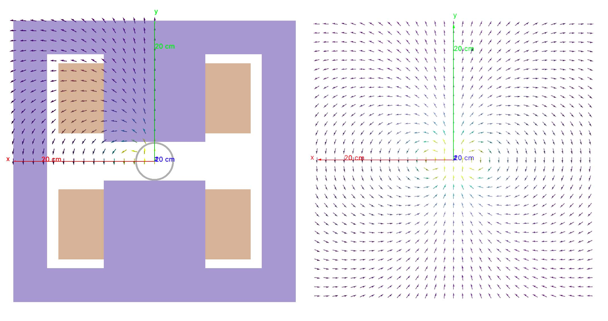

	    Original dipole field from positive x-y quadrant (*left*), reflected using
	    :code:`reflectxydipole` (*right*). The view is with the z axis going into
	    the page and the the coordinate system is right-handed.

**reflectxzdipole**

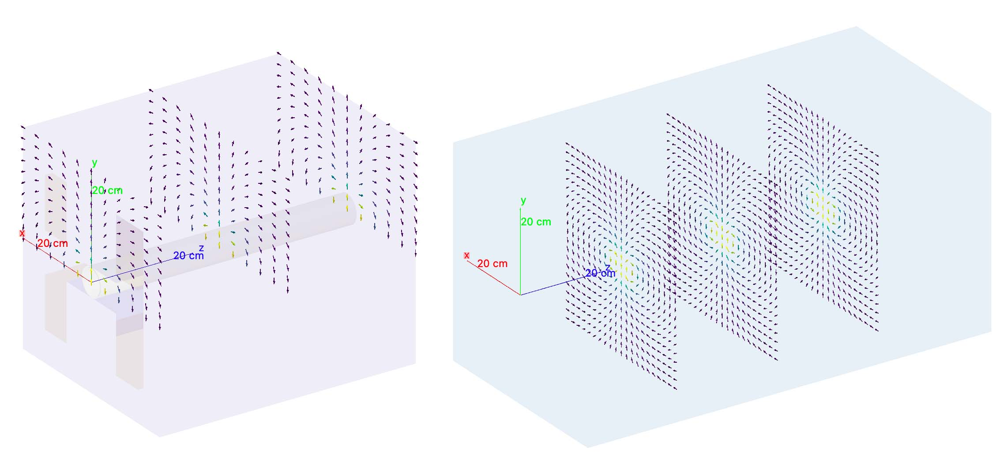

	    Original dipole field from positive y half (*left*), reflected using
	    :code:`reflectxzdipole` (*right*). 

.. _field-modulators:

Modulators
**********

It is possible to scale or 'modulate' the field of any component in bdsim using a
"modulator" object. This conceptually can be a function of time, event number and
turn number for example. Only certain functions are provided but more can be added
easily by the developers if required - see :ref:`feature-request`.

* Whatever magnetic or electric field would be provided by the original field object
  is multiplied by the (scalar) numerical factor from the modulator.

A modulator is defined in the in put as follows: ::

  objectname: modulator, parameter1=value, parameters=value,... ;

The modulator is then 'attahced' to the beam line element in its definition: ::

  m1: modulator, type="sint", frequency=1*kHz, amplitudeOffset=1, phase=pi/2;
  rf1: rfcavity, l=1*m, frequency=450*MHz, fieldModulator="m1";

The function is described by the :code:`type` parameter which can be one of the following:

* :code:`sint` - sinusoid as a function of (local) time
* :code:`singlobal` - sinusoid as a function of (global) time with no synchronous offset in time
* :code:`tophatt` - a top hat function as a function of time

Each is described below.

**sint**

A sinusoidal modulator as a function of time T of the particle. The factor is
described by the equation:

.. math::

  factor = \text{amplitudeOffset} + \text{amplitudeScale} * \sin (2 \pi f t + \phi)

The oscillator will by default have a zero phase that is synchronous with the centre
of the object it's attached to in the beam line.

* `tOffset` will take precedence over `phase`

+--------------------+------------------------------------------+---------------+--------------+------------+
| **Parameter**      | **Description**                          | **Required**  | **Default**  | **Units**  |
+====================+==========================================+===============+==============+============+
| `amplitudeOffset`  | Offset of numerical factor               | No            | 0            | None       |
+--------------------+------------------------------------------+---------------+--------------+------------+
| `amplitudeScale`   | Multiplier of scale                      | No            | 1            | None       |
+--------------------+------------------------------------------+---------------+--------------+------------+
| `frequency`        | Frequency of oscillator in (>= 0)        | Yes           | 0            | Hz         |
+--------------------+------------------------------------------+---------------+--------------+------------+
| `phase`            | Phase relative to synchronous phase      | No            | 0            | rad        |
+--------------------+------------------------------------------+---------------+--------------+------------+
| `tOffset`          | Optional time to use in place of phase   | No            | 0            | s          |
+--------------------+------------------------------------------+---------------+--------------+------------+

**singlobalt**

This has the same equation as `sint`, however, no synchronous offset is added to the phase.
So, if one instance of this modulator is used on several elements, they will all oscillate
at the same time with the same phase, so a beam particle may see a different effect as it
passes each element.

* The same parameters as `sint` apply.
* `phase` takes precedence over `offsetT`.

**tophatt**

A function that is on at a constant value inside a time window and 0 everywhere else in time.
It is described by the equation:

.. math::

    factor &= \textrm{amplitudeScale} \quad \textrm{if} \quad T0 <= T <= T1 \\
    factor &= 0 \quad \textrm{otherwise} \\

+--------------------+------------------------------------------+---------------+--------------+------------+
| **Parameter**      | **Description**                          | **Required**  | **Default**  | **Units**  |
+====================+==========================================+===============+==============+============+
| `T0`               | Global starting time for 'on'            | Yes           | 0            | s          |
+--------------------+------------------------------------------+---------------+--------------+------------+
| `T1`               | Global time for 'off'                    | Yes           | 0            | s          |
+--------------------+------------------------------------------+---------------+--------------+------------+
| `amplitudeScale`   | Multiplier of scale                      | No            | 1            | None       |
+--------------------+------------------------------------------+---------------+--------------+------------+

Integrators
***********

An integrator is an algorithm that calculates the particle motion in a field. There
are many algorithms - some fast, some more precise, some work only with certain fields.

The following integrators are provided.  The majority are interfaces to Geant4 integrators.
*g4classicalrk4* is typically the recommended default and is very robust.
*g4cashkarprkf45* is similar but slightly less CPU-intensive. For version Geant4.10.4
onwards, *g4dormandprince745* is the default recommended by Geant4 (although not the
BDSIM default currently). Note: any integrator capable of operating on EM fields
will work on solely B- or E-fields.

We recommend looking at the source .hh files in the Geant4 source code for an
explanation of each, as this is where they are documented. The source files can
be found in `<geant4-source-dir>/source/geometry/magneticfield/include`.

+----------------------+----------+------------------+-----------------------------+
|  **String**          | **B/EM** | **Time Varying** | Required Geant4 Version (>) |
+======================+==========+==================+=============================+
| g4cashkarprkf45      | EM       | Y                | 10.0                        |
+----------------------+----------+------------------+-----------------------------+
| g4classicalrk4       | EM       | Y                | 10.0                        |
+----------------------+----------+------------------+-----------------------------+
| g4constrk4           | B        | N                | 10.0                        |
+----------------------+----------+------------------+-----------------------------+
| g4expliciteuler      | EM       | Y                | 10.0                        |
+----------------------+----------+------------------+-----------------------------+
| g4impliciteuler      | EM       | Y                | 10.0                        |
+----------------------+----------+------------------+-----------------------------+
| g4simpleheum         | EM       | Y                | 10.0                        |
+----------------------+----------+------------------+-----------------------------+
| g4simplerunge        | EM       | Y                | 10.0                        |
+----------------------+----------+------------------+-----------------------------+
| g4exacthelixstepper  | B        | N                | 10.0                        |
+----------------------+----------+------------------+-----------------------------+
| g4helixexpliciteuler | B        | N                | 10.0                        |
+----------------------+----------+------------------+-----------------------------+
| g4helixheum          | B        | N                | 10.0                        |
+----------------------+----------+------------------+-----------------------------+
| g4heliximpliciteuler | B        | N                | 10.0                        |
+----------------------+----------+------------------+-----------------------------+
| g4helixmixedstepper  | B        | N                | 10.0                        |
+----------------------+----------+------------------+-----------------------------+
| g4helixsimplerunge   | B        | N                | 10.0                        |
+----------------------+----------+------------------+-----------------------------+
| g4nystromrk4         | B        | N                | 10.0                        |
+----------------------+----------+------------------+-----------------------------+
| g4rkg3stepper        | B        | N                | 10.0                        |
+----------------------+----------+------------------+-----------------------------+
| g4bogackishampine23  | EM       | Y                | 10.3                        |
+----------------------+----------+------------------+-----------------------------+
| g4bogackishampine45  | EM       | Y                | 10.3                        |
+----------------------+----------+------------------+-----------------------------+
| g4dolomcprik34       | EM       | Y                | 10.3                        |
+----------------------+----------+------------------+-----------------------------+
| g4dormandprince745   | EM       | Y                | 10.3                        |
+----------------------+----------+------------------+-----------------------------+
| g4dormandprincerk56  | EM       | Y                | 10.3                        |
+----------------------+----------+------------------+-----------------------------+
| g4dormandprincerk78  | EM       | Y                | 10.3                        |
+----------------------+----------+------------------+-----------------------------+
| g4tsitourasrk45      | EM       | Y                | 10.3                        |
+----------------------+----------+------------------+-----------------------------+
| g4rk547feq1          | EM       | Y                | 10.4                        |
+----------------------+----------+------------------+-----------------------------+
| g4rk547feq2          | EM       | Y                | 10.4                        |
+----------------------+----------+------------------+-----------------------------+
| g4rk547feq3          | EM       | Y                | 10.4                        |
+----------------------+----------+------------------+-----------------------------+

Interpolators
*************

The field may be queried at any point inside the volume, so an interpolator is required
to provide a value of the field in between specified points in the field map.
There are many algorithms that can be used to interpolate the field map data. A
mathematical description of the ones provided in BDSIM as well as example plots
is shown in :ref:`field-interpolators`.

* This string is case-insensitive.

+------------+------------------------------------+
| **String** | **Description**                    |
+============+====================================+
| nearest    | Nearest neighbour interpolation    |
+------------+------------------------------------+
| linear     | Linear interpolation               |
+------------+------------------------------------+
| cubic      | Cubic interpolation                |
+------------+------------------------------------+
| linearmag  | Linear and magnitude interpolation |
+------------+------------------------------------+

Internally there is a different implementation for different numbers of dimensions and this
is automatically chosen based on the number of dimensions in the field map type.

.. _field-map-file-formats:

File Formats
^^^^^^^^^^^^

.. note:: BDSIM field maps by default have units :math:`cm,s` and :math:`T` for magnetic
          field and :math:`V/m` for electric field.

.. tabularcolumns:: |p{3cm}|p{6cm}|

+------------------+-----------------------------------------------------+
| **Format**       | **Description**                                     |
+==================+=====================================================+
| bdsim1d          | 1D BDSIM format file  (Units :math:`cm, s, T, V\m`) |
+------------------+-----------------------------------------------------+
| bdsim2d          | 2D BDSIM format file  (Units :math:`cm, s, T, V\m`) |
+------------------+-----------------------------------------------------+
| bdsim3d          | 3D BDSIM format file  (Units :math:`cm, s, T, V\m`) |
+------------------+-----------------------------------------------------+
| bdsim4d          | 4D BDSIM format file  (Units :math:`cm, s, T, V\m`) |
+------------------+-----------------------------------------------------+
| poisson2d        | 2D Poisson Superfish SF7 file                       |
+------------------+-----------------------------------------------------+
| poisson2dquad    | 2D Poisson Superfish SF7 file                       |
|                  | for 1/8th of quadrupole                             |
+------------------+-----------------------------------------------------+
| poisson2ddipole  | 2D Poisson Superfish SF7 file for positive          |
|                  | quadrant that's reflected to produce a              |
|                  | full windowed dipole field                          |
+------------------+-----------------------------------------------------+

Field maps in the following formats are accepted:

  * BDSIM's own format (both uncompressed :code:`.dat` and gzip compressed files. :code:`gz` must be
    in the file name for this to load correctly.)
  * Superfish Poisson 2D SF7

These are described in detail below. More field formats can be added
relatively easily - see :ref:`feature-request`. A detailed description
of the formats is given in :ref:`field-map-formats`. A preparation guide
for BDSIM format files is provided here :ref:`field-map-file-preparation`.

.. _fields-sub-fields:

Sub-Fields
^^^^^^^^^^

A 'sub-field' is where one field map can be overlaid on top of another. The sub-field should be smaller
and will simply take precedence on the main field within its range. This is useful if for example a
precise field detailed field map is required for a smaller region but a coarser field map is suitable
for the majority of the component. Remember, field maps must contain regularly spaced data so if a high
density of points is required in one point, this would lead to an excessively large field map for the rest
of the element which may not be necessary and slow the loading and running of the simulation.

Inside the domain of the sub-field, only its interpolated value is used. The transition between the sub
and main field is hard and it is left to the user to ensure that the field values are continuous to
make physical sense.

* Currently only sub-magnetic and sub-electric fields are supported (no sub-electromagnetic fields).
* The tilt or rotation of the field map (with respect to the element it is attached to) does not
  apply to the region of applicability for the sub-field. However, the field is tilted appropriately.
* The spatial (only) offset (x,y,z) of the sub-field applies to it independently of the offset of the
  main outer field.
* If a 2D field is used both fields apply infinitely in z in a 3D model, therefore the sub-field
  will always take precedence for any z value as long as x and y are inside its limits.

Below is an example of a sub-field that can be found in :code:`bdsim/examples/features/fields/subfield`: ::

  fpipe: field, type="bmap2d",
       	        magneticFile="bdsim2d:inner.dat",
	        magneticInterpolator="nearest",
	        x=-10*cm;

  fyoke: field, type="bmap2d",
       	        magneticFile="bdsim2d:outer.dat",
	        magneticInterpolator="cubic",
	        magneticSubField="fpipe";

  d1: drift, l=0.5*m, aper1=0.5*m, fieldAll="fyoke";

First a smaller field map is defined called "fpipe". Secondly, a larger coarser field map is created
called "fyoke" that crucially refers to the :code:`magneticSubField="fpipe"`. The sub-field applies
only in the range of the field map taken from the maximum and minimum coordinates in each dimension
when loading the field map. In the provided example, the "inner.dat" field map defines 4 points in a
2D square at +- 20 cm in both x and y with the same B field vector. Nearest neighbour interpolation
is used to ensure a perfect uniform field inside these points.

The second field definition using "outer.dat" ranges from +- 50 cm with a similar box of 4 points in 2D.
Each point has the same field value but with an opposing x component. The Python script used to create
these simple field maps is included alongside the example. The example combined field map is shown
in the visualiser below. The magnetic field lines were visualised using the Geant4 visualiser command
:code:`/vis/scene/add/magneticField 10 lightArrow`.

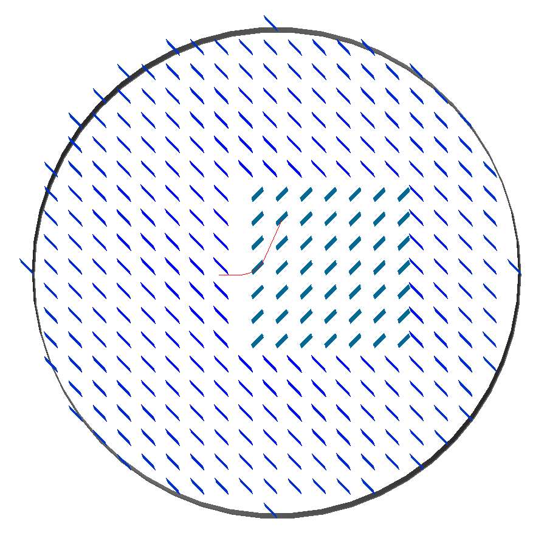

.. _fields-visualisation:
		   
Field Map Visualisation
^^^^^^^^^^^^^^^^^^^^^^^

Recent versions of Geant4 (> 10.5) provide a mechanism in the visualiser to visualise
magnetic fields. The following command can be used to add magnetic field lines to
the visualisation. ::

  /vis/scene/add/magneticField 10 lightArrow

This may take some time due to the Geant4 visualiser drawing many arrows individually. The
number 10 here sets a density of points. If few useful arrows appear, then this number can be
increased. Note, the time taken will go with the cube (i.e. N^3) of this number. Suggested
values are 10, 30, 40. An example can be seen above in the :ref:`fields-sub-fields` section.

Geant4 attempts to identify which volumes have fields and distribute the appoints accordingly
in the global Cartesian frame. For a more controllable distribution, see :ref:`fields-visualisation-queries`.

.. _fields-visualisation-queries:

Field Map Visualisation - Queries
^^^^^^^^^^^^^^^^^^^^^^^^^^^^^^^^^

Any query object (see :ref:`field-map-validation`) can be drawn on the screen in the visualiser.
A query defines a grid of points where the field is queried or found out. By default, this is
written to a field map file. Any of these queries can also be shown in the visualiser. This is
controlled by the command: ::

  /bds/field/drawQuery <query-object-name>

For a list of queries, one can do: ::

  /bds/field/listQueries

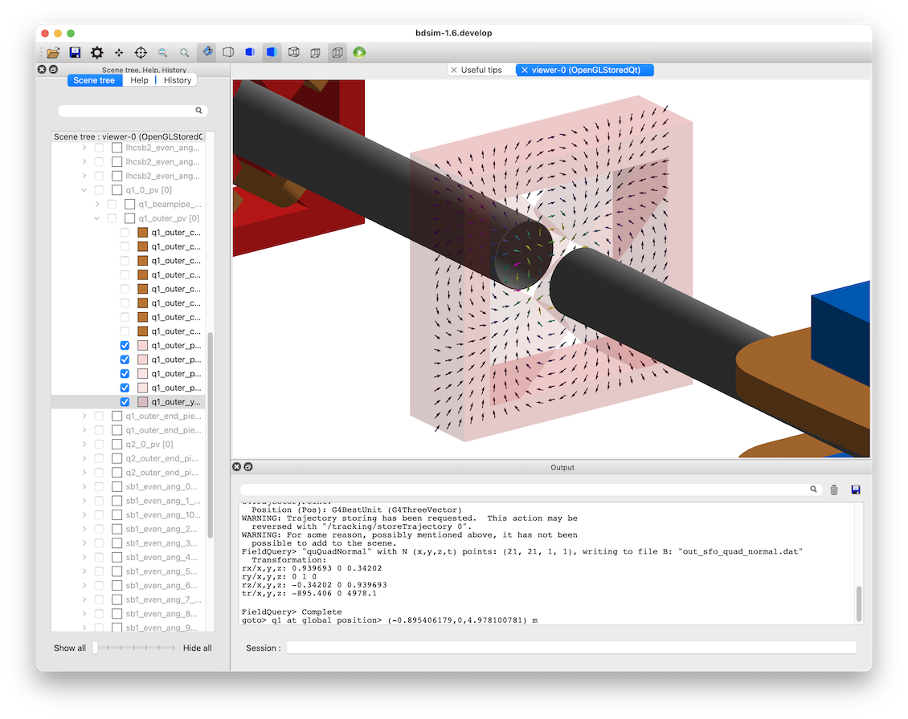

You can find examples in :code:`bdsim/examples/features/field/yoke_scaling/`. There is
a view point macro that can be loaded in the visualiser (open icon in the top left) to
centre the view nicely and make a quadrupole transparent.

* The visualisation consists of arrows and a pixel / voxel for each query point. These
  can be turned on or off individually, but one must be on. If both magnetic and electric
  fields are visualised in one query, it is recommended to switch off boxes with :code:`drawBoxes=0`.
* It may be required to make geometry partially transparent to see the field arrows.
* 4D queries will not work. Only up to 3D is supported.
* The visualisation may become very slow if a large (e.g. > 100x100 in x,y) points is used.
  This is a limitation of the visualisation system in Geant4. Typically, the querying of
  the model is very quick and it is drawing the arrows that takes time.
* Magnetic fields are drawn with the matplotlib "viridis" colour scale and electric
  fields with the "magma" colour scale.
* Both electric and magnetic fields may be visualised as defined by the query object.
* A query called in the visualiser will not be written to file.
* If the magnitude of the field is 0 at the given query point, a small circular point
  is drawn instead of an arrow.
* The arrow length does not depend on the field magnitude - only the spacing of the query points.

Field Map Preparation
^^^^^^^^^^^^^^^^^^^^^

It is not recommended to write a field map file by hand. This can create very hard to identify
subtle problems that may lead to unintended behaviour. It is recommended to use our Python
utility `pybdsim`. See the pybdsim manual for details on creating, converting and plotting
field maps in Python: `<http://www.pp.rhul.ac.uk/bdsim/pybdsim/fieldmaps.html>`_.

.. note:: The order of looping over dimensions is important and must be correct otherwise, the
	  loaded field map may not be as intended. Use of a field map should be validated.
	  BDSIM actually ignores the coordinates in each line of the field map and assumes
	  the looping order and dimension based on the header information.

.. _field-map-validation:
	  
Field Map Validation
^^^^^^^^^^^^^^^^^^^^

To validate a field map loaded by BDSIM, we can *query* what is loaded and generate a new
output field map that we can then inspect or numerically compare in Python (e.g. using pybdsim).
To query a field map, we have a 2 options:

1. Query the field *object* as loaded by BDSIM - no 3D model is actually built.
2. Query a set of coordinates in the full BDSIM model and note the field found at each position.

In both cases, a BDSIM-format field map file is written out.

.. note:: Magnetic and Electric fields are handled independently and written to separate files,
	  in the same way they are loaded into BDSIM in separate files.

**Case 1** uses an extra program provided with BDSIM called :code:`bdsinterpolator`. This can also
be used to re-interpolate a field map as described in :ref:`field-map-interpolation`, but we
can use it to simply query the same points again. This program has no concept of a 3D model and
only loads the field map into memory. This provides a class that BDSIM would normally use in the
Geant4 model, however, without any 3D transforms from local (such as curvilinear) to global frames.

**Case 2** uses BDSIM itself and a regular input file and the querying is done after construction
of the model but before a *Run* where *Events* are simulated.

In both cases, an input GMAD file is used that defines a :code:`query` object. The appropriate program
(`bdsim` or `bdsinterpolator`) is then executed with that as an argument. If we have a file
called :code:`test-field-map.gmad`, then we could do: ::

  bdsim --file=test-field-map.gmad --batch

or: ::

  bdsinterpolator --file=test-file-map.gmad

The following parameters can be used in a query object:

.. tabularcolumns:: |p{5cm}|p{10cm}|

+-------------------------+------------------------------------------------+
| **Parameter**           | **Description**                                |
+=========================+================================================+
| nx                      | Number of points to query in x (1 -> N)        |
+-------------------------+------------------------------------------------+
| ny                      | Number of points to query in y (1 -> N)        |
+-------------------------+------------------------------------------------+
| nz                      | Number of points to query in z (1 -> N)        |
+-------------------------+------------------------------------------------+
| nt                      | Number of points to query in t (1 -> N)        |
+-------------------------+------------------------------------------------+
| xmin                    | Start of x values to use                       |
+-------------------------+------------------------------------------------+
| xmax                    | Finish of x values to use                      |
+-------------------------+------------------------------------------------+
| ymin                    | Start of y values to use                       |
+-------------------------+------------------------------------------------+
| ymax                    | Finish of y values to use                      |
+-------------------------+------------------------------------------------+
| zmin                    | Start of z values to use                       |
+-------------------------+------------------------------------------------+
| zmax                    | Finish of z values to use                      |
+-------------------------+------------------------------------------------+
| tmin                    | Start of t values to use                       |
+-------------------------+------------------------------------------------+
| tmax                    | Finish of t values to use                      |
+-------------------------+------------------------------------------------+
| outfileMagnetic         | Name of output file to write field map to (B)  |
+-------------------------+------------------------------------------------+
| outfileElectric         | Name of output file to write field map to (E)  |
+-------------------------+------------------------------------------------+
| fieldObject             | Name of the field object in the input to query |
+-------------------------+------------------------------------------------+
| queryMagneticField      | (1 or 0) whether to query the magnetic field   |
|                         | - default is False (0)                         |
+-------------------------+------------------------------------------------+
| queryElectricField      | (1 or 0) whether to query the electric field   |
|                         | - default is False (0)                         |
+-------------------------+------------------------------------------------+
| overwriteExistingFiles  | Whether to overwrite existing output files     |
|                         | - default is True (1)                          |
+-------------------------+------------------------------------------------+
| drawArrows              | (1 or 0) Whether to draw arrows if used for    |
|                         | visualisation. Default is true.                |
+-------------------------+------------------------------------------------+
| drawZeroValuePoints     | (1 or 0) whether to draw a point even if the   |
|                         | queried field value is 0 in magnitude. Default |
|                         | is true. Only applies to arrows.               |
+-------------------------+------------------------------------------------+
| drawBoxes               | (1 or 0) Whether to draw pixels / voxel boxes  |
|                         | for each query point in the visualiser.        |
|                         | Default is true.                               |
+-------------------------+------------------------------------------------+
| boxAlpha                | The transparency value for the boxes. Range    |
|                         | from 0 to 1 where 0 is invisible. Default is   |
|                         | 0.2.                                           |
+-------------------------+------------------------------------------------+
| printTransform          | (1 or 0) whether to print out the calculated   |
|                         | transform from the origin to the global        |
|                         | coordinates                                    |
+-------------------------+------------------------------------------------+
| referenceElement        | Element with respect to which the coordinates  |
|                         | are desired to be queried                      |
+-------------------------+------------------------------------------------+
| referenceElementNumber  | Instance of the reference element in the beam  |
|                         | line if it is used more than once (0-counting) |
|                         | - default is 0                                 |
+-------------------------+------------------------------------------------+
| s                       | Curvilinear S coordinate (global | local       |
|                         | depending on parameters)                       |
+-------------------------+------------------------------------------------+
| x                       | Offset in x                                    |
+-------------------------+------------------------------------------------+
| y                       | Offset in y                                    |
+-------------------------+------------------------------------------------+
| z                       | Offset in z                                    |
+-------------------------+------------------------------------------------+
| phi                     | Euler angle phi for rotation                   |
+-------------------------+------------------------------------------------+
| theta                   | Euler angle theta for rotation                 |
+-------------------------+------------------------------------------------+
| psi                     | Euler angle psi for rotation                   |
+-------------------------+------------------------------------------------+
| axisX                   | Axis angle rotation x-component of unit vector |
+-------------------------+------------------------------------------------+
| axisY                   | Axis angle rotation y-component of unit vector |
+-------------------------+------------------------------------------------+
| axisZ                   | Axis angle rotation z-component of unit vector |
+-------------------------+------------------------------------------------+
| angle                   | Axis angle, angle to rotate about unit vector  |
+-------------------------+------------------------------------------------+
| axisAngle               | (1 or 0) use axis angle rotation instead of    |
|                         | the Euler angle.                               |
+-------------------------+------------------------------------------------+
| pointsFile              | Name of a file listing points to be queried    |
|                         | instead of the linear range. See below.        |
+-------------------------+------------------------------------------------+

.. note:: The transforms are made using the same variable names and logic as that of geometry
	  or sampler placements - see :ref:`placements` for a full description of the possible
	  combination of parameters for the 3 ways of specifying a transform. 

* The default is to query the magnetic field only and **to overwrite** files.
* The magnetic field will be queried if neither `queryMagneticField` or
  `queryElectricField` are set to 1 (on), but only if neither are specified.
* The ranges defined will be queried in the global frame if no transform is specified,
  otherwise they will be about the point / frame of the transform.
* In the case where a reference element is used, the frame includes the offset of that
  element, so the x,y = 0,0 point is the same as the element even if that is offset
  from the reference axis of the accelerator.
* If you don't wish to query a dimension, then the number of points should be
  1, which is the default and need not be specified.
* Units are **m** and **ns** by default, the same as BDSIM.
* One of `queryMagneticField` or `queryElectricField` must be true.

Examples can be found in :code:`bdsim/examples/features/fields/query/query*`.

An example: ::

  quA: query, nx=51, xmin=-30*cm, xmax=30*cm,
     	      ny=51, ymin=-30*cm, ymax=30*cm,
	      queryMagneticField=1,
	      outfileMagnetic="out_query_2d_bfield_xy.dat",
	      z=1.1*m,
	      overwriteExistingFiles=1;

Query By Points File
********************

A specific set of points can be queried also. These should be listed in a text
file (file extension not important) with one set of coordinates per line.

File rules:

* lines with only white-space will be ignored
* no comments are permitted
* There should be a line at the top starting with '!' and listing the dimensions (x,y,z,t)
* The column names and coordinates should be separated by white-space
* Any combination of x,y,z,t may be used
* The units are fixed in metres for x,y,z and nanoseconds for t.
* The file extension is ignored
* The output field map is not usable in BDSIM as the header information will be incorrect

Example file contents: ::

  ! X Y Z
  0 0 1
  0 1 1
  1 0 1
  0 0 0
  0 1 0
  1 0 0

Or: ::

  ! Z
  1.1
  1.2
  1.3
  1.4
  
More examples can be found in :code:`bdsim/examples/features/fields/query/query-points*`.

.. _field-map-interpolation:

Field Map Interpolation
^^^^^^^^^^^^^^^^^^^^^^^

A field map can be loaded and interpolated to generate a new field map. This can be done
with the exact same number and range of points as a way of validating the field map
was correctly prepared for BDSIM (by seeing the output file is the same as the input).

We could also interpolate the field map with different interpolation methods to compare,
or we could increase the density of points and then use a simpler interpolation (more memory,
but slightly faster simulation), although this is quite an optimisation step.

A tool, :code:`bdsinterpolator`, will load a GMAD file and obey only the :code:`query`
objects defined to generate output field maps.

This **does not** build a Geant4 model. It simply loads the field map and wraps it
in an interpolator. The interpolator is queried for a set of coordinates the resultant
field values written out as a field map in BDSIM format. This output file, if desired,
can be used in BDSIM subsequently.

This program takes an input GMAD file with a minimum of:

1. 1x field object defined
2. 1x query object defined

Any parameters that are used for the placement transform ("referenceElement" onwards
in the table of `query` parameters in the above section) will be completely ignored.
The field is only queried in its own 'local' coordinate system in this program.

Examples can be found in :code:`bdsim/examples/features/fields/query`.

Usage: ::

  bdsinterpolator --file=<my-file.gmad>

* If more points are requested in the query in a dimension than are in the original
  field map, then we are in effect interpolating the field.
* If fewer points are requested in the query in a dimension than are in the original
  field map, we are still interpolating values in the field map, but we are just
  reducing the 'resolution' of the field map.

Example in one gmad file called :code:`bdsim/examples/features/fields/maps_bdsim/2d_cubic.gmad`: ::

  f1: field, type="bmap2d",
                 magneticFile = "bdsim2d:2dexample.dat",
		 magneticInterpolator = "cubic";

  q1: query, nx = 200,
             xmin = -30*cm,
	     xmax = 30*cm,
	     ny = 200,
	     ymin = -50*cm,
	     ymax = 50*cm,
	     outfileMagnetic = "2d_interpolated_linear.dat",
	     fieldObject = "f1";

.. _materials-and-atoms:
	  
Materials and Atoms
-------------------

All chemical elements are available in BDSIM as well as the Geant4 NIST database
of materials for use. Custom materials and can also be added via the parser. All materials
available in BDSIM can be found by executing BDSIM with the :code:`--materials` option. ::

  bdsim --materials

Aside from these, several materials useful for accelerator applications are already defined
that are listed in :ref:`predefined-materials`.

Generally, each beam line element accepts an argument "material" that is the
material used for that element. It is used differently depending on the element. For example,
in the case of a magnet, it is used for the yoke and for a collimator for the collimator
block.

Single Element
^^^^^^^^^^^^^^

In the case of an element, the chemical symbol can be specified::

  rc1: rcol, l=0.6*m, xsize=1.2*cm, ysize=0.6*cm, material="W";

These are automatically prefixed with :code:`G4_` and retrieved from the NIST database of
materials.

The user can also define their own material and then refer to it by name when defining
a beam line element.

Custom Single Element Material
^^^^^^^^^^^^^^^^^^^^^^^^^^^^^^

If the material required is composed of a single element, but say of a different density or
state than the default NIST one provided, it can be defined using the **matdef**
command with the following syntax::

  materialname : matdef, Z=<int>, A=<double>, density=<double>, T=<double>, P=<double>, state=<char*>;

=========  ========================== =============
Parameter  Description                Default
Z          Atomic number
A          Mass number [g/mol]
density    Density in [g/cm3]
T          Temperature in [K]         300
P          Pressure [atm]             1
state      "solid", "liquid" or "gas" "solid"
=========  ========================== =============

Example::

  iron2 : matdef, Z=26, A=55.845, density=7.87;

A compound material can be specified in two manners:

Compound Material by Atoms
^^^^^^^^^^^^^^^^^^^^^^^^^^
If the number of atoms of each component in a material unit is known,
the following syntax can be used::

   <material> : matdef, density=<double>, T=<double>, P=<double>,
                state=<char*>, components=<[list<char*>]>,
                componentsWeights=<{list<int>}>;

================= ===================================================
Parameter         Description
density           Density in [g/cm3]
components        List of symbols for material components
componentsWeights Number of atoms for each component in material unit
================= ===================================================

Example::

  NbTi : matdef, density=5.6, T=4.0, components=["Nb","Ti"], componentsWeights={1,1};

Compound Material by Mass Fraction
^^^^^^^^^^^^^^^^^^^^^^^^^^^^^^^^^^

On the other hand, if the mass fraction of each component is known, the
following syntax can be used::

   <material> : matdef, density=<double>, T=<double>, P=<double>,
                state=<char*>, components=<[list<char*>]>,
                componentsFractions=<{list<double>}>;

=================== ================================================
Parameter           Description
components          List of symbols for material components
componentsFractions Mass fraction of each component in material unit
=================== ================================================

Example::

  SmCo : matdef, density=8.4, T=300.0, components=["Sm","Co"], componentsFractions = {0.338,0.662};

The second syntax can also be used to define materials which are composed by
other materials (and not by atoms).

.. note:: Square brackets are required for the list of element symbols, curly
	  brackets for the list of weights or fractions.

New elements can be defined with the **atom** keyword::

  elementname : atom, Z=<int>, A=<double>, symbol=<char*>;

=========  =====================
Parameter  Description
Z          Atomic number
A          Mass number [g/mol]
symbol     Atom symbol
=========  =====================

Example::

  myNiobium  : atom, symbol="myNb", Z=41, A=92.906;
  myTitanium : atom, symbol="myTi", Z=22, A=47.867;
  myNbTi     : matdef, density=5.6, T=4.0, components=["myNb","myTi"], componentsWeights={1,1};

.. _predefined-materials:

Predefined Materials
^^^^^^^^^^^^^^^^^^^^

The following elements are available by full name that refer to the Geant4 NIST
elements:

* aluminium
* beryllium
* carbon
* chromium
* copper
* iron
* lead
* magnesium
* nickel
* nitrogen
* silicon
* titanium
* tungsten
* uranium
* vanadium
* zinc

The following materials are also defined in BDSIM. The user should consult
:code:`bdsim/src/BDSMaterials.cc` for the full definition of each including
elements, mass fractions, temperature and state.

* air (G4_AIR)
* airbdsim  (previously defined air in bdsim)
* aralditef
* awakeplasma
* berylliumcopper
* bn5000
* bp_carbonmonoxide
* calciumcarbonate
* carbonfiber
* carbonmonoxide
* carbonsteel
* cellulose (G4_CELLULOSE_CELLOPHANE)
* clay
* clayousMarl
* concrete
* copperdiamond
* cu_2k (G4_Cu at 2K)
* cu_4k (G4_Cu at 4K)
* dy061
* epoxyresin3
* fusedsilica
* gos_lanex
* gos_ri1
* graphite
* graphitefoam
* hy906
* inermet170
* inermet176
* inermet180
* invar
* kapton
* lanex
* lanex2
* laservac (same as vacuum but with different name)
* leadtungstate
* lhcconcrete
* lhc_rock
* lhe_1.9k
* limousmarl
* liquidhelium
* marl
* medex
* molybdenumcarbide (also "mogr")
* mild_steel
* n-bk7
* nb_87k
* nbti.1
* nbti_4k
* nbti_87k
* niobium_2k
* nb_2k (niobium_2k)
* perspex
* pet
* pet_lanex
* pet_opaque
* polyurethane
* quartz
* rch1000_4k (ultra high molecular weight ethylene)
* smco
* soil
* solidhydrogen
* solidnitrogen
* solidoxygen
* stainless_steel_304L
* stainless_steel_304L_2K
* stainless_steel_304L_87K
* stainless_steel_316LN
* stainless_steel_316LN_2K
* stainless_steel_316LN_87K
* stainlesssteel
* ti_87k
* titaniumalloy
* tungsten_heavy_alloy
* ups923a
* vacuum
* water (G4_WATER)
* weightiron
* yag

Vacuum and Air
^^^^^^^^^^^^^^

The default "vacuum" material used in all beam pipes is composed of H, C and O with the
following fractions:

+--------------+-------------------+
| **Element**  | **Mass Fraction** |
+==============+===================+
| H            | 0.482             |
+--------------+-------------------+
| C            | 0.221             |
+--------------+-------------------+
| O            | 0.297             |
+--------------+-------------------+

The default pressure is 1e-12 bar, the temperature is 300K and the density is 1.16336e-15 g/cm3.

"air" is the G4_AIR material. As of Geant4.10.04.p02
(see geant4/source/materials/src/G4NistMaterialBuilder.cc), it is composed of C, N, O, Ar
with the following fractions:

+--------------+-------------------+
| **Element**  | **Mass Fraction** |
+==============+===================+
| C            | 0.000124          |
+--------------+-------------------+
| N            | 0.755267          |
+--------------+-------------------+
| O            | 0.231781          |
+--------------+-------------------+
| Ar           | 0.012827          |
+--------------+-------------------+

It is a gas with density of 1.20479 mg/cm3.

.. _aperture-parameters:

Aperture Parameters
-------------------

For elements that contain a beam pipe, several aperture models can be used. These aperture
parameters can be set as the default for every element using the :code:`option` command
(see :ref:`bdsim-options`) but can also be overridden for each element by specifying
them with the element definition. The aperture is controlled through the following parameters:

* `apertureType`
* `beampipeRadius` or `aper1`
* `aper2`
* `aper3`
* `aper4`
* `vacuumMaterial`
* `beampipeThickness`
* `beampipeMaterial`

For each aperture model, a different number of parameters are required. Here, we follow the MAD-X
convention and have four parameters. The user must specify them as required for that model.
BDSIM will check to see if the combination of parameters is valid. `beampipeRadius` and `aper1`
are degenerate.

Up to four parameters
can be used to specify the aperture shape (*aper1*, *aper2*, *aper3*, *aper4*).
These are used differently for each aperture model and match the MAD-X aperture definitions.
The required parameters and their meaning are given in the following table.

A completely custom aperture can be used with `pointsfile`. See the notes below.

.. note:: If **no beam pipe** is desired, :code:`apertureType="circularvacuum"` can be used that makes
	  only the vacuum volume without any beam pipe. The vacuum material is the usual vacuum
	  but can of course can be controlled with :code:`vacuumMaterial`. So you could create
	  a magnet with air and no beam pipe.
.. note:: The default beam pipe material is "stainlesssteel".

.. tabularcolumns:: |p{3cm}|p{2cm}|p{2cm}|p{2cm}|p{2cm}|p{2cm}|

+----------------------+--------------+-------------------+-----------------+----------------+------------------+
| Aperture Model       | # of         | `aper1`           | `aper2`         | `aper3`        | `aper4`          |
|                      | parameters   |                   |                 |                |                  |
+======================+==============+===================+=================+================+==================+
| `circular`           | 1            | radius            | NA              | NA             | NA               |
+----------------------+--------------+-------------------+-----------------+----------------+------------------+
| `rectangular`        | 2            | x half-width      | y half-width    | NA             | NA               |
+----------------------+--------------+-------------------+-----------------+----------------+------------------+
| `elliptical`         | 2            | x semi-axis       | y semi-axis     | NA             | NA               |
+----------------------+--------------+-------------------+-----------------+----------------+------------------+
| `lhc`                | 3            | x half-width of   | y half-width of | radius of      | NA               |
|                      |              | rectangle         | rectangle       | circle         |                  |
+----------------------+--------------+-------------------+-----------------+----------------+------------------+
| `lhcdetailed` (\*)   | 3            | x half-width of   | y half-width of | radius of      | NA               |
|                      |              | rectangle         | rectangle       | circle         |                  |
+----------------------+--------------+-------------------+-----------------+----------------+------------------+
| `rectellipse`        | 4            | x half-width of   | y half-width of | x semi-axis    | y semi-axis      |
|                      |              | rectangle         | rectangle       | of ellipse     | of ellipse       |
+----------------------+--------------+-------------------+-----------------+----------------+------------------+
| `racetrack`          | 3            | horizontal offset | vertical offset | radius of      | NA               |
|                      |              | of circle         | of circle       | circular part  |                  |
+----------------------+--------------+-------------------+-----------------+----------------+------------------+
| `octagonal`          | 4            | x half-width      | y half-width    | x point of     | y point of       |
|                      |              |                   |                 | start of edge  | start of edge    |
+----------------------+--------------+-------------------+-----------------+----------------+------------------+
| `clicpcl`            | 4            | x half-width      | top ellipse     | bottom ellipse | y separation     |
|                      |              |                   | y half-height   | y half-height  | between ellipses |
+----------------------+--------------+-------------------+-----------------+----------------+------------------+
| `circularvacuum`     | 1            | radius            | NA              | NA             | NA               |
+----------------------+--------------+-------------------+-----------------+----------------+------------------+
| `pointsfile` (\*\*)  | 0            | NA                | NA              | NA             | NA               |
+----------------------+--------------+-------------------+-----------------+----------------+------------------+
| `rhombus` (\+)       | 2-3          | x half-width      | y half-width    | radius of      | NA               |
|                      |              |                   |                 | corners        |                  |
+----------------------+--------------+-------------------+-----------------+----------------+------------------+

.. note:: (\*) :code:`lhcdetailed` aperture type will result in the :code:`beampipeMaterial` being ignored
	  and LHC-specific materials at 2K being used.

.. note:: (\*\*) For points file, use :code:`apertureType="pointsfile:pathtofile.dat:cm";`. See below.

.. note:: (\+) For the rhombus aperture, `aper1` and `aper2` are the maximum extents if there was no radius
          of curvature for the corners. Therefore, the curved edges 'eat' into the shape.

These parameters can be set with the *option* command, as the default parameters
and also on a per element basis that overrides the defaults for that specific element.

In the case of `clicpcl` (CLIC Post Collision Line), the beam pipe is asymmetric. The centre is
the same as the geometric centre of the bottom ellipse. Therefore, *aper4*, the y separation
between ellipses is added on to the 0 position. The parameterisation is taken from
Phys. Rev. ST Accel. Beams **12**, 021001 (2009).

**Custom Aperture**

For **pointsfile**, a text file can be used to list a set of x,y transverse points to specify
a custom shape. No other aperture parameters are required other than the aperture type. The
syntax is: ::

  pointsfile:filename.dat:units

The string should contain no spaces and the values separated by colons :code:`:`. The second
colon and units are optional and if not supplied will be mm.

* At least 3 points are required
* Each line should contain only 2 numbers
* Empty lines will be ignored
* Lines starting with :code:`!` or :code:`#` will be ignored.
* Examples can be found in :code:`bdsim/examples/features/geometry/3_beampipes/12_pointsfile.gmad`.
* The last point must not be duplicated.
* The polygon given by the 2D points may be either clockwise or anti-clockwise wound
  (the order of the points) and BDSIM will internally make it clockwise, which is
  necessary to calculate the expansion of the polygon for the beam pipe shape.

::

   d1: drift, l=0.2*m, apertureType="pointsfile:12_points.dat:cm", beampipeThickness=2*mm;
   d2: drift, l=0.2*m, apertureType="pointsfile:12_points.dat", beampipeThickness=2*mm;

.. warning:: The user is entirely responsible for defining an enclosed shape and the points
	     must not define lines that cross each other (self-intersecting). The shape may be non-convex.
	     If the shape does not show in the visualiser, check for warnings from Geant4
	     that would indicate the shape is badly formed.

The example in :code:`bdsim/examples/features/geometry/3_beampipes/12_points.dat` is generated
by the accompanying Python script :code:`createPoints.py`. It creates a circle of some radius
with an oscillating boundary. This results in a star shape. The file contents are: ::

  3.0     0.0
  3.5594944939586357      0.44966872700413885
  3.8269268103510368      0.982587799219406
  3.6735994432667844      1.4544809126930356
  3.144000183146753       1.7284287271798486
  2.4270509831248424      1.7633557568774194
  1.7584288736820426      1.6512746244216896
  1.3060457301527224      1.5787380878937436
  1.0978788199666678      1.7299802010673848
  1.0270710863817312      2.1826371600832646
  0.9270509831248422      2.85316954888546
  0.6722839170258389      3.524235711679308
  0.2480888913478514      3.943260008793256
  -0.2480888913478518     3.943260008793256
  -0.67228391702584       3.524235711679308
  -0.9270509831248428     2.853169548885461
  -1.0270710863817316     2.1826371600832646
  -1.097878819966668      1.7299802010673846
  -1.3060457301527224     1.5787380878937436
  -1.7584288736820426     1.651274624421689
  -2.4270509831248415     1.7633557568774194
  -3.144000183146753      1.7284287271798482
  -3.673599443266785      1.4544809126930345
  -3.8269268103510368     0.982587799219406
  -3.559494493958636      0.4496687270041383
  -3.0000000000000004     -9.64873589805982e-16
  -2.393193713928232      -0.3023306743816869
  -1.98457215642075       -0.5095515237697232
  -1.9050594720627234     -0.7542664034150331
  -2.113839897116428      -1.162093317430443
  -2.427050983124841      -1.7633557568774196
  -2.6153828908464263     -2.4560080111504425
  -2.518498208339415      -3.044341368760992
  -2.117081949907311      -3.3359873519447065
  -1.5276046630087032     -3.246325154712854
  -0.9270509831248429     -2.8531695488854614
  -0.4520039704885086     -2.3694877926928246
  -0.12865422582802818    -2.044900361776374
  0.12865422582802924     -2.0449003617763735
  0.45200397048850954     -2.3694877926928233
  0.9270509831248415      -2.85316954888546
  1.5276046630087043      -3.2463251547128524
  2.1170819499073117      -3.335987351944705
  2.5184982083394165      -3.044341368760991
  2.615382890846429       -2.456008011150442
  2.4270509831248446      -1.7633557568774183
  2.1138398971164296      -1.1620933174304438
  1.9050594720627243      -0.7542664034150321
  1.9845721564207497      -0.509551523769722
  2.3931937139282304      -0.3023306743816855

And this looks like:

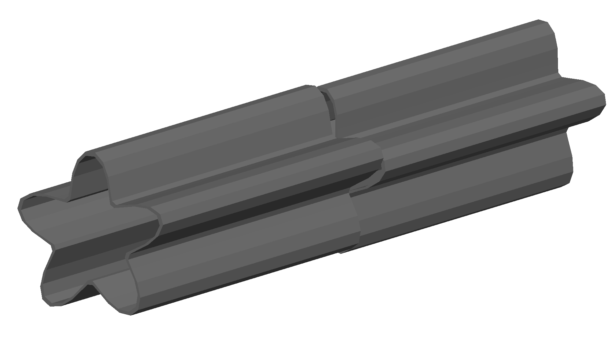

.. _magnet-geometry-parameters:

Magnet Geometry Parameters
--------------------------

As well as the beam pipe, magnet beam line elements also have further outer geometry beyond the
beam pipe. This geometry typically represents the magnetic poles and yoke of the magnet but there
are several geometry types to choose from. The possible different styles are described below and
syntax **examples** can be found in *examples/features/geometry/4_magnets/*. These are:

* :ref:`mag-geom-none`
* :ref:`mag-geom-cylindrical`
* :ref:`mag-geom-polescircular`
* :ref:`mag-geom-polessquare`
* :ref:`mag-geom-polesfacet`
* :ref:`mag-geom-polesfacetcrop`
* :ref:`mag-geom-lhc`
* :ref:`external-magnet-geometry` (e.g. a GDML file for the yoke)

The magnet geometry is controlled by the following parameters.

.. note:: These can all be specified using the `option` command as well as on a per element
	  basis, but in this case they act as a default that will be used if none are
	  specified by the element.

.. note:: The option :code:`ignoreLocalMagnetGeometry` exists and if it is true (1), **all**
	  per-element magnet geometry definitions will be ignored and the ones specified
	  in Options will be used.

.. note:: In the case that the `lhcleft` or `lhcright` magnet geometry types are used,
	  the yoke field will be a sum of two regular yoke fields at the LHC beam pipe
	  separation. The option :code:`yokeFieldsMatchLHCGeometry` can be used to control
	  this. These are described in :ref:`fields-multipole-outer-lhc`.

+-----------------------+--------------------------------------------------------------+---------------+-----------+
| Parameter             | Description                                                  | Default       | Required  |
+=======================+==============================================================+===============+===========+
| `magnetGeometryType`  | | The style of magnet geometry to use. One of:               | `polessquare` | No        |
|                       | | `cylindrical`, `polescircular`, `polessquare`,             |               |           |
|                       | | `polesfacet`, `polesfacetcrop`, `lhcleft`, `lhcright`,     |               |           |
|                       | | `none` and `format:path`.                                  |               |           |
+-----------------------+--------------------------------------------------------------+---------------+-----------+
| `horizontalWidth`     | | **Full** horizontal width of the magnet (m)                | 0.6 m         | No        |
+-----------------------+--------------------------------------------------------------+---------------+-----------+
| `outerMaterial`       | |  Material of the magnet                                    | "iron"        | No        |
+-----------------------+--------------------------------------------------------------+---------------+-----------+
| `yokeOnInside`        | | Whether the yoke of a dipole appears on the inside of the  | 1             | No        |
|                       | | bend and if false, it's on the outside. Applicable only    |               |           |
|                       | | to dipoles.                                                |               |           |
+-----------------------+--------------------------------------------------------------+---------------+-----------+
| `hStyle`              | | Whether a dipole (only a dipole) will be an H style one    | 0             | No        |
|                       | | or a C style one (c style by default. True ('1') or False  |               |           |
|                       | | ('0').                                                     |               |           |
+-----------------------+--------------------------------------------------------------+---------------+-----------+
| `vhRatio`             | | The vertical to horizontal ratio of a magnet. The width    | 0.8           | No        |
|                       | | will always be the `horizontalWidth` and the height will   |               |           |
|                       | | scale according to this ratio. In the case of a vertical   |               |           |
|                       | | kicker it will be the height that is `horizontalWidth` (as |               |           |
|                       | | the geometry is simply rotated). Ranges from 0.1 to 10.    |               |           |
|                       | | This currently **only** applies to dipoles with poled      |               |           |
|                       | | geometry.                                                  |               |           |
+-----------------------+--------------------------------------------------------------+---------------+-----------+
| `coilWidthFraction`   | | Fraction of the available horizontal space between the     | 0.9           | No        |
|                       | | pole and the yoke for dipole geometry that the coil will   |               |           |
|                       | | occupy. This currently only applies to dipoles with poled  |               |           |
|                       | | geometry. Ranges from 0.05 to 0.98.                        |               |           |
+-----------------------+--------------------------------------------------------------+---------------+-----------+
| `coilHeightFraction`  | | Fraction of the available vertical space between the pole  | 0.9           | No        |
|                       | | tip and the yoke for dipole geometry that the coil will    |               |           |
|                       | | occupy. This currently only applies to dipoles with poled  |               |           |
|                       | | geometry. Ranges from 0.05 to 0.98.                        |               |           |
+-----------------------+--------------------------------------------------------------+---------------+-----------+

Examples: ::

  option, magnetGeometryType = "polesfacetcrop",
          horizontalWidth = 0.5*m;

::

   m1: quadrupole, l=0.3*m,
                   k1=0.03,
		   magnetGeometryType="gdml:geometryfiles/quad.gdml",
		   horizontalWidth = 0.5*m;

.. warning:: The choice of magnet outer geometry will significantly affect the beam loss pattern in the
	     simulation, as particles and radiation may propagate much further along the beam line when
	     a magnet geometry with poles is used.

.. warning:: Use of "lhcleft" or "lhcright" will result in the :code:`outerMaterial` parameter being
	     ignored and the correct LHC materials being used. The secondary beam pipe included with this
	     will always be the correct LHC arc aperture and all materials are at 2K.

.. note:: Should a custom selection of various magnet styles be required for your simulation, please
	  contact us (see :ref:`feature-request`) and this can be added - it is a relatively simple process.

.. _mag-geom-none:

No Magnet Outer Geometry - "`none`"
^^^^^^^^^^^^^^^^^^^^^^^^^^^^^^^^^^^

No geometry for the magnet outer part is built at all and nothing is placed in the model. This results
in only a beam pipe with the correct fields being provided.

.. image:: figures/none_beamline.png
	   :width: 60%
	   :align: center

.. _mag-geom-cylindrical:
		   
Cylindrical - "`cylindrical`"
^^^^^^^^^^^^^^^^^^^^^^^^^^^^^

The beam pipe is surrounded by a cylinder of material (the default is iron) whose outer diameter
is controlled by the `horizontalWidth` parameter. In the case of beam pipes that are not circular
in cross-section, the cylinder fits directly against the outside of the beam pipe.

This geometry is useful when a specific geometry is not known. The surrounding
magnet volume acts to produce secondary radiation as well as act as material for energy deposition,
therefore this geometry is best suited for the most general studies.

.. _mag-geom-polescircular:

Poles Circular - "`polescircular`"
^^^^^^^^^^^^^^^^^^^^^^^^^^^^^^^^^^

This magnet geometry has simple iron poles according to the order of the magnet and the yoke is
represented by an annulus. Currently no coils are implemented. If a non-symmetric beam pipe
geometry is used, the larger of the horizontal and vertical dimensions of the beam pipe will be
used to create the circular aperture at the pole tips.

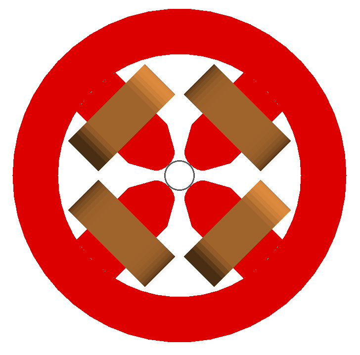

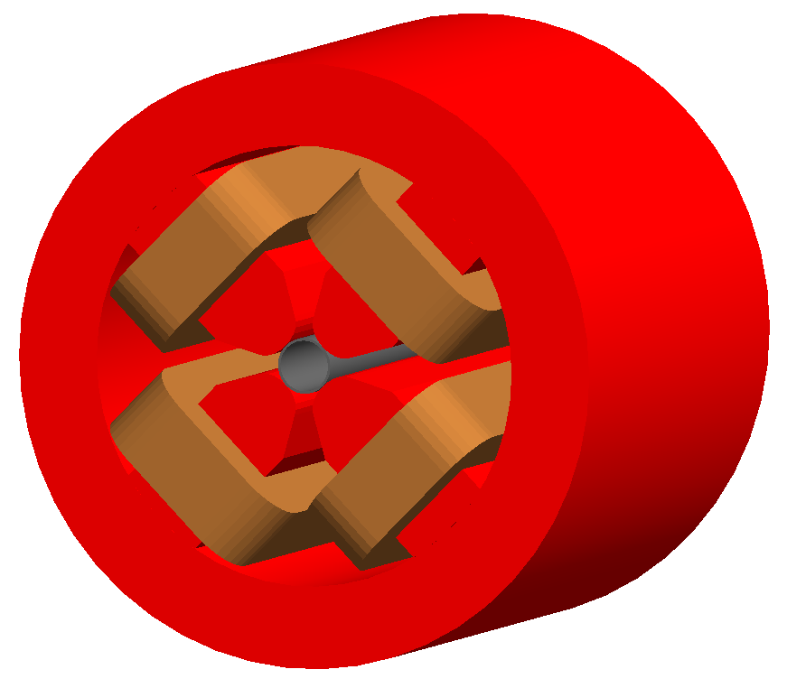

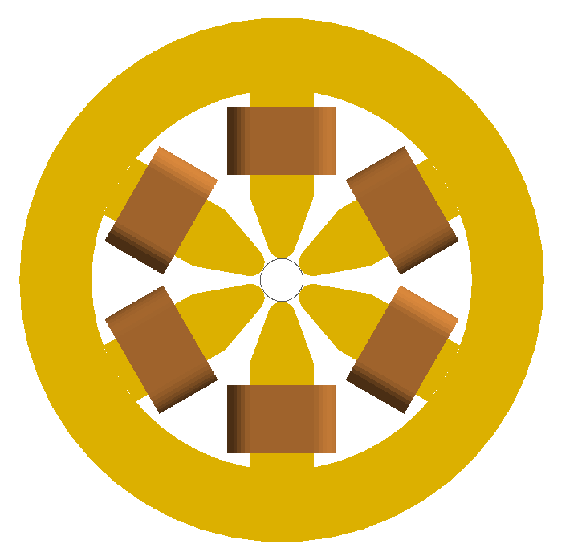

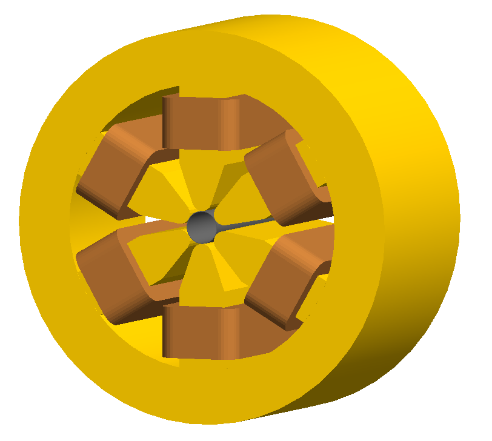

.. _mag-geom-polessquare:
		    
Poles Square (Default) - "`polessquare`"
^^^^^^^^^^^^^^^^^^^^^^^^^^^^^^^^^^^^^^^^

This magnet geometry has again, individual poles according to the order of the magnet but the
yoke is an upright square section to which the poles are attached. This geometry behaves in the
same way as `polescircular` with regard to the beam pipe size.

`horizontalWidth` is the full width of the magnet horizontally as shown in the figure below,
**not** the diagonal width.

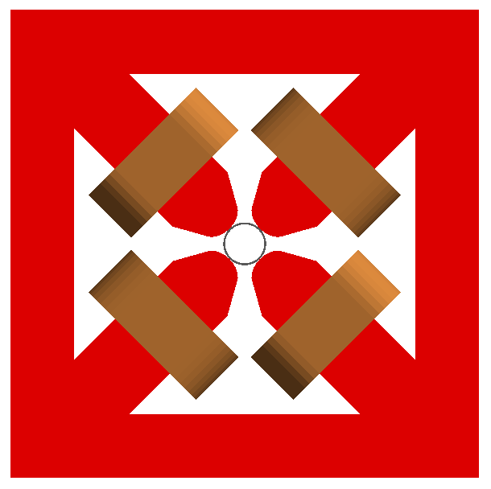

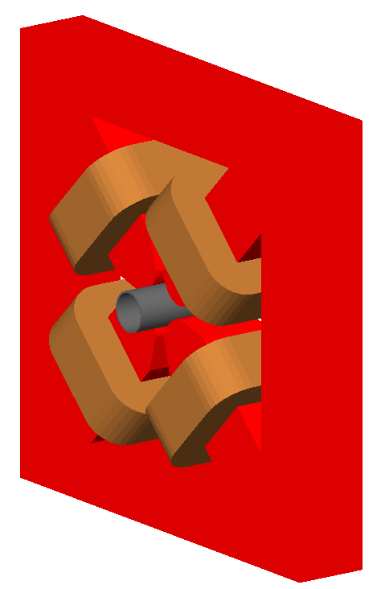

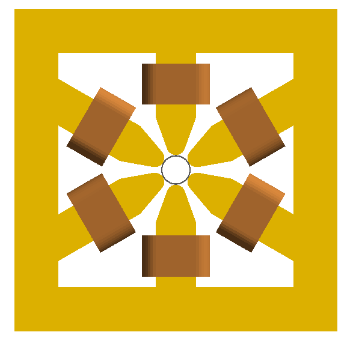

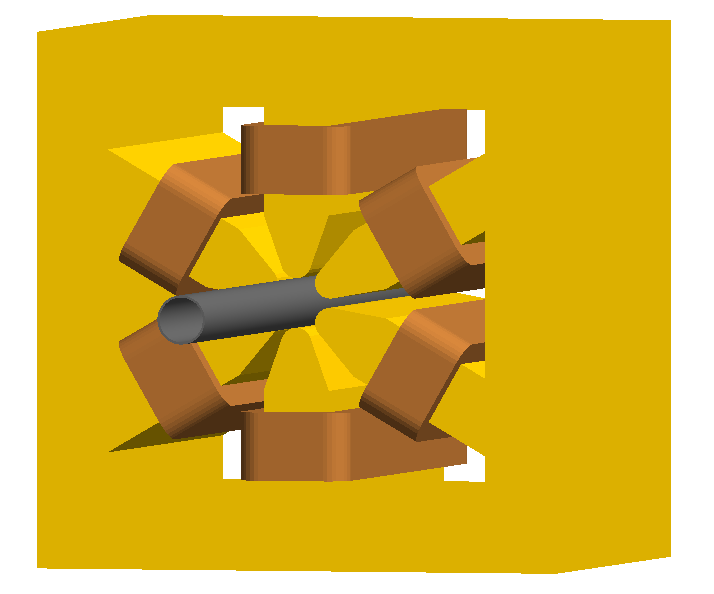

.. _mag-geom-polesfacet:
		    
Poles Faceted - "`polesfacet`"
^^^^^^^^^^^^^^^^^^^^^^^^^^^^^^

This magnet geometry is much like `polessquare`; however, the yoke is such that the pole always
joins at a flat piece of yoke and not in a corner. This geometry behaves in the
same way as `polescircular` with regards to the beam pipe size.

`horizontalWidth` is the full width as shown in the figure.

.. warning:: In Geant4 V11.0, the visualiser cannot handle the Boolean solids created by this
	     geometry and the poles appear invisible. They are in-fact there, but the Geant4
	     visualisation system cannot make the 3D meshes for the visualisation.

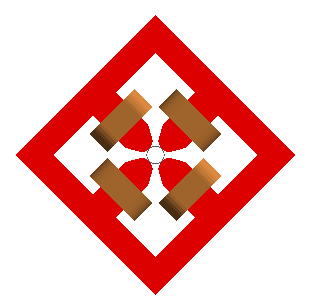

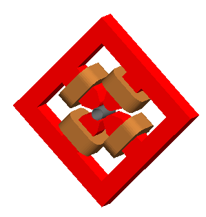

.. figure:: figures/polesfacet_sextupole.png
	    :width: 40%

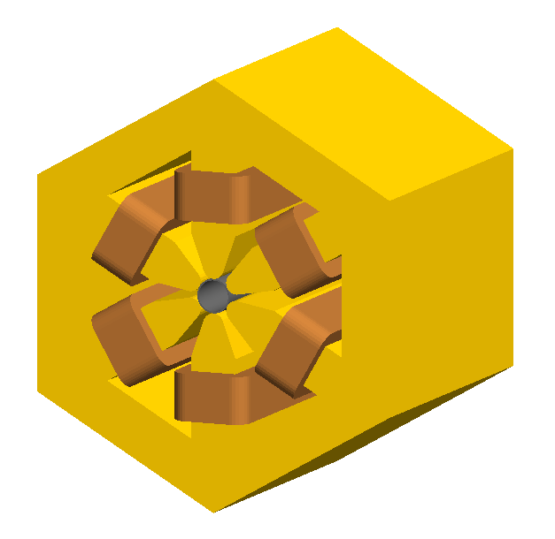

.. _mag-geom-polesfacetcrop:

Poles Faceted with Crop - "`polesfacetcrop`"
^^^^^^^^^^^^^^^^^^^^^^^^^^^^^^^^^^^^^^^^^^^^

This magnet geometry is quite similar to `polesfacet`, but the yoke in between each
pole is cropped to form another facet. This results in the magnet geometry having
double the number of poles as sides.

.. warning:: The poles in this geometry may not appear in the visualiser when
	     using Geant4 V11. This is because of limitations introduced in the
	     Geant4 visualiser Boolean processing engine. The geometry is still there,
	     but just the visualiser can't generate a 3D mesh for it.

`horizontalWidth` is the full width horizontally as shown in the figure.

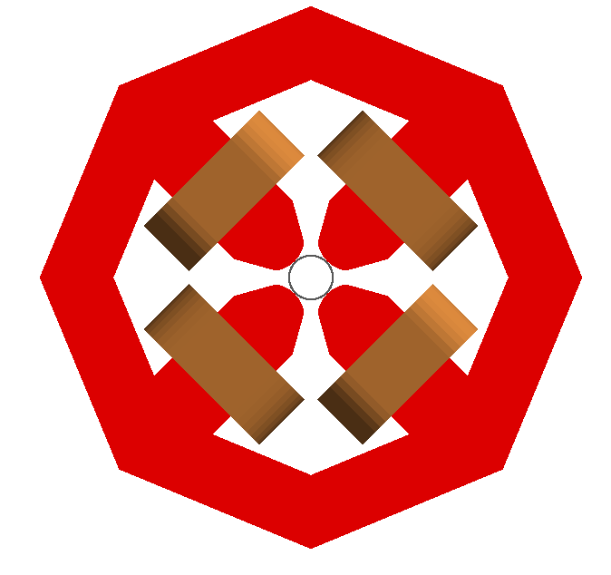

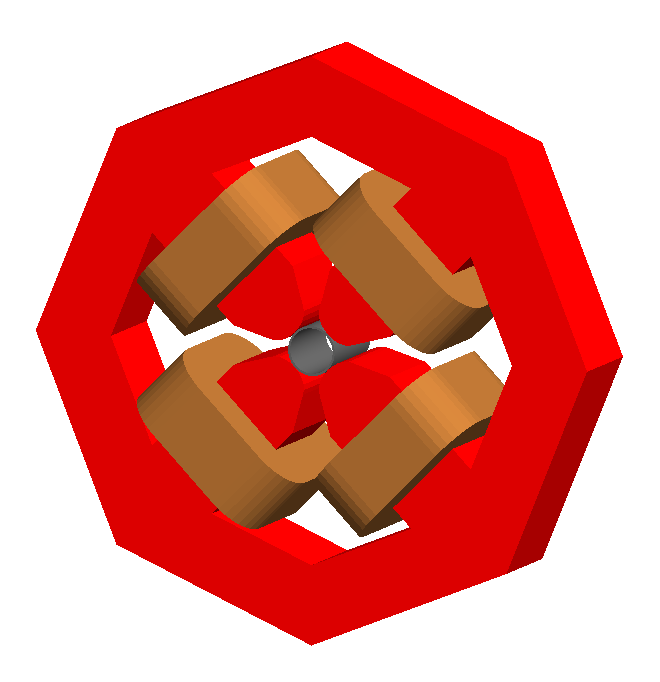

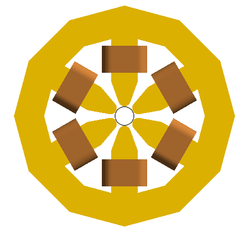

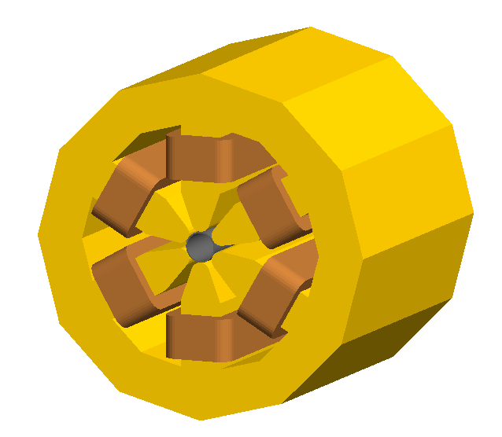

.. _mag-geom-lhc:
		    
LHC Left & Right - "`lhcleft`" | "`lhcright`"
^^^^^^^^^^^^^^^^^^^^^^^^^^^^^^^^^^^^^^^^^^^^^

`lhcleft` and `lhcright` provide more detailed magnet geometry appropriate for the LHC. Here, the
left and right suffixes refer to the shift of the magnet body with respect to the reference beam line.
Therefore, `lhcleft` has the magnet body shifted to the left in the direction of beam travel and the
'active' beam pipe is the right one. Vice versa for the `lhcright` geometry.

For this geometry, only the `sbend` and `quadrupole` have been implemented.  All other magnet geometry
defaults to the cylindrical set.

This geometry is parameterised to a degree regarding the beam pipe chosen.  Of course, parameters similar
to the LHC make most sense, as does use of the `lhcdetailed` aperture type. Examples are shown with various
beam pipes and both `sbend` and `quadrupole` geometries.

* :code:`outerMaterial` is ignored with this choice of geometry.

.. |lhcleft_sbend| image:: figures/lhcleft_sbend.png
			   :width: 60%

.. |lhcleft_quadrupole| image:: figures/lhcleft_quadrupole.png
				:width: 60%

.. |lhcleft_quadrupole_square| image:: figures/lhcleft_quadrupole_square.png
				       :width: 60%

.. |lhcleft_sextupole| image:: figures/lhcleft_sextupole.png
			       :width: 60%

+-----------------------------+-----------------------+
| |lhcleft_sbend|             | |lhcleft_quadrupole|  |
+-----------------------------+-----------------------+
| |lhcleft_quadrupole_square| | |lhcleft_sextupole|   |
+-----------------------------+-----------------------+

.. _external-magnet-geometry:

External Magnet Geometry
^^^^^^^^^^^^^^^^^^^^^^^^

A geometry file may be placed around a beam pipe inside a BDSIM magnet instance. The beam pipe
will be constructed as normal and will use the appropriate BDSIM tracking routines, but the
yoke geometry will be loaded from the file provided. The external geometry **must have a cut out**
in its container volume for the beam pipe to fit, i.e. both the beam pipe and the yoke exist
at the same level in the geometry hierarchy (both are placed in one container for the magnet).
The beam pipe is not placed 'inside' the yoke. This is shown schematically below:

.. figure:: figures/magnet-hierarchy-schematic.pdf
	    :width: 100%
	    :align: center

	    Geometrical hierarchy of a magnet. Here, a quadrupole is shown, but all magnets
	    have the same geometrical structure even if the specific shapes are different.

Therefore, if using a GDML file for the yoke of the magnet (labelled "outer" in the figure),
care should be taken to make the outermost *container* volume, not just a box, but a box with
a cylinder cut out of it, i.e. a Boolean solid.
	    
This will work for `solenoid`, `sbend`, `rbend`, `quadrupole`, `sextupole`, `octupole`,
`decapole`, `multipole`, `muonspoiler`, `vkicker`, `hkicker` element types in BDSIM.

Example: ::

  q1: quadrupole, l=20*cm, k1=0.0235, magnetGeometryType="gdml:mygeometry/atf2quad.gdml";

:code:`autoColour=1` can also be used to automatically colour the supplied geometry by
density if desired. This is on by default.  Example to turn it off: ::
    
  q1: quadrupole, l=20*cm, k1=0.0235, magnetGeometryType="gdml:mygeometry/atf2quad.gdml", autoColour=0;

.. _cavity-geometry-parameters:

Cavity Geometry Parameters
--------------------------

A more detailed rf cavity geometry may be described by constructing a 'cavity' object
in gmad and attaching it by name to an element.  The following parameters may be added
to a cavity object:

.. tabularcolumns:: |p{3cm}|p{2cm}|p{5cm}|

+--------------------------+-----------------+-----------------------------------------------------------------+
| **Parameter**            | **Required**    | **Description**                                                 |
+==========================+=================+=================================================================+
| `name`                   | Yes             | Name of the object                                              |
+--------------------------+-----------------+-----------------------------------------------------------------+
| `type`                   | Yes             | (elliptical | rectangular | pillbox)                            |
+--------------------------+-----------------+-----------------------------------------------------------------+
| `material`               | Yes             | The material for the cavity                                     |
+--------------------------+-----------------+-----------------------------------------------------------------+
| `irisRadius`             | No              | The radius of the narrowest part                                |
+--------------------------+-----------------+-----------------------------------------------------------------+
| `equatorRadius`          | No              | The radius of the widest part                                   |
+--------------------------+-----------------+-----------------------------------------------------------------+
| `halfCellLength`         | No              | Half-length along a cell                                        |
+--------------------------+-----------------+-----------------------------------------------------------------+
| `equatorHorizontalAxis`  | Elliptical only | Horizontal semi-axis of the ellipse at the cavity equator       |
+--------------------------+-----------------+-----------------------------------------------------------------+
| `equatorVerticalAxis`    | Elliptical only | Vertical semi-axis of the ellipse at the cavity equator         |
+--------------------------+-----------------+-----------------------------------------------------------------+
| `irisHorizontalAxis`     | Elliptical only | Horizontal semi-axis of the ellipse at the iris                 |
+--------------------------+-----------------+-----------------------------------------------------------------+
| `irisVerticalAxis`       | Elliptical only | Vertical semi-axis of the ellipse at the iris                   |
+--------------------------+-----------------+-----------------------------------------------------------------+
| `tangentLineAngle`       | Elliptical only | Angle to the vertical line connecting two ellipses              |
+--------------------------+-----------------+-----------------------------------------------------------------+
| `thickness`              | No              | Thickness of material                                           |
+--------------------------+-----------------+-----------------------------------------------------------------+
| `numberOfPoints`         | No              | Number of points to generate around 2 :math:`\pi`.              |
+--------------------------+-----------------+-----------------------------------------------------------------+
| `numberOfCells`          | No              | Number of cells to construct                                    |
+--------------------------+-----------------+-----------------------------------------------------------------+

Example::

  shinyCavity: cavitymodel, type="elliptical",
                       irisRadius = 35*mm,
	               equatorRadius = 103.3*mm,
	               halfCellLength = 57.7*mm,
		       equatorHorizontalAxis = 40*mm,
		       equatorVerticalAxis = 42*mm,
	               irisHorizontalAxis = 12*mm,
	               irisVerticalAxis = 19*mm,
	               tangentLineAngle = 13.3*pi/180,
	               thickness = 1*mm,
	               numberOfPoints = 24,
	               numberOfCells = 1;

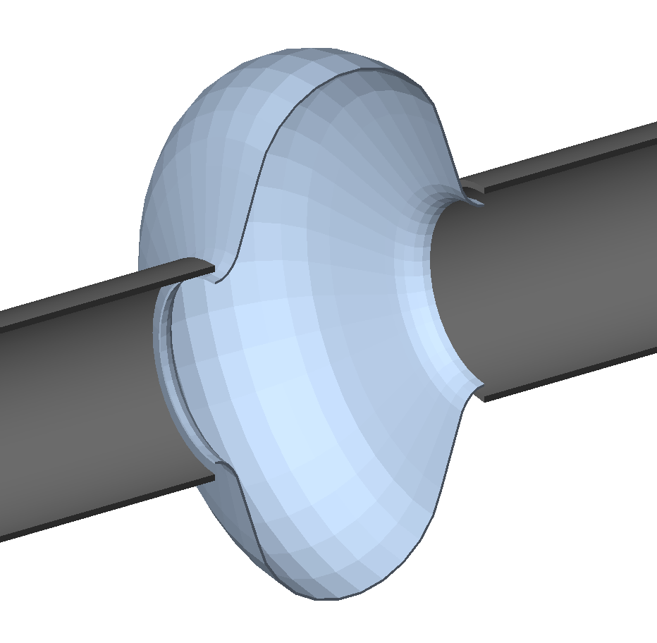

	    Elliptical cavity geometry example from :code:`bdsim/examples/features/geometry/12_cavities/rfcavity-geometry-elliptical.gmad`.

.. figure:: figures/elliptical-cavity.pdf
	   :width: 40%
	   :align: center

The parameterisation used to define elliptical cavities in BDSIM.
The symbols used in the figure map to the cavity options according to the table below.

+-----------------------+-----------------------------+
| **Symbol**            | **BDSIM Cavity Parameter**  |
+=======================+=============================+
| :math:`R`             | equatorRadius               |
+-----------------------+-----------------------------+
| :math:`r`             | irisRadius                  |
+-----------------------+-----------------------------+
| :math:`A`             | equatorHorizontalAxis       |
+-----------------------+-----------------------------+
| :math:`B`             | equatorVerticalAxis         |
+-----------------------+-----------------------------+
| :math:`a`             | irisHorizontalAxis          |
+-----------------------+-----------------------------+
| :math:`b`             | irisVerticalAxis            |
+-----------------------+-----------------------------+
| :math:`\alpha`        | tangentLineAngle            |
+-----------------------+-----------------------------+
| :math:`L`             | halfCellLength              |
+-----------------------+-----------------------------+

.. _externally-provided-geometry:

Externally Provided Geometry
----------------------------

BDSIM provides the ability to use externally provided geometry in the Geant4 model constructed
by BDSIM. Different formats are supported (see :ref:`geometry-formats`). External
geometry can be used in several ways:

1) A placement of a piece of geometry unrelated to the beam line (see :ref:`placements`)
2) Wrapped around the beam pipe in a BDSIM magnet element (see :ref:`external-magnet-geometry`)
3) As a general element in the beam line where the geometry constitutes the whole object. (see :ref:`element`)
4) As the world volume in which the BDSIM beamline is placed. (see :ref:`external-world-geometry`)

.. note:: If a given geometry file is reused in different components, it will be reloaded on purpose
	  to generate a unique set of logical volumes so we have the possibility of different fields,
	  cuts, regions, colours etc. It will only be loaded once though, if the same component
	  is used repeatedly. **However**, specifically for a `placement`, this can be overridden
	  by specifying the parameter :code:`dontReloadGeometry` in the placement definition -
	  see :ref:`placements`.

.. warning:: If including any external geometry, overlaps must be checked in the visualiser by
	     running :code:`/geometry/test/run` before the model is used for a physics study.
   
.. _geometry-formats:

Geometry Formats
^^^^^^^^^^^^^^^^

The following geometry formats are supported. More may be added in collaboration with the BDSIM
developers - please see :ref:`feature-request`. The syntax and preparation of these geometry
formats are described in more detail in :ref:`external-geometry-formats`.

.. tabularcolumns:: |p{0.20\textwidth}|p{0.50\textwidth}|

+----------------------+---------------------------------------------------------------------+
| **Format String**    | **Description**                                                     |
+======================+=====================================================================+
| gdml                 | | Geometry Description Markup Language - Geant4's official geometry |
|                      | | persistency format - recommended, maintained and supported        |
+----------------------+---------------------------------------------------------------------+
| mokka                | | An SQL style description of geometry - not maintained             |
+----------------------+---------------------------------------------------------------------+

* With the `option, checkOverlaps=1;` turned on, each externally loaded piece of geometry will
  also be checked for overlaps.

.. _geometry-gdml:
  
GDML Geometry Specifics
^^^^^^^^^^^^^^^^^^^^^^^

* The Geant4 installation that BDSIM is compiled with repsect to must have GDML support turned on.
* BDSIM must be compiled with the GDML build option in CMake turned on for GDML loading to work.

Creating GDML Geometry
**********************

To create customised geometry, we recommend our separate (free) Python package, **pyg4ometry**. This
is a Python package that can be used in a script to create Geant4 or FLUKA geometry or convert
it into GDML and has many examples. It can also be used to **check for overlaps** in any GDML file
and validate geometry.

See :ref:`python-geometry-preparation` for details and links to the software and manual. This
package is used for many of the examples included with BDSIM and the Python scripts are
included with the examples.

Material Names And Usage
************************

Rules for materials in a GDML file:

* A NIST material (e.g. :code:`G4_AIR`) may be used by name without full definition. The XML
  validator may warning that they are undefined - this is ok as true, but they will be available
  at runtime.
* A BDSIM predefined material (or indeed one defined in the input GMAD) may be used by name
  without a full definition in a GDML file. Similarly, there may be a warning from the XML
  validator, but the material will be available at run time.
* A BDSIM material by one of it's aliases in BDSIM may be used by name, similarly.
* It is allowed to define a material inside a GDML file with the same name as one in BDSIM
  as the GDML preprocessor (see below) will change the name.
* Do not define a material fully but with the same name as a NIST material. Whilst Geant4
  will construct the material when loading the GDML file, it will attach the material by
  **name** and may not find your material definition from the GDML file.

BDSIM will exit if a conflict in naming (and therefore ambiguous materials could be set)
is found.

.. _geometry-gdml-preprocessing:

GDML Preprocessing
******************

Geant4's GDML loader, which BDSIM uses to load GDML files, was only designed to use 1 GDML file.
Unlike Geant4's C++ classes where names to do not matter, in GDML, each object is identified by
name. An example of some GDML defining solids is: ::

  <solids>
    <box lunit="mm" name="box" x="20" y="30" z="40"/>
    <box lunit="mm" name="world" x="200" y="200" z="200"/>
  </solids>

When loading a file, if Geant4 finds an object in memory (Geant4's registries of objects)
already with that name, it uses that object instead of reading the one from the file. e.g. in
this case, another solid with the name "box". This can have the unintended consequence of
thinking you are loading a piece of geometry but getting a completely different piece! This
can cause overlaps, bad tracking and an incorrect model and results. Worse still, it may go unseen.

.. note:: If including any external geometry, overlaps must be checked in the visualiser by
	  running :code:`/geometry/test/run` before the model is used for a physics study.

The most common use of Geant4 is for a detector model where the entire model is written
in 1 GDML file, hence this design in Geant4.

However, in BDSIM, we may wish to piece together (like LEGO bricks) many pieces of
geometry in and around an accelerator. To compensate for this Geant4 behaviour,
we **preprocess** a GDML file. This means, we create a temporary copy of the file,
and change all the names adding a unique string to the beginning of them all - typically
the element or placement the GDML file will be used in. This allows us to load multiple
files with possibly degenerate names safely.

For each name we change, we must check for any uses elsewhere in the file. Therefore,
this can be a :math:`O(N^2)` problem with the number of names. In the case of a GDML
file that includes a large tessellated solid, each individual 3-vector position is
written with it's own name and this vastly increases the number of names to process.

In this case, it is possible to **keep the temporary *preprocessed* file** and edit the
input GMAD file to use this new file. However, this strategy means that if the GDML
file is updated, it has to be preprocessed again and copied and the input edited (not ideal). ::

  option, preprocessGDML=0;

The **Schema** is a set of rules of what is allowed in the GDML file that generally uses the
XML syntax. It defines which *tags* are allowed and what parameters they can have. This is
directed to by the URL at the very top of the file and is found online.  e.g. ::

  <?xml version="1.0" ?>
  <gdml xmlns:xsi="http://www.w3.org/2001/XMLSchema-instance" xsi:noNamespaceSchemaLocation="http://service-spi.web.cern.ch/service-spi/app/releases/GDML/schema/gdml.xsd">

If however, you need **offline access**, then BDSIM includes a copy of the latest GDML Schema.
During the preprocessing, this is automatically substituted for the one included with BDSIM.
If you use a custom Schema or do not wish to use this feature, it can be turned off with: ::

  option, preprocessGDMLSchema=0;

This is independent of the :code:`preprocessGDML` option above, i.e. with that turned off, but
`preprocessGDMLSchema` on (by default), we can preprocess only the Schema location.
  
* BDSIM will put the preprocessed GDML files in a temporary directory and remove
  them once finished. The temporary files can be retained by using the option
  :code:`option, removeTemporaryFiles=0;`.
* BDSIM will create a temporary directory based on the template name "bdsim_XXXXXX" where the
  X characters will be replaced by a randomly generated alpha-numeric sequence from the system
  using `mkdtemp`.
* BDSIM will try :code:`/tmp/`, then :code:`/temp/`, then the current working directory in that
  order to create the temporary directory. This behaviour can be overridden by specifying the option
  :code:`option, temporaryDirectory="/path/to/desired/directory"`. :code:`"./"` could be used
  for example for the current working directory.

The BDSIM GDML preprocessor has some limitations. We cannot support variables in values.
In this case, the user should load a GDML file with Geant4 and re-export it. This will
'flatten' / resolve any variables, e.g. ::

  <variable name="offsetX" value="3"/>
  <position x="offsetX+3" y="0" z="-3|/>

would not work, as the *variable* "offsetX" is referred to in the *value* "x" in the position tag.

.. _external-world-geometry:

External World Geometry
^^^^^^^^^^^^^^^^^^^^^^^

External geometry can be supplied as the world volume with the option `worldGeometryFile`
(see :ref:`options-geometry`). The BDSIM beamline will be placed inside this world volume
provided in the file. ::

  option, worldGeometryFile="gdml:myworld.gdml";

Unlike the standard BDSIM world volume whose size is
set dynamically, the external world volume will have fixed dimensions, therefore the user should supply
a world volume of sufficient size so as to fully encompass the BDSIM beamline. Should the extents of the
BDSIM beamline be larger than the world extents, the beamline will not be constructed and BDSIM will exit.

`worldGeometryFile` should be of the format `format:filename`, where `format` is the geometry
format being used (`gdml` | `gmad` | `mokka`) and filename is the path to the geometry
file. See :ref:`externally-provided-geometry` for more details.

* See also :ref:`physics-bias-importance-sampling` for usage of this.
* The world **material** will be taken from the GDML file and the option :code:`worldMaterial`
  will be ignored. If the option :code:`worldMaterial` is specified as well as
  :code:`worldGeometryFile`, BDSIM will issue a warning but proceed.
* The option :code:`autoColourWorldGeometryFile` can be used (default true) to colour
  the supplied geometry by density. See :ref:`automatic-colours` for details.
* The option :code:`biasForWorldContents` may be used to attach a bias object to the
  daughter volumes (i.e. excluding the world volume itself) of the loaded world geometry.
  This is useful for shielding.
* The option :code:`biasForWorldVolume` may be used to attach a bias object to the world
  volume itself (only). See :ref:`physics-biasing` for details.

.. warning:: Be careful to avoid name clashing if loading multiple GDML files including the world.
	     The usual preprocessGDML option is on to protect against this, but should the user wish,
	     this can be turned off for quicker loading times. The user must therefore ensure no
	     name clashing (i.e. degenerate names for anything between GDML files).

.. _placements:

Placements
----------

Aside from a beam line, pieces of geometry may be placed at any location in the world with
any orientation. The mechanism to do this in BDSIM is called "placements". Either an
externally provided piece of geometry (e.g. GDML file and optional field map) or a BDSIM
provided accelerator component can be placed by declaring a :code:`placement` object in
the input.

For geometry to be placed as part of the beam line, use the :ref:`element` component in a line.

.. warning:: If the geometry overlaps, tracking faults may occur from Geant4 as well as
	     incorrect results and there may not always be warnings provided. For this reason,
	     BDSIM will **always** use the Geant4 overlap checker when placing external geometry
	     into the world volume. This only ensures the container doesn't overlap with BDSIM
	     geometry, not that the internal geometry is valid.

.. warning:: You cannot place external geometry 'inside' an accelerator component with a
	     placement. Although it may appear OK in the visualiser, the hierarchy of the
	     geometry will be wrong and the tracking will not work as expected. Avoid this.

There are 3 possible ways to place a piece of geometry.

1) In global Cartesian coordinates.

   - `x`, `y`, `z` and any rotation are with respect to the world frame of reference.

2) In curvilinear coordinates.

   - `s`, `x`, `y` are used along with a rotation. The transform for the distance `s` along the beamline
     is first applied. `x`, `y` and the rotation are with respect to that frame.

3) In curvilinear coordinates with respect to a beam line element by name.

   - The name of an element is used to look up its (mid-point) `s` coordinate. `s`, `x`, `y` and the rotation
     are with respect to the centre of that element. **Therefore**, `s` in this case is `local` curvilinear
     `s`.

The scenario is automatically selected based on which parameters are set. If `s` is non-zero, then
it is either scenario 2 or 3. If `referenceElement` is specified, scenario 3 is assumed.

.. warning:: For both scenarios 2) and 3), a placement can only be made **inside** the S length of
	     the accelerator - it is not possible to place something beyond the accelerator currently.
	     In this case, the user should resort to a global placement.

Two styles of rotation can be used: either a set of three Euler angles, or the axis-angle
rotation scheme, where a **unit** vector is provided in :math:`x,y,z` and an angle to
rotate about that. The later is usually easier to imagine.	     
	     
The following parameters may be specified with a placement in BDSIM:

.. tabularcolumns:: |p{4cm}|p{7cm}|

+-------------------------+--------------------------------------------------------------------+
| **Parameter**           |  **Description**                                                   |
+-------------------------+--------------------------------------------------------------------+
| geometryFile            | :code:`format:file` - which geometry format and file to use        |
+-------------------------+--------------------------------------------------------------------+
| stripOuterVolume        | (1 or 0) if true, then remove and discard the outer logical volume |
|                         | from the loaded geometry and turn it into an 'assembly' volume     |
|                         | with the contents placed with the correct relative transform in    |
|                         | the world.                                                         |
+-------------------------+--------------------------------------------------------------------+
| bdsimElement            | Name of the beam line element defined in the parser to be used     |
+-------------------------+--------------------------------------------------------------------+
| x                       | Offset in global x                                                 |
+-------------------------+--------------------------------------------------------------------+
| y                       | Offset in global y                                                 |
+-------------------------+--------------------------------------------------------------------+
| z                       | Offset in global z                                                 |
+-------------------------+--------------------------------------------------------------------+
| s                       | Curvilinear s coordinate (global | local depending on parameters)  |
+-------------------------+--------------------------------------------------------------------+
| phi                     | Euler angle phi for rotation                                       |
+-------------------------+--------------------------------------------------------------------+
| theta                   | Euler angle theta for rotation                                     |
+-------------------------+--------------------------------------------------------------------+
| psi                     | Euler angle psi for rotation                                       |
+-------------------------+--------------------------------------------------------------------+
| axisX                   | Axis angle rotation x-component of unit vector                     |
+-------------------------+--------------------------------------------------------------------+
| axisY                   | Axis angle rotation y-component of unit vector                     |
+-------------------------+--------------------------------------------------------------------+
| axisZ                   | Axis angle rotation z-component of unit vector                     |
+-------------------------+--------------------------------------------------------------------+
| angle                   | Axis angle, angle to rotate about unit vector                      |
+-------------------------+--------------------------------------------------------------------+
| axisAngle               | Boolean whether to use axis angle rotation scheme (default false)  |
+-------------------------+--------------------------------------------------------------------+
| sensitive               | Whether the geometry records energy deposition (default true)      |
+-------------------------+--------------------------------------------------------------------+
| referenceElement        | Name of element to place geometry with respect to (string)         |
+-------------------------+--------------------------------------------------------------------+
| referenceElementNumber  | Occurrence of `referenceElement` to place with respect to if it    |
|                         | is used more than once in the sequence. Zero counting.             |
+-------------------------+--------------------------------------------------------------------+
| autoColour              | Boolean whether the geometry should be automatically coloured by   |
|                         | density if no colour information is supplied. (default true)       |
+-------------------------+--------------------------------------------------------------------+
| fieldAll                | Name of field object definition to be used as the field for the    |
|                         | whole geometry including all daughter volumes.                     |
+-------------------------+--------------------------------------------------------------------+
| dontReloadGeometry      | (Boolean) Purposively circumvent BDSIM's reloading of the same     |
|                         | geometry file for each placement, i.e. reuse it. This will mean    |
|                         | any cuts or fields or sensitivity will be the same.                |
+-------------------------+--------------------------------------------------------------------+

* Only one of :code:`bdsimElement` or :code:`geometryFile` should be used in a placement.
* :code:`bdsimElement` should be used to name a component to place. In this case the component
  should be defined **before** the placement definition in the input GMAD.
* :code:`geometryFile` should be used to place an externally provided geometry file.
* This is intended to place geometry alongside the beam line and **not** inside or as part of it.
* The user is responsible for ensuring that the geometry does not
  overlap with any other geometry including the beam line.
* Only in special cases, such as for a magnet yoke, can externally provided
  geometry be placed "inside" BDSIM geometry.
* The geometry may also have a field map overlaid on it.
* Placements cannot be made with respect to other placements.
* There is the possibility to strip off the outermost logical volume and place the contents
  with the compound transform in the world. Useful for preparing for example, shielding.
  See the parameter below :code:`stripOuterVolume=1`.
* Examples can be found in :code:`bdsim/examples/features/geometry/13_placements`.
* The file path provided in :code:`geometryFile` should either be relative to where bdsim
  is executed from or an absolute path.
* The main beam line begins at (0,0,0) by default but may be offset.  See
  :ref:`beamline-offset` for more details.
* :code:`dontReloadGeometry` is useful when you have lots of repeated placements of the same thing
  that is essentially passive material with the same sensitivity e.g. shielding. Specifically,
  when you don't want to reload the geometry and don't want to preprocess it.

`referenceElementNumber` is the occurrence of that element in the sequence. For example, if a sequence
was: ::

  l1: line=(d1,sb1,d2,qd1,d2,df1,d2,sb1,d1);

and we wanted to place with respect to the first element, we would use::

  p1: placement, referenceElement="d1",
                 referenceElementNumber=0;

And the `referenceElementNumber` argument is optional as the default is 0. If we want to place with respect to
the fourth usage of "d2", we would use::

  p1: placement, referenceElement="d2",
                 referenceElementNumber=3;

If we want to placement at some coordinates with an axis-angle rotation (easier to perceive), we
would use: ::

  p1: placement, geometryFile="gdml:anExampleFile.gdml",
                 x=2*m, y=10*cm, z=30*m,
                 axisAngle=1,
		 axisY=1,
		 angle=pi/4;

This would place with an offset of :math:`x, y, z = 2, 0.1, 30 m`, then a rotation about the Y axis
of :math:`\pi/4`. We use the flag :code:`axisAngle=1` to turn 'on' the axis angle rotation
(instead of the Euler angles one), and :code:`axisX`, :code:`axisY`, :code:`axisZ` are the
components of the unit vector about which to rotate by :code:`angle`. Each component is by
default 0, so we need only define the axis we want as 1 if aligned with one of the global
axes.

.. note:: Dipoles are split in BDSIM into many small straight sections. These must have a unique
	  name to appear correctly in the Geant4 visualisation system. The splitting is done
	  dynamically based on the angle of the bend and if it has pole face rotations on one
	  or both sides. The names are mangled and so the original name will not be found.
	  The user should run the visualiser first
	  and identify the name of the segment of the dipole they wish to place with respect to.
	  Alternatively, in the case of low angle bends, the element before or after can be used
	  with a finite `s` offset.

.. Note:: Geant4 uses a right-handed coordinate system and :math:`m` and :math:`rad` are
	  the default units for offsets and angles in BDSIM.

External Geometry File
^^^^^^^^^^^^^^^^^^^^^^
	  
The following is an example syntax used to place a piece of geometry: ::

  leadblock: placement, x = 10*m,
                        y = 3*cm,
			z = 12*m,
			geometryFile="gdml:mygeometry/detector.gdml";

BDSIM Component
^^^^^^^^^^^^^^^
			
The following is an example of placing a **single** BDSIM-generated component at an arbitrary position: ::

  block1: rcol, l=1*m, material="Cu";
  pl1: placement, bdsimElement="block1", x=2*m, z=20*m, axisAngle=1, axisY=1, angle=pi/4;

.. warning:: Care must be taken not to define the same placement name twice. If `leadblock`
	     were declared again here, the first definition would be updated with parameters
	     from the second, leading to possibly unexpected geometry.

.. note:: For using a general piece of geometry as part of a beam line, it is better to use
	  the `element` beam line element.  See :ref:`element`.  The length should be specified
	  accurately and then the beam line will fit together well without any air gaps.

  
.. _tunnel-geometry:

Tunnel Geometry
---------------

BDSIM can build a tunnel around the beam line. Currently, there are two main ways to control this.

1) The tunnel follows the beam line, bending automatically (recommended)
2) The tunnel is just built in a straight line - this may be useful for linear colliders but
   may also cause geometry overlaps (the user is responsible for checking this!)

.. warning:: With option 2, the user is entirely responsible to ensure no overlaps occur
	     (through good design).

Examples of tunnel geometry can be found with the BDSIM source code in
:code:`bdsim/examples/features/geometry/tunnel*` and are described in :ref:`tunnel-examples`.

The automatic tunnel building is controlled through the following options used with the
:code:`option` command.

.. tabularcolumns:: |p{0.20\textwidth}|p{0.30\textwidth}|p{0.4\textwidth}|

+----------------------------------+-------------+-----------------------------------------+
| **Tunnel Parameters**            | **Default** | **Description**                         |
+==================================+=============+=========================================+
| buildTunnel                      | 0 (false)   | Whether to build a tunnel               |
+----------------------------------+-------------+-----------------------------------------+
| buildTunnelStraight              | 0 (false)   | Whether to build a tunnel, ignoring the |
|                                  |             | beamline and just in a straight line    |
+----------------------------------+-------------+-----------------------------------------+
| buildTunnelFloor                 | 1 (true)    | Whether to add a floor to the tunnel    |
+----------------------------------+-------------+-----------------------------------------+
| tunnelIsInfiniteAbsorber         | 0 (false)   | Whether all particles entering the      |
|                                  |             | tunnel material should be killed or not |
+----------------------------------+-------------+-----------------------------------------+
| tunnelType                       | "circular"  | Which style of tunnel to use - one of:  |
|                                  |             | "circular`, "elliptical", "square",     |
|                                  |             | "rectangular"                           |
+----------------------------------+-------------+-----------------------------------------+
| tunnelAper1                      | 2           | Tunnel aperture parameter #1, typically |
|                                  |             | horizontal (m)                          |
+----------------------------------+-------------+-----------------------------------------+
| tunnelAper2                      | 2           | Tunnel aperture parameter #2, typically |
|                                  |             | vertical (m)                            |
+----------------------------------+-------------+-----------------------------------------+
| tunnelThickness                  | 0.1         | Thickness of tunnel wall (m)            |
+----------------------------------+-------------+-----------------------------------------+
| tunnelSoilThickness              | 1.0         | Soil thickness outside tunnel wall (m)  |
+----------------------------------+-------------+-----------------------------------------+
| tunnelMaterial                   | "concrete"  | Material for tunnel wall                |
+----------------------------------+-------------+-----------------------------------------+
| soilMaterial                     | "soil"      | Material for soil outside tunnel wall   |
+----------------------------------+-------------+-----------------------------------------+
| tunnelOffsetX                    | 0           | Horizontal offset of the tunnel with    |
|                                  |             | respect to the beam line reference      |
|                                  |             | trajectory                              |
+----------------------------------+-------------+-----------------------------------------+
| tunnelOffsetY                    | 0           | Vertical offset of the tunnel with      | 
|                                  |             | respect to the beam line reference      |
|                                  |             | trajectory                              |
+----------------------------------+-------------+-----------------------------------------+
| tunnelFloorOffset                | 1.0         | The offset of the tunnel floor from the |
|                                  |             | centre of the tunnel (**not** the beam  |
|                                  |             | line). Must be positive.                |
+----------------------------------+-------------+-----------------------------------------+

Example: ::

  option, buildTunnel = 1,
	  tunnelOffsetX = -35*cm,
	  tunnelOffsetY = 30*cm,
	  tunnelAper1 = 220*cm,
	  tunnelThickness = 30*cm,
	  tunnelSoilThickness = 23*m;

These parameters are shown schematically in the figure below (gaps not to scale, elliptical
shown as an example).

.. figure:: figures/tunnel/tunnel_parameters.pdf
	    :width: 80%
	    :align: center

The soil around the tunnel is typically symmetric, with the `tunnelSoilThickness` being added to
the larger of the horizontal and vertical tunnel dimensions.

Construction of the tunnel geometry may fail in particular cases of different beam lines.
Beam lines with very strong bends ( > 0.5 rad) over a few metres may cause overlapping
geometry. In future, it will be possible to override the automatic algorithm between
certain elements in the beamline, but for now such situations must be avoided.

.. note:: Surrounding the beam line with a tunnel completely means that every particle simulated
	  will have to eventually hit something and not escape. This means that every single particle
	  will likely create a shower of particles down to 0 energy. This can increase simulation time.
	  To avoid this, or at least control this behaviour, it is recommended to use the options
	  :code:`minimumKineticEnergyTunnel` or :code:`tunnelIsInfiniteAbsorber`.

.. _crystals:

Crystals
--------

To use various crystal components in BDSIM such as :ref:`element-crystal-col`, a crystal definition
must first be made. This contains all of the required information to construct the
crystal. The following parameters are required:

+-------------------+------------------------------------------------------------+
| **Parameter**     | **Description**                                            |
+===================+============================================================+
| material          | Material that the crystal will be composed of              |
+-------------------+------------------------------------------------------------+
| data              | Path to data files, including first part of file name      |
+-------------------+------------------------------------------------------------+
| shape             | Geometry used - one of (box, cylinder, torus)              |
+-------------------+------------------------------------------------------------+
| lengthX           | X-dimension full length [m]                                |
+-------------------+------------------------------------------------------------+
| lengthY           | Y-dimension full length [m]                                |
+-------------------+------------------------------------------------------------+
| lengthZ           | Z-dimension full length [m]                                |
+-------------------+------------------------------------------------------------+
| sizeA             | Unit cell a dimension [m]*                                 |
+-------------------+------------------------------------------------------------+
| sizeB             | Unit cell b dimension [m]*                                 |
+-------------------+------------------------------------------------------------+
| sizeC             | Unit cell c dimension [m]*                                 |
+-------------------+------------------------------------------------------------+
| alpha             | Interaxial angle :math:`\alpha` in units of :math:`\pi/2`  |
+-------------------+------------------------------------------------------------+
| beta              | Interaxial angle :math:`\beta` in units of :math:`\pi/2`   |
+-------------------+------------------------------------------------------------+
| gamma             | Interaxial angle :math:`\gamma` in units of :math:`\pi/2`  |
+-------------------+------------------------------------------------------------+
| spaceGroup        | Space grouping of lattice (integer)                        |
+-------------------+------------------------------------------------------------+
| bendingAngleYAxis | Angle that the crystal is bent about Y-axis [rad].         |
+-------------------+------------------------------------------------------------+
| bendingAngleZAxis | Angle that the crystal is bent about Z-axis [rad].         |
+-------------------+------------------------------------------------------------+

* (*) Note, the units of metres may seem ridiculous, but the parser is consistently in S.I.
  (or as much as possible). We recommend using units in the parser such as Angstroms.
  See :ref:`coordinates-and-units`.

.. note:: Depending on the shape chosen, the geometry may or may not represent the bending angle.
	  The `bendingAngleYAxis` is always supplied to the channelling physics process
	  irrespective of the geometry. This is important to note that the crystal may be a box,
	  but the 'crystal' inside (in terms of the physics process) is not related to the geometry
	  and is bent. The physical geometry is merely a volume where the crystal parameters
	  apply.

.. note:: If there is no vertical bending angle, the torus geometry will reduce to the
	  cylinder geometry,  as this is faster for tracking. Similarly, if the cylinder is used
	  and there is no horizontal bending angle, a box will be used, as it's not possible
	  to construct a cylinder with an infinite bending radius.

It is entirely possible to add more shapes to the code. Please contact the developers
:ref:`feature-request`.

Examples: ::

  lovelycrystal: crystal, material = "G4_Si",
	       		data = "data/Si220pl",
			shape = "box",
			lengthY = 5*cm,
			lengthX = 0.5*mm,
			lengthZ = 4*mm,
			sizeA = 5.43*ang,
			sizeB = 5.43*ang,
			sizeC = 5.43*ang,
			alpha = 1,
			beta  = 1,
			gamma = 1,
			spaceGroup = 227,
			bendingAngleYAxis = 0.1*rad,
			bendingAngleZAxis = 0;

  uglycrystal: crystal, material = "G4_Si",
	     	      	data = "data/Si220pl",
			shape = "box",
			lengthY = 5*cm,
			lengthX = 0.5*mm,
			lengthZ = 4*mm,
			sizeA = 5.43*ang,
			sizeB = 5.43*ang,
			sizeC = 5.43*ang,
			alpha = 1,
			beta  = 1,
			gamma = 1,
			spaceGroup = 227,
			bendingAngleYAxis = -0.1*rad,
			bendingAngleZAxis = 0;

More examples can be found in :ref:`crystal-examples`.

.. _colours:

Colours
-------

Most items allow you to define a custom colour for them to aid in visualisation. This includes
all magnets and collimators, the shield and degrader. The colour can be defined with red, green
and blue components, as well as a level of transparency, alpha. RGB values can range from 0
to 255. Once defined, a colour may not be redefined. The syntax to define a colour is

.. code-block:: none

		NAME: newcolour, red=#, green=#, blue=#, alpha=#

Examples: ::
  
  purple: newcolour, red=128, green=0, blue=128;
  col1: rcol, l=0.2*m, xsize=5*cm, ysize=4*cm, colour="purple", material="copper";

and::

  purple: newcolour, red=128, green=0, blue=128;
  orange: newcolour, red=255, green=140, blue=0;
  nicegreen: newcolour, red=0, green=128, blue=0;

  d1: drift, l=1*m;
  basebend: sbend, l=2*m, angle=0.9;
  sb1: basebend, colour="purple";
  sb3: basebend, colour="nicegreen";
  sb4: basebend, colour="yellow";
  sb5: basebend, colour="orange";
  sb6: basebend, colour="red";

  beamline: line=(d1,sb1,d1,basebend,d1,sb3,d1,sb4,d1,sb5,d1,sb6,d1);
  use, beamline;
  sample, all;

  beam,  particle="proton",
         energy= 50*GeV;

This examples if from `bdsim/examples/features/visualisation/coloured_sbend.gmad` and
produces the model shown below.

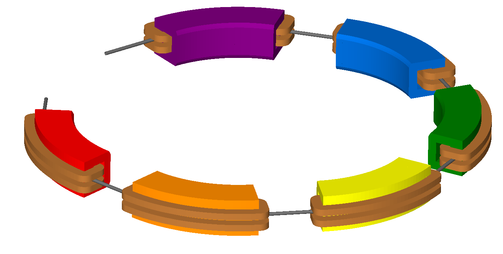

* Colours can only be specified on an element-by-element basis.
* Colour names are case-sensitive.
* New colour names must not clash with predefined BDSIM colour names.

All available colours in BDSIM can be found by running BDSIM with the :code:`--colours` command: ::

  bdsim --colours

For convenience the predefined colours in BDSIM are:

+---------------------+-----+-----+-----+------+
| Name                |  R  |  G  |  B  |  A   |
+=====================+=====+=====+=====+======+
| LHCcoil             | 229 | 191 | 0   | 1    |
+---------------------+-----+-----+-----+------+
| LHCcollar           | 229 | 229 | 229 | 1    |
+---------------------+-----+-----+-----+------+
| LHCcopperskin       | 184 | 133 | 10  | 1    |
+---------------------+-----+-----+-----+------+
| LHCyoke             | 0   | 127 | 255 | 1    |
+---------------------+-----+-----+-----+------+
| LHCyokered          | 209 | 25  | 25  | 1    |
+---------------------+-----+-----+-----+------+
| awakescreen         | 175 | 196 | 222 | 1    |
+---------------------+-----+-----+-----+------+
| awakespectrometer   | 0   | 102 | 204 | 1    |
+---------------------+-----+-----+-----+------+
| beampipe            | 102 | 102 | 102 | 1    |
+---------------------+-----+-----+-----+------+
| black               | 0   | 0   | 0   | 1    |
+---------------------+-----+-----+-----+------+
| blue                | 0   | 0   | 255 | 1    |
+---------------------+-----+-----+-----+------+
| brown               | 114 | 63  | 0   | 1    |
+---------------------+-----+-----+-----+------+
| coil                | 184 | 115 | 51  | 1    |
+---------------------+-----+-----+-----+------+
| collimator          | 63  | 102 | 51  | 1    |
+---------------------+-----+-----+-----+------+
| copper              | 184 | 115 | 51  | 1    |
+---------------------+-----+-----+-----+------+
| crystal             | 175 | 196 | 222 | 1    |
+---------------------+-----+-----+-----+------+
| cyan                | 0   | 255 | 255 | 1    |
+---------------------+-----+-----+-----+------+
| decapole            | 76  | 51  | 178 | 1    |
+---------------------+-----+-----+-----+------+
| default             | 229 | 229 | 229 | 1    |
+---------------------+-----+-----+-----+------+
| degrader            | 159 | 159 | 159 | 1    |
+---------------------+-----+-----+-----+------+
| dipolefringe        | 229 | 229 | 229 | 1    |
+---------------------+-----+-----+-----+------+
| drift               | 102 | 102 | 102 | 1    |
+---------------------+-----+-----+-----+------+
| ecol                | 63  | 102 | 51  | 1    |
+---------------------+-----+-----+-----+------+
| element             | 229 | 229 | 229 | 1    |
+---------------------+-----+-----+-----+------+
| gap                 | 229 | 229 | 229 | 1    |
+---------------------+-----+-----+-----+------+
| gdml                | 102 | 51  | 0   | 1    |
+---------------------+-----+-----+-----+------+
| gray                | 127 | 127 | 127 | 1    |
+---------------------+-----+-----+-----+------+
| green               | 0   | 255 | 0   | 1    |
+---------------------+-----+-----+-----+------+
| grey                | 127 | 127 | 127 | 1    |
+---------------------+-----+-----+-----+------+
| hkicker             | 76  | 51  | 178 | 1    |
+---------------------+-----+-----+-----+------+
| iron                | 129 | 81  | 74  | 1    |
+---------------------+-----+-----+-----+------+
| jcol                | 63  | 102 | 51  | 1    |
+---------------------+-----+-----+-----+------+
| kapton              | 236 | 96  | 20  | 0.5  |
+---------------------+-----+-----+-----+------+
| kicker              | 0   | 102 | 204 | 1    |
+---------------------+-----+-----+-----+------+
| lead                | 96  | 104 | 115 | 1    |
+---------------------+-----+-----+-----+------+
| magenta             | 255 | 0   | 255 | 1    |
+---------------------+-----+-----+-----+------+
| marker              | 229 | 229 | 229 | 1    |
+---------------------+-----+-----+-----+------+
| multipole           | 118 | 135 | 153 | 1    |
+---------------------+-----+-----+-----+------+
| muonspoiler         | 0   | 205 | 208 | 1    |
+---------------------+-----+-----+-----+------+
| octupole            | 0   | 153 | 76  | 1    |
+---------------------+-----+-----+-----+------+
| opaquebox           | 51  | 51  | 51  | 0.2  |
+---------------------+-----+-----+-----+------+
| paralleltransporter | 229 | 229 | 229 | 1    |
+---------------------+-----+-----+-----+------+
| quadrupole          | 209 | 25  | 25  | 1    |
+---------------------+-----+-----+-----+------+
| rbend               | 0   | 102 | 204 | 1    |
+---------------------+-----+-----+-----+------+
| rcol                | 63  | 102 | 51  | 1    |
+---------------------+-----+-----+-----+------+
| reallyreallydarkgrey| 51  | 51  | 51  | 1    |
+---------------------+-----+-----+-----+------+
| rectangularbend     | 0   | 102 | 204 | 1    |
+---------------------+-----+-----+-----+------+
| red                 | 255 | 0   | 0   | 1    |
+---------------------+-----+-----+-----+------+
| rf                  | 118 | 135 | 153 | 1    |
+---------------------+-----+-----+-----+------+
| rfcavity            | 118 | 135 | 153 | 1    |
+---------------------+-----+-----+-----+------+
| rfx                 | 118 | 135 | 153 | 1    |
+---------------------+-----+-----+-----+------+
| rfy                 | 118 | 135 | 153 | 1    |
+---------------------+-----+-----+-----+------+
| rmatrix             | 229 | 229 | 229 | 1    |
+---------------------+-----+-----+-----+------+
| sbend               | 0   | 102 | 204 | 1    |
+---------------------+-----+-----+-----+------+
| screen              | 175 | 196 | 222 | 1    |
+---------------------+-----+-----+-----+------+
| screenframe         | 178 | 178 | 178 | 0.4  |
+---------------------+-----+-----+-----+------+
| sectorbend          | 0   | 102 | 204 | 1    |
+---------------------+-----+-----+-----+------+
| sextupole           | 255 | 204 | 0   | 1    |
+---------------------+-----+-----+-----+------+
| shield              | 138 | 135 | 119 | 1    |
+---------------------+-----+-----+-----+------+
| soil                | 138 | 90  | 0   | 0.4  |
+---------------------+-----+-----+-----+------+
| solenoid            | 255 | 139 | 0   | 0.7  |
+---------------------+-----+-----+-----+------+
| srfcavity           | 175 | 196 | 222 | 1    |
+---------------------+-----+-----+-----+------+
| target              | 63  | 102 | 51  | 1    |
+---------------------+-----+-----+-----+------+
| thinmultipole       | 229 | 229 | 229 | 1    |
+---------------------+-----+-----+-----+------+
| thinrmatrix         | 229 | 229 | 229 | 1    |
+---------------------+-----+-----+-----+------+
| tkicker             | 0   | 102 | 204 | 1    |
+---------------------+-----+-----+-----+------+
| traj_negative       | 204 | 0   | 0   | 1    |
+---------------------+-----+-----+-----+------+
| traj_neutral        | 51  | 178 | 0   | 0.2  |
+---------------------+-----+-----+-----+------+
| traj_positive       | 0   | 51  | 229 | 1    |
+---------------------+-----+-----+-----+------+
| tunnel              | 138 | 135 | 119 | 1    |
+---------------------+-----+-----+-----+------+
| tunnelfloor         | 127 | 127 | 114 | 1    |
+---------------------+-----+-----+-----+------+
| undulator           | 159 | 159 | 159 | 1    |
+---------------------+-----+-----+-----+------+
| vkicker             | 186 | 84  | 211 | 1    |
+---------------------+-----+-----+-----+------+
| warning             | 255 | 19  | 146 | 1    |
+---------------------+-----+-----+-----+------+
| water               | 0   | 102 | 204 | 0.5  |
+---------------------+-----+-----+-----+------+
| white               | 255 | 255 | 255 | 1    |
+---------------------+-----+-----+-----+------+
| wirescanner         | 138 | 135 | 119 | 1    |
+---------------------+-----+-----+-----+------+
| yellow              | 255 | 255 | 0   | 1    |
+---------------------+-----+-----+-----+------+

.. _automatic-colours:

Automatic Colours
-----------------

In the case where an automatic colouring option is used, BDSIM can automatically assign a colour
to volumes based on their material for visualisation purposes. This is done with a set of predefined
ones for common elements and materials, and then the fall back is to use the state and the density. The
materials state sets the opacity and the density is used to scale a grey colour. In all cases, the geometry
will be visible.

.. _regions:
			
Regions
-------

In Geant4, it is possible to have different *regions* - each with their own production cuts
and user limits. A "region" in Geant4 terms is a collection of Logical Volumes that have the
same set of production cuts and don't necessarily have to be beside each other.

Production cuts are a length scale over which the simulation is considered correct and
can roughly be thought of as the length a secondary would have to travel in that material
to be tracked.

In BDSIM, there is one default region that applies everywhere. It is controlled
by :code:`option, defaultRangeCut` along with the other options :code:`prodCutXXXX`
(see :ref:`physics-process-options`).

The :code:`defaultRangeCut` acts as a default for the 4 possible range cuts for
protons, photons, electrons and positrons, unless their :code:`prodCutXXXX` option
is specified.  Aside from the global options, a :code:`custregion` object may be
declared that defines a set of range cuts. This object can then be attached to
beam line elements. For example::

  precisionRegion: cutsregion, prodCutProtons=1*m,
                               prodCutElectrons=10*m,
			       prodCutPositrons=10*m,
			       prodCutPhotons = 1*mm;

  d1: drift, l=10*m, region="precisionRegion";

The following parameters are available in the `cutsregion` object and as global options:

+--------------------+----------------------------------------+
| **Parameter**      | **Description**                        |
+====================+========================================+
| defaultRangeCut    | The default range cut for this object. |
+--------------------+----------------------------------------+
| prodCutProtons     | The range cut for protons.             |
+--------------------+----------------------------------------+
| prodCutPhotons     | The range cut for photons / gammas.    |
+--------------------+----------------------------------------+
| prodCutElectrons   | The range cut for electrons.           |
+--------------------+----------------------------------------+
| prodCutPositrons   | The range cut for positrons.           |
+--------------------+----------------------------------------+

Geant4 translates these range cuts into an energy per particle type per material. This
method is documented as being much more physically accurate than a simple energy
cut across all volumes for all particle types. i.e. the computation time can be
reduced but the physical accuracy maintained in areas of vastly different
density.

* The default for Geant4 is **1 mm** or **0.7 mm** depending on the version.
  This approximately corresponds to keV energy scales in air for most particles.
* The related energies in various materials do not scale linearly or continuously
  with the range parameter. This is OK.

.. warning:: Setting a length scale longer or larger than the beam line element or
	     volume the region will be used in may result in inaccurate physics
	     result and peaks and troughs in energy deposition around boundaries.

* If the `option, defaultRangeCut` is set, this will be the default for the other options
  if not specified.
* If `defaultRangeCut` is not specified in a `cutsregion` object, the default for each
  range will be the corresponding range from the options. e.g. `option, prodCutProtons`
  will be the default for `prodCutProtons` in a `cutsregion` object if `defaultRangeCut`
  is not specified in the object.
* See :code:`bdsim/examples/features/processes/regions` for documented examples.

.. _one-turn-map:

One Turn Map
------------

Geant4 mandates that there are no overlaps between solids, which in
BDSIM means that a thin 1 |nbsp| nm gap is placed between each lattice
element.  Whilst these thin gaps have a negligible effect for a single
pass or turn, over several turns it introduces a sizeable inaccuracy
in the tracking (in the context of large circular models).
To correct for this, BDSIM models can be supplemented
with a one turn map which is applied at the end of each turn to right
the primary back onto the correct trajectory.  To ensure physical
results the one turn map is only applied to primaries, if they did not
interact on the previous turn, and if they are within 5% of the
reference momentum.  The one turn map is also not applied on the first
turn where there the beam is offset in S, but applied on following
turns, still accounting for the exceptions mentioned above.

The map must be of the format as written by MAD-X-PTC's ``PTC_NORMAL``
command.  A one turn map (in this case, 12th order) can be generated
in MAD-X with the following ::

  PTC_CREATE_UNIVERSE;
  PTC_CREATE_LAYOUT, model=2,method=6,nst=10, exact=true, resplit, xbend;
  PTC_NORMAL,maptable,icase=5,no=12;
  write, table="map_table", file="my_oneturn_map_file";
  PTC_END;

To use then use the one turn map with BDSIM ::

  option, ptcOneTurnMapFileName="path/to/my_oneturn_map_file";

* This can only be used with circular machines.
