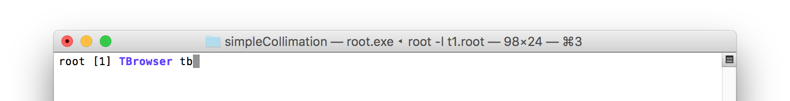
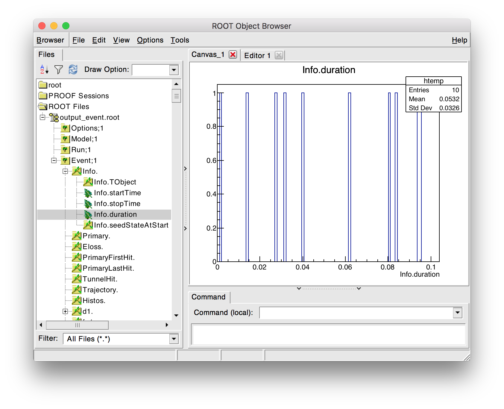
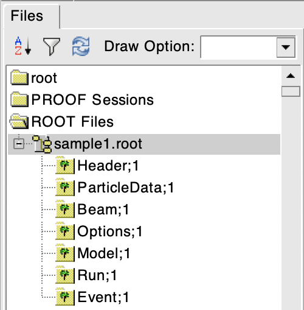
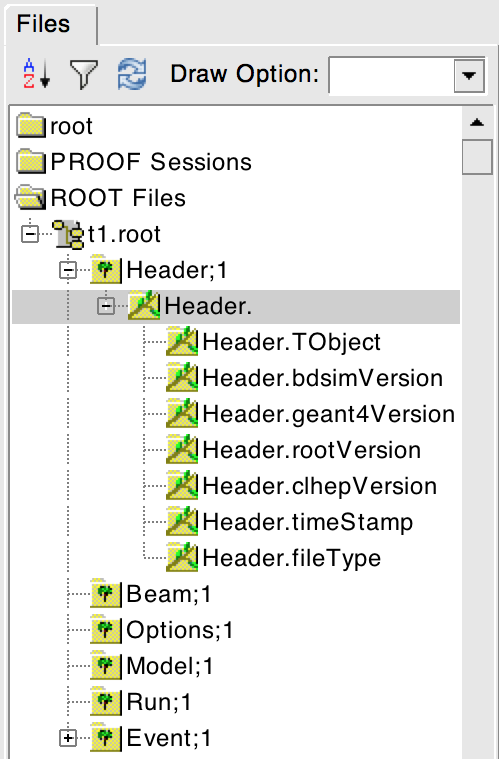
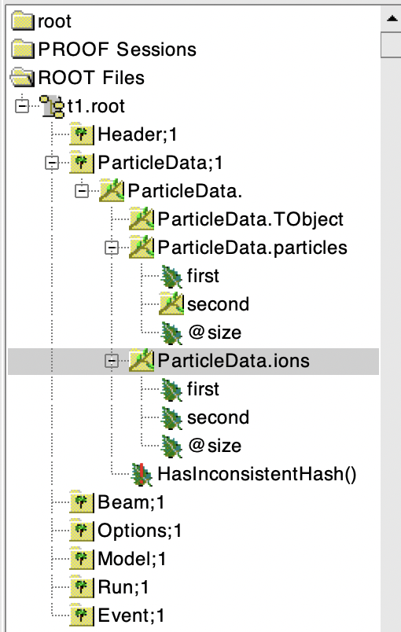
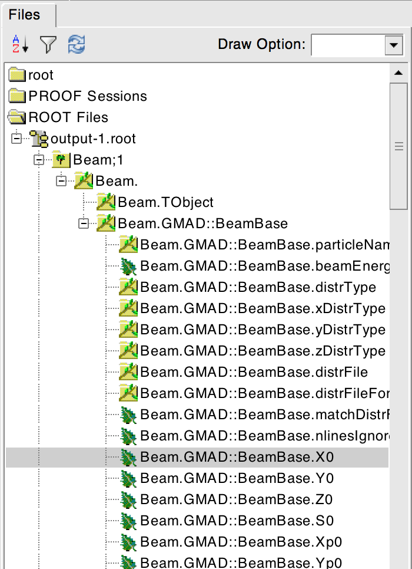
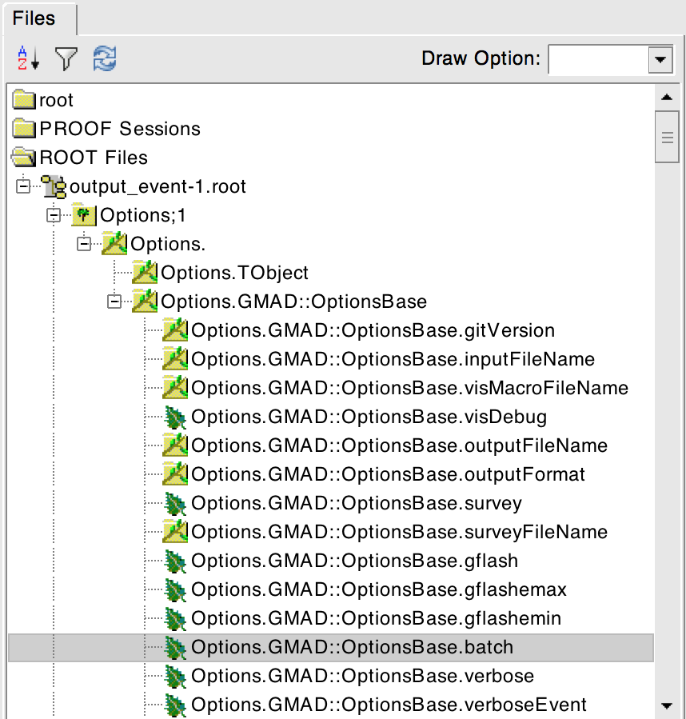
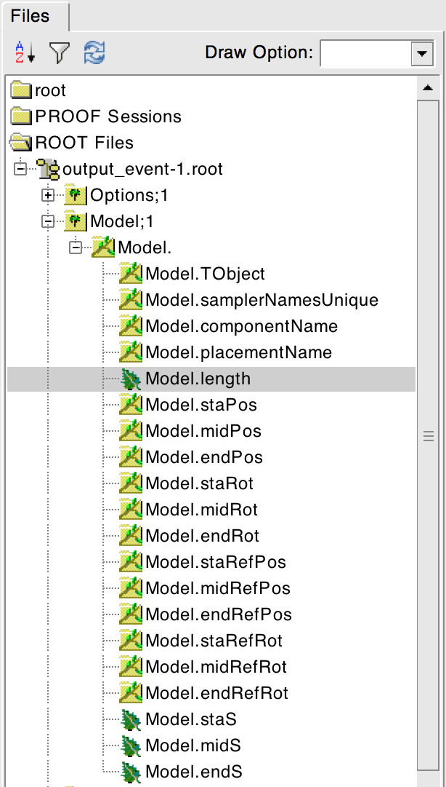
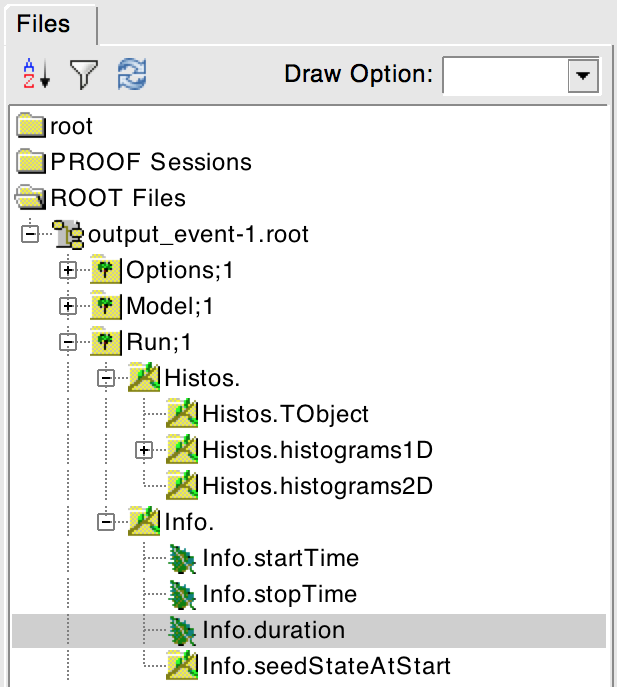
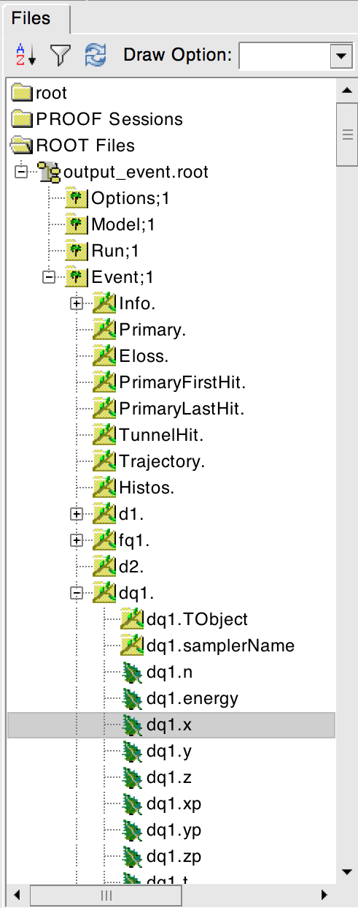

.. _output-section:

======
Output
======

By default, BDSIM writes an output file with a summary of the model created, the particle coordinates
generated, the options used, and basic energy deposition histograms. This can be turned off by
executing BDSIM with::

  bdsim --output=none

The output file name can be specified with::

  bdsim --outfile="mydesiredname"

with no extension.

File Writing Policy
-------------------

* The default file name is "output".
* If no output file name is given and there is already a file called "output", a suffix with an integer will
  be added, i.e. "output-1".
* BDSIM will overwrite an output file if `-\\-outfile` is supplied with the same name again.
* The behaviour is the same in both visualiser mode and batch mode.
* A new output file is created for each :code:`/run/beamOn` command in the visualiser.

Units
-----

* Units, unless specified, are SI (i.e. m, rad).
* "energy" is in GeV and is the total energy of a particle unless labelled specifically (e.g. 'kineticEnergy').
* Time is measured in nanoseconds.
* Small letters denote local (to that object) coordinates, whereas capital letters represent global coordinates.

Output Format
-------------

The following output formats are provided:

.. tabularcolumns:: |p{0.2\textwidth}|p{0.2\textwidth}|p{0.5\textwidth}|

+----------------------+----------------------+-----------------------------------------------+
| Format               | Syntax               | Description                                   |
+======================+======================+===============================================+
| None                 | -\-output=none       | No output is written                          |
+----------------------+----------------------+-----------------------------------------------+
| ROOT Event (Default) | -\-output=rootevent  | A ROOT file with details of the model built,  |
|                      |                      | options used, seed states, and event-by-event |
|                      |                      | information (default and recommended).        |
+----------------------+----------------------+-----------------------------------------------+

With the default output format :code:`rootevent`, data is written to a ROOT file. This format
is preferred as it lends itself nicely to particle physics information as it's space
efficient (compressed binary), and can store and load complex custom structures. ROOT files
generally can always be read at a later date with ROOT even if the original software used
to create the files (BDSIM) is unavailable.

.. note:: **ASCII Data** - In the past BDSIM had ASCII output as well as some functionality in
	  the pybdsim Python utility to deal with this. This has been deprecated and removed
	  because it is just not suitable for particle physics-style data and analysis. It
	  is cumbersome, inefficient and vastly inferior in the data structure.
	  We highly encourage use of the ROOT output (`rootevent` format.). It is easy to
	  explore the data files (see :ref:`basic-data-inspection`) and the included analysis
	  tools (see :ref:`rebdsim-analysis-tool`) and the supplied Python utilities
	  (see :ref:`python-utilities`, and pybdsim in particular) make the regular workflow
	  very easy.

Not all information described may be written by default. Options described in
:ref:`bdsim-options-output` allow control over what is stored. The default options
give a detailed picture with an acceptable file size. The true amount of information
produced in the simulation of every particle and the steps taken is tremendous
and cannot be usefully stored.

As a general guideline, the following naming conventions are used:

========== ================
Short Name Meaning
========== ================
Phits      Primary hits
Ploss      Primary losses
Eloss      Energy loss
PE         Per element
Coll       Collimator
========== ================

.. note:: A "hit" is the point of first contact, whereas a "loss" is the
	  last point that particle existed - in the case of a primary it
	  is where it stopped being a primary.

.. note:: Energy loss is the energy deposited by particles along their step.

Output Data Selection \& Reduction
----------------------------------

Not all the variables in the output are filled by default. The default level of output is judged to be
the most commonly useful for the purpose of BDSIM but there are many extra options to control
the detail of the output as well as the ability to turn bits off. If certain optional data
is turned off, the branches may be remove from the output Trees for efficiency.

* :code:`option, storeMinimalData=1` will reduce the data to an absolute minimum and other
  options can be used to restore data in an additive way. See below for more details.

This granularity is very useful when you have made small studies with the options you
desire and now want to scale up the simulation to large statistics and the size of the data
may become difficult to deal with. At this point, the user can turn off any data they may
not need to save space.

If some output is not required, BDSIM will not generate the 'hit' information with sensitive
detector classes automatically to improve computational speed and reduce memory usage during
the simulation. This is handled automatically in BDSIM.

It is thoroughly recommend to consult all the options at :ref:`bdsim-options-output`. However,
consider the following points to reduce output data size:

* If energy loss hits are not required (e.g. maybe only the pre-made histograms will suffice),
  turn these off with the option :code:`storeELoss`.
* Eloss normally dominates the size of the output file as it has the largest number of hits with
  typically :math:`10^4` energy deposition hits per primary.
* By default some basic information is store in "ParticleData" for all particles used
  in the simulation.
  For a big study, it is worth turning this off as it's replicated in every file.
* :code:`sample, all;` is convenient, especially at the start of a study, but you should only
  attach a sampler to specific places for a study with :code:`sample, range=NAMEOFELEMENT`.

Minimal Data
^^^^^^^^^^^^

When using the option :code:`storeMinimalData=1`, the following options are turned off:

* storeApertureImpacts
* storeApertureImpactsHistograms
* storeCollimatorInfo
* storeCollimatorHits
* storeELoss
* storeELossHistograms
* storeParticleData
* storePrimaries
* storePrimaryHistograms
* storeTrajectory
* storeModel

.. warning:: Note, this won't respect alternative versions of these options such as "storeTrajectories".

Therefore, there is no model (required for optics comparisons and loading samplers in analysis),
no particle data, no energy deposition hits and 0 per-event histograms (primary hit, loss and
energy deposition).

If used in combination with other output options, the other options are respected. This is irrespective
of the order the options are set in the input gmad files. For example:

::

   option, storeMinimalData=1,
           storePrimaries=1;

Will turn off all the data, but restore the storage of the primary coordinates.

  
Output Information
------------------

The following information is recorded by default.

* Header including software versions
* The options and beam parameters that were used
* A summary of the model
* Run level summary information and histograms
* Event level summary, primary coordinates, primary first hit (first physics point), last hit,
  energy deposition in the beam line, energy deposition histograms, and aperture impacts.

Although recorded by default, the :ref:`bdsim-options-output` allow control over these and parts
can be turned off to reduce the output file size if required. The exact structure of the output
is described in the following sections.

The following extra information can be **optionally** recorded from a BDSIM simulation:

1) Particle coordinates at a plane after each element - 'sampler' information (see :ref:`sampler-output`).
2) Particle coordinates at a plane that is placed anywhere in the world by the user - 'samplerplacement' (see :ref:`user-sampler-placement`).
3) Energy deposition 'hits' from any component, the beam pipe vacuum, or the surrounding air.
4) Trajectories of all or certain particles (optional - see :ref:`bdsim-options-output`).
5) Detailed information from hits in a collimator - see :ref:`bdsim-options-output`.
6) Aperture impacts of various particles including primaries.
7) A single 3D histogram of any hits in the simulation (optional - see :ref:`scoring-map-description`).
8) Scoring meshes that limit the step, can overlap geometry and record multiple quantities.

These are described in more detail below.

1) Samplers
^^^^^^^^^^^

Samplers are 'attached' to a beam line element by using the sample command::

  sample, range=<element_name>;

See :ref:`sampler-output` for more details.  Note they record the passage of particles both
backwards and forwards through the plane and are effectively passive with no material.

2) Sampler Placements
^^^^^^^^^^^^^^^^^^^^^

These are the same as samplers but can be placed anywhere in the world and may overlap with
any other geometry. Care however, should be taken to avoid co-planar faces as Geant4 cannot
handle this type of overlap. See :ref:`user-sampler-placement` for the syntax.

3) Energy Deposition
^^^^^^^^^^^^^^^^^^^^

BDSIM by default records energy deposition from the beam pipe and magnet geometries. However,
the energy deposition in the vacuum and surrounding air is not normally recorded to minimise
the output file size. This can optionally be turned on. Note, the 'vacuum' is not a perfect
vacuum as there is no such thing in Geant4. The vacuum in BDSIM is the typical vacuum of the
warm section of the LHC at CERN.

See :ref:`bdsim-options-output` with options beginning with :code:`storeEloss`.

4) Trajectories
^^^^^^^^^^^^^^^

Trajectories are a list of all the steps of a particle along it's path through the model. There
is typically a step for every particle as it enters or leaves a boundary as well as where a physics
process is invoked. At each trajectory step point, the coordinates, momentum, total energy, particle
type and last physics process are recorded as a snapshot of the particle at that point.

* One "trajectory" is the record of one particle.
* A "parent" is the particle / track / trajectory that created the current one.
* A "daughter" particle / track / trajectory is one that came from another "parent" one.
* In reality this is a big tree of information, but in the output each particle / track / trajectory
  is stored one after another in a vector. Each has a unique index (ID). The parent index is recorded
  with each trajectory as well as its index in the output vector so we can effectively navigate the
  particle physics history tree from any particle up to the primary.

We don't store trajectory information by default because it is an **incredible** amount of information and
hard to deal with sensibly. Turning on trajectory storage in the options will store by default,
**only** the primary particle(s) trajectory(ies). We then use some options to specify (filter down to)
a set of particles we're interested in and also store the trajectories that connect these particles
back to the primary. A set of subsequent options define which numbers will be stored for each trajectory
and each point along the trajectory.

* Filtering options: :ref:`options-trajectory-filtering`
* Storage options: :ref:`options-trajectory-storage`
* The trajectory filters are combined with a **logical OR**. So, if two filters are used, a trajectory
  will be stored if it matches either one OR the other. In analysis, the variable `filters` has
  Booleans stored for which filters a particular trajectory matched and can be used to disentangle
  them.
* This logic can be changed by specifying :code:`option, trajectoryFilterLogicAND=1;` in the input
  GMAD where the more exclusive (i.e. less inclusive) AND logic will be applied. Therefore, only
  trajectories that meet all of the filters specified will be stored. This is useful to further
  reduce the data size and simplify analysis because the trajectories may not need to be filtered
  in analysis.
  
This trajectory information is highly useful for more involved analyses. It can also answer relatively
simple questions like, "where are muons produced that reach my detector (i.e. sampler)?". This would correspond
to storing muon trajectories with the option that links them to a particular sampler and we would
histogram the first point in each trajectory afterwards.  e.g. ::

  option, storeTrajectories=1,
          storeTrajectoryParticleID="13 -13",
	  storeTrajectorySamplerID="samplername",
	  trajectoryFilterLogicAND=1;

5) Collimator Hits
^^^^^^^^^^^^^^^^^^

Several options exist to allow extra collimator-specific information to be stored. Why collimators?
These are usually the devices intended to first intercept the beam so it is highly useful to
understand the history of each event with respect to the collimators. By default no extra collimator
information is stored. The options allow for increasingly detailed information to be stored. These
are listed in increasing amount of data below.

0) No collimator information - the default option.

1) :code:`option, storeCollimatorInfo=1;` is used. Collimator geometry information is stored in the Model
   tree of the output. Per-collimator structures are created in the Event tree with a Boolean flag
   called `primaryInteracted` and `primaryStopped` for that collimator for each event. Additionally,
   the `totalEnergyDeposited` for that collimator (including weights) is filled. The other variables
   in these structures are left empty. In the event summary, the `nCollimatorsInteracted`
   and `primaryAbsorbedInCollimator` variables are also filled. No collimator hits are stored. Extra
   histograms are stored in the vector of per-event histograms. These are:

   - `CollPhitsPE`: Primary hits but only for collimators (first physics processes for the primary).
   - `CollPlossPE`: Primary stopped in this element.
   - `CollElossPE`: Total energy deposition (per-event).
   - `CollPInteractedPE`: Boolean of whether primary passed through the collimator material on that event.

   These are done per element ("PE") which means one number for the whole collimator (e.g. energy deposition
   is integrated across the whole geometry of that one collimator). The first three are simply individual
   bins copied out of the general `PhitsPE` `PlossPE` and `ElossPE` histograms. Each bin in these
   histograms is for one collimator in the order it appears in the beam line. The :code:`collimatorIndices`
   and :code:`collimatorIndicesByName` in the Model tree can be used to match the collimators to the
   information stored in the Model tree.
   
2) :code:`option, storeCollimatorInfo=1, storeCollimatorHits=1;` is used. Similar to scenario 1 but in
   addition 'hits' with the coordinates are created for each collimator for primary particles. Note,
   that a primary particle can create more than one hit (which is a snapshot of a step in the collimator)
   on a single pass, and in a circular model the primary may hit on many turns.
   
3) :code:`option, storeCollimatorInfo=1, storeCollimatorHitsIons=1;` is used. Similar to scenario 2 but hits
   are generated for secondary ion fragments in addition to any primary particles. This is useful for
   ion collimation where ion fragments may carry significant energy.
   
4) In combination with 1, 2 or 3, :code:`option, storeCollimatorHitsLinks=1;` may be used that stores the extra
   variables `charge`, `mass`, `rigidity` and `kineticEnergy` per hit in the collimator. These are added
   for whatever collimator hits are generated according to the other options.

Generally, store as little as is required. This is why several options are given. See
:ref:`bdsim-options-output` with options beginning with :code:`storeCollimator` for more
details.

6) Aperture Impacts
^^^^^^^^^^^^^^^^^^^

Aperture impacts are the location a particle hits the inside of the aperture (identified as a particle
going away from the beam axis in the beam pipe). By default, this information is turned **on** and
store in the Event tree as a branch called :code:`ApertureImpacts`. By default it only stores hits for
the primary particle(s) as this is a relatively small but useful piece of information. A per-event
histogram is also stored by default for the (unweighted) primary aperture impacts versus S.

This information can be provided for not just the primary but for all ions with the option
:code:`storeApertureImpactsIons=1`, or for all particles with the option :code:`storeApertureImpactsAll=1`.

* The aperture impacts can be turned off with :code:`option, storeApertureImpacts=0;`.
* The aperture impacts histogram can be turned off with :code:`option, storeApertureImpactsHistograms=0;`.
* There are currently no walls between beam pipes with large aperture changes so particles may
  not register as impacting here (being developed).
* Even for 1 primary particle, there may be **more** than 1 aperture impact (per event) because
  the primary may leave and re-enter the beam pipe.
* The option :code:`apertureImpactsMinimumKE` may be used to set a minimum kinetic energy required
  for an aperture hit to be generated. This is useful if you store aperture impacts for all particles
  but want to limit to a high energy case and avoid data inflation from the more numerous low energy
  particles. See :ref:`bdsim-options-output` for more details.

7) Single 3D Energy Deposition Histogram
^^^^^^^^^^^^^^^^^^^^^^^^^^^^^^^^^^^^^^^^

This is a single 3D histogram created from whatever energy deposition are generated according to
the general options. This is historically called a "scoring map" but is not a scoring mesh or map
in the usual Geant4 sense.

See :ref:`scoring-map-description` for syntax.

8) Scoring Meshes
^^^^^^^^^^^^^^^^^

Scoring meshes are 3D histograms that can be overlaid on the geometry (with out fear of overlaps
or bad tracking) to score (integrate or record) a chosen quantity. For example, a 3D grid may
be specified to record the dose due to protons.

See :ref:`scoring` for a complete description of how to specify this in BDSIM.

There are many possible variations such as scoring only for certain particles, scoring
multiple quantities on the same mesh, of scoring by material. Some example uses could be:

* Neutron dose in coils of magnet.
* Ambient dose in air.
* H10 dose calculation.
* Charge deposited in target.

  
Particle Identification
-----------------------

BDSIM uses the standard Particle Data Group identification numbers for each particle type,
similarly to Geant4. These are typically referred to as "partID". A table of the particles
and explanation of the numbering scheme can be found online:

* `<https://pdg.lbl.gov/2021/web/viewer.html?file=%2F2021/reviews/rpp2020-rev-monte-carlo-numbering.pdf>`_.

..
    _Update the link in worked_example_target.rst also
  
Notes:
  
* These are integers.
* A negative value represents the opposite charge from the definition of the particle, but
  which doesn't necessarily mean it's negatively charged.

A table of common particles is listed below:

+------------------+--------------+
| **Name**         | **PDG ID**   |
+==================+==============+
| proton           | 2212         |
+------------------+--------------+
| electron         | 11           |
+------------------+--------------+
| positron         | -11          |
+------------------+--------------+
| gamma or photon  | 22           |
+------------------+--------------+
| neutron          | 2112         |
+------------------+--------------+
| pion positive    | 211          |
+------------------+--------------+
| pion negative    | -211         |
+------------------+--------------+
| pion zero        | 111          |
+------------------+--------------+
| muon negative    | 13           |
+------------------+--------------+
| muon positive    | -13          |
+------------------+--------------+

Ion Identification
------------------

Several parts of BDSIM output (samplers, aperture impacts, trajectories) have the variable `isIon`,
which is a Boolean to identify whether the hit is an ion or not. This is true for:

* All ions greater than Hydrogen
* A Hydrogen ion - i.e. a proton with 1 or more bound electron.

This is **note** true for just a proton, which is considered a separate particle. In Geant4,
a proton is both a particle and also considered an ion, however there are different physics
processes for each.

.. _basic-data-inspection:

Basic Data Inspection
---------------------

To view the data as shown here, we recommend using a ROOT tree browser - `TBrowser`. Start
ROOT (optionally with the file path specified to put it at the top of the list).

.. figure:: figures/starting_root.png
	    :width: 100%
	    :align: center

* The -l option stops the logo splash screen coming up and is slightly quicker.

While in the ROOT interpreter, enter the following command to 'construct' a TBrowser object.

Double-click the file and then the 'Trees' (small folders with green leaf on them)
to explore the hierarchy of the file. Eventually, individual variables can be double-clicked on
to give a preview histogram on-the-fly that is a histogram of all entries in the Tree (i.e.
all events in the Event Tree). If the variable is a vector, each item in the vector is
entered ('filled') into the histogram.

.. note:: If a file is open in ROOT in a TBrowser but has been overwritten externally, it will
	  not show the correct contents - close the TBrowser and ROOT and reopen it.

Structure Of Output
-------------------

BDSIM uses a series of classes to accumulate information about a Geant4 Run and Event.
Instances of these classes are 'filled' with information during the simulation and copied
to the output.

In the case of the ROOT event output format, these classes are stored directly in the file
so that the same classes can be used by the output analysis tool (rebdsim) to read
and process the data. A BDSIM ROOT event file has the following structure:

	    Contents of a BDSIM ROOT Event format file.
		    
The file consists of four ROOT 'trees' each with 'branches' that represent instances
of the BDSIM classes.  The trees are:

.. tabularcolumns:: |p{0.2\textwidth}|p{0.8\textwidth}|

+--------------+---------------------------------------------------------------------+
| Tree Name    | Description                                                         |
+==============+=====================================================================+
| Header       | Details about the file type and software versions                   |
+--------------+---------------------------------------------------------------------+
| ParticleData | Information about all particles and ions used in the simulation     |
+--------------+---------------------------------------------------------------------+
| Beam         | A record of all options associated with the beam definition         |
+--------------+---------------------------------------------------------------------+
| Options      | A record of all options used by BDSIM                               |
+--------------+---------------------------------------------------------------------+
| Model        | A record of the lengths and placement transforms of every element   |
|              | built by BDSIM in the accelerator beam line suitable for recreating |
|              | global coordinates or visualising trajectories                      |
+--------------+---------------------------------------------------------------------+
| Run          | Information collected per Run                                       |
+--------------+---------------------------------------------------------------------+
| Event        | Information collected per Event                                     |
+--------------+---------------------------------------------------------------------+

.. _output-header-tree:

Header Tree
^^^^^^^^^^^

The header tree contains a single branch called "Header." (note the "."). This branch
represents a single instance of :code:`BDSOutputROOTEventHeader`. This stores the
various software libraries BDSIM is compiled against, as well as the BDSIM version.
It also stores the time the file was created and the file type, i.e. whether the file
is from BDSIM, rebdsim or rebdsimCombine.

BDSOutputROOTEventHeader
************************

.. tabularcolumns:: |p{0.20\textwidth}|p{0.30\textwidth}|p{0.4\textwidth}|

+---------------------------+--------------------------+---------------------------------------+
| **Variable Name**         | **Type**                 | **Description**                       |
+===========================+==========================+=======================================+
| bdsimVersion              | std::string              | Version of BDSIM used                 |
+---------------------------+--------------------------+---------------------------------------+
| geant4Version             | std::string              | Version of Geant4 used                |
+---------------------------+--------------------------+---------------------------------------+
| rootVersion               | std::string              | Version of ROOT used                  |
+---------------------------+--------------------------+---------------------------------------+
| clhepVersion              | std::string              | Version of CLHEP used                 |
+---------------------------+--------------------------+---------------------------------------+
| timeStamp                 | std::string              | Time and date file was created        |
+---------------------------+--------------------------+---------------------------------------+
| fileType                  | std::string              | String describing what stage of       |
|                           |                          | simulation the file came from         |
+---------------------------+--------------------------+---------------------------------------+
| dataVersion               | int                      | BDSIM data format version             |
+---------------------------+--------------------------+---------------------------------------+
| doublePrecisionOutput     | bool                     | Whether BDSIM was compiled with       |
|                           |                          | double precision for output           |
+---------------------------+--------------------------+---------------------------------------+
| analysedFiles             | std::vector<std::string> | List of files analysed in the case of |
|                           |                          | rebdsim, rebdsimHistoMerge,           |
|                           |                          | rebdsimOptics and rebdsimOrbit        |
+---------------------------+--------------------------+---------------------------------------+
| combinedFiles             | std::vector<std::string> | List of files combined together in    |
|                           |                          | rebdsimCombine                        |
+---------------------------+--------------------------+---------------------------------------+
| nTrajectoryFilters        | int                      | The total number of trajectory filters|
|                           |                          | and therefore the number of bits in   |
|                           |                          | Event.Trajectory.filters.             |
+---------------------------+--------------------------+---------------------------------------+
| trajectoryFilters         | std::vector<std::string> | The name of each trajectory filter.   |
+---------------------------+--------------------------+---------------------------------------+
| skimmedFile               | bool                     | Whether this file's Event tree is     |
|                           |                          | made of skimmed events.               |
+---------------------------+--------------------------+---------------------------------------+
| nOriginalEvents (\*)      | unsigned long long int   | If a skimmed file, this is the number |
|                           |                          | of events in the original file.       |
+---------------------------+--------------------------+---------------------------------------+
| nEventsRequested (\*)     | unsigned long long int   | Number of events requested to be      |
|                           |                          | simulated from the file.              |
+---------------------------+--------------------------+---------------------------------------+
| nEventsInFile (\*)        | unsigned long long int   | Number of events in the input         |
|                           |                          | distribution file.                    |
+---------------------------+--------------------------+---------------------------------------+
| nEventsInFileSkipped (\*) | unsigned long long int   | Number of events from the             |
|                           |                          | distribution file that were skipped   |
|                           |                          | due to filters.                       |
+---------------------------+--------------------------+---------------------------------------+
| distrFileLoopNTimes       | unsigned int             | Number of times to replay a given     |
|                           |                          | distribution file.                    |
+---------------------------+--------------------------+---------------------------------------+

* (\*) This variable may only be filled in the second entry of the tree as they are only
  available at the end of a run and ROOT does not permit overwriting an entry. The first entry
  to the header tree is written when the file is opened and must be there in case of a crash
  or the BDSIM instance was killed.

ParticleData Tree
^^^^^^^^^^^^^^^^^

The ParticleData tree contains a single branch called "ParticleData." (note the "."). This
branch represents a single instance of :code:`BDSOutputROOTParticleData`. This stores
two maps (like dictionaries) of the particle and ion information for each particle / ion
used in the simulation (only, i.e. not all that Geant4 supports). The map goes from
an integer, the Particle Data Group ID, to the particle or ion info that are stored
in simple C++ structures called :code:`BDSOutputROOTParticleData::ParticleInfo` and
:code:`BDSOutputROOTParticleData::IonInfo` respectively. These contain the name, charge,
mass, and in the case of ions, additionally A and Z. The both have a function called
:code:`rigidity` that can calculate the rigidity of the particle for a given total
energy - this is used during the execution of BDSIM when rigidities are requested to
be stored.

+---------------------+--------------------------------------------------------------+-------------------+
| **Variable Name**   | **Type**                                                     | **Description**   |
+=====================+==============================================================+===================+
| particles           | std::map<int, BDSOutputROOTParticleData::ParticleInfo>       | Map of PDG ID to  |
|                     |                                                              | particle info.    |
+---------------------+--------------------------------------------------------------+-------------------+
| ions                | std::map<int, BDSOutputROOTParticleData::IonInfo>            | Map of PDG ID to  |
|                     |                                                              | ion info.         |
+---------------------+--------------------------------------------------------------+-------------------+

ParticleInfo Struct
*******************

+---------------------+----------------+-----------------------------------+
| **Variable Name**   | **Type**       | **Description**                   |
+=====================+================+===================================+
| name                | std::string    | Name of particle                  |
+---------------------+----------------+-----------------------------------+
| charge              | int            | Particle charge in units of *e*   |
+---------------------+----------------+-----------------------------------+
| mass                | double         | Particle Data Group mass in GeV   |
+---------------------+----------------+-----------------------------------+

IonInfo Struct
**************

+---------------------+----------------+------------------------------------+
| **Variable Name**   | **Type**       | **Description**                    |
+=====================+================+====================================+
| name                | std::string    | Name of particle                   |
+---------------------+----------------+------------------------------------+
| charge              | int            | Particle charge in units of *e*    |
+---------------------+----------------+------------------------------------+
| mass                | double         | Particle Data Group mass in GeV    |
+---------------------+----------------+------------------------------------+
| a                   | int            | Mass number - number of neutrons   |
|                     |                | and protons together               |
+---------------------+----------------+------------------------------------+
| z                   | int            | Atomic number - number of protons  |
+---------------------+----------------+------------------------------------+

.. _output-beam-tree:

Beam Tree
^^^^^^^^^

The beam tree contains a single branch called "Beam." (note the "."). This branch
represents an instance of :code:`parser/BeamBase.hh`. The tree typically contains one
entry, as only one definition of the beam was used per execution of BDSIM.

Options Tree
^^^^^^^^^^^^

The options tree contains a single branch called "Options." (note the "."). This branch
represents an instance of :code:`parser/OptionsBase.hh`. The tree typically contains one
entry, as only one set of options were used per execution of BDSIM.

Model Tree
^^^^^^^^^^

This tree contains a single branch called "Model.".  This branch represents an instance
of :code:`include/BDSOutputROOTEventModel.hh`. There is also typically one entry, as there
is one model. Note that some variables here appear as 'leaf' icons and some as 'branch' icons.
This is because some of the variables are vectors.

BDSOutputROOTEventModel
***********************

One entry in the model tree represents one beam line.

.. tabularcolumns:: |p{0.20\textwidth}|p{0.30\textwidth}|p{0.4\textwidth}|

+---------------------+--------------------------+--------------------------------------------------------------+
| **Variable Name**   | **Type**                 | **Description**                                              |
+=====================+==========================+==============================================================+
| samplerNamesUnique  | std::vector<std::string> | The unique names of each of the plane samplers.  These       |
|                     |                          | are identical to the names of the sampler branches           |
|                     |                          | found in the Event tree.                                     |
+---------------------+--------------------------+--------------------------------------------------------------+
| samplerCNamesUnique | std::vector<std::string> | The unique names of each of the cylindrical samplers.        |
+---------------------+--------------------------+--------------------------------------------------------------+
| samplerSNamesUnique | std::vector<std::string> | The unique names of each of the spherical samplers.          |
+---------------------+--------------------------+--------------------------------------------------------------+
| componentName       | std::vector<std::string> | The beamline component names                                 |
+---------------------+--------------------------+--------------------------------------------------------------+
| placementName       | std::vector<std::string> | Unique name for each placement                               |
+---------------------+--------------------------+--------------------------------------------------------------+
| componentType       | std::vector<std::string> | Beamline component type; "drift", "sbend", etc.              |
+---------------------+--------------------------+--------------------------------------------------------------+
| length              | std::vector<float>       | Component length (m)                                         |
+---------------------+--------------------------+--------------------------------------------------------------+
| staPos              | std::vector<TVector3>    | Global coordinates of start of beamline element (m)          |
+---------------------+--------------------------+--------------------------------------------------------------+
| midPos              | std::vector<TVector3>    | Global coordinates of middle of beamline element (m)         |
+---------------------+--------------------------+--------------------------------------------------------------+
| endPos              | std::vector<TVector3>    | Global coordinates of end of beamline element (m)            |
+---------------------+--------------------------+--------------------------------------------------------------+
| staRot              | std::vector<TRotation>   | Global rotation for the start of this beamline element       |
+---------------------+--------------------------+--------------------------------------------------------------+
| midRot              | std::vector<TRotation>   | Global rotation for the middle of this beamline element      |
+---------------------+--------------------------+--------------------------------------------------------------+
| endRot              | std::vector<TRotation>   | Global rotation for the end of this beamline element         |
+---------------------+--------------------------+--------------------------------------------------------------+
| staRefPos           | std::vector<TVector3>    | Global coordinates for the start of the beamline elements    |
|                     |                          | along the reference trajectory and without any tilt          |
|                     |                          | or rotation from the component                               |
+---------------------+--------------------------+--------------------------------------------------------------+
| midRefPos           | std::vector<TVector3>    | Global coordinates for the middle of the beamline elements   |
|                     |                          | along the reference trajectory and without any tilt          |
|                     |                          | or rotation from the component                               |
+---------------------+--------------------------+--------------------------------------------------------------+
| endRefPos           | std::vector<TVector3>    | Global coordinates for the start of the beamline elements    |
|                     |                          | along the reference trajectory and without any tilt          |
|                     |                          | or rotation from the component                               |
+---------------------+--------------------------+--------------------------------------------------------------+
| staRefRot           | std::vector<TRotation>   | Global rotation matrix for start of the beamline elements    |
|                     |                          | along the reference trajectory and without any tilt          |
|                     |                          | or rotation from the component                               |
+---------------------+--------------------------+--------------------------------------------------------------+
| midRefRot           | std::vector<TRotation>   | Global rotation matrix for middle of the beamline elements   |
|                     |                          | along the reference trajectory and without any tilt          |
|                     |                          | or rotation from the component                               |
+---------------------+--------------------------+--------------------------------------------------------------+
| endRefRot           | std::vector<TRotation>   | Global rotation matrix for middle of the beamline elements   |
|                     |                          | along the reference trajectory and without any tilt          |
|                     |                          | or rotation from the component                               |
+---------------------+--------------------------+--------------------------------------------------------------+
| tilt                | std::vector<float>       | Rotation in radians of the element when placed with respect  |
|                     |                          | to the curvilinear frame                                     |
+---------------------+--------------------------+--------------------------------------------------------------+
| offsetX             | std::vector<float>       | Offset in metres of the element when placed with respect to  |
|                     |                          | the curvilinear frame - horizontal                           |
+---------------------+--------------------------+--------------------------------------------------------------+
| offsetY             | std::vector<float>       | Offset in metres of the element when placed with respect to  |
|                     |                          | the curvilinear frame - verical                              |
+---------------------+--------------------------+--------------------------------------------------------------+
| staS                | std::vector<float>       | S-position of start of start of element (m)                  |
+---------------------+--------------------------+--------------------------------------------------------------+
| midS                | std::vector<float>       | S-position of start of middle of element (m)                 |
+---------------------+--------------------------+--------------------------------------------------------------+
| endS                | std::vector<float>       | S-position of start of end of element (m)                    |
+---------------------+--------------------------+--------------------------------------------------------------+
| beamPipeType        | std::vector<std::string> | Aperture type; "circular", "lhc", etc.                       |
+---------------------+--------------------------+--------------------------------------------------------------+
| beamPipeAper1       | std::vector<double>      | Aperture aper1 (m)                                           |
+---------------------+--------------------------+--------------------------------------------------------------+
| beamPipeAper2       | std::vector<double>      | Aperture aper2 (m)                                           |
+---------------------+--------------------------+--------------------------------------------------------------+
| beamPipeAper3       | std::vector<double>      | Aperture aper3 (m)                                           |
+---------------------+--------------------------+--------------------------------------------------------------+
| beamPipeAper4       | std::vector<double>      | Aperture aper4 (m)                                           |
+---------------------+--------------------------+--------------------------------------------------------------+
| material            | std::vector<std::string> | Main material associated with an element. For a drift, this  |
|                     |                          | is the beam pipe material; for a magnet, the yoke            |
|                     |                          | material; a collimator, the main material.                   |
+---------------------+--------------------------+--------------------------------------------------------------+
| k1 - k12            | std::vector<float>       | Normalised magnet strength associated with element           |
|                     |                          | (1st - 12th order)                                           |
+---------------------+--------------------------+--------------------------------------------------------------+
| k12 - k122          | std::vector<float>       | Normalised skew magnet strength associated with element      |
|                     |                          | (1st - 12th order)                                           |
+---------------------+--------------------------+--------------------------------------------------------------+
| ks                  | std::vector<float>       | Normalised solenoid strength                                 |
+---------------------+--------------------------+--------------------------------------------------------------+
| hkick               | std::vector<float>       | Fractional momentum kick in horizontal direction             |
+---------------------+--------------------------+--------------------------------------------------------------+
| vkick               | std::vector<float>       | Fractional momentum kick in vertical direction               |
+---------------------+--------------------------+--------------------------------------------------------------+
| bField              | std::vector<float>       | Magnetic field magnitude (T)                                 |
+---------------------+--------------------------+--------------------------------------------------------------+
| eField              | std::vector<float>       | Electric field magnitude (MV)                                |
+---------------------+--------------------------+--------------------------------------------------------------+
| e1                  | std::vector<float>       | Input pole face angle (note sbend / rbend convention) (rad)  |
+---------------------+--------------------------+--------------------------------------------------------------+
| e2                  | std::vector<float>       | Output pole face angle (rad)                                 |
+---------------------+--------------------------+--------------------------------------------------------------+
| hgap                | std::vector<float>       | Half-gap of pole tips for dipoles (m)                        |
+---------------------+--------------------------+--------------------------------------------------------------+
| fint                | std::vector<float>       | Fringe-field integral                                        |
+---------------------+--------------------------+--------------------------------------------------------------+
| fintx               | std::vector<float>       | Fringe-field integral for exit pole face                     |
+---------------------+--------------------------+--------------------------------------------------------------+
| fintk2              | std::vector<float>       | 2nd fringe-field integral                                    |
+---------------------+--------------------------+--------------------------------------------------------------+
| fintxk2             | std::vector<float>       | 2nd fringe-field integral for exit pole face                 |
+---------------------+--------------------------+--------------------------------------------------------------+

Additionally:

.. tabularcolumns:: |p{0.2\textwidth}|p{0.4\textwidth}|p{0.3\textwidth}|

+---------------------+--------------------------------------+----------------------------------------------------+
| pvNames             | std::vector<std::vector<std::string> | Name of physical volume(s) placed in the world for |
|                     |                                      | a given beamline element                           |
+---------------------+--------------------------------------+----------------------------------------------------+
| pvNamesWPointer     | std::vector<std::vector<std::string> | Same as pvNames but with the pointer appended to   |
|                     |                                      | the name                                           |
+---------------------+--------------------------------------+----------------------------------------------------+

Optional collimator information also store in the model.

.. tabularcolumns:: |p{0.2\textwidth}|p{0.3\textwidth}|p{0.4\textwidth}|

+-----------------------------+----------------------------+----------------------------------------------------------+
| **Variable Name**           | **Type**                   | **Description**                                          |
+=============================+============================+==========================================================+
| storeCollimatorInfo         | bool                       | Whether the optional collimator information was stored.  |
+-----------------------------+----------------------------+----------------------------------------------------------+
| collimatorIndices           | std::vector<int>           | Index of each collimator in this beam line. Optional.    |
+-----------------------------+----------------------------+----------------------------------------------------------+
| collimatorIndicesByName     | std::map<std::string, int> | Map of collimator names to beam line indices. Includes   |
|                             |                            | both the accelerator component name and the placement    |
|                             |                            | name which is unique.                                    |
+-----------------------------+----------------------------+----------------------------------------------------------+
| collimatorInfo              | std::vector<Info>          | "Info" = BDSOutputROOTEventCollimatorInfo. Select        |
|                             |                            | for collimators. Optional.                               |
+-----------------------------+----------------------------+----------------------------------------------------------+
| collimatorBranchNamesUnique | std::vector<std::string>   | Name of branches in Event tree created specifically      |
|                             |                            | for collimator hits.                                     |
+-----------------------------+----------------------------+----------------------------------------------------------+

Information stored about any scoring meshes used.

.. tabularcolumns:: |p{0.2\textwidth}|p{0.3\textwidth}|p{0.4\textwidth}|

+------------------------+----------------------------------+------------------------------------------------------+
| **Variable Name**      | **Type**                         | **Description**                                      |
+========================+==================================+======================================================+
| scoringMeshTranslation | std::map<std::string, TVector3>  | Global translation of each scoring mesh by name (m). |
+------------------------+----------------------------------+------------------------------------------------------+
| scoringMeshRotation    | std::map<std::string, TRotation> | Global rotation of each scoring mesh by name.        |
+------------------------+----------------------------------+------------------------------------------------------+
| scoringMeshName        | std::vector<std::string>         | All names of scoring meshes in the model.            |
+------------------------+----------------------------------+------------------------------------------------------+

Information stored about materials for trajectory storage.

.. tabularcolumns:: |p{0.2\textwidth}|p{0.3\textwidth}|p{0.4\textwidth}|

+------------------------+----------------------------------+------------------------------------------------------+
| **Variable Name**      | **Type**                         | **Description**                                      |
+========================+==================================+======================================================+
| materialIDToName       | std::map<short int, std::string> | A map of the bdsim-assigned integer material ID to   |
|                        |                                  | its real name as defined in the input / code.        |
+------------------------+----------------------------------+------------------------------------------------------+
| materialNameToID       | std::map<std::string, short int> | The same map but the other way around.               |
+------------------------+----------------------------------+------------------------------------------------------+

Constant information stored about any cylindrical or spherical samplers.

.. tabularcolumns:: |p{0.2\textwidth}|p{0.3\textwidth}|p{0.4\textwidth}|

+------------------------+----------------------------------+------------------------------------------------------+
| **Variable Name**      | **Type**                         | **Description**                                      |
+========================+==================================+======================================================+
| samplerCRadius         | std::map<std::string, double>    | A map of cylindrical sampler unique name to its      |
|                        |                                  | radius in m.                                         |
+------------------------+----------------------------------+------------------------------------------------------+
| samplerSRadius         | std::map<std::string, double>    | A map of spherical sampler unique name to its        |
|                        |                                  | radius in m.                                         |
+------------------------+----------------------------------+------------------------------------------------------+

BDSOutputROOTEventCollimatorInfo
********************************

.. tabularcolumns:: |p{0.20\textwidth}|p{0.30\textwidth}|p{0.4\textwidth}|

+--------------------+---------------+--------------------------------------------+
| **Variable Name**  | **Type**      | **Description**                            |
+====================+===============+============================================+
| componentName      | std::string   | Collimator name                            |
+--------------------+---------------+--------------------------------------------+
| componentType      | std::string   | Type of collimator                         |
+--------------------+---------------+--------------------------------------------+
| length             | double        | Length (m)                                 |
+--------------------+---------------+--------------------------------------------+
| tilt               | double        | Tilt (rad)                                 |
+--------------------+---------------+--------------------------------------------+
| offsetX            | offsetX       | Horizontal offset (m)                      |
+--------------------+---------------+--------------------------------------------+
| offsetY            | offsetY       | Vertical offset (m)                        |
+--------------------+---------------+--------------------------------------------+
| material           | std::string   | Collimator material                        |
+--------------------+---------------+--------------------------------------------+
| xSizeIn            | double        | Horizontal half aperture at entrance (m)   |
+--------------------+---------------+--------------------------------------------+
| ySizeIn            | double        | Vertical half aperture at entrance (m)     |
+--------------------+---------------+--------------------------------------------+
| xSizeOut           | double        | Horizontal half aperture at exit (m)       |
+--------------------+---------------+--------------------------------------------+
| ySizeOut           | double        | Vertical half aperture at exit(m)          |
+--------------------+---------------+--------------------------------------------+

.. _output-run-tree:

Run Tree
^^^^^^^^

This tree contains two branches called "Histos." and "Summary." which represent instances of
:code:`include/BDSOutputROOTEventHistograms.hh` and :code:`include/BSOutputROOTRunInfo`,
respectively. See:

* :ref:`output-structure-run-info`
* :ref:`output-structure-histograms`

Histos contains vectors of any 1D, 2D and 3D histograms that are produced per run. Currently,
these are 'simple histograms' and not the per-event average ones for the run.

.. _output-event-tree:

Event Tree
^^^^^^^^^^

This tree contains information on a per-event basis.  Everything shown in the above tree has a
different value per-event run in BDSIM.

.. tabularcolumns:: |p{0.18\textwidth}|p{0.32\textwidth}|p{0.4\textwidth}|

+---------------------------+----------------------------------+--------------------------------------------------+
| **Branch Name**           | **Type**                         | **Description**                                  |
+===========================+==================================+==================================================+
| Summary (\+)              | BDSOutputROOTEventInfo           | Per-event summary information.                   |
+---------------------------+----------------------------------+--------------------------------------------------+
| Primary (\*)              | BDSOutputROOTEventSampler<float> | A record of the coordinates at the start of the  |
|                           |                                  | simulation (before tracking). This includes all  |
|                           |                                  | extra sampler variables irrespective of the      |
|                           |                                  | options that control the optional variables.     |
+---------------------------+----------------------------------+--------------------------------------------------+
| PrimaryGlobal (\*)        | BDSOutputROOTEventCoords         | Global Cartesian coordinates of the primary      |
|                           |                                  | particle. These are the same as those in         |
|                           |                                  | "Primary" unless `S0` is specified in the beam   |
|                           |                                  | distribution.                                    |
+---------------------------+----------------------------------+--------------------------------------------------+
| Eloss                     | BDSOutputROOTEventLoss           | Coordinates of energy deposition in the          |
|                           |                                  | accelerator material.                            |
+---------------------------+----------------------------------+--------------------------------------------------+
| ElossVacuum (\*)          | BDSOutputROOTEventLoss           | Coordinates of energy deposition in the          |
|                           |                                  | accelerator vacuum only.                         |
+---------------------------+----------------------------------+--------------------------------------------------+
| ElossTunnel (\*)          | BDSOutputROOTEventLoss           | Coordinates of energy deposition in the tunnel   |
|                           |                                  | material.                                        |
+---------------------------+----------------------------------+--------------------------------------------------+
| ElossWorld (\*)           | BDSOutputROOTEventLoss           | Coordinates of energy deposition in the world    |
|                           |                                  | volume - by default the air.                     |
+---------------------------+----------------------------------+--------------------------------------------------+
| ElossWorldContents (\*)   | BDSOutputROOTEventLossWorld      | Global coordinates of energy deposition in any   |
|                           |                                  | volume supplied inside an externally supplied    |
|                           |                                  | world volume.                                    |
+---------------------------+----------------------------------+--------------------------------------------------+
| ElossWorldExit (\*)       | BDSOutputROOTEventLossWorld      | Global coordinates of the point any track exits  |
|                           |                                  | the world volume and therefore the simulation.   |
+---------------------------+----------------------------------+--------------------------------------------------+
| PrimaryFirstHit           | BDSOutputROOTEventLoss           | Energy deposit 'hit' representing the first      |
|                           |                                  | step on the primary trajectory that wasn't due   |
|                           |                                  | to tracking, i.e. the first interaction where a  |
|                           |                                  | physics process was induced.                     |
+---------------------------+----------------------------------+--------------------------------------------------+
| PrimaryLastHit            | BDSOutputROOTEventLoss           | The end point of the primary trajectory. If S    |
|                           |                                  | is -1 (m) it means the particle finished away    |
|                           |                                  | from the beam line where there was no            |
|                           |                                  | curvilinear coordinate system present.           |
+---------------------------+----------------------------------+--------------------------------------------------+
| ApertureImpacts (\*)      | BDSOutputROOTEventAperture       | The point in curvilinear coordinates where       |
|                           |                                  | particles (primary only by default) exit the     |
|                           |                                  | aperture of the machine. Note, the same particle |
|                           |                                  | can pass through the aperture multiple times.    |
+---------------------------+----------------------------------+--------------------------------------------------+
| Trajectory (\*)           | BDSOutputROOTEventTrajectory     | A record of all the steps the primary particle   |
|                           |                                  | took and the associated physics processes        |
+---------------------------+----------------------------------+--------------------------------------------------+
| Histos                    | BDSOutputROOTEventHistograms     | Per-event histograms in vectors.                 |
+---------------------------+----------------------------------+--------------------------------------------------+
| xxxxx                     | BDSOutputROOTEventSampler<float> | A dynamically generated branch created per       |
|                           |                                  | sampler (here named 'xxxxx') that contains a     |
|                           |                                  | record of all particles that passed through the  |
|                           |                                  | sampler during the event. Note: this includes    |
|                           |                                  | both primary and secondary particles.            |
+---------------------------+----------------------------------+--------------------------------------------------+
| xxxxx                     | BDSOutputROOTEventSamplerC       | A dynamically generated branch created per       |
|                           |                                  | cylindrical sampler (here named 'xxxxx') that    |
|                           |                                  | contains a record of all particles that passed   |
|                           |                                  | through the cylindrical sampler during the       |
|                           |                                  | event.                                           |
+---------------------------+----------------------------------+--------------------------------------------------+
| xxxxx                     | BDSOutputROOTEventSamplerS       | A dynamically generated branch created per       |
|                           |                                  | spherical sampler (here named 'xxxxx') that      |
|                           |                                  | contains a record of all particles that passed   |
|                           |                                  | through the spherical sampler during the         |
|                           |                                  | event.                                           |
+---------------------------+----------------------------------+--------------------------------------------------+
| COLL_xxxx (\*\*)          | BDSOutputROOTEventCollimator     | A dynamically generated branch created per       |
|                           |                                  | collimator when the :code:`storeCollimatorInfo`  |
|                           |                                  | is used. Stores collimator hit information by    |
|                           |                                  | default only for primary particle hits.          |
+---------------------------+----------------------------------+--------------------------------------------------+

* (\+) This was called "Info" in BDSIM before V1.3.
* (\*) This is an optional branch that may not be present if its storage is turned off. See the option that
  matches the name of the branch.
* ElossWorldContents is only included if the option :code:`storeElossWorldContents` is turned on
  or importance sampling is used. It is possible to store only the integral in the Summary branch
  using the options :code:`storeElossWorldContentsIntegral` and :code:`storeElossWorldIntegral`
  without the corresponding options :code:`storeElossWorldContents` and :code:`storeElossWorld`,
  which avoids the large file size from the individual energy deposition hits.
* (\*\*) COLL_xxxx is only added per collimator when one of the options :code:`storeCollimatorInfo`,
  :code:`storeCollimatorHits`, :code:`storeCollimatorHitsIons`, :code:`storeCollimatorHitsAll` is used.

The types and names of the contents of each class can be found in the header files in
:code:`bdsim/include/BDSOutputROOTEvent*.hh`. The contents of the classes are described below.

.. warning:: For large `S0` in a large model, a large distance as compared to the size of the beam
	     may displace the primary coordinates, e.g. 1km offset for 1um beam. For this reason
	     the PrimaryGlobal structure always uses double precision numbers, unlike the Primary structure
	     and the other samplers that use floating point precision numbers (unless the ROOTDOUBLE
	     CMake option is used at compilation time for double precision in the samplers).

BDSOutputROOTEventAperture
**************************

.. tabularcolumns:: |p{0.2\textwidth}|p{0.3\textwidth}|p{0.4\textwidth}|

+------------------------+----------------------+-----------------------------------------------------------+
|  **Variable**          | **Type**             |  **Description**                                          |
+========================+======================+===========================================================+
| n                      | int                  | The number of aperture impacts for this event.            |
+------------------------+----------------------+-----------------------------------------------------------+
| energy                 | std::vector<float>   | The total energy of each particle as it hit.              |
+------------------------+----------------------+-----------------------------------------------------------+
| S                      | std::vector<double>  | The (global) curvilinear S position (m) of the hit.       |
+------------------------+----------------------+-----------------------------------------------------------+
| weight                 | std::vector<float>   | The associated statistical weight.                        |
+------------------------+----------------------+-----------------------------------------------------------+
| isPrimary              | std::vector<bool>    | Whether each hit for this event was caused by a primary.  |
+------------------------+----------------------+-----------------------------------------------------------+
| firstPrimaryImpact     | std::vector<bool>    | Whether the hit is the first primary one for this event.  |
+------------------------+----------------------+-----------------------------------------------------------+
| partID                 | std::vector<int>     | PDG particle ID of the particle.                          |
+------------------------+----------------------+-----------------------------------------------------------+
| turn                   | std::vector<int>     | Turn number (1-counting) the hit happened on.             |
+------------------------+----------------------+-----------------------------------------------------------+
| x                      | std::vector<float>   | Local x of hit (m).                                       |
+------------------------+----------------------+-----------------------------------------------------------+
| y                      | std::vector<float>   | Local y of hit (m).                                       |
+------------------------+----------------------+-----------------------------------------------------------+
| xp                     | std::vector<float>   | Local xp of hit (x component of unit momentum vector).    |
+------------------------+----------------------+-----------------------------------------------------------+
| yp                     | std::vector<float>   | Local yp of hit (y component of unit momentum vector).    |
+------------------------+----------------------+-----------------------------------------------------------+
| T                      | std::vector<float>   | Global time of hit (ns).                                  |
+------------------------+----------------------+-----------------------------------------------------------+
| kineticEnergy          | std::vector<float>   | Kinetic energy of particle as it hit.                     |
+------------------------+----------------------+-----------------------------------------------------------+
| isIon                  | std::vector<bool>    | Whether the hit is caused by an ion.                      |
+------------------------+----------------------+-----------------------------------------------------------+
| ionA                   | std::vector<int>     | Ion atomic mass number.                                   |
+------------------------+----------------------+-----------------------------------------------------------+
| ionZ                   | std::vector<int>     | Ion atomic number.                                        |
+------------------------+----------------------+-----------------------------------------------------------+
| nElectrons             | std::vector<int>     | Number of bound electrons in case of an ion. 0 otherwise. |
+------------------------+----------------------+-----------------------------------------------------------+
| trackID                | std::vector<int>     | Track ID number of the particle that hit.                 |
+------------------------+----------------------+-----------------------------------------------------------+
| parentID               | std::vector<int>     | Track ID number of the parent particle.                   |
+------------------------+----------------------+-----------------------------------------------------------+
| modelID                | std::vector<int>     | Index in beam line of component hit (0-counting).         |
+------------------------+----------------------+-----------------------------------------------------------+

BDSOutputROOTEventInfo
**********************

.. tabularcolumns:: |p{0.30\textwidth}|p{0.2\textwidth}|p{0.4\textwidth}|

+--------------------------------+-------------------+---------------------------------------------+
|  **Variable**                  | **Type**          |  **Description**                            |
+================================+===================+=============================================+
| startTime                      | time_t            | Time stamp at start of event                |
+--------------------------------+-------------------+---------------------------------------------+
| stopTime                       | time_t            | Time stamp at end of event                  |
+--------------------------------+-------------------+---------------------------------------------+
| durationWall                   | float             | Duration (wall time) of event in seconds    |
+--------------------------------+-------------------+---------------------------------------------+
| durationCPU                    | float             | Duration (CPU time) of event in seconds     |
+--------------------------------+-------------------+---------------------------------------------+
| seedStateAtStart               | std::string       | State of random number generator at the     |
|                                |                   | start of the event as provided by CLHEP     |
+--------------------------------+-------------------+---------------------------------------------+
| index                          | int               | Index of the event (0 counting)             |
+--------------------------------+-------------------+---------------------------------------------+
| aborted                        | bool              | Whether event was aborted or not            |
+--------------------------------+-------------------+---------------------------------------------+
| primaryHitMachine              | bool              | Whether the primary particle hit the        |
|                                |                   | machine. This is judged by whether there    |
|                                |                   | are any energy deposition hits or not. If   |
|                                |                   | no physics processes are registered this    |
|                                |                   | won't work correctly.                       |
+--------------------------------+-------------------+---------------------------------------------+
| primaryAbsorbedInCollimator    | bool              | Whether the primary particle stopped in a   |
|                                |                   | collimator or not.                          |
+--------------------------------+-------------------+---------------------------------------------+
| memoryUsageMb                  | double            | Memory usage of the whole program at the    |
|                                |                   | the current event including the geometry.   |
+--------------------------------+-------------------+---------------------------------------------+
| energyDeposited                | double            | (GeV) Integrated energy in Eloss including  |
|                                |                   | the statistical weights.                    |
+--------------------------------+-------------------+---------------------------------------------+
| energyDepositedVacuum          | double            | (GeV) Integrated energy in ElossVacuum      |
|                                |                   | the statistical weights.                    |
+--------------------------------+-------------------+---------------------------------------------+
| energyDepositedWorld           | double            | (GeV) Integrated energy in the ElossWorld   |
|                                |                   | structure including the statistical weight. |
+--------------------------------+-------------------+---------------------------------------------+
| energyDepositedTunnel          | double            | (GeV) Integrated energy in the ElossTunnel  |
|                                |                   | including the statistical weight.           |
+--------------------------------+-------------------+---------------------------------------------+
| energyWorldExit                | double            | (GeV) Integrated energy of all particles    |
|                                |                   | including their rest mass leaving the       |
|                                |                   | world volume and therefore the simulation.  |
+--------------------------------+-------------------+---------------------------------------------+
| energyWorldExitKinetic         | double            | (GeV) Integrated kinetic energy of all      |
|                                |                   | particles leaving the world volume.         |
+--------------------------------+-------------------+---------------------------------------------+
| energyImpactingAperture        | double            | (GeV) Integrated energy of all particles    |
|                                |                   | including their rest mass impacting the     |
|                                |                   | aperture and including their weight.        |
+--------------------------------+-------------------+---------------------------------------------+
| energyImpactingApertureKinetic | double            | (GeV) Integrated kinetic energy of all      |
|                                |                   | particles impacting the aperture and        |
|                                |                   | including their weight.                     |
+--------------------------------+-------------------+---------------------------------------------+
| energyKilled                   | double            | (GeV) Integrated energy including their     |
|                                |                   | rest mass of any particles that were        |
|                                |                   | artificially killed in the stacking action. |
+--------------------------------+-------------------+---------------------------------------------+
| energyTotal                    | double            | The sum of the above energies for the       |
|                                |                   | current event.                              |
+--------------------------------+-------------------+---------------------------------------------+
| nCollimatorsInteracted         | int               | The number of collimators the primary       |
|                                |                   | particle interacted with.                   |
+--------------------------------+-------------------+---------------------------------------------+
| nTracks                        | long long int     | Number of tracks created in the event.      |
+--------------------------------+-------------------+---------------------------------------------+

.. note:: :code:`energyDepositedVacuum` will only be non-zero if the option :code:`storeElossVacuum`
	  is on which is off by default.

.. note:: :code:`energyDepositedWorld` will only be non-zero if **either** the options :code:`storeElossWorld`
	  or :code:`storeElossWorldIntegral` are on which are off by default. If :code:`storeElossWorldIntegral`
          is used, the energy deposition hits will be generated but won't be written to file to save space.
          Similarly, the option :code:`storeElossWorldContentsIntegral` can be used to store the integral
          only in the event summary of the energy deposition in the world daughter volumes when the
          an externally provided world volume is used.

.. note:: :code:`energyWorldExit` will only be non-zero if Geant4.10.3 or later is used as well
	  as the option :code:`storeElossWorld` is on that is off by default.

.. note:: :code:`nCollimatorsInteracted` will only be non-zero if the option :code:`storeCollimatorInfo`
	  is turned on which is off by default.

.. warning:: One would expect the parameter `energyTotal` which is the sum of the energies
	     to be equal to the incoming beam energy. This in reality depends on the physics
	     list used as well as the production range cuts. Furthermore, ions from the accelerator
	     material may be liberated leading to an inflated total energy as their rest mass
	     is also counted. This is non-trivial to correct and this value is provided only
	     as a guide. The physics library and BDSIM-provided tracking both conserve energy
	     but it is highly non-trivial to ensure all changes are recorded.

BDSOutputROOTEventLoss
**********************

Energy deposition hits are the most numerous, so not all information is recorded by default.
Extra information can be recorded but this typically dominates the output file size.

.. tabularcolumns:: |p{0.20\textwidth}|p{0.30\textwidth}|p{0.4\textwidth}|

+------------------------+-----------------------+-------------------------------------------------------------------+
|  **Variable**          | **Type**              |  **Description**                                                  |
+========================+=======================+===================================================================+
| n                      | int                   | The number of energy deposition hits for this event               |
+------------------------+-----------------------+-------------------------------------------------------------------+
| energy                 | std::vector<float>    | Vector of energy of each piece of energy deposition               |
+------------------------+-----------------------+-------------------------------------------------------------------+
| S                      | std::vector<float>    | Corresponding curvilinear S position (m) of energy deposition     |
+------------------------+-----------------------+-------------------------------------------------------------------+
| weight                 | std::vector<float>    | Corresponding weight                                              |
+------------------------+-----------------------+-------------------------------------------------------------------+
| partID                 | std::vector<int>      | (optional) Particle ID of particle that caused energy deposition  |
+------------------------+-----------------------+-------------------------------------------------------------------+
| trackID                | std::vector<int>      | (optional) Track ID of particle that caused energy deposition     |
+------------------------+-----------------------+-------------------------------------------------------------------+
| parentID               | std::vector<int>      | (optional) Track ID of the parent particle                        |
+------------------------+-----------------------+-------------------------------------------------------------------+
| modelID                | std::vector<int>      | (optional) Index in model tree for where deposition occurred      |
+------------------------+-----------------------+-------------------------------------------------------------------+
| turn                   | std::vector<int>      | (optional) Turn in circular machine on which hit occurred         |
+------------------------+-----------------------+-------------------------------------------------------------------+
| x                      | std::vector<float>    | (optional) Local X of energy deposition (m)                       |
+------------------------+-----------------------+-------------------------------------------------------------------+
| y                      | std::vector<float>    | (optional) Local Y of energy deposition (m)                       |
+------------------------+-----------------------+-------------------------------------------------------------------+
| z                      | std::vector<float>    | (optional) Local Z of energy deposition (m)                       |
+------------------------+-----------------------+-------------------------------------------------------------------+
| X                      | std::vector<float>    | (optional) Global X of energy deposition (m)                      |
+------------------------+-----------------------+-------------------------------------------------------------------+
| Y                      | std::vector<float>    | (optional) Global Y of energy deposition (m)                      |
+------------------------+-----------------------+-------------------------------------------------------------------+
| Z                      | std::vector<float>    | (optional) Global Z of energy deposition (m)                      |
+------------------------+-----------------------+-------------------------------------------------------------------+
| T                      | std::vector<float>    | (optional) Global time-of-flight since beginning of event (ns)    |
+------------------------+-----------------------+-------------------------------------------------------------------+
| stepLength             | std::vector<float>    | (optional) Length of step that the energy deposition was          |
|                        |                       | produced in (m)                                                   |
+------------------------+-----------------------+-------------------------------------------------------------------+
| preStepKineticEnergy   | std::vector<float>    | (optional) The kinetic energy of the particle (any species)       |
|                        |                       | at the starting point of the step that the energy deposition      |
|                        |                       | was produced in                                                   |
+------------------------+-----------------------+-------------------------------------------------------------------+
| postStepProcessType    | std::vector<int>      | Post step physics process ID in Geant4 notation                   |
+------------------------+-----------------------+-------------------------------------------------------------------+
| postStepProcessSubType | std::vector<int>      | Post step physics process sub-ID in Geant4 notation               |
+------------------------+-----------------------+-------------------------------------------------------------------+

BDSOutputROOTEventLossWorld
***************************

For the point where particles exit the world, there is no concept of a curvilinear coordinate
system so there are only global coordinates recorded.

.. tabularcolumns:: |p{0.20\textwidth}|p{0.30\textwidth}|p{0.4\textwidth}|

+-----------------------+-----------------------+-------------------------------------------------------------------+
|  **Variable**         | **Type**              |  **Description**                                                  |
+=======================+=======================+===================================================================+
| n                     | int                   | The number of exits for this event                                |
+-----------------------+-----------------------+-------------------------------------------------------------------+
| totalEnergy           | std::vector<float>    | Vector of total energy of each particle exiting                   |
+-----------------------+-----------------------+-------------------------------------------------------------------+
| postStepKineticEnergy | std::vector<float>    | The kinetic energy of the particle (any species)                  |
|                       |                       | at the end point as the particle exited.                          |
+-----------------------+-----------------------+-------------------------------------------------------------------+
| X                     | std::vector<float>    | (optional) Global X of exit point (m)                             |
+-----------------------+-----------------------+-------------------------------------------------------------------+
| Y                     | std::vector<float>    | (optional) Global Y of exit point (m)                             |
+-----------------------+-----------------------+-------------------------------------------------------------------+
| Z                     | std::vector<float>    | (optional) Global Z of exit point (m)                             |
+-----------------------+-----------------------+-------------------------------------------------------------------+
| T                     | std::vector<float>    | (optional) Global time-of-flight since beginning of event (ns)    |
+-----------------------+-----------------------+-------------------------------------------------------------------+
| partID                | std::vector<int>      | (optional) Particle ID of particle                                |
+-----------------------+-----------------------+-------------------------------------------------------------------+
| trackID               | std::vector<int>      | (optional) Track ID of particle                                   |
+-----------------------+-----------------------+-------------------------------------------------------------------+
| parentID              | std::vector<int>      | (optional) Track ID of the parent particle                        |
+-----------------------+-----------------------+-------------------------------------------------------------------+
| weight                | std::vector<float>    | Corresponding weight                                              |
+-----------------------+-----------------------+-------------------------------------------------------------------+
| turn                  | std::vector<int>      | (optional) Turn in circular machine on loss                       |
+-----------------------+-----------------------+-------------------------------------------------------------------+

.. _output-structure-run-info:

BDSOutputROOTEventRunInfo
*************************

.. tabularcolumns:: |p{0.25\textwidth}|p{0.25\textwidth}|p{0.3\textwidth}|

+-----------------------------+-------------------+---------------------------------------------+
|  **Variable**               | **Type**          |  **Description**                            |
+=============================+===================+=============================================+
| startTime                   | time_t            | Time stamp at start of run                  |
+-----------------------------+-------------------+---------------------------------------------+
| stopTime                    | time_t            | Time stamp at end of run                    |
+-----------------------------+-------------------+---------------------------------------------+
| durationWall                | float             | Duration (wall time) of run in seconds      |
+-----------------------------+-------------------+---------------------------------------------+
| durationCPU                 | float             | Duration (CPU time) of run in seconds       |
+-----------------------------+-------------------+---------------------------------------------+
| seedStateAtStart            | std::string       | State of random number generator at the     |
|                             |                   | start of the run as provided by CLHEP       |
+-----------------------------+-------------------+---------------------------------------------+
| nEventsInFile               | long              | Number of events from input distribution    |
|                             |                   | file that were found. Excludes any ignored  |
|                             |                   | or skipped events, but includes all events  |
|                             |                   | after those irrespective of filters.        |
+-----------------------------+-------------------+---------------------------------------------+
| nEventsInFileSkipped        | long              | Number of events if any that were skipped   |
|                             |                   | from an input distribution given the        |
|                             |                   | filters used.                               |
+-----------------------------+-------------------+---------------------------------------------+

.. _output-structure-trajectory:

BDSOutputROOTEventTrajectory
****************************

By default, only the primary particle trajectory is stored - see :ref:`bdsim-options-output` for
which options to set to control the level of detail stored in the trajectories.

Currently, some degenerate information is stored for completeness.  This may be removed in future
versions (e.g. the pre-step point of the  part of the trajectory  is the same as the post-step point
of the previous part of the trajectory).

Each entry in the vectors in BDSOutputROOTEventTrajectory represents one step along the
particle trajectory with a 'pre-step' and 'post-step' point - information associated with
the start and end of that step.

* The outermost vector is a vector of trajectories for that event. i.e. a trajectory of a proton,
  next a trajectory of a gamma
* The innermost vector is a vector of the step points along that trajectory

Examples: ::

  energyDeposit[][0]

(above) This is the energy deposited along the first (0th) step of all trajectories in this event.  ::

  energyDeposit[0][]

This is the first (0th) trajectory for each event and the energy deposited of all steps of that trajectory.

* These are written in the ROOT TTree::Draw syntax that can be used with rebdsim for analysis. Here,
  :code:`[]` means `all`.

.. note:: Both :code:`unsigned int` and :code:`int` types are used here. The C++ standard dictates
	  a minimum number of bits for these as 16 bits. This corresponds to a range of -32768 to
	  32768 for a signed int and 0 to 65535 for the unsigned int. If storing track IDs beyond
	  this, the track ID may wrap around to 0. However, this is expected to be very unlikely
	  in practice. Also, in practice most compilers will use a larger bit depth by default as
	  it is more optimal on most hardware.

.. tabularcolumns:: |p{0.18\textwidth}|p{0.32\textwidth}|p{0.4\textwidth}|

+--------------------------+-------------------------------------+---------------------------------------------------------+
|  **Variable**            | **Type**                            |  **Description**                                        |
+==========================+=====================================+=========================================================+
| n                        | int                                 | The number of trajectories stored for this event        |
+--------------------------+-------------------------------------+---------------------------------------------------------+
| filters                  | std::bitset<10>                     | Bits (0 or 1) representing which filters this           |
|                          |                                     | particular trajectory matched. See the header for their |
|                          |                                     | description.                                            |
+--------------------------+-------------------------------------+---------------------------------------------------------+
| partID                   | std::vector<int>                    | The PDG ID for the particle in each trajectory step     |
+--------------------------+-------------------------------------+---------------------------------------------------------+
| trackID                  | std::vector<unsigned int>           | The track ID for the particle in each trajectory step   |
+--------------------------+-------------------------------------+---------------------------------------------------------+
| parentID                 | std::vector<unsigned int>           | The track ID of the parent particle for each trajectory |
|                          |                                     | step                                                    |
+--------------------------+-------------------------------------+---------------------------------------------------------+
| parentIndex              | std::vector<unsigned int>           | The index in the vectors of this class that correspond  |
|                          |                                     | to parent particle (the one that lead to the creation   |
|                          |                                     | of the particle in the current entry)                   |
+--------------------------+-------------------------------------+---------------------------------------------------------+
| parentStepIndex          | std::vector<unsigned int>           | The index of the step along a given parent trajectory   |
|                          |                                     | that this trajectory originated from                    |
+--------------------------+-------------------------------------+---------------------------------------------------------+
| primaryStepIndex         | std::vector<int>                    | The index of the step along the primary trajectory that |
|                          |                                     | that this current trajectory ultimately traces back to  |
+--------------------------+-------------------------------------+---------------------------------------------------------+
| depth                    | std::vector<int>                    | The depth in the tree of the trajectory - i.e. the      |
|                          |                                     | number of parent particles this one has.                |
+--------------------------+-------------------------------------+---------------------------------------------------------+
| preProcessTypes (\+)     | std::vector<std::vector<int>>       | Geant4 enum of pre-step physics process - general       |
|                          |                                     | category                                                |
+--------------------------+-------------------------------------+---------------------------------------------------------+
| preProcessSubTypes (\+)  | std::vector<std::vector<int>>       | Geant4 enum of pre-step physics process - specific      |
|                          |                                     | process ID within category                              |
+--------------------------+-------------------------------------+---------------------------------------------------------+
| postProcessTypes (\+)    | std::vector<std::vector<int>>       | Geant4 enum of post-step physics process - general      |
|                          |                                     | category                                                |
+--------------------------+-------------------------------------+---------------------------------------------------------+
| postProcesssSubTypes(\+) | std::vector<std::vector<int>>       | Geant4 enum of post-step physics process - specific     |
|                          |                                     | process ID within category                              |
+--------------------------+-------------------------------------+---------------------------------------------------------+
| preWeights               | std::vector<std::vector<double>>    | Weighting associated with pre-step point                |
+--------------------------+-------------------------------------+---------------------------------------------------------+
| postWeights              | std::vector<std::vector<double>>    | Weighting associated with post-step point               |
+--------------------------+-------------------------------------+---------------------------------------------------------+
| energyDeposit            | std::vector<std::vector<double>>    | Total energy deposit in the current step (GeV)          |
+--------------------------+-------------------------------------+---------------------------------------------------------+
| XYZ                      | std::vector<std::vector<TVector3>>  | The 'position' of the trajectory according to Geant4 -  |
|                          |                                     | from G4Track->GetPosition() - global Cartesian (m)      |
+--------------------------+-------------------------------------+---------------------------------------------------------+
| S                        | std::vector<std::vector<double>>    | Curvilinear pre-step S of the trajectory point (m)      |
+--------------------------+-------------------------------------+---------------------------------------------------------+
| PXPYPZ (\+)              | std::vector<std::vector<TVector3>>  | Momentum of the pre-step point - global Cartesian (GeV) |
+--------------------------+-------------------------------------+---------------------------------------------------------+
| T (\+)                   | std::vector<std::vector<double>>    | Global pres-step time of the trajectory point (ns)      |
+--------------------------+-------------------------------------+---------------------------------------------------------+
| xyz (\*)                 | std::vector<std::vector<TVector3>>  | The 'position' of the trajectory according to Geant4 -  |
|                          |                                     | from G4Track->GetPosition() - local Cartesian (m)       |
+--------------------------+-------------------------------------+---------------------------------------------------------+
| pxpypz (\*)              | std::vector<std::vector<TVector3>>  | Local momentum of the track (GeV)                       |
+--------------------------+-------------------------------------+---------------------------------------------------------+
| charge (\**)             | std::vector<std::vector<int>>       | Charge of particle (e)                                  |
+--------------------------+-------------------------------------+---------------------------------------------------------+
| kineticEnergy            | std::vector<std::vector<double>>    | Kinetic energy of the particle at the pre-step point    |
|                          |                                     | (GeV)                                                   |
+--------------------------+-------------------------------------+---------------------------------------------------------+
| turnsTaken (\**)         | std::vector<std::vector<int>>       | Number of turns taken at this step                      |
+--------------------------+-------------------------------------+---------------------------------------------------------+
| mass (\**)               | std::vector<std::vector<double>>    | Mass of particle (GeV)                                  |
+--------------------------+-------------------------------------+---------------------------------------------------------+
| rigidity (\**)           | std::vector<std::vector<double>>    | Rigidity of the particle (Tm)                           |
+--------------------------+-------------------------------------+---------------------------------------------------------+
| isIon (\***)             | std::vector<std::vector<bool>>      | Whether it's an ion or not                              |
+--------------------------+-------------------------------------+---------------------------------------------------------+
| ionA (\***)              | std::vector<std::vector<int>>       | Atomic mass number. 0 for non-nuclei                    |
+--------------------------+-------------------------------------+---------------------------------------------------------+
| ionZ (\***)              | std::vector<std::vector<int>>       | Atomic number. 0 for non-nuclei                         |
+--------------------------+-------------------------------------+---------------------------------------------------------+
| nElectrons (\***)        | std::vector<std::vector<int>>       | Number of bound electrons if an ion. 0 otherwise        |
+--------------------------+-------------------------------------+---------------------------------------------------------+
| materialID (\-)          | std::vector<sd::vector<short int>>  | Integer ID of material at that step point. See the      |
|                          |                                     | Model tree for decoding this to material name.          |
+--------------------------+-------------------------------------+---------------------------------------------------------+
| modelIndicies            | std::vector<std::vector<int>>       | Index in beam line of which element the trajectory is in|
|                          |                                     | (-1 if not inside an accelerator component)             |
+--------------------------+-------------------------------------+---------------------------------------------------------+

.. note:: (\*) These are not stored by default (i.e. the vectors exist but are empty). Use the option `storeTrajectoryLocal=1;`
	  as described in :ref:`bdsim-options-output`. Note, these may have default value (0 or -1) in some cases where
	  the curvilinear coordinate system is not available - e.g. typically greater than 2.5m from the beam line.
.. note:: (\**) These are not stored by default (i.e. the vectors exist but are empty). Use the option `storeTrajectoryLinks=1;`
	  as described in :ref:`bdsim-options-output`.
.. note:: (\***) These are not stored by default (i.e. the vectors exist but are empty). Use the option `storeTrajectoryIon=1;`
	  as described in :ref:`bdsim-options-output`.
.. note:: (\+) Not stored by default, but controlled by a specific option for this variable
	  described in :ref:`bdsim-options-output`.
.. note:: (\-) Not stored by default, but controlled by the option `storeTrajectoryMaterial`.

In addition, some maps are stored to link the entries together conceptually.

.. tabularcolumns:: |p{0.20\textwidth}|p{0.30\textwidth}|p{0.4\textwidth}|

+--------------------------+---------------------+----------------------------------------------------------+
|  **Variable**            | **Type**            |  **Description**                                         |
+==========================+=====================+==========================================================+
| trackID_trackIndex       | std::map<int, int>  | A map of all trackIDs to the storage index in this class |
+--------------------------+---------------------+----------------------------------------------------------+

These are currently not implemented.

+--------------------------+-------------------------------------+---------------------------------------------------------+
| trackIndex_trackProcess  | std::map<int, std::pair<int,int>>   | A map from the index in this class to track process     |
+--------------------------+-------------------------------------+---------------------------------------------------------+
| trackIndex_modelIndex    | std::map<int, int>                  | A map from the index in this class to the model index   |
+--------------------------+-------------------------------------+---------------------------------------------------------+
| modelIndex_trackIndex    | std::map<int, std::vector<int>>     | A map from the model index to the index in this class   |
+--------------------------+-------------------------------------+---------------------------------------------------------+

Functions are provided that allow exploration of the data through the connections stored.

* Using the shorthand :code:`TP` = :code:`BDSOutputROOTEventTrajectoryPoint` for readability.

.. tabularcolumns:: |p{0.3\textwidth}|p{0.2\textwidth}|p{0.4\textwidth}|

+---------------------------------------+--------------------+----------------------------------------------------------+
| **Function**                          | **Return Type**    | **Description**                                          |
+=======================================+====================+==========================================================+
| trackInteractions(int trackID)        | std::vector<TP>    | Return vector of points where this particle interacted   |
|                                       |                    | all the way to the primary. Transportation steps are     |
|                                       |                    | suppressed.                                              |
+---------------------------------------+--------------------+----------------------------------------------------------+
| primaryProcessPoint(int trackID)      | TP                 | For a given track ID, return the point on the primary    |
|                                       |                    | trajectory where this track ultimately leads back to.    |
|                                       |                    | Therefore, for a given trajectory, this function will    |
|                                       |                    | recurse up the trajectory tree on to the primary one.    |
+---------------------------------------+--------------------+----------------------------------------------------------+
| parentProcessPoint(int trackID)       | TP                 | For a given track ID, return the point on the parent     |
|                                       |                    | trajectory particle first interacted.                    |
+---------------------------------------+--------------------+----------------------------------------------------------+
| processHistory(int trackID)           | std::vector<TP>    | A full history up the trajectory table to the primary    |
|                                       |                    | for a given track ID.                                    |
+---------------------------------------+--------------------+----------------------------------------------------------+
| printTrajectoryByTrackID(int trackID) | void               | Print information and history for a given track ID.      |
+---------------------------------------+--------------------+----------------------------------------------------------+
| printTrajectoryBy(int storageIndex)   | void               | Print information and history for a given storage index. |
+---------------------------------------+--------------------+----------------------------------------------------------+
| parentIsPrimary(int trackID)          | bool               | Whether the creator of this track is a primary particle  |
|                                       |                    | This returns false for a primary itself.                 |
+---------------------------------------+--------------------+----------------------------------------------------------+

BDSOutputROOTEventSampler
*************************

Note: the sampler structure, like everything else in the event tree, is stored
per event.  However, for a given event, there may be multiple hits on a sampler, i.e.
many secondary particles may have passed through a sampler. For this purpose, most
variables are vectors of numbers, where the vector represents all the hits in that event.

As the sampler is considered infinitely thin and always in the same place, there is no
point in storing the z-location or the S-location for every particle hit. Therefore,
these variables are only stored once as a single number per event.

The class is templated to allow use of both double and float precision numbers. By default,
T = float, i.e. float precision number is stored. BDSIM can be compiled with an option for
double precision output (useful typically only for development or precision testing) but this
doubles the output file size.

* :code:`T` is :code:`float` by default - optionally (at compile time) :code:`double`.

.. tabularcolumns:: |p{0.20\textwidth}|p{0.30\textwidth}|p{0.4\textwidth}|

+--------------------+-------------------+--------------------------------------------------------------------------+
|  **Variable**      | **Type**          |  **Description**                                                         |
+====================+===================+==========================================================================+
| n                  | int               | The number in this event in this sampler                                 |
+--------------------+-------------------+--------------------------------------------------------------------------+
| energy             | std::vector<T>    | Vector of the total energy (GeV) of each hit in this sampler             |
+--------------------+-------------------+--------------------------------------------------------------------------+
| x                  | std::vector<T>    | Vector of the x-coordinate of each hit (m)                               |
+--------------------+-------------------+--------------------------------------------------------------------------+
| y                  | std::vector<T>    | Vector of the y-coordinate of each hit (m)                               |
+--------------------+-------------------+--------------------------------------------------------------------------+
| z                  | T                 | Single entry of z for this sampler (m)                                   |
+--------------------+-------------------+--------------------------------------------------------------------------+
| xp                 | std::vector<T>    | Vector of the fractional x transverse momentum                           |
+--------------------+-------------------+--------------------------------------------------------------------------+
| yp                 | std::vector<T>    | Vector of the fractional y transverse momentum                           |
+--------------------+-------------------+--------------------------------------------------------------------------+
| zp                 | std::vector<T>    | Vector of the fractional forward momentum                                |
+--------------------+-------------------+--------------------------------------------------------------------------+
| p                  | std::vector<T>    | Vector of the momentum (magnitude) of the particle (GeV)                 |
+--------------------+-------------------+--------------------------------------------------------------------------+
| T                  | std::vector<T>    | Vector of the time-of-flight of the particle (ns)                        |
+--------------------+-------------------+--------------------------------------------------------------------------+
| weight             | std::vector<T>    | Vector of the associated weights of the hits                             |
+--------------------+-------------------+--------------------------------------------------------------------------+
| partID             | std::vector<int>  | Vector of the PDG ID for the particle of each hit                        |
+--------------------+-------------------+--------------------------------------------------------------------------+
| parentID           | std::vector<int>  | Vector of the trackID of the progenitor of the particle that hit         |
+--------------------+-------------------+--------------------------------------------------------------------------+
| trackID            | std::vector<int>  | Vector of the trackID of the particle that hit                           |
+--------------------+-------------------+--------------------------------------------------------------------------+
| modelID            | int               | The index to the BDSIM model of which element the sampler belonged to    |
+--------------------+-------------------+--------------------------------------------------------------------------+
| turnNumber         | std::vector<int>  | Vector of the turn number of the particle that hit                       |
+--------------------+-------------------+--------------------------------------------------------------------------+
| S                  | T                 | S-position of the sampler (m)                                            |
+--------------------+-------------------+--------------------------------------------------------------------------+
| r (\*)             | std::vector<T>    | Vector of the radius calculated from x and y (m)                         |
+--------------------+-------------------+--------------------------------------------------------------------------+
| rp (\*)            | std::vector<T>    | Vector of the radial fractional transverse momentum calculated from xp   |
|                    |                   | and yp                                                                   |
+--------------------+-------------------+--------------------------------------------------------------------------+
| phi (\*)           | std::vector<T>    | Vector of angle of x and y (calculated from arctan(y/x)                  |
+--------------------+-------------------+--------------------------------------------------------------------------+
| phip (\*)          | std::vector<T>    | Vector of angle of xp and yp (calculated from arctan(yp/xp)              |
+--------------------+-------------------+--------------------------------------------------------------------------+
| theta (\*)         | std::vector<T>    | Vector of the angle of the particle from the local z axis (calculated    |
|                    |                   | from arctan(rp/zp)                                                       |
+--------------------+-------------------+--------------------------------------------------------------------------+
| charge (\*)        | std::vector<int>  | Vector of the PDG charge of the particle for each hit                    |
+--------------------+-------------------+--------------------------------------------------------------------------+
| kineticEnergy (\*) | std::vector<T>    | Vector of the kinetic energy of the particle for each hit (GeV)          |
+--------------------+-------------------+--------------------------------------------------------------------------+
| mass (\*)          | std::vector<T>    | Vector of the PDG mass of the particle for each hit (GeV)                |
+--------------------+-------------------+--------------------------------------------------------------------------+
| rigidity (\*)      | std::vector<T>    | Vector of the rigidity of the particle for each hit (Tm)                 |
+--------------------+-------------------+--------------------------------------------------------------------------+
| isIon (\*)         | std::vector<bool> | Vector of whether the particle is an ion or not                          |
+--------------------+-------------------+--------------------------------------------------------------------------+
| ionA (\*)          | std::vector<int>  | Vector of the atomic mass number. 0 for non-nuclei.                      |
+--------------------+-------------------+--------------------------------------------------------------------------+
| ionZ (\*)          | std::vector<int>  | Vector of the atomic number. 0 for non-nuclei.                           |
+--------------------+-------------------+--------------------------------------------------------------------------+
| nElectrons(\*)     | std::vector<int>  | Number of bound electrons if an ion. 0 otherwise.                        |
+--------------------+-------------------+--------------------------------------------------------------------------+

.. note:: (\*) These are not stored by default (i.e. the vectors exist but are empty). If these
	  parameters are desired, please use the appropriate options to turn their storage on.
	  See :ref:`bdsim-options-output` for more details.

.. warning:: A common issue is that apparently half of the particles missing in the first sampler in
	     the beam line. If a sampler is placed at the beginning of the beam line and a bunch
	     distribution with a finite z-width is used, approximately half of the particles will
	     start in front of the sampler, never pass through it and never be registered. For this
	     reason, one should refrain from putting a sampler at the beginning of a beam line to avoid
	     confusion. The primary output records all primary coordinates before they enter the tracking
	     in the geometry, so it always contains all primary particles.

	     
BDSOutputROOTEventSamplerC
**************************

Hits for the **cylindrical** sampler structure. Very similar to BDSOutputROOTEventSampler, but
in cylindrical coordinates. This class is not templated for float / double as we
won't use it for optical comparison. Therefore, only float precision is provided.

.. tabularcolumns:: |p{0.20\textwidth}|p{0.30\textwidth}|p{0.4\textwidth}|

+--------------------+--------------------+--------------------------------------------------------------------------+
|  **Variable**      | **Type**           |  **Description**                                                         |
+====================+====================+==========================================================================+
| n                  | int                | The number in this event in this sampler                                 |
+--------------------+--------------------+--------------------------------------------------------------------------+
| totalEnergy        | std::vector<float> | Vector of the total energy (GeV) of each hit in this sampler             |
+--------------------+--------------------+--------------------------------------------------------------------------+
| z                  | std::vector<float> | Vector of the z-coordinate of each hit (m)                               |
+--------------------+--------------------+--------------------------------------------------------------------------+
| phi                | std::vector<float> | Vector of the phi-coordinate of each hit (rad)                           |
+--------------------+--------------------+--------------------------------------------------------------------------+
| rp                 | std::vector<float> | Vector of the r component of the unit momentum vector                    |
+--------------------+--------------------+--------------------------------------------------------------------------+
| zp                 | std::vector<float> | Vector of the z component of the unit momentum vector                    |
+--------------------+--------------------+--------------------------------------------------------------------------+
| phip               | std::vector<float> | Vector of the phi angle between the momentum vector and the surface      |
|                    |                    | normal vector (rad)                                                      |
+--------------------+--------------------+--------------------------------------------------------------------------+
| p                  | std::vector<float> | Vector of the momentum (magnitude) of the particle (GeV)                 |
+--------------------+--------------------+--------------------------------------------------------------------------+
| T                  | std::vector<float> | Vector of the time-of-flight of the particle (ns)                        |
+--------------------+--------------------+--------------------------------------------------------------------------+
| weight             | std::vector<float> | Vector of the associated weights of the hits                             |
+--------------------+--------------------+--------------------------------------------------------------------------+
| partID             | std::vector<int>   | Vector of the PDG ID for the particle of each hit                        |
+--------------------+--------------------+--------------------------------------------------------------------------+
| parentID           | std::vector<int>   | Vector of the trackID of the progenitor of the particle that hit         |
+--------------------+--------------------+--------------------------------------------------------------------------+
| trackID            | std::vector<int>   | Vector of the trackID of the particle that hit                           |
+--------------------+--------------------+--------------------------------------------------------------------------+
| modelID            | int                | The index to the BDSIM model of which element the sampler belonged to    |
+--------------------+--------------------+--------------------------------------------------------------------------+
| turnNumber         | std::vector<int>   | Vector of the turn number of the particle that hit                       |
+--------------------+--------------------+--------------------------------------------------------------------------+
| S                  | T                  | S-position of the hit (m)                                                |
+--------------------+--------------------+--------------------------------------------------------------------------+
| charge (\*)        | std::vector<int>   | Vector of the PDG charge of the particle for each hit                    |
+--------------------+--------------------+--------------------------------------------------------------------------+
| kineticEnergy (\*) | std::vector<float> | Vector of the kinetic energy of the particle for each hit (GeV)          |
+--------------------+--------------------+--------------------------------------------------------------------------+
| mass (\*)          | std::vector<float> | Vector of the PDG mass of the particle for each hit (GeV)                |
+--------------------+--------------------+--------------------------------------------------------------------------+
| rigidity (\*)      | std::vector<float> | Vector of the rigidity of the particle for each hit (Tm)                 |
+--------------------+--------------------+--------------------------------------------------------------------------+
| isIon (\*)         | std::vector<bool>  | Vector of whether the particle is an ion or not                          |
+--------------------+--------------------+--------------------------------------------------------------------------+
| ionA (\*)          | std::vector<int>   | Vector of the atomic mass number. 0 for non-nuclei.                      |
+--------------------+--------------------+--------------------------------------------------------------------------+
| ionZ (\*)          | std::vector<int>   | Vector of the atomic number. 0 for non-nuclei.                           |
+--------------------+--------------------+--------------------------------------------------------------------------+
| nElectrons(\*)     | std::vector<int>   | Number of bound electrons if an ion. 0 otherwise.                        |
+--------------------+--------------------+--------------------------------------------------------------------------+

.. note:: (\*) These are not stored by default (i.e. the vectors exist but are empty). If these
	  parameters are desired, please use the appropriate options to turn their storage on.
	  See :ref:`bdsim-options-output` for more details.

BDSOutputROOTEventSamplerS
**************************

Hits for the **spherical** sampler structure. Very similar to BDSOutputROOTEventSampler, but
in spherical coordinates. This class is not templated for float / double as we
won't use it for optical comparison. Therefore, only float precision is provided.

.. tabularcolumns:: |p{0.20\textwidth}|p{0.30\textwidth}|p{0.4\textwidth}|

+--------------------+--------------------+--------------------------------------------------------------------------+
|  **Variable**      | **Type**           |  **Description**                                                         |
+====================+====================+==========================================================================+
| n                  | int                | The number in this event in this sampler                                 |
+--------------------+--------------------+--------------------------------------------------------------------------+
| totalEnergy        | std::vector<float> | Vector of the total energy (GeV) of each hit in this sampler             |
+--------------------+--------------------+--------------------------------------------------------------------------+
| theta              | std::vector<float> | Vector of the theta-coordinate of each hit (rad)                         |
+--------------------+--------------------+--------------------------------------------------------------------------+
| phi                | std::vector<float> | Vector of the phi-coordinate of each hit (rad)                           |
+--------------------+--------------------+--------------------------------------------------------------------------+
| rp                 | std::vector<float> | Vector of the r component of the unit momentum vector                    |
+--------------------+--------------------+--------------------------------------------------------------------------+
| thetap             | std::vector<float> | Vector of the theta angle between the momentum vector at the surface     |
|                    |                    | of the sphere and the radial vector (rad)                                |
+--------------------+--------------------+--------------------------------------------------------------------------+
| phip               | std::vector<float> | Vector of the phi angle between the momentum vector at the surface of    |
|                    |                    | the sphere and the radial vector (rad)                                   |
+--------------------+--------------------+--------------------------------------------------------------------------+
| p                  | std::vector<float> | Vector of the momentum (magnitude) of the particle (GeV)                 |
+--------------------+--------------------+--------------------------------------------------------------------------+
| T                  | std::vector<float> | Vector of the time-of-flight of the particle (ns)                        |
+--------------------+--------------------+--------------------------------------------------------------------------+
| weight             | std::vector<float> | Vector of the associated weights of the hits                             |
+--------------------+--------------------+--------------------------------------------------------------------------+
| partID             | std::vector<int>   | Vector of the PDG ID for the particle of each hit                        |
+--------------------+--------------------+--------------------------------------------------------------------------+
| parentID           | std::vector<int>   | Vector of the trackID of the progenitor of the particle that hit         |
+--------------------+--------------------+--------------------------------------------------------------------------+
| trackID            | std::vector<int>   | Vector of the trackID of the particle that hit                           |
+--------------------+--------------------+--------------------------------------------------------------------------+
| modelID            | int                | The index to the BDSIM model of which element the sampler belonged to    |
+--------------------+--------------------+--------------------------------------------------------------------------+
| turnNumber         | std::vector<int>   | Vector of the turn number of the particle that hit                       |
+--------------------+--------------------+--------------------------------------------------------------------------+
| S                  | T                  | S-position of the hit (m)                                                |
+--------------------+--------------------+--------------------------------------------------------------------------+
| charge (\*)        | std::vector<int>   | Vector of the PDG charge of the particle for each hit                    |
+--------------------+--------------------+--------------------------------------------------------------------------+
| kineticEnergy (\*) | std::vector<float> | Vector of the kinetic energy of the particle for each hit (GeV)          |
+--------------------+--------------------+--------------------------------------------------------------------------+
| mass (\*)          | std::vector<float> | Vector of the PDG mass of the particle for each hit (GeV)                |
+--------------------+--------------------+--------------------------------------------------------------------------+
| rigidity (\*)      | std::vector<float> | Vector of the rigidity of the particle for each hit (Tm)                 |
+--------------------+--------------------+--------------------------------------------------------------------------+
| isIon (\*)         | std::vector<bool>  | Vector of whether the particle is an ion or not                          |
+--------------------+--------------------+--------------------------------------------------------------------------+
| ionA (\*)          | std::vector<int>   | Vector of the atomic mass number. 0 for non-nuclei.                      |
+--------------------+--------------------+--------------------------------------------------------------------------+
| ionZ (\*)          | std::vector<int>   | Vector of the atomic number. 0 for non-nuclei.                           |
+--------------------+--------------------+--------------------------------------------------------------------------+
| nElectrons(\*)     | std::vector<int>   | Number of bound electrons if an ion. 0 otherwise.                        |
+--------------------+--------------------+--------------------------------------------------------------------------+

.. note:: (\*) These are not stored by default (i.e. the vectors exist but are empty). If these
	  parameters are desired, please use the appropriate options to turn their storage on.
	  See :ref:`bdsim-options-output` for more details.

BDSOutputROOTEventCoords
************************

.. tabularcolumns:: |p{0.20\textwidth}|p{0.30\textwidth}|p{0.4\textwidth}|

+-----------------+-------------+-------------------------------------------------------+
|  **Variable**   | **Type**    |  **Description**                                      |
+=================+=============+=======================================================+
| X               | double      | Global Cartesian x coordinate (m)                     |
+-----------------+-------------+-------------------------------------------------------+
| Y               | double      | Global Cartesian y coordinate (m)                     |
+-----------------+-------------+-------------------------------------------------------+
| Z               | double      | Global Cartesian z coordinate (m)                     |
+-----------------+-------------+-------------------------------------------------------+
| Xp              | double      | Global Cartesian unit momentum in x                   |
+-----------------+-------------+-------------------------------------------------------+
| Yp              | double      | Global Cartesian unit momentum in y                   |
+-----------------+-------------+-------------------------------------------------------+
| Zp              | double      | Global Cartesian unit momentum in z                   |
+-----------------+-------------+-------------------------------------------------------+
| T               | double      | Time (ns)                                             |
+-----------------+-------------+-------------------------------------------------------+

.. _output-structure-histograms:
	     
BDSOutputROOTEventHistograms
****************************

This class contains the following data:

.. tabularcolumns:: |p{0.20\textwidth}|p{0.30\textwidth}|p{0.4\textwidth}|

+-----------------+---------------------+-------------------------------------------------------+
|  **Variable**   | **Type**            |  **Description**                                      |
+=================+=====================+=======================================================+
| histograms1D    | std::vector<TH1D*>  | Vector of 1D histograms stored in the simulation      |
+-----------------+---------------------+-------------------------------------------------------+
| histograms2D    | std::vector<TH2D*>  | Vector of 2D histograms stored in the simulation      |
+-----------------+---------------------+-------------------------------------------------------+
| histograms3D    | std::vector<TH3D*>  | Vector of 3D histograms stored in the simulation      |
+-----------------+---------------------+-------------------------------------------------------+

These are histograms stored for each event. Whilst a few important histograms are stored by
default, the number may vary depending on the options chosen and the histogram vectors are filled
dynamically based on these. For this reason, the name of the histogram is given an not the index.
BDSIM produces six histograms by default during the simulation (the first six listed). These are:

.. tabularcolumns:: |p{0.20\textwidth}|p{0.70\textwidth}|

+--------------------------+-----------------------------------------------------------------+
| **Name**                 | **Description**                                                 |
+==========================+=================================================================+
| Phits                    | Primary hit. S location of first physics process on the primary |
|                          | track.                                                          |
+--------------------------+-----------------------------------------------------------------+
| Ploss                    | Primary loss. S location of the end of the primary track.       |
+--------------------------+-----------------------------------------------------------------+
| Eloss (\*)               | Energy deposition. Based on the data from 'Eloss' branch.       |
+--------------------------+-----------------------------------------------------------------+
| PhitsPE                  | Same as Phits, but binned per element in S. Note the values     |
|                          | are not normalised to the bin width.                            |
+--------------------------+-----------------------------------------------------------------+
| PlossPE                  | Same as Ploss, but binned per element in S. Note the values     |
|                          | are not normalised to the bin width.                            |
+--------------------------+-----------------------------------------------------------------+
| ElossPE (\*)             | Same as Eloss, but binned per element in S. Note the values     |
|                          | are not normalised to the bin width. Based on the data from the |
|                          | `Eloss` branch.                                                 |
+--------------------------+-----------------------------------------------------------------+
| ElossVacuum (\*\*)       | Energy deposition in the beam pipe vacuum volumes.              |
+--------------------------+-----------------------------------------------------------------+
| ElossVacuumPE (\*\*)     | Same as ElossVacuum, but binned per element in S. Note the      |
|                          | values are not normalised to the bin width.                     |
+--------------------------+-----------------------------------------------------------------+
| ElossTunnel (\*\*\*)     | Energy deposition in the tunnel. Based on data from the         |
|                          | `ElossTunnel` branch.                                           |
+--------------------------+-----------------------------------------------------------------+
| ElossTunnelPE (\*\*\*)   | Energy deposition in the tunnel with per element binning. Based |
|                          | on data from the `ElossTunnel` branch.                          |
+--------------------------+-----------------------------------------------------------------+
| PFirstAI                 | Number of primary particle apertures impacting the aperture in  |
|                          | S. Maximum 1 hit per event. Does not include weight.            |
+--------------------------+-----------------------------------------------------------------+
| CollPhitsPE (\*\*\*\*)   | Primary hits where each bin is 1 collimator in the order they   |
|                          | appear in the beam line. These are bins copied out of PhitsPE   |
|                          | for only the collimators.                                       |
+--------------------------+-----------------------------------------------------------------+
| CollPlossPE (\*\*\*\*)   | Primary loss where each bin is 1 collimator in the order they   |
|                          | appear in the beam line. These are bins copied out of PlossPE   |
|                          | for only the collimators.                                       |
+--------------------------+-----------------------------------------------------------------+
| CollElossPE (\*\*\*\*)   | Energy deposition where each bin is 1 collimator in the order   |
|                          | they appear in the beam line. These are bins copied out of      |
|                          | ElossPE for only the collimators.                               |
+--------------------------+-----------------------------------------------------------------+
| CollPInteracted          | Each bin represents one collimator in the beam line in the      |
| (\*\*\*\*)               | order they appear and is filled with 1.0 if the primary         |
|                          | particle interacted with that collimator in that event. Note,   |
|                          | the primary may interact with multiple collimators each event.  |
+--------------------------+-----------------------------------------------------------------+

* (\*) The "Eloss" and "ElossPE" histograms are only created if :code:`storeELoss` or :code:`storeElossHistograms`
  are turned on (default is on).
* (\*\*) The vacuum histograms are only created if :code:`storeELossVacuum` or :code:`storeELossVacuumHistograms`
  options are on (default is off).
* (\*\*\*) The tunnel histograms are only created if :code:`storeELossTunnel` or :code:`storeELossTunnelHistograms`
  options are on (default is :code:`storeELossTunnelHistograms` on only when tunnel is built).
* (\*\*\*\*) The histograms starting with "Coll" are only created if :code:`storeCollimatorInfo` is turned on.

.. note:: The per-element histograms are integrated across the length of each element so they
	  will have different (uneven) bin widths.

The energy loss histograms are evenly binned according to the option :code:`elossHistoBinWidth` (in metres).

BDSOutputROOTEventCollimator
****************************

.. tabularcolumns:: |p{0.20\textwidth}|p{0.30\textwidth}|p{0.4\textwidth}|

+--------------------------+---------------------+-----------------------------------------------------------------------------+
|  **Variable**            | **Type**            |  **Description**                                                            |
+==========================+=====================+=============================================================================+
| primaryInteracted        | bool                | Whether the primary interacted with this collimator this event              |
+--------------------------+---------------------+-----------------------------------------------------------------------------+
| primaryStopped           | bool                | Whether the primary stopped in this collimator this event                   |
+--------------------------+---------------------+-----------------------------------------------------------------------------+
| n                        | int                 | Number of hits recorded and therefore the length of each vector here        |
+--------------------------+---------------------+-----------------------------------------------------------------------------+
| energy                   | std::vector<float>  | Total energy of the particle for the hit (GeV)                              |
+--------------------------+---------------------+-----------------------------------------------------------------------------+
| energyDeposited          | std::vector<float>  | Energy deposited in the step for the hit (GeV)                              |
+--------------------------+---------------------+-----------------------------------------------------------------------------+
| xIn                      | std::vector<float>  | Pre step point x coordinate for the hit (m)                                 |
+--------------------------+---------------------+-----------------------------------------------------------------------------+
| yIn                      | std::vector<float>  | Pre step point y coordinate for the hit (m)                                 |
+--------------------------+---------------------+-----------------------------------------------------------------------------+
| zIn                      | std::vector<float>  | Pre step point z coordinate for the hit (m)                                 |
+--------------------------+---------------------+-----------------------------------------------------------------------------+
| xpIn                     | std::vector<float>  | Pre step point x fraction of unit momentum                                  |
+--------------------------+---------------------+-----------------------------------------------------------------------------+
| ypIn                     | std::vector<float>  | Pre step point y fraction of unit momentum                                  |
+--------------------------+---------------------+-----------------------------------------------------------------------------+
| zpIn                     | std::vector<float>  | Pre step point z fraction of unit momentum                                  |
+--------------------------+---------------------+-----------------------------------------------------------------------------+
| T                        | std::vector<float>  | Global time at hit (ns)                                                     |
+--------------------------+---------------------+-----------------------------------------------------------------------------+
| weight                   | std::vector<float>  | Statistical weight associated with partilce at hit                          |
+--------------------------+---------------------+-----------------------------------------------------------------------------+
| partID                   | std::vector<int>    | PDG ID for particle type                                                    |
+--------------------------+---------------------+-----------------------------------------------------------------------------+
| parentID                 | std::vector<int>    | TrackID of the progenitor of the particle that hit                          |
+--------------------------+---------------------+-----------------------------------------------------------------------------+
| turn                     | std::vector<int>    | Turn number of the hit (1 counting)                                         |
+--------------------------+---------------------+-----------------------------------------------------------------------------+
| firstPrimaryHitThisTurn  | std::vector<bool>   | Whether this is the first primary particle hit in this collimator           |
|                          |                     | this turn. Used to match first hit with other simulations when there        |
|                          |                     | may be more than one primary hit in the same collimator as the particle     |
|                          |                     | passes through once.                                                        |
+--------------------------+---------------------+-----------------------------------------------------------------------------+
| impactParameterX         | std::vector<float>  | Depth into the collimator from its aperture in the frame of the collimator  |
+--------------------------+---------------------+-----------------------------------------------------------------------------+
| impactParameterY         | std::vector<float>  | Depth into the collimator from its aperture in the frame of the collimator  |
+--------------------------+---------------------+-----------------------------------------------------------------------------+
| isIon                    | std::vector<bool>   | Whether the hit was made by an ion                                          |
+--------------------------+---------------------+-----------------------------------------------------------------------------+
| ionA                     | std::vector<int>    | Ion atomic mass number. 0 for non-nuclei                                    |
+--------------------------+---------------------+-----------------------------------------------------------------------------+
| ionZ                     | std::vector<int>    | Ion atomic number. 0 for non-nuclei                                         |
+--------------------------+---------------------+-----------------------------------------------------------------------------+
| turnSet                  | std::set<int>       | A set (no duplicate values) for which turns this collimator was hit         |
|                          |                     | (including non-primary particles depending on the options)                  |
+--------------------------+---------------------+-----------------------------------------------------------------------------+
| charge                   | std::vector<int>    | PDG charge of the particle for each hit                                     |
+--------------------------+---------------------+-----------------------------------------------------------------------------+
| kineticEnergy            | std::vector<float>  | Pre step point kinetic energy of the particle for each hit                  |
+--------------------------+---------------------+-----------------------------------------------------------------------------+
| mass                     | std::vector<float>  | PDG mass of the particle for each hit (GeV)                                 |
+--------------------------+---------------------+-----------------------------------------------------------------------------+
| rigidity                 | std::vector<float>  | Rigidity of the particle for each hit (Tm)                                  |
+--------------------------+---------------------+-----------------------------------------------------------------------------+

EventCombineInfo Tree
^^^^^^^^^^^^^^^^^^^^^

This tree will only exist in a file produced by running `bdsimCombine` to merge
the events from multiple BDSIM raw files into one file.

It is a friend tree to the Event tree.

+--------------------+----------------+------------------------------------------------------+
| **Leaf Name**      | **Type**       | **Description**                                      |
+====================+================+======================================================+
| combinedFileIndex  | UInt_t         | Unsigned 32 bit integer. Index to header variable    |
|                    |                | combinedFiles vector for the file this event was     |
|                    |                | combined from.                                       |
+--------------------+----------------+------------------------------------------------------+
