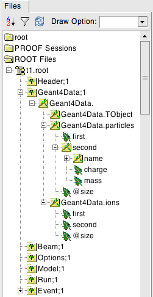

.. _output-section:

======
Output
======

By default, BDSIM writes an output file with a summary of the model created, the particle coordinates
generated, the options used, and basic energy deposition histograms. This can be turned off by
executing BDSIM with::

  bdsim --output=none

The output file name can be specified with::

  bdsim --outfile="mydesiredname"

with no extension.

File Writing Policy
-------------------

* The default file name is "output".
* If no output file name is run and there is already a file called "output", a suffix with an integer will
  be added, i.e. "output-1".
* BDSIM will overwrite an output file if `-\\-outfile` is supplied with the same name again.
* The behaviour is the same in both visualiser mode and batch mode.
  
Output Information
------------------

The following information can be recorded from a BDSIM simulation:

- Particle coordinates at a plane after each element - 'sampler' information.
- Energy deposition 'hits' from any component.
- Trajectories of all or certain particles (optional - see :ref:`bdsim-options-output`).
- A single 3D histogram of any hits in the simulation (optional - see :ref:`scoring-map-description`).

Samplers are 'attached' to a beam line element by using the sample command::

  sample, range=<element_name>;

See :ref:`sampler-output` for more details.

All components are sensitive to energy deposition by default. Any energy deposition
will therefore be recorded in the output as well as stored in pre-made energy deposition
histograms per event.

Trajectories are vectors of trajectory points that record the information about a particle
at each step in the simulation. This records information, such as: all coordinates, particle
type, state and the physics process that determined that step.

Output Files
------------

This section only describes the structure. Loading and analysis instructions can be found
in :ref:`output-analysis-section`.

The output format 'rootevent' is written to a ROOT file. This format
is preferred as it lends itself nicely to particle physics information; is stored as compressed
binary internally; and can store and load complex custom structures.

* Units, unless specified, are SI (i.e. m, rad).
* Energy is in GeV and is the total energy of a particle.
* Time is measured in nanoseconds.
* Small letters denote local (to that object) coordinates, whereas capital letters represent
  global coordinates.

Not all information described may be written by default. Options described in
:ref:`bdsim-options-output` allow control over what is stored. The default options
give a detailed picture with an acceptable file size. The true amount of information
produced in the simulation of every particle and the steps taken is tremendous
and cannot be usably stored.

.. tabularcolumns:: |p{0.2\textwidth}|p{0.2\textwidth}|p{0.5\textwidth}|

+----------------------+----------------------+-----------------------------------------------+
| Format               | Syntax               | Description                                   |
+======================+======================+===============================================+
| None                 | --output=none        | No output is written                          |
+----------------------+----------------------+-----------------------------------------------+
| ROOT Event (Default) | --output=rootevent   | A ROOT file with details of the model built,  |
|                      |                      | options used, seed states, and event-by-event |
|                      |                      | information (default and recommended).        |
+----------------------+----------------------+-----------------------------------------------+

As a general guideline, the following naming conventions are used:

========== ================
Short Name Meaning
========== ================
phits      Primary hits
ploss      Primary losses
eloss      Energy loss
PE         Per element
========== ================

.. note:: A "hit" is the point of first contact, whereas a "loss" is the
	  last point that particle existed - in the case of a primary it
	  is where it stopped being a primary.

.. note:: Energy loss is the energy deposited by particles along their step.

Structure Of Output
-------------------

BDSIM uses a series of classes to accumulate information about a Geant4 Run and Event.
Instances of these classes are 'filled' with information during the simulation and copied
to the output.

In the case of the ROOT event output format, these classes are stored directly in the file
so that the same classes can be used by the output analysis tool (rebdsim) to read
and process the data. A BDSIM ROOT event file has the following structure:

.. figure:: figures/rootevent_contents.png
	    :width: 40%
	    :align: center

	    Contents of a BDSIM ROOT Event format file.
		    
The file consists of four ROOT 'trees' each with 'branches' that represent instances
of the BDSIM classes.  The trees are:

.. tabularcolumns:: |p{0.2\textwidth}|p{0.8\textwidth}|

+-------------+---------------------------------------------------------------------+
| Tree Name   | Description                                                         |
+=============+=====================================================================+
| Header      | Details about the file type and software versions                   |
+-------------+---------------------------------------------------------------------+
| Geant4Data  | Information about all particles and ions used in the simulation     |
+-------------+---------------------------------------------------------------------+
| Beam        | A record of all options associated with the beam definition         |
+-------------+---------------------------------------------------------------------+
| Options     | A record of all options used by BDSIM                               |
+-------------+---------------------------------------------------------------------+
| Model       | A record of the lengths and placement transforms of every element   |
|             | built by BDSIM in the accelerator beam line suitable for recreating |
|             | global coordinates or visualising trajectories                      |
+-------------+---------------------------------------------------------------------+
| Run         | Information collected per Run                                       |
+-------------+---------------------------------------------------------------------+
| Event       | Information collected per Event                                     |
+-------------+---------------------------------------------------------------------+

Header Tree
^^^^^^^^^^^

.. figure:: figures/rootevent_header_tree.png
	    :width: 40%
	    :align: center

The header tree contains a single branch called "Header." (note the "."). This branch
represents a single instance of :code:`BDSOutputROOTEventHeader`. This stores the
various software libraries BDSIM is compiled against, as well as the BDSIM version.
It also stores the time the file was created and the file type, i.e. whether the file
is from BDSIM, rebdsim or rebdsimCombine.

BDSOutputROOTEventHeader
************************

.. tabularcolumns:: |p{0.20\textwidth}|p{0.20\textwidth}|p{0.4\textwidth}|

+------------------------+----------------+---------------------------------------+
| **Variable Name**      | **Type**       | **Description**                       |
+========================+================+=======================================+
| bdsimVersion           | std::string    | Version of BDSIM used                 |
+------------------------+----------------+---------------------------------------+
| geant4Version          | std::string    | Version of Geant4 used                |
+------------------------+----------------+---------------------------------------+
| rootVersion            | std::string    | Version of ROOT used                  |
+------------------------+----------------+---------------------------------------+
| clhepVersion           | std::string    | Version of CLHEP used                 |
+------------------------+----------------+---------------------------------------+
| timeStamp              | std::string    | Time and date file was created        |
+------------------------+----------------+---------------------------------------+
| fileType               | std::string    | String describing what stage of       |
|                        |                | simulation the file came from         |
+------------------------+----------------+---------------------------------------+
| dataVersion            | int            | BDSIM data format version             |
+------------------------+----------------+---------------------------------------+
| doublePrecisionOutput  | bool           | Whether BDSIM was compiled with       |
|                        |                | double precision for output           |
+------------------------+----------------+---------------------------------------+

Geant4Data Tree
^^^^^^^^^^^^^^^

The Geant4Data tree contains a single branch called "Geant4Data." (note the "."). This
branch represents a single instance of :code:`BDSOutputROOTGeant4Data`. This stores
two maps (like dictionaries) of the particle and ion information for each particle / ion
used in the simulation (only, i.e. not all that Geant4 supports). The map goes from
an integer, the Particle Data Group ID, to the particle or ion info that are stored
in simple C++ structures called :code:`BDSOutputROOTGeant4Data::ParticleInfo` and
:code:`BDSOutputROOTGeant4Data::IonInfo` respectively. These contain the name, charge,
mass, and in the case of ions, additionally A and Z. The both have a function called
:code:`rigidity` that can calculate the rigidity of the particle for a given total
energy - this is used during the execution of BDSIM when rigidities are requested to
be stored.

+---------------------+-------------------------------------------------------+-------------------+
| **Variable Name**   | **Type**                                              | **Description**   |
+=====================+=======================================================+===================+
| particles           | std::map<int, BDSOutputROOTGeant4Data::ParticleInfo>  | Map of PDG ID to  |
|                     |                                                       | particle info.    |
+---------------------+-------------------------------------------------------+-------------------+
| ions                | std::map<int, BDSOutputROOTGeant4Data::IonInfo>       | Map of PDG ID to  |
|                     |                                                       | ion info.         |
+---------------------+-------------------------------------------------------+-------------------+

ParticleInfo Struct
*******************

+---------------------+----------------+-----------------------------------+
| **Variable Name**   | **Type**       | **Description**                   |
+=====================+================+===================================+
| name                | std::string    | Name of particle                  |
+---------------------+----------------+-----------------------------------+
| charge              | int            | Particle Data Group ID            |
+---------------------+----------------+-----------------------------------+
| mass                | double         | Particle Data Group mass in GeV   |
+---------------------+----------------+-----------------------------------+

IonInfo Struct
**************

+---------------------+----------------+------------------------------------+
| **Variable Name**   | **Type**       | **Description**                    |
+=====================+================+====================================+
| name                | std::string    | Name of particle                   |
+---------------------+----------------+------------------------------------+
| charge              | int            | Particle Data Group ID             |
+---------------------+----------------+------------------------------------+
| mass                | double         | Particle Data Group mass in GeV    |
+---------------------+----------------+------------------------------------+
| a                   | int            | Mass number - number of neutrons   |
|                     |                | and protons together               |
+---------------------+----------------+------------------------------------+
| z                   | int            | Atomic number - number of protons  |
+---------------------+----------------+------------------------------------+

.. _output-beam-tree:

Beam Tree
^^^^^^^^^

.. figure:: figures/rootevent_beam_tree.png
	    :width: 47%
	    :align: center

The beam tree contains a single branch called "Beam." (note the "."). This branch
represents an instance of :code:`parser/BeamBase.hh`. The tree typically contains one
entry, as only one definition of the beam was used per execution of BDSIM.

Options Tree
^^^^^^^^^^^^

.. figure:: figures/rootevent_options_tree.png
	    :width: 50%
	    :align: center

The options tree contains a single branch called "Options." (note the "."). This branch
represents an instance of :code:`parser/OptionsBase.hh`. The tree typically contains one
entry, as only one set of options were used per execution of BDSIM.

Model Tree
^^^^^^^^^^

.. figure:: figures/rootevent_model_tree.png
	    :width: 40%
	    :align: center

This tree contains a single branch called "Model.".  This branch represents an instance
of :code:`include/BDSOutputROOTEventModel.hh`. There is also typically one entry, as there
is one model. Note that some variables here appear as 'leaf' icons and some as 'branch' icons.
This is because some of the variables are vectors.

BDSOutputROOTEventModel
***********************

.. tabularcolumns:: |p{0.20\textwidth}|p{0.30\textwidth}|p{0.4\textwidth}|

+--------------------+--------------------------+--------------------------------------------------------------+
| **Variable Name**  | **Type**                 | **Description**                                              |
+====================+==========================+==============================================================+
| samplerNamesUnique | std::vector<std::string> | The unique names of each of the samplers.  These             |
|                    |                          | are identical to the names of the sampler branches           |
|                    |                          | found in the Event tree.                                     |
+--------------------+--------------------------+--------------------------------------------------------------+
| componentName      | std::vector<std::string> | The beamline component names                                 |
+--------------------+--------------------------+--------------------------------------------------------------+
| placementName      | std::vector<std::string> | Unique name for each placement                               |
+--------------------+--------------------------+--------------------------------------------------------------+
| componentType      | std::vector<std::string> | Beamline component type; "drift", "sbend", etc.              |
+--------------------+--------------------------+--------------------------------------------------------------+
| length             | std::vector<float>       | Component length (metres)                                    |
+--------------------+--------------------------+--------------------------------------------------------------+
| staPos             | std::vector<TVector3>    | Global coordinates of start of beamline element (metres)     |
+--------------------+--------------------------+--------------------------------------------------------------+
| midPos             | std::vector<TVector3>    | Global coordinates of middle of beamline element (metres)    |
+--------------------+--------------------------+--------------------------------------------------------------+
| endPos             | std::vector<TVector3>    | Global coordinates of end of beamline element (metres)       |
+--------------------+--------------------------+--------------------------------------------------------------+
| staRot             | std::vector<TRotation>   | Global rotation for the start of this beamline element       |
+--------------------+--------------------------+--------------------------------------------------------------+
| midRot             | std::vector<TRotation>   | Global rotation for the middle of this beamline element      |
+--------------------+--------------------------+--------------------------------------------------------------+
| endRot             | std::vector<TRotation>   | Global rotation for the end of this beamline element         |
+--------------------+--------------------------+--------------------------------------------------------------+
| staRefPos          | std::vector<TVector3>    | Global coordinates for the start of the beamline elements    |
|                    |                          | along the reference trajectory and without any tilt          |
|                    |                          | or rotation from the component                               |
+--------------------+--------------------------+--------------------------------------------------------------+
| midRefPos          | std::vector<TVector3>    | Global coordinates for the middle of the beamline elements   |
|                    |                          | along the reference trajectory and without any tilt          |
|                    |                          | or rotation from the component                               |
+--------------------+--------------------------+--------------------------------------------------------------+
| endRefPos          | std::vector<TVector3>    | Global coordinates for the start of the beamline elements    |
|                    |                          | along the reference trajectory and without any tilt          |
|                    |                          | or rotation from the component                               |
+--------------------+--------------------------+--------------------------------------------------------------+
| staRefRot          | std::vector<TRotation>   | Global rotation matrix for start of the beamline elements    |
|                    |                          | along the reference trajectory and without any tilt          |
|                    |                          | or rotation from the component                               |
+--------------------+--------------------------+--------------------------------------------------------------+
| midRefRot          | std::vector<TRotation>   | Global rotation matrix for middle of the beamline elements   |
|                    |                          | along the reference trajectory and without any tilt          |
|                    |                          | or rotation from the component                               |
+--------------------+--------------------------+--------------------------------------------------------------+
| endRefRot          | std::vector<TRotation>   | Global rotation matrix for middle of the beamline elements   |
|                    |                          | along the reference trajectory and without any tilt          |
|                    |                          | or rotation from the component                               |
+--------------------+--------------------------+--------------------------------------------------------------+
| staS               | std::vector<float>       | S-position of start of start of element (metres)             |
+--------------------+--------------------------+--------------------------------------------------------------+
| midS               | std::vector<float>       | S-position of start of middle of element (metres)            |
+--------------------+--------------------------+--------------------------------------------------------------+
| endS               | std::vector<float>       | S-position of start of end of element (metres)               |
+--------------------+--------------------------+--------------------------------------------------------------+
| beamPipeType       | std::vector<std::string> | Aperture type; "circular", "lhc", etc.                       |
+--------------------+--------------------------+--------------------------------------------------------------+
| beamPipeAper1      | std::vector<double>      | Aperture aper1 (metres)                                      |
+--------------------+--------------------------+--------------------------------------------------------------+
| beamPipeAper2      | std::vector<double>      | Aperture aper2 (metres)                                      |
+--------------------+--------------------------+--------------------------------------------------------------+
| beamPipeAper3      | std::vector<double>      | Aperture aper3 (metres)                                      |
+--------------------+--------------------------+--------------------------------------------------------------+
| beamPipeAper4      | std::vector<double>      | Aperture aper4 (metres)                                      |
+--------------------+--------------------------+--------------------------------------------------------------+
| material           | std::vector<std::string> | Main material associated with an element. For a drift, this  |
|                    |                          | is the beam pipe material; for a magnet, the yoke            |
|                    |                          | material; a collimator, the main material.                   |
+--------------------+--------------------------+--------------------------------------------------------------+
| k1 - k12           | std::vector<float>       | Normalised magnet strength associated with element           |
|                    |                          | (1st - 12th order)                                           |
+--------------------+--------------------------+--------------------------------------------------------------+
| k12 - k122         | std::vector<float>       | Normalised skew magnet strength associated with element      |
|                    |                          | (1st - 12th order)                                           |
+--------------------+--------------------------+--------------------------------------------------------------+
| ks                 | std::vector<float>       | Normalised solenoid strength                                 |
+--------------------+--------------------------+--------------------------------------------------------------+
| hkick              | std::vector<float>       | Fractional momentum kick in horizontal direction             |
+--------------------+--------------------------+--------------------------------------------------------------+
| vkick              | std::vector<float>       | Fractional momentum kick in vertical direction               |
+--------------------+--------------------------+--------------------------------------------------------------+
| bField             | std::vector<float>       | Magnetic field magnitude (T)                                 |
+--------------------+--------------------------+--------------------------------------------------------------+
| eField             | std::vector<float>       | Electric field magnitude (MV)                                |
+--------------------+--------------------------+--------------------------------------------------------------+
| e1                 | std::vector<float>       | Input pole face angle (note sbend / rbend convention) (rad)  |
+--------------------+--------------------------+--------------------------------------------------------------+
| e2                 | std::vector<float>       | Output pole face angle (rad)                                 |
+--------------------+--------------------------+--------------------------------------------------------------+
| hgap               | std::vector<float>       | Half-gap of pole tips for dipoles (m)                        |
+--------------------+--------------------------+--------------------------------------------------------------+
| fint               | std::vector<float>       | Fringe-field integral                                        |
+--------------------+--------------------------+--------------------------------------------------------------+
| fintx              | std::vector<float>       | Fringe-field integral for exit pole face                     |
+--------------------+--------------------------+--------------------------------------------------------------+
| fintk2             | std::vector<float>       | 2nd fringe-field integral                                    |
+--------------------+--------------------------+--------------------------------------------------------------+
| fintxk2            | std::vector<float>       | 2nd fringe-field integral for exit pole face                 |
+--------------------+--------------------------+--------------------------------------------------------------+

Run Tree
^^^^^^^^

.. figure:: figures/rootevent_run_tree.png
	    :width: 40%
	    :align: center

This tree contains two branches called "Histos." and "Info." which represent instances of
:code:`include/BDSOutputROOTEventHistograms.hh` and :code:`include/BSOutputROOTEventInfo`,
respectively. Histos contains two vectors of 1D and 2D histograms that are produced per run.

.. _output-event-tree:

Event Tree
^^^^^^^^^^

.. figure:: figures/rootevent_event_tree.png
	    :width: 35%
	    :align: center

This tree contains information on a per-event basis.  Everything shown in the above tree has a
different value per-event run in BDSIM.

.. tabularcolumns:: |p{0.15\textwidth}|p{0.35\textwidth}|p{0.4\textwidth}|

+-----------------+----------------------------------+--------------------------------------------------+
| Branch Name     | Type                             | Description                                      |
+=================+==================================+==================================================+
| Info            | BDSOutputROOTEventInfo           | Per-event information                            |
+-----------------+----------------------------------+--------------------------------------------------+
| Primary         | BDSOutputROOTEventSampler<float> | A record of the coordinates at the start of the  |
|                 |                                  | simulation (before tracking)                     |
+-----------------+----------------------------------+--------------------------------------------------+
| PrimaryGlobal   | BDSOutputROOTEventCoords         | Global Cartesian coordinates of the primary      |
|                 |                                  | particle. These are the same as those in         |
|                 |                                  | "Primary" unless `S0` is specified in the beam   |
|                 |                                  | distribution.                                    |
+-----------------+----------------------------------+--------------------------------------------------+
| Eloss           | BDSOutputROOTEventLoss           | Coordinates of energy deposition in the          |
|                 |                                  | accelerator material                             |
+-----------------+----------------------------------+--------------------------------------------------+
| PrimaryFirstHit | BDSOutputROOTEventLoss           | Energy deposit 'hit' representing the first      |
|                 |                                  | step on the primary trajectory that wasn't due   |
|                 |                                  | to tracking, i.e. the first interaction where a  |
|                 |                                  | physics process was induced                      |
+-----------------+----------------------------------+--------------------------------------------------+
| PrimaryLastHit  | BDSOutputROOTEventLoss           | The end point of the primary trajectory. If S    |
|                 |                                  | is -1 (m) it means the particle finished away    |
|                 |                                  | from the beam line where there was no            |
|                 |                                  | curvilinear coordinate system present.           |
+-----------------+----------------------------------+--------------------------------------------------+
| TunnelHit       | BDSOutputROOTEventLoss           | Coordinates of energy deposition in the tunnel   |
|                 |                                  | material                                         |
+-----------------+----------------------------------+--------------------------------------------------+
| Trajectory      | BDSOutputROOTEventTrajectory     | A record of all the steps the primary particle   |
|                 |                                  | took and the associated physics processes        |
+-----------------+----------------------------------+--------------------------------------------------+
| Histos          | BDSOutputROOTEventHistograms     | Per-event histograms in vectors                  |
+-----------------+----------------------------------+--------------------------------------------------+
| xxxxx           | BDSOutputROOTEventSampler<float> | A dynamically generated branch created per       |
|                 |                                  | sampler (here named 'xxxxx') that contains a     |
|                 |                                  | record of all particles that passed through the  |
|                 |                                  | sampler during the event. Note: this includes    |
|                 |                                  | both primary and secondary particles.            |
+-----------------+----------------------------------+--------------------------------------------------+

The types and names of the contents of each class can be found in the header files in
:code:`bdsim/include/BDSOutputROOTEvent*.hh`. The contents of the classes are described below.

.. warning:: For large `S0` in a large model, a large distance as compared to the size of the beam
	     may displace the primary coordinates, e.g. 1km offset for 1um beam. For this reason
	     the PrimaryGlobal structure always uses double precision numbers, unlike the Primary structure
	     and the other samplers that use floating point precision numbers (unless the ROOTDOUBLE
	     cmake option is used for double precision in the samplers).

BDSOutputROOTEventInfo
**********************

.. tabularcolumns:: |p{0.20\textwidth}|p{0.30\textwidth}|p{0.4\textwidth}|

+-------------------+-------------------+---------------------------------------------+
|  **Variable**     | **Type**          |  **Description**                            |
+===================+===================+=============================================+
| startTime         | time_t            | Time stamp at start of event                |
+-------------------+-------------------+---------------------------------------------+
| stopTime          | time_t            | Time stamp at end of event                  |
+-------------------+-------------------+---------------------------------------------+
| duration          | float             | Duration of event in seconds                |
+-------------------+-------------------+---------------------------------------------+
| seedStateAtStart  | std::string       | State of random number generator at the     |
|                   |                   | start of the event as provided by CLHEP     |
+-------------------+-------------------+---------------------------------------------+
| index             | int               | Index of the event (0 counting)             |
+-------------------+-------------------+---------------------------------------------+
| aborted           | bool              | Whether event was aborted or not            |
+-------------------+-------------------+---------------------------------------------+
| primaryHitMachine | bool              | Whether the primary particle hit the        |
|                   |                   | machine. This is judged by whether there    |
|                   |                   | are any energy deposition hits or not. If   |
|                   |                   | no physics processes are registered this    |
|                   |                   | won't work correctly.                       |
+-------------------+-------------------+---------------------------------------------+

BDSOutputROOTEventLoss
**********************

Energy deposition hits are the most numerous, so not all information is recorded by default.
Extra information can be recorded but this typically dominates the output file size.

.. tabularcolumns:: |p{0.20\textwidth}|p{0.30\textwidth}|p{0.4\textwidth}|

+----------------------+-----------------------+-------------------------------------------------------------------+
|  **Variable**        | **Type**              |  **Description**                                                  |
+======================+=======================+===================================================================+
| n                    | int                   | The number of energy deposition hits for this event               |
+----------------------+-----------------------+-------------------------------------------------------------------+
| energy               | std::vector<float>    | Vector of energy of each piece of energy deposition               |
+----------------------+-----------------------+-------------------------------------------------------------------+
| S                    | std::vector<float>    | Corresponding curvilinear S-position (m) of energy deposition     |
+----------------------+-----------------------+-------------------------------------------------------------------+
| weight               | std::vector<float>    | Corresponding weight                                              |
+----------------------+-----------------------+-------------------------------------------------------------------+
| partID               | std::vector<int>      | (optional) Particle ID of particle that caused energy deposition  |
+----------------------+-----------------------+-------------------------------------------------------------------+
| trackID              | std::vector<int>      | (optional) Track ID of particle that caused energy deposition     |
+----------------------+-----------------------+-------------------------------------------------------------------+
| parentID             | std::vector<int>      | (optional) Track ID of the parent particle                        |
+----------------------+-----------------------+-------------------------------------------------------------------+
| modelID              | std::vector<int>      | (optional) Index in model tree for where deposition occurred      |
+----------------------+-----------------------+-------------------------------------------------------------------+
| turn                 | std::vector<int>      | (optional) Turn in circular machine on which hit occurred         |
+----------------------+-----------------------+-------------------------------------------------------------------+
| x                    | std::vector<float>    | (optional) Local X of energy deposition (m)                       |
+----------------------+-----------------------+-------------------------------------------------------------------+
| y                    | std::vector<float>    | (optional) Local Y of energy deposition (m)                       |
+----------------------+-----------------------+-------------------------------------------------------------------+
| z                    | std::vector<float>    | (optional) Local Z of energy deposition (m)                       |
+----------------------+-----------------------+-------------------------------------------------------------------+
| X                    | std::vector<float>    | (optional) Global X of energy deposition (m)                      |
+----------------------+-----------------------+-------------------------------------------------------------------+
| Y                    | std::vector<float>    | (optional) Global Y of energy deposition (m)                      |
+----------------------+-----------------------+-------------------------------------------------------------------+
| Z                    | std::vector<float>    | (optional) Global Z of energy deposition (m)                      |
+----------------------+-----------------------+-------------------------------------------------------------------+
| T                    | std::vector<float>    | (optional) Global time-of-flight since beginning of event (ns)    |
+----------------------+-----------------------+-------------------------------------------------------------------+
| stepLength           | std::vector<float>    | (optional) Length of step that the energy deposition was          |
|                      |                       | produced in (m)                                                   |
+----------------------+-----------------------+-------------------------------------------------------------------+
| preStepKineticEnergy | std::vector<float>    | (optional) The kinetic energy of the particle (any species)       |
|                      |                       | at the starting point of the step that the energy deposition      |
|                      |                       | was produced in                                                   |
+----------------------+-----------------------+-------------------------------------------------------------------+
| storeLinks           | bool                  | Whether extra information was stored (`partID`, `trackID`,        |
|                      |                       | `parendID`, `modelID`, `turn`)                                    |
+----------------------+-----------------------+-------------------------------------------------------------------+
| storeLocal           | bool                  | Whether `x`, `y`, `z` were stored                                 |
+----------------------+-----------------------+-------------------------------------------------------------------+
| storeGlobal          | bool                  | Whether `X`, `Y`, `Z` were stored                                 |
+----------------------+-----------------------+-------------------------------------------------------------------+
| storeTime            | bool                  | Whether `T` was stored                                            |
+----------------------+-----------------------+-------------------------------------------------------------------+
| storeStepLength      | bool                  | Whether `stepLength` was stored                                   |
+----------------------+-----------------------+-------------------------------------------------------------------+
| storePreStepKinetic  | bool                  | Whether `preStepKineticEnergy` was stored                         |
+----------------------+-----------------------+-------------------------------------------------------------------+

BDSOutputROOTEventTrajectory
****************************

By default, only the primary particle trajectory is stored - see :ref:`bdsim-options-output` for
which options to set to control the level of detail stored in the trajectories.

Currently, some degenerate information is stored for completeness.  This may be removed in future
versions (e.g. the pre-step point of the  part of the trajectory  is the same as the post-step point
of the previous part of the trajectory).

Each entry in the vectors in BDSOutputROOTEventTrajectory represents one step along the
particle trajectory with a 'pre-step' and 'post-step' point - information associated with
the start and end of that step.

.. tabularcolumns:: |p{0.20\textwidth}|p{0.30\textwidth}|p{0.4\textwidth}|

+--------------------------+-------------------------------------+---------------------------------------------------------+
|  **Variable**            | **Type**                            |  **Description**                                        |
+==========================+=====================================+=========================================================+
| n                        | int                                 | The number of trajectories stored for this event        |
+--------------------------+-------------------------------------+---------------------------------------------------------+
| partID                   | std::vector<int>                    | The PDG ID for the particle in each trajectory step     |
+--------------------------+-------------------------------------+---------------------------------------------------------+
| trackID                  | std::vector<unsigned int>           | The track ID for the particle in each trajectory step   |
+--------------------------+-------------------------------------+---------------------------------------------------------+
| parentID                 | std::vector<float>                  | The track ID of the parent particle for each trajectory |
|                          |                                     | step                                                    |
+--------------------------+-------------------------------------+---------------------------------------------------------+
| parentIndex              | std::vector<int>                    | The index in the vectors of this class that correspond  |
|                          |                                     | to parent particle (the one that lead to the creation   |
|                          |                                     | of the particle in the current entry)                   |
+--------------------------+-------------------------------------+---------------------------------------------------------+
| parentStepIndex          | std::vector<int>                    | TBC                                                     |
+--------------------------+-------------------------------------+---------------------------------------------------------+
| preProcessTypes          | std::vector<std::vector<int>>       | Geant4 enum of pre-step physics process - general       |
|                          |                                     | category                                                |
+--------------------------+-------------------------------------+---------------------------------------------------------+
| preProcessSubTypes       | std::vector<std::vector<int>>       | Geant4 enum of pre-step physics process - specific      |
|                          |                                     | process ID within category                              |
+--------------------------+-------------------------------------+---------------------------------------------------------+
| postProcessTypes         | std::vector<std::vector<int>>       | Geant4 enum of post-step physics process - general      |
|                          |                                     | category                                                |
+--------------------------+-------------------------------------+---------------------------------------------------------+
| postProcesssSubTypes     | std::vector<std::vector<int>>       | Geant4 enum of post-step physics process - specific     |
|                          |                                     | process ID within category                              |
+--------------------------+-------------------------------------+---------------------------------------------------------+
| preWeights               | std::vector<std::vector<double>>    | Weighting associated with pre-step point                |
+--------------------------+-------------------------------------+---------------------------------------------------------+
| postWeights              | std::vector<std::vector<double>>    | Weighting associated with post-step point               |
+--------------------------+-------------------------------------+---------------------------------------------------------+
| energies                 | std::vector<std::vector<double>>    | Total energy of particle in current trajectory step     |
+--------------------------+-------------------------------------+---------------------------------------------------------+
| trajectories             | std::vector<std::vector<TVector3>>  | The 'position' of the trajectory according to Geant4 -  |
|                          |                                     | from G4Track->GetPosition()                             |
+--------------------------+-------------------------------------+---------------------------------------------------------+
| momenta                  | std::vector<std::vector<TVector3>>  | Momentum of the track (GeV)                             |
+--------------------------+-------------------------------------+---------------------------------------------------------+
| modelIndicies            | std::vector<std::vector<int>>       | Index in beam line of which element the trajectory is in|
|                          |                                     | (-1 if not inside an accelerator component)             |
+--------------------------+-------------------------------------+---------------------------------------------------------+

In addition, some maps are stored to link the entries together conceptually.

.. tabularcolumns:: |p{0.20\textwidth}|p{0.30\textwidth}|p{0.4\textwidth}|

+--------------------------+-------------------------------------+---------------------------------------------------------+
|  **Variable**            | **Type**                            |  **Description**                                        |
+==========================+=====================================+=========================================================+
| trackID_trackIndex       | std::map<int, int>                  | A map of all trackIDs to the index in this class        |
+--------------------------+-------------------------------------+---------------------------------------------------------+
| trackIndex_trackProcess  | std::map<int, std::pair<int,int>>   | A map from the index in this class to track process     |
+--------------------------+-------------------------------------+---------------------------------------------------------+
| trackIndex_modelIndex    | std::map<int, int>                  | A map from the index in this class to the model index   |
+--------------------------+-------------------------------------+---------------------------------------------------------+
| modelIndex_trackIndex    | std::map<int, std::vector<int>>     | A map from the model index to the index in this class   |
+--------------------------+-------------------------------------+---------------------------------------------------------+

Functions are provided that allow exploration of the data through the connections stored.

.. tabularcolumns:: |p{0.20\textwidth}|p{0.40\textwidth}|p{0.4\textwidth}|

+-----------------------------------+-------------------------------------------------+---------------------------------------------------------+
| **Function**                      | **Return Type**                                 | **Description**                                         |
+===================================+=================================================+=========================================================+
| findParentProcess(int trackIndex) | std::pair<int,int>                              | Find the parent track index and process indexfrom       |
|                                   |                                                 | the ultimate parent of this particle up the             |
|                                   |                                                 | trajectory table.                                       |
+-----------------------------------+-------------------------------------------------+---------------------------------------------------------+
| trackInteractions(int trackID)    | std::vector<BDSOutputROOTEventTrajectoryPoint>  | Return vector of points where this particle interacted  |
|                                   |                                                 | all the way to the primary. Transportation steps are    |
|                                   |                                                 | suppressed.                                             |
+-----------------------------------+-------------------------------------------------+---------------------------------------------------------+
| primaryProcessPoint(int trackID)  | BDSOutputROOTEventTrajectoryPoint               | For a given track ID, return the point where the        |
|                                   |                                                 | primary particle first interacted.                      |
+-----------------------------------+-------------------------------------------------+---------------------------------------------------------+
| processHistory(int trackID)       | std::vector<BDSOutputROOTEventTrajectoryPoint>  | A full history up the trajectory table to the primary   |
|                                   |                                                 | for a given track ID.                                   |
+-----------------------------------+-------------------------------------------------+---------------------------------------------------------+

BDSOutputROOTEventSampler
*************************

Note: the sampler structure, like everything else in the event tree, is stored
per event.  However, for a given event, there may be multiple hits on a sampler, i.e.
many secondary particles may have passed through a sampler. For this purpose, most
variables are vectors of numbers, where the vector represents all the hits in that event.

As the sampler is considered infinitely thin and always in the same place, there is no
point in storing the z-location or the S-location for every particle hit. Therefore,
these variables are only stored once as a single number per event.

The class is templated to allow use of both double and float precision numbers. By default,
T = float, i.e. float precision number is stored. BDSIM can be compiled with an option for
double precision output (useful typically only for development or precision testing) but this
doubles the output file size.

.. tabularcolumns:: |p{0.20\textwidth}|p{0.30\textwidth}|p{0.4\textwidth}|

+-----------------+-------------------+--------------------------------------------------------------------------+
|  **Variable**   | **Type**          |  **Description**                                                         |
+=================+===================+==========================================================================+
| n               | int               | The number in this event in this sampler                                 |
+-----------------+-------------------+--------------------------------------------------------------------------+
| energy          | std::vector<T>    | Vector of the total energy (GeV) of each hit in this sampler             |
+-----------------+-------------------+--------------------------------------------------------------------------+
| x               | std::vector<T>    | Vector of the x-coordinate of each hit (m)                               |
+-----------------+-------------------+--------------------------------------------------------------------------+
| y               | std::vector<T>    | Vector of the y-coordinate of each hit (m)                               |
+-----------------+-------------------+--------------------------------------------------------------------------+
| z               | T                 | Single entry of z for this sampler (m)                                   |
+-----------------+-------------------+--------------------------------------------------------------------------+
| xp              | std::vector<T>    | Vector of the fractional x transverse momentum                           |
+-----------------+-------------------+--------------------------------------------------------------------------+
| yp              | std::vector<T>    | Vector of the fractional y transverse momentum                           |
+-----------------+-------------------+--------------------------------------------------------------------------+
| zp              | std::vector<T>    | Vector of the fractional forward momentum                                |
+-----------------+-------------------+--------------------------------------------------------------------------+
| T               | std::vector<T>    | Vector of the time-of-flight of the particle (ns)                        |
+-----------------+-------------------+--------------------------------------------------------------------------+
| weight          | std::vector<T>    | Vector of the associated weights of the hits                             |
+-----------------+-------------------+--------------------------------------------------------------------------+
| partID          | std::vector<int>  | Vector of the PDG ID for the particle of each hit                        |
+-----------------+-------------------+--------------------------------------------------------------------------+
| parentID        | std::vector<int>  | Vector of the trackID of the progenitor of the particle that hit         |
+-----------------+-------------------+--------------------------------------------------------------------------+
| trackID         | std::vector<int>  | Vector of the trackID of the particle that hit                           |
+-----------------+-------------------+--------------------------------------------------------------------------+
| modelID         | int               | The index to the BDSIM model of which element the sampler belonged to    |
+-----------------+-------------------+--------------------------------------------------------------------------+
| turnNumber      | std::vector<int>  | Vector of the turn number of the particle that hit                       |
+-----------------+-------------------+--------------------------------------------------------------------------+
| S               | T                 | S-position of the sampler (m)                                            |
+-----------------+-------------------+--------------------------------------------------------------------------+
| charge (*)      | std::vector<int>  | Vector of the PDG charge of the particle for each hit                    |
+-----------------+-------------------+--------------------------------------------------------------------------+
| mass (*)        | std::vector<T>    | Vector of the PDG mass of the particle for each hit (GeV)                |
+-----------------+-------------------+--------------------------------------------------------------------------+
| rigidity (*)    | std::vector<T>    | Vector of the rigidity of the particle for each hit (Tm)                 |
+-----------------+-------------------+--------------------------------------------------------------------------+
| isIon (*)       | std::vector<bool> | Vector of whether the particle is an ion or not                          |
+-----------------+-------------------+--------------------------------------------------------------------------+
| ionA (*)        | std::vector<int>  | Vector of the atomic mass number. 0 for non-nuclei.                      |
+-----------------+-------------------+--------------------------------------------------------------------------+
| ionZ (*)        | std::vector<int>  | Vector of the atomic number. 0 for non-nuclei.                           |
+-----------------+-------------------+--------------------------------------------------------------------------+

.. note:: (*) These are not stored by default (i.e. the vectors exist but are empty). If these
	  parameters are desired, please use the appropriate options to turn their storage on.
	  See :ref:`bdsim-options-output` for more details.

.. warning:: A common issue is that apparently half of the particles missing in the first sampler in
	     the beam line. If a sampler is placed at the beginning of the beam line and a bunch
	     distribution with a finite z-width is used, approximately half of the particles will
	     start in front of the sampler, never pass through it and never be registered. For this
	     reason, one should refrain from putting a sampler at the beginning of a beam line to avoid
	     confusion. The primary output records all primary coordinates before they enter the tracking
	     in the geometry, so it always contains all primary particles.

BDSOutputROOTEventCorods
************************

.. tabularcolumns:: |p{0.20\textwidth}|p{0.30\textwidth}|p{0.4\textwidth}|

+-----------------+-------------+-------------------------------------------------------+
|  **Variable**   | **Type**    |  **Description**                                      |
+=================+=============+=======================================================+
| x               | double      | Global Cartesian x coordinate (m)                     |
+-----------------+-------------+-------------------------------------------------------+
| y               | double      | Global Cartesian y coordinate (m)                     |
+-----------------+-------------+-------------------------------------------------------+
| z               | double      | Global Cartesian z coordinate (m)                     |
+-----------------+-------------+-------------------------------------------------------+
| xp              | double      | Global Cartesian unit momentum in x                   |
+-----------------+-------------+-------------------------------------------------------+
| yp              | double      | Global Cartesian unit momentum in y                   |
+-----------------+-------------+-------------------------------------------------------+
| zp              | double      | Global Cartesian unit momentum in z                   |
+-----------------+-------------+-------------------------------------------------------+
| T               | double      | Time (ns)                                             |
+-----------------+-------------+-------------------------------------------------------+
	     
	     
BDSOutputROOTEventHistograms
****************************

This class contains the following data:

.. tabularcolumns:: |p{0.20\textwidth}|p{0.30\textwidth}|p{0.4\textwidth}|

+-----------------+---------------------+-------------------------------------------------------+
|  **Variable**   | **Type**            |  **Description**                                      |
+=================+=====================+=======================================================+
| histograms1D    | std::vector<TH1D*>  | Vector of 1D histograms stored in the simulation      |
+-----------------+---------------------+-------------------------------------------------------+
| histograms2D    | std::vector<TH2D*>  | Vector of 2D histograms stored in the simulation      |
+-----------------+---------------------+-------------------------------------------------------+
| histograms3D    | std::vector<TH3D*>  | Vector of 3D histograms stored in the simulation      |
+-----------------+---------------------+-------------------------------------------------------+

These are histograms stored for each event. BDSIM produces six histograms by default during the
simulation. These are:

+-------------+-----------------------------------------+-----------------------+
| **Number**  | **Description**                         | **Location**          |
+=============+=========================================+=======================+
| 1           | Primary hits                            | `histograms1D[0]`     |
+-------------+-----------------------------------------+-----------------------+
| 2           | Primary loss                            | `histograms1D[1]`     |
+-------------+-----------------------------------------+-----------------------+
| 3           | Energy loss (GeV)                       | `histograms1D[2]`     |
+-------------+-----------------------------------------+-----------------------+
| 4           | Primary hits per element binning        | `histograms1D[3]`     |
+-------------+-----------------------------------------+-----------------------+
| 5           | Primary loss per element binning        | `histograms1D[4]`     |
+-------------+-----------------------------------------+-----------------------+
| 6           | Energy loss (GeV) per element binning   | `histograms1D[5]`     |
+-------------+-----------------------------------------+-----------------------+

If the tunnel is constructed in the simulation, two more histograms for energy loss
and energy loss per tunnel element are also constructed.

+-------------+-----------------------------------------+-----------------------+
| 7           | Energy loss (GeV) in tunnel             | `histograms1D[6]`     |
+-------------+-----------------------------------------+-----------------------+
| 8           | Energy loss (GeV) in tunnel per element | `histograms1D[5]`     |
|             | binning                                 |                       |
+-------------+-----------------------------------------+-----------------------+

.. note:: The per-element histograms are integrated across the length of each element so they
	  will have a different bin width.

The energy loss histograms are evenly binned according to the option :code:`elossHistoBinWidth` (in metres).

.. _basic-data-inspection:

Basic Data Inspection
---------------------

To view the data as shown here, we recommend using a ROOT tree browser - `TBrowser`. Start
ROOT (optionally with the file path specified to put it at the top of the list).

.. figure:: figures/starting_root.png
	    :width: 100%
	    :align: center

* The -l option stops the logo splash screen coming up and is slightly quicker.

While in the ROOT interpreter, enter the following command to 'construct' a TBrowser object.

.. figure:: figures/starting_tree_browser.png
	    :width: 100%
	    :align: center

Double-click the file and then the 'Trees' (small folders with green leaf on them)
to explore the hierarchy of the file. Eventually, individual variables can be double-clicked on
to give a preview histogram on-the-fly that is a histogram of all entries in the Tree (i.e.
all events in the Event Tree). If the variable is a vector, each item in the vector is
entered ('filled') into the histogram.

.. figure:: figures/root-tbrowser.png
	    :width: 100%
	    :align: center

.. note:: If a file is open in ROOT in a TBrowser but has been overwritten externally, it will
	  not show the correct contents - close the TBrowser and ROOT and reopen it.
