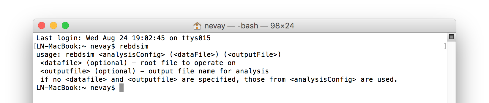

.. _output-analysis-section:

===============
Output Analysis
===============

This section describes how to load, view and analyse data from the recommended output **rootevent**
format.

Broadly, there are 2 data formats with BDSIM and its analysis tools. These will be the
same format, i.e. ROOT files, but will have a different layout. These are:

#) BDSIM raw data - the output of a BDSIM run
#) REBDSIM data - the output of various analysis tools containing histograms and optics.

A variety of tools are provided that accommodate several different workflows depending on
data size versus computation time for analysis. The following tools are provided:

  .. tabularcolumns:: |p{2cm}|p{3cm}|p{3cm}|p{4cm}|

+--------------------+------------------------+--------------------------+--------------------------------------+
| **Tool**           | **Used on Data Type**  | **Produces as Output**   | **Purpose**                          |
+====================+========================+==========================+======================================+
| bdskim             | BDSIM raw              | BDSIM raw                | Filter a raw file to select events   |
+--------------------+------------------------+--------------------------+--------------------------------------+
| bdsimCombine       | BDSIM raw              | BDSIM raw                | Combine events from multiple files   |
+--------------------+------------------------+--------------------------+--------------------------------------+
| rebdsim            | BDSIM raw              | REBDSIM                  | Make histograms of raw data          |
+--------------------+------------------------+--------------------------+--------------------------------------+
| rebdsimCombine     | REBDSIM                | REBDSIM                  | Combine REBDSIM output files         |
|                    |                        |                          | as if they were done in one run of   |
|                    |                        |                          | rebdsim                              |
+--------------------+------------------------+--------------------------+--------------------------------------+
| rebdsimHistoMerge  | BDSIM raw              | REBDSIM                  | Merge per-made per event histograms  |
|                    |                        |                          | in BDSIM raw output (e.g. ELoss)     |
+--------------------+------------------------+--------------------------+--------------------------------------+
| rebdsimOptics      | BDSIM raw              | REBDSIM                  | Calculate optical functions from raw |
|                    |                        |                          | sampler data                         |
+--------------------+------------------------+--------------------------+--------------------------------------+
| rebdsimOrbit       | BDSIM raw              | REBDSIM                  | Extract the i-th hit from every      |
|                    |                        |                          | sampler                              |
+--------------------+------------------------+--------------------------+--------------------------------------+

These are discussed each in:

* :ref:`bdskim-tool`
* :ref:`bdsim-combine-tool`
* :ref:`rebdsim-analysis-tool`
* :ref:`rebdsim-combine-tool`
* :ref:`rebdsim-histo-merge-tool`
* :ref:`rebdsim-optics-tool`
* :ref:`rebdsim-orbit-tool`

See :ref:`basic-data-inspection` for how to view the data and make the most basic
on-the-fly histograms.

Strategies on the workflow and use of the tools is discussed in :ref:`output-analysis-efficiency`.

.. _output-analysis-setup:

Setup
=====

1) BDSIM must be installed after compilation for the analysis tools to function properly.
2) Environmental variables should be set by sourcing :code:`<bdsim-install-dir>/bin/bdsim.sh`.
3) A ROOT logon macro may optionally be written for convenience in loading libraries.

If the setup is correct, you should be able to execute 'rebdsim' in the terminal. See
:ref:`installation-building` and :ref:`installation-environmental-variables` for more
details.

If the analysis will be regularly used interactively, it is worth automating the library
loading in root by finding and editing the :code:`rootlogon.C` in your
:code:`<root-install-dir>/macros/` directory.  Example text would be::

  {
    cout << "Loading rebdsim libraries" << endl;
    gSystem->Load("librebdsim");
    gSystem->Load("libbdsimRootEvent");
  }

.. note:: The file extension is omitted on purpose.

The absolute path is not necessary, as the above environmental variables are used by ROOT
to find the library.

.. _output-analysis-quick-recipes:

Quick Recipes
=============

Inspect Histograms
------------------

1. Run rebdsimHistoMerge on BDSIM output file (quick).
2. Browse output of rebdsimHistoMerge in TBrowser in ROOT.

See :ref:`rebdsim-histo-merge-tool` for details.

::

   rebdsimHistoMerge output.root results.root
   root -l results.root
   > TBrowser tb;

Plot Energy Deposition \& Losses
--------------------------------

1. Run rebdsimHistoMerge on BDSIM output file (quick).
2. Plot in Python using `pybdsim` using dedicated plotting function.

::
   
   rebdsimHistoMerge output.root results.root

.. code-block:: python
   
   >>> import pybdsim
   >>> pybdsim.Plot.LossAndEnergyDeposition("results.root")

Find Event Number of Interesting Condition
------------------------------------------

If you want to recreate a specific event to witness it but need the event index.

1. Load raw BDSIM output file in ROOT.
2. Get the event tree.
3. Scan with condition.

::
   
   root -l myfile.root
   > TTree* evt = (TTree*)_file0->Get("Event")
   > evt->Scan("Summary.index", "PrimaryLastHit.S>10")

The syntax is :code:`evt->Scan("Summary.index", "selection")`. This will print out
the :code:`Summary.index` variable in the data (i.e. the event index) for each entry in the tree
(i.e. event) that matches the selection condition. The condition should be with respect to variables
in the Event tree and without "Event" in them. ROOT typically prints a few at a time, with the
return key printing out the next few and :code:`q` to quit this scanning mode.

Print Variable From Data
------------------------

In ROOT terminology we can 'scan' a tree to see a variable. The option, :code:`colsize`
(as a string for the 3rd argument) allows us to increase the precision printed out.

::

   root -l myfile.root
   > TTree* evt = (TTree*)_file0->Get("Event")
   > evt->Scan("Summary.index")
   > evt->Scan("Summary.index", "", "colsize=20")

Load Raw Data
-------------

.. code-block:: python
   
   >>> import pybdsim
   >>> d = pybdsim.Data.Load("results.root")
   >>> for event in d.GetEventTree():
   ...:    print(event.Summary.duration)

.. _bdskim-tool:

bdskim - Skimming Tool
======================

A tool called "bdskim" is included that allows us to "skim" or reduce the raw BDSIM data according
to an event selection. This tool creates a new file but containing only select events. The other trees
(Header, Options, etc) are copied.

This may be used to vastly reduce the size of an output file to included only the events of interest
if they are rare.

* This program takes a BDSIM output format file and produces one of the same format.
* The selection is a text string without spaces that could normally be used with :code:`TTree::Draw` in ROOT.
* The selection is supplied in a text file, the name of which is given as an argument (e.g. `skimselection.txt`).

Usage: ::

  bdskim <skimselection.txt> <input_bdsim_raw.root> (<output_bdsim_raw.root>)

e.g. ::

  bdskim skimselection.txt 1234.root  1234-skim.root
  
  bdskim skimselection.txt 1234.root

The second version uses :code:`1234_skiimed.root` as the default output file name by adding "_skimmed"
to the name of the input file.

As an example, if we use the data sample included in :code:`bdsim/examples/features/data`: ::
  
  bdskim skimselection.txt sample1.root sample1-skimmed.root

This reduces the sample1.root data file from containing 10 events to 4 events of interest. The contents
of `skimselection.txt` are: ::

  dq1_1.n>30

* The output file name is optional and will default to :code:`inputfilename_skimmed.root.`
* Any line starting with :code:`#` will be treated as a comment and ignored.
* Any empty line will be ignored.
* Only one selection should be specified in the file.
* The selection must not contain any white space between characters, i.e. there is only 1 'word' on the line.
* Run information is not recalculated (e.g. histograms) and is simply copied from the original file.

.. _bdsim-combine-tool:
  
bdsimCombine - Combine BDSIM Output Files
=========================================

One may wish to combine multiple small output files from several BDSIM runs into a single file. The
included tool :code:`bdsimCombine` achieves this. It is extremely similar to ROOT's :code:`hadd`
program but does not also merge the other trees in the output duplicating their data (e.g. we don't
need N copies of the options or model).

Usage: ::

  bdsimCombine <result.root> <file1.root> <file2.root> ...

where `<result.root>` is the desired name of the merged output file and `<fileX.root>` etc.
are input files to be merged.

Example from :code:`bdsim/examples/features/data/`: ::

  bdsimCombine combined-raw.root sample*

This will add another TTree to the output called :code:`EventCombineInfo`. This has one
number in it that is the file index that each event originally came from. This separate
TTree has the same number of events as the Event tree. It is, in ROOT terminology, a
"friend" tree, which means its variables can be used as if they are in the Event tree.
The index can be used to find the original file name in the header in the variable
:code:`combinedFiles` (see :ref:`output-header-tree`).

Notes:

* More than 1 file must be merged otherwise the program will stop
* You may use a *glob* command for the input file argument (e.g. :code:`"*.root"`)
* Original and skimmed files may be used and mixed
* **Run** information is not summed or updated and are only taken from the first file
* Zombie files will be tolerated, but at least 1 valid file is required
* The ParticleData, Beam, Options, Model and Run trees are copied from the 1st (valid) file
  and do not represent merged information from all files, i.e. the run histograms are not
  recalculated.
* The Header contains the :code:`nOriginalEvents` which is added up in either case of an
  original or skimmed file being used. In the case of original files, this is commonly 0,
  but the data is inspected to provide an accurate total in the merged file.
* The variable :code:`skimmedFile` is the logical `OR` of all the files loaded, so if
  one file is skimmed, then this will be true.
* Note, ROOT has a default threshold of 100GB per file, after which it will start a new
  file. `bdsimCombine` will only add the other Trees to the first file. This threshold
  is controllable in ROOT (`TTree::SetMaxTreeSize`) but no control over this is currently
  provided with `bdsimCombine`.

.. note:: This tool is distinct from :ref:`rebdsim-combine-tool` as this tool only handles
          raw BDSIM output data. `rebdsimCombine` handles output from the analysis
          tool `rebdsim`.

To merge files together in small chunks to reduce a data size (e.g. every 10 files into 1), a utility
function in pybdsim is provided. See :code:`pybdsim.Run.Reduce` and :code:`pybdsim.Run.ReduceParallel`.
This allows us to reduce a data set into fewer files in parallel. Note, this may cause intensive disk
usage, but usually using some parallel processes will be significantly faster than just one.

Example: ::

  python
  > import chunkermp
  > chunkermp.ReduceRun("datafiles/*.root", 10, "outputdir/", nCPUs=4)

This will combine the glob result of :code:`datafiles/*.root` in chunks of 10 files at a time to :code:`outputdir`
using 4 processes. Note, the trailing "/" must be present if it is a directory.

A single threaded version is included in :code:`bdsim/utils/chunker.py` that could be used potentially
for Python2 but is untested.

This script simply builds and executes the system commands, so `bdsimCombine` must therefore be
available as a command (i.e. :code:`source <bdsim-install-dir>/bin/bdsim.sh` before using).

.. _rebdsim-analysis-tool:

rebdsim - General Analysis Tool
===============================

BDSIM is accompanied by an analysis tool called `rebdsim` ("root event BDSIM")
that provides the ability to use simple text input files to specify histograms and process data.
It also provides the ability to calculate optical functions from the sampler data.

`rebdsim` is based on a set of analysis classes that are compiled into a library. These
may be used through `rebdsim`, but also through the ROOT interpreter and in a user's
ROOT macro or compiled code. They may also be used through Python if the user has
ROOT available through Python.

`rebdsim` is executed with one argument which is the path to an analysis configuration text
file. This is a simple text file that describes which histograms to make from the data.
Optionally, a second argument of a data file to operate on will override the one specified
in the analysis configuration file. This allows the same analysis configuration to be used
to analyse many different data files. A third optional argument (must have second argument
specified) is the output file name that the resultant analysis will be written to.

Examples::

  rebdsim analysisConfig.txt
  rebdsim analysisConfig.txt output.root
  rebdsim analysisConfig.txt output.root results.root
  rebdsim analysisConfig.txt "*.root" results.root

* If the output filename is specified this will take precedence over the output file name
  possibly specified in the analysis configuration text file.
* If no output file name is given as an argument and no output file name is specified in the
  analysis configuration text file, then the default will be the input file name + :code:`"_ana.root"`
  and the file will be written to the current working directory.
* Multiple output files can be given at once with a glob regular expression (detected by the character
  :code:`*` in the input file name. To do this, put the pattern in quotes so it is expanded not by the
  shell but by rebdsim. e.g. :code:`rebdsim analysisConfig.txt "*.root"`.

.. _analysis-preparing-analysis-config:

Preparing an Analysis Configuration File
----------------------------------------

The analysis configuration file is a simple text file. This can be prepared by copying
and editing an example. The text file acts as a thin interface to an analysis in ROOT
that would commonly use the :code:`TTree->Draw()` method.

The input text file has roughly two sections: options and histogram definitions.

Examples can be found in:

* `<bdsim>/examples/features/io/1_rootevent/analysisConfig.txt`
* `<bdsim>/examples/features/analysis/simpleHistograms/analysisConfig.txt`
* `<bdsim>/examples/features/analysis/perEntryHistograms/analysisConfig.txt`
* `<bdsim>/examples/features/analysis/rebdsim/`

We strongly recommend browsing the data in a TBrowser beforehand and double-clicking
the variables. This gives you an idea of the range of the data. See :ref:`basic-data-inspection`
for more details.

There are three types of histograms that `rebdsim` can produce:

1. "Simple" histograms - these are sum over all entries in that tree.
2. "Per-Entry" histograms - here an individual histogram is made for each entry in the
   tree and these are averaged across all entries. In the case of the Event tree, each
   entry is a single event. A per-entry histogram is therefore a per-event histogram.
3. "Merged" histograms - these are the mean taken across all entries of a histogram
   already in the output file. For example, there is an energy deposition histogram
   stored with each event. This would be merged into a per-event average.

.. _analysis-per-entry-histograms-vs-simple:

Per-Entry and Simple Histograms
-------------------------------

For the energy deposition histogram for example, the energy deposition hits are binned
as a function of the curvilinear `S` position along the accelerator. In fact, the `S` position
is binned with the weight of the energy. In each event, a single primary particle can lead
to the creation of thousands of secondaries that can each create many energy deposition hits.
In the case of a simple histogram, all energy deposition hits across all events are binned.
This gives us a total for the simulation performed and the bin error (uncertainty associated
with a given histogram bin) is proportional to :math:`1/sqrt(N)`, where :math:`N` is the
number of entries in that bin. This, however, doesn't correctly represent the variation seen
from event to event. Using the per-event histograms, a single simple 1D histogram of energy
deposition is created and these are averaged. The resultant histogram has the mean per-event
(note the normalisation here versus the simple histograms) and the error on the bin is the
standard error on the mean, i.e.

.. math::
  \mathrm{bin~error} = \frac{\sigma}{\sqrt{n_{events}}}

where :math:`\sigma` is the standard deviation of the values in that bin for all events.

* When loading the resultant histograms with pybdsim (see :ref:`python-utilities`), functions
  are provided in the pybdsim.Data.TH1 2 and 3 classes that wrap the ROOT TH1D, TH2D and TH3D
  classes called :code:`ErrorsToSTD()` and :code:`ErrorsToErrorOnMean()` to easily convert
  between error on the mean and the standard deviation.

.. note:: Per-entry histograms will only be calculated where there exists two or more entries
          in the tree. In the case of the Event tree, this corresponds to more than two events.

Standard Error On The Mean
--------------------------

The errors in the per-event histograms from BDSIM as the standard error on the mean and **not**
the standard deviation. These errors represent how well the central value, the mean, is
estimated statistically. This is typically what is desired when performing a simulation to
see that the simulation (a Monte Carlo) has converged to specific value. If we were to provide
the standard deviation, it would be unclear whether the simulation has converged or whether there
is just a large variation from event to event in that bin.

If the standard deviation is required, the user should multiply the errors by :math:`\sqrt{N_{events}}`.
See :ref:`numerical-methods` for a mathematical description of how the errors are calculated.

.. _output-analysis-configuration-file:

Histograms
----------

Below is a complete of a rebdsim analysis configuration text file.
::

  InputFilePath    output.root
  OutputFileName   ana_1.root
  CalculateOptics  True
  # Object  Tree Name Histogram Name  # of Bins  Binning             Variable            Selection
  Histogram1D  Event     Primaryx         {100}      {-0.1:0.1}          Primary.x           1
  Histogram1D  Event     Primaryy         {100}      {-0.1:0.1}          Primary.y           1
  Histogram1D  Options   seedState        {200}      {0:200}             Options.GMAD::OptionsBase.seed 1
  Histogram1D  Model     componentLength  {100}      {0.0:100}           Model.length        1
  Histogram1D  Run       runDuration      {1000}     {0:1000}            Summary.duration    1
  Histogram2D  Event     XvsY             {100,100}  {-0.1:0.1,-0.1:0.1} Primary.y:Primary.x 1
  Histogram3D  Event     PhaseSpace3D     {20,30,40} {-5e-6:5e-6,-5e-6:5e-6,-5e-6:5e-6} Primary.x:Primary.y:Primary.z 1
  Histogram1DLog  Event  PrimaryXAbs      {20}       {-9:-3}             abs(Primary.x)                 1
  Histogram2D     Event  PhaseSpaceXXP    {20,30}    {-1e-6:1e-6,-1e-4:1e-4} Primary.xp:Primaryx 1
  Histogram2DLog  Event  PhaseSpaceXYAbs2 {20,30}    {-6:-3,-1e-6:1e-5}  abs(Primary.y):Primary.x 1

.. warning:: The variable for plotting is really a simple interface to CERN ROOT's TTree Draw
             method. If 1D, there is just :code:`x`. If 2D, it's :code:`y : x`.
             If 3D, it's :code:`z : y : x`. This **only** applies to the variable and
             **not** to the bin specification. 

* :code:`HistogramND` defines an N-dimension per-entry histogram where `N` is 1,2 or 3.
* :code:`SimpleHistogramND` defines an N-dimension simple histogram where `N` is 1,2 or 3.
* :code:`Spectra`, :code:`SpectraTE` and :code:`SpectraRigidity` define a set of 1D histograms
  for various particles for kinetic energy, total energy ("TE") or rigidity respectively. This
  has slightly different syntax as described in :ref:`spectra-definition`.
  
* Each individual argument in the histogram rows must not contain any white space!
* Columns in the histogram rows must be separated by any amount of white space (at least one space).
* A line beginning with :code:`#` is ignored as a comment line.
* Empty lines are also ignored.
* For bins and binning, the dimensions are separated by :code:`,`.
* For bins and binning, the range from low to high is specified by :code:`low:high`.
* For a 2D or 3D histogram, x vs. y variables are specified by :code:`samplername.y:samplername.x`.
  See warning above for order of variables.
* Variables must contain the full 'address' of a variable inside a Tree.
* Variables can also contain a value manipulation, e.g. :code:`1000*(Primary.energy-0.938)` (to get
  the kinetic energy of proton primaries in MeV).

Histogram Selections
--------------------

A selection is a weight that can be used as a filter to fill only desired information
into the histogram. Conceptually, we loop over all data **always** and multiple by 0 if we
want to filter it out.

* If no selection or filtering is desired, use 1.
* The selection is a weight. In the case of the Boolean expression, it is a weight of 1 or 0.
* The selection can be a Boolean operation (e.g. :code:`Primary.x>0`) or simply :code:`1` for all events.
* Multiple Boolean operations can be used e.g. :code:`Primary.x>0&&samplername.ParentID!=0`.
* If a Boolean and a weight is desired, multiply both with the Boolean in brackets, e.g.
  :code:`Eloss.energy*(Eloss.S>145.3)`.  So :code:`weight*(Boolean)`.
* True or False, as well as 1 or 0, may be used for Boolean options at the top.
* ROOT special variables can be used as well, such as :code:`Entry$` and :code:`Entries$`. See
  the documentation link immediately below.

.. note:: Per-entry histograms will only be calculated where there exists two or more entries
          in the tree. In the case of the Event tree, this corresponds to more than two events.
          Whilst the per-entry histograms will work for any tree in the output, they are primarily
          useful for per-event analysis on the Event tree.

The variable and selection go directly into ROOT's TTree::Draw method and if you are familiar with
these, any syntax it supports can be used.  A full explanation on the combination of selection parameters
is given in the ROOT TTree class:
`<https://root.cern.ch/doc/master/classTTree.html>`_.  See the "Draw" method and "selection".

.. _spectra-definition:

Spectra
-------

The Spectra command is a convenient way to make common energy or rigidity spectra (**1D**) histograms
for a variety of particles species. Normally, we would need to make 1 histogram in energy with a
selection for each particle species by PDG ID. This could be done manually as follows:
::

   # Object   Tree Name Histogram Name  # of Bins Binning Variable       Selection
   Histogram1D Event. Protons           {100} {1:10} samplerName.energy samplerName.partID==2212
   Histogram1D Event. ProtonsPrimary    {100} {1:10} samplerName.energy samplerName.partID==2212&&samplerName.parentID==0
   Histogram1D Event. ProtonsSecondary  {100} {1:10} samplerName.energy samplerName.partID==2212&&samplerName.parentID>0
   Histogram1D Event. Neutrons          {100} {1:10} samplerName.energy samplerName.partID==2112
   Histgoram1D Event. Electrons         {100} {1:10} samplerName.energy samplerName.partID==11

However, this can be equivalently achieved with the Spectra command:
::

   #Object    Sampler Name # of Bins  Binning  Particles                  Selection
   SpectraTE  samplerName   100       {1:10}   {2212,p2212,s2212,2112,11} 1

where `samplerName` is the name of the sampler in the data to be analysed. Here, the histograms
in total energy (i.e. "TE" suffix) are created with 100 bins from 1 to 10 GeV for all protons,
primary protons, secondary protons, neutrons and electrons.

See examples in :code:`bdsim/examples/features/analysis/rebdsim/spectra*`.

.. note:: The weight variable is always included in the spectra histograms.

The required columns are:

+------------------------+--------------------------------------------+
| **Column**             | **Description**                            |
+========================+============================================+
| Command                | Which type of spectra to make              |
+------------------------+--------------------------------------------+
| Sampler name           | Name of sampler in data to be analysed     |
+------------------------+--------------------------------------------+
| Number of bins         | Number of bins in each histogram           |
+------------------------+--------------------------------------------+
| Binning                | The binning range                          |
+------------------------+--------------------------------------------+
| Particle specification | A list of particles - see below            |
+------------------------+--------------------------------------------+
| Selection              | '1' or a filter as in a regular histogram  |
+------------------------+--------------------------------------------+

These are made by default on a per-event basis, but can be made a set of simple
histograms also by prefixing Spectra with "Simple". The set of histograms is always made on the
Event tree in the BDSIM output data and uses kinetic energy by default. Note that kinetic
energy is not stored by default in the output
and the option :code:`option, storeSamplerKineticEnergy=1;` should be used at simulation time.
Alternatively, the suffix "TE" can be used to use the total energy variable "energy" in the data.

Spectra Commands
----------------

The following commands are accepted.

+------------------------+-------------------------------------------+
| **Command**            | **Description**                           |
+========================+===========================================+
| Spectra                | Per-event histograms in kinetic energy    |
+------------------------+-------------------------------------------+
| SpectraMomentum        | Per-event histograms in momentum          |
+------------------------+-------------------------------------------+
| SpectraTE              | Per-event histograms in total energy      |
+------------------------+-------------------------------------------+
| SpectraRigidity        | Per-event histograms in rigidity          |
+------------------------+-------------------------------------------+
| SimpleSpectra          | Total histograms in kinetic energy        |
+------------------------+-------------------------------------------+
| SimpleSpectraMomentum  | Total histograms in momentum              |
+------------------------+-------------------------------------------+
| SimpleSpectraTE        | Total histograms in total energy          |
+------------------------+-------------------------------------------+
| SimpleSpectraRigidity  | Total histograms in rigidity              |
+------------------------+-------------------------------------------+

Each of these can be suffixed with "Log" for logarithmic binning. Note as with the Histogram
command, if logarithmic binning is used, the bin limits should be the power of 10 desired. e.g.
::

   SpectraLog  samplerName   100 {-2:4}   {2212,p2212,s2212,2112,11} 1

To make a set of logarithmically binned histograms from :math:`10^{-2}` GeV to :math:`10^{4}` GeV.

Spectra Particle Specification
------------------------------

Particles can be specified in several ways:

.. tabularcolumns:: |p{3cm}|p{6cm}|

+---------------------+-------------------------------------------------------------------------+
| **Example**         | **Description**                                                         |
+=====================+=========================================================================+
| {11,-11,22,2212}    | Histograms are made for the specified comma-separated PDG IDs. The sign |
|                     | of each is observed, so -11 is not the same as 11.                      |
+---------------------+-------------------------------------------------------------------------+
| {particles}         | A histogram for every unique particle that is not an ion encountered in |
|                     | the data is made.                                                       |
+---------------------+-------------------------------------------------------------------------+
| {ions}              | A histogram for every unique ion encountered in the data is made.       |
+---------------------+-------------------------------------------------------------------------+
| {all}               | A histogram for every unique particle or ion encountered in the data is |
|                     | made. Caution - this could be a lot.                                    |
+---------------------+-------------------------------------------------------------------------+
| {top10} \*          | A histogram is made for every unique particle and ion encountered in    |
|                     | data but only the top N specified are saved as judged by the integral   |
|                     | of each histogram including weights. Here 10 is used but any positive   |
|                     | number above 1 can be used e.g. Top5 is valid.                          |
+---------------------+-------------------------------------------------------------------------+
| {p11,s11,-11,22}    | The letter 'p' or 's' can be prefixed to a PDG ID to specify primary    |
|                     | or secondary versions of that particle species. This can be applied to  |
|                     | any PDG ID however, it only makes sense for particle(s) in the beam     |
|                     | definition (or user bunch file or event generator file).                |
+---------------------+-------------------------------------------------------------------------+
| {top10ions} \*      | Similar to top10 but only for ions. The number may be a positive        |
|                     | integer greater than 1. e.g. {top5ions}                                 |
+---------------------+-------------------------------------------------------------------------+
| {top10particles} \* | Similar to top10 but only for non-ions.                                 |
+---------------------+-------------------------------------------------------------------------+
| {total,11,-11,22}   | The keyword 'total' will make a histogram that accepts all particles    |
|                     | for total. The total histogram is written out with PDG ID               |
+---------------------+-------------------------------------------------------------------------+

.. warning:: (\*) The `topN` syntax cannot be used with simple histograms (e.g. with the syntax
             SimpleSpectra) because we need to perform per-event analysis to build up a set of
             PDG IDs at each event and re-evaluate the top N.

.. warning:: (\*) When using `rebdsimCombine` to merge multiple rebdsim output files, spectra
             will be merged too as expected. In the case of Top N histograms, the top (by integral)
             particle species may be different from file to file. The histograms are mapped in the
             first file loaded and any not matching these ones will be ignored, so you may end up
             with a subset of histograms and statistics. This is purposeful because adding 0 entries
             for a newly encountered histogram in the accumulation would result in a possibly lower
             than average true mean. Care should be taken to observe the number of entries in each
             merged histogram which is the number of events merged for that histogram. To avoid this,
             specific PDG IDs should be given.

.. note:: No white space should be in the particle specification.

.. note:: The total histogram, if requested, is written out with PDG ID 0.

Logarithmic Binning
-------------------

Logarithmic binning may be used by specifying 'Log' after 'HistogramND' for each dimension.
The dimensions specified in order are `x`, `y`, `z`. If a linearly spaced dimension is
required, the user should write 'Lin'. If nothing is specified it is assumed to be linear.

Examples::

  Histogram1D       // linearly spaced
  Histogram1DLog    // logarithmically spaced
  Histogram2D       // X and Y are linearly spaced
  Histogram2DLog    // X is logarithmically spaced and Y linearly
  Histgoram2DLinLog // X is linearly spaced and Y logarithmically

The bin's lower edges and upper edges should be an exponent of 10. For example, to generate
a 1D histogram with thirty logarithmically spaced bins from 1e-3 to 1e3, the following syntax
would be used::

  Histogram1DLog Event. EnergySpectrum {30} {-3:3} Eloss.energy 1

Uneven Binning
--------------

Variable bin widths in histograms may also be used. These may be used in one or multiple dimensions and
in combination with logarithmic binning. Uneven binning is specified by supplying a text file
with a single column of **bin edges** per dimension. These are the lower bin edges as well as the
upper most one. Therefore, at least **2** bin edges are required to define the minimum 1 bin. e.g.
a histogram with 1 single bin of width 2 centred at 3 would be defined by a text file containing
the 2 lines: ::

  1.0
  3.0

Implementation notes:

* The text file name **must** end with :code:`.txt`.
* The text file should contain one number per line.
* The number may be in scientific or floating point or integer format.
* The number of bins must still be specified in the histogram definition, but the number is ignored
  (see the value "1" in the example below).
* The text file name (path **relative** to the execution location, or absolute path) is used to
  define the bin edges in that dimension.
* No white-space must be allowed inside the binning specification.

Examples can be found in :code:`bdsim/examples/features/analysis/rebdsim/`. Specifically,
"unevenBinning.txt" and "bins-x.txt". An example Python script called "makebinning.py" is provided
that generates random bin widths in a range.

Examples::

  Histogram1D    Event UnevenX     {1}      {bins-x.txt}                        d2_1.x                     1
  Histogram2D    Event UnevenXY    {1,1}    {bins-x.txt,bins-y.txt}             d2_1.y:d2_1.x              1
  Histogram2D    Event UnevenY     {10,1}   {-0.5:0.5,bins-y.txt}               d2_1.y:d2_1.x              1
  Histogram3D    Event UnevenXYZ   {1,1,1}  {bins-x.txt,bins-y.txt,bins-z.txt}  d2_1.x:d2_1.y:d2_1.energy  1
  Histogram3D    Event UnevenYZ    {11,1,1} {-0.5:0.5,bins-y.txt,bins-z.txt}    d2_1.x:d2_1.y:d2_1.energy  1
  Histogram3D    Event UnevenZ     {11,8,1} {-0.5:0.5,-1:1,bins-z.txt}          d2_1.x:d2_1.y:d2_1.energy  1
  Histogram2DLog Event LogXUnevenY {100,1}  {-5:1,bins-x.txt}                   d1_1.x:d2_1.energy         1 
  Histogram2DLinLog Event UnevenXLogY {1,100} {bins-x.txt,-5,1}                 d2_1.energy:d1_1.x         1

  
* Uneven binning can be used in combination with logarithmic binning, but the uneven one should be
  labelled as linear (i.e. "Lin").

Analysis Configuration Options
------------------------------

The following (case-insensitive) options may be specified in the top part.

.. tabularcolumns:: |p{5cm}|p{10cm}|

+----------------------------+------------------------------------------------------+
| **Option**                 | **Description**                                      |
+============================+======================================================+
| BackwardsCompatible        | ROOT event output files from BDSIM prior to v0.994   |
|                            | do not have the header structure that is used to     |
|                            | ensure the files are the right format and prevent    |
|                            | a segfault from ROOT. If this option is true, the    |
|                            | header will not be checked, allowing old files to be |
|                            | analysed.                                            |
+----------------------------+------------------------------------------------------+
| CalculateOptics            | Whether to calculate optical functions or not        |
+----------------------------+------------------------------------------------------+
| Debug                      | Whether to print out debug information               |
+----------------------------+------------------------------------------------------+
| EmittanceOnTheFly          | Whether to calculate the emittance freshly at each   |
|                            | sampler or simply use the emittance calculated from  |
|                            | the first sampler (i.e. the primaries). The default  |
|                            | is false and therefore calculates the emittance at   |
|                            | each sampler.                                        |
+----------------------------+------------------------------------------------------+
| EventStart                 | Event index to start from - zero counting. Default   |
|                            | is 0.                                                |
+----------------------------+------------------------------------------------------+
| EventEnd                   | Event index to finish analysis at - zero counting.   |
|                            | Default is -1 that represents how ever many events   |
|                            | there are in the file (or files if multiple are      |
|                            | being analysed at once).                             |
+----------------------------+------------------------------------------------------+
| InputFilePath              | The root event file to analyse (or regex for         |
|                            | multiple).                                           |
+----------------------------+------------------------------------------------------+
| MergeHistograms            | Whether to merge the event level default histograms  |
|                            | provided by BDSIM. Turning this off will             |
|                            | significantly improve the speed of analysis if only  |
|                            | separate user-defined histograms are desired.        |
+----------------------------+------------------------------------------------------+
| OutputFileName             | The name of the result file  written to              |
+----------------------------+------------------------------------------------------+
| OpticsFileName             | The name of a separate text file copy of the         |
|                            | optical functions output                             |
+----------------------------+------------------------------------------------------+
| PrintOut                   | Whether there is any per-event print out at all. The |
|                            | default is True.                                     |
+----------------------------+------------------------------------------------------+
| PrintModuloFraction        | The fraction of events to print out (default 0.01).  |
|                            | If you require print out for every event, set this   |
|                            | to 0.                                                |
+----------------------------+------------------------------------------------------+
| ProcessSamplers            | Whether to load the sampler data or not              |
+----------------------------+------------------------------------------------------+
| VerboseSpectra             | Print out the full expanded definition of any        |
|                            | spectra that have been defined.                      |
+----------------------------+------------------------------------------------------+

Variables In Data
-----------------

See :ref:`basic-data-inspection` for how to view the data and make the most basic
on-the-fly histograms.

.. _rebdsim-combine-tool:

rebdsimCombine - Output Combination
===================================

`rebdsimCombine` is a tool that can combine `rebdsim` output files correctly
(i.e. the mean of the mean histograms) to provide the overall mean and error on
the mean, as if all events had been analysed in one execution of `rebdsim`.
Simple histograms are simply summed (not averaged).

The combination of the histograms from the `rebdsim` output files is very quick
in comparison to the analysis. `rebdsimCombine` is used as follows: ::

  rebdsimCombine <result.root> <file1.root> <file2.root> ...

where `<result.root>` is the desired name of the merged output file and `<fileX.root>` etc.
are input files to be merged. This workflow is shown schematically in the figure below.

.. _rebdsim-histo-merge-tool:

rebdsimHistoMerge - Simple Histogram Merging
============================================

BDSIM, by default, records a few histograms per event that typically include the primary
particle impact and loss location as well as the energy deposition. The histograms are
stored in vectors inside the Event tree of the output. These cannot be viewed directly
in the ROOT TBrowser as they are in a vector. Even then, each histogram is for one event
only. To view the average of all the histograms, a dedicated tool is provided that provides
a subset of the `rebdsim` functionality. `rebdsim` would automatically combine these
histograms while performing analysis.

A tool `rebdsimHistoMerge` is provided to take the average of only the already existing
histograms without the need to prepare an analysis configuration file. It is run as
follows::

  rebdsimHistoMerge output.root results.root

or ::
  
  rebdsimHistoMerge output.root

This creates a ROOT file called (first example) "results.root" and (second example)
"output_histos.root", that contains the average histograms
across all events.  This can only operate on BDSIM output files, not `rebdsim`
output files.

* The output file name is optional and will default to :code:`inputfilename_histos.root.`

.. _rebdsim-optics-tool:
  
rebdsimOptics - Optical Functions
=================================

`rebdsimOptics` is a tool to load sampler data from a BDSIM output file and calculate
optical functions as well as beam sizes. It is run as follows::

  rebdsimOptics output.root optics.root

or ::

  rebdsimOptics output.root

This creates a ROOT file called (first example) "optics.root" and
(second example) output_optics.root, that contains the optical functions
of the sampler data.

This may also take the optional argument :code:`--emittanceOnTheFly` (exactly, case-sensitive)
where the emittance is recalculated at each sampler. By default, we calculate the emittance
**only** for the first sampler and use that as the assumed value for all other samplers. This
does not affect sigmas but does affect :math:`\alpha` and :math:`beta` for the optical functions.

If the central energy of the beam changes throughout the lattice, e.g. accelerating or decelerating
cavities are used, then the emittance on the fly option should be used.::

   rebdsimOptics output.root optics.root --emittanceOnTheFly

* The order is not interchangeable.
* The output file name is optional and will default to :code:`inputfilename_optics.root.`
* The output **is not** mergeable with `rebdsimCombine`.

See :ref:`optical-validation` for more details.

.. _rebdsim-orbit-tool:

rebdsimOrbit - Orbit Extraction
===============================

A small tool was made but not actively used to extract the i-th hit from every sampler. In the
case where we simulate one particle and sample all beam line elements, this gives us the 'orbit'
of that particle.

::

   rebdsimOrbit output.root orbit.root

The argument `output.root` is a BDSIM raw file. The output of this program is a REBDSIM file
that can be loaded with the pybdsim Python utility.

.. _output-analysis-efficiency:

Data Workflows - Speed & Efficiency
===================================

It is easily possible to generate problematic quantities of data with such a simulation
as BDSIM. Here, we discuss some common workflows with data.

Speed Tips
----------

Whilst the ROOT file IO is very efficient, the sheer volume of data to process can
easily result in slow running analysis. To combat this, only the minimal variables
should be loaded that need to be. `rebdsim` automatically activates only the 'ROOT
branches' it needs for the analysis. A few possible ways to improve performance are:

* Reduce number of 2D or 3D histograms if possible. Analysis is linear in time with number
  of bins.
* Remove unnecessary histograms from your analysis configuration file.
* Avoid unnecessary filters in the selection.
* Turn off optical function calculations if they're not needed or don't make sense, i.e.
  if you're analysing the spray from a collimator in a sampler, it makes no sense to
  calculate the optical functions of that distribution.
* Turn off the MergeHistograms option. If you're only making your own histograms, this should
  considerably speed up the analysis for a large number of events.

Simple histograms to not require loading each entry in the tree and an analysis with
only simple histograms will be quicker. Per-entry histograms of course, require loading
each entry.

`rebdsim` 'turns off' the loading of all data and only loads what is necessary for the
given analysis.

.. _output-analysis-scaling-up:

Scaling Up - Parallelising Analysis
-----------------------------------

For high-statistics studies, it's common to run multiple instances of BDSIM with different
seeds (different seeds ensures different results) on a high throughout the computer cluster.
Key parameters to consider are:

#. the total number of events being analysed
#. the total volume (Mb, Gb, Tb) of data being analysed

There is a minimum time per event for analysis on the order of 1 ms. Depending on the quantity
of data stored per event, the data may take longer to load. It may also take longer to analyse
if many histograms are requested.

Generally, on a single computer, simulation and analysis can become slow at anywhere
from 50,000 to 10,000,000 events. Also, ~ 1 - 10 Gb is probably the practical limit for
quick analysis on a laptop.

In contrast, sometimes, the simulation itself is slow but the output data is quite small.

Below are 3 example strategies that can be used and for which tools are included. These are:

#. :ref:`output-analysis-strategy-low-data-vol`
#. :ref:`output-analysis-strategy-high-data-vol`
#. :ref:`output-analysis-strategy-skimming`

.. _output-analysis-strategy-low-data-vol:

Low-Data Volume
---------------

* *e.g. simulation slow, output data low volume*

If the overall output data volume is relatively low, it is recommend to analyse all of the
output files at once with `rebdsim`. In the analysis configuration file,
the `InputFilePath` should be specified as `"*.root"` to match all the root files
in the current directory.

.. note:: For `"*.root"` all files should be from the same simulation and only BDSIM
          output files (i.e. not `rebdsim` output files).

`rebdsim` will 'chain' the files together to behave as one big file with all of the events.
This is shown schematically in the figure below.

.. figure:: figures/multiple_outputs_rebdsim.pdf
            :width: 100%
            :align: center

            Schematic of strategy for a low volume of data produced from a computationally
            intense simulation. Multiple instances of BDSIM are executed, each producing their
            own output file. These are analysed all at once with `rebdsim`.

This strategy works best for a relatively low number of events and data volume (example
numbers might be < 10000 events and < 10 GB of data).

.. _output-analysis-strategy-high-data-vol:

High-Data Volume
----------------

* *e.g. simulation slow, output data high volume*

In this case, it is better to analyse each output file with `rebdsim` separately and then
combine the results. In the case of per-event histograms, `rebdsim` provides the mean
per event, along with the error on the mean for the bin error. A separate tool,
`rebdsimCombine`, can be used to combine these `rebdsim` output files into one single
file. This is numerically equivalent to analysing all the data in one execution of
`rebdsim` but significantly faster. See :ref:`rebdsim-combine-tool` for more details.

.. figure:: figures/multiple_analyses.pdf
            :width: 100%
            :align: center

            Schematic of strategy for a high-data volume analysis. Multiple instances of
            BDSIM are executed in a script that then executes `rebdsim` with a suitable
            analysis configuration. Only the output files from `rebdsim` are then combined
            into a final output identical to what would have been produced from analysing
            all data at once, but in vastly reduced time.

.. _output-analysis-strategy-skimming:
            
Raw Data Reduction
------------------

* *e.g. a 2 stage simulation where only ~ 1% of data from the first is passed to the second stage*

In the case where you want raw BDSIM data but want to reduce it to a select number of events
meeting some criteria, two tools can be used. Firstly, `bdskim` to skim a data file according
to a selection on the events, and then `bdsimCombine` to combine many skimmed raw data files
into one single file.

For example, if we are interested in relatively rare events and we cannot make our simulation
any more efficient (e.g. with choice of beam distribution, physics lists, cross-section biasing),
then we could run many instances of BDSIM on a computer farm. Each job would run BDSIM, then
`bdskim`, then return the skimmed file back. The skimmed files could be merged manually giving
one single file of raw data with events of interest.

The total number of events simulated is preserved in the header so we can normalise any result
correctly later on to get the correct physical rate.

.. figure:: figures/skimming.pdf
            :width: 100%
            :align: center

            Schematic of strategy for a skimming data reduction. Multiple instances of
            BDSIM are executed in a script that then executes `bdskim` with a suitable
            selection file. Only the output files from `bdskim` are then combined
            into a final output.

Normalisation
*************

If skimming is used, we must know the original number of events simulated so we can
correctly normalise any results for the original per-event rate. The header in each
BDSIM and REBDSIM output file contains several numbers that provide this information.

The default histograms from rebdsim are per-event normalised. Only "SimpleHistograms"
are unnormalised.

These are also documented in :ref:`output-header-tree`.

+---------------------------+--------------------------+---------------------------------------+
| **Variable Name**         | **Type**                 | **Description**                       |
+===========================+==========================+=======================================+
| skimmedFile               | bool                     | Whether the file's Event tree is      |
|                           |                          | made of skimmed events.               |
+---------------------------+--------------------------+---------------------------------------+
| nOriginalEvents (\*)      | unsigned long long int   | If a skimmed file, this is the number |
|                           |                          | of events in the original file.       |
+---------------------------+--------------------------+---------------------------------------+
| nEventsRequested (\*)     | unsigned long long int   | Number of events requested to be      |
|                           |                          | simulated from the file.              |
+---------------------------+--------------------------+---------------------------------------+
| nEventsInFile (\*)        | unsigned long long int   | Number of events in the input         |
|                           |                          | distribution file.                    |
+---------------------------+--------------------------+---------------------------------------+
| nEventsInFileSkipped (\*) | unsigned long long int   | Number of events from the             |
|                           |                          | distribution file that were skipped   |
|                           |                          | due to filters.                       |
+---------------------------+--------------------------+---------------------------------------+
| distrFileLoopNTimes       | unsigned int             | Number of times to replay a given     |
|                           |                          | distribution file.                    |
+---------------------------+--------------------------+---------------------------------------+

* (\*) This variable may only be filled in the second entry of the tree as they are only
  available at the end of a run and ROOT does not permit overwriting an entry. The first entry
  to the header tree is written when the file is opened and must be there in case of a crash
  or the BDSIM instance was killed.

As an example, the following 2-stage simulation is described:

#. BDSIM is used to simulate a high energy proton on a target with only muons recorded in a sampler
   after the target
#. The output from the first stage is skimmed as only (as an example) **1%** of data has a relevant
   muon in the sampler.
#. The files are combined 10 to 1 with bdsimCombine as each file now only has very few events. Each
   resultant file has approximately 10x the 1% of events.
#. The skimmed-then-combined output (in BDSIM raw format) is then loaded as an input distribution into the second
   stage simulation model of the rest of the beamline. Some filters are used in loading the events
   that results in **2%** of these remaining events being discarded. Additionally, each file is
   looped 5 times to repeat the same input particles with a different physics outcome to improve statistics.
#. Histograms are made on the second stage simulation.
#. Finally, the histograms are combined together from all simulations to form a single result set of histograms.

.. note:: The example fractions are not specific and are just fictional example numbers to allow
          you to follow the calculation.

* In some cases the variable is just copied from one file to another. 
* The following table is an example of how the described numbers would evolve in the header **after**
  each step described. It represents the **most complicated** workflow possible, to show the evolution
  of the numbers.

+--------------------------+-----------------+---------------------+-----------------------+-------------------+------------------------------------+-------------------------+------------------------------+
| **After**                | **File Format** | **nOriginalEvents** | **nEventsRequested**  | **nEventsInFile** | **nEventsInFileSkipped**           | **distrFileLoopNTimes** | **TTree / TH1 Entries**      |
+==========================+=================+=====================+=======================+===================+====================================+=========================+==============================+
| bdsim                    | BDSIM Raw       | N                   | N                     | 0                 | 0                                  | 1                       | N                            |
+--------------------------+-----------------+---------------------+-----------------------+-------------------+------------------------------------+-------------------------+------------------------------+
| bdskim (1%)              | BDSIM Raw       | N                   | N                     | 0                 | 0                                  | 1                       | 0.01 x N                     |
+--------------------------+-----------------+---------------------+-----------------------+-------------------+------------------------------------+-------------------------+------------------------------+
| bdsimCombine (10 files)  | BDSIM Raw       | 10 x N              | 10 x N                | 0                 | 0                                  | 1                       | 10 x 0.01 x N                |
+--------------------------+-----------------+---------------------+-----------------------+-------------------+------------------------------------+-------------------------+------------------------------+
| bdsim (5 loops of file)\ | BDSIM Raw       | 10 x N              | 5 x 10 x 0.01 x N     | 10 x 0.01 x N     | 0.02 x 10 x 0.01 x N               | 5                       | 5 x 10 x 0.01 x N x 0.98     |
| (2% rejected on load)    |                 |                     |                       |                   |                                    |                         |                              |
+--------------------------+-----------------+---------------------+-----------------------+-------------------+------------------------------------+-------------------------+------------------------------+ 
| rebdsim                  | REBDSIM         | 10 x N              | 5 x 10 x 0.01 x N     | 10 x 0.01 x N     | 5 x 0.02 x 10 x 0.01 x N           | 5                       | 5 x 10 x 0.01 x N x 0.98     |
+--------------------------+-----------------+---------------------+-----------------------+-------------------+------------------------------------+-------------------------+------------------------------+
| rebdsimCombine (J files) | REBDSIM         | J x 10 x N          | J x 5 x 10 x 0.01 x N | J x 0.01 x N      | J x 5 x 0.02 x 10 x 0.01 x N       | 5                       | J x 5 x 10 x 0.01 x N x 0.98 |
+--------------------------+-----------------+---------------------+-----------------------+-------------------+------------------------------------+-------------------------+------------------------------+

.. note:: For J, it is not strictly J times but the sum over J. In the table, there is an assumption
          there is the exact same number of events and skimmed events in each file, whereas, in reality,
          it will be slightly different. These numbers are purely for illustrative purposes.

The final per-entry histograms at the end of this workflow have :math:`J \times 5 \times 10 \times 0.01 \times N \times 0.98`
entries, where one entry represents one event. The histograms must be multiplied by:

.. math::

   \mathrm{scaling} = \frac{5 \times 10 \times 0.01 \times N \times 0.98}{N}

to recover the original rate per proton on target in this simulation. This is done automatically
by rebdsim. rebdsimCombine just adds together the already correctly normalised histograms.

.. _output-user-analysis:

User Analysis
=============

Whilst `rebdsim` will cover the majority of analyses, the user may desire a more
detailed or customised analysis. Methods to accomplish this are detailed here for
interactive or compiled C++ with ROOT, or through Python.

The classes used to store and load data in BDSIM are packaged into a library. This
library can be used interactively in Python and ROOT to load the data manually.

A custom analysis can also be put in files the same as rebdsim would produce
and then rebdsimCombine can be used on them. This allows us to scale up a custom
analysis to any size. See :ref:`custom-analysis-rebdsim-file`.

Analysis in Python
------------------

This is the preferred method. Analysis in Python can be done using ROOT in Python
directly or through our library `pybdsim` (see :ref:`python-utilities`).

.. note:: ROOT must have been installed or compiled with Python support.

You can test whether ROOT works with your Python installation by starting Python and
trying to import ROOT - there should be no errors.

   >>> import ROOT

The library containing the analysis classes may be then loaded:

   >>> import ROOT
   >>> ROOT.gSystem.Load("librebdsim")
   >>> ROOT.gSystem.Load("libbdsimRootEvent")

The classes in :code:`bdsim/analysis` will now be available inside ROOT in Python.

This can also be conveniently achieved with pybdsim: ::

  >>> import pybdsim
  >>> pybdsim.Data.LoadROOTLibraries()

This raises a Python exception if the libraries aren't found correctly. This is done
automatically when any BDSIM output file is loaded using the ROOT libraries.

IPython
*******

We recommend using IPython instead of pure Python to allow interactive exploration
of the tools. After typing at the IPython prompt for example :code:`pybdsim.`, press
the tab key and all of the available functions and objects inside `pybdsim` (in this
case) will be shown.

For any object, function or class, type a question mark after it to see the doc-string
associated with it. ::
  
  >>> import pybdsim
  >>> d = pybdsim.Data.Load("combined-ana.root")
  >>> d.
  d.ConvertToPybdsimHistograms d.histograms2d
  d.filename                   d.histograms2dpy
  d.histograms                 d.histograms3d
  d.histograms1d               d.histograms3dpy
  d.histograms1dpy             d.histogramspy

Raw Data Loading
****************

Any output file from the BDSIM set of tools can be loaded with: ::

  >>> import pybdsim
  >>> d = pybdsim.Data.Load("myoutputfile.root")

This will work for files from BDSIM, `rebdsim`, `rebdsimCombine`, `rebdsimHistoMerge`
and `rebdsimOptics`. This function may return a different type of object depending
on the file that was loaded. The two types are `DataLoader`, which is the same as
the `rebdsim` C++ class but in Python, and `RebdsimFile` (defined in
:code:`pybdsim/pybdsim/Data.py`), which is a Python class
to hold the output from a `rebdsim` output file and conveniently convert ROOT histograms
to numpy arrays. The type can easily be inspected: ::

  >>> type(d)
  pybdsim.Data.RebdsimFile

REBDSIM Histogram Loading
*************************

Output from `rebdsim` can be loaded using pybdsim. The histograms made by `rebdsim`
are loaded as the ROOT objects they are, but are also converted to numpy arrays
using classes provided by pybdsim for convenience. The Python converted ones are
held in dictionaries suffixed with 'py'. The histograms are loaded into dictionaries
where the key is a string with the full path and name of the histogram in the `rebdsim`
output file. The value is the histogram from the file. ::

  >>> import pybdsim
  >>> d = pybdsim.Data.Load("rebdsimoutputfile.root")
  >>> d.histograms
  {'Event/MergedHistograms/ElossHisto': <ROOT.TH1D object ("ElossHisto") at 0x7fbe365e9520>,
  'Event/MergedHistograms/ElossPEHisto': <ROOT.TH1D object ("ElossPEHisto") at 0x7fbe365ea750>,
  'Event/MergedHistograms/ElossTunnelHisto': <ROOT.TH1D object ("ElossTunnelHisto") at 0x7fbe365eab40>,
  'Event/MergedHistograms/ElossTunnelPEHisto': <ROOT.TH1D object ("ElossTunnelPEHisto") at 0x7fbe365eaf30>,
  'Event/MergedHistograms/PhitsHisto': <ROOT.TH1D object ("PhitsHisto") at 0x7fbe365e8bd0>,
  'Event/MergedHistograms/PhitsPEHisto': <ROOT.TH1D object ("PhitsPEHisto") at 0x7fbe365e9cb0>,
  'Event/MergedHistograms/PlossHisto': <ROOT.TH1D object ("PlossHisto") at 0x7fbe365e8fc0>,
  'Event/MergedHistograms/PlossPEHisto': <ROOT.TH1D object ("PlossPEHisto") at 0x7fbe365ea0a0>,
  'Event/PerEntryHistograms/EnergyLossManual': <ROOT.TH1D object ("EnergyLossManual") at 0x7fbe365a3a50>,
  'Event/PerEntryHistograms/EnergySpectrum': <ROOT.TH1D object ("EnergySpectrum") at 0x7fbe365a2e20>,
  'Event/PerEntryHistograms/EventDuration': <ROOT.TH1D object ("EventDuration") at 0x7fbe325907b0>,
  'Event/PerEntryHistograms/TunnelDeposition': <ROOT.TH3D object ("TunnelDeposition") at 0x7fbe35e2c800>,
  'Event/PerEntryHistograms/TunnelLossManual': <ROOT.TH1D object ("TunnelLossManual") at 0x7fbe365a40b0>,
  'Event/SimpleHistograms/Primaryx': <ROOT.TH1D object ("Primaryx") at 0x7fbe325cf9d0>,
  'Event/SimpleHistograms/Primaryy': <ROOT.TH1D object ("Primaryy") at 0x7fbe325d0230>,
  'Event/SimpleHistograms/TunnelHitsTransverse': <ROOT.TH2D object ("TunnelHitsTransverse") at 0x7fbe30a7fe00>}
  >>> d.histogramspy
  {'Event/MergedHistograms/ElossHisto': <pybdsim.Data.TH1 at 0x12682fa10>,
  'Event/MergedHistograms/ElossPEHisto': <pybdsim.Data.TH1 at 0x12682f850>,
  'Event/MergedHistograms/ElossTunnelHisto': <pybdsim.Data.TH1 at 0x12682f690>,
  'Event/MergedHistograms/ElossTunnelPEHisto': <pybdsim.Data.TH1 at 0x12682f990>,
  'Event/MergedHistograms/PhitsHisto': <pybdsim.Data.TH1 at 0x12682f890>,
  'Event/MergedHistograms/PhitsPEHisto': <pybdsim.Data.TH1 at 0x12682f950>,
  'Event/MergedHistograms/PlossHisto': <pybdsim.Data.TH1 at 0x12682f7d0>,
  'Event/MergedHistograms/PlossPEHisto': <pybdsim.Data.TH1 at 0x12682f5d0>,
  'Event/PerEntryHistograms/EnergyLossManual': <pybdsim.Data.TH1 at 0x12682f810>,
  'Event/PerEntryHistograms/EnergySpectrum': <pybdsim.Data.TH1 at 0x122d577d0>,
  'Event/PerEntryHistograms/EventDuration': <pybdsim.Data.TH1 at 0x12682f910>,
  'Event/PerEntryHistograms/TunnelDeposition': <pybdsim.Data.TH3 at 0x116abe090>,
  'Event/PerEntryHistograms/TunnelLossManual': <pybdsim.Data.TH1 at 0x122d67190>,
  'Event/SimpleHistograms/Primaryx': <pybdsim.Data.TH1 at 0x12682f710>,
  'Event/SimpleHistograms/Primaryy': <pybdsim.Data.TH1 at 0x12682f790>,
  'Event/SimpleHistograms/TunnelHitsTransverse': <pybdsim.Data.TH2 at 0x12682fa50>}
  
 

Looping Over Events
*******************

The following is an example of how to loop over events in a BDSIM output file using
pybdsim. ::

  >>> import pybdsim
  >>> import numpy
  >>> d = pybdsim.Data.Load("myoutputfile.root")
  >>> eventTree = d.GetEventTree()
  >>> for event in eventTree:
  ...     print(list(event.Primary.x))

In this example, the variable :code:`event` will have the same structure as the
Event tree in the BDSIM output. See :ref:`basic-data-inspection` for more details
on how to browse the data.

.. note:: The branch "Summary" in the Event and Run trees used to be called "Info"
          in BDSIM < V1.3. This conflicted with TObject::Info() so this looping in
          Python would work for any data in this branch, hence the change.

.. warning:: Do not construct numpy arrays inside the loop - this seems to expose
             some behaviour with numpy where it gets slower and slower with every
             loop.

Accumulating - Average Histograms
*********************************

We typically want a histogram that is an average per-event. If writing our own analysis
in Python we can of course make a ROOT histogram through ROOT's Python interface and fill
it as we loop over events. However, we can also use rebdsim's analysis classes through
ROOT.

**Terminology** : "accumulating" means to add up some quantity over a data set. Here, our
accumulators (things that accumulate) are building up the average as they go.

The :code:`HistogramAccumulator` class wraps a ROOT TH1D or TH2D or TH3D object and
calculates a rolling average. The class is available in our rebdsim library which is
imported automatically when loading a data file with pybdsim. However, one can explicitly
load it with: ::

  >>> import pybdsim
  >>> pybdsim.Data.LoadROOTLibraries()

* HistogramAccumulator can be found in :code:`bdsim/analysis/HistogramAccumulator.hh`.
* It works on TH1D, TH2D, TH3D histograms.
* You do not need to specify the number of dimensions of the histogram - it's automatic.

This is the basic usage of HistogramAccumulator in Python: ::

  >>> import ROOT
  >>> import pybdsim
  >>> h = ROOT.TH1D("HistogramNameForFileBASE", "A Nice Title", 100, 0, 20) # 100 bins from 0 to 20
  >>> ha = ROOT.HistogramAccumulator(h, h.GetName()[:-4], h.GetTitle())

  >>> h.Reset()
  >>> h.Fill(1.2)       # fill the histogram
  >>> ha.Accumulate(h)  # add this histogram to the rolling mean

  ... repeat these last 3 lines ...

  >>> result = ha.Terminate() # returns a TH1* that is the average

.. note:: TH1 is the base class of TH1D, TH2D and TH3D

.. note:: We need a basic ROOT histogram to base the accumulator off of. It needs to have a
          different name, but it can have the same title. The first argument, the object name,
          is the one used when writing to a file and ROOT uses this internally to identify it
          so it **must** be unique. Here, we append the suffix "BASE" onto its name for the
          simple histogram, and we give the accumulator the desired name without this suffix
          by stripping it off (:code:`[:-4]` means up to the 4th last character).

An example in a loop: ::

  >>> import pybdsim
  >>> d = pybdsim.Data.Load("mytastydata.root")
  >>> h = ROOT.TH1D("HistogramNameForFileBASE", "A Nice Title", 100, 0, 20) # 100 bins from 0 to 20
  >>> ha = ROOT.HistogramAccumulator(h, h.GetName()[:-4], h.GetTitle())
  >>> for event in d.GetEventTree():
          h.Reset()
          for i in range(event.someSampler.n):
              h.Fill(event.someSampler.x, event.someSampler.weight)
          ha.Accumulate(h)
  >>> result = ha.Terminate()
  >>> outfile = pybdsim.Data.CreateEmptyRebdsimFile("somehistograms.root", d.header.nOriginalEvents)
  >>> pybdsim.Data.WriteROOTHistogramsToDirectory(outfile, "Event/PerEntryHistograms", [result])
  >>> outfile.Close()

.. _custom-analysis-rebdsim-file:

Create A REBDSIM File in Python
*******************************

When making a custom analysis, we most likely might want to apply it to a large data set using
a computer farm. If we have per-event average histograms, you **cannot use hadd** from ROOT as
it simply adds histograms together. We want to make use of rebdsimCombine as we would normally,
but we wrote our own ROOT file with our own histograms. How do we proceed?

pybdsim has a utility function that will create a rebdsim file that you can write your own histograms
too. This isn't required, but then allows you to use rebdsimCombine.
::

   >>> import pybdsim
   >>> outfile = pybdsim.Data.CreateEmptyRebdsimFile("outfilename.root")
   >>> pybdsim.Data.WriteROOTHistogramsToDirectory(outfile, "Event/PerEntryHistograms", [th1Object])
   >>> outfile.Close()

The last item should be a list of ROOT histograms (e.g. TH1D, TH2D, TH3D). The directory should
match the layout of a regular rebdsim file. e.g. :

* :code:`Event/PerEntryHistograms` for average histograms
* :code:`Event/SimpleHistograms` for regular histograms that aren't averaged or event-normalised.

REBDSIM In Python
*****************

The custom analysis could be used to replace rebdsim. Although there is no point to this, examples
are provided that illustrate the usage of the classes and tools. See:

* :code:`bdsim/examples/features/analysis/pythonAnalysis`

.. note:: rebdsim itself **cannot** be used in Python. This part only describes how to reproduce
          rebdsim again in Python as an example of data analysis.

Sampler Data
************

The following shows the convenience methods to access sampler data from a BDSIM
output file using pybdsim: ::

  >>> import pybdsim
  >>> import numpy
  >>> d = pybdsim.Data.Load("myoutputfile.root")
  >>> primaries = pybdsim.Data.SamplerData(d)
  >>> primaries.data.keys()
  ['weight',
  'trackID',
  'energy',
  'turnNumber',
  'parentID',
  'xp',
  'zp',
  'rigidity',
  'ionZ',
  'charge',
  'ionA',
  'modelID',
  'S',
  'T',
  'yp',
  'partID',
  'n',
  'mass',
  'y',
  'x',
  'z',
  'isIon']
  >>> primaries.data['x']
  array([0.001, 0.001, 0.001, ..., 0.001, 0.001, 0.001])

The :code:`SamplerData` function has an optional second argument that takes the
index (zero counting) of the sampler or the name as it appears in the file. This
includes the primaries ("Primary").

.. note:: This loads all data into memory at once and is generally not as efficient
          as looping over event by event. This is provided for convenience, but may
          not scale well to very large data sets.

.. warning:: This concatenates all events into one array, so the event by event
             nature of the data is lost. This may be acceptable in some cases, but
             it is worth considering making a 2D histogram directly using `rebdsim`
             rather than say loading the sampler data here and making a 2D plot.
             Certainly, if the statistical uncertainties are to be calculated, this
             is a far preferable route.

  

Analysis in C++ or ROOT
-----------------------

The following commands can be used as either compiled C++ or as interactive C++ using
ROOT. Here, we show their usage using ROOT interactively.

When using ROOT's interpreter, you can use the functionality of the BDSIM classes
dynamically. First, you must load the shared library (if not done so in your ROOT logon
macro) to provide the classes::

  root> gSystem->Load("librebdsim");
  root> gSystem->Load("libbdsimRootEvent");

Loading this library exposes all classes that are found in :code:`<bdsim>/analysis`. If you
are familiar with ROOT, you may use the ROOT file as you would any other given the
classes provided by the library::

  root> TFile* f = new TFile("output.root", "READ");
  root> TTree* eventTree = (TTree*)f->Get("Event");
  root> BDSOutputROOTEventLoss* elosslocal = new BDSOutputROOTEventLoss();
  root> eventTree->SetBranchAddress("Eloss.", &elosslocal);
  root> eventTree->GetEntry(0);
  root> cout << elosslocal->n << endl;
        345
  root>

The header (".hh") files in :code:`<bdsim>/analysis` provide the contents and abilities
of each class.

Raw Data Loading
****************

This would of course be fairly tedious to load all the structures in the output. Therefore,
a data loader class is provided that constructs local instances of all the objects and
sets the branch address on them (links them to the open file). For example::

  root> gSystem->Load("librebdsim");
  root> gSystem->Load("libbdsimRootEvent");
  root> DataLoader* dl = new DataLoader("output.root");
  root> Event* evt = dl->GetEvent();
  root> TTree* evtTree = dl->GetEventTree();

Here, a file is loaded and by default all data is loaded in the file.

REBDSIM Histogram Loading
*************************

To load histograms, the user should open the ROOT file and access the histograms directly.::

  root> TFile* f = new TFile("output.root");
  root> TH1D* eloss = (TH1D*)f->Get("Event/MergedHistograms/ElossHisto");

It is recommended to use a TBrowser to get the exact names of objects in the file.

Looping Over Events
*******************

We get access to event by event information through a local event object and the linked
event tree (here, a chain of all files) provided by the DataLoader class. We can then load
a particular entry in the tree, which for the Event tree is an individual event::

  root> evtTree->GetEntry(10);

The event object now contains the data loaded from the file. ::

  root> evt->Eloss->n
  (int_t) 430

For our example, the file has 430 entries of energy loss for event \#10. The analysis loading
classes are designed to have the same structure as the output file. Look at
`bdsim/analysis/Event.hh` to see what objects the class has.

One may manually loop over the events in a macro::

  void DoLoop()
  {
    gSystem->Load("librebdsim");
    DataLoader* dl = new DataLoader("output.root");
    Event* evt = dl->GetEvent();
    TTree* evtTree = dl->GetEventTree();
    int nentries = (int)evtTree->GetEntries();
    for (int i = 0; i < nentries; ++i)
      {
        evtTree->GetEntry(i);
        std::cout << evt->Eloss->n << std::endl;
      }
  }

  root> .L myMacro.C
  root> DoLoop()

This would loop over all entries and print the number of energy deposition hits per
event.

Sampler Data
************

Samplers are dynamically added to the output based on the names the user decides in
their input accelerator model. The names of the samplers can be accessed from the
DataLoader class::

  std::vector<std::string> samplerNames = dl->GetSamplerNames();

  
Output Classes
**************

The following classes are used for data loading and can be found in `bdsim/analysis`:

* DataLoader.hh
* Beam.hh
* Event.hh
* Header.hh
* Model.hh
* Options.hh
* Run.hh

.. _numerical-methods:

Numerical Methods
=================

Algorithms used to accurately calculate quantities are described here. These are
documented explicitly as a simple implementation of the mathematical formulae
would result in an inaccurate answer in some cases.

Numerically Stable Calculation of Mean \& Variance
--------------------------------------------------

To calculate the mean in the per-entry histograms as well as the associated error
(the standard error on the mean), the following formulae are used:

.. math::

   \bar{x} &= \sum_{i = 0}^{n} x_{i}\\
   \sigma_{\bar{x}} &= \frac{1}{\sqrt{n}}\sigma = \frac{1}{\sqrt{n}}\sqrt{\frac{1}{n-1}\sum_{i = 0}^{n}(x_{i} - \bar{x})^2 }

These equations are however problematic to implement computationally. The formula above
for the variance requires two passes through the data to first calculate the mean,
then the variance using that mean. The above equation can be rearranged to provide the same
calculation with a single pass through the data, however, such algorithms are typically
numerically unstable, i.e. they rely on a small difference between two very large numbers.
With the finite precision of a number represented in a C++ double type (~15 significant
digits), the instability may lead to un-physical results (negative variances) and generally
incorrect results.

The algorithm used in `rebdsim` to calculate the means and variances is an online, single-pass
numerically stable one. This means that the variance is calculated as each data point
is accumulated, it requires only one pass of the data, and does not suffer numerical instability.
To calculate the mean, the following recurrence relation is used:

.. math::

   \bar{x}_{i = 0} &= 0\\
   \bar{x}_{i+1} &= \bar{x}_{i} + \frac{(x - \bar{x}_{i})}{i}\\

   \mathrm{for}~ i~ [1\, ...\, n_{event}]

The variance is calculated with the following recurrence relation that requires the above
online mean calculation:

.. math::

   Var\,(x)_{i = 0} &= 0 \\
   Var\,(x)_{i+1} &= Var\,(x)_{i} + (x - \bar{x}_{i})\,(x - \bar{x}_{i+1})\\

   \mathrm{for}~ i~ [1\, ... \,n_{event}]

After processing all entries, the variance is used to calculate the standard error on the mean
with:

.. math::
   
   \sigma_{\bar{x}} = \sqrt{\frac{1}{n}}\sqrt{\frac{1}{(n-1)} Var\,(x)}

Merging Histograms
------------------

`rebdsimCombine` merges histograms that already have the mean and the error on the
mean in each bin. These are combined with a separate algorithm that is also numerically
stable.

The mean is calculated as:

.. math::

   \bar{x}_{i = 0} &= 0\\
   \delta &= x_{i+1} - \bar{x}_{i}\\
   \bar{x}_{i+1} &= \bar{x}_{i} + n_{i+1}\frac{\delta}{n_{i} + n_{i+1}}

.. math::

   Var\,(x)_{i = 0} &= 0 \\
   Var\,(x)_{i+1} &= Var\,(x)_{i} + Var\,(x)_{i+1} + (n_{i}\,n_{i+1} \frac{\delta^{2}}{n_{i} + n_{i+1}})

.. math::

   \mathrm{for}~ i~ [1\, ... \,n_{rebdsim\, files}]
