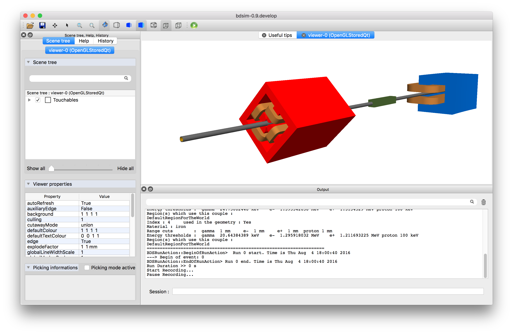

.. _running-bdsim:

=============
Running BDSIM
=============

Basic Operation
===============

The minimum required information to run BDSIM is an input GMAD file. ::

  bdsim --file=lattice.gmad

The following section describes other 'executable' options that may specify
various options, such as whether to run in 'batch' mode or interactively with a
visualiser and where to write output.

.. _executable-options:

Executable Options
==================

BDSIM can be executed in a terminal with extra arguments to specify various inputs.
The angular brackets here are to indicate a user-specified value and should not
be used literally.  The following command may be used to display all options::

  bdsim --help

.. tabularcolumns:: |p{6cm}|p{9cm}|

+---------------------------------------+------------------------------------------------+
|  -\-help                              | Lists all executable commands                  |
+---------------------------------------+------------------------------------------------+
|  -\-reference or -\-citation          | Print out the citation for the BDSIM paper,    |
|                                       | including the bibtex syntax.                   |
+---------------------------------------+------------------------------------------------+
|  -\-file=<file>                       | Specifies the input gmad file                  |
+---------------------------------------+------------------------------------------------+
|  -\-batch                             | Batch mode - no graphics                       |
+---------------------------------------+------------------------------------------------+
|  -\-circular                          | Assumes circular machine - turn control. See   |
|                                       | note below.                                    |
+---------------------------------------+------------------------------------------------+
|  -\-colours                           | Print out all colours predefined in BDSIM and  |
|                                       | exit                                           |
+---------------------------------------+------------------------------------------------+
|  -\-distrFile=<file>                  | Which file to use for the bunch                |
|                                       | distribution                                   |
+---------------------------------------+------------------------------------------------+
|  -\-distrFileNLinesSkip=N             | Number of lines to skip into a file. This is   |
|                                       | added to :code:`nlinesIgnore`. This is applied |
|                                       | again if the file loops.                       |
+---------------------------------------+------------------------------------------------+
|  -\-distrFileLoopNTimes=N             | Repeat the distribution file entirely N times. |
+---------------------------------------+------------------------------------------------+
|  -\-exportGeometryTo=<file>           | Exports the geometry to a file                 |
|                                       | extension, which determines the format         |
|                                       | where possible extensions are ("gdml")         |
+---------------------------------------+------------------------------------------------+
|  -\-E0=N                              | Set the beam E0 total energy (in GeV only)     |
+---------------------------------------+------------------------------------------------+
|  -\-Ek0=N                             | Set the beam Ek0 kinetic energy (in GeV only)  |
+---------------------------------------+------------------------------------------------+
|  -\-geant4MacroFileName=<file>        | Optional Geant4 macro file to run after the    |
|                                       | visualisation has started. Only works in       |
|                                       | interactive visualisation.                     |
+---------------------------------------+------------------------------------------------+
|  -\-geant4PhysicsMacroFileName=<file> | Optional Geant4 macro file to run after        |
|                                       | physics lists have been constructed but        |
|                                       | before a run.                                  |
+---------------------------------------+------------------------------------------------+
|  -\-generatePrimariesOnly             | Generates primary particle coordinates only    |
|                                       | then exits without simulating anything         |
+---------------------------------------+------------------------------------------------+
|  -\-materials                         | Lists materials included in BDSIM by default   |
+---------------------------------------+------------------------------------------------+
|  -\-ngenerate=N                       | The number of primary events to simulate       |
|                                       | overrides the ngenerate option in the input    |
|                                       | file.                                          |
+---------------------------------------+------------------------------------------------+
|  -\-output=<fmt>                      | Outputs the format "rootevent" (default) or    |
|                                       | "none"                                         |
+---------------------------------------+------------------------------------------------+
|  -\-outfile=<file>                    | Outputs file name. Will be appended with _N    |
|                                       | where N = 0, 1, 2, 3...                        |
+---------------------------------------+------------------------------------------------+
|  -\-printFractionEvents=N             | How often to print out events as a fraction    |
|                                       | of the total number of events to simulate      |
|                                       | (default 0.1 i.e. 10%). -1 for all.            |
+---------------------------------------+------------------------------------------------+
|  -\-printFractionTurns=N              | How often to print out turns as a fraction     |
|                                       | of the total number of turns to simulate       |
|                                       | (default 0.2 i.e. 20%). -1 for all. Will       |
|                                       | only print out on an event that will print     |
|                                       | out as well.                                   |
+---------------------------------------+------------------------------------------------+
|  -\-printPhysicsProcesses             | At the start of the run, print out all         |
|                                       | particles registered according to the physics  |
|                                       | list chosen and print out the name of every    |
|                                       | physics process for that particle.             |
+---------------------------------------+------------------------------------------------+
|  -\-P0=N                              | Set the beam P0 momentum (in GeV only)         |
+---------------------------------------+------------------------------------------------+
|  -\-recreate=<file>                   | The rootevent output file to recreate events   |
|                                       | from.                                          |
+---------------------------------------+------------------------------------------------+
|  -\-seed=<N>                          | Seed for the random number generator           |
+---------------------------------------+------------------------------------------------+
|  -\-seedStateFileName=<file>          | File containing CLHEP::Random seed state       |
|                                       | NB \- this overrides other seed values         |
+---------------------------------------+------------------------------------------------+
|  -\-startFromEvent=N                  | Event offset to start from when recreating     |
|                                       | events when using :code:`--recreate`           |
+---------------------------------------+------------------------------------------------+
|  -\-survey=<file>                     | Prints survey info to <file>                   |
+---------------------------------------+------------------------------------------------+
|  -\-verbose                           | Displays general parameters before run         |
+---------------------------------------+------------------------------------------------+
|  -\-verboseEventBDSIM                 | BDSIM event level print out                    |
+---------------------------------------+------------------------------------------------+
|  -\-verboseEventLevel                 | (0-5) level of Geant4 event level print out    |
|                                       | for all events                                 |
+---------------------------------------+------------------------------------------------+
|  -\-verboseEventStart                 | Event index to start event print out           |
+---------------------------------------+------------------------------------------------+
|  -\-verboseEventContinueFor           | Number of events for event level print out     |
+---------------------------------------+------------------------------------------------+
|  -\-verboseEventNumber                | Shortcut that sets `verboseEventStart` and     |
|                                       | also sets `verboseEventContinueFor` to 1       |
+---------------------------------------+------------------------------------------------+
|  -\-verboseTrackingLevel              | (0-5) tracking level print out                 |
+---------------------------------------+------------------------------------------------+
|  -\-verboseSteppingBDSIM              | BDSIM stepping print out for all events and    |
|                                       | all particles.                                 |
+---------------------------------------+------------------------------------------------+
|  -\-verboseSteppingLevel              | (0-5) level of Geant4 stepping level print out |
+---------------------------------------+------------------------------------------------+
|  -\-verboseSteppingEventStart         | Event index to start stepping print out        |
+---------------------------------------+------------------------------------------------+
|  -\-verboseSteppingEventContinueFor   | Number of events for stepping print out        |
+---------------------------------------+------------------------------------------------+
|  -\-verboseSteppingPrimaryOnly        | Print stepping info for primary only           |
+---------------------------------------+------------------------------------------------+
|  -\-version                           | Displays the version number of BDSIM           |
+---------------------------------------+------------------------------------------------+
|  -\-versionGit                        | Displays the version number of BDSIM along     |
|                                       | with the git SHA1 from the repository when     |
|                                       | BDSIM was built                                |
+---------------------------------------+------------------------------------------------+
|  -\-vis_debug                         | Displays all volumes in the visualiser         |
+---------------------------------------+------------------------------------------------+
|  -\-vis_mac=<file>                    | File with the visualisation macro script.      |
|                                       | Default provided by BDSIM: openGL (OGLSQt)).   |
+---------------------------------------+------------------------------------------------+
|  -\-writeSeedState                    | Writes an ASCII file seed state for each       |
|                                       | event                                          |
+---------------------------------------+------------------------------------------------+

BDSIM can be run in one of two ways: `interactively`_ or `in batch mode`_, which
are described in the following sections.

When run interactively, a Geant4 visualiser is invoked that produces a window with an image
of the BDSIM model as well as a terminal prompt to control it. No events are simulated
without user input. BDSIM provides a basic visualisation "macro" for Geant4 using the Qt
visualiser to start and add the geometry to the scene. This is found from the
BDSIM installation directory or failing that the build directory. The user may provide
their own custom visualisation macro with the executable command :code:`--vis_mac=mymac.mac`.

Alternatively, BDSIM can be run in batch mode, where no visualiser
is used and the specified number of primary events is simulated and feedback is printed
to the terminal. Batch mode is typically much faster than the interactive mode, but
the interactive mode is very useful for understanding the model and a typical event
in the simulation, i.e. where a particle hits.

.. note:: For more information on the :code:`--circular` option and using BDSIM with circular machines,
	  see :ref:`circular-machines`.

See :ref:`bdsim-options-verbosity` for more details on the verbosity options.

.. _running-interactively:
	  
Interactively
=============

Features:

* Default option
* Interactive visualisation of the accelerator model
* Ability to view and rotate the accelerator model
* Ability to run and view individual events
* Visualise events generated at run time
* Typically slower than batch mode
* No events run without user input

To execute BDSIM in interactive mode, the user must simply not use the :code:`--batch` command.
The user can also specify a macro file using the :code:`--vis_mac` option above. By default,
BDSIM will use its own macro that uses Qt and displays the model with a white background. This
can be found in :code:`bdsim/vis/bdsim_default_vis.mac`.

.. note:: If using the visualiser over X-Windows on a Mac, see :ref:`mac-xwindows`.

Example::

  bdsim --file=sm.gmad --outfile=run2

This executes BDSIM for the simpleMachine example in :code:`bdsim/examples/simpleMachine` with ROOT
output (default) to a file named "run2". The program is run interactively and the window shown
below appears. From here, the user types into the visualiser terminal::

  /run/beamOn 1

This runs one event and visualises it. Each time this command is used, a new output file with a
numerical suffix will be created.

   BDSIM running interactively with OpenGL Qt visualiser from Geant4.

To exit the visualiser, in the visualiser terminal type::

  exit

   
More details of how to use the visualiser and common commands can be found in :ref:`Visualisation`.
   
.. note:: The visualiser is part of Geant4, so if the desired visualiser isn't available, you
	  must recompile Geant4 with the correct visualiser (and subsequently BDSIM afterwards). Geant4
	  also uses the CMake configuration system. The visualiser shown is the OpenGL Qt visualiser, which
	  we recommend for its ease of use and high level of interactivity.

.. note:: BDSIM simulates one particle at a time from the primary distribution and all of the
	  associated secondaries. Each event is independent and different particles in the input
	  bunch cannot interact with each other or their secondaries. This is an underlying feature
	  of Geant4.

In Batch Mode
=============

Features:

* No interactive visualiser
* Faster
* Number of events runs, then program quits
* No user input
* Typical use for a "job" on a farm

To execute BDSIM in batch mode, simply use the :code:`--batch` execution option.

Examples: ::

   bdsim --file=atf2.gmad --outfile=run1 --batch --seed=123

This executes BDSIM for the ATF2 example with ROOT output to a file name "run1" in batch
mode with a seed value of 123. The simulation runs the number of events specified by the
:code:`ngenerate` options parameter in the input gmad file, which is 1 by default.
     
.. _running-recreation:
      
Recreate Mode
=============

After performing a simulation in BDSIM, it is possible to reproduce one or more events exactly
the same again - this is called "strong recreation". To do this, the original input gmad files
(and any associated external geometry, field maps, beam distribution files e.g. all the input)
are required and should be the same as was originally used. Along with this, a BDSIM ROOT output
file is required.

The output file is used to load the random number generator seed states at the start of each
event such that the beam and physics processes will be the same. For example::

  bdsim --file=mymodel.gmad --outfile=run1 --batch --ngenerate=100

Now let us recreate event 87 (0 counting): ::

  bdsim --file=mymodel.gmad --outfile=selectevent --batch --ngenerate=1 --recreate=run1.root --startFromEvent=87

The relevant executable options are :code:`recreate`, :code:`startFromEvent`. These are
also documented in :ref:`options-general-run`.

Recreation can also be used by specifying options in the input gmad file. For example: ::

  ! start with the original model
  include mymodel.gmad;

  option, recreate=1,
          recreateFileName="run1.root",
	  startFromEvent=87,
	  ngenerate=1;

If the above GMAD syntax was in a file called "recreation1.gmad", we would run it like: ::

  bdsim --file=recreation1.gmad --outfile=selectevent --batch

This would be equivalent to the recreation example above. Note, the option :code:`recreate`
in GMAD is a Boolean (set to 1 or 0) but as an executable option it's the path to the
file (a string).
  
Notes:

* The event offset counting is 0 counting. So, the first event is index 0. This is consistent
  with the print out of event number in BDSIM.
* If the recreation goes beyond the stored number of events, the random number generator will proceed
  as normal. e.g. starting from event 80/100 and generating 30 events, will result in 10 new events.
* Executable options override whatever options were used (and therefore stored in the output) in the
  initial run of BDSIM.
* Changing physics options in your input as compared to the original model will result in different
  results. The primary particle coordinates will of course be the same. The random number generator
  is set at the beginning of each new event.
* If a user supplied bunch distribution is used, the reading of the bunch file will start from
  the correct event to fully recreate the exact same event again.
