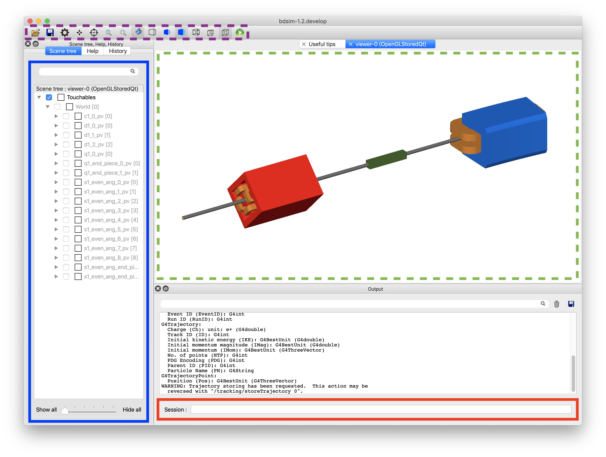
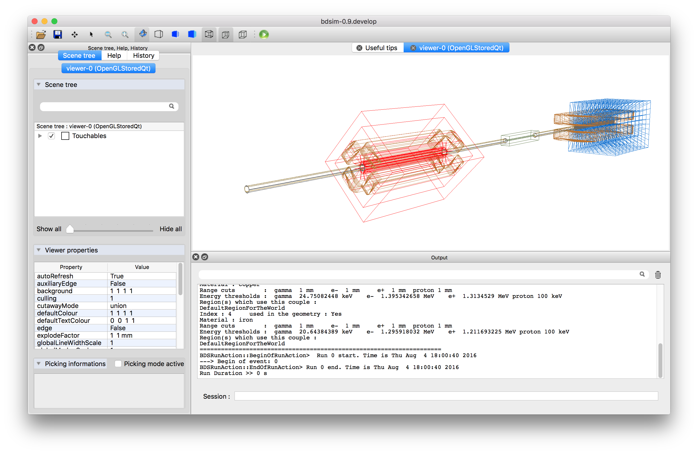
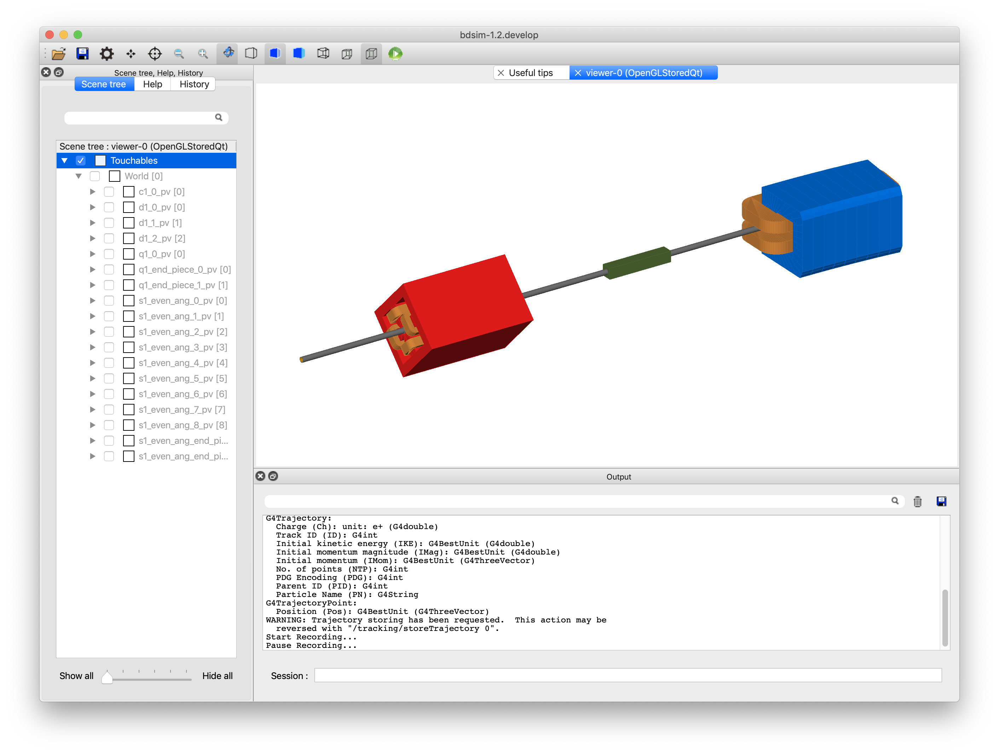
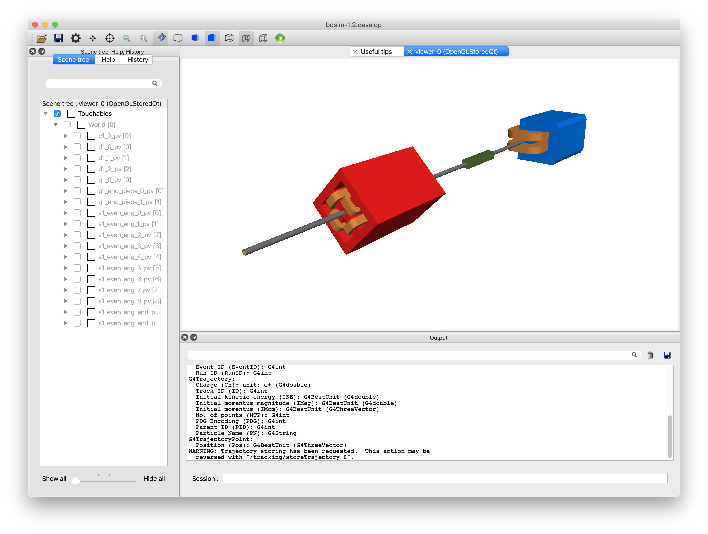
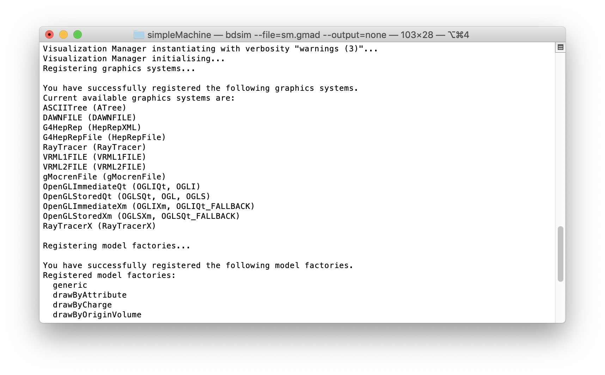

.. _visualisation:

=============
Visualisation
=============

When BDSIM is executed **without** the :code:`--batch` executable option, the
Geant4 visualisation system is used. This is the default behaviour as it is
typical to view and understand the typical outcome of a model before running larger
simulations in batch mode. By default, BDSIM uses the **OpenGL Qt** visualiser
as it's very easy to work with and has a rich feature set.

To use this visualisation, Geant4 must have been compiled with the Qt visualiser
option turned on, which is non-default. Qt is however, the most widely used
visualiser and recommended by Geant4.  See :ref:`visualisation-adding-others`
for more.

Below are the most commonly used commands and the full set of features is described
in :ref:`visualisation-features`.

Using the visualiser means that BDSIM will use more memory as it is required to
store the trajectories of all particles to display them. By default, only 100 events
will be accumulated for display. Events outside this will be discarded from the visualisation.

.. _visualisation-default-colour-coding:

Colour Coding
=============

The default colour coding of trajectories is the same as Geant4. This colour coding is
green: neutral; blue: positively charged; red: negatively charged.

Common Useful Commands
======================

Excute BDSIM with your input gmad file name: ::

  bdsim --file=sm.gmad

The following is a list of our most commonly used commands that can be useed in the
session box (terminal prompt) inside the visualiser: 

* :code:`/run/beamOn 3` - Runs three primary events
* :code:`exit` - Exits the visualiser and BDSIM
* :code:`/vis/viewer/set/viewpointThetaPhi 0 90` - Sets the view point angle
* :code:`/vis/scene/add/axes 0 0 0` - Adds a set of unit vector axes at position (0,0,0)
* :code:`/vis/drawVolume worlds` - view all invisible geometry including samplers
* :code:`/vis/viewer/set/lightsVecto 1 1 1` - change the orientation of the lighting to
  roughly opposite
* :code:`/vis/viewer/set/viewpointThetaPhi 180 0` - look along the beam line
* :code:`/bds/beamline/goto d1` - reposition the view point at beam line element named `d1`
* :code:`/vis/viewer/set/projection p 75` - set the viewing style to perspective with angle 75 degrees
* :code:`/vis/viewer/set/projection o` - set the projection to orthographi (no perspective)
* :code:`/vis/viewer/addCutawayPlane 0 0 0 m 1 0 0` - add a cut away plane along the beam line making
  everything on one side invisible.
* :code:`/vis/viewer/clearCutawayPlanes` - get rid of cut away planes

.. _visualisation-features:

Visualisation Features
======================

The default OpenGL Qt visualiser is shown below.

.. figure:: figures/visualisation/qtvisualiser.png
   :width: 100%
   :align: center
   :figclass: align-center

The visualiser is shown again below with some interesting parts highlighted. These are:

* **Green dashed box middle** Main visualiser window - view of the model
* **Purple dashed box top left** Control buttons that are described in more detail in `Control Buttons`_
* **Blue box on the left** Scene tree - expand this to see a full list of all volumes
  in the simulation.
* **Orange box top left** Help browser where you can search for all commands in the visualiser
* **Red box bottom** Session - enter commands here.

.. _visualisation-control-buttons:
  
Control Buttons
---------------

.. figure:: figures/visualisation/qtbuttons.png
   :width: 100%
   :align: center
   :figclass: align-center

Drawing Styles
--------------

The model may be viewed as a wireframe model, wireframe and solid and in all cases with
or without perspective. Some examples of this are shown below for the same model. These
are all controlled easily from the buttons at the top. There are also commands that will
work to control these as documented in Geant4.

   As a wireframe model.

   With both solid and wireframe visualisation (subtle lines on each piece of geometry).

   With perspective.

Default and Custom Visualisers
==============================

Strictly speaking, a visualisation macro must be supplied to Geant4 to
tell it what to display. For convenience, BDSIM provides a set of macros
that display the geometry and add a few useful buttons and menus to the
user interface. To use these, the user need only **not** specify a specific
visualisation macro. ::

  bdsim --file=mylattice.gmad

* Note also no :code:`--batch` command

If you wish to use a different visualiser, you may specify this by using
your own visualisation macro with BDSIM. This can be done using the following
command: ::

  bdsim --file=mylattice.gmad --vis_mac=othervis.mac

where :code:`othervis.mac` is your visualisation macro. It is recommended to copy
and edit the default BDSIM visualisation macro (vis.mac) that can be found in the
bdsim source directory as follows: ::

  bdsim/vis/*.mac

When running, BDSIM looks for the macros in the installation directory and then the
build directory if it exists. The user can edit this files directly as a default
for BDSIM on their system. (e.g. :code:`<bdsim-install-dir>/vis/*.mac`).

The user can also specify an optional macro to run after the visualisation has started.
This way, you can use the default BDSIM visualisation but run your own macro at the beginning.
This may be useful for particular view points or visualisation settings. ::

  bdsim --file=mylattice.gmad --geant4Macro=viewpoint.mac

.. note:: This macro is run after the geometry is 'closed' in Geant4 terminology and
	  the physics list is fixed.

.. _visualisation-adding-others:
  
Adding Other Visualisers
========================

BDSIM makes use of the visualisers Geant4 was compiled with on your system. When
BDSIM is started interactively (i.e. without the :code:`--batch` command), Geant4
will print a list of all available visualisers that are available. Below is an
example excerpt from the terminal output that shows the list of available
visualisers on the developer's system.

By default, BDSIM uses the **OpenGL Qt** visualiser - we highly recommend this, as
it is the most modern one with the best feature set. It is also recommended by
Geant4.

To add another available visualiser, you must change the build options of Geant4
(in ccmake), recompile and install it; then you must recompile BDSIM against
the new Geant4. In the case where you simply update the Geant4 options in the same
installation, this process is relatively quick and recompiling BDSIM only relinks
the libraries together (the last quick step of compilation).

For Geant4 to enable other visualisers, it will require certain other 3rd party libraries
to be present. On Mac, these can be found through a package manager such as MacPorts
and on linux, through whatever package manager is available (e.g. yum). These must
be installed before reconfiguring Geant4.

See :ref:`geant4-installation-guide` for more details on configuring Geant4.
