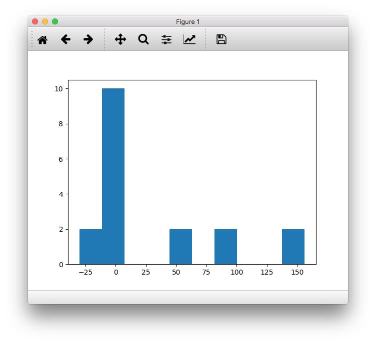
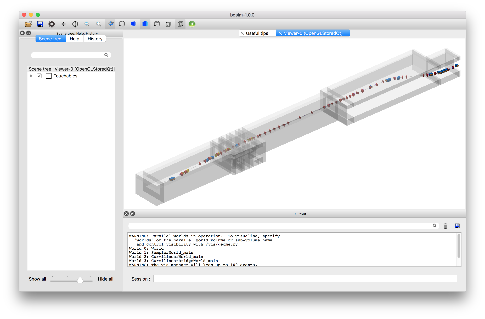
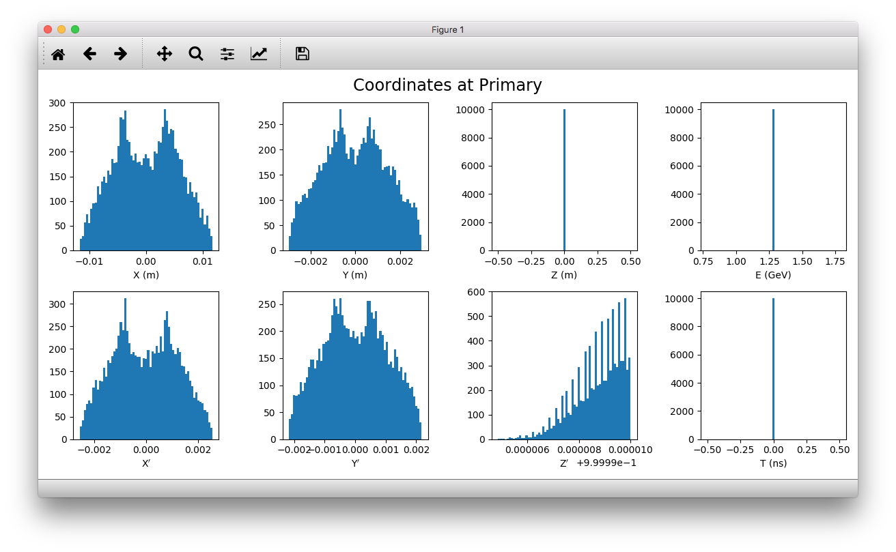
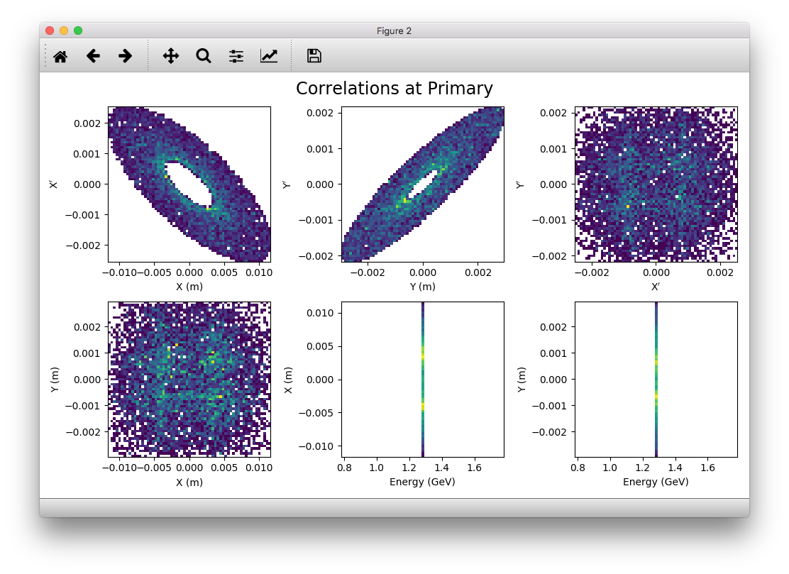
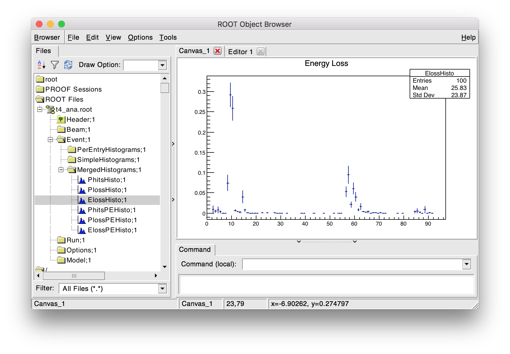
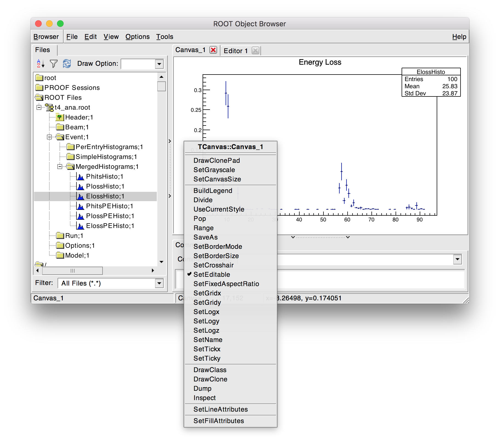
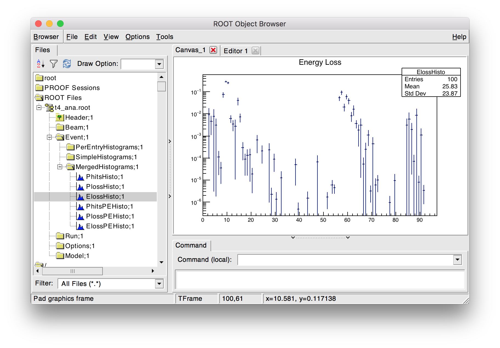

Accelerator Test Facility 2 - KEK, Japan
========================================

Contents
--------

* `Preparation`_
* `Model Description`_
* `Input Preparation`_
* `Input Inspection`_
* `Conversion`_
* `Optical Validation`_
* `Adding to Model`_
* `Changing Beam Distribution`_
* `Halo Simulation`_
* `Analysis`_
* `Spectra at Plane`_

  
Preparation
-----------

* BDSIM has been compiled and installed.
* The (DY)LD_LIBRARY_PATH and ROOT_INCLUDE_PATH environmental variables are set as
  described in :ref:`output-analysis-setup`.
* ROOT can be imported in Python
* `pymadx` and `pybdsim` have been installed.

Model Description
-----------------

This is the 1.3GeV energy scaled test facility for the ILC final focus system.
The real machine consists of an approximately 70m normal conducting linac,
transfer line, racetrack damping ring and finally an extraction line. This
model represents only the ~100m single-pass extraction line.

Input Preparation
-----------------

A MADX job was used to prepare a Twiss table from MADX in TFS format. This is included in
`bdsim/examples/atf2/atf2-nominal-twiss-v5.2.tfs.tar.gz`. The file was prepared by adding
the following to the end of the MADX job::

  select,flag=twiss, clear;
  twiss,sequence=ATF2, file=atf2-nominal-twiss-v5.2.tfs;

As we don't specify any columns, all columns are written out (~250). Whilst this may seem
overkill, it ensures we don't miss any of the required columns for conversion.

For convenience we compress this to save space. `pybdsim` and `pymadx` both work
with a compressed TFS file without the need to decompress it. ::

  tar -czf atf2-nominal-twiss-v5.2.tfs.tar.gz atf2-nominal-twiss-v5.2.tfs

Input Inspection
----------------

We can inspect the model as provided by MADX with pymadx in Python. ::

  > python
  >>> import pymadx
  >>> a = pymadx.Data.Tfs("atf2-nominal-twiss-v5.2.tfs.tar.gz")
  >>> a.ReportPopulations()
  Filename > atf2-nominal-twiss-v5.2.tfs.tar.gz
  Total number of items > 1032
  Type........... Population
  MULTIPOLE...... 516
  DRIFT.......... 201
  QUADRUPOLE..... 102
  MARKER......... 78
  MONITOR........ 64
  SBEND.......... 24
  SEXTUPOLE...... 18
  HKICKER........ 15
  VKICKER........ 14

We can also inspect the strengths of all the sextupoles for example ::

  >>> sextupoles = a.GetElementsOfType('SEXTUPOLE')
  >>> len(sextupoles)
  18
  >>> type(sextupoles)
  pymadx.Data.Tfs
  >>> import matplotlib.pyplot as plt
  >>> plt.hist(sextupoles.GetColumn("K2L")/sextupoles.GetColumn("L"))

This produces the following figure:

Conversion
----------

The model can be converted to BDSIM's GMAD syntax with the converter provided in `pybdsim`. ::

  > python
  >>> import pybdsim
  >>> a,b,c = pybdsim.Convert.MadxTfs2Gmad('atf2-nominal-twiss-v5.2.tfs.tar.gz', 'atf2bdsim')

The converter will automatically generate a Twiss beam distribution based on the first element
of the lattice. If the first element is **not a marker** the beam will be wrong as the optical
functions from MADX are typically at the end of each element (they can be set to the middle too,
but not to the beginning). The user should check the distribution.

This converts the model as is. We can also prepare a linear only version of the model::

  >>> a,b,c = pybdsim.Convert.MadxTfs2Gmad('atf2-nominal-twiss-v5.2.tfs.tar.gz', 'atf2bdsimlinear', linear=True)

Several gmad files are created::

  > ls
  atf2bdsimlinear.gmad
  atf2bdsimlinear_beam.gmad
  atf2bdsimlinear_components.gmad
  atf2bdsimlinear_options.gmad
  atf2bdsimlinear_sequence.gmad

The components are defined in the file with `components` suffix, the sequence, options and beam similarly.
These GMAD files are included in the *main* file `atf2bdsimlinear.gmad`.

* No options are required by default to get a working model.
* Only tracking is provided by default - no physics processes are registered.
* By default, a sampler is attached to all items with the :code:`sample, all;` command in the main file.
  

Optical Validation
------------------

First we validate that the Twiss beam definition in the converted model is correct for
our machine. This is the case as the first item in the lattice is a marker in the MADX
job. The emittance and energy spread were also correctly specified in the MADX job and
have therefore been converted correctly.

We run 1000 particles to validate the optics::

  bdsim --file=atf2bdsimlinear.gmad --outfile=o1 --batch --ngenerate=1000

This output file can then be analysed to calculate the beam size and optical functions::

  rebdsimOptics o1.root optics.root

We can now compare the optical functions using `pybdsim`. ::

  > python
  >>> import pybdsim
  >>> pybdsim.Compare.MadxVsBDSIM('atf2-nominal-twiss-v5.2-sige0.tfs', 'optics.root')

This produces a series of plots comparing beam size and optical functions such as the following:

.. figure:: figures/optics/sigma.pdf
	    :width: 100%
	    :align: center

	    Beam size.

.. figure:: figures/optics/sigmap.pdf
	    :width: 100%
	    :align: center

	    Angular beam size.
	    
.. figure:: figures/optics/mean.pdf
	    :width: 100%
	    :align: center

	    Beam centroid.

.. figure:: figures/optics/beta.pdf
	    :width: 100%
	    :align: center

	    Twiss :math:`\beta` function. Only the first part is shown due to the large variation.
	    
.. figure:: figures/optics/alpha.pdf
	    :width: 100%
	    :align: center

	    Twiss :math:`\alpha` function. Only the first part is shown due to the large variation.

Note, with nonlinear optics (i.e. including sextupoles and higher) the emittance between
each plane (horizontal, vertical) will be mixed and the calculated optical functions are
not representative. A model converted with the 'linear' flag will however be valid.

This step verifies that the model has been prepared correctly and matches the model
in the original program, MADX.

.. note:: The energy spread used in BDSIM beam definition must be the same as that in
	  the Twiss output from MADX for the comparison to be valid.

.. note:: The errors are the statistical uncertainty associated with the calculation. It
	  is possible depending on the number of particles for the model to agree but
	  the original lie outside the error bars.

Adding to Model
---------------

At this point, we can add more detail to the model. Here we place a GDML file containing
the tunnel geometry around the beam line. This geometry was prepared externally and
designed to have a hollow outermost 'world' volume so that it does not overlap with the
beam line - both exist at the same level in the hierarchy. If the tunnel container were not
hollow, the beam line would overlap with the tunnel geometry and tracking would be invalid.

In the main GMAD file, we define a placement of the geometry with the appropriate transform. ::

  tun : placement, geometryFile="gdml:atf2_tunnel.gdml", x=-4.5*m, z=49*m;

The example GDML file ("atf2_tunnel.gdml") is provided in :code:`bdsim/examples/atf2/`. An example
file including this geometry with the placement above is provided in
:code:`bdsim/examples/atf2/nlsige/atf2-with-tunnel.gmad`.

Care must be taken not to place geometry that overlaps with the beam line otherwise the tracking
will be wrong. Using the :code:`option, checkOverlaps=1;` option is recommended when placing the
geometry for the first time. Once validated, this can be turned off for speed.

	    Visualisation of the ATF2 in BDSIM with GDML tunnel model.

Geometry can be added for magnet yokes, placed alongside the beam line and placed
in the beam line. See :ref:`externally-provided-geometry` for more details.

Custom field maps could also be added to the yokes of particular magnets. A general field map
for quadrupoles could also be added for example and auto-scaling used to scale the field map
for each quadrupole it's attached to. See :ref:`field-maps` for more details.

One simple change is to specify a default aperture for all components. ::

  option, aper1=1.5*cm,
          beampipeThickness=1*mm;

The typical beam pipe width of the ATF2 is 30mm and the thickness ~1.5mm.

Changing Beam Distribution
--------------------------

As the model stands, it is not very interesting. The default aperture of 5cm is much bigger
than the typical sigma of the beam, which from the optics plots above can seen to be of order
1mm. To experience even a few hits, would require billions of events to be simulated, which is
of course not very efficient. We therefore specify a **halo** distribution of particles that
are likely to hit the aperture. The halo distribution is described in :ref:`beam-distributions`
and specifically in :ref:`beam-halo-distribution`. We define a halo distribution according
to the normal Twiss parameters at the start of the lattice but with a much greater sigma.

Even if a Gaussian distribution is ultimately required, a common technique is
to generate a uniform distribution of particles and then weight the events in analysis
according to the Gaussian.

Here is an example halo distribution ::

  beam,	alfx=1.108024744, 
	alfy=-1.907222942, 
	betx=6.848560987*m, 
	bety=2.935758992*m, 
	distrType="halo", 
	emitx=2e-09*m, 
	emity=1.195785323e-11*m, 
	energy=1.282*GeV, 
	particle="e-", 
	sigmaE=0.0008,
	haloNSigmaXInner      = 30,
	haloNSigmaXOuter      = 80,
        haloNSigmaYInner      = 100,
        haloNSigmaYOuter      = 500,
        haloPSWeightParameter = 1,
        haloPSWeightFunction  = "oneoverr";

To validate this distribution and visualise it, we can generate only the particles without
performing the full simulation. We execute BDSIM with the :code:`--generatePrimariesOnly`
option. As the generation is very quick, we can afford to generate a large number of particles.
Here 10000 were generated in approximately 10s. ::

  bdsim --file=atf2-halo.gmad --generatePrimariesOnly --outfile=haloprimaries --batch --ngenerate=10000

We can then load and visualise the data using `pybdsim`. This is shown using a convenience function
for the primary particle distribution::

  > python
  >>> import pybdsim
  >>> pybdsim.Plot.PrimaryPhaseSpace('haloprimaries.root')

This produces the following figures. The user of course can create their own plots by loading the data.

The raw data can be loaded from any sampler manually::

  > python
  >>> import pybdsim
  >>> d = pybdsim.Data.Load("haloprimaries.root")
  >>> psd = pybdsim.Data.PhaseSpaceData(d)
  >>> allData = pybdsim.Data.SamplerData(d,0)

The "phase space data" is only the data required to make the above plots. The "sampler data" is all the data
including weights, PDG ID, track ID etc.

The object "psd" here contains a member dictionary called "data" that has a numpy array for each
key inside it. ::

  >>> psd.data.keys()
  ['energy', 'T', 'yp', 'y', 'x', 'xp', 'z', 'zp']
  >>> x = psd.data['x']

		    
Halo Simulation
---------------

As the model stands, no physics processes are registered so any particles
hitting the machine will not interact with the matter and pass straight through. This
is useful for efficient tracking and optical validation but not useful for a physics study.
We therefore specify a physics list. For a 1.3GeV electron, the basic electromagnetic
physics list from Geant4 as well as the decay physics and some muon specific processes
are useful. The full set of physics lists are described in :ref:`physics-processes`. ::

  option, physicsList="em decay muon";

By default, samplers are attached to everything. Whilst suitable for optical comparison
this produces a huge amount of data for a physics study. We turn this off by commenting
it out with an exclamation mark. ::

  !sample, all;

We have now specified the halo distribution as described above, a default aperture and
physics processes. One final step is to turn off sensitivity to the tunnel geometry as
this is not required. ::

  tun : placement, geometryFile="gdml:../atf2_tunnel.gdml", x=-4.5*m, z=49*m, sensitive=0;

The input gmad file prepared is supplied in :code:`bdsim/examples/atf2/nlsige/atf2-halo.gmad`.

We first run a small sample to gauge the length of the simulation and that the results
are very roughly what we expect or want to see (before running a large number of particles). ::

  > bdsim --file=atf2-halo.gmad --outfile=t1 --batch --ngenerate=100

This took approximately 10s to simulate and produced an output file "t1.root". We perform
a very quick and simple analysis now to investigate what happened in the simulation.

Analysis
--------

The first simple analysis step is make a histogram of the mean energy deposition per event.
BDSIM by default records a histogram of energy deposition per event. One could run the
analysis tool `rebdsim` with an input *analysisConfig.txt* specifying histograms. This would
also merge (take the average of) the pre-made per event histograms. A utility is provided for
merging only the histograms. ::

  > rebdsimHistoMerge t1.root t1_ana.root

This loops over all events in the file and combines the per event histograms and writes them
to a file called "t1_ana.root" here. To inspect this file, we load it in ROOT and browse it
using a *TBrowser*. ::

  > root -l t1_ana.root
  > $> TBrowser tb;

This produces the following browser. We double click on the "t1_ana.root" file and then the
folders inside. There is a folder for each Tree in the output and then per entry simple and
merged histograms. We look inside and double click on the histogram to view it.

	    TBrowser in ROOT showing file structure from `rebdsim` / `rebdsimHistoMerge`.

The energy deposition is in GeV / event. The horizontal axis is the curvilinear S coordinate in
metres. The default binning is 1m and can be controlled with the option
:code:`option, elossHistoBinWidth=1*m;`.

As the level of energy deposition varies by many orders of magnitude, it is useful to
view the histogram on a logarithmic scale. By right-clicking in the TBrowser close to the
axis, the option "SetLogy" can be used.

	    Setting log y axis in ROOT.

	    Energy deposition for 100 events from halo simulation.

We can then repeat this simulation and simple analysis for a greater number of primary particles. The
file :code:`examples/atf2/10khalo_ana.root` is included from the analysis of 10000 particles. The simulation
took 976s and produced a 178MB ROOT output file on the developer's computer.
	    
Spectra at Plane
----------------

To investigate the radiation at a plane at some point in the accelerator we can place a sampler
on an element of interest. Here, we place a sampler on "B5FFB", which is a dipole at the end of
the long straight section in the lattice. In reality, cherenkov detectors were placed after this
dipole in the past for detecting signal from experiments such as the laserwire experiment. The sampler
is added via the command::

  sample, range=B5FFB;

Sampler record the passage of any particle through them, even if it's backwards or the same particle
again. They are (by default) a 5m wide square plane that's 1pm thick.

A simple analysis is to make a 2D histogram of the particle flux and the energy weighted particle
flux at this plane. To do this we use the analysis tool `rebdsim`. This takes an input text file
defining histograms. The syntax is described in :ref:`analysis-preparing-analysis-config`. The
analysisConfig.txt used is provided in :code:`examples/atf2/analysisConfig.txt`.

::

   InputFilePath	    10k.root
   OutputFileName	    10khalo_ana.root
   # Object       treeName   Histogram Name         # Bins   Binning              Variable          Selection
   Histogram1D    Event.     XFlux                  {40}     {-2:2}               B5FFB.x           1
   Histogram1D    Event.     XFlux-Energy-Weighted  {40}     {-2:2}               B5FFB.x           B5FFB.energy
   Histogram1D    Event.     YFlux                  {40}     {-2:2}               B5FFB.y           1
   Histogram1D    Event.     YFlux-Energy-Weighted  {40}     {-2:2}               B5FFB.y           B5FFB.energy
   Histogram2D    Event.     XYFlux                 {20,20}  {-0.5:0.5,-0.5:0.5}  B5FFB.y:B5FFB.x   1
   Histogram2D    Event.     XYFlux-Energy-Weighted {20,20}  {-0.5:0.5,-0.5:0.5}  B5FFB.y:B5FFB.x   B5FFB.energy
   Histogram1D    Event.     XPhotons               {40}     {-2:2}               B5FFB.x           B5FFB.partID==22
   Histogram1D    Event.     XElectrons             {40}     {-2:2}               B5FFB.x           B5FFB.partID==11
   Histogram1D    Event.     XPositrons             {40}     {-2:2}               B5FFB.x           B5FFB.partID==-11

We can view the histograms as before, but we can also easily load them in Python and
make our own plots. ::

  > python
  >>> import pybdsim
  >>> d = pybdsim.Data.Load("10khalo_ana.root")
  >>> d. <tab>
  d.ConvertToPybdsimHistograms d.histograms1dpy             d.histograms3dpy             
  d.filename                   d.histograms2d               d.histogramspy               
  d.histograms                 d.histograms2dpy             d.ListOfDirectories          
  d.histograms1d               d.histograms3d               d.ListOfTrees    

The `pybdsim` data loader automatically extracts the root histograms into Python dictionaries
called "histogramsXd" where "X" is the number of dimensions. All exist in "histograms". These
are also automatically converted to numpy arrays and held in classes provided by `pybdsim` in
the same members suffixed with "py" such as "d.histograms1dpy". Calling these dictionaries
shows the name of the histogram that is the full path inside the file. ::

  {'Event/MergedHistograms/ElossHisto': <ROOT.TH1D object ("ElossHisto") at 0x7f83a0cfba20>,
  'Event/MergedHistograms/ElossPEHisto': <ROOT.TH1D object ("ElossPEHisto") at 0x7f83a1970000>,
  'Event/MergedHistograms/PhitsHisto': <ROOT.TH1D object ("PhitsHisto") at 0x7f83a0cfa8e0>,
  'Event/MergedHistograms/PhitsPEHisto': <ROOT.TH1D object ("PhitsPEHisto") at 0x7f83a1a00640>,
  'Event/MergedHistograms/PlossHisto': <ROOT.TH1D object ("PlossHisto") at 0x7f83a0cfb310>,
  'Event/MergedHistograms/PlossPEHisto': <ROOT.TH1D object ("PlossPEHisto") at 0x7f83a1a00a30>,
  'Event/PerEntryHistograms/XElectrons': <ROOT.TH1D object ("XElectrons") at 0x7f83a0cd89b0>,
  'Event/PerEntryHistograms/XFlux': <ROOT.TH1D object ("XFlux") at 0x7f83a0c94300>,
  'Event/PerEntryHistograms/XFlux-Energy-Weighted': <ROOT.TH1D object ("XFlux-Energy-Weighted") at 0x7f83a0cd70f0>,
  'Event/PerEntryHistograms/XPhotons': <ROOT.TH1D object ("XPhotons") at 0x7f83a0cd8320>,
  'Event/PerEntryHistograms/XPositrons': <ROOT.TH1D object ("XPositrons") at 0x7f83a0cd95a0>,
  'Event/PerEntryHistograms/XYFlux': <ROOT.TH2D object ("XYFlux") at 0x7f839c5ef200>,
  'Event/PerEntryHistograms/XYFlux-Energy-Weighted': <ROOT.TH2D object ("XYFlux-Energy-Weighted") at 0x7f839c5eb000>,
  'Event/PerEntryHistograms/YFlux': <ROOT.TH1D object ("YFlux") at 0x7f83a0cd74e0>,
  'Event/PerEntryHistograms/YFlux-Energy-Weighted': <ROOT.TH1D object ("YFlux-Energy-Weighted") at 0x7f83a0cd7de0>}

The Python versions can be easily plotted using `pybdsim`. ::

  >>> pybdsim.Plot.Histogram1D(d.histograms1dpy['Event/PerEntryHistograms/XElectrons'])
  >>> pybdsim.Plot.Histogram2D(d.histograms2dpy['Event/PerEntryHistograms/XYFlux'])

These produce the following figures.

.. figure:: figures/worked_example_atf2/atf2-1d-example-plot.pdf
	    :width: 100%
	    :align: center

.. figure:: figures/worked_example_atf2/atf2-2d-example-plot.pdf
	    :width: 60%
	    :align: center

We leave it to the user to create the plots they desire. However, the primary particle impact, loss
and associated energy deposition is a useful standard plot that is provided in `pybdsim`. The optional
survey arguments allow a machine diagram to be added on top of the plot. ::

  >>> pybdsim.Plot.LossAndEnergyDeposition('10khalo_ana.root', tfssurvey='../atf2-nominal-twiss-v5.2.tfs.tar.gz')

.. figure:: figures/worked_example_atf2/atf2-losses.pdf
	    :width: 100%
	    :align: center

	    Primary particle impact points, losses and energy deposition from the simulation.

Just the energy deposition can be plotted. ::

  >>> pybdsim.Plot.EnergyDeposition('10khalo_ana.root', tfssurvey='../atf2-nominal-twiss-v5.2.tfs.tar.gz')

.. figure:: figures/worked_example_atf2/atf2-energy-deposition.pdf
	    :width: 100%
	    :align: center

	    Primary particle impact points, losses and energy deposition from the simulation.
