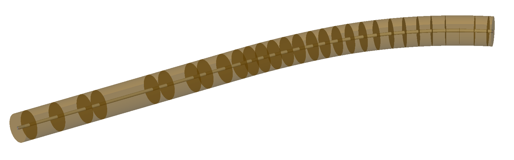
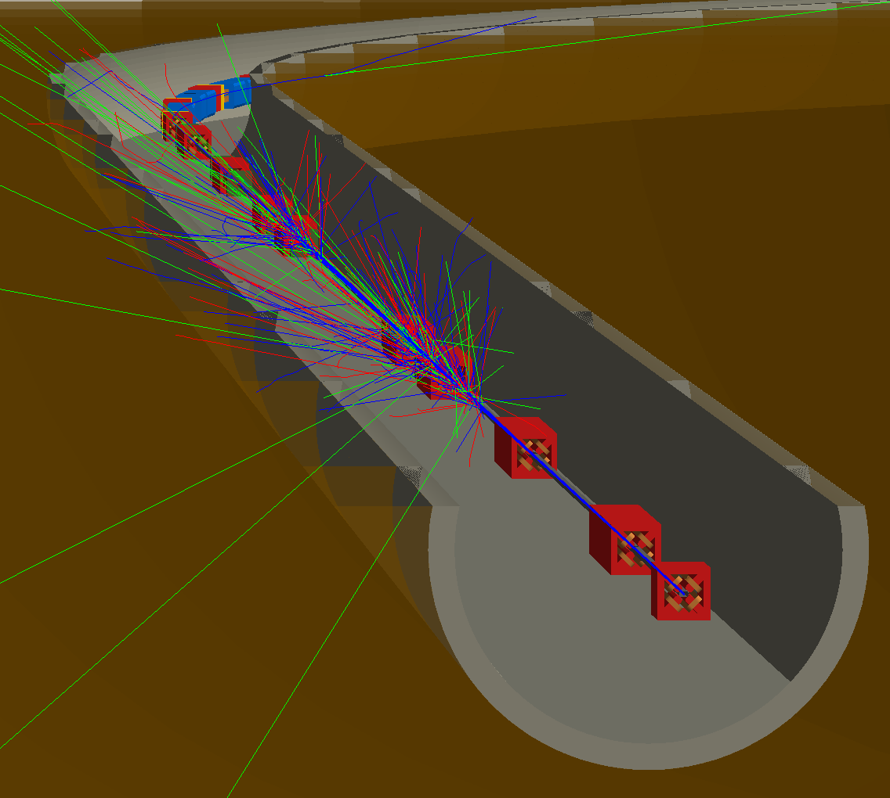
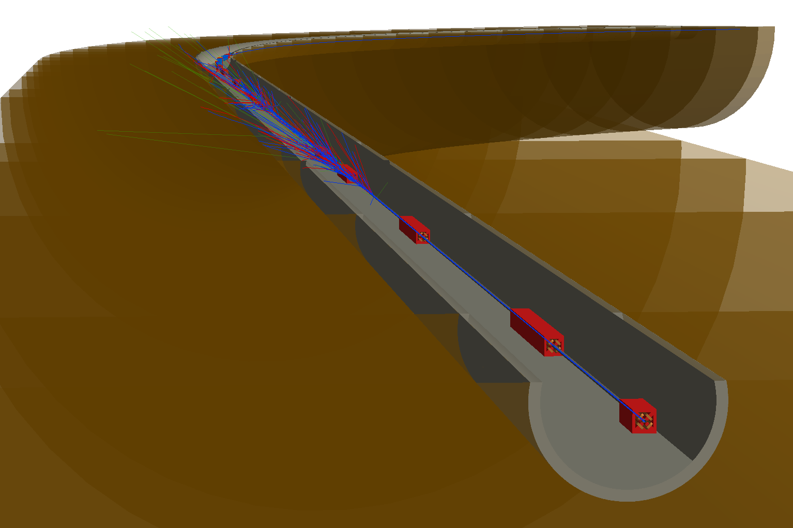
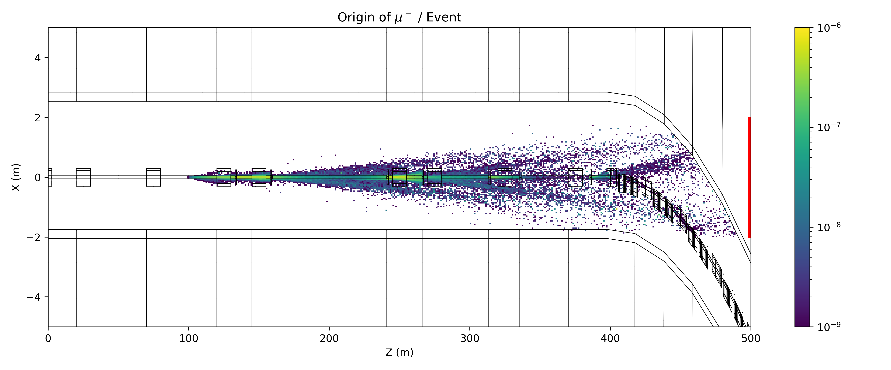
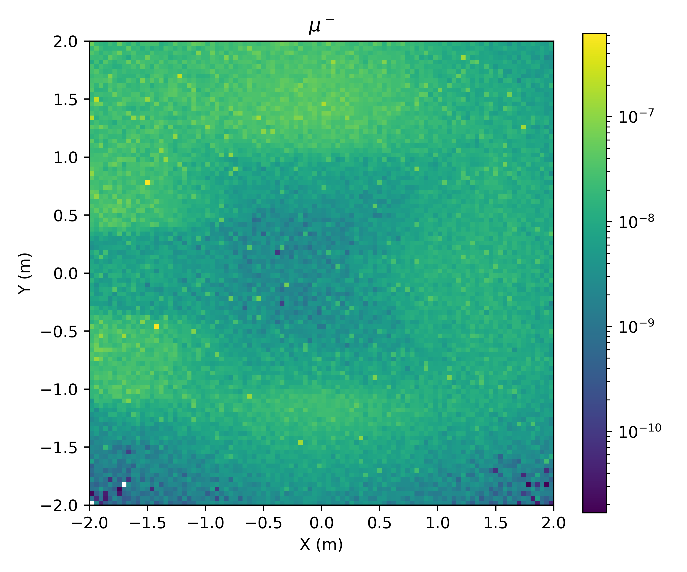

Model Model - Single Pass
=========================

Quite an advanced example.

Topics Covered
--------------

* Model conversion with collimators and aperture.
* Physics macros for Geant4 to modify physics list.
* BDSIM-generated tunnel.
* Halo bunch distribution.
* Trajectory storage.
* Cut away planes in visualisation.
* Process cross-section biasing.
* Analysis including weights.
* Based on the model in :code:`bdsim/examples/model-model/` and specifically
  :code:`bdsim/examples/model-model/bdsim/singlepass/`.

Contents
--------

* `Preparation`_
* `Model Description`_
* `Model Preparation`_
* `Physics Options`_
* `Tunnel`_
* `Beam Distribution`_
* `Output & Trajectories`_
* `Visualisation`_
* `Process Biasing`_
* `Generating Data`_
* `Analysis`_
* `Plotting`_

Preparation
-----------

* BDSIM has been compiled and installed.
* The (DY)LD_LIBRARY_PATH and ROOT_INCLUDE_PATH environmental variables are set as
  described in :ref:`output-analysis-setup`.
* ROOT can be imported in Python
* `pymadx` and `pybdsim` have been installed.

Model Description
-----------------

"model-model" is a fictional ring model representing 1 beam of a fictional collider.
It is race-track shaped with two straight insertions; one for a low beta (Twiss beta)
collision point, and another for collimation with enlarged beta functions.

Here, we prepare a single pass version of this model from a straight section into
part of the arc.

*Backstory: physicists propose a new experiment to look at only muons and neutrinos
that are produced as a by-product at your model-model facility. They are proposing
to dig a new shaft and tunnel in line-of-sight just after an arc starts, where it is
hoped that the tunnel and the rock will remove most of the background from any beam
losses. We're tasked with predicting the muon and neutrino flux and spectrum at this
location.*

.. figure:: model-model-single-pass-schematic.pdf
	    :align: center
	    :width: 100%

	    Cartoon schematic of proposed model with beam line bending out of the
	    way and possible direction of muons produced in collimators into rock.

Model Preparation
-----------------

Following an example from mode-model a single pass version can be created from the
MADX Twiss output in a TFS file using `pybdsim`. A `stopname` argument is given
to the :code:`pybdsim.convert.MadxTfs2Gmad` function as a point up to where to convert
the model to and stop there. The name of an element is chosen about 800m into the
lattice from the start of the collimation section. The intention is to look at muons
produced in the collimation section. ::

  import pybdsim
  import pymadx

  # generate collimator settings
  import makecollimatorgaps
  
  # aperture information
  ap = pymadx.Data.Aperture('../madx/ring_aperture.tfs.gz')
  ap = ap.RemoveBelowValue(0.005)

  # collimator settings
  # uses pybdsim.Data.BDSAsciiData which behaves like dictionaries of dictionaries
  cols = pybdsim.Data.Load('collimatorSettings.dat')
  
  a,b = pybdsim.Convert.MadxTfs2Gmad("../madx/ring_from_collimation.tfs.gz",
                                     "singlepass/bmm-sp",
                                     linear=True,
                                     aperturedict=ap,
                                     collimatordict=cols,
                                     stopname="QUAD.F.H_17",
                                     samplers=None)

This writes a model in the directory "singlepass" and with the base name "bmm-sp.gmad".

.. note:: A good strategy is to **not** edit this main gmad file produced by the conversion
	  but just included it in your own file. This means that if you re-run the script and
	  regenerate the model, you don't loose any handmade edits to this file.

The main model is :code:`singlepass/job-bmm-sp.gmad`. The contents are given below and then
discussed. ::

  !include the basic model
  include bmm-sp.gmad;

  ! now we go to town with the options

  ! let's up the energy for more muons
  beam, energy=450*GeV;

  ! physics options - full physics and high cuts as we want to look at high energy muons
  option, physicsList="g4FTFP_BERT",
          defaultRangeCut=10*cm,
	  minimumKineticEnergy=10*GeV,
	  geant4PhysicsMacroFileName = "emextraphysics.mac";
	  
  ! geometry - include a big tunnel
  option, buildTunnel=1,
	  tunnelOffsetX=40*cm,
	  tunnelOffsetY=50*cm,
	  tunnelAper1=220*cm,
	  tunnelFloorOffset=150*cm,
	  tunnelThickness=30*cm,
	  tunnelSoilThickness=20*m,
	  tunnelMaxSegmentLength=20*m;

  ! set beam distribution to halo so it'll smash deep in the collimators that are at 7 sigma
  beam, distrType="composite",
        xDistrType="halo",
        yDistrType="halo",
        zDistrType="gausstwiss",
        haloNSigmaXInner=8,
        haloNSigmaXOuter=12,
        haloNSigmaYInner=8,
        haloNSigmaYOuter=12,
        sigmaE=0.01;

  ! output options - only store what we need
  option, storeMinimalData=1,
	  storePrimaries=1,
	  storeSamplerCharge=1,
	  storeSamplerKineticEnergy=1,
	  storePrimaryHistograms=1;

  ! trajectories - store muons and neutrinos that reach the sampler
  ! and also their parents back to the primary particle
  option, storeTrajectory=1,
	  trajectoryConnect=1,
	  trajectoryFilterLogicAND=1,
	  storeTrajectoryParticleID="12 -12 13 -13 14 -14",
	  storeTrajectorySamplerID="detector",
	  storeTrajectoryProcesses=1,
	  storeTrajectoryTransportationSteps=0;

  ! detector-like sampler in front of where our proposed detector would be
  ! so here it's just straight ahead but in solid rock as we haven't 'built' a tunnel yet
  detector: samplerplacement, z=500*m, apertureType="rectangular", aper1=2*m, aper2=2*m;

  ! biasing - hadronic inelastic is much more likely than decay for pions
  ! most muons come from decay - balance this out a bit so we more efficiently
  ! simulate muons that reach our detector
  ! note, we don't bias so heavily in vacuum as hadronic inelastic is much less likely there
  piPlusHighBias:  xsecBias, particle="pi+", proc="Decay", xsecfact=1e3, flag=1;
  piMinusHighBias: xsecBias, particle="pi-", proc="Decay", xsecfact=1e3, flag=1;
  piPlusLowBias:   xsecBias, particle="pi+", proc="Decay", xsecfact=50, flag=1;
  piMinusLowBias:  xsecBias, particle="pi-", proc="Decay", xsecfact=50, flag=1;

  ! pi0 decays very very quickly - no need for biasing

  ! kaons are another big source of muons
  kaPlusHighBias:  xsecBias, particle="kaon+", proc="Decay", xsecfact=1e3, flag=1;
  kaMinusHighBias: xsecBias, particle="kaon-", proc="Decay", xsecfact=1e3, flag=1;
  kaPlusLowBias:   xsecBias, particle="kaon+", proc="Decay", xsecfact=50, flag=1;
  kaMinusLowBias:  xsecBias, particle="kaon-", proc="Decay", xsecfact=50, flag=1;
  
  ! attach to various places in the model
  ! accelerator vacuum
  option, defaultBiasVacuum="piPlusLowBias piMinusLowBias kaPlusLowBias kaMinusLowBias";
  ! magnet outer
  option, defaultBiasMaterial="piPlusHighBias piMinusHighBias kaPlusHighBias kaMinusHighBias";
  ! the air
  option, biasForWorldVolume="piPlusLowBias piMinusLowBias kaPlusLowBias kaMinusLowBias";

Physics Options
---------------

In the job file, we include several physics options. ::

  ! let's up the energy for more muons
  beam, energy=450*GeV;

  ! physics options - full physics and high cuts as we want to look at high energy muons
  option, physicsList="g4FTFP_BERT",
          defaultRangeCut=10*cm,
	  minimumKineticEnergy=10*GeV,
	  geant4PhysicsMacroFileName = "emextraphysics.mac";

* We change the beam energy for this proposal from 100 GeV to 450 GeV.
* We use :code:`g4FTFP_BERT` physics list, which is the general Geant4 high energy physics list
  containing full EM and hadronic physics as well as decay.
* The default range cut (usually 1 mm) is increased to 10 cm to reduce the number of secondaries
  produced as we're only interested in relatively high energy muons and neutrinos that we expect
  to have more than say 1% of the primary particle energy. This length scale should not be longer
  than typical component lengths in the model as this will introduce artefacts in particle production
  location and rates.
* We **knowingly** introduce a completely artificial kinetic energy cut that will remove
  any particles below that energy. We do so, knowing that we are reducing the accuracy of
  the simulation but that it will be vastly faster for this example purpose. Normally, we
  should either not use such a limit or carefully choose it given the physics of interest
  so as not to affect the result. Normally, you should optimise after seeing the full result.
* We use a geant4 macro file with a few commands that we could use in an interactive visualiser
  to turn on some extra EM processes that are relevant. These are normally turned off but are
  highly relevant to muon production.

::

   /physics_lists/em/GammaToMuons true
   /physics_lists/em/PositronToMuons true
   /physics_lists/em/PositronToHadrons true
   /physics_lists/em/NeutrinoActivation true
   /physics_lists/em/MuonNuclear true
   /physics_lists/em/GammaNuclear true

Tunnel
------

This model is fictional and we don't have a real tunnel in mind. So we use a BDSIM-generated
one. Several options are used to create a tunnel that follows the beam line. ::

  ! geometry - include a big tunnel
  option, buildTunnel=1,
	  tunnelOffsetX=40*cm,
	  tunnelOffsetY=50*cm,
	  tunnelAper1=220*cm,
	  tunnelFloorOffset=150*cm,
	  tunnelThickness=30*cm,
	  tunnelSoilThickness=20*m,
	  tunnelMaxSegmentLength=20*m;

We add quite a good amount of "soil" outside the concrete tunnel shell so that even
when the tunnel bends the location we are interested in will be inside soil / rock.
	  
Beam Distribution
-----------------

We are interested in observing muons and neutrinos produced inside the collimators. These
are at 6 and 7 sigma of the beam, so only a very small fraction of the beam should hit
the collimators during normal operation. To efficiently simulate such a situation, we use
a `halo` distribution that neglects to generate particles in the central part of the Gaussian
distribution but instead only at the edges. This means that instead of 1 event in over a million
generating a proton that will hit the collimators, nearly every event does and is therefore useful.

.. note:: We simulate a sample of halo and conclude some result from that. If we want a physical rate from
	  the simulations we must normalise to the ratio of this halo as a fraction of the regular beam
	  population (not done here).

The following beam commands update and effectively overwrite some variables from the original model. ::

  ! set beam distribution to halo so it'll smash deep in the collimators that are at 7 sigma
  beam, distrType="composite",
        xDistrType="halo",
        yDistrType="halo",
        zDistrType="gausstwiss",
        haloNSigmaXInner=8,
        haloNSigmaXOuter=12,
        haloNSigmaYInner=8,
        haloNSigmaYOuter=12,
        sigmaE=0.01;

This defines a halo from 8 to 12 sigma (a large impact on the collimators - maybe the beam is excited
for this fictional experiment) in both the horizontal and vertical dimensions.

The halo distribution is actually a uniform flat distribution that is masked by the single particle
emittance ellipse at each amplitude.

We can run the model quickly to look at the phase space. ::

  bdsim --file=job-bmm-sp.gmad --outfile=primaries --ngenerate=100000 --generatePrimariesOnly

This takes about 20s on the developer's computer. We can then plot it using `pybdsim`. ::

  ipython
  >>> import pybdsim
  >>> pybdsim.Plot.PhaseSpaceFromFile("primaries.root")

.. figure:: primaries-plot_coords.pdf
	    :align: center
	    :width: 100%

.. figure:: primaries-plot_correlations.pdf
	    :align: center
	    :width: 100%

Output & Trajectories
---------------------

The goal is to look at **only** muons and neutrinos reaching a plane in the rock and to
understand their origin. We don't really care about energy deposition in the accelerator
so we can remove this from the data to save space. The main way to start is to use
"Minimal Data" and then build up in this case. ::

  ! output options - only store what we need
  option, storeMinimalData=1,
	  storePrimaries=1,
	  storeSamplerCharge=1,
	  storeSamplerKineticEnergy=1,
	  storePrimaryHistograms=1;

  ! trajectories - store muons and neutrinos that reach the sampler
  ! and also their parents back to the primary particle
  option, storeTrajectory=1,
	  trajectoryConnect=1,
	  trajectoryFilterLogicAND=1,
	  storeTrajectoryParticleID="12 -12 13 -13 14 -14",
	  storeTrajectorySamplerID="detector",
	  storeTrajectoryProcesses=1,
	  storeTrajectoryTransportationSteps=0;

  ! detector-like sampler in front of where our proposed detector would be
  ! so here it's just straight ahead but in solid rock as we haven't 'built' a tunnel yet
  detector: samplerplacement, z=500*m, apertureType="rectangular", aper1=2*m, aper2=2*m;

We will use a sampler placement (see :ref:`user-sampler-placement`) for the 'detector' plane
in the rock. Knowing we want to look at kinetic energy and not total energy in the sampler
data, we request that as well as the charge.

Minimal data turns off the storage of primary particles but we want to retain these so turn
it back on.

For trajectories, options are used that select only muons and common neutrinos by PDG
particle ID (i.e. 12, -12, 13 etc); that hit our sampler plane called "detector". We
enforce that a given trajectory must meet all of these conditions with "AND" logic.
We request that the trajectories are connected back to the primary. For any trajectory
stored, we also request the process IDs from Geant4 be stored as well as ignore any
steps on the trajectory that were purely due to crossing a geometry boundary and didn't
have a physics process define them ("transportation" steps).

.. note:: Trajectory options are discussed in more detail in :ref:`worked-example-trajectory-generation`.

.. warning:: Trajectory storage can create a lot of data, so we have to be selective in what
	     we store. We also know in this case that what we want (the origin of muons, neutrinos)
	     cannot be found by any other means in the BDSIM general data (e.g. a sampler).

Finally, we place a sampler with a square shape 500 m in line-of-sight from the start
of the model that we will look at.

Visualisation
-------------

To view the model, we can run `bdsim` with the visualiser. ::

  bdsim --file=job-bmm-sp.gmad --output=none

The model is surrounded by tunnel and soil, so we don't see anything of interest. We can
then add a "cutaway" plane to look inside the geometry (only for visualisation purposes). ::

  /vis/viewer/addCutawayPlane 0 1 0 m 0 -1 0

This creates a plane 1 m above the x-z plane at y=0 and cuts away the top half.
This can be undone with: ::

  /vis/viewer/clearCutawayPlanes 

	    Default view of the model showing the surrounding (brown) rock / soil.

	    Visualisation of the model with a cut away plane and some events as well
	    as perspective view turned on.

	    Visualisation of the model in the same view but also with perspective
	    turned on in the visualiser.

  
Process Biasing
---------------

At high energy, unstable particles such as pions, kaons and muons can travel some distance
in vacuum or air before they would naturally decay. Since we are interested in muons and
neutrinos and our primary beam is protons, we surmise that our muons and neutrinos will
likely come from the decay of pions and kaons produced in hadronic interactions of the
protons.

In material such as iron (i.e. in a magnet) or concrete or soil, the mean free path of
hadronic interactions will likely be much shorter than the mean free path of the decay
process. This means that we will not observe decay as much.

Furthermore, the "detector" is small-ish (could in reality be much smaller) and far away
from the source, so our simulation is overall not going to be very efficient. Efficient
in terms of how many events simulated are useful compared to the number we simulated.

We choose, based on some knowledge and experience, some biasing factors to increase
the occurrence of muons and neutrinos.

Different biasing factors are used in vacuum and in material because competing
processes such as hadronic inelastic will not happen in vacuum and we do not
want all particles to decay within a few metres in vacuum. If this happened, we
would under-sample decays that would in reality happen further along in the geometry
of the model.

We defined some biasing 'rules' or objects for the most relevant particles and processes: ::

  piPlusHighBias:  xsecBias, particle="pi+", proc="Decay", xsecfact=1e3, flag=1;
  piMinusHighBias: xsecBias, particle="pi-", proc="Decay", xsecfact=1e3, flag=1;
  piPlusLowBias:   xsecBias, particle="pi+", proc="Decay", xsecfact=50, flag=1;
  piMinusLowBias:  xsecBias, particle="pi-", proc="Decay", xsecfact=50, flag=1;
  kaPlusHighBias:  xsecBias, particle="kaon+", proc="Decay", xsecfact=1e3, flag=1;
  kaMinusHighBias: xsecBias, particle="kaon-", proc="Decay", xsecfact=1e3, flag=1;
  kaPlusLowBias:   xsecBias, particle="kaon+", proc="Decay", xsecfact=50, flag=1;
  kaMinusLowBias:  xsecBias, particle="kaon-", proc="Decay", xsecfact=50, flag=1;

We then attach these (think paint-by-numbers) to different categories of geometry: ::
  
  option, defaultBiasVacuum="piPlusLowBias piMinusLowBias kaPlusLowBias kaMinusLowBias";
  option, defaultBiasMaterial="piPlusHighBias piMinusHighBias kaPlusHighBias kaMinusHighBias";
  option, biasForWorldVolume="piPlusLowBias piMinusLowBias kaPlusLowBias kaMinusLowBias";

These attach biases to the accelerator vacuum volumes, the magnets and the surrounding air
respectively.

.. warning:: When using biasing, an analogue (i.e. without biasing) simulation should be
	     run first and then biasing used with care as it can in fact make the simulation
	     more noisy and converge more slowly if used wrongly. This is used here with
	     some knowledge and to make the example efficient, at the expense of the best
	     accuracy.
  
Generating Data
---------------

A sample of 200 to 1000 events should generate a few events of interest. However, to get
a clear result, it would be best to generate a larger data set on a computer farm. For this
example, approximately 60M events were generated on computing cluster over night, taking
around 5 hours with 200 cores including analysis. The following files were used on an
HTCondor farm that used BDSIM software from CVMFS.

* :code:`bdsim/examples/features/model-model/farm/singlepass.sub`
* :code:`bdsim/examples/features/model-model/farm/bdsimjob-sp.sh`

Each job would generate 10000 events, create a set of histograms and also make a
skimmed raw data file with only the events of interest in them (for efficient later
analysis if needed and a reduced final data size).

The histograms are defined in:

* :code:`bdsim/examples/features/model-model/analysis/analysisConfig.txt`

The skimming was defined by the selection of :code:`detector.n>0`, i.e. at least
one hit in that event in the detector sampler. This is provided in the file:

* :code:`bdsim/examples/features/model-model/analysis/skimselection.txt`

The resulting histogram files from rebdsim were merged together into one result in a
few minutes with the command: ::

  rebdsimHistoMerge ipac-run123.root *_ana.root

Analysis
--------

* Some example results are provided in :code:`bdsim/examples/model-model/results/ipac21`.

Many histograms are defined in an analysis configuration file for rebdsim. We will look
at one histogram definition to understand some relevant features. ::

  Histogram2D  Event  OriginZX_+13  {500,100}  {0:500,-2:2}  Trajectory.XYZ[][0].fX:Trajectory.XYZ[][0].fZ  (Trajectory.partID==13)*Trajectory.preWeights[][0]

This is the first histogram definition in the file that plots the global X-Z origin
coordinates of muons reaching the detector plane. The 'variable' plotted: ::

  Trajectory.XYZ[][0].fX:Trajectory.XYZ[][0].fZ

can be broken down. This is of the form y vs x (:code:`y:x`), which is ROOT's inconsistent
syntax order. All the binning etc is handled by rebdsim so is done in x, xy, xyz order
consistently. For one variable: ::

  Trajectory.XYZ[][0].fX

The brackets are worth noting. If we look at :ref:`output-structure-trajectory`, we see
the structure of the data is :code:`std::vector<std::vector<TVector3>>`. The first set
of brackets indexes the outside vector and the second brackets the inside one.
:code:`[]` is ROOT's TTree Draw syntax means "all" entries. :code:`[0]` is the 0th
element in that vector. So together, it means the 0th step of all trajectories. Then we
have the :code:`fX` member variable.

.. warning:: The member variables should be used directly. We have observed bad behaviour
	     when using functions such as :code:`X()` in TTree Draw (i.e. also through
	     rebdsim).

The other crucial part is the selection. ::

   (Trajectory.partID==13)*Trajectory.preWeights[][0]

Here, we choose only trajectories for muons with PDG ID 13. We also need to include
the initial starting weight of that particle as we use biasing and the weights are
expected to be not equal to 1. For ROOT's TTree syntax that we pass in through rebdsim,
when we have a number and a Boolean for the selection we should use the general syntax
:code:`( Boolean expression )*number`.

The skeleton of a more advanced analysis is included in the files :code:`historyanalysis.py`
and :code:`neutrinoorigin2.py`. These will be more developed and documented in future.

Plotting
--------

To get a nice 2D plot we can generate a cut through set of outlines of the model. This is
achieved using the `pyg4ometry` package. First, the BDSIM model is exported to a GDML file. ::

  bdsim --file=job-bmm-sp.gmad --output=none --batch --exportGeometryTo=bmm-sp-geometry.gdml --ngenerate=1

This creates a file called `bmm-sp-geometry.gdml`. We can load this in `pyg4ometry` which
will generate plane intersection lines and export them as a set of lines we can plot. Such
and example script is provided in :code:`bdsim/examples/model-model/bdsim/singlepass/generateCrossSectionLines.py`. This generates some JSON files with lines in the directory :code:`results/ipac21`.

We can also then plot the 2D histogram with `pybdsim`. See :code:`bdsim/examples/model-model/results/ipac21/plotorigins.py`.

	    Origin of muons reaching the detector plane highlighted in red on the right per event.

	    2D distribution of muons at the detector plane per event.
