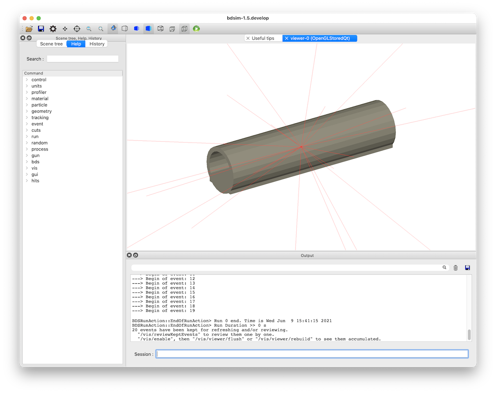
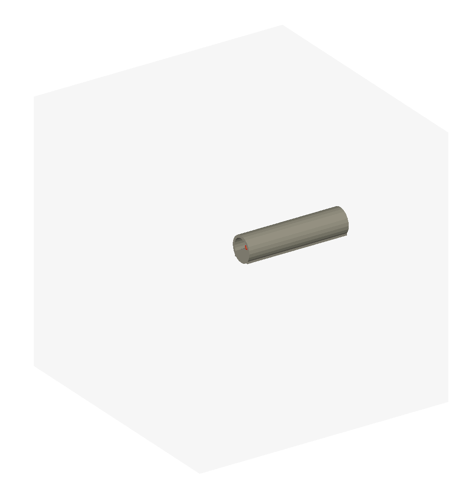
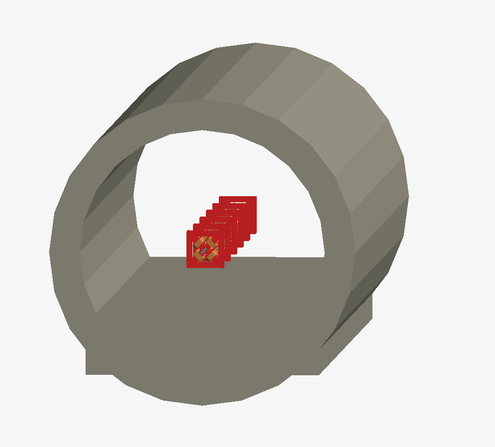
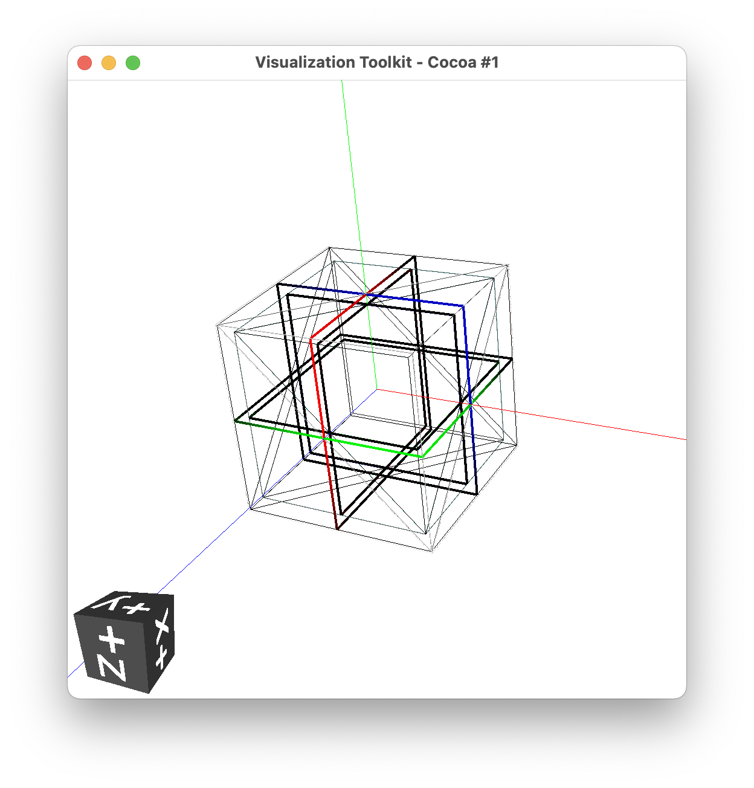
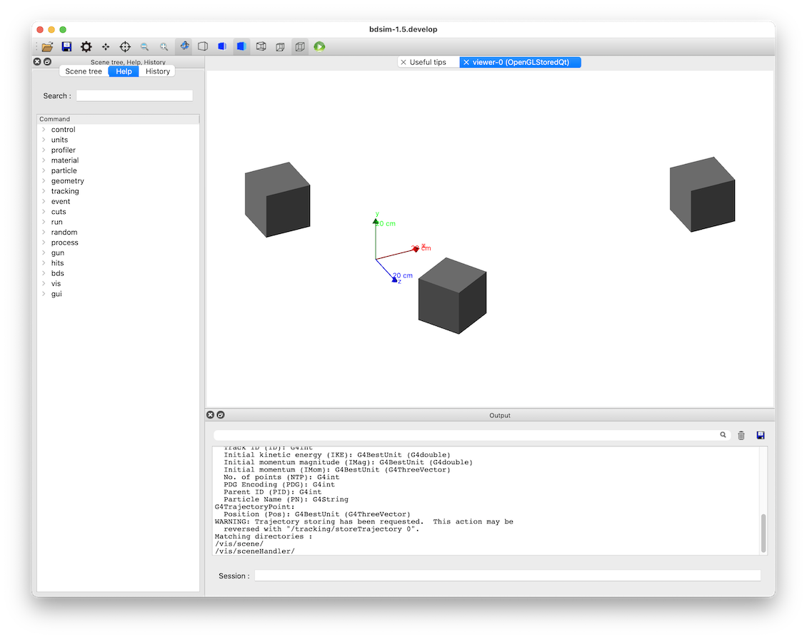
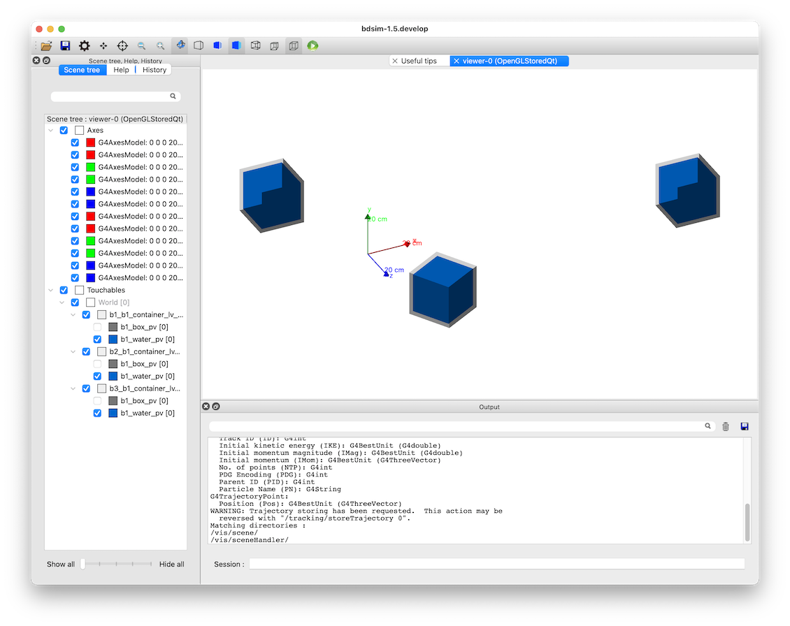
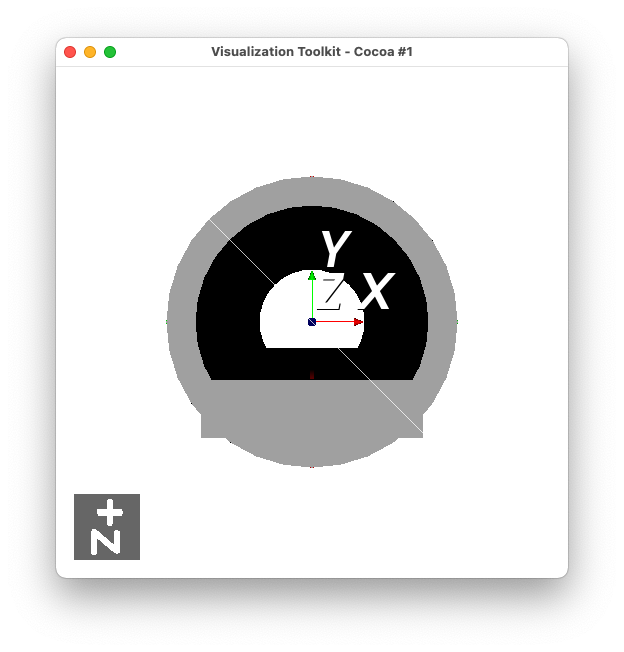
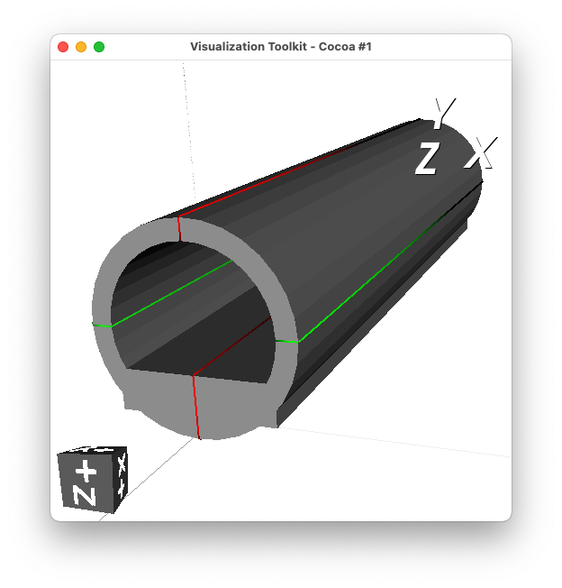
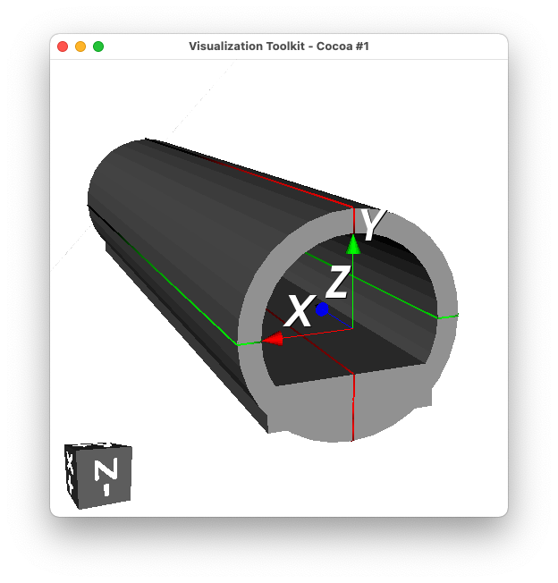

No Accelerator Model
====================

Topics Covered
--------------

* Placement of externally provided geometry
* External source for world geometry
* Shielding or tunnel placement

* Based on models in :code:`bdsim/examples/no-accelerator`.

Contents
--------

* `Preparation`_
* `Introduction`_
* `World Geometry File`_
* `World Geometry File - Tunnel`_
* `Placement Only Model`_
* `Tunnel Preparation`_

Preparation
-----------

* BDSIM has been compiled and installed - including GDML support.

  
Introduction
------------

BDSIM is intended to build a 3D Geant4 model of an accelerator.
It normally creates an empty box of air as the outermost volume
called the "world" (for the purpose of the simulation).

Conceptually though, we can use BDSIM as a simple interface
to Geant4 to try things out relatively quickly. In early versions
of BDSIM, it was forcibly required to build a beam line but this is
no longer the case and a model can be made with no geometry or
only other geometry.

Two common scenarios are presented:

1. Using an external file as the world and all contents
2. Placing one or more external files in a BDSIM-provided world

.. note:: If loading a complete piece of geometry as the world it will not
	  have any fields, nor the ability to attach a field map. Field maps
	  can only be used in accelerator components or `placements` of geometry.

World Geometry File
-------------------

BDSIM can build a model by simply loading a geometry file for the world and building
no beam line. This will be passive geometry only (i.e. no fields). An example is provided
in :code:`world.gmad` and contains: ::

  beam, particle="e-",
      energy=1*GeV,
      distrType="sphere",
      Z0=10*m;

  option, worldGeometryFile="gdml:tunnel.gdml";

A random direction beam is also illustrated as a point-like source of particles in the
middle of the tunnel geometry (which was placed at +10m from the origin and is 20m long).

  
World Geometry File - Tunnel
----------------------------

Although this example is about not using a beamline, sometimes we do also include one.

In the case where BDSIM builds a beam line, it first calculates the extent of the beam line
and any geometry placements and tunnel and creates an empty box big enough to encompass everything.
Then, all the geometry is finally placed in the world. However, it may be chosen to provide
a world volume yourself instead of the BDSIM-generated one.

We can use this as way to easily import tunnel or shielding geometry. A common task
is to place shielding or a concrete tunnel around a beam line. If we assume the tunnel
geometry is made in an external geometry package and provided as a GDML file, then we
would initially think we can simply "place" this in the world with the beam line. However,
we may cause overlaps that would result in bad tracking and volumes being missed.

.. note:: A convenient tool to prepare simple geometry in GDML is :code:`pyg4ometry` as
	  described in :ref:`python-geometry-preparation`. Scripts are provided here
	  as a demonstration.

Bad Example
***********

As an example of what can go wrong, we build a beam line then try to place an externally
provided tunnel geometry over it. Tunnel geometry as described in :ref:`tunnel-preparation`
is used - i.e. :code:`tunnel.gdml`. We build a beam line and then make a placement of this
geometry where we want the tunnel. Here is the model as contained in the file
:code:`bad-hierarchy.gmad`. ::

  d1: drift, l=1*m;
  qf1: quadrupole, l=0.4*m, k1=0.01;
  qd1: quadrupole, l=0.4*m, k1=-0.01;
  l1: line=(d1,qf1,d1,d1,qd1,d1);
  l2: line=(l1,l1,l1);
  use, l2;
  
  beam, particle="e-",
        energy=1*GeV;

  tunnelPlacement: placement, geometryFile="gdml:tunnel.gdml";

  option, checkOverlaps=1;

This is run in bdsim with: ::

  bdsim --file=bad-hierarchy.gmad --output=none

.. warning:: When using any geometry not generated by BDSIM, we should always explicitly
	     check for overlaps. This is done in 2 ways - with the :code:`option, checkOverlaps=1;`
	     and also interactively in the visualiser with :code:`/geometry/test/run`.

The geometry is shown below and at first glance seems ok. This is because the material
air and also the outermost volume of any geometry is made transparent for convenience.

	    
	    Apparently ok geometry, but actually overlapping. The air volume from the
	    tunnel.gdml file is shown in light grey.

	    Apparently ok geometry, but actually overlapping.
	     
The overlap checking from the option in the input gmad does not give any overlaps for the
author, which is wrong.  Running the test in the visualiser with the command
:code:`/geometry/test/run` shows many overlaps as expected. We expect each beam
line component to overlap with the container air box of the tunnel geometry. ::

  Running geometry overlaps check...
  Checking overlaps for volume d1_0_pv (G4Tubs) ... 
  -------- WWWW ------- G4Exception-START -------- WWWW -------
  *** G4Exception : GeomVol1002
       issued by : G4PVPlacement::CheckOverlaps()
       Overlap with volume already placed !
          Overlap is detected for volume d1_0_pv:0 (G4Tubs)
          with tunnelPlacmenet_tunnelPlacmenet_container_lv_0_pv:0 (G4Box) volume's
          local point (3.18274,-27.3172,251.806), overlapping by at least: 24.7482 m  
  NOTE: Reached maximum fixed number -1- of overlaps reports for this volume !
  *** This is just a warning message. ***
  -------- WWWW -------- G4Exception-END --------- WWWW -------

This model is wrong because the tunnel.gdml file is made of a 50 x 50 x 50m box of air with the
tunnel in it and this air box will overlap with the beam line as it placed at the same
level in the hierarchy as it even if it doesn't look like it and it looks like the tunnel
is fine. This is shown in a sketch of the hierarchy below:

.. figure:: bad-hierarchy.pdf
	    :width: 80%
	    :align: center

Pieces of geometry at the same level in the hierarchy should not spatially overlap.

Correct Example
***************

To correctly do this, we load the tunnel as the "world" volume for BDSIM. This means
BDSIM will use this and place the beam line *inside* it. We just have to ensure that
the beam line will not touch the concrete part of the tunnel. This is done by design
and by the placement of the beam line. (See :ref:`beamline-offset` for how to displace
the beam line from 0,0,0 and in direction 0,0,1). The example is provided in
:code:`world-tunnel.gmad` and contains: ::

  d1: drift, l=1*m;
  qf1: quadrupole, l=0.4*m, k1=0.01;
  qd1: quadrupole, l=0.4*m, k1=-0.01;
  l1: line=(d1,qf1,d1,d1,qd1,d1);
  l2: line=(l1,l1,l1);
  use, l2;
  
  beam, particle="e-",
        energy=1*GeV;

  option, worldGeometryFile="gdml:tunnel.gdml";

  option, checkOverlaps=1;

We check overlaps in both ways (the option and interactively) and we find no
overlaps as expected! The model is therefore safe to generate physics results from.

.. figure:: world-tunnel.png
	    :width: 100%
	    :align: center

	    Similar geometry but with the tunnel used as a world volume

Placement Only Model
--------------------

We can make placements of geometry and let BDSIM generate a world box sufficiently big
to encompass each placement. This is shown in the example file :code:`placements-only.gmad`,
which contains: ::

  beam, particle="proton",
        kineticEnergy=200*MeV,
        distrType="sphere";

  b1: placement, geometryFile="gdml:boxofwater.gdml", x=1*m, y=0.6*m, z=1*m;
  b2: placement, geometryFile="gdml:boxofwater.gdml", x=-0.3*m, y=0.2*m, z=-0.3*m;
  
  b3: placement, geometryFile="gdml:boxofwater.gdml", x=0.3*m, y=-0.2*m, z=0.1*m,
      axisAngle=1,
      angle=-pi/3,
      axisY=1;

This places a piece of geometry 3 times in different places. BDSIM generates a world
volume of air to contain them. The geometry is made in the script :code:`makeboxofwater.py`
using pyg4ometry and consists of a 20cm steel width, 1cm thick stainless steel box with
water inside. A container volume of air (20.2cm wide) is used to contain everything.

	    Visualisation of the :code:`makeboxofwater.py` script to create the geometry
	    as shown in the VTK visualiser of pyg4ometry.

	    Visualisation in BDSIM of 3x placements of the same geometry.

	    Visualisation in BDSIM of 3x placements of the same geometry with the
	    steel box made transparent and a set of unit vector axes added with the
	    command :code:`/vis/scene/add/axes 0 0 0 20 cm`.

.. _tunnel-preparation:	    

Tunnel Preparation
------------------

A simple of piece of geometry is created to show a (rough) tunnel. It is provided in the
script :code:`bdsim/examples/no-accelerator/maketunnel.py` and uses pyg4ometry.  A few points
of interest:

* we check overlaps with the command :code:`containerLV.checkOverlaps(recursive=True)` and
  this gives the following print out: ::

    LogicalVolume.checkOverlaps> full daughter-mother intersection test tunnel_pv
    LogicalVolume.checkOverlaps> full daughter-mother coplanar test tunnel_pv

  which means everything is ok - no overlaps detected.

* the tunnel clearly has the floor piece sticking out of the cylinder - this is fine
  and just for the sake of the simplest geometry to illustrate code features.

The Python script can be run interactively in ipython or just on the terminal: ::

  ipython
  > import maketunnel
  > maketunnel.MakeTunnel()

or: ::

  python maketunnel.py

It will produce an output file called :code:`tunnel.gdml` that is used in this example.

