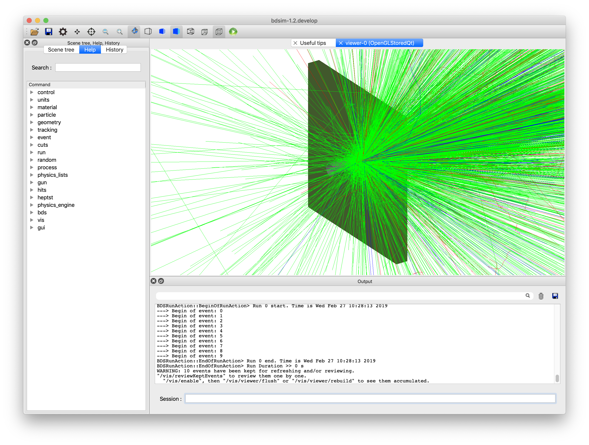
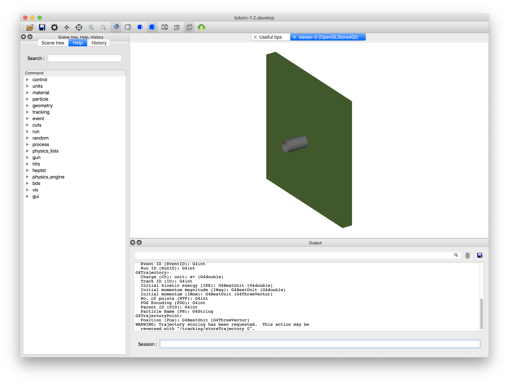
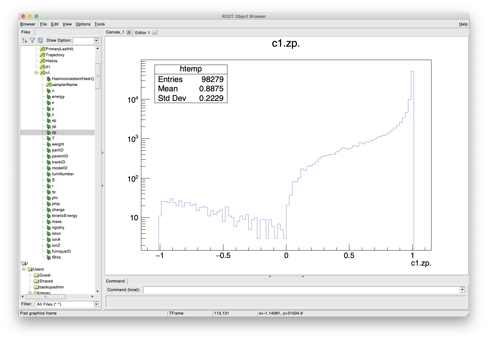

.. _example-worked-target:

Analysis of Thin Target Products
================================

Topics Covered
--------------

* Write a simple model from scratch
* Generate data
* Analyse beam loss fraction
* Make particle spectra
* Use bdsim, rebdsim, pybdsim

* Based on :code:`bdsim/examples/target/target-p-cu.gmad`
  

  
Contents
--------

* `Preparation`_
* `Model Description`_
* `Generating Data`_
* `Questions Answered`_
  
Preparation
-----------

* BDSIM has been compiled and installed.
* The (DY)LD_LIBRARY_PATH and ROOT_INCLUDE_PATH environmental variables are set as
  described in :ref:`output-analysis-setup`.
* ROOT can be imported in Python
* `pybdsim` has been installed.

Model Description
-----------------

This example shows a high energy (6.5 TeV) proton beam hitting a
5cm copper target. This produces a large number of secondary particles.
This examples illustrates the analysis and understanding of the products
in an invisible 'sampler' plane after the target.

The model consists of a small 1 cm vacuum pipe followed by a target. The
solid box of target material is created using the `target` component.
The width of the target is the default `horizontalWidth` for all elements,
which is 0.5 m. See :ref:`options-common`. The model looks like:

The input files for BDSIM can be found in :code:`<bdsim>/examples/target/`.

* target-p-cu.gmad - model discussed here
* target-p-cu-sampler-extras.gmad - same model but with extra sampler output turned on.
* target-ion-w.gmad - tungsten target and 1 TeV carbon ion beam.
* target-ion-w-sampler-extras.gmad - similar but with extra sampler output.

The model was prepared by hand as it is quite simple. The input syntax is included
below: ::

 d1: drift, l=10*cm;
 t1: target, l=5*cm, material="copper";
 l1: line=(d1,t1);
 use, l1;

 sample, all;

 beam, particle="proton",
       energy=6.5*TeV;

 option, physicsList="g4FTFP_BERT", 
         defaultRangeCut=1*cm;

 option, ngenerate=5,
         seed=123,
         elossHistoBinWidth=1*cm;

First we define the beam line elements we want and then the line (sequence) of the them.
The :code:`use` command specifies which line to use. :code:`sample, all;` tells BDSIM
to put a `sampler` after each element. A sampler is an invisible 1 nm long plane that is
5 m wide by default that records the passage of any particle in any direction through it
(so both forwards and backwards). We then specify a beam, the physics processes to use
and some options.

Here we use a Geant4 reference physics list :code:`g4FTFP_BERT` that is a standard high
energy physics list suitable for LHC-like applications. See :ref:`physics-geant4-lists`.

We choose a default range cut to speed things up a little for the purposes of the example.
The range cut is roughly a distance a secondary particle would have to travel and survive
in that material. If it wouldn't travel this distance, it isn't produced and the energy
is recorded at that location. This therefore approximately corresponds to an energy cut
per particle species per material. This is much more accurate than a general energy cut,
but care should be taken not to choose a length scale longer than the typical element
length as you may see discontinuities in energy deposition close to boundaries. The default
in Geant4 is 1 mm that roughly corresponds to ~keV energies for most particles.

Specifying a seed allows the user to reproduce the simulation exactly that's demonstrated
here.

The :code:`elossHistoBinWidth` option specifies the binning along the beam line for the
default energy deposition ("eloss") histogram that's created as BDSIM runs. The default
is 1 m as BDSIM is typically used for large accelerators. In this case, our whole model
would fit in one bin, which wouldn't be so interesting. Therefore, we specify a smaller
bin width.  See :ref:`options-common`.

Generating Data
---------------

Here, we generate a sample of data to be analysed. Run BDSIM with the input model and
specify a number of events (i.e. number of primary beam particles) to simulate. We also
specify what we want the output data file to be called. ::

  bdsim --file=target-p-cu.gmad --outfile=data1 --batch --ngenerate=200

The :code:`--batch` option means that no visualiser is used and the events are simulated
and BDSIM finishes.

This creates an output ROOT file called `data1.root`. On the developer's laptop, this
took approximately 35 seconds to run in total.

The model can also be run interactively, but given the large number of secondary particles
it is advisable to run a low number of events e.g. 1 to 10. In this case you would run
BDSIM as follows: ::

  bdsim --file=target-p-cu.gmad --outfile=data1

Once the visualiser starts, enter the following command in the session terminal prompt
at the bottom. (see :ref:`running-interactively`). ::

  /run/beamOn 5

A visualisation of 10 events can be seen at the beginning of this example.

Some of the terminal print out (which is kept to be as minimal as possible in BDSIM) is
worth noting. The beam print out shows the kinematics of the beam particle chosen. ::

  Design particle properties: 
  Particle:       "proton"
  Mass:            0.938272 GeV
  Charge:          1 e
  Total Energy:    6500 GeV
  Kinetic Energy:  6499.06 GeV
  Momentum:        6500 GeV
  Gamma:           6927.63
  Beta:            1
  Rigidity (Brho): 21681.7 T*m

There is then a large print out of physics processes from Geant4. However, at the end
a "Table of Registered Couples" is of interest. This indicates the range cuts for basic
particle types and the corresponding energies calculated. These energies do not vary
linearly with range. We can use this as an idea of the approximate energy scale. ::

  ========= Table of registered couples ==============================

  Index : 0     used in the geometry : Yes
   Material : G4_AIR
   Range cuts        :  gamma  3 cm     e-  3 cm     e+  3 cm  proton 3 cm 
   Energy thresholds :  gamma  990 eV     e-  43.5254 keV    e+  43.2339 keV proton 3 MeV
   Region(s) which use this couple : 
      DefaultRegionForTheWorld
 
  Index : 1     used in the geometry : Yes
   Material : G4_Galactic
   Range cuts        :  gamma  3 cm     e-  3 cm     e+  3 cm  proton 3 cm 
   Energy thresholds :  gamma  990 eV     e-  990 eV     e+  990 eV  proton 3 MeV
   Region(s) which use this couple : 
      DefaultRegionForTheWorld 
 
  Index : 2     used in the geometry : Yes
   Material : vacuum
   Range cuts        :  gamma  3 cm     e-  3 cm     e+  3 cm  proton 3 cm 
   Energy thresholds :  gamma  990 eV     e-  990 eV     e+  990 eV  proton 3 MeV
   Region(s) which use this couple : 
      DefaultRegionForTheWorld
 
  Index : 3     used in the geometry : Yes
   Material : stainlesssteel
   Range cuts        :  gamma  3 cm     e-  3 cm     e+  3 cm  proton 3 cm 
   Energy thresholds :  gamma  109.289 keV    e-  46.8866 MeV    e+  43.5457 MeV proton 3 MeV
   Region(s) which use this couple : 
      DefaultRegionForTheWorld
 
  Index : 4     used in the geometry : Yes
   Material : G4_Cu
   Range cuts        :  gamma  3 cm     e-  3 cm     e+  3 cm  proton 3 cm 
   Energy thresholds :  gamma  128.416 keV    e-  52.2089 MeV    e+  48.4888 MeV proton 3 MeV
   Region(s) which use this couple : 
      DefaultRegionForTheWorld
 
  ====================================================================

Questions Answered
------------------

 * `Question 1`_ What fraction of the beam makes it through the target?
 * `Question 2`_ What spectrum of particles comes out after the target?
 * `Question 3`_ How much energy is reflected backwards from the target?

Question 1
**********

* What fraction of the beam makes it through the target?

Here we want to know the fraction of primary particles after the target. To do this we look
at the data recorded in the sampler after the target. The target was called "t1" in the
input so there will be a sampler structure in the Event tree of the output called "t1".

To get this answer we can make a histogram using rebdsim. This may seem an unintuitive
approach but it includes all the correct event averaging and uncertainty calculations.

To analyse data and make histograms using rebdsim we use an analysis configuration text
file. We start, as always, by copying an example from BDSIM that can be found in: ::

  bdsim/examples/features/analysis/perEntryHistograms/analysisConfig.txt

We histogram any value of any particle recorded in the sampler in a 1 bin histogram
with the filter ("selection") that only primary particles are filled. The default
histogramming is per event, i.e. normalised to the number of events. Below are two
possible ways to achieve the same answer. ::

  Histogram1D   Event. Q1PrimaryFraction   {2}  {-0.5:1.5} t1.parentID==0 t1.parentID==0
  Histogram1D   Event. Q1PrimaryFraction2  {1}  {-2:2}     t1.x           t1.parentID==0

This file for this example is provided in :code:`bdsim/examples/target/analysisConfig.txt`. We
run rebdsim with the following command: ::

  rebdsim analysisConfig.txt data1.root data1-analysis.root

This produces an output ROOT file called `data1-analysis.root` that contains the desired
histograms.

The first histograms a Boolean of whether the parentID (the track ID of the particle that
created that one) is 0 or not. Only primary particles have :code:`parentID==0` as they have
no parent. This will happen for every particle recorded in the sampler including secondaries.
We therefore add a "selection" (a filter) to only bin the particles where their parentID is 0.
The Boolean will become a number when binned so it can either be a 0 or a 1. We choose histogram
bins from 0.5 to 1.5 with two bins so that the centres are inside the bins.

This will produce a histogram with two bins centred on 0 and 1. The value of the second bin
centred on 1 is the answer.

A second way is to histogram any one coordinate and apply the same filter of primaries only.
In the above code we declare a 1 bin 1D histogram from -2 to +2 m to cover all values of x.
The histogram contains one bin with the mean number of primaries per event that go through
the sampler.

We can extract this number easily with pybdsim. In iPython (or Python): ::

  >>> import pybdsim
  >>> d = pybdsim.Data.Load("data1-analysis.root")
  >>> d.histogramspy
  {'Event/MergedHistograms/ElossHisto': <pybdsim.Data.TH1 at 0x129b37ad0>,
  'Event/MergedHistograms/ElossPEHisto': <pybdsim.Data.TH1 at 0x129b37a10>,
  'Event/MergedHistograms/PhitsHisto': <pybdsim.Data.TH1 at 0x129b37a50>,
  'Event/MergedHistograms/PhitsPEHisto': <pybdsim.Data.TH1 at 0x129b2a890>,
  'Event/MergedHistograms/PlossHisto': <pybdsim.Data.TH1 at 0x129b37990>,
  'Event/MergedHistograms/PlossPEHisto': <pybdsim.Data.TH1 at 0x129b37890>,
  'Event/PerEntryHistograms/Q1PrimaryFraction': <pybdsim.Data.TH1 at 0x129b25790>,
  'Event/PerEntryHistograms/Q2PrimaryFraction2': <pybdsim.Data.TH1 at 0x129ac0410>}

  >>> q1ha = d.histogramspy['Event/PerEntryHistograms/Q1PrimaryFraction']
  >>> type(q1ha)
  <pybdsim.Data.TH1 at 0x129b25790>
  >>> q1ha. <tab>
              q1ha.contents   q1ha.hist       q1ha.title      q1ha.xlabel     q1ha.xunderflow 
              q1ha.entries    q1ha.name       q1ha.xcentres   q1ha.xlowedge   q1ha.xwidths    
              q1ha.errors     q1ha.nbinsx     q1ha.xhighedge  q1ha.xoverflow  q1ha.ylabel
  >>> q1ha.contents
  array([0.   , 0.755])
  >>> q1ha.errors
  array([0.        , 0.03048807])
  >>> q1hb = d.histogramspy['Event/PerEntryHistograms/Q1PrimaryFraction2']
  >>> q1hb.contents
  array([0.755])
  >>> q1ha.errors
  array([0.03048807])

So here we see two ways to find the answer of :math:`0.755 \pm 0.031` of the proton beam
goes through remaining an intact proton. Note, this doesn't say whether it interacted or
not, but just whether the primary made it through intact. If the proton had disintegrated
then it would not be a primary anymore.

Question 2
**********

* What spectrum of particles comes out after the target?

The ideal plot here would be histograms of different particle species for different
energies, i.e. a line for each particle type. To do this, we again histogram the
particles recorded in the sampler after the target. We histogram the energy for
each particle species. The following analysis is used. ::

  Histogram1D  Event.  Q2All               {130} {0:6500}  t1.energy  t1.zp>0
  Histogram1D  Event.  Q2ProtonsPrimary    {130} {0:6500}  t1.energy  t1.zp>0&&t1.partID==2212&&t1.parentID==0
  Histogram1D  Event.  Q2ProtonsSecondary  {130} {0:6500}  t1.energy  t1.zp>0&&t1.partID==2212&&t1.parentID>0
  Histogram1D  Event.  Q2PiPlusMinus       {130} {0:6500}  t1.energy  t1.zp>0&&abs(t1.partID)==211
  Histogram1D  Event.  Q2PiZero            {130} {0:6500}  t1.energy  t1.zp>0&&t1.partID==111
  Histogram1D  Event.  Q2Electrons         {130} {0:6500}  t1.energy  t1.zp>0&&t1.partID==11
  Histogram1D  Event.  Q2Positrons         {130} {0:6500}  t1.energy  t1.zp>0&&t1.partID==-11
  Histogram1D  Event.  Q2Gammas            {130} {0:6500}  t1.energy  t1.zp>0&&t1.partID==22
  Histogram1D  Event.  Q2Muons             {130} {0:6500}  t1.energy  t1.zp>0&&abs(t1.partID)==13

The particle IDs are the Particle Data Group IDs that can be found online at
`<https://pdg.lbl.gov/2021/web/viewer.html?file=%2F2021/reviews/rpp2020-rev-monte-carlo-numbering.pdf>`_.

..
    _Update the link in output also

After the target there is air as this is the default `worldMaterial` (see
:ref:`options-common`). Potentially, a (likely secondary) particle could
bounce back off of the air and go through the sampler before hitting the
target again. We could change to the world material option to vacuum
(:code:`option, worldMaterial="G4_Galactic";`) to avoid this or add the
filter of the z component of the momentum is
positive - i.e. forwards travelling. This is why we have :code:`t1.zp>0`
in all of the selections above. We can quickly check if there are any backwards
going particles at all by inspecting the data in a ROOT TBrowser (see
:ref:`basic-data-inspection`). Below is a screenshot of ROOT.

	    Component of unit momentum recorded in sampler after target. Positive equates
	    to forward going and negative to backwards going. Total number of particles
	    across all particles in all events in the data.

There are indeed some, although only a small fraction. This is for all particles across
all events. We therefore use the filter to get the correct answer.
  
This file for this example is provided in :code:`bdsim/examples/target/analysisConfig.txt`. We
run rebdsim with the following command: ::

  rebdsim analysisConfig.txt data1.root data1-analysis.root

We can then load and plot the data in iPython (or Python) using pybdsim. Below is the
example Python code used to generate the plots here and this is included with this
example as :code:`plotSpectra.py`. ::

  import matplotlib.pyplot as _plt
  import pybdsim
 
  def PlotSpectra(filename, outputfilename='spectra', xlog=False, ylog=True):
      d = pybdsim.Data.Load(filename) 
 
      keyLabels = [("All",              "All"),
                   ("ProtonsPrimary",   "p (primary)"),
                   ("ProtonsSecondary", "p (secondary)"),
                   ("Neutrons",         "n"),
                   ("PiPlusMinus",      "$\pi^{\pm}$"),
                   ("PiZero",           "$\pi^{0}$"),
                   ("Electrons",        "e$^{-}$"),
                   ("Positrons",        "e$^{+}$"),
                   ("Gammas",           "$\gamma$"),
                   ("Muons",            "$\mu^{\pm}$")]

      logString = "Log" if xlog else ""
      histograms = [ d.histogramspy["Event/PerEntryHistograms/Q2"+logString+keyLabel[0] ] for keyLabel in keyLabels ]
      labels     = [kl[1] for kl in keyLabels]
      xlabel     = "Total Particle Energy (GeV)"
      ylabel     = "Number / Proton / "
      binWidth   = d.histogramspy["Event/PerEntryHistograms/Q2"+logString+"All"].xwidths[0]
      ylabel     += "dlog(E) GeV" if xlog else str(round(binWidth,0)) + " GeV"

      pybdsim.Plot.Histogram1DMultiple(histograms,
                                       labels,
                                       log=ylog,
                                       xlabel=xlabel,
                                       ylabel=ylabel,
                                       legendKwargs={'fontsize':'small'})
    
      if xlog:
          _plt.xlim(1e1,1e4)
          _plt.xscale('log')
      else:
          _plt.xlim(-10,6600)
        
      if not outputfilename.endswith(".pdf"):
          outputfilename += ".pdf"
      _plt.savefig(outputfilename)

We can use this as follows: ::

  >>> import plotSpectra
  >>> plotSpectra.PlotSpectra('data1-analysis.root')

This produces the following plot.

.. figure:: target-q2-spectra.pdf
	    :width: 100%
	    :align: center

	    Spectra of particles for 200 events through a 5cm target of copper.

This doesn't look so informative at first glance. We can generate more statistics but we can
also make a logarithmically binned plot. We add more lines to the analysisConfig.txt for
rebdsim. See :ref:`output-analysis-configuration-file` for more details. Here are the lines
we add: ::

  Histogram1DLog  Event.  Q2LogAll              {100} {1:3.82}  t1.energy  t1.zp>0
  Histogram1DLog  Event.  Q2LogProtonsPrimary   {100} {1:3.82}  t1.energy  t1.zp>0&&t1.partID==2212&&t1.parentID==0
  Histogram1DLog  Event.  Q2LogProtonsSecondary {100} {1:3.82}  t1.energy  t1.zp>0&&t1.partID==2212&&t1.parentID>0
  Histogram1DLog  Event.  Q2LogNeutrons         {100} {1:3.82}  t1.energy  t1.zp>0&&t1.partID==2112
  Histogram1DLog  Event.  Q2LogPiPlusMinus      {100} {1:3.82}  t1.energy  t1.zp>0&&abs(t1.partID)==211
  Histogram1DLog  Event.  Q2LogPiZero           {100} {1:3.82}  t1.energy  t1.zp>0&&t1.partID==111
  Histogram1DLog  Event.  Q2LogElectrons        {100} {1:3.82}  t1.energy  t1.zp>0&&t1.partID==11
  Histogram1DLog  Event.  Q2LogPositrons        {100} {1:3.82}  t1.energy  t1.zp>0&&t1.partID==-11
  Histogram1DLog  Event.  Q2LogGammas           {100} {1:3.82}  t1.energy  t1.zp>0&&t1.partID==22
  Histogram1DLog  Event.  Q2LogMuons            {100} {1:3.82}  t1.energy  t1.zp>0&&abs(t1.partID)==13

We use the above plotting script in Python to make a logarithmically binned plot: ::

  >>> import plotSpectra
  >>> plotSpectra.PlotSpectra('data1-analysis.root', xlog=True)

This produces the following figure.

.. figure:: target-q2-spectra-log.pdf
	    :width: 100%
	    :align: center

	    Spectra of particles for 200 events through a 5cm target of copper.

This is more informative but still we are lacking statistics. Given the first generation
of data took less than a minute, we can run more, reanalyse the new data using rebdsim
and make new plots. Below are such plots for 10000 events. On the developer's computer this
took 35 minutes to run.

.. figure:: target-q2-spectra-10k.pdf
	    :width: 100%
	    :align: center

	    Spectra of particles for 10000 events through a 5cm target of copper.

.. figure:: target-q2-spectra-10k-log.pdf
	    :width: 100%
	    :align: center

	    Spectra of particles for 10000 events through a 5cm target of copper.

.. note:: The more histograms we add and the more filters we add, the slower the analysis will
	  be. The analysis is actually very efficient for what it does. If the analysis
	  becomes too long running, consider generating separate data files and analysing
	  them separately, then combining the resultant histograms. For further details,
	  see :ref:`output-analysis-scaling-up` and :ref:`output-analysis-efficiency`.

This running time could be easily reduced by introducing a kinetic energy cut. We must
acknowledge though that introduces some level of inaccuracy as we artificially stop
particles below this kinetic energy so the ultimate energy deposition location will be
different.  Given the very high initial energy, we could choose a cut of 1 GeV by adding
the following to the input GMAD file: ::

  option, minimumKineticEnergy=1*GeV;

This reduces the run time on the developer's computer for 10000 events from 35 minutes
to 5 minutes.

	    
Question 3
**********

* How much energy is reflected backwards from the target?

Our sampler attached to the target is actually after the target. Samplers are only
ever after an element, so we prepared the model with a drift on the front. If
we really didn't want to see the effect of scattering or energy deposition in the
beam pipe, we could set the :code:`apertureType="circularvacuum"` and
:code:`vacuumMaterial="air"` to set the material to air so it's consistent with
the surroundings. However, here we don't mind. The :code:`sample, all;` command
means the drift will have a sampler at the end of it, so before the target. The
sampler name will be the name of the drift, "d1".

We therefore bin any variable on this sampler with the selection of backwards going
and weight by the energy. The histogram definition is as follows: ::

  Histogram1D Event. Q3BackwardsEnergy {1} {-2:2} d1.x  d1.energy*(d1.zp<0)

The weighting by energy means that each entry will be filled with the energy instead
of the count 1. The Boolean filter becomes a number in ROOT and is either 1 or 0.

This file for this example is provided in :code:`bdsim/examples/target/analysisConfig.txt`. We
run rebdsim with the following command: ::

  rebdsim analysisConfig.txt data1.root data1-analysis.root

We inspect the histogram in pybdsim to get the value of the one bin.  In iPython: ::

  >>> import pybdsim
  >>> d = pybdsim.Data.Load("data1-analysis.root")
  >>> h = d.histogramspy['Event/PerEntryHistograms/Q3BackwardsEnergy']
  >>> h.contents
  array([32.364])
  >>> h.errors
  array([1.44402409])

Therefore, we see that there is on average :math:`32.364 \pm 1.444` GeV reflected backwards
per event, i.e. per 6.5 TeV proton hitting the target. This value was based on a sample of
3000 events.
  
