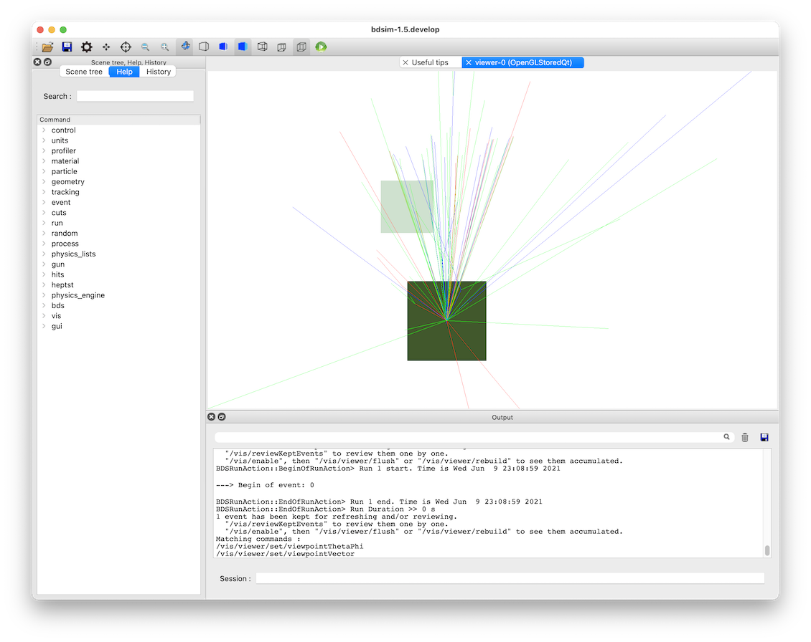
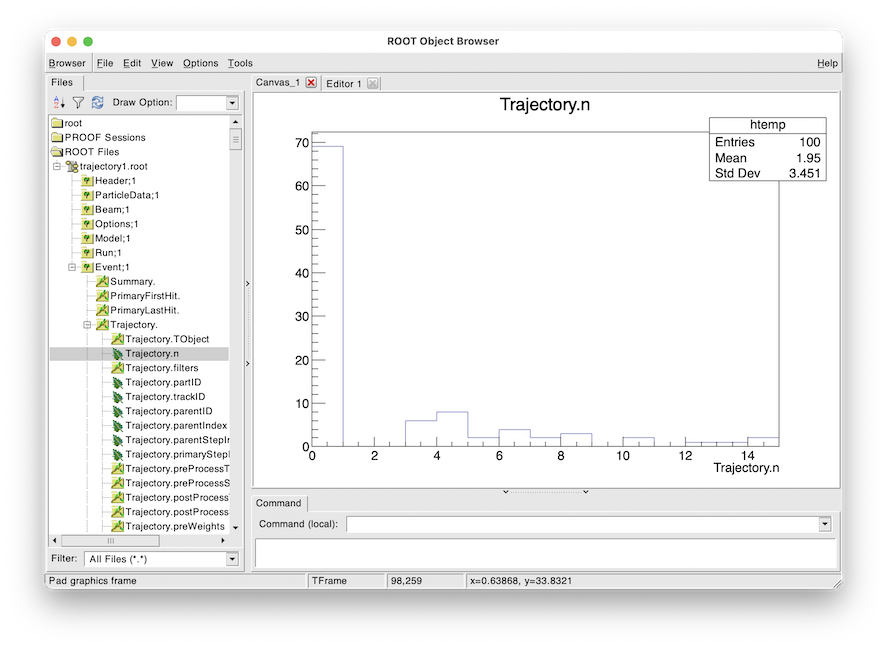

.. _worked-example-trajectory-generation:

Trajectory Generation
=====================

Topics Covered
--------------

* Trajectories
* Trajectory storage options
* Trajectory data structures
* Visualising samplers  

* Based on several models in :code:`bdsim/examples/atf2`

Contents
--------

* `Preparation`_
* `Key Concepts`_
* `Motivation`_
* `Generating Trajectories`_
* `Disentangling`_
* `Running the Model`_
* `Number of Trajectories`_

  
Preparation
-----------

* BDSIM has been compiled and installed.
* The (DY)LD_LIBRARY_PATH and ROOT_INCLUDE_PATH environmental variables are set as
  described in :ref:`output-analysis-setup`.
* ROOT can be imported in Python
* `pymadx` and `pybdsim` have been installed.

.. note:: This example model will only work with Geant4.10.4 and upwards.

Key Concepts
------------

* A "trajectory" is a record of a particle track through a model. It contains information
  about each step the particle took and there one trajectory is for one particle.
* A "primary" particle is one that started at the beginning of an event. There may be more
  than one, but typically BDSIM starts with one particle per event.
* A "secondary" particle is any subsequent particle created in the simulation, no matter
  what generation it is. e.g. a primary proton creates a pion that decays and creates a
  muon, which decays and creates a neutrino. All but the proton are considered "secondary".
* In a Geant4 model we only see the point before and after a step. If a particle moves in a
  curved path in a field, we only "see" this shape if we take many small steps. We only know
  the exact position and therefore path at the start and end of each step. Typically we draw
  straight lines between these and ignore the true curved path - ok if we take small steps.
* Each particle simulated is a "track" in Geant4 terminology. Each track has an integer
  identification number - track ID - associated with it. The "parent ID" is the track ID
  of the particle that created the one in questions.
* The first track in the simulation has a track ID of 1.
* A parent ID of 0 intrinsically means the track had no parent and is therefore a primary particle.
* Particle types are identified by an integer called a "PDG ID". This follows the naming convention
  of the particle data group. If it is negative, it is the anti-matter counterpart of that particle,
  not the negatively charged one. This can be found online (worth downloading and keeping a copy)
  at https://pdg.lbl.gov/2021/web/viewer.html?file=%2F2021/reviews/rpp2020-rev-monte-carlo-numbering.pdf

Motivation
----------

A trajectory contains the full coordinates as well as some other information for every step
of a particle in a model. Given a single particle may take many many steps and many many particles
can be created, it becomes clear that storing trajectories can create a very large amount of
information. It is for this reason that we do not store trajectories by default, nor do most
Monte Carlo radiation transport programs (i.e. Geant4 models). In BDSIM we choose summary
information to record that is the most useful for the purpose of an accelerator model.

On occasion, the exact information required may require more specific information. In this
case, storing a select set of trajectories may be the most useful. Some example questions
we may seek to answer with trajectories:

1. What fraction of particle X (e.g. neutrinos) come from particle A (e.g. pions) versus particle B (e.g. muons).
2. Where are particle X (e.g. muons) produced and by what process?
3. Where do particles created in one specific place end up being absorbed?

.. note:: It is seriously worth considering whether the data you need is already provided
	  in samplers, primary first / last hit etc. Remember the data is per-event so we
	  can filter and reject events and use information from multiple branches. The reason
	  to think twice about trajectories is the sheer amount of data it creates.

Generating Trajectories
-----------------------

Trajectory output is a 2 step process. First we choose filters by which to select trajectories
from an event we wish to store. Secondly, we choose some options about what information to store
for each of these selected trajectories. The options that control these are described in

* :ref:`options-trajectory-filtering`
* :ref:`options-trajectory-storage`

Here we will use an example model of protons on a thin target and look at the products
coming out and their decay. This model is provided in :code:`bdsim/examples/trajectories/proton-target.gmad`.
::

  c1: rcol, l=10*cm, material="Cu";
  l1: line=(c1);
  use, l1;

  detector: samplerplacement, z=10*m, x=0.3*m,
            apertureType="rectangular", aper1=20*cm, aper2=20*cm,
	    axisAngle=1, angle=tan(0.05), axisY=1;

  beam, particle="proton",
        energy=500*GeV;

  option, physicsList="g4FTFP_BERT",
          minimumKineticEnergy=1*GeV;

  pplus:  xsecBias, particle="pi+", proc="Decay", xsecfact=1000, flag=1;
  pminus: xsecBias, particle="pi-", proc="Decay", xsecfact=1000, flag=1;
  bplus:  xsecBias, particle="mu+", proc="Decay", xsecfact=1000, flag=1;
  bminus: xsecBias, particle="mu-", proc="Decay", xsecfact=1000, flag=1;

  option, biasForWorldVolume="bplus bminus pplus pminus";

  option, storeMinimalData=1,
          storeSamplerKineticEnergy=1;
	
  option, storeTrajectories=1,
	  storeTrajectoryParticleID="13 -13 14 -14",
	  storeTrajectorySamplerID="detector",
	  trajectoryFilterLogicAND=1;

  option, trajectoryConnect=1;

Generally, this fires 500 GeV protons at a 10cm thick copper target with the standard high
energy physics list including electromagnetic, hadronic and decay processes. A minimum
kinetic energy cut is introduced to artificially kill particles below 1 GeV to speed up the
simulation. Cross-section biasing is used to increase the likelihood of decay by a factor of
100 for all muons and pions in the world air volume (i.e. not in the copper block). Most of the output
is turned off but the trajectory information is turned on.

.. note:: This biasing is likely far too strong for a practical application, which could be seen
	  by a larger simulation and looking at the weights spectrum and observing very large or
	  small weights. However, it vastly improves the efficiency of this simulation here so
	  we use it knowing this.

More details of various options can be found in:

* :ref:`physics-process-options`
* :ref:`physics-biasing`

Several trajectory-specific options are used.

* :code:`storeTrajectories=1`

This turns on trajectory storage, which is off by default. With only this option, the trajectories
of the primary particles will be stored for each event.

* :code:`storeTrajectoryParticleID="13 -13 14 -14"`

Then we choose to only store trajectories for the particles with PDG ID 13, -13, 14 and -14.
These are both negative and positive muons and their respective neutrinos. So now, these as
well as the primaries will be stored.

* :code:`storeTrajectorySamplerID="detector"`

Then we include the storage of any tracks hitting the sampler plane with the name "detector". In
our input, this is defined as a 40x40cm plan 10m away from the origin and slightly offset with a
small angle "looking" back at the origin.

Here, it is worth noting that the logic to combine these filters is "OR" logic. So, a trajectory
will be stored if it matches the particle ID filter OR it matches the sampler filter OR it's a
primary trajectory. This is ok, but a bit too much.

* :code:`trajectoryFilterLogicAND=1`

Lastly, we choose AND logic instead of the default inclusive OR logic. This means, for a trajectory
to be store it must fulfil each filter. i.e. pass the particle ID filter AND the sampler filter. This
therefore reduces the number of trajectories stored to only ones we're interested in in this case.

A further option, which is not a filter, but an extra command option, is :code:`trajectoryConnect=1`.
This instructs BDSIM to store extra trajectories after applying the filters. After the filters, for
each trajectory that is chosen to be stored, it's parent trajectories will be stored that lead it
back to the primary. So for example, if a muon was selected for storage, and it came from a pion,
which came from the primary proton, the muon, pion and proton trajectories would be stored. When the
pion decayed to produce a muon it would have produced a neutrino also. However, as this is not directly
linked from the muon of choice to the primary, it is not stored.

Disentangling
-------------

With the described model we expect to have usually 0 or more than one trajectory stored for each event.
We might expect for a given event a muon, pion and proton. We may have more. When we analyse the
trajectories, we can filter by the particle type, but we may also want to know why that particular
trajectory was stored. Was it a muon that hit the sampler or was it a muon that decayed before the
sampler and was only stored because it was the parent of an interesting neutrino (PDG +-14) that
hit the sampler?

To answer this question, we store a bit set for each trajectory that tells us which filters that
trajectory matched. A bit set is a list (or 'set') of bits (1s or 0s). A 1 indicates that it matched
that filter and a 0 that it didn't. The position in the bit set corresponds to a specific filter
(for all trajectories - i.e. this is the same for a specific version of BDSIM). The variable in the
data is: ::

  Event.Trajectory.filters

How do we know what bits correspond to which filters? In the header of each output file,
there is a list of filter names in order that match the bit set. This variable is: ::

  Header.trajectoryFilters

We can look at this using pybdsim or ROOT. In ROOT: ::

  root -l myoutputfile.root
  Attaching file t5.root as _file0...
  > TTree* header = (TTree*)_file0->Get("Header")
  > header->Scan("trajectoryFilters","","colsize=20")
  **********************************************
  *    Row   * Instance *    trajectoryFilters *
  **********************************************
  *        0 *        0 *              primary *
  *        0 *        1 *                depth *
  *        0 *        2 *             particle *
  *        0 *        3 *      energyThreshold *
  *        0 *        4 *              sampler *
  *        0 *        5 *          elossSRange *
  *        0 *        6 *             minimumZ *
  *        0 *        7 *             maximumR *
  *        0 *        8 *              connect *
  **********************************************
  (long long) 9

For a given trajectory, an example bit set may be: ::

  0 0 1 0 1 0 0 0 0

This means it matched the filters "particle" and "sampler", so it was stored because it was
one of the accepted PDG IDs and also because it hit the sampler requested. When performing
analysis, we can index the bit and use it as a Boolean.

Running the Model
-----------------

The selection made in the example is quite strict and most events will not store any
trajectories. However, 100 to 200 events should be efficient to see something. For the
author, 100 events produced about 40 events with a trajectory stored. The biasing really
improves this number. The model can be run as follows: ::

  bdsim --file=proton-target.gmad --outfile=trajectory1 --batch --ngenerate=100

This should take about 1 minute to run and produce a root output file called trajectory1.root
that is about 700Kb in size.

We can also look at the model interactively. ::

  bdsim --file=proton-target.gmad --output=none

When the model starts, we can rotate it around in the visualiser but also
we can issue a command to make the normally invisible sampler (as it's in a
parallel world) visible. ::

  /bds/samplers/view

	    View along the beam direction of a proton target (dark green),
	    a single event (red, green and blue tracks), and a sampler
	    (light green square).

Number of Trajectories
----------------------

To quickly inspect the output we load it in ROOT. ::

  root -l trajectory1.root
  Attaching file trajectory1.root as _file0...
  > TBrowser tb

We then navigate to :code:`Event.Trajectory.n` and double click on it. ROOT will make a histogram
of any variable you double click on across all events (see :ref:`output-analysis-quick-recipes`).

	    Histogram of the number of trajectories stored per event as viewed in ROOT's TBrowser.

This windows can be closed when done and the command :code:`.q` used to quit ROOT.
